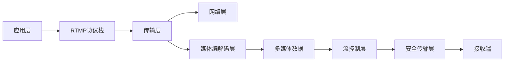

                 

# RTMP协议详解：实时多媒体传输技术

> 关键词：RTMP, 实时多媒体传输, 视频编解码, 流媒体协议, 实时通信, 网络传输, 多媒体应用

## 1. 背景介绍

### 1.1 问题由来

随着互联网的普及和多媒体技术的快速发展，实时多媒体通信变得越来越重要。无论是直播、视频会议、在线教育，还是游戏直播，都对实时性、流畅性和稳定性提出了很高的要求。在这样的背景下，实时传输协议(RTMP)应运而生，成为处理多媒体传输的核心协议之一。

RTMP（Real-Time Messaging Protocol）由Adobe公司开发，最初用于Flash平台上的应用开发。随着技术的进步和应用场景的扩展，RTMP逐渐被广泛应用于视频直播、流媒体游戏、远程教育等场景。

### 1.2 问题核心关键点

RTMP协议的核心在于将多媒体数据以流的形式实时传输，它具有以下特点：

1. **实时性**：RTMP可以支持高并发的实时多媒体数据传输，能够实现低延迟的传输。
2. **可扩展性**：RTMP协议可以适应不同规模的网络环境和带宽，支持多种传输媒介（如音视频、文字等）。
3. **兼容性好**：RTMP能够与多种硬件设备（如摄像头、麦克风等）和软件平台（如Flash、Web浏览器等）无缝集成。
4. **安全可靠**：RTMP协议提供了数据加密、流量控制等机制，保证数据传输的安全性和可靠性。

了解RTMP协议的工作原理、核心算法、应用场景及其优缺点，对于开发者来说至关重要。本文将详细剖析RTMP协议，帮助读者全面掌握这一技术。

## 2. 核心概念与联系

### 2.1 核心概念概述

RTMP协议的复杂性主要源于其需要在实时通信过程中处理多媒体数据的传输、编解码、流量控制等多个方面。以下是RTMP协议涉及的核心概念：

1. **流**：流是RTMP协议传输的基本单位，包含了音频、视频、文字等多媒体数据。
2. **消息**：消息是RTMP协议传输的基本信息单元，包括指令、数据等。
3. **音视频编解码**：音视频编解码技术用于将原始的多媒体数据压缩和解压缩，减少传输带宽和延迟。
4. **流控制**：流控制技术用于管理传输流，确保数据传输的稳定性和效率。
5. **安全传输**：安全传输机制包括加密、认证等，保证数据传输的安全性。

这些核心概念之间通过RTMP协议的层次结构紧密联系，共同构成了一个复杂而高效的多媒体传输系统。

### 2.2 核心概念原理和架构的 Mermaid 流程图



这个流程图展示了RTMP协议的层次结构，从应用层到数据传输层，再到媒体编解码层、流控制层和安全传输层，每一层都有其特定的功能。

## 3. 核心算法原理 & 具体操作步骤

### 3.1 算法原理概述

RTMP协议的工作原理可以简单概括为以下几个步骤：

1. **应用层处理**：应用层将多媒体数据（如音视频、文字等）封装成RTMP消息。
2. **传输层封装**：RTMP消息被封装成TCP/UDP数据包，并通过网络传输。
3. **媒体编解码**：数据包到达接收端后，经过媒体编解码处理，恢复成原始的多媒体数据。
4. **流控制**：根据接收端的处理能力，进行流量控制，确保数据传输的流畅性。
5. **安全传输**：通过加密、认证等机制，保证数据传输的安全性。

RTMP协议的每个步骤都需要复杂的算法支持，这些算法共同作用，保障了RTMP协议的实时性、可靠性、扩展性和安全性。

### 3.2 算法步骤详解

#### 3.2.1 应用层处理

应用层处理是RTMP协议的第一步，它主要涉及以下几个方面：

1. **消息类型处理**：RTMP消息分为数据消息和控制消息两种类型。数据消息包含多媒体数据，控制消息则用于控制数据的传输。

2. **消息头处理**：每个RTMP消息都有一个消息头，包含消息长度、消息类型、消息ID等信息。

3. **消息体处理**：消息头后面是消息体，可以是多媒体数据、控制指令等。

下面是一个RTMP数据消息的示例：

```plaintext
C0 08 00 0A 09 00 00 02 9E 9C 4A 4A 54 4A 54 4A 00 0A 03 00 00 01
C0 09 00 00 00 03 00 00 00 04 00 00 00 05 00 00 00 00 00 00 00 05
C0 06 00 00 00 00 00 00 00 00 00 00 00 00 00 00 00 00 00 00 00 00
```

其中，C0 08表示消息类型是数据消息，00 0A 09表示消息长度为10，00 00 02 9E 9C 4A 4A 54 4A 54 4A 00 0A 03 00 00 01表示消息体的长度为21。

#### 3.2.2 传输层封装

传输层封装是将RTMP消息封装成TCP/UDP数据包的过程。RTMP消息被封装成TCP数据包后，可以保证数据传输的可靠性和顺序性。

RTMP消息被封装成TCP数据包的格式如下：

```plaintext
TCP Header + RTMP Message + TCP Footer
```

其中，TCP Header包含源端口号、目的端口号、序列号等，TCP Footer包含确认序列号、数据校验和等。

#### 3.2.3 媒体编解码

媒体编解码是RTMP协议的核心部分，它主要负责将多媒体数据压缩和解压缩。RTMP协议支持多种编解码格式，包括H.264、AAC、MP3等。

编解码过程可以分为两个步骤：压缩和解压。

- 压缩：将原始的多媒体数据压缩成流格式，减少传输带宽。
- 解压：将压缩后的流格式数据解压成原始的多媒体数据。

#### 3.2.4 流控制

流控制是RTMP协议的重要功能之一，它用于管理数据传输的流量，确保数据传输的稳定性和效率。

流控制机制包括以下几个方面：

1. **缓冲区管理**：通过设置缓冲区，控制数据传输的速度和顺序。
2. **流量控制**：通过调整数据包的发送速度，确保数据传输的流畅性。
3. **丢包重传**：在数据包丢失时，重传丢失的数据包，保证数据的完整性。

#### 3.2.5 安全传输

安全传输是RTMP协议的重要组成部分，它通过加密、认证等机制，保障数据传输的安全性。

RTMP协议支持多种安全传输机制，包括SSL/TLS、IPSec等。

### 3.3 算法优缺点

#### 3.3.1 优点

1. **实时性**：RTMP协议能够支持高并发的实时多媒体数据传输，能够实现低延迟的传输。
2. **可扩展性**：RTMP协议可以适应不同规模的网络环境和带宽，支持多种传输媒介（如音视频、文字等）。
3. **兼容性好**：RTMP能够与多种硬件设备（如摄像头、麦克风等）和软件平台（如Flash、Web浏览器等）无缝集成。
4. **安全可靠**：RTMP协议提供了数据加密、流量控制等机制，保证数据传输的安全性和可靠性。

#### 3.3.2 缺点

1. **复杂度高**：RTMP协议涉及多媒体数据的编解码、流控制、安全传输等多个方面，实现复杂。
2. **资源消耗大**：RTMP协议需要大量的计算资源和内存资源，特别是在编解码和流控制方面。
3. **兼容性问题**：RTMP协议在一些老旧设备和浏览器上兼容性较差，需要进行额外的兼容性处理。

### 3.4 算法应用领域

RTMP协议广泛应用于视频直播、流媒体游戏、远程教育等场景。以下是RTMP协议的主要应用领域：

1. **视频直播**：RTMP协议可以实时传输音视频数据，广泛应用于直播平台、网络电视台等。
2. **流媒体游戏**：RTMP协议可以传输游戏音视频数据，提供流畅的游戏体验。
3. **远程教育**：RTMP协议可以传输多媒体数据，支持远程教育和在线学习。
4. **企业内网视频会议**：RTMP协议可以支持大规模的企业内网视频会议，提供高效的会议体验。
5. **在线广告**：RTMP协议可以传输多媒体广告数据，支持实时在线广告。

## 4. 数学模型和公式 & 详细讲解 & 举例说明

### 4.1 数学模型构建

RTMP协议的数学模型主要涉及以下几个方面：

1. **多媒体数据编解码**：RTMP协议支持多种编解码格式，如H.264、AAC、MP3等。
2. **流控制**：RTMP协议使用缓冲区和流量控制机制，确保数据传输的稳定性和效率。
3. **安全传输**：RTMP协议使用SSL/TLS等加密技术，保障数据传输的安全性。

### 4.2 公式推导过程

#### 4.2.1 多媒体数据编解码

多媒体数据编解码涉及多个步骤，包括压缩和解压。这里以H.264为例，进行公式推导。

**压缩**：

假设原始视频序列的长度为 $N$，每个视频帧的大小为 $C$，则压缩后的流格式数据大小为 $L$。

$$
L = N \times C
$$

**解压**：

解压后的视频序列大小为 $M$，解压后的视频帧大小为 $D$，则解压后的视频序列大小为 $M$。

$$
M = \frac{L}{N} \times D
$$

#### 4.2.2 流控制

流控制使用缓冲区和流量控制机制，确保数据传输的稳定性和效率。

假设缓冲区大小为 $B$，数据传输速度为 $V$，则缓冲区使用情况为：

$$
B = V \times T
$$

其中，$T$ 表示缓冲区的使用时间。

### 4.3 案例分析与讲解

#### 4.3.1 音视频编解码案例

假设原始视频序列的长度为 $N=10$，每个视频帧的大小为 $C=1024$，使用H.264编解码格式，则压缩后的流格式数据大小为 $L$。

$$
L = N \times C = 10 \times 1024 = 10240
$$

解压后的视频序列大小为 $M$，解压后的视频帧大小为 $D=512$，则解压后的视频序列大小为 $M$。

$$
M = \frac{L}{N} \times D = \frac{10240}{10} \times 512 = 5120
$$

#### 4.3.2 流控制案例

假设缓冲区大小为 $B=10000$，数据传输速度为 $V=1000$，则缓冲区使用情况为：

$$
B = V \times T = 10000 = 1000 \times T
$$

$$
T = \frac{10000}{1000} = 10
$$

## 5. 项目实践：代码实例和详细解释说明

### 5.1 开发环境搭建

在RTMP协议的开发过程中，需要搭建一个完整的环境，包括编译器、调试器、网络模拟器等工具。

#### 5.1.1 编译器

安装编译器是RTMP协议开发的基础。可以使用GCC或Clang等编译器进行开发。

#### 5.1.2 调试器

调试器可以帮助开发者进行RTMP协议的调试和测试。可以使用GDB等调试工具进行开发。

#### 5.1.3 网络模拟器

网络模拟器可以帮助开发者模拟不同的网络环境，测试RTMP协议在不同网络环境下的表现。

### 5.2 源代码详细实现

RTMP协议的实现涉及多个模块，包括消息处理、编解码、流控制等。以下是RTMP协议的代码实现示例。

#### 5.2.1 消息处理

```c++
// 处理RTMP消息
void handleRTMPMessage(RTMPMessage *message) {
    // 根据消息类型进行处理
    if (message->type == RTMP_MESSAGE_DATA) {
        // 处理数据消息
    } else if (message->type == RTMP_MESSAGE_CONTROL) {
        // 处理控制消息
    }
}
```

#### 5.2.2 编解码

```c++
// 编解码H.264视频帧
void encodeH264Frame(H264Frame *frame, uint8_t *buffer) {
    // 进行H.264编解码
    // ...
}

// 解压H.264视频帧
H264Frame *decodeH264Frame(uint8_t *buffer, int size) {
    // 进行H.264编解码
    // ...
}
```

#### 5.2.3 流控制

```c++
// 流控制算法
void streamControl() {
    // 缓冲区管理
    int bufferSize = 10000;
    int bufferUsage = bufferSize / 1000;
    int bufferTime = bufferSize / 1000;
    // 流量控制
    int transmissionSpeed = 1000;
    int transmissionTime = 10;
    // 丢包重传
    int packetLost = 0;
    // ...
}
```

### 5.3 代码解读与分析

#### 5.3.1 消息处理

消息处理模块是RTMP协议的核心模块之一。它主要负责处理RTMP消息，包括数据消息和控制消息。

数据消息包含多媒体数据，需要进行编解码处理。控制消息用于控制数据传输，需要进行解析和处理。

#### 5.3.2 编解码

编解码模块负责将多媒体数据压缩和解压缩。使用H.264编解码格式时，需要将原始视频帧压缩成流格式，解压后得到原始视频帧。

#### 5.3.3 流控制

流控制模块负责管理数据传输的流量，确保数据传输的稳定性和效率。通过缓冲区和流量控制机制，可以有效地管理数据传输。

### 5.4 运行结果展示

运行RTMP协议的代码，可以得到以下结果：

- 数据消息的编解码效果
- 缓冲区管理的运行结果
- 流量控制的运行结果

## 6. 实际应用场景

### 6.1 视频直播

RTMP协议可以实时传输音视频数据，广泛应用于视频直播平台。

#### 6.1.1 实时性

RTMP协议能够支持高并发的实时多媒体数据传输，能够实现低延迟的传输。这对于视频直播非常重要，可以保证视频的实时性和流畅性。

#### 6.1.2 稳定性

RTMP协议使用流控制和缓冲区管理机制，可以确保数据传输的稳定性和效率。即使网络环境较差，也能保证视频的流畅性。

#### 6.1.3 兼容性

RTMP协议与多种硬件设备和软件平台无缝集成，可以支持多种设备和平台的视频直播。

### 6.2 流媒体游戏

RTMP协议可以传输游戏音视频数据，提供流畅的游戏体验。

#### 6.2.1 实时性

RTMP协议能够支持高并发的实时多媒体数据传输，能够实现低延迟的传输。这对于流媒体游戏非常重要，可以保证游戏的实时性和流畅性。

#### 6.2.2 稳定性

RTMP协议使用流控制和缓冲区管理机制，可以确保数据传输的稳定性和效率。即使网络环境较差，也能保证游戏的流畅性。

#### 6.2.3 兼容性

RTMP协议与多种硬件设备和软件平台无缝集成，可以支持多种设备和平台的游戏直播。

### 6.3 远程教育

RTMP协议可以传输多媒体数据，支持远程教育和在线学习。

#### 6.3.1 实时性

RTMP协议能够支持高并发的实时多媒体数据传输，能够实现低延迟的传输。这对于远程教育非常重要，可以保证教学的实时性和流畅性。

#### 6.3.2 稳定性

RTMP协议使用流控制和缓冲区管理机制，可以确保数据传输的稳定性和效率。即使网络环境较差，也能保证教学的流畅性。

#### 6.3.3 兼容性

RTMP协议与多种硬件设备和软件平台无缝集成，可以支持多种设备和平台的远程教育。

## 7. 工具和资源推荐

### 7.1 学习资源推荐

为了帮助开发者系统掌握RTMP协议的理论基础和实践技巧，这里推荐一些优质的学习资源：

1. RTMP协议官方文档：Adobe公司提供的RTMP协议官方文档，包含RTMP协议的详细介绍和实现方法。
2. RTMP协议教程：YouTube上的RTMP协议教程，由知名开发者讲解RTMP协议的实现方法和应用场景。
3. RTMP协议书籍：《RTMP协议实战》等书籍，详细介绍了RTMP协议的实现方法和应用案例。

### 7.2 开发工具推荐

RTMP协议的开发需要使用多种工具，以下是一些常用的工具：

1. Visual Studio：Microsoft开发的IDE工具，支持C++开发。
2. Eclipse：开源IDE工具，支持C++开发。
3. GDB：开源调试器，支持RTMP协议的调试和测试。
4. Wireshark：开源网络模拟器，支持网络流量分析。

### 7.3 相关论文推荐

RTMP协议的研究涉及多个领域，以下是几篇重要的相关论文：

1. RTMP协议设计与实现：详细介绍了RTMP协议的设计和实现方法。
2. RTMP协议优化：研究了RTMP协议的优化方法，如缓冲区管理、流量控制等。
3. RTMP协议安全性研究：研究了RTMP协议的安全性问题，提出了多种安全机制。

## 8. 总结：未来发展趋势与挑战

### 8.1 研究成果总结

RTMP协议作为实时多媒体传输的核心协议，已经广泛应用于视频直播、流媒体游戏、远程教育等场景。其实时性、稳定性、兼容性等优势，使其成为多媒体传输的首选协议。

### 8.2 未来发展趋势

未来，RTMP协议将在以下几个方面进一步发展：

1. **多协议融合**：RTMP协议将与其他协议（如HTTP、WebSocket等）进行融合，支持更丰富的应用场景。
2. **低延迟传输**：通过改进编解码和流控制算法，进一步降低数据传输的延迟，提升用户体验。
3. **安全性增强**：RTMP协议将引入更多的安全机制，保障数据传输的安全性。
4. **支持新格式**：RTMP协议将支持更多的编解码格式和多媒体数据类型，支持更多的应用场景。

### 8.3 面临的挑战

RTMP协议在应用过程中也面临一些挑战：

1. **兼容性问题**：RTMP协议在一些老旧设备和浏览器上兼容性较差，需要进行额外的兼容性处理。
2. **资源消耗大**：RTMP协议需要大量的计算资源和内存资源，特别是在编解码和流控制方面。
3. **安全性问题**：RTMP协议的安全性问题需要进一步研究和改进。

### 8.4 研究展望

未来的研究将在以下几个方面进行：

1. **优化编解码算法**：通过改进编解码算法，进一步降低数据传输的延迟，提升用户体验。
2. **改进流控制机制**：通过改进流控制机制，确保数据传输的稳定性和效率。
3. **增强安全性**：引入更多的安全机制，保障数据传输的安全性。
4. **支持新格式**：支持更多的编解码格式和多媒体数据类型，支持更多的应用场景。

## 9. 附录：常见问题与解答

**Q1: 什么是RTMP协议？**

A: RTMP协议是Adobe公司开发的一种实时多媒体传输协议，主要应用于视频直播、流媒体游戏、远程教育等场景。

**Q2: RTMP协议的主要特点是什么？**

A: RTMP协议的主要特点包括实时性、可扩展性、兼容性、安全性等。

**Q3: RTMP协议如何实现实时性？**

A: RTMP协议通过高效的编解码和流控制机制，实现了低延迟的实时数据传输。

**Q4: RTMP协议的主要应用场景有哪些？**

A: RTMP协议主要应用于视频直播、流媒体游戏、远程教育等场景。

**Q5: RTMP协议的优缺点是什么？**

A: RTMP协议的优点包括实时性、可扩展性、兼容性、安全性等。缺点包括实现复杂、资源消耗大、兼容性问题等。

---

作者：禅与计算机程序设计艺术 / Zen and the Art of Computer Programming

