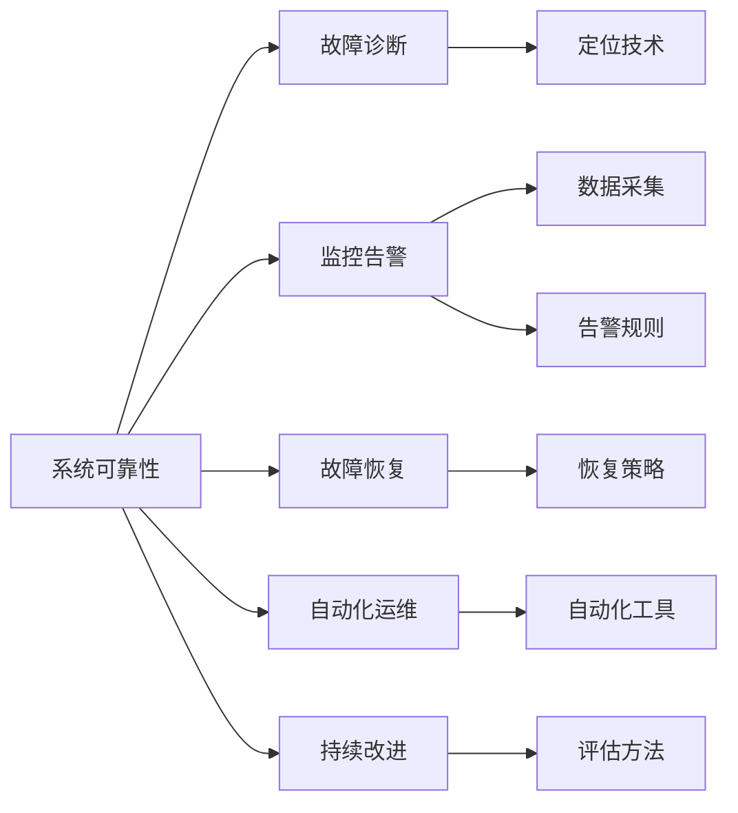

                 

# SRE实践：确保系统可靠性的方法论

> 关键词：系统可靠性, 故障诊断, 监控告警, 故障恢复, 自动化运维

## 1. 背景介绍

### 1.1 问题由来
随着互联网技术的迅猛发展和云计算的普及，各类在线服务和应用程序已成为现代社会的基石。但随之而来的是系统复杂度的不断提升和故障事件的频繁发生。如何保证系统的高可用性、高性能、低延迟、稳定性和安全性，成为了业界亟需解决的重要问题。

系统运维工程（System Operations Engineering, SRE）作为确保系统可靠性的重要实践，已成为云计算和分布式系统领域中的核心议题。SRE通过自动化和系统化的方法，提升运维效率，减少故障影响，保障系统的稳定运行。

### 1.2 问题核心关键点
SRE的核心目标是通过运维策略和技术手段，使系统在各种异常条件下仍能持续稳定运行，确保服务的可用性和性能。其关键点包括：

1. **故障诊断与定位**：在故障发生时，迅速定位问题，分析原因。
2. **监控告警与预警**：实时监控系统状态，及时发现潜在故障，并发出告警。
3. **故障恢复与修复**：自动化故障恢复流程，减少恢复时间。
4. **自动化运维与维护**：通过脚本和工具自动化运维任务，减少人工干预。
5. **持续改进与优化**：定期评估和改进运维策略，提升系统韧性。

通过这些关键点，SRE旨在构建一个高度稳定、可靠、高效的系统运维体系，以应对现代复杂系统的挑战。

### 1.3 问题研究意义
SRE实践对于保障系统可靠性具有重大意义：

1. **提升用户体验**：减少系统故障和停机时间，提供稳定可靠的服务，提升用户满意度。
2. **降低运维成本**：通过自动化和优化，减少人工干预和维护成本。
3. **优化资源利用**：通过负载均衡和容量规划，提升资源利用率，降低资源浪费。
4. **增强系统韧性**：通过风险评估和容错设计，增强系统对外部环境变化的适应能力。
5. **促进技术创新**：推动运维自动化和智能化，提升技术水平和运维效率。

通过科学有效的SRE实践，可以显著提高系统的可靠性和运维效率，推动技术进步和产业升级。

## 2. 核心概念与联系

### 2.1 核心概念概述

为更好地理解SRE实践，本节将介绍几个关键概念及其相互关系：

- **系统可靠性**：指系统在各种异常条件下保持正常运行的能力，是SRE追求的核心目标。
- **故障诊断**：在故障发生时，迅速定位问题，分析故障原因的过程。
- **监控告警**：实时监控系统状态，及时发现潜在故障，并发出告警，以预防问题发生。
- **故障恢复**：在系统发生故障时，迅速恢复服务，减少故障影响的过程。
- **自动化运维**：通过脚本和工具自动化运维任务，提升运维效率和准确性。
- **持续改进**：定期评估和改进运维策略，优化系统设计，提升系统韧性。

这些概念相互关联，共同构成了SRE实践的体系框架。通过合理应用这些方法和技术，可以实现系统可靠性的全面提升。

### 2.2 核心概念原理和架构的 Mermaid 流程图



## 3. 核心算法原理 & 具体操作步骤

### 3.1 算法原理概述

SRE实践的算法原理主要基于以下三点：

1. **系统监控与告警**：通过实时数据采集和告警规则，及时发现系统异常，发出告警。
2. **故障诊断与定位**：通过日志分析和诊断技术，快速定位故障原因，分析故障源。
3. **故障恢复与修复**：通过预设的恢复策略和自动化工具，快速恢复系统服务，减少故障影响。

### 3.2 算法步骤详解

SRE实践的详细步骤包括：

1. **系统监控与告警**：
   - 收集系统性能指标（如CPU、内存、网络流量等）。
   - 设置告警规则（如阈值、触发条件等）。
   - 实时监控系统状态，生成告警信息。

2. **故障诊断与定位**：
   - 分析告警信息，判断异常类型和影响范围。
   - 通过日志、堆栈、错误码等进行故障原因分析。
   - 定位具体故障源和问题节点。

3. **故障恢复与修复**：
   - 根据预设的恢复策略，启动故障恢复流程。
   - 使用自动化工具快速回滚、重启或切换系统服务。
   - 记录恢复过程，进行故障复盘，优化恢复策略。

4. **持续改进与优化**：
   - 定期评估系统运行状态和故障处理过程。
   - 分析故障原因，优化系统设计和运维策略。
   - 引入新工具和技术，提升系统韧性和运维效率。

### 3.3 算法优缺点

SRE实践的优点包括：

1. **实时性**：通过实时监控和告警，可以及时发现系统异常，快速响应故障。
2. **自动化**：通过脚本和工具自动化运维任务，提升运维效率和准确性。
3. **精确性**：通过系统化的诊断和定位技术，快速准确定位故障源。
4. **持续改进**：通过持续评估和优化，提升系统可靠性和运维水平。

同时，SRE实践也存在以下局限性：

1. **复杂度高**：系统监控和故障处理涉及大量技术和工具，需要较高的技术门槛。
2. **成本高**：投入大量资源在监控、告警和自动化工具上，可能面临较高的成本压力。
3. **适用性有限**：对于一些突发性或未知类型的故障，难以快速定位和恢复。

尽管存在这些局限性，但SRE实践仍是当前保障系统可靠性的主流方法。

### 3.4 算法应用领域

SRE实践在多个领域中得到了广泛应用，包括但不限于：

1. **云计算平台**：如AWS、Google Cloud、阿里云等，通过SRE确保云服务的高可用性和高性能。
2. **金融服务**：如银行、证券、保险等，通过SRE保障金融交易的稳定性和安全性。
3. **电商应用**：如淘宝、京东、Amazon等，通过SRE提升在线交易的可靠性和用户体验。
4. **社交媒体**：如Facebook、Twitter、微博等，通过SRE保障社交网络平台的稳定性和响应速度。
5. **物联网设备**：通过SRE技术实现物联网设备的可靠连接和数据传输。

这些应用领域都需要高度稳定的系统运行，SRE实践在保障系统可靠性的过程中发挥着至关重要的作用。

## 4. 数学模型和公式 & 详细讲解

### 4.1 数学模型构建

SRE实践的数学模型主要涉及系统监控、故障诊断、故障恢复等过程。以下以监控告警为例，介绍其数学模型构建。

假设系统状态向量为 $\boldsymbol{x}(t)$，其中 $t$ 表示时间，$\boldsymbol{x}$ 包括CPU使用率、内存使用率、网络流量等。系统监控的目标是实时采集这些状态数据，并通过阈值比较，判断系统是否处于异常状态。

监控告警的数学模型可以表示为：

$$
y(t) = \begin{cases}
1, & \text{if } \|\boldsymbol{x}(t) - \boldsymbol{x}^*(t)\| > \varepsilon \\
0, & \text{otherwise}
\end{cases}
$$

其中 $y(t)$ 表示监控告警信号，$\|\cdot\|$ 表示向量范数，$\varepsilon$ 表示告警阈值，$\boldsymbol{x}^*(t)$ 表示系统正常状态的基准向量。

### 4.2 公式推导过程

监控告警的推理过程如下：

1. 实时采集系统状态数据 $\boldsymbol{x}(t)$。
2. 计算当前状态与基准状态的差值 $\boldsymbol{x}(t) - \boldsymbol{x}^*(t)$。
3. 计算差值的范数 $\|\boldsymbol{x}(t) - \boldsymbol{x}^*(t)\|$。
4. 判断范数是否超过阈值 $\varepsilon$。
5. 如果范数超过阈值，则发出告警信号 $y(t)=1$，否则 $y(t)=0$。

通过上述过程，监控告警系统能够实时监控系统状态，及时发现异常情况。

### 4.3 案例分析与讲解

以某电商平台的实时监控告警为例，分析其工作原理。

假设电商平台的服务性能指标包括响应时间、并发用户数、错误率等。监控告警系统通过实时采集这些指标，计算与正常状态的差值，并进行阈值比较。例如：

- 如果响应时间超过预设阈值，发出告警信号。
- 如果并发用户数达到上限，发出告警信号。
- 如果错误率超过预设阈值，发出告警信号。

监控告警系统在发出告警后，相关运维人员会立即进行故障诊断和恢复处理，保障平台服务稳定。

## 5. 项目实践：代码实例和详细解释说明

### 5.1 开发环境搭建

在进行SRE实践的开发时，需要先搭建相应的开发环境。以下是使用Python进行Nagios脚本开发的步骤：

1. 安装Python和相关依赖：
   ```bash
   pip install python-nagios Nagios server
   ```

2. 配置Nagios服务器：
   ```bash
   nagios-server -c nagios.conf -d /path/to/logs -t nagios.pid
   ```

3. 编写Nagios监控脚本：
   ```python
   from nagios import nagiosapi
   import requests
   
   def check_server_status(url):
       response = requests.get(url)
       if response.status_code == 200:
           return "OK", "Server is up"
       else:
           return "CRITICAL", "Server is down"
   
   def main():
       nagiosapi.check_command(check_server_status, "www.example.com")
   
   if __name__ == '__main__':
       main()
   ```

4. 配置Nagios服务：
   ```bash
   nagios-config -c nagios.conf -d /path/to/logs -t nagios.pid
   ```

### 5.2 源代码详细实现

SRE实践的代码实现主要涉及监控脚本、告警脚本和故障处理脚本等。以下以监控脚本为例，展示其实现细节。

```python
from nagios import nagiosapi
import requests
   
def check_server_status(url):
    response = requests.get(url)
    if response.status_code == 200:
        return "OK", "Server is up"
    else:
        return "CRITICAL", "Server is down"
   
def main():
    nagiosapi.check_command(check_server_status, "www.example.com")
   
if __name__ == '__main__':
    main()
```

### 5.3 代码解读与分析

以下是代码的详细解读：

1. 导入必要的库和模块，包括Nagios和requests。
2. 定义检查函数`check_server_status`，用于判断服务器是否正常。
3. 在主函数`main`中，调用`nagiosapi.check_command`，将检查函数作为命令提交给Nagios服务器。
4. 设置检查命令的目标URL为`www.example.com`，以判断该服务器的状态。

通过上述代码，可以实现对服务器的实时监控和告警。

### 5.4 运行结果展示

运行上述代码后，Nagios服务器会实时监控目标URL的状态，并通过告警规则发出相应的告警信号。例如：

- 如果目标URL响应正常，Nagios服务器返回"OK"状态，不再发出告警。
- 如果目标URL响应失败，Nagios服务器返回"CRITICAL"状态，发出告警信号。

## 6. 实际应用场景

### 6.1 智能客服系统

智能客服系统是SRE实践的重要应用场景之一。通过实时监控和告警，系统能够及时发现故障，保障客户咨询的流畅性和稳定性。

例如，在智能客服系统中，监控系统可以实时采集系统负载、响应时间、用户满意度等指标，通过告警规则，及时发现系统异常。例如：

- 如果响应时间超过预设阈值，立即通知运维人员进行处理。
- 如果用户满意度低于预设水平，发出告警信号。
- 如果系统负载过高，自动扩展或缩小资源，保持系统平稳运行。

通过这些措施，智能客服系统能够提供稳定、高效、可靠的服务，提升客户体验。

### 6.2 金融交易系统

金融交易系统的高可用性和安全性至关重要。通过SRE实践，系统可以在故障发生时快速恢复，保障交易的连续性和稳定性。

例如，在金融交易系统中，监控系统可以实时采集交易量、响应时间、系统状态等指标，通过告警规则，及时发现异常情况。例如：

- 如果交易量异常，发出告警信号，通知交易员进行监控。
- 如果系统状态异常，立即切换到备用系统，保障交易的连续性。
- 如果响应时间过长，发出告警信号，立即启动故障恢复流程。

通过这些措施，金融交易系统能够提供稳定、可靠、高效的服务，保障用户的交易安全。

### 6.3 社交媒体平台

社交媒体平台需要实时监控系统状态，及时发现和处理故障，保障用户体验。

例如，在社交媒体平台上，监控系统可以实时采集用户访问量、服务器负载、网络连接等指标，通过告警规则，及时发现异常情况。例如：

- 如果用户访问量异常，发出告警信号，通知运维人员进行监控。
- 如果服务器负载过高，自动扩展或缩小资源，保持系统平稳运行。
- 如果网络连接异常，发出告警信号，立即切换到备用网络，保障用户访问。

通过这些措施，社交媒体平台能够提供稳定、可靠、高效的服务，提升用户体验。

### 6.4 未来应用展望

随着技术的不断发展，SRE实践将在更多领域得到应用，为系统可靠性带来新的突破。

- **自动化运维工具**：引入更多的自动化工具，如Kubernetes、Ansible、Puppet等，提升运维效率和准确性。
- **多云监控与告警**：实现跨云平台的多点监控与告警，保障云服务的稳定运行。
- **智能化故障诊断**：引入机器学习、AI等技术，提升故障诊断的智能化水平，实现自动定位和修复。
- **持续改进与优化**：定期评估和改进运维策略，引入新工具和技术，提升系统韧性和运维效率。

未来，SRE实践将进一步融合各种新兴技术，构建更加智能、可靠、高效的运维体系，推动系统可靠性的全面提升。

## 7. 工具和资源推荐

### 7.1 学习资源推荐

为了帮助开发者系统掌握SRE实践的理论基础和实践技巧，这里推荐一些优质的学习资源：

1. 《运维之美》系列博文：由SRE专家撰写，深入浅出地介绍了SRE的核心理念和实战技巧。
2. 《监控的艺术》书籍：介绍系统监控的原理和实践方法，是运维工程师的必读之作。
3. 《Nagios运维管理实战》书籍：全面介绍Nagios的配置、监控和告警机制，是Nagios实践的权威指南。
4. 《Kubernetes实战》书籍：介绍Kubernetes的部署、监控和运维技巧，是云原生环境的必备工具。
5. 《Google SRE文化》书籍：介绍Google SRE的文化和实践方法，是SRE理念的重要参考。

通过对这些资源的学习实践，相信你一定能够快速掌握SRE实践的精髓，并用于解决实际的系统运维问题。

### 7.2 开发工具推荐

高效的开发离不开优秀的工具支持。以下是几款用于SRE实践开发的常用工具：

1. Nagios：开源的系统监控和告警工具，支持多种监控目标和告警策略。
2. Grafana：开源的数据可视化和监控工具，支持多种数据源和告警规则。
3. Prometheus：开源的时间序列数据库和监控系统，支持高并发和大规模数据处理。
4. ELK Stack（Elasticsearch、Logstash、Kibana）：开源的数据存储、处理和可视化工具，支持日志分析和告警。
5. Ansible：开源的自动化运维工具，支持自动化配置管理和任务执行。
6. Kubernetes：开源的容器编排工具，支持自动化的部署、监控和运维。

合理利用这些工具，可以显著提升SRE实践的开发效率，加快创新迭代的步伐。

### 7.3 相关论文推荐

SRE实践的发展源于学界的持续研究。以下是几篇奠基性的相关论文，推荐阅读：

1. "A Survey on System Reliability Engineering" by S. Donohue, J. Culnan and A. Choi：全面回顾了SRE的研究背景、方法和应用场景。
2. "Monitoring Large-Scale Systems: A Survey of Research and Practice" by J. P. Gustafsson and J. K. Ham：介绍了大规模系统监控的技术和方法。
3. "Fault Diagnosis and Recovery in Distributed Systems: A Survey" by G. C. Tsirogiannis and N. N. Markakis：综述了分布式系统故障诊断和恢复的研究进展。
4. "Automated Configuration Management: A Survey" by T. Aslam, M. F. Takei and J. C. Carvalho：介绍了自动化配置管理的技术和方法。
5. "Continuous Improvement in Large-Scale Software Engineering" by G. A. Traynor and G. C. Iosue：介绍了持续改进的方法和实践，是SRE实践的重要参考。

这些论文代表了大规模系统运维的研究脉络。通过学习这些前沿成果，可以帮助研究者把握学科前进方向，激发更多的创新灵感。

## 8. 总结：未来发展趋势与挑战

### 8.1 研究成果总结

SRE实践在保障系统可靠性方面取得了显著成果，其核心思想和方法在各行各业中得到了广泛应用。主要成果包括：

1. **实时监控与告警**：通过实时监控和告警，及时发现系统异常，保障系统稳定运行。
2. **故障诊断与定位**：通过日志分析和诊断技术，快速定位故障源，优化故障处理流程。
3. **故障恢复与修复**：通过预设的恢复策略和自动化工具，快速恢复系统服务，减少故障影响。
4. **持续改进与优化**：通过定期评估和改进，提升系统可靠性和运维效率，推动技术进步。

### 8.2 未来发展趋势

展望未来，SRE实践将呈现以下几个发展趋势：

1. **自动化与智能化**：引入更多的自动化工具和智能化技术，提升运维效率和准确性。
2. **跨云和多云监控**：实现跨云平台和多云环境下的统一监控和告警，保障云服务的稳定运行。
3. **多模态监控与告警**：引入更多传感器和数据源，实现多模态数据的融合监控，提升监控的全面性和准确性。
4. **持续改进与优化**：定期评估和改进运维策略，引入新工具和技术，提升系统韧性和运维效率。

### 8.3 面临的挑战

尽管SRE实践取得了显著成效，但仍面临诸多挑战：

1. **复杂度与成本**：系统监控和故障处理涉及大量技术和工具，需要较高的技术门槛和成本投入。
2. **数据安全与隐私**：监控数据和告警信息可能涉及敏感数据，需注意数据安全和隐私保护。
3. **跨团队协作**：SRE需要跨团队协作，不同团队之间的沟通和协作难度较大。
4. **技术更新与维护**：系统监控工具和技术不断更新，运维人员需不断学习和维护。

### 8.4 研究展望

面对SRE实践面临的挑战，未来的研究需要在以下几个方面寻求新的突破：

1. **智能化故障诊断**：引入机器学习、AI等技术，提升故障诊断的智能化水平，实现自动定位和修复。
2. **跨团队协作工具**：开发跨团队协作工具，提升运维团队之间的沟通和协作效率。
3. **数据安全与隐私保护**：引入数据加密、匿名化等技术，保障监控数据和告警信息的安全与隐私。
4. **多云环境下的统一监控**：实现跨云平台和多云环境下的统一监控和告警，保障云服务的稳定运行。

这些研究方向将推动SRE实践的不断进步，提升系统可靠性和运维效率，为企业的数字化转型提供坚实保障。

## 9. 附录：常见问题与解答

**Q1: SRE和DevOps的区别是什么？**

A: SRE和DevOps都是提升软件系统可靠性和运维效率的重要实践，但二者的关注点有所不同。SRE更关注系统的稳定性和可用性，通过故障诊断和故障恢复提升系统可靠性。而DevOps则关注软件交付的效率和质量，通过自动化和持续集成提升交付速度和质量。

**Q2: 如何选择合适的监控指标？**

A: 监控指标的选择应基于系统的业务特点和运行需求，一般包括以下几个方面：
1. 性能指标：如CPU使用率、内存使用率、网络流量等。
2. 可用性指标：如系统响应时间、服务可用性、错误率等。
3. 健康指标：如系统负载、网络连接、日志异常等。
4. 业务指标：如交易量、用户访问量、转化率等。

通过选择合适的监控指标，可以全面了解系统状态，及时发现和处理异常情况。

**Q3: SRE实践的自动化工具有哪些？**

A: 常见的SRE自动化工具包括：
1. Nagios：开源的系统监控和告警工具。
2. Grafana：开源的数据可视化和监控工具。
3. Prometheus：开源的时间序列数据库和监控系统。
4. ELK Stack：开源的数据存储、处理和可视化工具。
5. Ansible：开源的自动化运维工具。
6. Kubernetes：开源的容器编排工具。

这些工具提供了丰富的功能和扩展性，是SRE实践的重要支持。

**Q4: 如何应对大规模系统的监控挑战？**

A: 大规模系统的监控挑战主要在于数据量和处理能力的提升。常见的应对方法包括：
1. 数据分片：将数据分片存储，减少单点压力。
2. 分布式采集：使用分布式数据采集工具，如Elasticsearch、Kafka等，实现大规模数据处理。
3. 多级告警：引入多级告警规则，降低告警噪声，提高告警准确性。
4. 自动化处理：引入自动化处理工具，如机器学习、AI等，提升告警处理效率。

通过这些方法，可以有效应对大规模系统的监控挑战，保障系统的稳定运行。

---

作者：禅与计算机程序设计艺术 / Zen and the Art of Computer Programming

