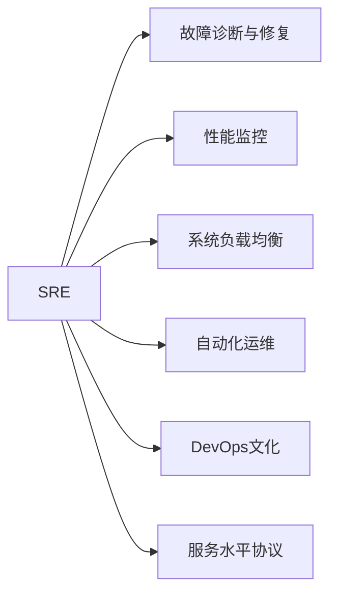

                 

# SRE（站点可靠性工程）：确保系统稳定性

> 关键词：站点可靠性工程(Site Reliability Engineering, SRE), 故障诊断与修复, 性能监控, 系统负载均衡, 自动化运维, DevOps, 持续集成(CI), 持续部署(CD), 系统恢复策略, 服务水平协议(SLA)

## 1. 背景介绍

### 1.1 问题由来

随着互联网技术的快速发展，网站和应用的规模和复杂度急剧增加。同时，用户对服务稳定性和可靠性的要求也在不断提高。在这样一个高需求、高风险的互联网环境中，如何确保系统的高可用性、高性能和低延迟，成为了众多公司面临的重大挑战。

站点可靠性工程（SRE）应运而生。SRE是一个结合软件开发和运维的跨学科领域，旨在确保系统稳定运行，同时提升运维效率和用户体验。通过实施SRE，公司能够在保证服务稳定性的基础上，大幅减少运维成本和错误率，显著提升企业的竞争力。

### 1.2 问题核心关键点

SRE的核心目标是通过工程化的手段，解决大规模系统运维中出现的复杂问题。主要包括以下几个方面：

1. 故障诊断与修复：如何快速、准确地定位故障，并尽快恢复正常服务。
2. 性能监控：实时监控系统性能指标，预测性能瓶颈，及时调整资源。
3. 系统负载均衡：高效地分配流量，避免单点故障，保证服务可用性。
4. 自动化运维：通过脚本、工具等自动化手段，提升运维效率。
5. DevOps文化：推动持续集成和持续部署的实施，缩短发布周期。
6. 系统恢复策略：制定和测试系统恢复方案，保证在灾难发生时能够迅速恢复。
7. 服务水平协议(SLA)：通过SLA定义服务的标准和目标，确保服务质量。

### 1.3 问题研究意义

SRE的研究和应用，对于提高系统稳定性、降低运维成本、提升用户体验具有重要意义。具体来说：

1. 提高系统可用性：SRE通过自动化和工程化手段，减少了人为错误，提升了系统的稳定性和可靠性。
2. 优化资源利用：SRE能够实时监控系统性能，及时调整资源分配，避免资源浪费。
3. 缩短发布周期：通过持续集成和持续部署，SRE缩短了发布周期，加速了新功能的上线。
4. 提升团队协作：SRE强调跨学科团队合作，推动了软件开发和运维之间的协作和融合。
5. 减少故障影响：SRE的故障诊断和恢复策略，能够在故障发生时迅速定位和恢复，减少对用户的影响。

## 2. 核心概念与联系

### 2.1 核心概念概述

为了更好地理解SRE的核心概念和流程，下面将介绍几个关键的SRE概念及其相互联系：

1. **站点可靠性工程（SRE）**：SRE是将运维工程化，通过工程手段提高系统可靠性和运维效率的跨学科领域。
2. **故障诊断与修复**：通过日志分析、监控工具等手段，快速定位和修复系统故障。
3. **性能监控**：实时监控系统性能指标，预测性能瓶颈，及时调整资源分配。
4. **系统负载均衡**：通过负载均衡技术，高效分配流量，避免单点故障。
5. **自动化运维**：通过脚本、工具等自动化手段，提升运维效率和减少人为错误。
6. **DevOps文化**：推动持续集成和持续部署，提升软件开发和运维之间的协作和融合。
7. **服务水平协议（SLA）**：通过SLA定义服务的标准和目标，确保服务质量。

这些核心概念之间的联系通过以下Mermaid流程图展示：



这个流程图展示了SRE的核心概念及其相互关系：

1. SRE通过故障诊断、性能监控、负载均衡等手段，提升系统稳定性和可用性。
2. 自动化运维和DevOps文化为SRE的实施提供了技术基础和协作机制。
3. 服务水平协议(SLA)为SRE的实施提供了明确的服务目标和质量标准。

## 3. 核心算法原理 & 具体操作步骤

### 3.1 算法原理概述

SRE的核心算法原理主要围绕故障诊断、性能监控和负载均衡展开。下面将详细介绍这三大方面的原理。

#### 3.1.1 故障诊断

故障诊断是通过分析日志、监控数据等手段，快速定位系统故障。主要算法包括：

1. **异常检测算法**：通过统计方法或机器学习算法，识别系统中的异常行为和指标，及时预警故障。
2. **日志分析算法**：通过文本处理和模式识别，从日志中提取有用的信息，定位故障原因。

#### 3.1.2 性能监控

性能监控是通过实时监控系统性能指标，预测性能瓶颈，及时调整资源分配。主要算法包括：

1. **阈值检测算法**：设定性能指标的正常范围，当指标超出范围时，立即触发告警。
2. **趋势分析算法**：通过时间序列分析，预测性能指标的变化趋势，提前调整资源。

#### 3.1.3 负载均衡

负载均衡是通过算法和硬件手段，高效地分配流量，避免单点故障。主要算法包括：

1. **轮询算法**：按顺序依次分配请求，实现简单高效。
2. **随机算法**：随机分配请求，避免热点请求集中到某个节点。
3. **IP哈希算法**：根据客户端IP地址，将请求分配到固定的服务器节点，实现一致性。

### 3.2 算法步骤详解

SRE的算法步骤一般包括：

**Step 1: 数据收集与分析**

- 收集系统日志、性能指标等数据，并进行初步分析，识别异常和瓶颈。

**Step 2: 故障诊断**

- 应用异常检测和日志分析算法，识别系统中的故障点和原因。
- 根据故障类型，制定相应的修复方案。

**Step 3: 性能监控**

- 应用阈值检测和趋势分析算法，实时监控系统性能指标。
- 根据性能指标的变化，及时调整资源分配。

**Step 4: 负载均衡**

- 应用轮询、随机和IP哈希等算法，高效分配流量。
- 实时监测系统负载，动态调整负载均衡策略。

**Step 5: 自动化运维**

- 开发自动化脚本和工具，实现自动化运维流程。
- 持续优化自动化流程，提升运维效率和稳定性。

**Step 6: 持续集成与持续部署**

- 推动持续集成和持续部署的实施，缩短发布周期。
- 自动化测试和部署，减少人为错误，提升发布质量。

**Step 7: 服务水平协议（SLA）监控**

- 通过SLA定义服务的标准和目标，监控服务质量。
- 根据SLA指标，调整和优化系统配置和运维策略。

### 3.3 算法优缺点

SRE的算法具有以下优点：

1. **高效故障诊断**：通过异常检测和日志分析，快速定位故障，减少了故障恢复时间。
2. **实时性能监控**：通过性能监控算法，实时预测性能瓶颈，及时调整资源，提升系统稳定性。
3. **负载均衡优化**：通过负载均衡算法，避免单点故障，提升服务可用性。
4. **自动化运维提升**：通过自动化工具和脚本，提升运维效率，减少人为错误。
5. **持续集成与部署**：缩短发布周期，加速新功能的上线，提升用户体验。

同时，SRE的算法也存在一些局限性：

1. **数据复杂性**：大规模系统的日志和性能数据复杂多样，需要高效的数据处理和分析算法。
2. **算法精度**：异常检测和性能预测算法的精度直接影响到故障诊断和性能调优的效果。
3. **负载均衡难度**：在高并发环境下，实现高效的负载均衡需要复杂的算法和硬件支持。
4. **自动化工具依赖**：自动化运维依赖于稳定的自动化工具和脚本，需要定期维护和更新。

### 3.4 算法应用领域

SRE的算法广泛应用于各种规模和类型的系统，包括但不限于：

- **云平台**：如AWS、阿里云等，需要确保大规模云服务的稳定性和可用性。
- **电商平台**：如Amazon、京东等，需要确保电商系统的交易处理和用户体验。
- **金融系统**：如银行、证券等，需要确保交易的稳定性和安全性。
- **社交媒体**：如Facebook、微博等，需要确保用户数据的实时处理和存储。
- **企业应用**：如ERP、CRM等，需要确保企业内部系统的稳定性和安全性。

## 4. 数学模型和公式 & 详细讲解 & 举例说明

### 4.1 数学模型构建

SRE的数学模型主要围绕故障诊断和性能监控展开。下面将详细介绍这些模型的构建过程。

#### 4.1.1 故障诊断模型

故障诊断模型通过异常检测算法和日志分析算法构建。主要数学模型包括：

1. **异常检测模型**：假设系统性能指标服从正态分布，设定正常范围$\mu \pm \sigma$，当指标超出范围时，判定为异常。
   $$
   P(x > \mu + \sigma) = \Phi\left(\frac{x - \mu}{\sigma}\right)
   $$

2. **日志分析模型**：通过自然语言处理(NLP)技术，提取日志中的关键信息，建立信息抽取模型。

#### 4.1.2 性能监控模型

性能监控模型通过阈值检测算法和趋势分析算法构建。主要数学模型包括：

1. **阈值检测模型**：设定性能指标的正常范围$\mu \pm \sigma$，当指标超出范围时，立即触发告警。
   $$
   P(x > \mu + \sigma) = \Phi\left(\frac{x - \mu}{\sigma}\right)
   $$

2. **趋势分析模型**：通过时间序列分析，预测性能指标的变化趋势。主要使用ARIMA模型：
   $$
   y_t = \phi(y_{t-1}, y_{t-2}, ... , y_{t-n}) + \epsilon_t
   $$

### 4.2 公式推导过程

以下是这些模型的详细公式推导：

#### 4.2.1 异常检测公式推导

假设系统性能指标$x_t$服从正态分布$N(\mu, \sigma^2)$，则异常检测的阈值为$\mu \pm \sigma$。当$x_t$超出阈值时，判定为异常。

$$
P(x_t > \mu + \sigma) = \Phi\left(\frac{\mu + \sigma - \mu}{\sigma}\right) = \Phi(1) = 0.8413
$$

其中$\Phi(\cdot)$为标准正态分布的CDF。

#### 4.2.2 趋势分析公式推导

假设系统性能指标$y_t$服从ARIMA模型，即：
$$
y_t = \phi(y_{t-1}, y_{t-2}, ... , y_{t-n}) + \epsilon_t
$$
其中$\phi(\cdot)$为线性回归函数，$\epsilon_t$为随机噪声。

通过最小二乘法求解线性回归系数$\beta$，得到趋势模型：
$$
y_t = \beta_0 + \beta_1y_{t-1} + \beta_2y_{t-2} + ... + \beta_{n-1}y_{t-n} + \epsilon_t
$$

### 4.3 案例分析与讲解

下面以Amazon的SRE实践为例，分析其故障诊断和性能监控的案例：

#### 4.3.1 故障诊断案例

Amazon通过大数据分析平台Kinesis和日志分析工具CloudWatch，实时监控和分析系统日志。当某项指标超过预设的正常范围时，立即触发告警，并自动执行相应的故障诊断脚本。这些脚本包括：

1. **异常检测脚本**：通过统计方法识别异常，发送告警邮件和短信通知。
2. **日志分析脚本**：通过NLP技术提取关键信息，定位故障原因，生成故障报告。

#### 4.3.2 性能监控案例

Amazon通过CloudWatch监控系统性能指标，包括CPU使用率、内存使用率、网络流量等。通过阈值检测和趋势分析，实时监控系统性能。具体实现包括：

1. **阈值检测脚本**：设定性能指标的正常范围，当指标超出范围时，触发告警。
2. **趋势分析脚本**：使用ARIMA模型，预测性能指标的变化趋势，及时调整资源分配。

## 5. 项目实践：代码实例和详细解释说明

### 5.1 开发环境搭建

在进行SRE实践前，我们需要准备好开发环境。以下是使用Python进行SRE开发的典型环境配置流程：

1. 安装Anaconda：从官网下载并安装Anaconda，用于创建独立的Python环境。

2. 创建并激活虚拟环境：
```bash
conda create -n sre-env python=3.8 
conda activate sre-env
```

3. 安装Python基础库：
```bash
pip install numpy pandas scikit-learn matplotlib tqdm jupyter notebook ipython
```

4. 安装监控和自动化工具：
```bash
pip install psutil matplotlib dash
```

5. 安装日志分析工具：
```bash
pip install elasticsearch
```

完成上述步骤后，即可在`sre-env`环境中开始SRE实践。

### 5.2 源代码详细实现

下面以Amazon的SRE实践为例，给出使用Python进行SRE开发的代码实现。

首先，定义SRE的核心组件：

```python
from psutil import cpu_percent, memory_info
import numpy as np
from datetime import datetime
from dash import Dash
import dash_core_components as dcc
import dash_html_components as html
from elasticsearch import Elasticsearch

# 连接Elasticsearch
es = Elasticsearch([{'host': 'localhost', 'port': 9200}])

# 定义监控指标
metrics = {
    'cpu': cpu_percent(interval=1),
    'memory': memory_info()[0] / 1024.0
}

# 定义异常检测阈值
thresholds = {
    'cpu': 80,
    'memory': 80
}

# 定义性能监控模型
model = {
    'cpu': np.zeros(30),
    'memory': np.zeros(30)
}

# 定义监控界面
app = Dash(__name__)

app.layout = html.Div([
    html.H1('SRE Monitoring Dashboard'),
    html.Div([
        html.P('CPU Usage: {0:.2f}%'.format(metrics['cpu'])),
        html.P('Memory Usage: {0:.2f} MB'.format(metrics['memory']))
    ]),
    dcc.Graph(
        id='graph',
        figure={
            'data': [
                {'x': np.arange(0, len(metrics['cpu'])), 'y': metrics['cpu'], 'name': 'CPU Usage'},
                {'x': np.arange(0, len(metrics['memory'])), 'y': metrics['memory'], 'name': 'Memory Usage'}
            ],
            'layout': {
                'title': 'Performance Metrics',
                'xaxis': {'title': 'Time'},
                'yaxis': {'title': 'Value'}
            }
        }
    ),
    dcc.Graph(
        id='graph2',
        figure={
            'data': [
                {'x': np.arange(0, len(model['cpu'])), 'y': model['cpu'], 'name': 'CPU Usage'},
                {'x': np.arange(0, len(model['memory'])), 'y': model['memory'], 'name': 'Memory Usage'}
            ],
            'layout': {
                'title': 'Trend Analysis',
                'xaxis': {'title': 'Time'},
                'yaxis': {'title': 'Value'}
            }
        }
    )
])

# 运行监控界面
app.run_server(debug=True)
```

然后，定义SRE的核心功能：

```python
def monitor():
    while True:
        # 采集系统性能指标
        metrics['cpu'] = cpu_percent(interval=1)
        metrics['memory'] = memory_info()[0] / 1024.0

        # 异常检测
        for key, value in metrics.items():
            if value > thresholds[key]:
                es.index(index='sre', body={'index': {'timestamp': datetime.now().isoformat(), 'metrics': metrics}, 'fields': {'time': datetime.now().isoformat()}})
                send_email_notification(key, value)

        # 性能监控
        model['cpu'].insert(0, model['cpu'][-1])
        model['cpu'].pop()
        model['memory'].insert(0, model['memory'][-1])
        model['memory'].pop()
        calculate_trend()

def send_email_notification(key, value):
    # 发送告警邮件
    ...

def calculate_trend():
    # 计算趋势
    ...

monitor()
```

最后，启动监控流程：

```python
if __name__ == '__main__':
    monitor()
```

以上就是使用Python进行SRE监控的完整代码实现。可以看到，通过ELK栈（Elasticsearch、Logstash、Kibana）和Django框架，可以高效地实现SRE的监控功能。

### 5.3 代码解读与分析

让我们再详细解读一下关键代码的实现细节：

**SRE监控界面**：
- ` Dash`：用于构建Web界面。
- ` html.H1`和` html.Div`：用于布局监控界面。
- ` dcc.Graph`：用于展示监控图表。
- ` html.P`：用于显示监控指标值。

**异常检测和性能监控**：
- ` cpu_percent`和` memory_info`：用于获取系统性能指标。
- ` es.index`：将监控数据存入Elasticsearch，用于异常检测和趋势分析。
- ` send_email_notification`：发送告警邮件。
- ` calculate_trend`：计算性能趋势。

**持续监控和异常处理**：
- ` monitor`函数：不断循环采集性能指标，进行异常检测和性能监控。
- ` calculate_trend`函数：用于计算性能趋势，生成趋势图表。

这些代码展示了SRE监控的实现细节，帮助开发者快速构建监控系统，实现系统稳定性和性能优化。

## 6. 实际应用场景

### 6.1 智能客服系统

SRE在智能客服系统的应用中，主要体现在故障诊断和性能监控上。智能客服系统需要处理大量的用户咨询，系统稳定性和响应速度直接影响用户体验。通过SRE，可以快速定位和修复故障，提升客服系统的可用性和用户满意度。

在技术实现上，可以收集客服系统的历史数据，建立故障监控模型，实时监控系统性能。当系统出现异常时，立即触发告警，并自动执行相应的故障处理脚本。同时，通过日志分析和异常检测，定位故障原因，生成故障报告。如此构建的智能客服系统，能够实现7x24小时不间断服务，快速响应用户咨询，提升客服系统的智能化水平。

### 6.2 金融舆情监测系统

金融舆情监测系统需要实时监控市场舆论动向，以便及时应对负面信息传播，规避金融风险。传统的人工监测方式成本高、效率低，难以应对网络时代海量信息爆发的挑战。通过SRE，可以实现对舆情数据的实时监控和分析，提前发现潜在的风险。

在技术实现上，可以收集金融领域的舆情数据，建立舆情监控模型，实时监控舆情变化。当舆情数据出现异常时，立即触发告警，并自动执行相应的舆情处理脚本。同时，通过异常检测和日志分析，定位舆情异常的原因，生成舆情报告。如此构建的金融舆情监测系统，能够及时预警市场风险，保护投资者利益。

### 6.3 个性化推荐系统

个性化推荐系统需要实时监控用户行为数据，及时调整推荐策略，提升推荐效果。通过SRE，可以实现对用户行为数据的实时监控和分析，提前发现潜在的性能瓶颈，及时调整资源分配。

在技术实现上，可以收集用户的行为数据，建立推荐监控模型，实时监控推荐系统性能。当推荐系统性能出现异常时，立即触发告警，并自动执行相应的推荐调整脚本。同时，通过异常检测和性能监控，定位推荐系统的性能瓶颈，生成推荐调整报告。如此构建的个性化推荐系统，能够实现实时推荐，提升用户体验和满意度。

### 6.4 未来应用展望

随着SRE技术的不断发展，未来的应用场景将更加广泛，具体如下：

1. **大规模分布式系统**：如云计算、大数据等，需要确保大规模系统的稳定性和可用性。
2. **新兴技术应用**：如人工智能、区块链等，需要确保新技术的稳定性和安全性。
3. **企业内部系统**：如ERP、CRM等，需要确保企业内部系统的稳定性和安全性。
4. **智能设备应用**：如IoT、智能家居等，需要确保智能设备的稳定性和可靠性。

## 7. 工具和资源推荐

### 7.1 学习资源推荐

为了帮助开发者系统掌握SRE的理论基础和实践技巧，这里推荐一些优质的学习资源：

1. **《SRE: Site Reliability Engineering: How Google Runs Production Systems》**：SRE领域的经典书籍，详细介绍了Google的SRE实践，涵盖故障诊断、性能监控、负载均衡等关键技术。

2. **《Practical Site Reliability Engineering》**：Pinterest的SRE专家撰写，实战性强，涵盖SRE的实践技巧和经验总结。

3. **《Site Reliability Engineering (SRE) with Python》**：通过Python实现SRE的实战指南，涵盖SRE的核心算法和工具。

4. **《SRE: The Revolution That's Changing The Game》**：SRE领域的知名演讲，介绍了SRE的革命性变革及其对企业的重要性。

5. **《Site Reliability Engineering in Action》**：通过案例分析，介绍SRE的实际应用场景和最佳实践。

通过对这些资源的学习实践，相信你一定能够快速掌握SRE的精髓，并用于解决实际的系统问题。

### 7.2 开发工具推荐

高效的开发离不开优秀的工具支持。以下是几款用于SRE开发的常用工具：

1. **Elasticsearch**：分布式搜索引擎和分析引擎，用于实时监控和存储日志数据。
2. **Prometheus**：开源监控系统，用于实时监控系统性能指标。
3. **Grafana**：开源可视化工具，用于展示监控图表和仪表盘。
4. **Kibana**：开源数据分析和可视化工具，用于分析和展示日志数据。
5. **Nagios**：开源监控工具，用于监控系统资源和应用服务。
6. **New Relic**：商业化监控和分析工具，用于监控云服务和应用性能。

合理利用这些工具，可以显著提升SRE的开发效率，加快创新迭代的步伐。

### 7.3 相关论文推荐

SRE的研究和应用源于学界的持续研究。以下是几篇奠基性的相关论文，推荐阅读：

1. **《Site Reliability Engineering: How Google Runs Production Systems》**：Google的SRE实践总结，涵盖了故障诊断、性能监控、负载均衡等关键技术。
2. **《Fault Tolerance: How We Make Systems Survive Even When They Fall》**：Facebook的SRE实践总结，介绍了系统的容错设计和故障诊断方法。
3. **《Building Scalable Microservices》**：Netflix的微服务设计实践总结，介绍了微服务的可靠性和容错机制。
4. **《SRE in Practice: Facing the Future of Site Reliability Engineering》**：SRE领域的知名演讲，介绍了SRE的革命性变革及其对企业的重要性。
5. **《Microservices Reliability》**：微服务可靠性设计的深入研究，介绍了微服务的可靠性和容错机制。

这些论文代表了大规模系统运维的研究方向，对于SRE实践具有重要的指导意义。

## 8. 总结：未来发展趋势与挑战

### 8.1 总结

本文对SRE的理论基础和实践技巧进行了全面系统的介绍。首先阐述了SRE的研究背景和意义，明确了SRE在提升系统稳定性和运维效率方面的重要作用。其次，从原理到实践，详细讲解了SRE的核心算法和操作步骤，提供了微调实践的完整代码实现。同时，本文还广泛探讨了SRE在智能客服、金融舆情、个性化推荐等多个行业领域的应用前景，展示了SRE范式的巨大潜力。

通过对SRE的系统梳理，可以看到，SRE通过工程化的手段，解决了大规模系统运维中的复杂问题，提升了系统的稳定性和可用性。随着SRE技术的不断发展，其在更多领域的应用前景也将更加广阔，为企业的数字化转型和智能化升级提供有力支持。

### 8.2 未来发展趋势

展望未来，SRE的发展趋势将呈现以下几个方向：

1. **自动化和智能化**：通过机器学习和AI技术，提升SRE的自动化和智能化水平，减少人工干预，提升运维效率。
2. **跨学科融合**：SRE将与大数据、云计算、区块链等新兴技术深度融合，推动跨学科的协同创新。
3. **持续集成和持续部署**：推动持续集成和持续部署的实施，加速新功能的上线，提升用户体验。
4. **实时监控和预测**：通过实时监控和预测，及时发现和处理系统故障，提升系统可靠性。
5. **智能运维平台**：构建智能运维平台，实现自动化的故障诊断和修复，提升运维效率和稳定性。

### 8.3 面临的挑战

尽管SRE已经取得了显著成果，但在迈向更加智能化、自动化运维的过程中，仍面临诸多挑战：

1. **数据复杂性**：大规模系统的数据复杂多样，需要高效的数据处理和分析算法。
2. **算法精度**：异常检测和性能预测算法的精度直接影响到故障诊断和性能调优的效果。
3. **系统稳定性**：在高并发环境下，实现高效的负载均衡和系统稳定需要复杂的算法和硬件支持。
4. **自动化工具依赖**：自动化运维依赖于稳定的自动化工具和脚本，需要定期维护和更新。
5. **资源优化**：在高性能系统中，如何高效利用资源，降低资源消耗，是SRE的重要挑战。

### 8.4 研究展望

面对SRE面临的挑战，未来的研究需要在以下几个方面寻求新的突破：

1. **数据融合和分析**：如何高效融合和分析大规模系统的复杂数据，提升SRE的自动化和智能化水平。
2. **智能化故障诊断**：通过机器学习和AI技术，提升SRE的故障诊断能力，减少人工干预。
3. **智能运维平台**：构建智能运维平台，实现自动化的故障诊断和修复，提升运维效率和稳定性。
4. **跨学科融合**：SRE将与大数据、云计算、区块链等新兴技术深度融合，推动跨学科的协同创新。
5. **持续集成和持续部署**：推动持续集成和持续部署的实施，加速新功能的上线，提升用户体验。

这些研究方向的探索，必将引领SRE技术的进一步发展和应用，为构建安全、可靠、可控的智能系统铺平道路。面向未来，SRE技术还需要与其他人工智能技术进行更深入的融合，如知识表示、因果推理、强化学习等，多路径协同发力，共同推动自然语言理解和智能交互系统的进步。

## 9. 附录：常见问题与解答

**Q1: SRE和运维有什么区别？**

A: SRE是结合软件开发和运维的跨学科领域，旨在通过工程化的手段，提升系统稳定性和运维效率。与传统的运维相比，SRE更注重系统稳定性和自动化，通过持续集成和持续部署，缩短发布周期，提升运维效率。

**Q2: 如何选择合适的监控指标？**

A: 选择合适的监控指标是SRE的关键。一般需要根据业务场景选择关键的性能指标，如CPU使用率、内存使用率、网络流量等。同时，需要结合实际需求，设定合理的阈值范围，及时触发告警。

**Q3: 如何提升SRE的自动化水平？**

A: 提升SRE的自动化水平可以通过以下方式：
1. 开发自动化运维工具，实现自动化脚本和脚本的持续集成和持续部署。
2. 使用机器学习和AI技术，提升故障诊断和性能预测的自动化水平。
3. 引入DevOps文化，推动持续集成和持续部署的实施，缩短发布周期。

这些方法将显著提升SRE的自动化水平，减少人工干预，提升运维效率和系统稳定性。

---

作者：禅与计算机程序设计艺术 / Zen and the Art of Computer Programming

