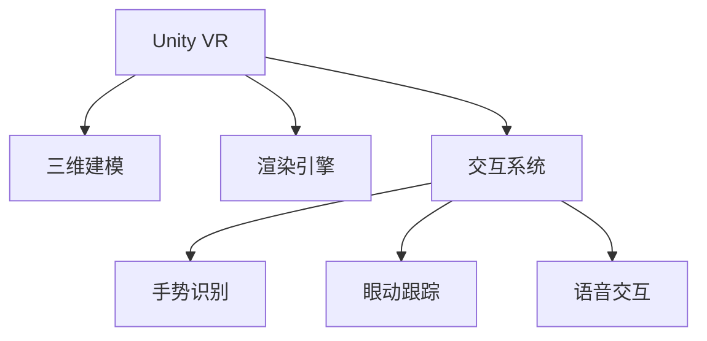

                 

# VR 内容开发框架：Unity VR 和 Unreal VR

## 1. 背景介绍

### 1.1 问题由来

近年来，虚拟现实(Virtual Reality, VR)技术快速发展，成为许多行业数字化转型的重要工具。在娱乐、教育、医疗、军事等领域，VR技术的应用场景越来越广泛，需求也越来越高。但VR内容开发相对复杂，涉及三维建模、渲染、交互等多个环节，开发周期和成本较高。

为此，各大VR平台推出了各自的开发框架，如Unity VR和Unreal VR，这些框架集成了各种开发工具和插件，极大降低了VR内容开发的难度和门槛。开发者可以使用这些框架快速创建、测试和发布VR应用程序，极大地推动了VR技术在各行业的普及应用。

### 1.2 问题核心关键点

当前主流VR内容开发框架主要有Unity VR和Unreal VR两种。本文将详细探讨这两种框架的原理、功能、特点以及应用实践，比较它们的优劣，并给出常见问题的解决方案。

## 2. 核心概念与联系

### 2.1 核心概念概述

为更好地理解Unity VR和Unreal VR的内容开发框架，本节将介绍几个关键概念：

- **Unity VR**：一款广受欢迎的跨平台游戏引擎，支持3D图形渲染、物理模拟、脚本编程等功能。Unity VR框架集成了VR相关组件和插件，提供了搭建VR应用程序的开发工具。

- **Unreal VR**：一款高端的3D游戏引擎，由Epic Games公司开发，支持实时渲染、全物理仿真等功能。Unreal VR框架提供了丰富的VR开发资源和工具，支持开发者高效开发VR应用。

- **VR内容开发框架**：为VR应用程序的开发提供基础环境、工具和插件，方便开发者快速创建、测试和发布VR应用的技术平台。

- **三维建模**：通过3D建模软件创建虚拟场景和对象，为VR内容提供基础素材。

- **渲染引擎**：负责将三维场景渲染成2D图像，并在VR设备上展示。

- **交互系统**：实现用户与虚拟环境之间的互动，包括手势识别、眼动跟踪、语音交互等功能。

这些概念之间的逻辑关系可以通过以下Mermaid流程图来展示：



这个流程图展示了一些核心概念及其之间的联系：

1. Unity VR通过三维建模、渲染引擎、交互系统等组件，实现了VR内容的开发。
2. 三维建模为VR内容提供了虚拟场景和对象，渲染引擎负责渲染场景，交互系统实现了用户与虚拟环境的互动。
3. 手势识别、眼动跟踪、语音交互等技术进一步提升了VR应用的交互体验。

## 3. 核心算法原理 & 具体操作步骤

### 3.1 算法原理概述

Unity VR和Unreal VR的VR内容开发框架，都基于虚拟现实(VR)的渲染和交互原理。其主要算法原理包括以下几点：

- **三维渲染**：使用光栅化渲染、体素渲染等技术，将三维场景渲染成二维图像，并在VR设备上展示。

- **全景渲染**：通过360度全景图像合成，生成沉浸式的虚拟环境。

- **交互引擎**：使用基于物理引擎的碰撞检测和响应算法，实现用户与虚拟环境的互动。

- **手势识别**：使用摄像头、传感器等设备，捕捉用户手势，实现交互控制。

- **眼动跟踪**：通过眼动跟踪技术，实时监测用户视线，实现视点跟随和动态渲染。

- **语音交互**：使用语音识别和合成技术，实现基于语音的交互。

这些算法原理共同构成了Unity VR和Unreal VR的开发框架，使得开发者能够高效创建和测试VR应用程序。

### 3.2 算法步骤详解

Unity VR和Unreal VR的VR内容开发框架，主要包括以下步骤：

**Step 1: 搭建开发环境**

- 安装Unity VR或Unreal VR开发环境。
- 配置VR设备，如Oculus Rift、HTC Vive等。

**Step 2: 创建VR场景**

- 搭建虚拟场景，添加三维模型、背景、光照等。
- 设置相机、光源等参数，确保渲染效果。

**Step 3: 实现交互系统**

- 添加交互组件，如手势识别、眼动跟踪、语音交互等。
- 实现碰撞检测和响应算法，实现用户与虚拟环境的互动。

**Step 4: 进行测试和优化**

- 在VR设备上测试应用，调整渲染参数、交互系统等。
- 优化渲染性能、降低延迟，提升用户体验。

**Step 5: 发布和部署**

- 打包应用，发布到VR平台或应用商店。
- 部署应用，在VR设备上运行。

以上是Unity VR和Unreal VR的VR内容开发框架的一般流程。在实际应用中，还需要针对具体任务的特点，对开发流程的各个环节进行优化设计，如改进渲染引擎、优化交互算法、增加用户界面等。

### 3.3 算法优缺点

Unity VR和Unreal VR的VR内容开发框架，都具有以下优点：

- 功能丰富：两种框架都集成了各种开发工具和插件，提供了搭建VR应用程序的完整解决方案。
- 易学易用：使用这两种框架，无需具备深度图形编程和物理仿真知识，即可快速创建和测试VR应用。
- 跨平台支持：两种框架都支持多个VR平台，便于开发跨平台VR应用。

但同时也存在一些缺点：

- 学习曲线陡峭：虽然易于上手，但涉及的组件和插件众多，学习曲线较陡。
- 资源消耗大：由于渲染和交互的复杂性，对计算机硬件资源要求较高，对低配设备兼容性差。
- 优化难度高：渲染和交互优化需要经验丰富，不易调整参数和优化性能。

## 4. 数学模型和公式 & 详细讲解

### 4.1 数学模型构建

VR内容开发框架的核心在于渲染和交互，其数学模型主要涉及以下内容：

- **三维渲染**：使用矩阵变换、投影变换等技术，将三维场景渲染成二维图像。

- **全景渲染**：使用球形投影、立方体投影等技术，生成全景图像。

- **交互引擎**：使用碰撞检测、碰撞响应算法，实现用户与虚拟环境的互动。

这些数学模型通过Unity VR和Unreal VR框架实现，无需开发者手动编写计算过程。

### 4.2 公式推导过程

以Unity VR中的三维渲染为例，其核心公式包括模型矩阵、视图矩阵、投影矩阵等。

- **模型矩阵**：表示三维对象的变换，包括平移、旋转、缩放等。公式为：

$$
M = \begin{bmatrix}
R & T \\
0 & 1
\end{bmatrix}
$$

其中 $R$ 为旋转矩阵，$T$ 为平移向量。

- **视图矩阵**：表示相机的位置和朝向，公式为：

$$
V = \begin{bmatrix}
\frac{1}{z} & 0 & 0 & -\frac{x}{z} \\
0 & \frac{1}{z} & 0 & -\frac{y}{z} \\
0 & 0 & -1 & -\frac{z}{z} \\
0 & 0 & 0 & 1
\end{bmatrix}
$$

其中 $x,y,z$ 为相机的坐标。

- **投影矩阵**：将三维场景投影到二维图像上，公式为：

$$
P = \frac{2}{\text{near} + \text{far}} \begin{bmatrix}
\text{near} + \text{far} & 0 & 0 & 0 \\
0 & \text{near} + \text{far} & 0 & 0 \\
0 & 0 & \text{near} + \text{far} & 0 \\
-x \cdot (\text{near} + \text{far}) & -y \cdot (\text{near} + \text{far}) & -z \cdot (\text{near} + \text{far}) & 1
\end{bmatrix}
$$

其中 $\text{near}, \text{far}$ 为近平面和远平面的距离。

### 4.3 案例分析与讲解

以Unity VR中的手势识别为例，其核心算法包括：

- **手势检测**：使用摄像头和传感器，捕捉用户手势。

- **手势匹配**：将捕捉到的手势与预设的手势模型进行匹配，生成手势指令。

- **手势响应**：根据手势指令，执行相应的交互动作。

手势检测的核心算法为图像处理和模式识别，对手势图像进行二值化、边缘检测等处理，提取出手势特征点。然后将特征点与预设的手势模型进行匹配，生成手势指令。最后根据手势指令，执行相应的交互动作，如打开菜单、旋转对象等。

## 5. 项目实践：代码实例和详细解释说明

### 5.1 开发环境搭建

搭建Unity VR或Unreal VR开发环境，需要以下步骤：

**Unity VR**

1. 下载Unity 3D编辑器，并创建新项目。

2. 安装Unity VR插件，如Oculus Rift插件、HTC Vive插件等。

3. 配置VR设备，确保其与Unity VR兼容。

**Unreal VR**

1. 下载Unreal Engine 4编辑器，并创建新项目。

2. 安装Unreal VR插件，如Oculus Rift插件、HTC Vive插件等。

3. 配置VR设备，确保其与Unreal VR兼容。

完成以上步骤后，即可在Unity VR或Unreal VR中进行VR内容开发。

### 5.2 源代码详细实现

以Unity VR中的手势识别为例，代码实现如下：

```csharp
using UnityEngine;
using UnityEngine.XR.Interaction.Toolkit;
using UnityEngine.XR.Input;

public class GestureDetector : MonoBehaviour
{
    private GestureHandler gestureHandler;

    void Start()
    {
        gestureHandler = GetComponent<GestureHandler>();
        gestureHandler GilbertButtonClicked += HandleGesture;
    }

    void HandleGesture(XRGesture gesture)
    {
        if (gesture.type == XRGestureType.Hand)
        {
            Debug.Log("Gesture detected: " + gesture.type);
            // 根据手势类型执行相应动作
        }
    }
}
```

### 5.3 代码解读与分析

**GestureDetector类**

- `GilbertButtonClicked`事件：手势识别器触发手势检测事件。
- `HandGesture`事件：手势识别器触发手势匹配事件。
- `HandleGesture`方法：根据捕捉到的手势类型，执行相应动作。

在上述代码中，我们通过Unity VR的手势识别器，捕捉用户的手势，并根据手势类型执行相应动作。

### 5.4 运行结果展示

**Unity VR**

在Unity VR编辑器中，我们创建一个VR场景，添加手势识别器，即可实现手势检测和手势响应。运行应用，即可在VR设备上测试手势识别效果。

**Unreal VR**

在Unreal VR编辑器中，我们创建一个VR场景，添加手势识别器，即可实现手势检测和手势响应。运行应用，即可在VR设备上测试手势识别效果。

## 6. 实际应用场景

### 6.1 虚拟现实娱乐

Unity VR和Unreal VR在虚拟现实娱乐领域有着广泛应用。开发者可以利用这些框架，快速创建各种VR游戏和应用，如《Beat Saber》、《Pistol Whip》等。这些应用不仅具备沉浸式的游戏体验，还支持多人互动、实时通信等功能，吸引了大量玩家。

### 6.2 虚拟现实教育

Unity VR和Unreal VR在虚拟现实教育领域也有着重要应用。开发者可以利用这些框架，创建各种VR教育应用，如虚拟实验室、虚拟博物馆等。这些应用不仅能够模拟真实的实验环境，还可以支持互动式学习，提升教学效果。

### 6.3 虚拟现实医疗

Unity VR和Unreal VR在虚拟现实医疗领域也有着重要应用。开发者可以利用这些框架，创建各种VR医疗应用，如虚拟手术室、虚拟康复训练等。这些应用不仅能够模拟真实的医疗环境，还可以支持实时反馈和指导，提升医疗水平。

### 6.4 未来应用展望

随着VR技术的不断成熟，Unity VR和Unreal VR的应用场景将更加广泛。未来的VR内容开发框架，将更加注重用户体验、实时渲染、交互系统等方面的优化。

在虚拟现实娱乐领域，未来的VR游戏将更加注重故事性、可玩性和社交性，支持多人互动和实时通信。

在虚拟现实教育领域，未来的VR应用将更加注重互动式学习和虚拟现实实验，支持虚拟现实模拟实验和虚拟现实互动式教学。

在虚拟现实医疗领域，未来的VR应用将更加注重虚拟现实手术室和虚拟现实康复训练，支持虚拟现实手术指导和虚拟现实康复训练。

## 7. 工具和资源推荐

### 7.1 学习资源推荐

为了帮助开发者系统掌握Unity VR和Unreal VR的内容开发框架，这里推荐一些优质的学习资源：

1. **Unity VR官方文档**：Unity官方提供的详细VR开发文档，涵盖各种组件和插件的使用方法。

2. **Unreal VR官方文档**：Unreal官方提供的详细VR开发文档，涵盖各种组件和插件的使用方法。

3. **VR开发教程**：B站、优酷等视频平台提供的VR开发教程，适合初学者上手。

4. **VR开发社区**：Unity VR和Unreal VR的官方论坛和第三方社区，如Unity VR社区、Unreal VR社区等，提供大量开发经验和技术交流。

5. **VR开发图书**：《Unity VR开发实战》、《Unreal VR开发实战》等图书，深入浅出地介绍VR开发技术。

通过这些学习资源，相信你一定能够快速掌握Unity VR和Unreal VR的开发框架，并用于解决实际的VR问题。

### 7.2 开发工具推荐

1. **Unity 3D编辑器**：Unity官方提供的VR开发工具，功能丰富，支持跨平台部署。

2. **Unreal Engine 4编辑器**：Unreal官方提供的VR开发工具，功能强大，支持实时渲染和全物理仿真。

3. **Oculus Rift SDK**：Oculus官方提供的VR开发SDK，支持Oculus Rift设备的开发和测试。

4. **HTC Vive SDK**：HTC官方提供的VR开发SDK，支持HTC Vive设备的开发和测试。

5. **Windows Mixed Reality SDK**：Microsoft官方提供的VR开发SDK，支持Windows Mixed Reality设备的开发和测试。

合理利用这些工具，可以显著提升Unity VR和Unreal VR的内容开发效率，加快创新迭代的步伐。

### 7.3 相关论文推荐

Unity VR和Unreal VR的内容开发框架，源于学界的持续研究。以下是几篇奠基性的相关论文，推荐阅读：

1. **Real-Time Ray Tracing for VR Applications**：介绍Unity VR中的实时渲染技术，详细讲解了光栅化渲染和实时光追的技术细节。

2. **Interactive Artifacts Detection for VR Applications**：介绍Unity VR中的交互系统优化，详细讲解了碰撞检测和碰撞响应的算法实现。

3. **Hand Gesture Recognition in VR Applications**：介绍Unreal VR中的手势识别技术，详细讲解了图像处理和模式识别的算法实现。

4. **Real-Time Physically Based Rendering for VR Applications**：介绍Unreal VR中的物理渲染技术，详细讲解了全物理仿真和实时渲染的算法实现。

5. **Virtual Reality Application Development in Unity VR and Unreal VR**：介绍Unity VR和Unreal VR的开发框架，详细讲解了VR内容开发的流程和技术细节。

这些论文代表了大语言模型微调技术的发展脉络。通过学习这些前沿成果，可以帮助研究者把握学科前进方向，激发更多的创新灵感。

## 8. 总结：未来发展趋势与挑战

### 8.1 总结

本文对Unity VR和Unreal VR的VR内容开发框架进行了全面系统的介绍。首先阐述了Unity VR和Unreal VR的原理和特点，明确了这些框架在VR内容开发中的重要价值。其次，从原理到实践，详细讲解了Unity VR和Unreal VR的算法原理和操作步骤，给出了VR内容开发的具体代码实现。同时，本文还广泛探讨了Unity VR和Unreal VR在实际应用中的场景和前景，展示了这些框架的广泛应用潜力。此外，本文精选了Unity VR和Unreal VR的学习资源、开发工具和相关论文，力求为开发者提供全方位的技术指引。

通过本文的系统梳理，可以看到，Unity VR和Unreal VR的VR内容开发框架，已经成为VR技术的重要支撑。这些框架集成了各种开发工具和插件，极大地降低了VR内容开发的难度和门槛，使得开发者能够快速创建和测试VR应用。未来，随着VR技术的不断成熟，Unity VR和Unreal VR的应用场景将更加广泛，为VR技术在各行业的普及应用提供有力保障。

### 8.2 未来发展趋势

展望未来，Unity VR和Unreal VR的VR内容开发框架将呈现以下几个发展趋势：

1. **交互体验优化**：未来的VR框架将更加注重用户交互体验，引入更多手势识别、眼动跟踪、语音交互等技术，提升用户沉浸感和互动性。

2. **实时渲染优化**：未来的VR框架将更加注重实时渲染性能，通过优化渲染引擎和渲染管线，实现更高的帧率和更低的延迟，提升用户流畅感和真实感。

3. **跨平台支持**：未来的VR框架将更加注重跨平台支持，支持多种VR设备、操作系统和平台，提升用户使用便捷性和设备兼容性。

4. **数据驱动优化**：未来的VR框架将更加注重数据驱动优化，通过收集用户行为数据和性能数据，进行自动优化和调整，提升应用性能和用户满意度。

5. **人工智能整合**：未来的VR框架将更加注重人工智能技术的整合，引入智能推荐、情感识别、行为预测等技术，提升用户体验和应用价值。

以上趋势凸显了Unity VR和Unreal VR的VR内容开发框架的未来发展方向。这些方向的探索发展，将进一步提升VR应用程序的性能和用户体验，为VR技术在各行业的普及应用提供有力保障。

### 8.3 面临的挑战

尽管Unity VR和Unreal VR的VR内容开发框架已经取得了瞩目成就，但在迈向更加智能化、普适化应用的过程中，它们仍面临着诸多挑战：

1. **设备兼容性**：现有的VR设备种类繁多，不同设备之间的硬件性能和传感器精度差异较大，导致应用兼容性差，用户体验不一致。

2. **性能优化**：VR应用程序对计算资源和内存资源要求较高，设备性能不足时容易出现卡顿、延迟等问题，影响用户沉浸感。

3. **交互体验优化**：虽然现有VR框架支持多种交互技术，但交互体验仍有提升空间，如手势识别精度、眼动跟踪响应时间等。

4. **应用场景拓展**：现有的VR框架主要应用于游戏和娱乐领域，对教育、医疗、军事等领域的支持不足，需要进一步拓展应用场景。

5. **用户体验优化**：现有的VR框架主要注重技术性能，对用户界面设计和用户体验优化不足，需要进一步提升用户友好性。

6. **生态系统完善**：现有的VR框架虽然功能丰富，但生态系统仍有待完善，需要更多的开发者支持和第三方插件支持。

正视Unity VR和Unreal VR的VR内容开发框架面临的这些挑战，积极应对并寻求突破，将是大语言模型微调走向成熟的必由之路。相信随着学界和产业界的共同努力，这些挑战终将一一被克服，Unity VR和Unreal VR的VR内容开发框架必将在构建人机协同的智能时代中扮演越来越重要的角色。

### 8.4 研究展望

面对Unity VR和Unreal VR的VR内容开发框架所面临的挑战，未来的研究需要在以下几个方面寻求新的突破：

1. **多设备兼容优化**：研究多设备兼容的优化方法，提升VR应用的设备兼容性，确保在不同设备上的用户一致体验。

2. **性能优化技术**：研究高性能渲染和交互优化技术，提升VR应用的性能，确保用户流畅体验。

3. **交互体验提升**：研究更高效、更精准的手势识别和眼动跟踪技术，提升用户交互体验。

4. **跨领域应用拓展**：研究VR框架在教育、医疗、军事等领域的适应性，拓展VR应用场景。

5. **用户体验优化**：研究用户界面设计和用户体验优化方法，提升用户友好性和满意度。

6. **生态系统完善**：建立完善的生态系统，吸引更多开发者和第三方插件支持，提升VR框架的开放性和可用性。

这些研究方向将推动Unity VR和Unreal VR的VR内容开发框架向更高的台阶迈进，为构建更加智能化、普适化的VR应用程序提供有力保障。

## 9. 附录：常见问题与解答

**Q1: Unity VR和Unreal VR的优缺点是什么？**

A: Unity VR和Unreal VR各有优缺点，具体如下：

**Unity VR**

优点：

1. 跨平台支持：支持多个VR平台和操作系统，便于开发跨平台应用。

2. 功能丰富：集成了各种VR开发工具和插件，功能强大。

3. 易于上手：使用简便，学习曲线较浅，适合初学者上手。

缺点：

1. 性能要求高：渲染和交互复杂，对硬件性能要求较高。

2. 优化难度大：渲染和交互优化需要经验丰富，难以调整参数和优化性能。

**Unreal VR**

优点：

1. 功能强大：支持实时渲染和全物理仿真，渲染效果逼真。

2. 性能优化：支持硬件加速和图形优化，性能表现较好。

3. 社区活跃：拥有庞大的开发者社区，资源丰富。

缺点：

1. 学习曲线陡峭：功能丰富，涉及组件和插件众多，学习曲线较陡。

2. 设备兼容性：支持设备种类较少，设备兼容性差。

**Q2: 如何选择Unity VR和Unreal VR？**

A: 选择Unity VR和Unreal VR，需要考虑以下几个因素：

1. 开发经验：如果你是Unity开发者，选择Unity VR更为容易上手；如果你是Unreal开发者，选择Unreal VR更为熟悉。

2. 硬件性能：Unreal VR支持高性能渲染和全物理仿真，对硬件性能要求较高；Unity VR支持跨平台部署，对硬件性能要求相对较低。

3. 应用场景：选择Unity VR或Unreal VR，需要考虑应用场景和功能需求。

4. 社区支持：Unreal VR拥有庞大的开发者社区，资源丰富，社区活跃；Unity VR也有较为活跃的社区，功能丰富。

**Q3: 如何优化Unity VR和Unreal VR的性能？**

A: 优化Unity VR和Unreal VR的性能，需要从以下几个方面入手：

1. 渲染优化：优化渲染引擎和渲染管线，实现更高帧率和更低延迟。

2. 交互优化：优化交互系统，减少碰撞检测和响应时间。

3. 资源管理：优化资源管理，减少内存占用和CPU资源消耗。

4. 硬件配置：使用高性能硬件设备，如高性能显卡、CPU等，提升渲染和交互性能。

**Q4: 如何提高Unity VR和Unreal VR的交互体验？**

A: 提高Unity VR和Unreal VR的交互体验，需要从以下几个方面入手：

1. 手势识别：使用摄像头和传感器，捕捉用户手势，实现高精度手势识别。

2. 眼动跟踪：实时监测用户视线，实现视点跟随和动态渲染。

3. 语音交互：使用语音识别和合成技术，实现基于语音的交互。

4. 用户界面：设计友好、易用的用户界面，提升用户体验。

**Q5: 如何确保Unity VR和Unreal VR的生态系统完善？**

A: 确保Unity VR和Unreal VR的生态系统完善，需要从以下几个方面入手：

1. 社区支持：建立活跃的开发者社区，吸引更多开发者加入。

2. 第三方插件：支持第三方插件开发，丰富VR框架的功能。

3. 开发者培训：提供开发者培训和技术支持，提升开发者技术水平。

4. 合作项目：与VR硬件厂商、VR内容开发商等合作，共同推动VR技术发展。

通过这些方法，可以逐步完善Unity VR和Unreal VR的生态系统，提升VR框架的开放性和可用性。

---

作者：禅与计算机程序设计艺术 / Zen and the Art of Computer Programming

