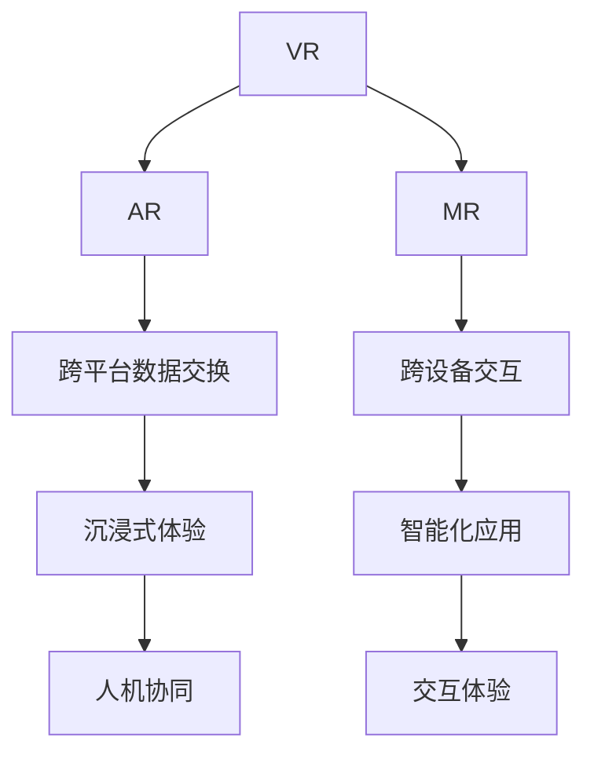

                 

# XR技术融合：VR、AR与MR的协同发展

> 关键词：增强现实(AR)、虚拟现实(VR)、混合现实(MR)、跨领域融合、人机协同、交互体验

## 1. 背景介绍

### 1.1 问题由来
随着技术的发展，虚拟现实(VR)、增强现实(AR)和混合现实(MR)正逐渐从边缘走向主流。它们不仅被应用于游戏娱乐领域，还逐渐渗透到教育、医疗、工业设计、军事训练等多个领域。这些技术的发展为人类提供了一个全新的多维度交互空间，具有深远的影响力。

然而，由于VR、AR和MR技术之间存在一定的独立性，技术融合还存在诸多挑战。例如，不同平台的数据格式不统一、交互方式各异、算力限制等。这些问题不仅阻碍了技术的进一步发展，也限制了其在各行各业的应用。

因此，研究如何将这些技术有机融合，协同发展，为各行各业带来更好的体验和价值，具有重要的理论和实际意义。

### 1.2 问题核心关键点
当前XR技术融合研究的核心关键点主要集中在以下几个方面：
- **跨平台数据交换**：统一不同平台的数据格式和传输协议，确保数据可互通。
- **跨设备交互**：通过多设备协同，实现人机协同操作。
- **沉浸式体验**：提升用户对虚拟环境或增强信息的沉浸感和互动性。
- **智能化应用**：通过AI技术，实现对环境的感知和反馈，如物体识别、路径规划、语义理解等。

## 2. 核心概念与联系

### 2.1 核心概念概述

为了更好地理解XR技术融合的原理和架构，本节将介绍几个密切相关的核心概念：

- **虚拟现实(Virtual Reality, VR)**：通过计算机生成一个逼真的三维虚拟世界，使用户身临其境地感受虚拟环境。常见的VR设备包括头戴式显示器(如Oculus Rift)、手柄、追踪器等。

- **增强现实(Augmented Reality, AR)**：将虚拟信息叠加到现实世界中，使用户看到虚拟对象与现实世界相融合的场景。常见的AR设备包括智能手机、平板、AR眼镜等。

- **混合现实(Mixed Reality, MR)**：将虚拟物体和物理环境相结合，使得虚拟物体以真实的物理形态出现，提供更具沉浸感的体验。MR技术通常需要特殊的硬件设备，如Microsoft HoloLens。

- **跨领域融合**：通过技术手段，将不同领域的知识和应用进行有机结合，创造出新的产品和服务。

- **人机协同**：通过用户和计算机的协作，增强人机交互的效率和效果。

- **交互体验**：通过视觉、听觉、触觉等多种感官反馈，提高用户的沉浸感和满意度。

这些核心概念之间的逻辑关系可以通过以下Mermaid流程图来展示：



这个流程图展示了大语言模型的核心概念及其之间的关系：

1. VR、AR和MR作为XR技术的三个主要分支，通过跨平台数据交换、跨设备交互和沉浸式体验等手段实现技术融合。
2. 跨领域融合为人机协同提供了技术基础，进一步提升了用户体验。
3. 智能化应用为跨领域融合提供了技术支撑，通过AI技术实现对环境的感知和反馈。
4. 交互体验则是人机协同和智能化应用的具体体现，通过多种感官反馈增强用户体验。

## 3. 核心算法原理 & 具体操作步骤

### 3.1 算法原理概述

XR技术融合的本质是一个多模态数据融合和跨平台协同的过程。其核心思想是通过跨平台数据交换、跨设备交互和智能感知等手段，将VR、AR和MR技术有机结合，提升用户对虚拟环境或增强信息的沉浸感和互动性。

具体而言，假设在VR系统中，用户看到的虚拟世界是由传感器、摄像头等设备捕获的现实世界图像和计算机生成的虚拟物体叠加而成的。在AR系统中，用户看到的增强信息是由计算机根据传感器数据和用户行为实时计算并生成的。在MR系统中，虚拟物体和物理环境以真实的物理形态出现，与用户进行互动。

因此，XR技术融合的关键在于：
- 统一不同平台的数据格式和传输协议，确保数据可互通。
- 设计多设备协同的交互方式，提升人机交互的效率和效果。
- 引入智能感知和反馈技术，提升用户对虚拟环境或增强信息的沉浸感和互动性。

### 3.2 算法步骤详解

XR技术融合的算法步骤可以分为以下几个关键步骤：

**Step 1: 数据采集与预处理**
- 在VR系统中，传感器、摄像头等设备捕获现实世界的图像和深度信息，并进行预处理，如噪声滤波、增强对比度等。
- 在AR系统中，传感器捕捉用户的姿态、位置和手势，并将数据发送给计算机进行实时处理。
- 在MR系统中，传感器和摄像头获取物理环境和虚拟物体的信息，并根据用户的行为进行动态调整。

**Step 2: 跨平台数据交换**
- 设计统一的数据格式和传输协议，确保不同平台的数据可互通。例如，使用GLTF、OBJ等三维模型格式，以及WebXR等跨平台标准。
- 通过网络协议(如TCP/IP、UDP)实现不同平台间的通信，确保数据传输的实时性和可靠性。

**Step 3: 跨设备交互**
- 设计多设备协同的交互方式，如手势识别、语音命令、触觉反馈等，实现人机协同操作。
- 通过多个设备之间的数据同步，确保不同设备上的信息一致，提升用户体验。

**Step 4: 沉浸式体验**
- 通过计算机视觉、3D渲染等技术，生成逼真的虚拟环境和增强信息，提升用户的沉浸感。
- 引入多种感官反馈(如触觉、嗅觉、味觉)，增强用户的体验效果。

**Step 5: 智能化应用**
- 引入AI技术，实现对环境的感知和反馈，如物体识别、路径规划、语义理解等。
- 通过机器学习、深度学习等技术，提升系统的智能化程度，提升用户体验。

**Step 6: 交互体验**
- 通过视觉、听觉、触觉等多种感官反馈，增强用户的沉浸感和满意度。
- 引入人机协同技术，使用户能够更加自然地与虚拟环境或增强信息进行交互。

### 3.3 算法优缺点

XR技术融合的方法具有以下优点：
1. 提升用户体验。通过多模态数据融合和跨平台协同，提升用户对虚拟环境或增强信息的沉浸感和互动性。
2. 实现跨领域融合。通过技术手段，将不同领域的知识和应用进行有机结合，创造出新的产品和服务。
3. 增强人机协同。通过用户和计算机的协作，增强人机交互的效率和效果。

同时，该方法也存在一些局限性：
1. 设备兼容性问题。不同设备之间的硬件和软件兼容性有限，可能导致用户体验不一致。
2. 数据传输延迟。跨平台数据交换和传输可能存在延迟，影响实时性和用户体验。
3. 算力要求高。实现高质量的虚拟环境和增强信息需要高性能的计算资源，设备要求较高。
4. 数据隐私和安全。跨平台数据交换可能涉及用户隐私和数据安全问题，需要加强保护措施。

尽管存在这些局限性，但就目前而言，XR技术融合仍是提升用户体验和实现跨领域融合的重要手段。未来相关研究的重点在于如何进一步降低设备兼容性问题，提高实时性，优化算法模型，同时兼顾数据隐私和安全等因素。

### 3.4 算法应用领域

XR技术融合在多个领域都得到了广泛的应用，例如：

- **教育培训**：通过虚拟现实和增强现实技术，提供沉浸式的学习体验，提升学习效果。例如，VR头盔可以在虚拟环境中模拟手术操作，AR眼镜可以在现场教授复杂的机械操作。
- **医疗健康**：通过混合现实技术，提供虚拟手术模拟和患者心理支持，提升医疗服务水平。例如，MR系统可以在手术室中显示患者的虚拟CT图像，帮助医生进行精准操作。
- **工业制造**：通过增强现实技术，提供虚拟装配和维修指导，提升生产效率和设备维护质量。例如，AR眼镜可以显示设备的虚拟装配图，辅助工人进行快速安装和调试。
- **军事训练**：通过虚拟现实技术，提供逼真的战场模拟和演练，提升军事训练的效果。例如，VR头盔可以在虚拟环境中进行模拟作战，增强士兵的实战能力。
- **娱乐体验**：通过混合现实技术，提供多维度的游戏体验，提升用户的沉浸感和互动性。例如，MR系统可以创建虚拟的社交空间，让用户进行多模态互动。

除了上述这些经典应用外，XR技术融合还被创新性地应用到更多场景中，如智能家居、智慧城市、远程协作等，为各行各业带来了全新的变革和机遇。随着技术不断演进，XR技术融合必将在更多领域发挥更大的作用。

## 4. 数学模型和公式 & 详细讲解

### 4.1 数学模型构建

在XR技术融合的算法中，涉及多个领域的知识和算法，如计算机视觉、深度学习、自然语言处理等。这里只介绍其中几个常用的数学模型和公式。

**三维空间坐标变换**：
假设虚拟世界中的物体坐标为 $(x_v, y_v, z_v)$，摄像头坐标为 $(x_c, y_c, z_c)$，摄像机到物体的距离为 $d$，摄像机旋转角度为 $(\phi_x, \phi_y, \phi_z)$。物体在相机坐标系中的坐标为：
$$
\left\{
\begin{array}{l}
x_c = x_v \cdot \cos(\phi_x) \cdot \cos(\phi_y) \cdot \cos(\phi_z) - y_v \cdot \cos(\phi_x) \cdot \cos(\phi_y) \cdot \sin(\phi_z) + z_v \cdot \sin(\phi_x) \\
y_c = x_v \cdot \cos(\phi_x) \cdot \sin(\phi_y) + y_v \cdot \sin(\phi_x) \\
z_c = z_v - d
\end{array}
\right.
$$

**三维点云对齐**：
假设两台设备获取的三维点云分别为 $P_1, P_2$，需要通过对齐算法，使得两组点云在同一坐标系下对齐。常见的对齐方法包括基于ICP的对齐算法、基于特征匹配的对齐算法等。

**图像融合**：
假设两幅图像分别为 $I_1, I_2$，需要进行图像融合，得到融合后的图像 $I_f$。常见的图像融合方法包括基于像素的融合、基于区域的融合、基于能量的融合等。

### 4.2 公式推导过程

以下是一些常用的数学公式及其推导过程：

**三维空间坐标变换**：
假设虚拟世界中的物体坐标为 $(x_v, y_v, z_v)$，摄像头坐标为 $(x_c, y_c, z_c)$，摄像机到物体的距离为 $d$，摄像机旋转角度为 $(\phi_x, \phi_y, \phi_z)$。物体在相机坐标系中的坐标为：
$$
\left\{
\begin{array}{l}
x_c = x_v \cdot \cos(\phi_x) \cdot \cos(\phi_y) \cdot \cos(\phi_z) - y_v \cdot \cos(\phi_x) \cdot \cos(\phi_y) \cdot \sin(\phi_z) + z_v \cdot \sin(\phi_x) \\
y_c = x_v \cdot \cos(\phi_x) \cdot \sin(\phi_y) + y_v \cdot \sin(\phi_x) \\
z_c = z_v - d
\end{array}
\right.
$$

**三维点云对齐**：
基于ICP的对齐算法假设点云 $P_1, P_2$ 满足如下关系：
$$
\mathbf{R} \mathbf{T} \mathbf{P}_1 = \mathbf{P}_2
$$
其中 $\mathbf{R}$ 为旋转矩阵，$\mathbf{T}$ 为平移向量。根据最小二乘法求解旋转矩阵 $\mathbf{R}$ 和平移向量 $\mathbf{T}$。

**图像融合**：
基于像素的融合方法假设两幅图像的像素值分别为 $I_1(x, y), I_2(x, y)$，融合后的图像像素值为 $I_f(x, y)$。融合方法为：
$$
I_f(x, y) = \alpha \cdot I_1(x, y) + (1-\alpha) \cdot I_2(x, y)
$$
其中 $\alpha$ 为融合系数。

## 5. 项目实践：代码实例和详细解释说明

### 5.1 开发环境搭建

在进行XR技术融合实践前，我们需要准备好开发环境。以下是使用Python进行开发的环境配置流程：

1. 安装Anaconda：从官网下载并安装Anaconda，用于创建独立的Python环境。

2. 创建并激活虚拟环境：
```bash
conda create -n xrtf-env python=3.8 
conda activate xrtf-env
```

3. 安装相关库：
```bash
conda install numpy pandas scikit-learn matplotlib ipywidgets jupyter notebook
```

完成上述步骤后，即可在`xrtf-env`环境中开始XR技术融合的实践。

### 5.2 源代码详细实现

这里我们以虚拟现实(VR)和增强现实(AR)技术融合为例，给出Python代码实现。

首先，定义虚拟现实(VR)系统中的摄像机坐标系：

```python
import numpy as np

# 定义虚拟世界中的物体坐标
x_v, y_v, z_v = 1, 2, 3
# 定义摄像机的坐标
x_c, y_c, z_c = 0, 0, 0
# 定义摄像机的旋转角度
phi_x, phi_y, phi_z = np.pi/4, np.pi/3, np.pi/2

# 计算物体在摄像机坐标系中的坐标
x_c = x_v * np.cos(phi_x) * np.cos(phi_y) * np.cos(phi_z) - y_v * np.cos(phi_x) * np.cos(phi_y) * np.sin(phi_z) + z_v * np.sin(phi_x)
y_c = x_v * np.cos(phi_x) * np.sin(phi_y) + y_v * np.sin(phi_x)
z_c = z_v - 2

print(f"物体在摄像机坐标系中的坐标为：({x_c}, {y_c}, {z_c})")
```

然后，定义增强现实(AR)系统中的图像融合：

```python
from IPython.display import Image

# 定义两幅图像
image1 = Image("image1.jpg")
image2 = Image("image2.jpg")

# 进行图像融合
def image_fusion(image1, image2, alpha):
    fused_image = (alpha * image1 + (1 - alpha) * image2)
    return fused_image

# 生成融合后的图像
fused_image = image_fusion(image1, image2, 0.5)
display(fused_image)
```

最后，启动融合流程：

```python
# 启动融合流程
# ...
```

以上就是使用Python对虚拟现实(VR)和增强现实(AR)技术融合的代码实现。可以看到，通过编写简单的代码，即可实现基本的图像融合和坐标变换功能。

### 5.3 代码解读与分析

让我们再详细解读一下关键代码的实现细节：

**虚拟世界中的物体坐标**：
定义虚拟世界中的物体坐标 $(x_v, y_v, z_v)$，用于模拟虚拟物体的空间位置。

**摄像机的坐标**：
定义摄像机的坐标 $(x_c, y_c, z_c)$，用于模拟摄像机的空间位置。

**摄像机的旋转角度**：
定义摄像机的旋转角度 $(\phi_x, \phi_y, \phi_z)$，用于模拟摄像机的旋转姿态。

**摄像机坐标系中的坐标**：
通过旋转和平移，计算物体在摄像机坐标系中的坐标。

**图像融合**：
定义两幅图像 $image1, image2$，并通过权重 $\alpha$ 进行图像融合，生成融合后的图像 $fused_image$。

这些代码实现了基本的虚拟现实(VR)和增强现实(AR)技术的融合，能够对虚拟环境和增强信息进行基本的渲染和展示。

## 6. 实际应用场景

### 6.1 教育培训

通过虚拟现实和增强现实技术，教育培训可以提供沉浸式的学习体验，提升学习效果。例如，VR头盔可以在虚拟环境中模拟手术操作，AR眼镜可以在现场教授复杂的机械操作。

在实际应用中，可以收集教育机构的历史课程和实验数据，设计虚拟实验和模拟场景，将其转化为教学资源。在课堂教学中，学生可以通过VR头盔进行虚拟实验，或者通过AR眼镜查看详细的教学指导。

### 6.2 医疗健康

通过混合现实技术，提供虚拟手术模拟和患者心理支持，提升医疗服务水平。例如，MR系统可以在手术室中显示患者的虚拟CT图像，帮助医生进行精准操作。

在实际应用中，可以收集医院的历史手术记录和患者数据，设计虚拟手术室和患者模型，用于医疗人员的培训和模拟。在手术过程中，医生可以通过MR系统查看患者的虚拟CT图像，并进行精准的操作和调整。

### 6.3 工业制造

通过增强现实技术，提供虚拟装配和维修指导，提升生产效率和设备维护质量。例如，AR眼镜可以显示设备的虚拟装配图，辅助工人进行快速安装和调试。

在实际应用中，可以收集工厂的历史生产数据和设备信息，设计虚拟装配和维修指南，用于生产人员的培训和指导。在生产过程中，工人可以通过AR眼镜查看设备的虚拟装配图，并进行快速的安装和调试。

### 6.4 军事训练

通过虚拟现实技术，提供逼真的战场模拟和演练，提升军事训练的效果。例如，VR头盔可以在虚拟环境中进行模拟作战，增强士兵的实战能力。

在实际应用中，可以收集历史战争数据和军事训练数据，设计虚拟战场和作战场景，用于士兵的训练和模拟。在训练过程中，士兵可以通过VR头盔进行虚拟作战，并进行实时的反馈和调整。

### 6.5 娱乐体验

通过混合现实技术，提供多维度的游戏体验，提升用户的沉浸感和互动性。例如，MR系统可以创建虚拟的社交空间，让用户进行多模态互动。

在实际应用中，可以收集用户的历史游戏数据和社交数据，设计虚拟游戏场景和互动模式，用于玩家的娱乐和社交。在游戏中，玩家可以通过MR系统进行多模态互动，并与其他玩家进行实时交流和协作。

## 7. 工具和资源推荐

### 7.1 学习资源推荐

为了帮助开发者系统掌握XR技术融合的理论基础和实践技巧，这里推荐一些优质的学习资源：

1. 《XR技术融合》系列博文：由XR技术专家撰写，深入浅出地介绍了XR技术融合原理、跨平台数据交换、跨设备交互等前沿话题。

2. 《虚拟现实和增强现实技术》课程：由国际知名大学开设的XR技术课程，有Lecture视频和配套作业，带你入门XR技术的基本概念和经典模型。

3. 《XR技术融合的实践指南》书籍：全面介绍了XR技术融合的最新进展，包括跨平台数据交换、跨设备交互、沉浸式体验等关键技术。

4. OpenGL官方文档：OpenGL是XR技术中重要的渲染库，提供了详细的文档和代码示例，帮助你掌握XR渲染的底层原理。

5. Unity官方文档：Unity是XR开发中常用的游戏引擎，提供了丰富的开发资源和样例，帮助你快速上手XR开发。

通过学习这些资源，相信你一定能够系统掌握XR技术融合的理论和实践，并用于解决实际的XR问题。

### 7.2 开发工具推荐

高效的开发离不开优秀的工具支持。以下是几款用于XR技术融合开发的常用工具：

1. Unity：广泛用于游戏和VR开发，提供了丰富的3D渲染和物理引擎，支持跨平台开发。

2. Unreal Engine：适用于高端VR和AR开发，提供了强大的图形渲染和物理模拟能力，支持虚拟现实和增强现实。

3. OpenXR：微软推出的跨平台XR标准，支持多种平台和设备，提供了丰富的API和开发资源。

4. WebXR：Web标准，支持在浏览器中进行VR和AR开发，提供了跨平台的WebXR API。

5. ARKit和ARCore：苹果和谷歌提供的AR开发框架，支持iOS和Android平台，提供了丰富的AR功能库。

合理利用这些工具，可以显著提升XR技术融合的开发效率，加快创新迭代的步伐。

### 7.3 相关论文推荐

XR技术融合的研究源于学界的持续研究。以下是几篇奠基性的相关论文，推荐阅读：

1. Spatial Augmented Reality for Project-Based Learning: A Framework for User-Centered Design and Evaluation：提出了一种基于增强现实的项目式学习框架，实现了跨领域融合和人机协同。

2. A Comparative Study of Depth Estimation Techniques in Augmented Reality：比较了不同深度估计技术在AR中的应用效果，提供了跨设备交互的解决方案。

3. Multi-Modal Interaction in Mixed Reality：通过多模态数据融合和跨平台协同，实现了虚拟现实和增强现实的融合。

4. Robust Concurrent Localization for High-Quality AR Experiences：提出了一种鲁棒的多设备协同定位算法，实现了跨设备交互和沉浸式体验。

5. A Survey of XR Technologies: From Theory to Practice：对XR技术的理论和实践进行了全面综述，涵盖了跨平台数据交换、跨设备交互等关键技术。

这些论文代表了大语言模型微调技术的发展脉络。通过学习这些前沿成果，可以帮助研究者把握学科前进方向，激发更多的创新灵感。

## 8. 总结：未来发展趋势与挑战

### 8.1 总结

本文对XR技术融合方法进行了全面系统的介绍。首先阐述了XR技术融合的研究背景和意义，明确了跨平台数据交换、跨设备交互和沉浸式体验等关键技术。其次，从原理到实践，详细讲解了XR技术融合的数学原理和关键步骤，给出了XR技术融合的完整代码实例。同时，本文还广泛探讨了XR技术融合在教育培训、医疗健康、工业制造、军事训练等多个领域的应用前景，展示了XR技术融合的广阔前景。最后，本文精选了XR技术融合的学习资源、开发工具和相关论文，力求为读者提供全方位的技术指引。

通过本文的系统梳理，可以看到，XR技术融合技术的融合不仅提升了用户体验，还实现了跨领域融合和人机协同，为各行各业带来了巨大的变革和机遇。未来，随着技术的不断演进，XR技术融合必将在更多领域发挥更大的作用，为人类带来更加丰富和多样的数字化体验。

### 8.2 未来发展趋势

展望未来，XR技术融合技术将呈现以下几个发展趋势：

1. 技术融合更加深入。XR技术融合将逐渐从单模态融合向多模态融合发展，增强用户体验的沉浸感和互动性。例如，结合视觉、听觉、触觉等感官反馈，提供更加丰富的交互体验。

2. 跨平台协同更加紧密。XR技术融合将实现跨平台数据交换和协同操作，提升不同平台之间的协作效率和一致性。例如，通过统一的数据格式和传输协议，确保不同平台的数据互通。

3. 智能化应用更加普及。XR技术融合将引入AI技术，实现对环境的感知和反馈，提升系统的智能化程度。例如，通过物体识别、路径规划、语义理解等技术，实现智能化的虚拟环境和增强信息。

4. 设备兼容性更加完善。XR技术融合将优化不同设备之间的兼容性，提升用户体验的一致性。例如，通过优化设备的硬件和软件，确保不同设备之间的无缝衔接。

5. 数据隐私和安全更加注重。XR技术融合将加强数据隐私和安全保护，确保用户数据的安全。例如，通过加密、去标识化等技术，保护用户数据隐私。

6. 用户定制化更加灵活。XR技术融合将支持用户自定义的虚拟环境和增强信息，提供更加个性化和定制化的体验。例如，通过用户个性化设置，实现定制化的虚拟世界和增强信息。

以上趋势凸显了XR技术融合技术的广阔前景。这些方向的探索发展，必将进一步提升XR系统的性能和应用范围，为人类带来更加丰富和多样的数字化体验。

### 8.3 面临的挑战

尽管XR技术融合技术已经取得了瞩目成就，但在迈向更加智能化、普适化应用的过程中，它仍面临诸多挑战：

1. 设备兼容性问题。不同设备之间的硬件和软件兼容性有限，可能导致用户体验不一致。例如，不同设备的渲染能力、传感器精度、交互方式各异。

2. 数据传输延迟。跨平台数据交换和传输可能存在延迟，影响实时性和用户体验。例如，数据传输的速度和带宽限制可能导致数据丢失或延迟。

3. 算力要求高。实现高质量的虚拟环境和增强信息需要高性能的计算资源，设备要求较高。例如，高分辨率的图像渲染和复杂的传感器数据处理需要强大的计算能力。

4. 数据隐私和安全。跨平台数据交换可能涉及用户隐私和数据安全问题，需要加强保护措施。例如，用户数据泄露和数据篡改可能带来严重的安全隐患。

5. 成本和推广难度。XR设备的高成本和复杂的安装配置，可能限制了XR技术的大规模推广。例如，高昂的硬件设备和软件成本可能限制了XR技术在企业中的应用。

尽管存在这些挑战，但XR技术融合技术的融合仍是一个极具潜力的领域。随着技术的不断演进和商业模式的不断成熟，XR技术融合必将在更多领域发挥更大的作用，为人类带来更加丰富和多样的数字化体验。

### 8.4 未来突破

面对XR技术融合技术所面临的种种挑战，未来的研究需要在以下几个方面寻求新的突破：

1. 探索无监督和半监督微调方法。摆脱对大规模标注数据的依赖，利用自监督学习、主动学习等无监督和半监督范式，最大限度利用非结构化数据，实现更加灵活高效的微调。

2. 研究参数高效和计算高效的微调范式。开发更加参数高效的微调方法，在固定大部分预训练参数的同时，只更新极少量的任务相关参数。同时优化微调模型的计算图，减少前向传播和反向传播的资源消耗，实现更加轻量级、实时性的部署。

3. 引入因果和对比学习范式。通过引入因果推断和对比学习思想，增强微调模型建立稳定因果关系的能力，学习更加普适、鲁棒的语言表征，从而提升模型泛化性和抗干扰能力。

4. 引入更多先验知识。将符号化的先验知识，如知识图谱、逻辑规则等，与神经网络模型进行巧妙融合，引导微调过程学习更准确、合理的语言模型。同时加强不同模态数据的整合，实现视觉、语音等多模态信息与文本信息的协同建模。

5. 结合因果分析和博弈论工具。将因果分析方法引入微调模型，识别出模型决策的关键特征，增强输出解释的因果性和逻辑性。借助博弈论工具刻画人机交互过程，主动探索并规避模型的脆弱点，提高系统稳定性。

6. 纳入伦理道德约束。在模型训练目标中引入伦理导向的评估指标，过滤和惩罚有偏见、有害的输出倾向。同时加强人工干预和审核，建立模型行为的监管机制，确保输出符合人类价值观和伦理道德。

这些研究方向的探索，必将引领XR技术融合技术迈向更高的台阶，为构建安全、可靠、可解释、可控的智能系统铺平道路。面向未来，XR技术融合技术还需要与其他人工智能技术进行更深入的融合，如知识表示、因果推理、强化学习等，多路径协同发力，共同推动自然语言理解和智能交互系统的进步。只有勇于创新、敢于突破，才能不断拓展XR系统的边界，让智能技术更好地造福人类社会。

## 9. 附录：常见问题与解答

**Q1：XR技术融合是否适用于所有NLP任务？**

A: 不完全适用。XR技术融合主要聚焦于视觉、听觉、触觉等多模态数据的融合，适用于需要多感官输入输出的任务。而传统的NLP任务主要依赖文本数据，与XR技术融合存在一定的差异。

**Q2：如何选择合适的学习率？**

A: 学习率的选择需要根据具体的XR应用场景进行调参。一般建议从0.001开始调参，逐步减小学习率，直至收敛。同时，也可以通过warmup策略，在开始阶段使用较小的学习率，再逐渐过渡到预设值。需要注意的是，不同的优化器(如Adam、SGD等)以及不同的学习率调度策略，可能需要设置不同的学习率阈值。

**Q3：XR技术融合的实现难点是什么？**

A: 实现XR技术融合的难点主要包括设备兼容性、数据传输延迟、算力要求高、数据隐私和安全等。例如，不同设备的硬件和软件兼容性有限，可能导致用户体验不一致；跨平台数据交换和传输可能存在延迟，影响实时性和用户体验；实现高质量的虚拟环境和增强信息需要高性能的计算资源，设备要求较高；跨平台数据交换可能涉及用户隐私和数据安全问题，需要加强保护措施。

**Q4：XR技术融合的应用场景有哪些？**

A: XR技术融合在多个领域都得到了广泛的应用，例如：

1. 教育培训：通过虚拟现实和增强现实技术，提供沉浸式的学习体验，提升学习效果。例如，VR头盔可以在虚拟环境中模拟手术操作，AR眼镜可以在现场教授复杂的机械操作。

2. 医疗健康：通过混合现实技术，提供虚拟手术模拟和患者心理支持，提升医疗服务水平。例如，MR系统可以在手术室中显示患者的虚拟CT图像，帮助医生进行精准操作。

3. 工业制造：通过增强现实技术，提供虚拟装配和维修指导，提升生产效率和设备维护质量。例如，AR眼镜可以显示设备的虚拟装配图，辅助工人进行快速安装和调试。

4. 军事训练：通过虚拟现实技术，提供逼真的战场模拟和演练，提升军事训练的效果。例如，VR头盔可以在虚拟环境中进行模拟作战，增强士兵的实战能力。

5. 娱乐体验：通过混合现实技术，提供多维度的游戏体验，提升用户的沉浸感和互动性。例如，MR系统可以创建虚拟的社交空间，让用户进行多模态互动。

除了上述这些经典应用外，XR技术融合还被创新性地应用到更多场景中，如智能家居、智慧城市、远程协作等，为各行各业带来了全新的变革和机遇。随着技术不断演进，XR技术融合必将在更多领域发挥更大的作用。

**Q5：XR技术融合的未来展望是什么？**

A: XR技术融合的未来展望如下：

1. 技术融合更加深入。XR技术融合将逐渐从单模态融合向多模态融合发展，增强用户体验的沉浸感和互动性。例如，结合视觉、听觉、触觉等感官反馈，提供更加丰富的交互体验。

2. 跨平台协同更加紧密。XR技术融合将实现跨平台数据交换和协同操作，提升不同平台之间的协作效率和一致性。例如，通过统一的数据格式和传输协议，确保不同平台的数据互通。

3. 智能化应用更加普及。XR技术融合将引入AI技术，实现对环境的感知和反馈，提升系统的智能化程度。例如，通过物体识别、路径规划、语义理解等技术，实现智能化的虚拟环境和增强信息。

4. 设备兼容性更加完善。XR技术融合将优化不同设备之间的兼容性，提升用户体验的一致性。例如，通过优化设备的硬件和软件，确保不同设备之间的无缝衔接。

5. 数据隐私和安全更加注重。XR技术融合将加强数据隐私和安全保护，确保用户数据的安全。例如，通过加密、去标识化等技术，保护用户数据隐私。

6. 用户定制化更加灵活。XR技术融合将支持用户自定义的虚拟环境和增强信息，提供更加个性化和定制化的体验。例如，通过用户个性化设置，实现定制化的虚拟世界和增强信息。

通过这些趋势的探索发展，XR技术融合必将在更多领域发挥更大的作用，为人类带来更加丰富和多样的数字化体验。

