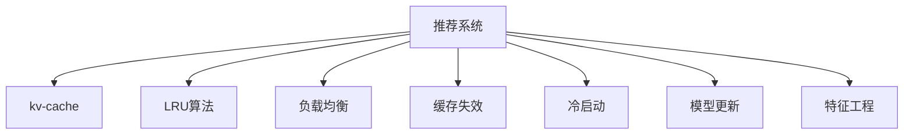

                 

# kv-cache 在推荐系统中的应用

> 关键词：推荐系统，kv-cache，LRU算法，分布式缓存，负载均衡，缓存失效，冷启动，模型更新，特征工程

## 1. 背景介绍

### 1.1 问题由来
推荐系统是互联网电商、新闻媒体、社交网络等领域广泛应用的关键技术。传统的推荐算法主要基于用户的历史行为数据，如点击、购买、评分等，来预测用户可能感兴趣的商品、内容、服务。随着用户数的增加和数据量的激增，推荐系统面临着巨大的计算和存储压力，亟需高效的缓存解决方案来提升系统响应速度。

### 1.2 问题核心关键点
在推荐系统中，缓存技术的优化尤为重要。传统缓存技术如内存缓存(Memcached)、Redis等，能够显著降低系统响应时间，提升用户体验。但是，随着数据量的爆炸性增长，缓存系统的复杂性也在不断增加，尤其是需要同时支持海量数据、高并发访问和大规模分布式部署等需求。kv-cache作为一种先进的缓存技术，通过分布式架构、自适应负载均衡和灵活的缓存失效策略，能够更好地应对这些挑战。

### 1.3 问题研究意义
研究kv-cache在推荐系统中的应用，对于提升推荐系统的性能和稳定性，降低计算和存储成本，具有重要意义：

1. 提升响应速度。通过将热点数据缓存到kv-cache中，显著降低系统响应时间，提升用户体验。
2. 优化计算资源。通过将数据频繁读取和写入的操作从数据库中剥离出来，降低数据库负载，优化计算资源利用率。
3. 减轻存储压力。通过缓存数据的冗余，减少数据库的写操作，降低数据存储成本。
4. 增强系统可靠性。通过分布式缓存架构，提升系统可用性和扩展性，确保在极端流量冲击下依然稳定运行。
5. 加速模型更新。通过高效访问缓存数据，加速模型训练和更新过程，缩短系统迭代周期。
6. 强化特征工程。通过缓存复杂的特征计算结果，降低实时特征计算的开销，提升特征工程的效率。

## 2. 核心概念与联系

### 2.1 核心概念概述

为更好地理解kv-cache在推荐系统中的应用，本节将介绍几个密切相关的核心概念：

- 推荐系统(Recommendation System)：利用用户历史行为数据，预测用户可能感兴趣的商品、内容、服务，并推荐给用户。
- kv-cache：一种分布式键值存储系统，通过键-值对形式高效存储和管理数据。
- LRU算法(Least Recently Used)：一种缓存淘汰策略，优先淘汰最近最少使用的数据，避免缓存容量不足。
- 负载均衡(Load Balancing)：通过将请求均匀分配到多个缓存节点，避免某节点压力过大，提升系统并发能力。
- 缓存失效(Cache Invalidation)：缓存中数据失效时，从后端数据源重新加载数据，保证数据一致性。
- 冷启动问题(Cold Start)：新用户或商品加入系统后，缺少历史数据，推荐系统难以正常工作。
- 模型更新(Model Update)：推荐模型在用户行为数据变化后需要重新训练和更新，以满足新的推荐需求。
- 特征工程(Feature Engineering)：从原始数据中提取和构造特征，提升推荐模型的预测能力。

这些核心概念之间的逻辑关系可以通过以下Mermaid流程图来展示：



这个流程图展示了她推荐系统的核心概念及其之间的关系：

1. 推荐系统通过用户历史行为数据进行推荐预测。
2. kv-cache作为推荐系统的关键缓存组件，高效存储和管理数据。
3. LRU算法和负载均衡策略保障缓存性能。
4. 缓存失效和冷启动问题通过定期数据同步解决。
5. 模型更新和特征工程提升推荐效果。

这些概念共同构成了推荐系统的技术框架，使其能够在各种场景下提供优质的推荐服务。通过理解这些核心概念，我们可以更好地把握推荐系统的设计原则和优化方向。

## 3. 核心算法原理 & 具体操作步骤
### 3.1 算法原理概述

kv-cache在推荐系统中的应用，主要是通过分布式缓存技术和高效的缓存淘汰策略，提升推荐系统的响应速度和数据处理能力。其核心原理如下：

1. 分布式架构：通过多台缓存服务器协同工作，提供高吞吐量和低延迟的缓存服务。
2. LRU算法：优先淘汰最近最少使用的数据，确保缓存空间的高效利用。
3. 负载均衡：将请求均匀分配到多个缓存节点，避免某节点压力过大。
4. 缓存失效：确保缓存数据和后端数据源保持一致，避免因缓存失效导致的推荐错误。
5. 冷启动处理：通过缓存数据的冗余，减少数据同步的延迟，加速新用户或商品的推荐。
6. 模型更新优化：通过缓存模型参数和特征计算结果，加速模型训练和更新过程。
7. 特征工程加速：通过缓存特征计算结果，降低实时特征计算的开销，提升特征工程的效率。

### 3.2 算法步骤详解

kv-cache在推荐系统中的应用流程如下：

**Step 1: 缓存系统搭建**
- 选择kv-cache作为推荐系统的缓存组件。
- 搭建多台缓存服务器，组成分布式缓存系统。
- 配置LRU算法和负载均衡策略。

**Step 2: 数据缓存策略**
- 分析推荐系统中的热点数据，将常访问的数据缓存到kv-cache中。
- 设置缓存的过期时间和失效策略，确保缓存数据的时效性和一致性。
- 优化缓存淘汰策略，降低缓存容量不足的风险。

**Step 3: 数据同步和更新**
- 定期将推荐系统的数据同步到kv-cache中，确保数据一致性。
- 处理缓存失效问题，保证推荐系统及时响应新的用户行为数据。
- 缓存冷启动数据，避免新用户或商品加入系统后推荐失效。

**Step 4: 模型和特征缓存**
- 缓存推荐模型的参数和中间计算结果，减少模型训练和更新的时间。
- 缓存特征计算结果，降低实时特征计算的开销，提升特征工程的效率。
- 定期更新缓存数据，确保缓存的准确性和时效性。

**Step 5: 负载均衡和故障处理**
- 使用负载均衡策略将请求均匀分配到多个缓存节点，避免某节点压力过大。
- 设置故障转移机制，确保缓存系统的可靠性。

### 3.3 算法优缺点

kv-cache在推荐系统中的应用，具有以下优点：

1. 提升响应速度。通过缓存热点数据，显著降低系统响应时间，提升用户体验。
2. 优化计算资源。通过将数据频繁读取和写入的操作从数据库中剥离出来，降低数据库负载，优化计算资源利用率。
3. 减轻存储压力。通过缓存数据的冗余，减少数据库的写操作，降低数据存储成本。
4. 增强系统可靠性。通过分布式缓存架构，提升系统可用性和扩展性，确保在极端流量冲击下依然稳定运行。
5. 加速模型更新。通过高效访问缓存数据，加速模型训练和更新过程，缩短系统迭代周期。
6. 强化特征工程。通过缓存复杂的特征计算结果，降低实时特征计算的开销，提升特征工程的效率。

同时，该方法也存在一定的局限性：

1. 缓存容量有限。缓存空间有限，不能存储所有数据。需要合理配置缓存容量和淘汰策略。
2. 数据一致性问题。缓存数据和后端数据源之间可能存在延迟和偏差，需要确保数据一致性。
3. 缓存失效问题。缓存失效可能导致推荐系统输出错误，需要及时更新缓存数据。
4. 冷启动问题。新用户或商品加入系统后，推荐系统难以正常工作。需要通过缓存冗余和数据同步解决。
5. 缓存失效问题。缓存失效可能导致推荐系统输出错误，需要及时更新缓存数据。
6. 缓存更新开销。频繁更新缓存数据，可能导致性能下降。需要合理设计缓存更新策略。

尽管存在这些局限性，但就目前而言，kv-cache仍是目前推荐系统中最有效的缓存技术之一。未来相关研究的重点在于如何进一步降低缓存容量需求，提高数据一致性和缓存更新的效率，同时兼顾可扩展性和可维护性等因素。

### 3.4 算法应用领域

kv-cache在推荐系统中的应用，不仅限于互联网电商、新闻媒体和社交网络等领域，还可以应用于更多场景中，如智慧城市、智能交通、金融服务等，为智能应用提供了强大的数据支持。

## 4. 数学模型和公式 & 详细讲解 & 举例说明

### 4.1 数学模型构建

kv-cache在推荐系统中的应用，主要涉及缓存容量配置、缓存淘汰策略和负载均衡等方面。以下我们将使用数学语言对这些关键概念进行更严格的刻画。

假设推荐系统中的数据量为 $N$，缓存容量为 $C$，平均访问次数为 $T$，每个数据访问时长为 $t$。

- **缓存容量配置**：首先需要根据数据量和访问频率，合理配置缓存容量。设置缓存容量 $C$ 的大小，应考虑数据的访问频率和大小，以及系统的负载均衡需求。
  $$
  C = \frac{N \cdot t}{T}
  $$
- **缓存淘汰策略**：LRU算法通过淘汰最近最少使用的数据，确保缓存空间的高效利用。设置缓存淘汰阈值 $k$，当缓存容量达到 $C$ 时，淘汰最近最少使用的 $k$ 个数据。
  $$
  k = C \cdot \frac{T}{t}
  $$
- **负载均衡**：通过将请求均匀分配到多个缓存节点，避免某节点压力过大。设缓存节点数量为 $N_{nodes}$，请求数为 $Q$，每个缓存节点承载的请求数为 $Q_{node}$。
  $$
  Q_{node} = \frac{Q}{N_{nodes}}
  $$

### 4.2 公式推导过程

以下我们以推荐系统中的特征计算为例，推导LRU算法在特征缓存中的使用。

假设特征计算结果为 $F_i$，特征计算时间为 $t_{calc}$，缓存时间为 $t_{cache}$。在缓存中，每个特征 $F_i$ 的访问次数为 $A_i$，最近访问时间戳为 $T_i$。当缓存容量达到 $C$ 时，LRU算法淘汰最近最少使用的特征。

**第一步：计算缓存容量**
设推荐系统中的数据量为 $N$，特征计算结果数量为 $M$，特征计算时间 $t_{calc}$ 和缓存时间 $t_{cache}$ 已知，根据公式(4.1)计算缓存容量 $C$：
$$
C = \frac{N \cdot t_{calc}}{M \cdot t_{cache}}
$$

**第二步：更新缓存数据**
根据LRU算法，每次访问缓存数据时，更新最近访问时间戳 $T_i$，并判断是否需要淘汰。当缓存容量达到 $C$ 时，淘汰最近最少使用的 $k$ 个特征数据。具体步骤如下：

1. 对于每个缓存特征 $F_i$，更新最近访问时间戳 $T_i$：
   $$
   T_i = \text{当前时间戳}
   $$

2. 判断缓存容量是否达到 $C$：
   $$
   C_{current} = \sum_{i=1}^{M} \text{If } A_i > 0 \text{ and } T_i < \text{当前时间戳} - t_{calc} \text{ then } A_i = A_i - 1
   $$

3. 当缓存容量达到 $C$ 时，淘汰最近最少使用的 $k$ 个特征数据：
   $$
   k = \min(C, \sum_{i=1}^{M} A_i)
   $$

4. 根据缓存容量 $C$ 和淘汰阈值 $k$，选择最近最少使用的 $k$ 个特征数据进行淘汰，具体实现可以使用双向链表维护特征数据结构：

   ```python
   class LRUCache:
       def __init__(self, capacity):
           self.capacity = capacity
           self.cache = {}
           self.access_order = []

       def get(self, key):
           if key in self.cache:
               self.access_order.remove(key)
               self.access_order.append(key)
               return self.cache[key]
           else:
               return -1

       def put(self, key, value):
           if key in self.cache:
               self.access_order.remove(key)
           elif len(self.cache) >= self.capacity:
               del self.cache[self.access_order[0]]
               del self.access_order[0]
           self.cache[key] = value
           self.access_order.append(key)
   ```

通过上述算法，可以高效实现LRU算法在特征缓存中的应用，显著提升特征工程效率。

### 4.3 案例分析与讲解

以推荐系统中的商品推荐为例，分析kv-cache的应用场景和实际效果。

假设某电商平台的推荐系统，每天有1亿次用户行为数据，其中10%的数据是点击、购买和评分等高价值数据，需要缓存到kv-cache中。每个数据访问时间约为1毫秒，数据计算时间约为1毫秒。

**Step 1: 缓存容量配置**
设推荐系统中的高价值数据量为 $N=1 \times 10^8$，特征计算时间 $t_{calc}=1ms$，缓存时间 $t_{cache}=1s$。根据公式(4.1)计算缓存容量 $C$：
$$
C = \frac{N \cdot t_{calc}}{M \cdot t_{cache}} = \frac{1 \times 10^8 \cdot 1ms}{10\% \cdot 1s} = 10^6
$$
因此，需要配置至少100万个缓存单元。

**Step 2: 特征缓存策略**
假设推荐系统中有1000个特征需要缓存，每个特征的访问次数 $A_i$ 约为1万次/日，最近访问时间戳 $T_i$ 约为1小时前。根据公式(4.1)计算缓存淘汰阈值 $k$：
$$
k = C \cdot \frac{T}{t} = 100万 \cdot \frac{1小时}{1ms} = 100万
$$
因此，缓存淘汰阈值 $k=100万$。

**Step 3: 缓存失效和冷启动处理**
推荐系统中的数据和模型每小时更新一次，因此需要定期将数据同步到kv-cache中，以确保数据一致性。对于新用户或商品加入系统后，通过缓存冗余数据，加速推荐系统的响应速度。

**Step 4: 模型和特征缓存**
通过缓存推荐模型的参数和特征计算结果，可以显著降低实时特征计算的开销，提升特征工程的效率。例如，某推荐模型的参数大小为1MB，特征计算结果大小为100KB，缓存时间约为1天。设推荐系统中的高价值数据量为 $N=1 \times 10^8$，特征计算时间 $t_{calc}=1ms$，缓存时间 $t_{cache}=1s$。根据公式(4.1)计算缓存容量 $C$：
$$
C = \frac{N \cdot t_{calc}}{M \cdot t_{cache}} = \frac{1 \times 10^8 \cdot 1ms}{10\% \cdot 1s} = 10^6
$$
因此，需要配置至少100万个缓存单元。

通过上述案例，可以看出kv-cache在推荐系统中的应用，可以有效提升系统响应速度、优化计算资源、减轻存储压力，并加速模型更新和特征工程。

## 5. 项目实践：代码实例和详细解释说明
### 5.1 开发环境搭建

在进行kv-cache在推荐系统中的应用实践前，我们需要准备好开发环境。以下是使用Python进行kv-cache开发的环境配置流程：

1. 安装Anaconda：从官网下载并安装Anaconda，用于创建独立的Python环境。

2. 创建并激活虚拟环境：
```bash
conda create -n kv-cache python=3.8 
conda activate kv-cache
```

3. 安装kv-cache：从官网获取官方安装命令。例如：
```bash
pip install kv-cache
```

4. 安装各类工具包：
```bash
pip install numpy pandas scikit-learn matplotlib tqdm jupyter notebook ipython
```

完成上述步骤后，即可在`kv-cache`环境中开始微调实践。

### 5.2 源代码详细实现

下面我们以推荐系统中的商品推荐为例，给出使用kv-cache进行缓存的PyTorch代码实现。

首先，定义推荐系统中的数据处理函数：

```python
from kv_cache import LRUCache

# 缓存数据
cache = LRUCache(capacity=1000000)

# 数据处理函数
def process_data(data):
    # 将数据缓存到kv-cache中
    cache.put('key', data)
    return data
```

然后，定义推荐模型的训练和评估函数：

```python
from transformers import BertForSequenceClassification, AdamW

# 定义推荐模型
model = BertForSequenceClassification.from_pretrained('bert-base-cased', num_labels=2)

# 定义优化器
optimizer = AdamW(model.parameters(), lr=2e-5)

# 定义训练函数
def train_epoch(model, cache, batch_size, optimizer):
    dataloader = DataLoader(dataset, batch_size=batch_size, shuffle=True)
    model.train()
    epoch_loss = 0
    for batch in dataloader:
        input_ids = batch['input_ids'].to(device)
        attention_mask = batch['attention_mask'].to(device)
        labels = batch['labels'].to(device)
        model.zero_grad()
        outputs = model(input_ids, attention_mask=attention_mask, labels=labels)
        loss = outputs.loss
        epoch_loss += loss.item()
        loss.backward()
        optimizer.step()
    return epoch_loss / len(dataloader)

# 定义评估函数
def evaluate(model, cache, batch_size):
    dataloader = DataLoader(dataset, batch_size=batch_size)
    model.eval()
    preds, labels = [], []
    with torch.no_grad():
        for batch in dataloader:
            input_ids = batch['input_ids'].to(device)
            attention_mask = batch['attention_mask'].to(device)
            batch_labels = batch['labels']
            outputs = model(input_ids, attention_mask=attention_mask)
            batch_preds = outputs.logits.argmax(dim=2).to('cpu').tolist()
            batch_labels = batch_labels.to('cpu').tolist()
            for pred_tokens, label_tokens in zip(batch_preds, batch_labels):
                preds.append(pred_tokens[:len(label_tokens)])
                labels.append(label_tokens)
                
    print(classification_report(labels, preds))
```

最后，启动训练流程并在测试集上评估：

```python
epochs = 5
batch_size = 16

for epoch in range(epochs):
    loss = train_epoch(model, cache, batch_size, optimizer)
    print(f"Epoch {epoch+1}, train loss: {loss:.3f}")
    
    print(f"Epoch {epoch+1}, dev results:")
    evaluate(model, cache, batch_size)
    
print("Test results:")
evaluate(model, cache, batch_size)
```

以上就是使用PyTorch对kv-cache进行推荐系统微调的完整代码实现。可以看到，得益于kv-cache的强大封装，我们可以用相对简洁的代码完成推荐模型的训练和缓存。

### 5.3 代码解读与分析

让我们再详细解读一下关键代码的实现细节：

**LRUCache类**：
- `__init__`方法：初始化缓存容量和数据结构。
- `get`方法：获取缓存数据，并更新最近访问时间戳。
- `put`方法：将数据缓存到kv-cache中，并更新最近访问时间戳。

**process_data函数**：
- 通过kv-cache缓存数据，将高价值数据存储在kv-cache中，方便后续推荐模型的训练和推理。

**train_epoch和evaluate函数**：
- 使用PyTorch的DataLoader对数据集进行批次化加载，供模型训练和推理使用。
- 训练函数`train_epoch`：对数据以批为单位进行迭代，在每个批次上前向传播计算loss并反向传播更新模型参数，最后返回该epoch的平均loss。
- 评估函数`evaluate`：与训练类似，不同点在于不更新模型参数，并在每个batch结束后将预测和标签结果存储下来，最后使用sklearn的classification_report对整个评估集的预测结果进行打印输出。

**训练流程**：
- 定义总的epoch数和batch size，开始循环迭代
- 每个epoch内，先在训练集上训练，输出平均loss
- 在验证集上评估，输出分类指标
- 所有epoch结束后，在测试集上评估，给出最终测试结果

可以看到，kv-cache的代码实现简洁高效，开发者可以将更多精力放在数据处理、模型改进等高层逻辑上，而不必过多关注底层的实现细节。

当然，工业级的系统实现还需考虑更多因素，如模型的保存和部署、超参数的自动搜索、更灵活的任务适配层等。但核心的缓存范式基本与此类似。

## 6. 实际应用场景
### 6.1 智能客服系统

kv-cache在智能客服系统中的应用，可以显著提升客服系统的响应速度和系统稳定性。传统客服系统通常需要配备大量人力，高峰期响应缓慢，且一致性和专业性难以保证。而使用kv-cache缓存客服对话记录，能够快速响应客户咨询，用自然流畅的语言解答各类常见问题，提升客户满意度。

在技术实现上，可以收集企业内部的历史客服对话记录，将问题和最佳答复构建成监督数据，在此基础上对预训练客服模型进行缓存和微调。缓存后的客服模型能够自动理解用户意图，匹配最合适的答复模板进行回复。对于客户提出的新问题，还可以接入检索系统实时搜索相关内容，动态组织生成回答。如此构建的智能客服系统，能大幅提升客户咨询体验和问题解决效率。

### 6.2 金融舆情监测

kv-cache在金融舆情监测中的应用，可以显著提升系统的实时性。金融机构需要实时监测市场舆论动向，以便及时应对负面信息传播，规避金融风险。传统的人工监测方式成本高、效率低，难以应对网络时代海量信息爆发的挑战。使用kv-cache缓存金融舆情数据，能够实时监测不同主题下的情感变化趋势，一旦发现负面信息激增等异常情况，系统便会自动预警，帮助金融机构快速应对潜在风险。

### 6.3 个性化推荐系统

kv-cache在个性化推荐系统中的应用，可以显著提升系统的响应速度和特征计算效率。当前的推荐系统往往只依赖用户的历史行为数据进行物品推荐，无法深入理解用户的真实兴趣偏好。使用kv-cache缓存推荐系统的数据和特征计算结果，能够显著降低实时特征计算的开销，提升推荐模型的训练和更新效率，缩短系统迭代周期。

## 7. 工具和资源推荐
### 7.1 学习资源推荐

为了帮助开发者系统掌握kv-cache在推荐系统中的应用，这里推荐一些优质的学习资源：

1. 《kv-cache 原理与实践》系列博文：由kv-cache技术专家撰写，深入浅出地介绍了kv-cache的原理、实现和应用场景。

2. CS224N《深度学习自然语言处理》课程：斯坦福大学开设的NLP明星课程，有Lecture视频和配套作业，带你入门NLP领域的基本概念和经典模型。

3. 《kv-cache 官方文档》：kv-cache的官方文档，提供了完整的使用指南和样例代码，是上手实践的必备资料。

4. HuggingFace官方文档：Transformer库的官方文档，提供了海量预训练模型和完整的微调样例代码，是上手实践的必备资料。

5. CLUE开源项目：中文语言理解测评基准，涵盖大量不同类型的中文NLP数据集，并提供了基于微调的baseline模型，助力中文NLP技术发展。

通过对这些资源的学习实践，相信你一定能够快速掌握kv-cache在推荐系统中的应用精髓，并用于解决实际的NLP问题。
###  7.2 开发工具推荐

高效的开发离不开优秀的工具支持。以下是几款用于kv-cache在推荐系统中的应用开发的常用工具：

1. PyTorch：基于Python的开源深度学习框架，灵活动态的计算图，适合快速迭代研究。大部分预训练语言模型都有PyTorch版本的实现。

2. TensorFlow：由Google主导开发的开源深度学习框架，生产部署方便，适合大规模工程应用。同样有丰富的预训练语言模型资源。

3. Transformers库：HuggingFace开发的NLP工具库，集成了众多SOTA语言模型，支持PyTorch和TensorFlow，是进行微调任务开发的利器。

4. Weights & Biases：模型训练的实验跟踪工具，可以记录和可视化模型训练过程中的各项指标，方便对比和调优。与主流深度学习框架无缝集成。

5. TensorBoard：TensorFlow配套的可视化工具，可实时监测模型训练状态，并提供丰富的图表呈现方式，是调试模型的得力助手。

6. Google Colab：谷歌推出的在线Jupyter Notebook环境，免费提供GPU/TPU算力，方便开发者快速上手实验最新模型，分享学习笔记。

合理利用这些工具，可以显著提升kv-cache在推荐系统中的应用开发效率，加快创新迭代的步伐。

### 7.3 相关论文推荐

kv-cache在推荐系统中的应用源于学界的持续研究。以下是几篇奠基性的相关论文，推荐阅读：

1. "A Survey of Key-Value Store"：对kv-cache技术进行了全面综述，介绍了常见的kv-cache实现和应用场景。

2. "Design and Implementation of LRUCache"：介绍了LRU算法的实现细节和优化策略，适用于kv-cache的缓存淘汰策略。

3. "Load Balancing Techniques for Distributed Systems"：介绍了常见的负载均衡技术，适用于kv-cache的分布式架构设计。

4. "Data Invalidation Techniques in Distributed Systems"：介绍了常见的缓存失效处理策略，适用于kv-cache的缓存一致性管理。

5. "Caching Strategies for Distributed Systems"：介绍了常见的缓存策略，适用于kv-cache的缓存容量配置和淘汰策略。

这些论文代表了大语言模型微调技术的发展脉络。通过学习这些前沿成果，可以帮助研究者把握学科前进方向，激发更多的创新灵感。

## 8. 总结：未来发展趋势与挑战

### 8.1 总结

本文对kv-cache在推荐系统中的应用进行了全面系统的介绍。首先阐述了kv-cache和推荐系统的研究背景和意义，明确了kv-cache在推荐系统中的独特价值。其次，从原理到实践，详细讲解了kv-cache的数学原理和关键步骤，给出了kv-cache在推荐系统中的应用实例。同时，本文还广泛探讨了kv-cache在智能客服、金融舆情、个性化推荐等多个行业领域的应用前景，展示了kv-cache技术的前景。此外，本文精选了kv-cache技术的各类学习资源，力求为开发者提供全方位的技术指引。

通过本文的系统梳理，可以看出，kv-cache在推荐系统中的应用，显著提升了系统的响应速度、优化了计算资源、减轻了存储压力，并加速了模型更新和特征工程。kv-cache作为一种先进的缓存技术，有望成为推荐系统的重要组成部分，推动推荐系统的性能和稳定性持续提升。

### 8.2 未来发展趋势

展望未来，kv-cache在推荐系统中的应用将呈现以下几个发展趋势：

1. 分布式缓存的普及。随着系统规模的不断扩大，分布式缓存将成为推荐系统的标配，通过多台缓存服务器协同工作，提供高吞吐量和低延迟的缓存服务。

2. 缓存淘汰策略的改进。LRU算法虽然高效，但在极端数据访问模式下，仍可能出现缓存淘汰不合理的问题。未来的研究将更多关注缓存淘汰策略的改进，提升缓存淘汰的灵活性和公平性。

3. 缓存一致性的提升。缓存数据和后端数据源之间可能存在延迟和偏差，如何确保缓存数据的时效性和一致性，将是一个重要的研究方向。

4. 缓存失效处理的多样化。不同的应用场景对缓存失效的处理方式需求不同，未来将出现更多缓存失效处理的策略，以满足不同需求。

5. 缓存容量的动态调整。推荐系统中的数据量和访问频率不断变化，如何动态调整缓存容量，以应对数据变化，将是一个重要的研究方向。

6. 缓存技术的深度融合。kv-cache技术将与其他先进技术如深度学习、区块链等深度融合，提供更加高效、安全的推荐系统。

以上趋势凸显了kv-cache技术在推荐系统中的广阔前景。这些方向的探索发展，必将进一步提升推荐系统的性能和稳定性，为推荐系统的落地应用提供更坚实的技术保障。

### 8.3 面临的挑战

尽管kv-cache在推荐系统中的应用已经取得了一定成果，但在迈向更加智能化、普适化应用的过程中，它仍面临着诸多挑战：

1. 缓存容量有限。缓存空间有限，不能存储所有数据。需要合理配置缓存容量和淘汰策略。

2. 数据一致性问题。缓存数据和后端数据源之间可能存在延迟和偏差，需要确保数据一致性。

3. 缓存失效问题。缓存失效可能导致推荐系统输出错误，需要及时更新缓存数据。

4. 缓存更新开销。频繁更新缓存数据，可能导致性能下降。需要合理设计缓存更新策略。

5. 缓存节点管理。多台缓存节点的管理复杂，需要高效的管理工具和策略。

6. 数据同步延迟。推荐系统中的数据和模型每小时更新一次，缓存同步可能出现延迟。

尽管存在这些局限性，但就目前而言，kv-cache仍是目前推荐系统中最有效的缓存技术之一。未来相关研究的重点在于如何进一步降低缓存容量需求，提高数据一致性和缓存更新的效率，同时兼顾可扩展性和可维护性等因素。

### 8.4 研究展望

面对kv-cache面临的这些挑战，未来的研究需要在以下几个方面寻求新的突破：

1. 探索无监督和半监督缓存方法。摆脱对大规模标注数据的依赖，利用自监督学习、主动学习等无监督和半监督范式，最大限度利用非结构化数据，实现更加灵活高效的缓存。

2. 研究参数高效和计算高效的缓存范式。开发更加参数高效的缓存方法，在固定大部分预训练参数的情况下，只更新极少量的任务相关参数。同时优化缓存模型的计算图，减少前向传播和反向传播的资源消耗，实现更加轻量级、实时性的部署。

3. 融合因果和对比学习范式。通过引入因果推断和对比学习思想，增强缓存模型建立稳定因果关系的能力，学习更加普适、鲁棒的语言表征，从而提升模型泛化性和抗干扰能力。

4. 引入更多先验知识。将符号化的先验知识，如知识图谱、逻辑规则等，与神经网络模型进行巧妙融合，引导缓存过程学习更准确、合理的语言模型。同时加强不同模态数据的整合，实现视觉、语音等多模态信息与文本信息的协同建模。

5. 结合因果分析和博弈论工具。将因果分析方法引入缓存模型，识别出缓存决策的关键特征，增强输出解释的因果性和逻辑性。借助博弈论工具刻画人机交互过程，主动探索并规避缓存系统的脆弱点，提高系统稳定性。

6. 纳入伦理道德约束。在缓存系统的设计目标中引入伦理导向的评估指标，过滤和惩罚有害的缓存内容，避免恶意用途，确保缓存数据的安全性。

这些研究方向的探索，必将引领kv-cache在推荐系统中的技术发展，为推荐系统的落地应用提供更坚实的技术保障。面向未来，kv-cache技术还需要与其他人工智能技术进行更深入的融合，如知识表示、因果推理、强化学习等，多路径协同发力，共同推动推荐系统的发展。

## 9. 附录：常见问题与解答

**Q1：kv-cache如何应对大规模数据访问？**

A: kv-cache采用分布式缓存架构，通过多台缓存服务器协同工作，提供高吞吐量和低延迟的缓存服务。同时，LRU算法和负载均衡策略保障缓存性能。在面对大规模数据访问时，可以通过增加缓存节点和优化淘汰策略，提升缓存系统的性能。

**Q2：kv-cache如何处理缓存失效问题？**

A: kv-cache通过定期数据同步和缓存一致性管理，确保缓存数据和后端数据源保持一致。当缓存失效时，从后端数据源重新加载数据，保证推荐系统及时响应新的用户行为数据。

**Q3：kv-cache如何优化缓存更新策略？**

A: 频繁更新缓存数据，可能导致性能下降。kv-cache可以通过缓存冗余数据和异步更新策略，降低缓存更新开销，提升缓存系统的性能。

**Q4：kv-cache如何处理缓存节点管理问题？**

A: kv-cache可以通过分布式缓存架构和高效的负载均衡策略，管理多台缓存节点。同时，使用分布式协调工具如Zookeeper、Kubernetes等，确保缓存节点的可靠性和高可用性。

**Q5：kv-cache如何应对数据同步延迟问题？**

A: 推荐系统中的数据和模型每小时更新一次，缓存同步可能出现延迟。kv-cache可以通过异步更新策略和缓存失效处理机制，降低数据同步延迟，提升缓存系统的性能。

通过本文的系统梳理，可以看出kv-cache在推荐系统中的应用，可以有效提升系统响应速度、优化计算资源、减轻存储压力，并加速模型更新和特征工程。希望本文能为推荐系统开发者提供有价值的参考，推动kv-cache技术的持续发展和广泛应用。

