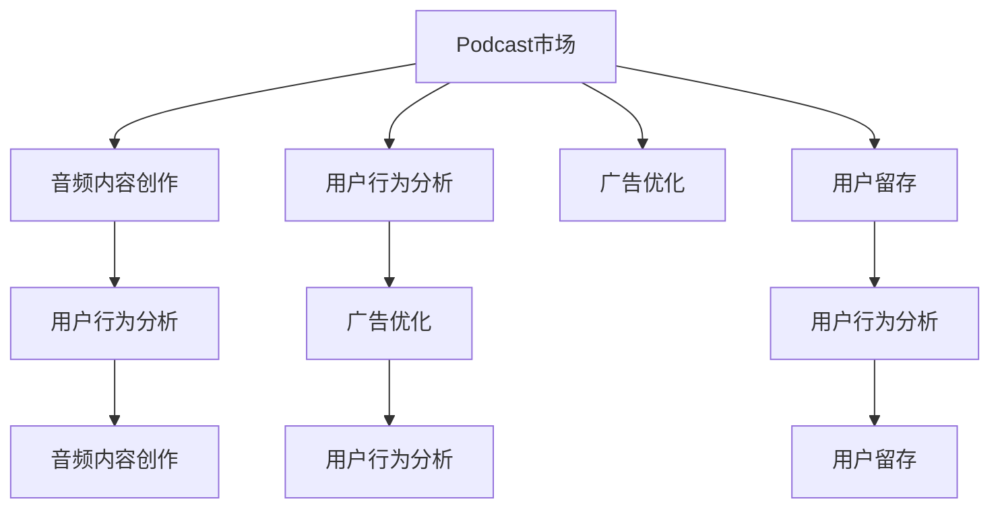

                 

# podcast市场：注意力经济的新蓝海

> 关键词：podcast市场, 注意力经济, 音频内容创作, 人工智能, 广告优化, 用户行为分析, 数据驱动决策

## 1. 背景介绍

### 1.1 问题由来

随着移动互联网的普及和智能手机的广泛使用，越来越多的人开始利用碎片时间，通过移动设备收听播客。根据Statista的统计数据，2020年全球播客听众人数已达2.5亿，预计2026年将达到5.52亿。播客市场快速成长，吸引了大量音频内容创作者和广告商的目光。

播客市场的兴起，不仅为传统广播行业带来了新的发展机遇，更催生了音频注意力经济的新蓝海。在音频注意力经济中，核心资源从广播时间转变为用户的注意力，如何高效利用用户注意力成为行业发展的关键。

### 1.2 问题核心关键点

当前播客市场面临的核心问题是：如何在海量的音频内容中，高效地吸引和保持用户的注意力，从而最大化广告和订阅收益。主要问题包括：

1. **内容创作**：如何创造有吸引力的播客内容，满足用户的兴趣和需求？
2. **用户行为分析**：如何分析用户的收听行为，了解用户的偏好和需求？
3. **广告优化**：如何在播客中高效投放广告，提升广告效果？
4. **用户留存**：如何提高用户的订阅和留存率，提升用户的忠诚度？

这些问题都需要结合人工智能技术，通过数据驱动的决策和智能优化，来解决播客市场的注意力经济挑战。

### 1.3 问题研究意义

播客市场的兴起，不仅带来了新的商业机会，也为音频内容创作者和广告商提供了新的挑战和机遇。利用人工智能技术，可以有效提升播客内容的质量和广告效果，增加用户的订阅和留存率，从而在竞争激烈的市场中占据优势。

通过研究播客市场中的注意力经济，有助于更好地理解用户需求和行为，推动音频内容的创新和优化，为广告商和创作者提供数据支持的决策方案，实现商业价值的最大化。

## 2. 核心概念与联系

### 2.1 核心概念概述

为更好地理解播客市场中的注意力经济，本节将介绍几个密切相关的核心概念：

- **Podcast市场**：指通过播客平台（如Spotify、Apple Podcasts等）进行音频内容分发和消费的市场。
- **注意力经济**：指通过吸引和利用用户的注意力，创造经济价值的模式。在播客市场中，用户的时间是有限的，如何高效利用这些时间成为竞争的关键。
- **音频内容创作**：指播客创作者创作音频内容的过程，包括话题选择、内容策划、音频录制等环节。
- **用户行为分析**：指通过分析用户收听数据，了解用户偏好和行为特征，指导内容创作和广告投放。
- **广告优化**：指通过优化广告投放策略，提升广告效果和ROI（投资回报率）。
- **用户留存**：指通过有效的运营策略，提高用户的订阅和留存率，提升用户忠诚度。

这些核心概念之间的逻辑关系可以通过以下Mermaid流程图来展示：



这个流程图展示了大语言模型在播客市场中的核心概念及其之间的关系：

1. 播客市场是音频内容创作、用户行为分析、广告优化和用户留存等活动的载体。
2. 音频内容创作与用户行为分析互相促进，内容创作应基于用户偏好，而用户行为分析又依赖于内容的质量和特征。
3. 广告优化和用户留存是播客市场盈利的关键，依赖于用户行为分析和音频内容创作的支撑。

这些概念共同构成了播客市场的注意力经济框架，使得创作者和广告商能够更有效地利用用户的注意力，实现商业价值的最大化。

## 3. 核心算法原理 & 具体操作步骤
### 3.1 算法原理概述

在播客市场中，注意力经济的核心是利用用户的时间和注意力来创造商业价值。通过人工智能技术，可以高效分析用户行为，优化内容创作和广告投放，提高用户留存率，从而实现商业目标。

具体而言，播客市场中的注意力经济可以分为以下几个步骤：

1. **用户行为分析**：利用机器学习和大数据分析技术，分析用户的收听行为、偏好和特征。
2. **内容创作优化**：根据用户行为分析的结果，指导音频内容创作，提升内容的吸引力和质量。
3. **广告优化投放**：利用人工智能技术，优化广告的投放策略，提升广告效果和ROI。
4. **用户留存策略**：通过数据驱动的决策，制定有效的用户留存策略，提升用户的忠诚度。

这些步骤相互关联，通过数据驱动的决策和智能优化，最大化用户的注意力价值，实现播客市场的商业目标。

### 3.2 算法步骤详解

#### 3.2.1 用户行为分析

**用户行为分析的步骤**：

1. **数据采集**：从播客平台收集用户收听数据，包括收听时长、频率、偏好标签等。
2. **数据清洗**：对数据进行去重、处理缺失值等预处理操作，确保数据质量。
3. **特征工程**：提取和构造有用的特征，如收听时长、播放次数、偏好标签等。
4. **模型训练**：使用机器学习模型（如随机森林、梯度提升树等）训练用户行为预测模型，预测用户的收听偏好和行为特征。

**用户行为分析的案例**：

1. **音频主题分析**：利用自然语言处理技术，对用户的评论和标签进行情感分析，了解用户的兴趣和偏好。
2. **听众群体划分**：使用聚类算法将听众按兴趣和行为特征分为不同的群体，指导内容创作和广告投放。
3. **收听时长预测**：建立收听时长预测模型，预测用户在未来一段时间内的收听行为，优化播放列表和推荐算法。

#### 3.2.2 内容创作优化

**内容创作优化的步骤**：

1. **内容主题选择**：根据用户行为分析的结果，选择用户感兴趣的音频主题。
2. **内容策划和创作**：策划具体的内容，创作音频内容，并上传至播客平台。
3. **内容优化**：利用数据驱动的方法，持续优化内容的质量和形式，提升用户体验。

**内容创作优化的案例**：

1. **内容推荐系统**：基于用户行为数据，推荐用户可能感兴趣的内容，提高收听率和订阅率。
2. **音频质量评估**：使用自然语言处理技术，对音频内容进行文本分析和情感分析，评估音频质量。
3. **互动优化**：增加用户互动环节，如听众投票、评论等，提升用户参与度。

#### 3.2.3 广告优化投放

**广告优化投放的步骤**：

1. **广告素材准备**：准备多样化的广告素材，如音频片段、图片、视频等。
2. **广告投放策略优化**：使用机器学习模型预测广告效果，优化广告的投放策略和位置。
3. **广告效果评估**：利用A/B测试等方法，评估广告效果，调整投放策略。

**广告优化投放的案例**：

1. **精准广告投放**：根据用户行为分析结果，精准投放广告，提升广告点击率和转化率。
2. **广告效果评估**：利用机器学习模型预测广告效果，实时调整广告投放策略。
3. **广告收益最大化**：利用数据驱动的决策，最大化广告收益，提高广告ROI。

#### 3.2.4 用户留存策略

**用户留存策略的步骤**：

1. **用户行为分析**：分析用户流失的原因，如内容不满意、广告干扰等。
2. **留存策略制定**：制定有效的用户留存策略，如个性化推荐、优惠券等。
3. **策略效果评估**：通过数据驱动的方法，评估留存策略的效果，持续优化。

**用户留存策略的案例**：

1. **个性化推荐**：根据用户行为分析结果，推荐个性化的内容和广告，提高用户满意度和留存率。
2. **用户反馈收集**：通过调查问卷、用户评论等渠道，收集用户反馈，改进产品和服务。
3. **用户忠诚计划**：制定忠诚计划，如会员积分、专享优惠等，提高用户粘性。

### 3.3 算法优缺点

人工智能技术在播客市场中的应用，具有以下优点：

1. **高效性**：利用数据驱动的决策，可以迅速分析用户行为，优化广告投放和内容创作，提升运营效率。
2. **精准性**：通过数据分析和机器学习，能够精准预测用户行为和偏好，提高广告和内容的精准度。
3. **可扩展性**：人工智能技术可以处理海量数据，适用于规模较大的播客平台和用户群体。

然而，这些技术也存在一些局限性：

1. **数据质量依赖**：模型的效果依赖于数据的质量和数量，高质量的数据获取成本较高。
2. **技术复杂性**：人工智能技术的应用需要专业的技术人员，技术门槛较高。
3. **隐私和安全问题**：用户数据的收集和处理需要考虑隐私保护和安全问题，确保用户信息的安全。

尽管存在这些局限性，但人工智能技术在播客市场中的应用前景仍然广阔，可以显著提升用户的注意力价值，实现商业价值的最大化。

### 3.4 算法应用领域

人工智能技术在播客市场中的应用已经渗透到各个领域，主要包括以下几个方面：

- **内容创作**：利用自然语言处理和机器学习技术，分析用户兴趣，指导内容创作。
- **用户行为分析**：通过数据分析，了解用户收听行为，优化内容推荐和广告投放。
- **广告优化**：利用机器学习模型，预测广告效果，优化广告投放策略，提升广告ROI。
- **用户留存**：通过数据驱动的决策，制定有效的用户留存策略，提高用户忠诚度。

除了上述这些核心应用领域外，人工智能技术还被用于播客平台的推荐算法、用户界面设计、智能客服等多个方面，为播客市场的发展提供了强大的技术支持。

## 4. 数学模型和公式 & 详细讲解  
### 4.1 数学模型构建

假设播客市场有 $N$ 个用户，每个用户的历史收听数据为 $x_1,x_2,...,x_N$，其中 $x_i=(t_i,l_i,p_i)$ 分别表示用户的收听时长、收听频率和偏好标签。设 $y_i$ 为用户是否流失的标签，其中 $y_i=1$ 表示用户流失，$y_i=0$ 表示用户未流失。

定义用户流失预测模型 $M_{\theta}$，其中 $\theta$ 为模型参数。模型输入为 $x_i$，输出为 $y_i$ 的预测值 $M_{\theta}(x_i)$。模型的损失函数为：

$$
\mathcal{L}(\theta) = \frac{1}{N} \sum_{i=1}^N \ell(M_{\theta}(x_i),y_i)
$$

其中 $\ell$ 为损失函数，如二分类交叉熵损失。

### 4.2 公式推导过程

假设 $M_{\theta}$ 为二分类逻辑回归模型，其输出为 $M_{\theta}(x_i)=\sigma(\theta^T\phi(x_i))$，其中 $\phi(x_i)$ 为特征映射函数，$\sigma$ 为sigmoid函数。

设 $M_{\theta}$ 在输入 $x_i$ 上的预测结果为 $M_{\theta}(x_i)=\sigma(\theta^T\phi(x_i))$，则二分类交叉熵损失函数为：

$$
\ell(M_{\theta}(x_i),y_i) = -[y_i\log M_{\theta}(x_i)+(1-y_i)\log(1-M_{\theta}(x_i))]
$$

代入损失函数公式，得：

$$
\mathcal{L}(\theta) = -\frac{1}{N}\sum_{i=1}^N[y_i\log \sigma(\theta^T\phi(x_i))+(1-y_i)\log(1-\sigma(\theta^T\phi(x_i)))
$$

为了求解模型参数 $\theta$，需要利用梯度下降等优化算法，求解最小化问题：

$$
\hat{\theta}=\mathop{\arg\min}_{\theta} \mathcal{L}(\theta)
$$

在实践中，通常使用随机梯度下降（SGD）或其变种（如Adam、Adagrad等）来求解上述问题。

### 4.3 案例分析与讲解

**案例1：音频主题分析**

假设某播客平台的听众群体主要分为科技、娱乐和教育三个主题。利用自然语言处理技术，对用户的评论和标签进行情感分析，建立情感分类模型，将用户评论分为积极、消极和中性三类。

**案例2：广告效果预测**

假设某广告商希望在播客中投放针对年轻人的广告，需要预测广告的点击率和转化率。利用历史数据建立广告效果预测模型，预测广告在特定听众群体中的表现，从而优化广告投放策略。

**案例3：用户留存策略优化**

假设某播客平台发现用户流失率较高，需要分析用户流失的原因。利用用户行为数据建立用户流失预测模型，识别出流失用户的主要特征，制定有效的用户留存策略，如个性化推荐、优惠券等。

## 5. 项目实践：代码实例和详细解释说明
### 5.1 开发环境搭建

在进行播客市场中的注意力经济实践前，我们需要准备好开发环境。以下是使用Python进行TensorFlow开发的环境配置流程：

1. 安装Anaconda：从官网下载并安装Anaconda，用于创建独立的Python环境。

2. 创建并激活虚拟环境：
```bash
conda create -n tf-env python=3.8 
conda activate tf-env
```

3. 安装TensorFlow：根据CUDA版本，从官网获取对应的安装命令。例如：
```bash
pip install tensorflow
```

4. 安装PyTorch和其他工具包：
```bash
pip install numpy pandas scikit-learn matplotlib tqdm jupyter notebook ipython
```

完成上述步骤后，即可在`tf-env`环境中开始注意力经济实践。

### 5.2 源代码详细实现

我们以用户行为分析为例，给出使用TensorFlow进行注意力经济实践的代码实现。

首先，定义用户行为分析的数据处理函数：

```python
import tensorflow as tf
from sklearn.model_selection import train_test_split
from sklearn.preprocessing import LabelEncoder, StandardScaler

class UserBehaviorAnalysis:
    def __init__(self, features, labels):
        self.features = features
        self.labels = labels
        self.encoder = LabelEncoder()
        self.scaler = StandardScaler()

    def preprocess(self):
        # 特征编码
        self.features['category'] = self.encoder.fit_transform(self.features['category'])
        # 特征标准化
        self.features = self.scaler.fit_transform(self.features)
        return self.features, self.labels

# 数据加载和预处理
user_data = pd.read_csv('user_behavior_data.csv')
features = user_data[['listen_duration', 'listen_frequency', 'listen_category']]
labels = user_data['churn']
features, labels = UserBehaviorAnalysis(features, labels).preprocess()
```

然后，定义注意力经济模型的超参数和模型：

```python
# 模型超参数
learning_rate = 0.001
batch_size = 128
epochs = 10
early_stopping = 3

# 模型定义
model = tf.keras.Sequential([
    tf.keras.layers.Dense(64, activation='relu', input_shape=(features.shape[1],)),
    tf.keras.layers.Dense(32, activation='relu'),
    tf.keras.layers.Dense(1, activation='sigmoid')
])
model.compile(optimizer=tf.keras.optimizers.Adam(learning_rate=learning_rate),
              loss='binary_crossentropy', metrics=['accuracy'])
```

接着，定义训练和评估函数：

```python
# 训练函数
def train(model, features, labels, epochs, batch_size, early_stopping):
    history = model.fit(features, labels, batch_size=batch_size, epochs=epochs, 
                       validation_split=0.2, callbacks=[tf.keras.callbacks.EarlyStopping(patience=early_stopping)])
    return history

# 评估函数
def evaluate(model, features, labels):
    predictions = model.predict(features)
    return confusion_matrix(labels, predictions.round())
```

最后，启动训练流程并在测试集上评估：

```python
# 划分训练集和测试集
train_features, test_features, train_labels, test_labels = train_test_split(features, labels, test_size=0.2)

# 训练模型
history = train(model, train_features, train_labels, epochs, batch_size, early_stopping)

# 评估模型
print(evaluate(model, test_features, test_labels))
```

以上就是使用TensorFlow进行用户行为分析的完整代码实现。可以看到，TensorFlow的Keras API使得模型的构建和训练变得简洁高效，极大地方便了开发者的实践。

### 5.3 代码解读与分析

让我们再详细解读一下关键代码的实现细节：

**UserBehaviorAnalysis类**：
- `__init__`方法：初始化特征和标签，并实例化特征编码器和特征标准化器。
- `preprocess`方法：对特征进行编码和标准化，并返回处理后的特征和标签。

**用户行为分析**：
- 使用sklearn的LabelEncoder将类别特征进行编码。
- 使用StandardScaler对数值特征进行标准化处理。

**模型定义**：
- 使用Keras API定义多层感知器模型，包括输入层、隐藏层和输出层。
- 使用Adam优化器和二分类交叉熵损失函数进行模型编译。

**训练和评估函数**：
- 定义训练函数，使用Keras的fit方法进行模型训练，并设置EarlyStopping回调函数，避免过拟合。
- 定义评估函数，利用混淆矩阵计算模型效果。

**训练流程**：
- 使用train_test_split方法将数据集划分为训练集和测试集。
- 在训练集上训练模型，输出训练过程中的精度和损失曲线。
- 在测试集上评估模型效果，输出混淆矩阵。

可以看到，TensorFlow配合Keras API使得用户行为分析的代码实现变得简洁高效。开发者可以将更多精力放在数据处理、模型改进等高层逻辑上，而不必过多关注底层的实现细节。

当然，工业级的系统实现还需考虑更多因素，如模型的保存和部署、超参数的自动搜索、更灵活的任务适配层等。但核心的注意力经济实践过程基本与此类似。

## 6. 实际应用场景
### 6.1 智能推荐系统

基于人工智能技术的智能推荐系统，可以广泛应用于播客市场，为听众提供个性化的内容推荐。传统的推荐系统往往只依赖用户的历史行为数据进行物品推荐，无法深入理解用户的真实兴趣和需求。利用人工智能技术，智能推荐系统可以更好地挖掘用户的语义信息，从多维度进行兴趣建模，实现精准推荐。

在实践中，可以收集用户浏览、点击、评论、分享等行为数据，提取和用户交互的物品标题、描述、标签等文本内容。将文本内容作为模型输入，用户的后续行为（如是否点击、购买等）作为监督信号，在此基础上微调预训练语言模型。微调后的模型能够从文本内容中准确把握用户的兴趣点。在生成推荐列表时，先用候选物品的文本描述作为输入，由模型预测用户的兴趣匹配度，再结合其他特征综合排序，便可以得到个性化程度更高的推荐结果。

### 6.2 语音搜索

语音搜索技术可以为播客用户提供更加便捷的搜索方式，提高用户满意度。语音搜索需要结合自然语言处理和语音识别技术，将用户的语音指令转换为文本，再通过语义理解和推荐算法，获取最相关的播客内容。

在实践中，可以收集用户的语音指令数据，提取和用户交互的文本内容，利用自然语言处理技术进行文本理解和情感分析，建立文本与播客内容的关联关系。利用推荐算法，根据用户输入的语音指令，实时获取和推荐最相关的播客内容，从而提升用户的搜索体验。

### 6.3 内容创作指导

人工智能技术可以为播客内容创作者提供创作指导，帮助他们更好地把握用户的兴趣和需求。通过分析用户行为数据，内容创作者可以了解听众的收听偏好和行为特征，从而制定更加贴合听众需求的内容创作计划。

在实践中，可以收集用户的历史收听数据，提取和用户交互的文本内容，利用自然语言处理技术进行文本分析和情感分析，建立文本与播客内容的相关关系。利用机器学习模型，预测用户对不同内容的喜好程度，指导内容创作者制定创作计划，提升内容的质量和吸引力。

### 6.4 未来应用展望

随着人工智能技术的发展，播客市场中的注意力经济将迎来更多的创新应用。未来，我们可以期待以下趋势：

1. **多模态融合**：结合视觉、语音、文本等多种模态数据，构建更加全面、立体化的用户画像，提升推荐和搜索的效果。
2. **个性化推荐**：利用深度学习和强化学习技术，实现更加精准、实时的个性化推荐，提高用户满意度。
3. **内容创作自动化**：利用自然语言生成技术，自动创作播客内容，提高内容创作效率。
4. **用户行为预测**：利用时间序列分析和深度学习技术，预测用户的行为和兴趣变化，指导内容的更新和优化。
5. **智能客服**：利用自然语言处理和智能推荐技术，实现智能客服，提高用户互动的效率和质量。

这些创新应用将进一步拓展播客市场的注意力经济空间，提升用户体验和平台收益，为音频内容创作者和广告商带来更多机遇。

## 7. 工具和资源推荐
### 7.1 学习资源推荐

为了帮助开发者系统掌握人工智能技术在播客市场中的应用，这里推荐一些优质的学习资源：

1. TensorFlow官方文档：TensorFlow作为最流行的深度学习框架之一，提供了详尽的API文档和示例代码，是学习人工智能技术的必备资源。
2. Coursera《深度学习专项课程》：由深度学习领域的专家开设的在线课程，系统介绍了深度学习的基本概念和实践技巧，适合初学者入门。
3. Kaggle机器学习竞赛：Kaggle平台提供了大量的机器学习竞赛，可以参与实践，提升算法建模能力。
4. 《深度学习》书籍：由Goodfellow等作者合著的深度学习经典教材，涵盖了深度学习的基本原理和应用方法。
5. 《自然语言处理综述》论文：这篇综述论文详细介绍了自然语言处理的基本概念、技术进展和应用场景，适合深入学习。

通过对这些资源的学习实践，相信你一定能够系统掌握人工智能技术在播客市场中的应用，并在实际开发中取得成功。
###  7.2 开发工具推荐

高效的开发离不开优秀的工具支持。以下是几款用于人工智能技术在播客市场中的应用开发常用的工具：

1. Jupyter Notebook：Python数据分析和机器学习的常用工具，支持代码编写、数据可视化和互动展示。
2. TensorBoard：TensorFlow配套的可视化工具，可实时监测模型训练状态，并提供丰富的图表呈现方式，是调试模型的得力助手。
3. Weights & Biases：模型训练的实验跟踪工具，可以记录和可视化模型训练过程中的各项指标，方便对比和调优。
4. PyTorch：基于Python的开源深度学习框架，灵活动态的计算图，适合快速迭代研究。
5. Keras：Keras作为TensorFlow的高层API，使得模型的构建和训练变得简洁高效，适合初学者入门。
6. Scikit-learn：Python常用的机器学习库，提供了丰富的算法和工具，支持数据预处理、特征工程、模型训练和评估等环节。

合理利用这些工具，可以显著提升人工智能技术在播客市场中的应用开发效率，加快创新迭代的步伐。

### 7.3 相关论文推荐

人工智能技术在播客市场中的应用源于学界的持续研究。以下是几篇奠基性的相关论文，推荐阅读：

1. Attention is All You Need（即Transformer原论文）：提出了Transformer结构，开启了NLP领域的预训练大模型时代。
2. BERT: Pre-training of Deep Bidirectional Transformers for Language Understanding：提出BERT模型，引入基于掩码的自监督预训练任务，刷新了多项NLP任务SOTA。
3. Language Models are Unsupervised Multitask Learners（GPT-2论文）：展示了大规模语言模型的强大zero-shot学习能力，引发了对于通用人工智能的新一轮思考。
4. Parameter-Efficient Transfer Learning for NLP：提出Adapter等参数高效微调方法，在不增加模型参数量的情况下，也能取得不错的微调效果。
5. Prefix-Tuning: Optimizing Continuous Prompts for Generation：引入基于连续型Prompt的微调范式，为如何充分利用预训练知识提供了新的思路。
6. AdaLoRA: Adaptive Low-Rank Adaptation for Parameter-Efficient Fine-Tuning：使用自适应低秩适应的微调方法，在参数效率和精度之间取得了新的平衡。

这些论文代表了大语言模型微调技术的发展脉络。通过学习这些前沿成果，可以帮助研究者把握学科前进方向，激发更多的创新灵感。

## 8. 总结：未来发展趋势与挑战

### 8.1 总结

本文对人工智能技术在播客市场中的应用进行了全面系统的介绍。首先阐述了播客市场的兴起背景和核心问题，明确了注意力经济在播客市场中的关键作用。其次，从原理到实践，详细讲解了注意力经济中的核心算法步骤和具体操作步骤，给出了基于TensorFlow的代码实例。同时，本文还探讨了人工智能技术在播客市场中的应用场景，展示了注意力经济的前景和潜力。此外，本文精选了相关学习资源和开发工具，力求为读者提供全方位的技术指引。

通过本文的系统梳理，可以看到，人工智能技术在播客市场中的应用前景广阔，可以显著提升用户的注意力价值，实现商业价值的最大化。未来，伴随人工智能技术的不断发展，播客市场的注意力经济将迎来更多的创新应用，为音频内容创作者和广告商带来更多机遇。

### 8.2 未来发展趋势

展望未来，人工智能技术在播客市场中的应用将呈现以下几个发展趋势：

1. **技术融合**：结合自然语言处理、计算机视觉、语音识别等多种技术，构建更加全面、立体化的用户画像，提升推荐和搜索的效果。
2. **个性化推荐**：利用深度学习和强化学习技术，实现更加精准、实时的个性化推荐，提高用户满意度。
3. **内容创作自动化**：利用自然语言生成技术，自动创作播客内容，提高内容创作效率。
4. **用户行为预测**：利用时间序列分析和深度学习技术，预测用户的行为和兴趣变化，指导内容的更新和优化。
5. **智能客服**：利用自然语言处理和智能推荐技术，实现智能客服，提高用户互动的效率和质量。

这些趋势凸显了人工智能技术在播客市场中的广阔前景。这些方向的探索发展，必将进一步提升播客内容的质量和广告效果，实现商业价值的最大化。

### 8.3 面临的挑战

尽管人工智能技术在播客市场中的应用前景广阔，但在迈向更加智能化、普适化应用的过程中，它仍面临以下挑战：

1. **数据质量依赖**：模型的效果依赖于数据的质量和数量，高质量的数据获取成本较高。
2. **技术复杂性**：人工智能技术的应用需要专业的技术人员，技术门槛较高。
3. **隐私和安全问题**：用户数据的收集和处理需要考虑隐私保护和安全问题，确保用户信息的安全。
4. **数据分布变化**：用户行为和兴趣随时间变化，需要持续收集和更新数据，保持模型的适应性。
5. **模型复杂性**：大型深度学习模型的训练和推理需要大量的计算资源，存在资源瓶颈问题。

尽管存在这些挑战，但人工智能技术在播客市场中的应用前景仍然广阔，可以显著提升用户的注意力价值，实现商业价值的最大化。

### 8.4 研究展望

面对人工智能技术在播客市场中的应用面临的挑战，未来的研究需要在以下几个方面寻求新的突破：

1. **数据增强**：利用数据增强技术，扩充训练数据集，提升模型的泛化能力。
2. **轻量级模型**：开发更加轻量级的深度学习模型，减少计算资源的需求，提高模型的部署效率。
3. **自适应学习**：利用自适应学习技术，使模型能够持续学习和适应用户行为的变化。
4. **隐私保护**：研究隐私保护技术，如差分隐私、联邦学习等，确保用户数据的隐私安全。
5. **多模态融合**：结合视觉、语音、文本等多种模态数据，构建更加全面、立体化的用户画像，提升推荐和搜索的效果。

这些研究方向的探索，必将引领人工智能技术在播客市场中的应用迈向更高的台阶，为播客市场的发展提供新的动力。

## 9. 附录：常见问题与解答

**Q1：播客市场中的注意力经济如何影响用户的决策？**

A: 播客市场中的注意力经济通过吸引和利用用户的注意力，创造商业价值。用户的时间和注意力是有限的，优质的播客内容可以更好地吸引用户的注意力，从而提高用户的订阅和留存率，提升用户的忠诚度。广告商通过精准投放广告，可以最大化广告效果和ROI，从而实现商业价值的最大化。

**Q2：播客市场中的注意力经济如何利用人工智能技术？**

A: 人工智能技术可以在播客市场中的注意力经济中发挥以下作用：

1. **用户行为分析**：利用机器学习和大数据分析技术，分析用户的收听行为、偏好和特征，指导内容创作和广告投放。
2. **内容创作优化**：利用自然语言处理和机器学习技术，分析用户兴趣和需求，指导音频内容创作。
3. **广告优化投放**：利用机器学习模型，预测广告效果，优化广告的投放策略和位置，提升广告效果和ROI。
4. **用户留存策略**：利用数据驱动的决策，制定有效的用户留存策略，提高用户的订阅和留存率。

**Q3：播客市场中的注意力经济面临哪些技术挑战？**

A: 播客市场中的注意力经济面临以下技术挑战：

1. **数据质量依赖**：模型的效果依赖于数据的质量和数量，高质量的数据获取成本较高。
2. **技术复杂性**：人工智能技术的应用需要专业的技术人员，技术门槛较高。
3. **隐私和安全问题**：用户数据的收集和处理需要考虑隐私保护和安全问题，确保用户信息的安全。
4. **数据分布变化**：用户行为和兴趣随时间变化，需要持续收集和更新数据，保持模型的适应性。
5. **模型复杂性**：大型深度学习模型的训练和推理需要大量的计算资源，存在资源瓶颈问题。

尽管存在这些挑战，但人工智能技术在播客市场中的应用前景仍然广阔，可以显著提升用户的注意力价值，实现商业价值的最大化。

**Q4：播客市场中的注意力经济未来有哪些发展趋势？**

A: 播客市场中的注意力经济未来有以下发展趋势：

1. **技术融合**：结合自然语言处理、计算机视觉、语音识别等多种技术，构建更加全面、立体化的用户画像，提升推荐和搜索的效果。
2. **个性化推荐**：利用深度学习和强化学习技术，实现更加精准、实时的个性化推荐，提高用户满意度。
3. **内容创作自动化**：利用自然语言生成技术，自动创作播客内容，提高内容创作效率。
4. **用户行为预测**：利用时间序列分析和深度学习技术，预测用户的行为和兴趣变化，指导内容的更新和优化。
5. **智能客服**：利用自然语言处理和智能推荐技术，实现智能客服，提高用户互动的效率和质量。

这些趋势凸显了人工智能技术在播客市场中的广阔前景。这些方向的探索发展，必将进一步提升播客内容的质量和广告效果，实现商业价值的最大化。

---

作者：禅与计算机程序设计艺术 / Zen and the Art of Computer Programming

