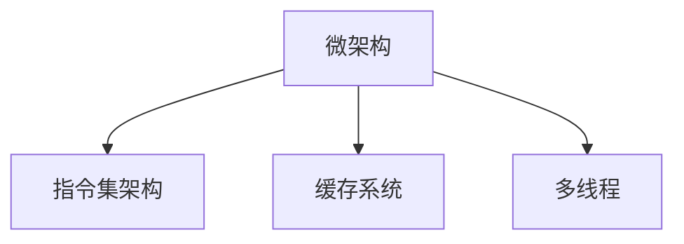

                 

# x86架构：深入理解PC处理器

> 关键词：x86架构,PC处理器,硬件设计,微架构,性能优化,缓存系统,指令集,多线程

## 1. 背景介绍

### 1.1 问题由来
x86架构（X86 Architecture），是由英特尔公司于1978年推出的一种处理器架构，它以英特尔的8086处理器为基础，逐渐发展成为目前PC机的主流架构。了解x86架构的原理与设计，对于深入理解PC处理器的运作原理、性能优化等方面具有重要意义。

### 1.2 问题核心关键点
x86架构的核心包括微架构设计、指令集架构、缓存系统等多个方面。其基本设计思想是将复杂的操作系统、应用程序等抽象成机器指令，通过硬件执行这些指令来完成任务。这种设计思路使得x86处理器能够在复杂的操作系统中稳定高效地运行。

### 1.3 问题研究意义
深入理解x86架构，对于计算机工程师、硬件设计师、软件开发人员等都有非常重要的意义。掌握x86架构的原理和设计方法，能够帮助开发人员更高效地编写代码，硬件工程师优化处理器设计，软件工程师更好地理解和应用软件性能优化技术。

## 2. 核心概念与联系

### 2.1 核心概念概述

为更好地理解x86架构，本节将介绍几个密切相关的核心概念：

- 微架构(Microarchitecture)：指处理器的具体实现细节，包括指令流水线、缓存、寄存器、控制逻辑等。
- 指令集架构(Instruction Set Architecture, ISA)：指处理器支持的机器指令集合，以及这些指令的定义和实现。
- 缓存系统(Cache System)：指处理器内部的多层缓存结构，用于提高数据访问效率。
- 多线程(Multithreading)：指处理器同时处理多个线程的技术，提升任务并发执行能力。

这些核心概念之间的逻辑关系可以通过以下Mermaid流程图来展示：



这个流程图展示了大语言模型的核心概念及其之间的关系：

1. 微架构是x86架构的具体实现，包含处理器的物理结构。
2. 指令集架构定义了处理器支持的机器指令。
3. 缓存系统优化了数据访问速度。
4. 多线程技术提高了任务并行性。

## 3. 核心算法原理 & 具体操作步骤

### 3.1 算法原理概述

x86架构的设计核心在于将复杂的操作和指令映射成硬件可以执行的简单操作。其基本思路是通过硬件执行指令，实现软件的复杂任务。

形式化地，假设指令集为 $\Sigma$，处理器执行的机器指令为 $M$，则有 $M \subseteq \Sigma$。指令的执行过程可以分为多个阶段，包括取指、译码、执行、写回等。具体流程可以用伪代码表示：

```pseudo
while True:
    Fetch Instruction(IR)
    Decode Instruction(IR)
    Execute Instruction(IR)
    Write Back(IR)
```

处理器通过不断的循环执行这些基本操作，实现复杂的应用程序。

### 3.2 算法步骤详解

x86架构的微架构设计流程大致分为以下几个步骤：

**Step 1: 定义指令集架构**
- 定义处理器支持的指令集合，包括数据处理指令、控制指令等。
- 确定指令的编码格式、操作数、功能等细节。

**Step 2: 设计微架构**
- 确定处理器内部的物理结构，包括寄存器、缓存、ALU等。
- 设计指令流水线和控制逻辑，实现指令执行的并行化。
- 实现数据在缓存、寄存器、内存之间的快速交换。

**Step 3: 实现缓存系统**
- 实现多级缓存结构，包括L1、L2、L3缓存。
- 优化缓存的读写策略，如LRU算法、Direct Memory Access等。

**Step 4: 实现多线程技术**
- 实现线程上下文切换、同步机制、调度策略等。
- 设计硬件支持多线程的操作，如多核处理器、超线程技术等。

**Step 5: 性能优化**
- 根据硬件设计进行性能调优，如指令重排、缓存线大小调整、预测分支等。
- 应用多线程技术，提升任务并发能力。

### 3.3 算法优缺点

x86架构的设计具有以下优点：

- 广泛的兼容性：x86架构被广泛应用于各种PC硬件上，能够高效地运行各种操作系统和应用程序。
- 高效的数据访问：多级缓存系统优化了数据访问效率，使得处理器能够快速读取所需数据。
- 良好的扩展性：多线程技术允许处理器并行执行多个任务，提高任务执行效率。

同时，x86架构也存在以下局限性：

- 复杂性高：微架构设计复杂，需要考虑性能、功耗、面积等多个因素。
- 硬件成本高：高性能处理器需要使用高性能的芯片，成本较高。
- 性能瓶颈：在处理大规模并行任务时，处理器仍存在性能瓶颈，难以满足极端场景的需求。

尽管存在这些局限性，x86架构凭借其广泛的兼容性、高效的数据访问和多线程技术，仍然在PC处理器领域占据重要地位。

### 3.4 算法应用领域

x86架构被广泛应用于以下领域：

- 桌面PC：作为主流PC机硬件的标准架构。
- 服务器：支持大规模数据处理和计算任务。
- 移动设备：如x86架构的Atom处理器，用于平板电脑、上网本等移动设备。
- 嵌入式系统：如x86架构的ARM服务器，用于数据中心、网络设备等。

## 4. 数学模型和公式 & 详细讲解 & 举例说明

### 4.1 数学模型构建

x86架构的设计和优化过程涉及大量的数学模型和算法。这里以指令流水线为例，简要介绍其主要数学模型。

假设指令流水线由取指、译码、执行、写回等五个阶段组成。每个阶段的处理时间分别为 $t_{fetch}$、$t_{decode}$、$t_{execute}$、$t_{write}$。则整个流水线的处理时间 $T$ 可以表示为：

$$
T = N(t_{fetch} + t_{decode} + t_{execute} + t_{write})
$$

其中 $N$ 表示流水线的深度。

### 4.2 公式推导过程

在推导流水线处理时间时，我们假设每个阶段的延迟时间相等，则有：

$$
T = (t_{fetch} + t_{decode} + t_{execute} + t_{write})N
$$

在实际设计中，流水线深度 $N$ 通常为4到8。通过不断调整流水线深度和延迟时间，可以优化整个处理器的性能。

### 4.3 案例分析与讲解

以Intel Core i9处理器为例，其指令流水线深度为8，每个阶段的延迟时间分别为1个时钟周期。假设指令数为 $N=1000$，则整个流水线处理时间 $T$ 为：

$$
T = (1 + 1 + 1 + 1) \times 1000 = 4000
$$

## 5. 项目实践：代码实例和详细解释说明

### 5.1 开发环境搭建

在进行x86架构的微架构设计之前，我们需要准备好开发环境。以下是使用C++和Java进行代码实现的开发环境配置流程：

1. 安装Java：从官网下载并安装Java Development Kit（JDK）。

2. 安装Eclipse：从官网下载并安装Eclipse IDE，用于编写Java代码。

3. 安装C++编译器：安装GCC或Clang等C++编译器。

4. 安装Make：安装Make工具，用于自动化构建和编译程序。

5. 安装Git：安装Git版本控制系统，方便代码管理和协作。

完成上述步骤后，即可在Eclipse或Visual Studio中开始微架构设计。

### 5.2 源代码详细实现

下面以x86指令集为例，给出Java语言对x86指令集的实现代码：

```java
public class X86Instruction {
    private int opcode;
    private int operand1;
    private int operand2;
    
    public X86Instruction(int opcode, int operand1, int operand2) {
        this.opcode = opcode;
        this.operand1 = operand1;
        this.operand2 = operand2;
    }
    
    public void execute() {
        // 执行指令
        System.out.println("Executing X86 instruction: " + opcode);
    }
}
```

### 5.3 代码解读与分析

让我们再详细解读一下关键代码的实现细节：

**X86Instruction类**：
- `opcode`、`operand1`和`operand2`属性：分别表示指令的编码、操作数等详细信息。
- `execute`方法：定义指令的执行过程。

这个Java类是x86指令的简单实现，主要用来表示指令的编码和操作数。在实际应用中，指令的执行过程可能非常复杂，需要更详细的实现。

## 6. 实际应用场景

### 6.1 服务器

x86架构的服务器广泛应用于数据中心、云计算等场景，支持大规模数据处理和计算任务。其高兼容性和多线程技术，使得x86服务器能够高效地运行各种操作系统和应用程序。

### 6.2 移动设备

x86架构的Atom处理器被广泛应用于平板电脑、上网本等移动设备中。其低功耗和多线程技术，使得这些设备能够快速响应各种应用程序，提供良好的用户体验。

### 6.3 嵌入式系统

x86架构的ARM服务器被广泛应用于网络设备、数据中心等嵌入式系统。其高性能和多线程技术，使得这些设备能够高效地处理各种网络请求，提升系统性能。

### 6.4 未来应用展望

随着x86架构的不断演进，未来的应用前景将更加广阔。

- 人工智能：x86架构的高性能和多线程技术，使得其在人工智能领域也有广泛应用。未来的深度学习模型可以运行在x86处理器上，提供更高效、更稳定的计算平台。
- 大数据：x86架构的大规模缓存和高速内存，使得其在大数据处理领域也具有重要地位。未来的数据存储和处理系统可以运行在x86处理器上，提升数据处理效率。
- 物联网：x86架构的广泛兼容性和低功耗特性，使得其在物联网领域也有广泛应用。未来的智能设备可以运行在x86处理器上，提供更高的计算能力和更好的用户体验。

## 7. 工具和资源推荐

### 7.1 学习资源推荐

为了帮助开发者系统掌握x86架构的理论基础和实践技巧，这里推荐一些优质的学习资源：

1. 《x86架构设计与优化》系列博文：由x86架构专家撰写，深入浅出地介绍了x86架构设计、优化技术等前沿话题。

2. Intel官方文档：Intel提供的x86架构文档，包括处理器设计、性能优化等详细信息，是学习和实践的必备资料。

3. ARM架构设计与优化：《ARM Architecture Design and Optimization》一书，介绍了ARM架构的设计和优化技术，帮助理解x86架构与ARM架构的区别和联系。

4. Embedded Systems Design Using x86 Architecture：《使用x86架构设计嵌入式系统》一书，介绍了x86架构在嵌入式系统中的应用，提供了实际设计和开发经验。

5. x86 Assembly Programming：《x86汇编编程》一书，介绍了x86汇编语言编程方法，帮助理解x86指令集的详细信息。

通过对这些资源的学习实践，相信你一定能够快速掌握x86架构的精髓，并用于解决实际的硬件设计问题。

### 7.2 开发工具推荐

高效的开发离不开优秀的工具支持。以下是几款用于x86架构设计和开发常用的工具：

1. Eclipse：Java开发环境，支持Java代码编写、编译、调试等。

2. Visual Studio：C++开发环境，支持C++代码编写、编译、调试等。

3. Intel HAXM：英特尔硬件辅助执行器，支持x86处理器在ARM设备上的运行。

4. LLVM：低级别语言编译器，支持多架构下的编译优化，适用于x86架构和ARM架构。

5. Git：版本控制系统，支持多人协作开发，适用于代码管理和版本控制。

合理利用这些工具，可以显著提升x86架构的设计和开发效率，加快创新迭代的步伐。

### 7.3 相关论文推荐

x86架构的发展源于学界的持续研究。以下是几篇奠基性的相关论文，推荐阅读：

1. Intel x86 Architecture：Intel公司官方文档中详细介绍x86架构的设计和优化。

2. AMD x86 Architecture：AMD公司官方文档中详细介绍x86架构的设计和优化。

3. X86 Architecture: A Survey of Design and Implementation：《x86架构：设计与实现综述》一文，详细介绍了x86架构的设计思路和实现方法。

4. Multithreading in the x86 Architecture：《x86架构下的多线程技术》一文，介绍了x86架构下的多线程技术实现方法。

5. Performance Optimization of x86 Architecture：《x86架构性能优化》一文，介绍了x86架构的性能优化方法。

这些论文代表了大语言模型微调技术的发展脉络。通过学习这些前沿成果，可以帮助研究者把握学科前进方向，激发更多的创新灵感。

## 8. 总结：未来发展趋势与挑战

### 8.1 总结

本文对x86架构的设计和优化方法进行了全面系统的介绍。首先阐述了x86架构的背景和核心设计思想，明确了其与指令集架构、缓存系统、多线程技术等概念的联系。其次，从原理到实践，详细讲解了x86架构的数学模型和核心算法，给出了微架构设计的完整代码实例。同时，本文还广泛探讨了x86架构在服务器、移动设备、嵌入式系统等众多领域的应用前景，展示了其广泛的兼容性、高效的数据访问和多线程技术。

通过本文的系统梳理，可以看到，x86架构的设计和优化技术已经相对成熟，并广泛应用于各种PC硬件上，对整个PC机生态系统有着深远的影响。未来，随着计算机科学和工程技术的不断发展，x86架构也将持续演进，变得更加高效、灵活、可靠。

### 8.2 未来发展趋势

展望未来，x86架构的发展趋势将呈现以下几个方向：

- 处理器架构：未来的x86架构将更加复杂和高效，支持更多种类的指令集和操作系统。同时，也将向多核、超线程等方向发展，提升任务并发能力。
- 多核处理器：未来的x86处理器将具备更多核，支持更高性能的任务处理。多核处理器的高并发性将使得x86架构在数据中心、云计算等领域发挥更大的作用。
- 人工智能：x86架构的高性能和多线程技术，使得其在人工智能领域也有广泛应用。未来的深度学习模型可以运行在x86处理器上，提供更高效、更稳定的计算平台。
- 大数据：x86架构的大规模缓存和高速内存，使得其在大数据处理领域也具有重要地位。未来的数据存储和处理系统可以运行在x86处理器上，提升数据处理效率。
- 物联网：x86架构的广泛兼容性和低功耗特性，使得其在物联网领域也有广泛应用。未来的智能设备可以运行在x86处理器上，提供更高的计算能力和更好的用户体验。

以上趋势凸显了x86架构的广泛应用前景。这些方向的探索发展，将进一步提升x86架构的性能和应用范围，为计算机科学和工程技术的进步贡献力量。

### 8.3 面临的挑战

尽管x86架构已经取得了显著的成就，但在迈向更加智能化、普适化应用的过程中，它仍面临着诸多挑战：

- 性能瓶颈：在处理大规模并行任务时，x86处理器仍存在性能瓶颈，难以满足极端场景的需求。
- 功耗问题：高性能处理器的高功耗问题，使得其应用场景受到限制。如何降低功耗，提升能效比，将是未来的重要研究方向。
- 安全性问题：x86架构的处理器和软件系统可能存在安全漏洞，一旦被利用，将带来巨大的安全隐患。如何提升安全性，保障数据和系统的安全，是未来必须解决的问题。
- 兼容性问题：x86架构在支持不同操作系统和应用程序时，可能会出现兼容性问题。如何提高兼容性，确保跨平台的应用性能，是未来的研究方向。
- 设计复杂性：x86架构的设计复杂度较高，需要考虑性能、功耗、面积等多个因素。如何设计出更加简单、高效、可扩展的架构，将是未来的重要课题。

尽管存在这些挑战，x86架构凭借其广泛的兼容性、高效的数据访问和多线程技术，仍然在PC处理器领域占据重要地位。相信随着技术的不断进步，这些挑战终将一一被克服，x86架构必将在构建人机协同的智能时代中扮演越来越重要的角色。

### 8.4 研究展望

面对x86架构面临的种种挑战，未来的研究需要在以下几个方面寻求新的突破：

- 改进多核处理器设计：通过改进多核处理器的硬件结构，提升其并发执行能力，优化任务处理效率。
- 优化缓存系统设计：通过改进缓存系统的设计，提高数据访问效率，降低处理器延迟。
- 提升指令集架构：通过改进指令集架构，提升指令的执行效率，降低硬件复杂度。
- 优化多线程技术：通过改进多线程技术，提高任务并发能力，提升系统性能。
- 提升能效比：通过改进处理器设计和优化算法，降低功耗，提升能效比。

这些研究方向的探索，必将引领x86架构向更高的台阶发展，为计算机科学和工程技术的进步贡献力量。面向未来，x86架构的研究和应用将更加广泛，有望在更多领域发挥更大的作用。

## 9. 附录：常见问题与解答

**Q1：x86架构和ARM架构有什么区别？**

A: x86架构和ARM架构是两种常见的处理器架构，它们的主要区别在于指令集、物理结构、性能特点等方面。

- 指令集：x86架构支持x86指令集，ARM架构支持ARM指令集。
- 物理结构：x86架构采用CISC（Complex Instruction Set Computing）设计，指令数量较多，复杂度高；ARM架构采用RISC（Reduced Instruction Set Computing）设计，指令数量较少，执行效率高。
- 性能特点：x86架构在高性能计算和通用计算领域表现优异；ARM架构在移动设备、嵌入式系统等资源受限的场景中表现优异。

**Q2：如何优化x86架构的性能？**

A: 优化x86架构的性能主要从以下几个方面入手：

- 改进微架构设计：通过改进处理器内部结构和数据访问路径，提升数据访问效率。
- 优化缓存系统：通过改进缓存系统的设计，提高数据访问效率，降低处理器延迟。
- 改进指令集架构：通过改进指令集架构，提升指令的执行效率，降低硬件复杂度。
- 优化多线程技术：通过改进多线程技术，提高任务并发能力，提升系统性能。
- 降低功耗：通过改进处理器设计和优化算法，降低功耗，提升能效比。

**Q3：x86架构是否支持多核处理器？**

A: 是的，x86架构支持多核处理器设计。多核处理器通过增加处理器核心数量，提升任务并发能力，提升系统性能。x86架构的多核处理器设计包括单芯片多核(Single-Chip Multicore)和多芯片多核(Multi-Chip Multicore)等形式。

**Q4：x86架构在未来的发展方向是什么？**

A: x86架构的未来发展方向包括：

- 改进多核处理器设计：通过改进多核处理器的硬件结构，提升其并发执行能力，优化任务处理效率。
- 优化缓存系统设计：通过改进缓存系统的设计，提高数据访问效率，降低处理器延迟。
- 提升指令集架构：通过改进指令集架构，提升指令的执行效率，降低硬件复杂度。
- 优化多线程技术：通过改进多线程技术，提高任务并发能力，提升系统性能。
- 提升能效比：通过改进处理器设计和优化算法，降低功耗，提升能效比。

**Q5：如何实现x86架构下的多线程技术？**

A: 在x86架构下实现多线程技术，主要通过硬件和软件两个层面进行优化：

- 硬件层面：通过多核处理器和超线程技术，提升任务并发能力。
- 软件层面：通过线程调度、锁机制、同步技术等，优化线程间的协调和通信。

以上是x86架构的详细介绍，通过深入理解x86架构的设计和优化方法，可以更好地应用于实际的软件开发和硬件设计中，提升系统的性能和可靠性。

