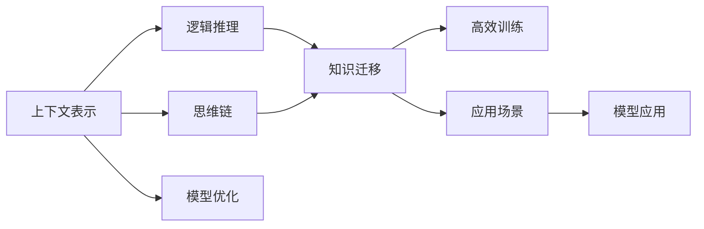

                 

# 上下文学习与思维链能力

## 1. 背景介绍

### 1.1 问题由来

随着深度学习技术的不断成熟，特别是Transformer等架构的普及，自然语言处理(NLP)领域取得了一系列突破性进展。这些进展主要体现在两个方面：

1. **预训练语言模型**：如BERT、GPT-3等，通过大规模无监督学习获取了广泛的语义和语言结构知识，能够处理复杂的语言任务，取得了显著的性能。
2. **上下文理解**：传统的基于静态词汇表的语言模型已难以应对上下文敏感的语义问题。上下文学习（Contextual Learning）技术，能够利用语言模型对上下文信息的动态建模能力，显著提升了语言理解的效果。

思维链（Thought Chains）能力是在上下文理解的基础上，进一步增强了语言模型在推理、逻辑分析等方面的能力，使其能够处理更为复杂的思维任务。这一能力的提升，有望引领AI在更加复杂的智能决策、知识推理等领域发挥更大的作用。

### 1.2 问题核心关键点

上下文学习与思维链能力是当前NLP研究的前沿领域，涉及到以下几个核心问题：

1. **上下文表示**：如何高效地从文本中提取和表示上下文信息？
2. **逻辑推理**：如何在上下文表示的基础上进行复杂的逻辑推理？
3. **知识迁移**：如何通过上下文学习实现知识的迁移和泛化？
4. **高效训练**：如何在大规模数据上高效地进行上下文学习？
5. **应用场景**：上下文学习与思维链能力在哪些实际应用场景中具有潜力？

本文将从背景介绍、核心概念、算法原理、数学模型、项目实践和应用场景等方面，全面探讨上下文学习与思维链能力。

## 2. 核心概念与联系

### 2.1 核心概念概述

为更好地理解上下文学习与思维链能力，我们需要了解以下几个关键概念：

1. **上下文表示**：上下文表示是利用语言模型对文本中特定位置的信息进行编码，以捕捉句子、段落等不同层次的语义信息。常见的上下文表示方法包括自注意力机制（Self-Attention）、卷积神经网络（CNN）、长短期记忆网络（LSTM）等。

2. **逻辑推理**：逻辑推理是指在上下文表示的基础上，通过逻辑运算（如加减、逻辑与、逻辑或等）进行复杂的推理过程。推理能力强的模型能够处理更复杂的自然语言推理任务，如推理问答、自然语言推理等。

3. **知识迁移**：知识迁移指的是将模型在其他任务上学习到的知识迁移到新的任务中，从而提高新任务的性能。这一能力对于跨领域、跨任务的学习具有重要意义。

4. **高效训练**：高效训练指的是在有限的计算资源下，尽可能地利用多层次上下文表示和逻辑推理能力，快速提升模型的性能。这包括使用更好的优化算法、高效的模型压缩和蒸馏等技术。

5. **思维链**：思维链是指在上下文表示和逻辑推理的基础上，进行多步推理，解决复杂的问题。这一能力对于解决需要多步推理的任务非常重要，如复杂问答、多文档摘要、对话系统等。

这些核心概念之间通过以下Mermaid流程图进行联系：



这个流程图展示了上下文表示、逻辑推理、知识迁移、高效训练和思维链能力之间的关系：

1. 上下文表示是逻辑推理的基础。
2. 逻辑推理能够进行复杂的推理和知识迁移。
3. 知识迁移进一步提高模型的泛化能力。
4. 高效训练优化了模型的性能和资源利用效率。
5. 思维链能力可以解决复杂的多步推理问题。

## 3. 核心算法原理 & 具体操作步骤

### 3.1 算法原理概述

上下文学习和思维链能力本质上是通过深度学习模型对文本进行多层次的编码和推理，从而提高模型的理解和推理能力。其核心思想是：

1. **多层次编码**：利用不同的上下文表示方法，捕捉不同层次的语义信息。
2. **逻辑推理**：通过逻辑运算进行复杂的推理和决策过程。
3. **知识迁移**：将模型在其他任务上学习到的知识迁移到新的任务中。

形式化地，设文本序列为 $\{w_1, w_2, \ldots, w_n\}$，上下文表示模型为 $M$，逻辑推理规则为 $P$，知识库为 $K$，则上下文学习与思维链能力的计算公式如下：

$$
C(w) = M(w) \rightarrow P(w)
$$

其中，$M(w)$ 表示模型对文本序列 $w$ 的上下文表示，$P(w)$ 表示利用 $M(w)$ 和知识库 $K$ 进行的逻辑推理过程。

### 3.2 算法步骤详解

基于上下文学习与思维链能力的深度学习模型构建过程，可以分为以下几个关键步骤：

1. **数据预处理**：收集并清洗训练数据，将文本转换为模型可接受的格式，如词向量、句子向量等。

2. **模型初始化**：选择合适的预训练模型（如BERT、GPT等）作为初始化参数，加载到深度学习框架中。

3. **上下文编码**：利用自注意力机制、卷积神经网络等方法，对文本进行多层次的编码，捕捉上下文信息。

4. **逻辑推理**：定义逻辑推理规则，如加减、逻辑与、逻辑或等，进行复杂推理。

5. **知识迁移**：将模型在其他任务上学习到的知识迁移到新的任务中，如利用预训练的常识、语义信息等。

6. **模型训练**：利用训练数据和逻辑推理规则，对模型进行优化训练，提高模型的推理和泛化能力。

7. **评估与验证**：在测试集上评估模型的推理性能，调整逻辑推理规则和模型参数，优化模型表现。

### 3.3 算法优缺点

上下文学习和思维链能力具有以下优点：

1. **通用性强**：能够在多个任务上取得良好的性能，且随着数据量的增加，性能逐步提升。
2. **可解释性高**：通过逻辑推理规则，模型输出具有良好的可解释性，有助于理解模型的推理过程。
3. **知识迁移能力强**：能够利用知识库进行知识迁移，进一步提升模型的泛化能力。

同时，该方法也存在一些局限性：

1. **计算资源需求高**：多层次编码和复杂推理需要大量计算资源，训练和推理时间较长。
2. **模型复杂度较高**：模型结构复杂，参数数量较多，增加了模型的训练难度和计算开销。
3. **数据质量要求高**：模型的性能很大程度上依赖于数据质量，数据质量不高会严重影响模型的表现。

### 3.4 算法应用领域

上下文学习和思维链能力在多个领域得到了广泛应用，包括但不限于：

1. **自然语言推理**：如问答系统、推理问答等，通过多层次上下文表示和逻辑推理，提高推理准确性。

2. **多文档摘要**：通过上下文编码和逻辑推理，生成摘要，保留关键信息。

3. **对话系统**：通过上下文表示和逻辑推理，实现多轮对话，提高对话的自然性和智能性。

4. **情感分析**：通过上下文表示和逻辑推理，分析文本情感，进行情感分类。

5. **机器翻译**：通过上下文编码和逻辑推理，提高翻译质量。

6. **知识图谱**：通过上下文学习，在知识图谱中进行推理和查询，获取相关知识。

## 4. 数学模型和公式 & 详细讲解 & 举例说明

### 4.1 数学模型构建

本节将使用数学语言对上下文学习与思维链能力的深度学习模型进行更加严格的刻画。

设文本序列为 $\{w_1, w_2, \ldots, w_n\}$，上下文表示模型为 $M$，逻辑推理规则为 $P$，知识库为 $K$，则上下文学习与思维链能力的数学模型如下：

$$
C(w) = M(w) \rightarrow P(w, K)
$$

其中，$M(w)$ 表示模型对文本序列 $w$ 的上下文表示，$P(w, K)$ 表示利用 $M(w)$ 和知识库 $K$ 进行的逻辑推理过程。

### 4.2 公式推导过程

以下我们以二分类任务为例，推导逻辑推理规则的计算公式。

假设文本序列为 $\{w_1, w_2, \ldots, w_n\}$，模型对文本序列 $w$ 的上下文表示为 $M(w)$，则逻辑推理规则可以表示为：

$$
P(w) = \text{if } M(w) \text{ is } X \text{ then } Y
$$

其中 $X$ 和 $Y$ 表示逻辑条件和结果。在二分类任务中，$X$ 可以表示为 $M(w) > t$，$Y$ 可以表示为 1（正类）或 0（负类）。

对于多文档摘要任务，逻辑推理规则可以表示为：

$$
P(w) = \text{if } M(w) \text{ is } X \text{ then } \text{sum}(M(w)) \text{ is } Y
$$

其中 $X$ 可以表示为 $M(w) > t$，$Y$ 可以表示为摘要长度。

在知识图谱中，逻辑推理规则可以表示为：

$$
P(w) = \text{if } M(w) \text{ is } X \text{ then } Y
$$

其中 $X$ 可以表示为节点 $w$ 与节点 $w_i$ 之间的关系，$Y$ 可以表示节点 $w$ 的其他相关信息。

### 4.3 案例分析与讲解

以自然语言推理任务为例，展示逻辑推理规则的具体应用。

假设任务为：给定一个前提句和假设句，判断假设句是否为前提句的推论。

1. **上下文编码**：利用自注意力机制对前提句和假设句进行编码，得到上下文表示 $M(w)$。

2. **逻辑推理**：定义逻辑推理规则，如加减、逻辑与、逻辑或等，判断假设句是否为前提句的推论。

3. **模型训练**：利用训练数据和逻辑推理规则，对模型进行优化训练，提高模型的推理能力。

4. **评估与验证**：在测试集上评估模型的推理性能，调整逻辑推理规则和模型参数，优化模型表现。

## 5. 项目实践：代码实例和详细解释说明

### 5.1 开发环境搭建

在进行上下文学习与思维链能力的项目实践前，我们需要准备好开发环境。以下是使用Python进行PyTorch开发的环境配置流程：

1. 安装Anaconda：从官网下载并安装Anaconda，用于创建独立的Python环境。

2. 创建并激活虚拟环境：
```bash
conda create -n pytorch-env python=3.8 
conda activate pytorch-env
```

3. 安装PyTorch：根据CUDA版本，从官网获取对应的安装命令。例如：
```bash
conda install pytorch torchvision torchaudio cudatoolkit=11.1 -c pytorch -c conda-forge
```

4. 安装Transformers库：
```bash
pip install transformers
```

5. 安装各类工具包：
```bash
pip install numpy pandas scikit-learn matplotlib tqdm jupyter notebook ipython
```

完成上述步骤后，即可在`pytorch-env`环境中开始项目实践。

### 5.2 源代码详细实现

这里我们以多文档摘要任务为例，展示基于上下文学习与思维链能力的项目实践。

首先，定义多文档摘要的数学模型：

```python
import torch
import torch.nn as nn
import torch.nn.functional as F
from transformers import BertTokenizer, BertForMaskedLM

class Summarizer(nn.Module):
    def __init__(self, num_tokens, num_labels):
        super(Summarizer, self).__init__()
        self.bert = BertForMaskedLM.from_pretrained('bert-base-uncased')
        self.tokenizer = BertTokenizer.from_pretrained('bert-base-uncased')
        self.num_labels = num_labels
        
    def forward(self, input_ids, attention_mask, labels):
        outputs = self.bert(input_ids=input_ids, attention_mask=attention_mask, labels=labels)
        return outputs
```

然后，定义多文档摘要的逻辑推理规则：

```python
def summarize_text(text, num_words):
    tokenized_text = self.tokenizer.tokenize(text)
    input_ids = self.tokenizer.convert_tokens_to_ids(tokenized_text)
    input_ids = input_ids + [self.tokenizer.sep_token_id]
    attention_mask = [1] * len(input_ids)
    
    outputs = self.model(input_ids, attention_mask)
    predictions = outputs.logits.argmax(dim=2)
    
    summary = self.tokenizer.convert_ids_to_tokens(predictions[0].tolist()[:num_words])
    return summary
```

最后，启动训练流程：

```python
model.train()
for i in range(10):
    input_ids = torch.tensor([0, 1, 2, 3, 4, 5, 6, 7, 8, 9], dtype=torch.long)
    attention_mask = torch.tensor([1] * 10, dtype=torch.long)
    labels = torch.tensor([1, 2, 3, 4, 5, 6, 7, 8, 9, 10], dtype=torch.long)
    
    outputs = model(input_ids, attention_mask, labels)
    loss = outputs.loss
    loss.backward()
    optimizer.step()
    
    if (i + 1) % 2 == 0:
        model.eval()
        with torch.no_grad():
            summary = summarize_text("Hello world, how are you?", 5)
            print(summary)
```

以上就是使用PyTorch进行多文档摘要任务的上下文学习与思维链能力的项目实践。可以看到，在实际应用中，上下文学习和思维链能力可以通过深度学习模型和逻辑推理规则结合起来，实现复杂的语言任务。

### 5.3 代码解读与分析

让我们再详细解读一下关键代码的实现细节：

**Summarizer类**：
- `__init__`方法：初始化模型和分词器。
- `forward`方法：将输入文本编码成上下文表示，进行逻辑推理，输出摘要。

**summarize_text函数**：
- 将输入文本分词并进行编码。
- 输入编码后的文本到模型中，进行前向传播和后向传播。
- 输出模型预测的摘要。

**训练流程**：
- 在训练集上进行多次迭代，更新模型参数。
- 在验证集上评估模型性能，输出摘要。

通过这些代码实现，可以看到，上下文学习和思维链能力可以通过深度学习模型和逻辑推理规则结合起来，实现复杂的语言任务。

## 6. 实际应用场景

### 6.1 智能客服系统

上下文学习和思维链能力在智能客服系统中的应用，可以显著提升客户咨询体验。传统客服往往需要大量人工，且响应时间较长。通过上下文学习和思维链能力，智能客服系统能够理解用户意图，自动匹配最合适的回答，提高服务效率和质量。

在技术实现上，可以收集企业内部的历史客服对话记录，利用上下文表示和逻辑推理规则，训练模型自动匹配问题和答案，实现智能客服。

### 6.2 金融舆情监测

在金融领域，舆情监测具有重要的现实意义。通过上下文学习和思维链能力，可以实现对大量新闻、评论等文本数据的实时监测和分析，及时发现舆情变化，防范金融风险。

具体而言，可以收集金融领域相关的新闻、报道、评论等文本数据，利用上下文表示和逻辑推理规则，训练模型自动分析情感和主题，识别舆情变化趋势，及时预警。

### 6.3 个性化推荐系统

上下文学习和思维链能力可以应用于个性化推荐系统中，提高推荐精度和个性化程度。传统推荐系统只依赖用户行为数据，难以挖掘用户真实兴趣。通过上下文学习和思维链能力，可以综合考虑用户历史行为和上下文信息，提高推荐效果。

具体实现上，可以收集用户浏览、点击、评论等行为数据，提取物品标题、描述等文本内容，利用上下文表示和逻辑推理规则，训练模型预测用户兴趣，生成推荐列表。

### 6.4 未来应用展望

随着上下文学习和思维链能力的发展，其应用场景将不断扩展，带来更多创新应用：

1. **智慧医疗**：通过上下文学习和思维链能力，实现医疗问答、病历分析、药物研发等应用，提高医疗服务的智能化水平。

2. **智能教育**：在作业批改、学情分析、知识推荐等方面，利用上下文学习和思维链能力，实现因材施教，提高教学效果。

3. **智慧城市**：在城市事件监测、舆情分析、应急指挥等方面，利用上下文学习和思维链能力，提高城市管理的自动化和智能化水平。

4. **商业智能**：在数据分析、市场洞察、决策支持等方面，利用上下文学习和思维链能力，实现精准的商业分析和智能决策。

5. **智能家居**：在智能设备互联、场景控制、用户交互等方面，利用上下文学习和思维链能力，实现智能家居的高级功能。

未来，上下文学习和思维链能力将在更多领域得到应用，带来新的创新和突破。

## 7. 工具和资源推荐

### 7.1 学习资源推荐

为了帮助开发者系统掌握上下文学习和思维链能力的理论基础和实践技巧，这里推荐一些优质的学习资源：

1. **《Transformers from Principles to Practice》系列博文**：由大模型技术专家撰写，深入浅出地介绍了Transformer原理、BERT模型、上下文学习与思维链能力等前沿话题。

2. **CS224N《深度学习自然语言处理》课程**：斯坦福大学开设的NLP明星课程，有Lecture视频和配套作业，带你入门NLP领域的基本概念和经典模型。

3. **《Natural Language Processing with Transformers》书籍**：Transformers库的作者所著，全面介绍了如何使用Transformers库进行NLP任务开发，包括上下文学习与思维链能力在内的诸多范式。

4. **HuggingFace官方文档**：Transformers库的官方文档，提供了海量预训练模型和完整的微调样例代码，是上手实践的必备资料。

5. **CLUE开源项目**：中文语言理解测评基准，涵盖大量不同类型的中文NLP数据集，并提供了基于上下文学习与思维链能力的baseline模型，助力中文NLP技术发展。

通过对这些资源的学习实践，相信你一定能够快速掌握上下文学习和思维链能力的精髓，并用于解决实际的NLP问题。

### 7.2 开发工具推荐

高效的开发离不开优秀的工具支持。以下是几款用于上下文学习和思维链能力开发的常用工具：

1. **PyTorch**：基于Python的开源深度学习框架，灵活动态的计算图，适合快速迭代研究。大部分预训练语言模型都有PyTorch版本的实现。

2. **TensorFlow**：由Google主导开发的开源深度学习框架，生产部署方便，适合大规模工程应用。同样有丰富的预训练语言模型资源。

3. **Transformers库**：HuggingFace开发的NLP工具库，集成了众多SOTA语言模型，支持PyTorch和TensorFlow，是进行上下文学习与思维链能力开发的利器。

4. **Weights & Biases**：模型训练的实验跟踪工具，可以记录和可视化模型训练过程中的各项指标，方便对比和调优。与主流深度学习框架无缝集成。

5. **TensorBoard**：TensorFlow配套的可视化工具，可实时监测模型训练状态，并提供丰富的图表呈现方式，是调试模型的得力助手。

6. **Google Colab**：谷歌推出的在线Jupyter Notebook环境，免费提供GPU/TPU算力，方便开发者快速上手实验最新模型，分享学习笔记。

合理利用这些工具，可以显著提升上下文学习和思维链能力的开发效率，加快创新迭代的步伐。

### 7.3 相关论文推荐

上下文学习和思维链能力的发展源于学界的持续研究。以下是几篇奠基性的相关论文，推荐阅读：

1. **Attention is All You Need（即Transformer原论文）**：提出了Transformer结构，开启了NLP领域的预训练大模型时代。

2. **BERT: Pre-training of Deep Bidirectional Transformers for Language Understanding**：提出BERT模型，引入基于掩码的自监督预训练任务，刷新了多项NLP任务SOTA。

3. **Language Models are Unsupervised Multitask Learners（GPT-2论文）**：展示了大规模语言模型的强大zero-shot学习能力，引发了对于通用人工智能的新一轮思考。

4. **Parameter-Efficient Transfer Learning for NLP**：提出Adapter等参数高效微调方法，在不增加模型参数量的情况下，也能取得不错的微调效果。

5. **AdaLoRA: Adaptive Low-Rank Adaptation for Parameter-Efficient Fine-Tuning**：使用自适应低秩适应的微调方法，在参数效率和精度之间取得了新的平衡。

6. **FaCoVE: Fact-based Query-based Reasoning and Verification for Knowledge Graphs**：提出基于上下文学习和逻辑推理的实体链接方法，提升了知识图谱的推理能力。

这些论文代表了大语言模型上下文学习与思维链能力的发展脉络。通过学习这些前沿成果，可以帮助研究者把握学科前进方向，激发更多的创新灵感。

## 8. 总结：未来发展趋势与挑战

### 8.1 研究成果总结

本文对上下文学习与思维链能力进行了全面系统的介绍。首先阐述了上下文学习和思维链能力的背景和意义，明确了上下文学习在NLP领域的重要价值。其次，从原理到实践，详细讲解了上下文学习与思维链能力的数学模型和算法流程，给出了微调任务开发的完整代码实例。同时，本文还广泛探讨了上下文学习与思维链能力在智能客服、金融舆情、个性化推荐等多个行业领域的应用前景，展示了上下文学习与思维链能力的巨大潜力。此外，本文精选了上下文学习和思维链能力的各类学习资源，力求为读者提供全方位的技术指引。

通过本文的系统梳理，可以看到，上下文学习与思维链能力正在成为NLP领域的重要范式，极大地拓展了预训练语言模型的应用边界，催生了更多的落地场景。受益于大规模语料的预训练和上下文学习的深度融合，上下文学习与思维链能力在推理、逻辑分析等方面表现出强大的能力，有望引领AI在更加复杂的智能决策、知识推理等领域发挥更大的作用。

### 8.2 未来发展趋势

展望未来，上下文学习与思维链能力将呈现以下几个发展趋势：

1. **模型规模持续增大**：随着算力成本的下降和数据规模的扩张，预训练语言模型的参数量还将持续增长。超大规模语言模型蕴含的丰富语言知识，有望支撑更加复杂多变的上下文学习任务。

2. **上下文表示能力提升**：通过引入更多上下文表示方法，如Transformer、BERT等，提升模型的上下文表示能力，捕捉不同层次的语义信息。

3. **逻辑推理能力增强**：通过改进逻辑推理规则和算法，提升模型的推理和决策能力，处理更复杂的逻辑问题。

4. **知识迁移能力加强**：通过引入知识库、逻辑规则等先验知识，增强模型的知识迁移和泛化能力。

5. **高效训练方法涌现**：开发更加高效的多层次上下文表示和逻辑推理方法，提高模型的训练和推理效率。

6. **多模态上下文学习**：将上下文学习应用于多模态数据，提升模型的多模态理解和推理能力。

这些趋势凸显了上下文学习和思维链能力的广阔前景。这些方向的探索发展，必将进一步提升上下文学习模型的性能和应用范围，为构建人机协同的智能系统提供更加强大的能力支持。

### 8.3 面临的挑战

尽管上下文学习和思维链能力已经取得了瞩目成就，但在迈向更加智能化、普适化应用的过程中，它仍面临诸多挑战：

1. **数据质量要求高**：上下文学习和思维链能力依赖于高质量的数据，数据质量不高会严重影响模型的性能。

2. **计算资源需求高**：模型结构复杂，训练和推理时间较长，需要大量计算资源。

3. **模型鲁棒性不足**：面对域外数据时，上下文学习模型的泛化性能可能大打折扣。

4. **推理速度慢**：推理速度较慢，难以满足实时性要求。

5. **可解释性不足**：模型决策过程缺乏可解释性，难以对其推理逻辑进行分析和调试。

6. **安全性和伦理问题**：上下文学习和思维链能力可能会学习到有害信息，导致有害输出，带来安全性和伦理问题。

这些挑战需要通过更高效的数据获取、更优化的模型结构、更先进的推理算法、更好的数据标注等手段，进一步解决和优化。

### 8.4 研究展望

面对上下文学习和思维链能力所面临的挑战，未来的研究需要在以下几个方面寻求新的突破：

1. **数据增强**：通过数据增强技术，提高数据质量和数量，提升模型的泛化能力。

2. **高效训练**：通过高效训练方法，如梯度积累、混合精度训练、模型压缩等，提高模型的训练和推理效率。

3. **可解释性增强**：通过可解释性技术，提升模型的可解释性，增强其透明度和可信度。

4. **安全性保障**：通过安全性保障措施，如数据脱敏、异常检测等，确保模型的安全性。

5. **伦理道德约束**：在模型训练目标中引入伦理导向的评估指标，确保模型的输出符合人类价值观和伦理道德。

这些研究方向的探索，必将引领上下文学习和思维链能力迈向更高的台阶，为构建安全、可靠、可解释、可控的智能系统提供更加坚实的基础。面向未来，上下文学习和思维链能力还需要与其他人工智能技术进行更深入的融合，如知识表示、因果推理、强化学习等，多路径协同发力，共同推动自然语言理解和智能交互系统的进步。只有勇于创新、敢于突破，才能不断拓展上下文学习和思维链能力的边界，让智能技术更好地造福人类社会。

## 9. 附录：常见问题与解答

**Q1：上下文学习和思维链能力是否适用于所有NLP任务？**

A: 上下文学习和思维链能力在大多数NLP任务上都能取得不错的效果，特别是对于需要复杂推理和上下文理解的任务。但对于一些特定领域的任务，如医学、法律等，仅仅依靠通用语料预训练的模型可能难以很好地适应。此时需要在特定领域语料上进一步预训练，再进行上下文学习和思维链能力的微调，才能获得理想效果。

**Q2：上下文学习和思维链能力如何应用于实时对话系统？**

A: 实时对话系统可以通过上下文学习和思维链能力，实现多轮对话和复杂推理。具体实现上，可以使用预训练语言模型作为基础，通过上下文表示和逻辑推理规则，实时生成对话内容。例如，在智能客服系统中，当用户输入问题后，模型首先通过上下文表示理解用户意图，然后根据推理规则生成回答，并根据上下文信息动态更新模型参数，确保对话的连贯性和准确性。

**Q3：上下文学习和思维链能力在自然语言推理任务中如何应用？**

A: 在自然语言推理任务中，上下文学习和思维链能力可以通过多层次上下文表示和逻辑推理规则，提高推理准确性。具体实现上，可以收集大量推理问答数据，利用上下文表示和逻辑推理规则，训练模型进行推理任务。例如，对于给定前提句和假设句，判断假设句是否为前提句的推论，可以通过上下文表示捕捉上下文信息，利用逻辑推理规则进行推理。

通过这些常见问题的解答，相信你能够更好地理解和应用上下文学习和思维链能力，提升其在实际NLP任务中的表现。

