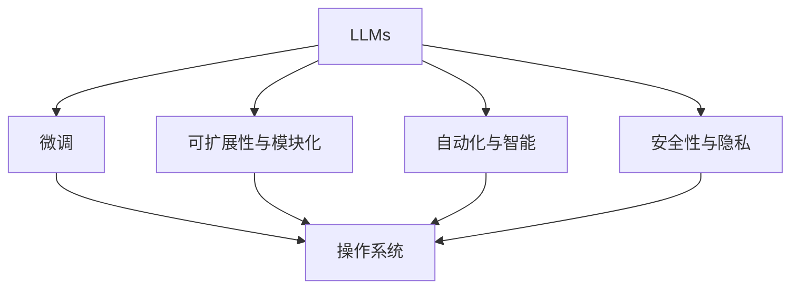
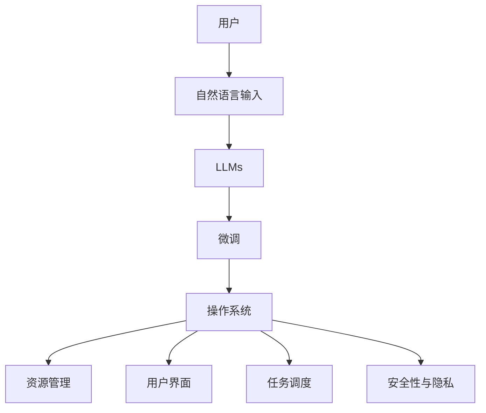

                 

# 下一代OS：LLM操作系统的设计理念

## 1. 背景介绍

### 1.1 问题由来

随着人工智能（AI）技术的迅猛发展，尤其是语言模型的进步，传统的操作系统（OS）正面临着重大变革。语言模型，特别是大型语言模型（LLMs），已经展示了令人惊叹的性能，能够处理复杂的自然语言任务。然而，这些语言模型通常基于自然语言处理（NLP）框架进行微调和训练，与传统操作系统脱节，无法直接应用于操作系统的核心任务。因此，如何结合LLMs与操作系统，成为亟待解决的问题。

### 1.2 问题核心关键点

本文旨在探讨一种创新的操作系统设计理念，即基于LLMs构建下一代操作系统。其核心关键点包括：

1. **LLMs的引入**：利用LLMs强大的语言理解和生成能力，提升操作系统的用户交互体验。
2. **系统性能优化**：通过优化LLMs的应用，提升操作系统的整体性能。
3. **安全性与隐私**：确保LLMs在操作系统中的应用不会引入新的安全漏洞和隐私风险。
4. **可扩展性与模块化**：设计可扩展的系统架构，允许易添加新的LLMs和功能模块。
5. **自动化与智能**：利用LLMs实现自动化任务和智能决策。

## 2. 核心概念与联系

### 2.1 核心概念概述

为更好地理解LLM操作系统，我们需要了解几个关键概念：

1. **大型语言模型（LLMs）**：基于深度学习的模型，能够处理和生成自然语言，具备语言理解与生成能力。
2. **操作系统（OS）**：计算机系统的核心软件，负责管理硬件资源，提供用户接口。
3. **微调（Fine-Tuning）**：通过少量标注数据，优化模型在特定任务上的性能。
4. **可扩展性与模块化**：系统设计应支持添加新功能和LLMs。
5. **自动化与智能**：利用LLMs实现自动化任务和智能决策。
6. **安全性与隐私**：确保LLMs应用不会引入新的安全漏洞和隐私风险。

这些概念之间的联系如图2所示。LLMs通过微调应用于操作系统，提升系统的自动化和智能水平。同时，系统需要具备可扩展性和模块化，以适应不同LLMs和功能的添加。安全性与隐私则是系统设计和应用的重要保障。



### 2.2 核心概念原理和架构的 Mermaid 流程图

以下是一个简单的Mermaid流程图，展示了LLM操作系统中关键概念之间的联系：



这个流程图展示了从用户输入到LLMs微调，再到操作系统资源管理、用户界面、任务调度的整个过程。

## 3. 核心算法原理 & 具体操作步骤

### 3.1 算法原理概述

基于LLMs的操作系统的核心算法原理包括以下几个方面：

1. **用户交互提升**：通过LLMs的自然语言处理能力，提升操作系统的用户界面交互体验。
2. **自动化任务处理**：利用LLMs执行自动化任务，如智能搜索、任务调度等。
3. **智能决策支持**：通过LLMs提供智能决策支持，提高操作系统的决策效率。
4. **系统性能优化**：优化LLMs的应用，提升操作系统的整体性能。

### 3.2 算法步骤详解

基于LLMs的操作系统的构建主要包括以下几个步骤：

1. **LLMs选择与微调**：选择适合的LLMs，并根据操作系统需求进行微调。
2. **系统架构设计**：设计操作系统的模块化架构，支持不同LLMs和功能模块的添加。
3. **用户交互界面开发**：开发友好的用户界面，支持自然语言输入和输出。
4. **资源管理与调度**：优化资源管理与调度，确保系统的高效运行。
5. **安全性与隐私保护**：设计安全机制，保护用户数据和系统安全。

### 3.3 算法优缺点

基于LLMs的操作系统的优点包括：

1. **提升用户体验**：通过自然语言处理，提升用户界面交互体验。
2. **自动化任务处理**：利用LLMs处理自动化任务，提高系统效率。
3. **智能决策支持**：提供智能决策支持，优化系统决策过程。
4. **可扩展性与模块化**：设计可扩展的架构，便于添加新功能和LLMs。

缺点则包括：

1. **复杂度增加**：系统设计和开发复杂度增加，需要处理更多LLMs和功能模块。
2. **性能优化挑战**：需要优化LLMs的应用，以确保系统的高效运行。
3. **安全性与隐私风险**：LLMs应用可能引入新的安全漏洞和隐私风险。

### 3.4 算法应用领域

基于LLMs的操作系统的应用领域包括：

1. **智能桌面**：提供智能搜索、任务调度和决策支持等功能。
2. **智能移动设备**：提升移动设备的智能交互和自动化任务处理。
3. **智能车载系统**：提供语音控制、智能导航和任务处理功能。
4. **智能家居**：通过自然语言交互，提升家居设备的自动化和智能化水平。
5. **企业操作系统**：提升企业办公系统的自动化和智能决策支持。

## 4. 数学模型和公式 & 详细讲解 & 举例说明

### 4.1 数学模型构建

基于LLMs的操作系统的数学模型构建主要包括以下几个方面：

1. **用户输入与输出模型**：用户输入与输出的自然语言处理模型。
2. **任务处理模型**：自动化任务处理的模型。
3. **决策支持模型**：智能决策支持的模型。
4. **系统性能优化模型**：提升系统性能的模型。

### 4.2 公式推导过程

以下是一个简单的公式推导示例：

假设用户输入的查询为自然语言，LLMs处理的输出为执行结果。设用户输入为 $x$，LLMs处理的输出为 $y$。则查询-回答模型的公式推导如下：

$$
y = f(x; \theta)
$$

其中 $f$ 为LLMs处理函数，$\theta$ 为LLMs模型参数。

### 4.3 案例分析与讲解

以下是一个基于LLMs的操作系统的案例分析：

假设用户输入一个查询："今天天气怎么样？"。LLMs处理后输出："今天天气晴朗，温度26摄氏度。"。操作系统根据LLMs的输出，进行天气数据的显示，并根据用户需求进行任务调度。

## 5. 项目实践：代码实例和详细解释说明

### 5.1 开发环境搭建

构建基于LLMs的操作系统，需要以下开发环境：

1. **Python环境**：确保Python版本为3.8以上，并安装必要的库。
2. **LLMs库**：安装OpenAI的GPT-3等LLMs库。
3. **操作系统库**：安装操作系统相关的库，如Linux的POSIX库。
4. **用户界面库**：安装Flask或Django等用户界面库。

### 5.2 源代码详细实现

以下是一个简单的基于LLMs的操作系统的Python代码实现示例：

```python
from flask import Flask, request, jsonify
import openai

app = Flask(__name__)

@app.route('/api/query', methods=['POST'])
def query():
    message = request.json.get('message')
    openai.api_key = 'your_api_key'
    response = openai.Completion.create(
        engine='text-davinci-003',
        prompt=message,
        max_tokens=50
    )
    return jsonify(response.choices[0].text)

if __name__ == '__main__':
    app.run(debug=True)
```

### 5.3 代码解读与分析

上述代码实现了简单的LLMs查询API。当用户通过POST请求发送查询时，服务器接收并使用GPT-3进行查询处理，返回处理结果。

### 5.4 运行结果展示

运行上述代码，可以通过浏览器访问 `http://localhost:5000/api/query` 接口，发送查询请求，获取LLMs处理结果。

## 6. 实际应用场景

### 6.1 智能桌面

基于LLMs的智能桌面系统可以提升用户体验和系统效率。用户可以通过自然语言输入进行搜索、任务调度和决策支持。例如，用户可以输入 "今天明天的会议是什么"，系统返回会议信息，并根据用户需求进行任务调度。

### 6.2 智能移动设备

基于LLMs的智能移动设备可以提升移动设备的智能化水平。用户可以通过语音助手进行查询、任务调度和决策支持。例如，用户可以询问 "明天的天气如何"，系统返回天气信息，并根据用户需求进行任务调度。

### 6.3 智能车载系统

基于LLMs的智能车载系统可以提升车载设备的智能化水平。用户可以通过语音助手进行导航、任务调度和决策支持。例如，用户可以询问 "最近的加油站在哪里"，系统返回加油站信息，并根据用户需求进行导航。

### 6.4 智能家居

基于LLMs的智能家居系统可以提升家居设备的智能化水平。用户可以通过自然语言交互进行控制和任务调度。例如，用户可以输入 "打开客厅的灯"，系统执行任务，并根据用户需求进行控制。

### 6.5 企业操作系统

基于LLMs的企业操作系统可以提升企业的办公效率和决策支持。用户可以通过自然语言输入进行查询、任务调度和决策支持。例如，用户可以输入 "今天会议的时间安排"，系统返回会议信息，并根据用户需求进行任务调度。

## 7. 工具和资源推荐

### 7.1 学习资源推荐

1. **《深度学习》书籍**：全面介绍深度学习的基础理论和应用。
2. **《自然语言处理基础》课程**：涵盖自然语言处理的基本概念和经典模型。
3. **《Python编程》书籍**：介绍Python语言的基础知识和编程技巧。
4. **《操作系统原理》书籍**：深入介绍操作系统的基本原理和设计思路。
5. **《大型语言模型》书籍**：详细介绍大型语言模型的理论基础和应用。

### 7.2 开发工具推荐

1. **Python**：广泛应用于深度学习和操作系统开发的通用编程语言。
2. **OpenAI GPT-3**：提供强大的自然语言处理能力。
3. **Flask**：轻量级的Web框架，便于实现自然语言API。
4. **Django**：功能强大的Web框架，适用于复杂的应用开发。
5. **Linux**：提供操作系统的核心支持。

### 7.3 相关论文推荐

1. **《大型语言模型的设计与实现》**：详细介绍大型语言模型的架构和应用。
2. **《基于自然语言处理的操作系统设计》**：探讨如何结合自然语言处理技术提升操作系统性能。
3. **《智能操作系统的研究进展》**：总结智能操作系统的最新研究成果和应用案例。

## 8. 总结：未来发展趋势与挑战

### 8.1 研究成果总结

本文主要探讨了基于LLMs的操作系统的设计理念和应用实践。通过LLMs的引入和微调，可以提升操作系统的自动化和智能水平。然而，系统设计和开发复杂度增加，需要解决性能优化、安全性与隐私保护等问题。

### 8.2 未来发展趋势

1. **更高的智能水平**：未来的操作系统将具备更高的智能水平，能够处理更加复杂和多样化的自然语言任务。
2. **更好的用户体验**：通过自然语言处理，提升操作系统的用户界面交互体验。
3. **更高效的资源管理**：优化LLMs的应用，提高操作系统的整体性能。
4. **更强的安全性与隐私保护**：设计安全机制，保护用户数据和系统安全。
5. **更高的可扩展性**：设计可扩展的架构，便于添加新的LLMs和功能模块。

### 8.3 面临的挑战

1. **系统设计和开发的复杂度增加**：系统需要处理更多LLMs和功能模块。
2. **性能优化挑战**：需要优化LLMs的应用，以确保系统的高效运行。
3. **安全性与隐私风险**：LLMs应用可能引入新的安全漏洞和隐私风险。
4. **资源消耗增加**：LLMs的处理需要大量的计算资源。
5. **模型更新频率**：需要定期更新LLMs，以保持系统的最新状态。

### 8.4 研究展望

未来的研究可以从以下几个方面进行：

1. **更高效的LLMs应用**：优化LLMs的应用，提高系统性能。
2. **安全性与隐私保护**：设计安全机制，保护用户数据和系统安全。
3. **更好的用户体验**：提升用户界面交互体验。
4. **可扩展的架构设计**：设计可扩展的架构，便于添加新的LLMs和功能模块。
5. **更强的自动化与智能**：提供智能决策支持，提升操作系统的自动化水平。

总之，基于LLMs的操作系统的设计理念为操作系统的智能化和自动化带来了新的机遇。然而，系统的设计和开发复杂度增加，需要解决一系列挑战。未来的研究将围绕系统性能优化、安全性与隐私保护等方面进行，以实现更加智能、高效、安全的操作系统。

## 9. 附录：常见问题与解答

### Q1: 什么是大型语言模型？

A: 大型语言模型是基于深度学习的模型，能够处理和生成自然语言。常见的模型包括GPT-3、BERT等。

### Q2: 如何使用LLMs提升操作系统的性能？

A: 可以通过自然语言处理，提升操作系统的用户界面交互体验和自动化任务处理效率。例如，通过自然语言查询，获取系统信息和执行任务。

### Q3: 基于LLMs的操作系统的安全性与隐私保护如何实现？

A: 需要设计安全机制，保护用户数据和系统安全。例如，采用加密技术、访问控制等措施，确保LLMs的应用安全。

### Q4: 基于LLMs的操作系统的应用场景有哪些？

A: 适用于智能桌面、智能移动设备、智能车载系统、智能家居和企业操作系统等场景。

### Q5: 基于LLMs的操作系统的设计难点有哪些？

A: 系统设计和开发的复杂度增加，需要解决性能优化、安全性与隐私保护等问题。同时，需要优化LLMs的应用，以确保系统的高效运行。

作者：禅与计算机程序设计艺术 / Zen and the Art of Computer Programming

