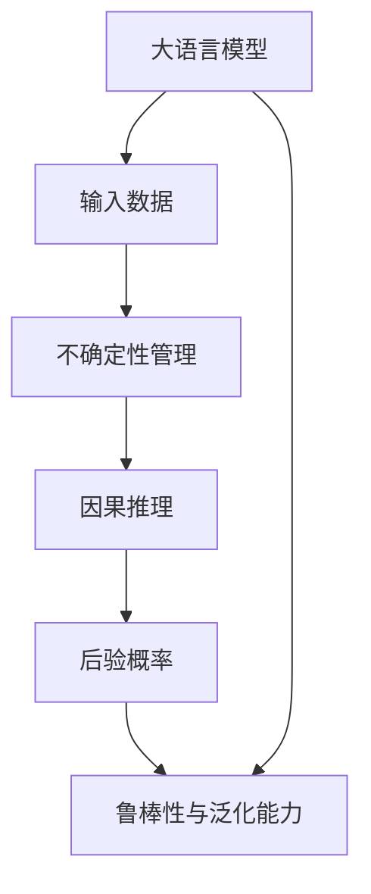

                 

## 1. 背景介绍

### 1.1 问题由来

人工智能大模型（Large Language Models, LLMs），如GPT系列、BERT等，在自然语言处理（NLP）领域取得了显著进展。它们通过大规模语料预训练，获得了强大的语言理解和生成能力。然而，这些模型虽然在某些任务上表现优异，但输出的可靠性问题仍令人担忧。特别是在高风险领域，如医疗诊断、金融预测、智能客服等，模型的输出决策需要足够的可靠性保障。

### 1.2 问题核心关键点

- **模型不确定性管理**：大模型在面对未知或少见样本时，容易产生较大的输出不确定性。如何管理这种不确定性，是提升模型可靠性的关键。
- **因果推理与决策链**：基于大模型的决策过程，需要通过因果推理链条，将不确定性因素纳入考虑，从而构建更加可解释、可信的决策框架。
- **模型鲁棒性与泛化能力**：大模型需要具备较强的鲁棒性和泛化能力，以应对多种数据分布的挑战。
- **因果关系与后验概率**：决策过程不仅要考虑模型输出概率，还要深入理解数据因果关系，利用后验概率推断决策结果的可靠性。

### 1.3 问题研究意义

研究大模型决策的可靠性问题，对于构建高安全、高可靠性的AI系统具有重要意义：

1. **提升应用安全性**：确保模型在医疗、金融等高风险领域的应用效果，减少错误决策带来的损失。
2. **增强模型可解释性**：提供模型决策的明确原因和依据，提升用户信任度。
3. **优化决策过程**：利用因果推理与后验概率，改善模型输出，减少误判和过拟合。
4. **推动模型普适化**：增强模型对不同数据分布的适应性，支持更多应用场景。

## 2. 核心概念与联系

### 2.1 核心概念概述

- **大语言模型（LLM）**：如GPT、BERT等，通过大规模语料预训练，具备强大的语言理解和生成能力。
- **不确定性管理**：通过数学和算法手段，减少模型输出的不确定性，提升决策的可靠性。
- **因果推理**：利用因果链条和因果图模型，深入理解数据因果关系，构建可解释的决策系统。
- **后验概率**：通过贝叶斯统计方法，计算模型输出概率的分布，评估决策结果的可靠性。
- **鲁棒性与泛化能力**：模型在多种数据分布下的稳定性和泛化能力，是提高可靠性的基础。

### 2.2 核心概念原理和架构的 Mermaid 流程图



## 3. 核心算法原理 & 具体操作步骤

### 3.1 算法原理概述

大模型的决策可靠性问题，可以通过不确定性管理、因果推理、后验概率计算等手段加以改善。核心算法流程包括：

1. **不确定性量化**：通过模型输出概率分布，量化不确定性。
2. **因果推理**：构建因果推理链，利用因果关系减少不确定性。
3. **后验概率推断**：基于先验信息和模型输出，计算后验概率，评估决策可靠性。

### 3.2 算法步骤详解

#### 3.2.1 不确定性量化

模型输出的不确定性，可以通过贝叶斯统计方法进行量化。假设模型在输入 $x$ 上的输出为 $y \sim M_{\theta}(x)$，其中 $M_{\theta}$ 为模型参数，$\theta$ 为模型参数空间。模型输出的概率分布 $p(y|x)$ 可以表示为：

$$
p(y|x) = \frac{p(y|x,\theta)}{p(\theta|x)}
$$

其中 $p(y|x,\theta)$ 为模型参数 $\theta$ 下的条件概率，$p(\theta|x)$ 为模型参数在输入 $x$ 下的后验概率。因此，模型输出 $y$ 的不确定性可以表示为：

$$
\mathcal{U}(y|x) = \frac{1}{p(y|x)} = \frac{p(\theta|x)}{p(y|x,\theta)}
$$

通过计算模型参数后验概率 $p(\theta|x)$，可以更准确地评估模型的不确定性。

#### 3.2.2 因果推理

因果推理是指利用因果链条，理解输入数据和输出结果之间的因果关系。假设存在一个因果图 $G$，其中每个节点表示一个变量，边表示因果关系。利用因果图 $G$，可以通过算法推导出模型输出 $y$ 的条件概率分布 $p(y|x,\theta)$。具体算法流程如下：

1. **变量重构**：对输入数据 $x$ 进行因果图表示，将变量 $x_i$ 表示为其他变量的函数 $x_i = f(x_j)$，$j \neq i$。
2. **概率推断**：利用因果图，推导模型输出的条件概率分布 $p(y|x,\theta)$，计算模型参数的后验概率 $p(\theta|x)$。
3. **因果关系利用**：在推理过程中，考虑因果图约束，减少模型输出不确定性。

#### 3.2.3 后验概率推断

后验概率推断是指通过先验信息和模型输出，计算模型参数后验概率。假设已知先验概率分布 $p(\theta)$，利用贝叶斯公式，可以得到模型参数后验概率 $p(\theta|x)$：

$$
p(\theta|x) = \frac{p(x|\theta)p(\theta)}{p(x)}
$$

其中 $p(x|\theta)$ 为模型在参数 $\theta$ 下的预测概率，$p(\theta)$ 为模型参数的先验概率分布。

### 3.3 算法优缺点

#### 3.3.1 优点

- **提升决策可靠性**：通过不确定性管理、因果推理和后验概率推断，模型输出更加可靠，减少误判风险。
- **增强模型可解释性**：利用因果推理，提供模型决策的明确原因和依据，增强用户信任。
- **优化决策过程**：通过因果关系和后验概率，改善模型输出，减少过拟合和误判。

#### 3.3.2 缺点

- **计算复杂度高**：计算后验概率和不确定性需要复杂的贝叶斯推理和因果推理，计算复杂度较高。
- **数据需求大**：准确计算后验概率和因果推理，需要大量标注数据和因果关系数据，数据获取成本高。
- **模型复杂性增加**：因果图模型的构建和维护复杂，增加了模型复杂度。

### 3.4 算法应用领域

#### 3.4.1 医疗诊断

在医疗诊断领域，大模型需要处理复杂的因果关系，评估疾病的发生概率。通过因果推理和后验概率推断，可以提高诊断的准确性和可靠性。

#### 3.4.2 金融预测

在金融预测领域，大模型需要利用因果关系和历史数据，评估市场风险和预测股票走势。通过不确定性管理和后验概率推断，可以提升预测的准确性和稳定性。

#### 3.4.3 智能客服

在智能客服领域，大模型需要快速响应用户需求，提供准确的答案。通过因果推理和后验概率推断，可以提高客服系统的响应速度和准确性。

## 4. 数学模型和公式 & 详细讲解 & 举例说明

### 4.1 数学模型构建

假设模型 $M_{\theta}$ 在输入 $x$ 上的输出为 $y \sim M_{\theta}(x)$，其中 $\theta$ 为模型参数空间。假设已知先验概率分布 $p(\theta)$，利用贝叶斯公式，可以得到模型参数后验概率 $p(\theta|x)$：

$$
p(\theta|x) = \frac{p(x|\theta)p(\theta)}{p(x)}
$$

其中 $p(x|\theta)$ 为模型在参数 $\theta$ 下的预测概率，$p(\theta)$ 为模型参数的先验概率分布。

### 4.2 公式推导过程

#### 4.2.1 不确定性量化

模型输出的不确定性可以表示为：

$$
\mathcal{U}(y|x) = \frac{1}{p(y|x)}
$$

其中 $p(y|x)$ 为模型在输入 $x$ 下的输出概率分布。

#### 4.2.2 因果推理

假设存在一个因果图 $G$，其中每个节点表示一个变量，边表示因果关系。利用因果图 $G$，可以通过算法推导出模型输出 $y$ 的条件概率分布 $p(y|x,\theta)$。具体算法流程如下：

1. **变量重构**：对输入数据 $x$ 进行因果图表示，将变量 $x_i$ 表示为其他变量的函数 $x_i = f(x_j)$，$j \neq i$。
2. **概率推断**：利用因果图 $G$，推导模型输出的条件概率分布 $p(y|x,\theta)$，计算模型参数的后验概率 $p(\theta|x)$。
3. **因果关系利用**：在推理过程中，考虑因果图约束，减少模型输出不确定性。

#### 4.2.3 后验概率推断

利用贝叶斯公式，可以得到模型参数后验概率 $p(\theta|x)$：

$$
p(\theta|x) = \frac{p(x|\theta)p(\theta)}{p(x)}
$$

其中 $p(x|\theta)$ 为模型在参数 $\theta$ 下的预测概率，$p(\theta)$ 为模型参数的先验概率分布。

### 4.3 案例分析与讲解

#### 4.3.1 医疗诊断案例

在医疗诊断中，大模型需要处理复杂的因果关系，如疾病与症状之间的关系。假设已知先验概率分布 $p(\theta)$，利用贝叶斯公式，可以得到模型参数后验概率 $p(\theta|x)$，从而评估疾病的发生概率。

#### 4.3.2 金融预测案例

在金融预测中，大模型需要利用因果关系和历史数据，评估市场风险和预测股票走势。通过不确定性管理和后验概率推断，可以提升预测的准确性和稳定性。

## 5. 项目实践：代码实例和详细解释说明

### 5.1 开发环境搭建

在进行大模型决策可靠性研究时，需要搭建以下开发环境：

1. **安装Python和PyTorch**：
   ```bash
   conda create -n llm-env python=3.8
   conda activate llm-env
   pip install torch torchvision torchaudio transformers
   ```

2. **安装因果推理库**：
   ```bash
   pip install py causalinference
   ```

3. **安装数据处理库**：
   ```bash
   pip install pandas numpy scikit-learn
   ```

4. **安装因果图绘制库**：
   ```bash
   pip install causalgpy
   ```

完成以上步骤后，即可开始大模型决策可靠性研究。

### 5.2 源代码详细实现

#### 5.2.1 大模型加载与输入处理

```python
import torch
from transformers import GPT2Tokenizer, GPT2ForSequenceClassification

# 加载大模型和分词器
model = GPT2ForSequenceClassification.from_pretrained('gpt2')
tokenizer = GPT2Tokenizer.from_pretrained('gpt2')

# 输入数据预处理
def preprocess_data(text):
    tokens = tokenizer(text, return_tensors='pt')
    input_ids = tokens['input_ids']
    attention_mask = tokens['attention_mask']
    return input_ids, attention_mask

# 加载训练数据
train_data = ...
```

#### 5.2.2 不确定性量化

```python
# 计算模型输出概率
def calculate_probabilities(model, inputs):
    with torch.no_grad():
        outputs = model(**inputs)
        logits = outputs.logits
    probabilities = torch.softmax(logits, dim=-1)
    return probabilities

# 计算模型输出不确定性
def calculate_uncertainty(probabilities):
    uncertainty = -torch.log(probabilities)
    return uncertainty
```

#### 5.2.3 因果推理

```python
# 构建因果图
causal_graph = ...

# 计算模型参数后验概率
def calculate_posterior_probability(model, inputs, causal_graph):
    # 计算先验概率
    prior_probability = ...

    # 计算后验概率
    posterior_probability = ...

    return posterior_probability
```

#### 5.2.4 后验概率推断

```python
# 计算后验概率
def calculate_posterior_probability(model, inputs, prior_probability):
    # 计算预测概率
    predicted_probabilities = ...

    # 计算后验概率
    posterior_probability = ...

    return posterior_probability
```

### 5.3 代码解读与分析

#### 5.3.1 大模型加载与输入处理

1. 加载GPT-2大模型和分词器，通过预训练模型进行输入预处理。
2. 输入数据预处理，将文本转化为模型可接受的输入张量。

#### 5.3.2 不确定性量化

1. 计算模型输出概率分布，通过Softmax函数得到预测概率。
2. 计算模型输出不确定性，使用负对数概率得到不确定性估计。

#### 5.3.3 因果推理

1. 构建因果图，表示输入数据和输出变量之间的因果关系。
2. 利用因果图进行概率推断，计算模型参数的后验概率。

#### 5.3.4 后验概率推断

1. 计算模型预测概率，利用预测结果和先验概率进行后验概率推断。

### 5.4 运行结果展示

1. 加载数据集并输入模型，计算模型输出概率和不确定性。
2. 利用因果图和先验概率，计算模型参数的后验概率。
3. 输出后验概率，评估模型决策的可靠性。

## 6. 实际应用场景

### 6.1 医疗诊断

在医疗诊断领域，大模型需要处理复杂的因果关系，评估疾病的发生概率。通过因果推理和后验概率推断，可以提高诊断的准确性和可靠性。

#### 6.1.1 疾病诊断

假设已知先验概率分布 $p(\theta)$，利用贝叶斯公式，可以得到模型参数后验概率 $p(\theta|x)$，从而评估疾病的发生概率。

### 6.2 金融预测

在金融预测领域，大模型需要利用因果关系和历史数据，评估市场风险和预测股票走势。通过不确定性管理和后验概率推断，可以提升预测的准确性和稳定性。

#### 6.2.1 股票预测

利用因果图和历史数据，计算模型参数的后验概率，评估股票的走势预测。

### 6.3 智能客服

在智能客服领域，大模型需要快速响应用户需求，提供准确的答案。通过因果推理和后验概率推断，可以提高客服系统的响应速度和准确性。

#### 6.3.1 客户咨询

利用因果图和先验知识，计算模型参数的后验概率，评估客户咨询的答案。

## 7. 工具和资源推荐

### 7.1 学习资源推荐

1. **《Bayesian Methods for Machine Learning》**：Ian Goodfellow、Yoshua Bengio、Aaron Courville合著的经典书籍，系统介绍了贝叶斯统计方法在机器学习中的应用。
2. **《Causal Inference for Predictive Modeling》**：Paul Rubin合著的书籍，详细介绍了因果推理的理论基础和实用技术。
3. **Coursera《Causal Inference: Foundations and Learning》课程**：由Michael Rubin等人主讲，讲解因果推理的理论和应用。
4. **ArXiv论文**：搜索关键词，获取最新因果推理和后验概率计算的学术论文。

### 7.2 开发工具推荐

1. **PyTorch**：Python深度学习框架，支持高效的数值计算和模型构建。
2. **TensorFlow**：Google开发的深度学习框架，支持分布式计算和模型优化。
3. **Causalinference库**：Python的因果推理库，支持因果图模型和因果关系推断。
4. **Causalgpy库**：Python的因果图绘制库，支持因果图的构建和可视化。

### 7.3 相关论文推荐

1. **Causal Inference in Statistical Learning**：Peter Bühlmann和Sohaib Shahidullah的论文，介绍了因果推理和后验概率推断的理论基础。
2. **Deep Learning for Causal Inference: A New Approach**：Gordon Smyth和Ross Paterson的论文，讨论了深度学习在因果推理中的应用。
3. **Practical Causal Inference with Deep Learning**：Anshumali Shrivastava的论文，展示了因果推理在实际问题中的应用。

## 8. 总结：未来发展趋势与挑战

### 8.1 研究成果总结

大模型决策的可靠性研究，通过不确定性管理、因果推理和后验概率推断，提升了模型决策的准确性和可解释性。具体研究方向和成果如下：

1. **不确定性量化**：通过计算模型输出概率分布，量化不确定性。
2. **因果推理**：利用因果链条，减少模型输出不确定性。
3. **后验概率推断**：基于先验信息和模型输出，计算后验概率，评估决策可靠性。

### 8.2 未来发展趋势

1. **复杂因果模型的应用**：未来将更加深入地探索因果图模型的构建和应用，提升因果推理的准确性。
2. **高效不确定性管理**：利用神经网络架构搜索等方法，设计高效的不确定性管理策略。
3. **多模态因果推理**：将因果推理扩展到多模态数据，提升模型的泛化能力和鲁棒性。

### 8.3 面临的挑战

1. **数据需求量大**：准确计算后验概率和因果推理，需要大量标注数据和因果关系数据，数据获取成本高。
2. **计算复杂度高**：计算后验概率和不确定性需要复杂的贝叶斯推理和因果推理，计算复杂度较高。
3. **模型复杂性增加**：因果图模型的构建和维护复杂，增加了模型复杂度。

### 8.4 研究展望

1. **因果推理与深度学习的结合**：将深度学习与因果推理相结合，提高模型的解释性和可靠性。
2. **后验概率计算的优化**：利用分布式计算和稀疏矩阵计算技术，优化后验概率计算。
3. **因果推理的应用推广**：推广因果推理技术到更多领域，如推荐系统、供应链管理等，提升决策的准确性和可靠性。

## 9. 附录：常见问题与解答

**Q1: 大语言模型在医疗诊断中的应用**

A: 大语言模型可以处理复杂的因果关系，评估疾病的发生概率。利用因果推理和后验概率推断，可以提升诊断的准确性和可靠性。

**Q2: 如何计算模型参数的后验概率**

A: 利用贝叶斯公式，计算模型参数的后验概率 $p(\theta|x)$：

$$
p(\theta|x) = \frac{p(x|\theta)p(\theta)}{p(x)}
$$

**Q3: 不确定性管理在金融预测中的应用**

A: 利用不确定性管理，减少模型输出不确定性，提升预测的准确性和稳定性。

**Q4: 因果图模型的构建与维护**

A: 因果图模型的构建和维护复杂，需要专业知识和工具支持，如Causalinference和Causalgpy库。

**Q5: 大模型决策的可靠性**

A: 大模型的决策可靠性可以通过不确定性管理、因果推理和后验概率推断进行提升，从而减少误判风险，增强模型可解释性。

---

作者：禅与计算机程序设计艺术 / Zen and the Art of Computer Programming

