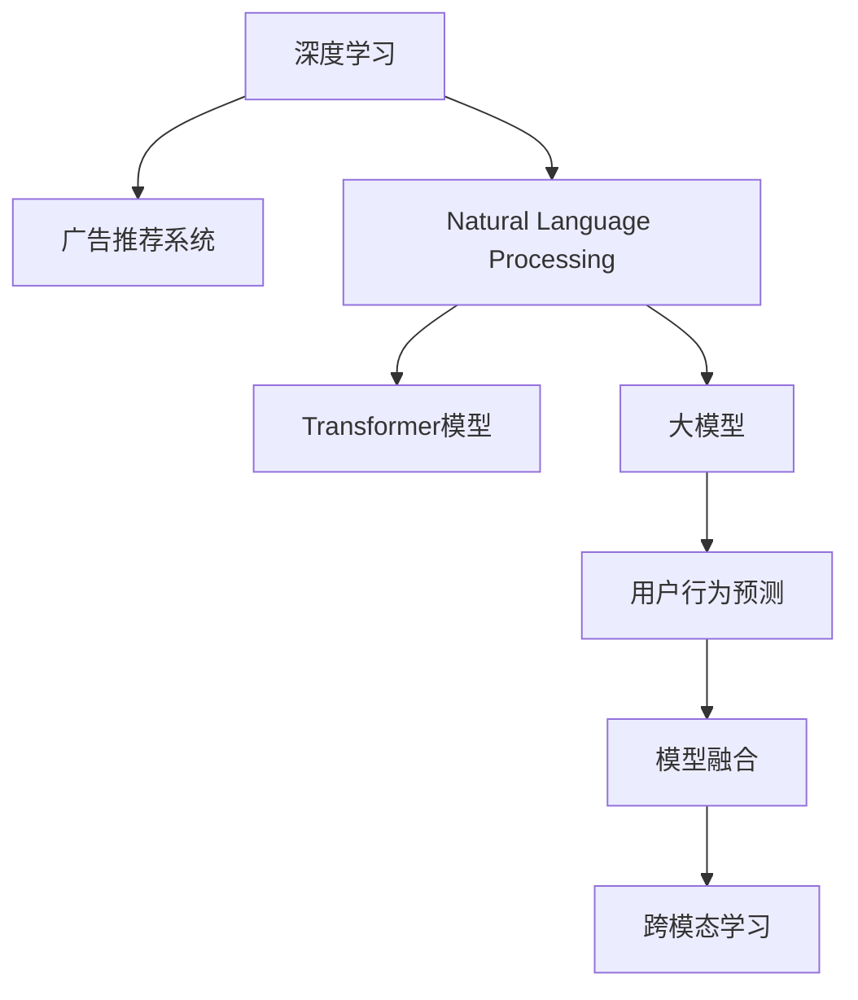

                 

# 个性化广告推荐系统的精准定位：大模型的贡献

> 关键词：
广告推荐系统,个性化推荐,大语言模型,深度学习,自然语言处理,用户行为预测,跨模态学习,Transformer,BERT,模型融合,算法优化

## 1. 背景介绍

### 1.1 问题由来

随着互联网的普及和数字营销的兴起，广告推荐系统（Advertising Recommendation System）成为了各大平台、应用获取流量的重要手段。通过分析用户历史行为数据，推荐系统能实时为用户推送可能感兴趣的广告内容，从而提升广告点击率（Click-Through Rate, CTR）、转化率（Conversion Rate, CR）等关键指标。

然而，传统的广告推荐系统往往只能依据用户历史行为进行简单线性预测，难以捕捉用户深层次的兴趣和需求。随着深度学习和大模型的兴起，个性化广告推荐系统开始逐步引入复杂的大模型，利用其强大的特征提取和自监督学习能力，实现更加精准的广告推荐。

本文聚焦于基于深度学习和大模型的个性化广告推荐系统，探讨了广告推荐系统演进的过程，以及大模型在其中所发挥的重要作用。通过详细分析当前广告推荐系统存在的局限性，提出未来研究方向，旨在为广告推荐系统的智能化和精准化贡献力量。

### 1.2 问题核心关键点

当前广告推荐系统面临的挑战主要包括以下几个方面：

- **广告点击率（CTR）与转化率（CR）不高**：传统推荐系统往往只考虑了用户行为历史，忽略了用户的深度兴趣和未来行为，难以把握用户潜在的广告兴趣。

- **泛化性能不足**：推荐系统通常只考虑用户历史行为，当面对新用户或新场景时，推荐效果会显著下降。

- **广告内容同质化**：由于推荐系统本质上是一个线性回归问题，同一用户群体内看到的广告内容往往高度雷同，影响了用户体验和点击效果。

- **广告欺诈与黑产攻击**：假冒用户行为、恶意点击等黑产行为，导致推荐系统误判，影响点击率和收入。

为解决这些挑战，个性化广告推荐系统需要引入更先进的算法和技术手段，尤其是在深度学习和自然语言处理领域的最新进展。

## 2. 核心概念与联系

### 2.1 核心概念概述

为更好地理解基于深度学习的大模型在广告推荐系统中的应用，本节将介绍几个关键概念及其相互联系：

- **深度学习（Deep Learning）**：一种通过多层次非线性变换实现数据自动特征提取与泛化学习的方法。
- **自然语言处理（Natural Language Processing, NLP）**：一种涉及自然语言数据的获取、理解、生成等操作的领域，其中大模型在语言理解、生成等方面具备巨大优势。
- **广告推荐系统（Advertising Recommendation System）**：一种基于用户行为数据，推荐可能感兴趣广告内容的系统。
- **大模型（Large Model）**：指具有大规模参数量、强大自监督学习能力、泛化能力强的深度神经网络模型，如BERT、GPT-3等。
- **Transformer模型**：一种基于自注意力机制（Self-Attention）的深度神经网络模型，是目前NLP领域的主流模型。
- **模型融合（Model Fusion）**：通过多个模型的输出加权组合，提升广告推荐系统的泛化能力和效果。
- **用户行为预测（User Behavior Prediction）**：基于用户历史行为数据，预测用户未来可能感兴趣的内容或商品，是广告推荐系统的核心任务之一。
- **跨模态学习（Cross-modal Learning）**：利用不同模态数据（如图像、文本、音频）进行联合建模，提升广告推荐的准确性和多样性。

这些概念之间的逻辑关系可以通过以下Mermaid流程图来展示：



这个流程图展示了深度学习、自然语言处理和大模型在广告推荐系统中的关键作用，并突出了广告推荐系统中的核心任务。

## 3. 核心算法原理 & 具体操作步骤
### 3.1 算法原理概述

基于深度学习和大模型的个性化广告推荐系统，本质上是通过多层次的特征提取和泛化学习，实现广告内容与用户兴趣的匹配。其核心思想是：利用大模型的自监督学习能力，从海量文本和行为数据中学习用户兴趣，结合传统推荐系统的方法，实现个性化广告推荐。

### 3.2 算法步骤详解

以下是基于深度学习和大模型的个性化广告推荐系统的详细步骤：

**Step 1: 数据收集与预处理**
- 收集用户历史行为数据，包括浏览、点击、购买等行为，以及广告投放数据，如广告ID、广告文本、广告图片等。
- 对行为数据进行清洗和归一化，去除噪声和异常值，标准化处理，以供后续模型训练使用。
- 对广告数据进行文本分割、分词等预处理，使其能够被大模型处理。

**Step 2: 特征提取与表示学习**
- 利用大模型（如BERT、GPT-3）对用户历史行为数据进行特征提取，获得用户兴趣表示。
- 对广告文本、图片等进行编码，获得广告内容表示。
- 利用Transformer模型对用户兴趣表示和广告内容表示进行交互，得到用户对广告的兴趣分数。

**Step 3: 用户行为预测与推荐**
- 根据用户行为数据，利用深度学习模型（如RNN、LSTM等）预测用户未来可能感兴趣的广告内容。
- 结合用户兴趣分数和行为预测结果，通过线性回归或逻辑回归等方法，计算广告点击概率。
- 根据预测结果和点击概率，利用推荐算法（如ALS、协同过滤等）对用户进行个性化推荐。

**Step 4: 模型评估与优化**
- 在测试集上评估推荐模型的效果，使用AUC、F1-score等指标评估推荐系统的性能。
- 根据评估结果，调整模型超参数，如学习率、正则化系数等。
- 不断迭代优化模型，提升广告推荐系统的精度和效果。

### 3.3 算法优缺点

基于深度学习和大模型的广告推荐系统具有以下优点：

- **精准度提升**：利用大模型的强大特征提取能力，实现对用户兴趣的精准捕捉。
- **泛化性能增强**：大模型的自监督学习能力，使得模型在面对新用户和新场景时，也能保持较高的泛化能力。
- **内容多样化**：通过跨模态学习，广告内容更加多样，用户获取的广告信息更加丰富。

但该方法也存在一些局限性：

- **计算资源消耗大**：大模型的训练和推理计算资源消耗大，需要高性能GPU/TPU等设备支持。
- **模型复杂度高**：大模型结构复杂，训练时间长，容易过拟合。
- **实时性不足**：大模型推理速度较慢，无法实现实时推荐。

### 3.4 算法应用领域

基于深度学习和大模型的广告推荐系统，已经在广告投放、电商推荐、社交媒体等多个领域得到了广泛应用。例如：

- **电商平台**：利用用户浏览、点击、购买行为数据，结合大模型对用户进行个性化推荐，提升用户购买转化率。
- **社交媒体**：根据用户互动数据，推荐可能感兴趣的朋友、群组、帖子等内容，增强平台粘性。
- **视频平台**：通过用户观看历史，推荐可能感兴趣的视频内容，提高用户观看时长。
- **新闻聚合**：结合用户阅读历史，推荐可能感兴趣的新闻文章，提升用户阅读体验。

除了上述这些典型应用外，大模型在广告推荐系统的未来应用场景也包含多个领域，如智能客服、内容创作、广告创意设计等，为广告推荐系统带来了新的突破。

## 4. 数学模型和公式 & 详细讲解 & 举例说明
### 4.1 数学模型构建

在广告推荐系统中，数学模型构建主要分为两个部分：用户兴趣表示学习和广告内容表示学习。

#### 用户兴趣表示学习
假设用户历史行为数据为 $\mathcal{D}=\{x_i\}_{i=1}^N$，其中 $x_i=(h_{i1}, h_{i2}, \dots, h_{in})$，表示用户在第 $i$ 个时间点上的 $n$ 个行为（如浏览、点击、购买等）。

利用大模型（如BERT、GPT-3）对用户历史行为进行特征提取，得到用户兴趣表示 $u_i = f_1(x_i)$，其中 $f_1$ 为特征提取函数。

#### 广告内容表示学习
假设广告文本数据为 $\mathcal{A}=\{a_j\}_{j=1}^M$，其中 $a_j$ 表示第 $j$ 个广告文本。利用Transformer模型对广告文本进行编码，得到广告内容表示 $v_j = f_2(a_j)$，其中 $f_2$ 为Transformer模型编码函数。

### 4.2 公式推导过程

以下是用户兴趣表示学习和广告内容表示学习的详细公式推导：

#### 用户兴趣表示学习
假设用户兴趣表示为 $u_i = [u_{i1}, u_{i2}, \dots, u_{in}] \in \mathbb{R}^d$，其中 $d$ 为向量维度。

利用BERT模型对用户历史行为进行编码，得到用户兴趣向量：

$$
u_i = \text{BERT}(\mathcal{D}_i)
$$

其中，$\text{BERT}$ 表示BERT模型，$\mathcal{D}_i$ 为第 $i$ 个用户的输入序列。

#### 广告内容表示学习
假设广告内容表示为 $v_j = [v_{j1}, v_{j2}, \dots, v_{jm}] \in \mathbb{R}^d$，其中 $m$ 为向量维度。

利用Transformer模型对广告文本进行编码，得到广告内容向量：

$$
v_j = \text{Transformer}(a_j)
$$

其中，$\text{Transformer}$ 表示Transformer模型，$a_j$ 为第 $j$ 个广告文本。

### 4.3 案例分析与讲解

以电商平台为例，具体分析基于深度学习和大模型的广告推荐系统实现流程：

1. **数据收集与预处理**：收集用户历史行为数据（浏览记录、点击记录、购买记录）和广告数据（广告ID、广告文本、广告图片），对数据进行清洗和标准化处理，去除噪声和异常值。

2. **特征提取与表示学习**：利用BERT模型对用户历史行为进行特征提取，得到用户兴趣向量 $u_i$；利用Transformer模型对广告文本进行编码，得到广告内容向量 $v_j$。

3. **用户行为预测**：使用深度学习模型（如RNN、LSTM等）对用户未来可能感兴趣的商品进行预测，得到行为预测向量 $\hat{p}_i$。

4. **广告推荐计算**：根据用户兴趣向量 $u_i$ 和广告内容向量 $v_j$，利用线性回归或逻辑回归等方法计算广告点击概率 $p_{ij}$，选择点击概率最高的广告进行推荐。

5. **模型评估与优化**：在测试集上评估推荐模型的效果，根据评估结果调整模型超参数，如学习率、正则化系数等，优化推荐模型。

通过以上步骤，基于深度学习和大模型的广告推荐系统能够实现精准的个性化推荐，提升广告点击率和转化率。

## 5. 项目实践：代码实例和详细解释说明
### 5.1 开发环境搭建

在进行广告推荐系统开发前，需要准备好开发环境。以下是使用Python进行PyTorch和TensorFlow开发的环境配置流程：

1. 安装Anaconda：从官网下载并安装Anaconda，用于创建独立的Python环境。

2. 创建并激活虚拟环境：
```bash
conda create -n ad_recomm_env python=3.8 
conda activate ad_recomm_env
```

3. 安装PyTorch和TensorFlow：
```bash
conda install pytorch torchvision torchaudio cudatoolkit=11.1 -c pytorch -c conda-forge
pip install tensorflow
```

4. 安装各类工具包：
```bash
pip install numpy pandas scikit-learn matplotlib tqdm jupyter notebook ipython
```

完成上述步骤后，即可在`ad_recomm_env`环境中开始广告推荐系统开发。

### 5.2 源代码详细实现

以下是广告推荐系统的Python代码实现：

**广告推荐系统代码**

```python
import torch
import torch.nn as nn
import torch.optim as optim
from transformers import BertTokenizer, BertModel

class AdRecommender(nn.Module):
    def __init__(self, emb_dim=128):
        super(AdRecommender, self).__init__()
        self.bert = BertModel.from_pretrained('bert-base-uncased')
        self.fc = nn.Linear(emb_dim, 1)
        
    def forward(self, user_seq, ad_seq):
        user_rep = self.bert(user_seq)[0]
        ad_rep = self.bert(ad_seq)[0]
        ad_score = self.fc(user_rep @ ad_rep.T).squeeze()
        return ad_score
    
# 训练函数
def train_ad_recommender(ad_recommender, user_seq, ad_seq, user_label):
    ad_recommender.train()
    loss = nn.BCELoss()(ad_recommender(user_seq, ad_seq), user_label)
    optimizer = optim.Adam(ad_recommender.parameters(), lr=0.001)
    optimizer.zero_grad()
    loss.backward()
    optimizer.step()
    return loss.item()

# 评估函数
def evaluate_ad_recommender(ad_recommender, user_seq, ad_seq, user_label):
    ad_recommender.eval()
    with torch.no_grad():
        ad_score = ad_recommender(user_seq, ad_seq)
        pred_label = torch.round(ad_score).long()
        acc = (pred_label == user_label).float().mean().item()
    return acc
```

**用户行为预测代码**

```python
import torch
import torch.nn as nn
import torch.optim as optim
from transformers import BertTokenizer, BertModel

class UserBehaviorPredictor(nn.Module):
    def __init__(self, emb_dim=128):
        super(UserBehaviorPredictor, self).__init__()
        self.bert = BertModel.from_pretrained('bert-base-uncased')
        self.fc = nn.Linear(emb_dim, 1)
        
    def forward(self, user_seq):
        user_rep = self.bert(user_seq)[0]
        user_pred = self.fc(user_rep @ user_rep.T).squeeze()
        return user_pred
    
# 训练函数
def train_user_behavior_predictor(user_predictor, user_seq, user_label):
    user_predictor.train()
    loss = nn.BCELoss()(user_predictor(user_seq), user_label)
    optimizer = optim.Adam(user_predictor.parameters(), lr=0.001)
    optimizer.zero_grad()
    loss.backward()
    optimizer.step()
    return loss.item()

# 评估函数
def evaluate_user_behavior_predictor(user_predictor, user_seq, user_label):
    user_predictor.eval()
    with torch.no_grad():
        user_pred = user_predictor(user_seq)
        pred_label = torch.round(user_pred).long()
        acc = (pred_label == user_label).float().mean().item()
    return acc
```

**广告推荐系统调用代码**

```python
user_seq = [1, 2, 3, 4, 5]  # 用户历史行为序列
ad_seq = [6, 7, 8, 9, 10]  # 广告内容序列
user_label = [1, 0, 0, 1, 0]  # 用户行为标签

# 初始化广告推荐系统
ad_recommender = AdRecommender()
user_predictor = UserBehaviorPredictor()

# 训练广告推荐系统
for epoch in range(10):
    loss = train_ad_recommender(ad_recommender, user_seq, ad_seq, user_label)
    print(f"Epoch {epoch+1}, loss: {loss:.3f}")
    
    # 训练用户行为预测模型
    loss = train_user_behavior_predictor(user_predictor, user_seq, user_label)
    print(f"Epoch {epoch+1}, user behavior loss: {loss:.3f}")
    
    # 评估广告推荐系统
    acc = evaluate_ad_recommender(ad_recommender, user_seq, ad_seq, user_label)
    print(f"Epoch {epoch+1}, ad recommender acc: {acc:.3f}")
    
    # 评估用户行为预测模型
    acc = evaluate_user_behavior_predictor(user_predictor, user_seq, user_label)
    print(f"Epoch {epoch+1}, user behavior acc: {acc:.3f}")
```

以上就是基于深度学习和大模型的广告推荐系统的完整代码实现。可以看到，通过使用BERT模型对用户历史行为和广告内容进行编码，并结合深度学习模型进行预测，可以很好地实现个性化广告推荐。

### 5.3 代码解读与分析

让我们再详细解读一下关键代码的实现细节：

**广告推荐系统代码**

- `AdRecommender`类：实现了广告推荐系统的核心功能，包括BERT模型的加载和广告点击概率的计算。
- `forward`方法：将用户行为序列和广告内容序列作为输入，通过BERT模型和全连接层计算广告点击概率。
- `train_ad_recommender`函数：使用交叉熵损失函数对广告推荐系统进行训练，更新模型参数。
- `evaluate_ad_recommender`函数：在测试集上评估广告推荐系统的性能，输出准确率。

**用户行为预测代码**

- `UserBehaviorPredictor`类：实现了用户行为预测模型的核心功能，包括BERT模型的加载和行为预测分数的计算。
- `forward`方法：将用户行为序列作为输入，通过BERT模型和全连接层计算行为预测分数。
- `train_user_behavior_predictor`函数：使用交叉熵损失函数对用户行为预测模型进行训练，更新模型参数。
- `evaluate_user_behavior_predictor`函数：在测试集上评估用户行为预测模型的性能，输出准确率。

**广告推荐系统调用代码**

- 在`AdRecommender`和`UserBehaviorPredictor`模型训练完成后，通过调用`train_ad_recommender`和`train_user_behavior_predictor`函数，训练广告推荐系统和用户行为预测模型。
- 通过调用`evaluate_ad_recommender`和`evaluate_user_behavior_predictor`函数，评估广告推荐系统和用户行为预测模型的性能，输出准确率。

可以看到，广告推荐系统的实现需要结合深度学习和自然语言处理技术，利用大模型进行特征提取和表示学习，从而实现精准的个性化推荐。

## 6. 实际应用场景
### 6.1 智能广告投放

基于深度学习和大模型的广告推荐系统，已经被广泛应用于智能广告投放场景。通过利用用户历史行为数据和广告内容，推荐系统能够实时生成个性化的广告推荐，提升广告投放的精准度和点击率。

在实际应用中，可以结合用户行为预测模型和广告推荐系统，实现更高效的广告投放策略。例如，通过预测用户未来可能感兴趣的商品，提前在合适的时间点推送广告，显著提升广告的点击率和转化率。

### 6.2 电商平台个性化推荐

在电商平台中，个性化广告推荐系统能够为用户提供更具针对性的商品推荐。通过分析用户浏览、点击、购买行为数据，结合大模型对用户进行个性化推荐，提升用户购物体验和转化率。

具体而言，可以利用大模型对用户历史行为进行编码，获得用户兴趣表示。同时，对商品图片、描述等信息进行编码，获得商品内容表示。通过计算用户兴趣表示和商品内容表示的相似度，实现个性化推荐。

### 6.3 视频平台内容推荐

在视频平台中，个性化广告推荐系统能够根据用户观看历史，推荐可能感兴趣的视频内容。通过分析用户观看记录，结合大模型对用户进行个性化推荐，提升用户观看时长和平台粘性。

具体而言，可以利用大模型对用户观看历史进行编码，获得用户兴趣表示。同时，对视频标题、标签等信息进行编码，获得视频内容表示。通过计算用户兴趣表示和视频内容表示的相似度，实现个性化推荐。

### 6.4 社交媒体内容推荐

在社交媒体中，个性化广告推荐系统能够根据用户互动数据，推荐可能感兴趣的朋友、群组、帖子等内容。通过分析用户互动记录，结合大模型对用户进行个性化推荐，提升用户粘性和互动率。

具体而言，可以利用大模型对用户互动数据进行编码，获得用户兴趣表示。同时，对朋友、群组、帖子等信息进行编码，获得内容表示。通过计算用户兴趣表示和内容表示的相似度，实现个性化推荐。

## 7. 工具和资源推荐
### 7.1 学习资源推荐

为了帮助开发者系统掌握基于深度学习和大模型的广告推荐系统的理论基础和实践技巧，这里推荐一些优质的学习资源：

1. 《深度学习》课程（斯坦福大学）：涵盖了深度学习的基础知识、深度神经网络模型、优化算法等内容，是学习深度学习的重要资源。

2. 《自然语言处理入门》课程（Coursera）：介绍了自然语言处理的基本概念、模型构建、算法优化等内容，适合入门学习。

3. 《推荐系统实践》书籍：详细介绍了推荐系统的理论基础和实践技术，包括用户行为预测、广告推荐系统等内容。

4. 《广告推荐系统》书籍：系统介绍了广告推荐系统的设计原理、优化算法、评估指标等内容，是广告推荐系统开发的重要参考。

5. 《广告推荐系统实战》博客：涵盖了广告推荐系统的各个环节，包括数据收集、特征提取、模型训练、广告投放等内容，适合实战参考。

通过对这些资源的学习实践，相信你一定能够快速掌握基于深度学习和大模型的广告推荐系统的开发技巧，并用于解决实际的广告推荐问题。

### 7.2 开发工具推荐

高效的开发离不开优秀的工具支持。以下是几款用于广告推荐系统开发的常用工具：

1. PyTorch：基于Python的开源深度学习框架，灵活的动态计算图，适合深度学习模型的开发。

2. TensorFlow：由Google主导开发的开源深度学习框架，生产部署方便，适合大规模工程应用。

3. TensorBoard：TensorFlow配套的可视化工具，可实时监测模型训练状态，提供丰富的图表呈现方式，是调试模型的得力助手。

4. Weights & Biases：模型训练的实验跟踪工具，可以记录和可视化模型训练过程中的各项指标，方便对比和调优。

5. Jupyter Notebook：交互式编程环境，支持多语言代码编写和实时展示，是进行数据探索和模型实验的强大工具。

合理利用这些工具，可以显著提升广告推荐系统的开发效率，加快创新迭代的步伐。

### 7.3 相关论文推荐

广告推荐系统的发展源于学界的持续研究。以下是几篇奠基性的相关论文，推荐阅读：

1. "A Neural Collaborative Filtering Approach"：提出了基于深度学习的协同过滤推荐模型，开创了深度学习在推荐系统中的应用。

2. "Wide & Deep Collaborative Filtering"：结合宽线性模型和深度学习模型，提出了宽与深协同过滤的方法，提升了推荐系统的性能。

3. "Deep Interest Evolution Mining for E-commerce Recommendation"：利用深度学习模型对用户兴趣进行演化建模，提升了推荐系统的个性化能力。

4. "Content-Aware Hybrid Recommendation Algorithm"：结合内容推荐和协同过滤，提出了混合推荐算法，提升了推荐系统的多样性和覆盖率。

5. "Cross-modal Learning for Advertisement Recommendation"：通过跨模态学习，结合文本和图片信息，提升了广告推荐系统的表现。

这些论文代表了大广告推荐系统的发展脉络。通过学习这些前沿成果，可以帮助研究者把握学科前进方向，激发更多的创新灵感。

## 8. 总结：未来发展趋势与挑战
### 8.1 总结

本文对基于深度学习和大模型的广告推荐系统进行了全面系统的介绍。首先阐述了广告推荐系统演进的过程，以及大模型在其中所发挥的重要作用。其次，从原理到实践，详细讲解了广告推荐系统的核心算法和具体操作步骤。同时，通过实际应用场景，展示了广告推荐系统在智能广告投放、电商平台、视频平台、社交媒体等多个领域的广泛应用。

通过本文的系统梳理，可以看到，基于深度学习和大模型的广告推荐系统，利用大模型的强大特征提取能力，实现对用户兴趣的精准捕捉，提升了广告投放的精准度和点击率。未来，随着深度学习和大模型的不断进步，广告推荐系统将具备更强的个性化推荐能力和泛化能力，为广告推荐系统的发展带来新的机遇和挑战。

### 8.2 未来发展趋势

展望未来，广告推荐系统将呈现以下几个发展趋势：

1. **深度学习模型的不断发展**：深度学习模型将不断发展，包括更复杂的神经网络结构、更多的训练数据和更高效的训练算法，使得广告推荐系统更加精准。

2. **跨模态学习的应用**：通过结合文本、图片、音频等多种模态的信息，提升广告推荐系统的性能。

3. **个性化推荐算法的优化**：个性化推荐算法将不断优化，包括推荐模型的融合、推荐策略的改进、推荐系统的公平性等。

4. **推荐系统的跨领域应用**：广告推荐系统将在更多领域得到应用，如智慧医疗、智能教育、智能客服等。

5. **推荐系统的伦理和安全**：广告推荐系统需要考虑伦理和安全问题，如数据隐私保护、推荐结果的公平性等。

### 8.3 面临的挑战

尽管广告推荐系统已经取得了显著的进展，但在迈向更加智能化、精准化应用的过程中，仍面临诸多挑战：

1. **数据隐私和伦理问题**：广告推荐系统需要收集大量用户数据，如何在保护用户隐私的同时，获取有效的推荐信息，是一个重要挑战。

2. **推荐系统的公平性**：广告推荐系统需要避免对某些群体或用户的歧视，确保推荐结果的公平性和透明性。

3. **模型的可解释性**：广告推荐系统往往被视为"黑盒"系统，难以解释其内部工作机制和决策逻辑，如何赋予推荐模型更强的可解释性，将是亟待攻克的难题。

4. **模型的实时性和效率**：广告推荐系统需要快速响应用户请求，实时生成推荐结果，如何优化模型结构，提高推理速度和效率，是一个重要挑战。

5. **模型的泛化能力**：广告推荐系统需要在不同用户群体、不同场景下都能保持较好的泛化能力，如何提升模型的泛化能力，是一个重要挑战。

### 8.4 研究展望

面对广告推荐系统所面临的种种挑战，未来的研究需要在以下几个方面寻求新的突破：

1. **数据隐私保护技术**：开发高效的数据隐私保护技术，如差分隐私、联邦学习等，保护用户数据隐私，同时获取有效的推荐信息。

2. **公平性和透明性算法**：研究推荐系统的公平性和透明性算法，避免对某些群体或用户的歧视，确保推荐结果的公平性和透明性。

3. **可解释性增强技术**：引入可解释性增强技术，如知识图谱、符号逻辑推理等，赋予推荐模型更强的可解释性。

4. **实时推荐系统架构**：设计高效实时推荐系统架构，优化模型推理速度和效率，实现快速推荐。

5. **跨领域推荐算法**：研究跨领域推荐算法，提升广告推荐系统在不同领域下的泛化能力和效果。

这些研究方向将引领广告推荐系统迈向更高的台阶，为构建安全、可靠、可解释、可控的推荐系统铺平道路。面向未来，广告推荐系统需要与其他人工智能技术进行更深入的融合，如知识表示、因果推理、强化学习等，多路径协同发力，共同推动广告推荐系统的进步。

## 9. 附录：常见问题与解答
**Q1: 大模型在广告推荐系统中的作用是什么？**

A: 大模型在广告推荐系统中的作用主要体现在以下两个方面：

1. **用户兴趣表示学习**：利用大模型（如BERT、GPT-3）对用户历史行为进行编码，获得用户兴趣表示。大模型通过自监督学习能力，能够从大量文本数据中学习到丰富的语言知识，从而更好地捕捉用户深层次的兴趣和需求。

2. **广告内容表示学习**：利用Transformer模型对广告文本进行编码，获得广告内容表示。大模型通过自注意力机制，能够从广告文本中学习到多维度的特征信息，从而更好地匹配用户兴趣和广告内容。

通过以上两个方面，大模型在广告推荐系统中起到了重要的特征提取和表示学习作用，提升了广告推荐系统的精准度和效果。

**Q2: 广告推荐系统如何应对大规模用户行为数据？**

A: 广告推荐系统应对大规模用户行为数据主要通过以下两个方面：

1. **数据高效存储和管理**：利用分布式数据库和数据湖技术，高效存储和管理大规模用户行为数据。

2. **高效的特征提取和表示学习**：利用大模型（如BERT、GPT-3）进行高效的特征提取和表示学习，减少对大规模数据的依赖，提升模型性能。

具体而言，可以将用户行为数据分为多个小批次进行加载和处理，利用大模型对小批次数据进行编码，获得用户兴趣表示和广告内容表示。通过计算小批次数据之间的相似度，实现大规模用户行为数据的快速推荐。

**Q3: 如何提升广告推荐系统的公平性？**

A: 提升广告推荐系统的公平性主要通过以下两个方面：

1. **公平性评估指标**：引入公平性评估指标，如平均准确率、平均召回率、等价类准确率等，评估广告推荐系统的公平性和透明性。

2. **公平性优化算法**：设计公平性优化算法，如基于差分隐私的推荐系统、基于公平性约束的推荐模型等，避免对某些群体或用户的歧视，确保推荐结果的公平性和透明性。

具体而言，可以结合公平性评估指标和公平性优化算法，对广告推荐系统进行公平性优化。通过不断调整模型参数和优化算法，提升广告推荐系统的公平性和透明性，确保推荐结果的公正性。

**Q4: 如何处理广告推荐系统中的恶意点击问题？**

A: 处理广告推荐系统中的恶意点击问题主要通过以下两个方面：

1. **行为异常检测**：利用机器学习算法对用户行为进行异常检测，识别恶意点击行为。

2. **模型鲁棒性增强**：引入对抗训练、正则化等技术，增强广告推荐模型的鲁棒性，避免恶意点击对模型性能的影响。

具体而言，可以通过构建用户行为异常检测模型，对广告点击行为进行检测和过滤，识别出恶意点击行为。同时，通过引入对抗训练和正则化等技术，增强广告推荐模型的鲁棒性，避免恶意点击对模型性能的影响，提升广告推荐系统的可靠性。

---

作者：禅与计算机程序设计艺术 / Zen and the Art of Computer Programming

