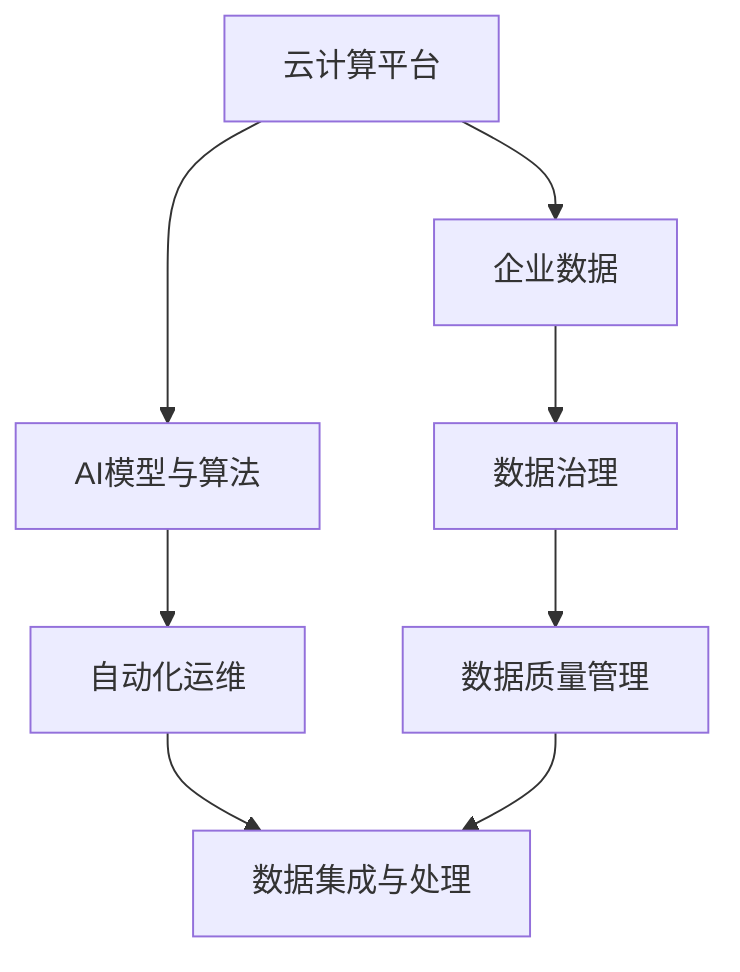
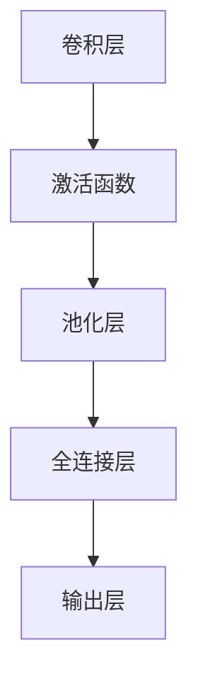

                 

# 云计算与AI的融合：Lepton AI的技术愿景

## 1. 背景介绍

### 1.1 问题由来
在数字经济时代，云计算已成为企业数字化转型的核心驱动力。然而，云计算在提供高效、弹性的基础设施资源的同时，对于上层的AI模型和应用系统的构建与优化，仍存在诸多技术瓶颈。为解决这一问题，Lepton AI提出了融合云计算与AI的新范式，旨在通过AI增强云服务能力，提升AI应用效率，为企业数字化转型提供有力支持。

### 1.2 问题核心关键点
Lepton AI的核心技术愿景在于实现云计算与AI的深度融合，具体包括以下几个关键点：
- 构建分布式、高可扩展的AI训练与推理平台，加速AI模型的训练与部署。
- 集成各类云资源，提供从数据处理到模型训练、推理的一站式服务，降低AI应用门槛。
- 利用云资源的弹性和可扩展性，实现海量数据的高效处理，优化AI模型的训练与推理效率。
- 开发高效、易用的AI开发工具，提供从模型设计到应用部署的全生命周期管理支持。
- 整合多模态数据源，提升AI模型对真实世界的理解能力，实现更多元化的应用场景。
- 结合企业数据与AI技术的深度结合，推动业务创新与智能化升级。

Lepton AI通过构建这些关键能力，为云计算与AI的融合发展提供了全新路径。

### 1.3 问题研究意义
实现云计算与AI的深度融合，对于推动AI技术的普及应用、加速企业数字化转型具有重要意义：

1. 提升AI应用效率。通过整合云资源，提供一站式的AI训练与推理平台，能够大幅提升AI模型的构建与部署效率，缩短业务应用的开发周期。
2. 降低AI应用门槛。利用云计算的按需付费特性，降低AI应用的技术和资金门槛，使更多企业能够轻松接入AI技术。
3. 优化资源利用率。通过弹性计算资源的调度，实现高效计算资源的利用，避免资源浪费，降低企业云计算成本。
4. 推动业务创新。融合AI技术，为企业提供更多元化的应用场景，推动业务流程的智能化升级，创造更多商业价值。
5. 实现数据驱动决策。通过多模态数据融合，提升AI模型的泛化能力和理解深度，帮助企业更准确地做出业务决策。

## 2. 核心概念与联系

### 2.1 核心概念概述

Lepton AI融合了云计算与AI的技术核心概念，主要包括：

- 云计算平台：提供弹性的计算资源和存储资源，支持大规模数据处理和分布式计算。
- AI模型与算法：构建各类高效的AI模型与算法，支持分类、聚类、回归、生成等任务。
- 自动化运维：提供自动化的模型训练、推理、调优与部署机制，优化AI模型的生命周期管理。
- 数据集成与处理：支持多模态数据的整合与预处理，提供数据治理和数据质量管理的工具。

这些核心概念相互交织，共同构成了Lepton AI的技术框架。

### 2.2 核心概念原理和架构的 Mermaid 流程图



### 2.3 核心概念之间的联系
Lepton AI的核心概念之间存在紧密的联系，通过以下关系网络展现：

1. 云计算平台提供了弹性的计算资源，支持AI模型的分布式训练与推理。
2. AI模型与算法通过自动化运维机制，优化训练与推理的效率，确保模型质量。
3. 数据集成与处理将多源数据整合成一致的格式，提升模型的泛化能力。
4. 企业数据经过数据治理和质量管理，确保数据的可靠性和可用性，进一步提升AI模型的准确性。
5. 企业数据、AI模型与算法、云计算平台、自动化运维、数据集成与处理，共同构成了Lepton AI的完整技术体系，支撑AI应用的高效落地。

## 3. 核心算法原理 & 具体操作步骤

### 3.1 算法原理概述

Lepton AI的核心算法原理基于分布式计算与优化技术，主要包括：

- 分布式训练：通过将模型和数据分布式存储与处理，实现大规模模型的训练与优化。
- 深度学习框架优化：利用深度学习框架的分布式优化技术，加速模型训练与推理过程。
- 超参数调优：通过自动调参工具，优化模型的超参数配置，提升模型性能。
- 模型压缩与量化：对模型进行压缩与量化，减小模型体积，提升模型推理速度。
- 数据增强：利用数据增强技术，丰富数据集，提升模型泛化能力。

### 3.2 算法步骤详解

Lepton AI的算法步骤主要包括以下几个关键环节：

**Step 1: 数据准备与处理**
- 收集企业内部数据，包括结构化数据、非结构化数据、多模态数据等。
- 对数据进行清洗、去重、标注等预处理操作，确保数据质量。
- 利用数据增强技术，丰富训练集，提升模型泛化能力。

**Step 2: 模型设计与构建**
- 根据业务需求，选择合适的模型与算法，如分类、聚类、回归、生成等。
- 利用预训练模型和迁移学习技术，提升模型性能。
- 设计模型架构，选择合适的网络层、激活函数、损失函数等。

**Step 3: 分布式训练与调优**
- 在云计算平台上构建分布式训练环境，分配计算资源和存储资源。
- 利用深度学习框架的分布式优化技术，加速模型训练过程。
- 应用自动调参工具，优化模型超参数配置，提升模型性能。
- 应用模型压缩与量化技术，减小模型体积，提升模型推理速度。

**Step 4: 模型评估与部署**
- 在验证集上评估模型性能，确保模型准确性和泛化能力。
- 将模型部署到生产环境，实现实时推理与业务应用。
- 利用自动化运维工具，监控模型性能与运行状态，确保系统稳定性和可靠性。

**Step 5: 数据治理与质量管理**
- 实施数据治理策略，确保数据的完整性、一致性和可用性。
- 利用数据质量管理工具，检测数据异常，确保数据质量。
- 定期更新数据集，保持数据的时效性，提升模型性能。

### 3.3 算法优缺点

Lepton AI的算法具有以下优点：

1. 高效计算资源利用。通过云计算平台的弹性资源调度，实现高效计算资源的利用，避免资源浪费。
2. 分布式训练与推理。利用分布式计算技术，加速大规模模型的训练与推理，提高模型性能。
3. 模型压缩与量化。通过模型压缩与量化，减小模型体积，提升模型推理速度。
4. 数据增强与泛化。利用数据增强技术，丰富训练集，提升模型泛化能力。
5. 自动化调参与优化。通过自动调参工具，优化模型超参数配置，提升模型性能。

然而，Lepton AI的算法也存在以下缺点：

1. 数据质量管理复杂。多模态数据的整合与预处理需要较高的技术门槛，数据治理策略的实施也较为复杂。
2. 分布式训练的复杂性。分布式训练需要设计合适的模型和数据分布策略，可能存在一定的分布式计算延迟。
3. 自动调参的局限性。自动调参可能存在一定的超参数搜索空间过大问题，需要人工干预。
4. 模型压缩的精度损失。模型压缩可能导致一定程度的精度损失，需要权衡模型大小和性能。

### 3.4 算法应用领域

Lepton AI的算法在多个领域都具备广泛的应用前景，包括但不限于：

1. 金融风控：利用AI模型对金融数据进行风险评估，实现智能风控。
2. 医疗健康：结合医疗数据，构建疾病诊断、治疗方案推荐等AI应用。
3. 智能制造：利用AI模型对生产数据进行预测与优化，提升生产效率。
4. 电商推荐：利用AI模型对用户行为数据进行分析，提供个性化推荐。
5. 智慧城市：利用AI模型对城市数据进行监测与分析，提升城市管理效率。
6. 物联网：利用AI模型对物联网数据进行分析，提升物联网设备的使用效率。

## 4. 数学模型和公式 & 详细讲解 & 举例说明

### 4.1 数学模型构建

Lepton AI的数学模型主要基于深度学习框架，构建各类高效的AI模型，如神经网络、卷积神经网络、循环神经网络等。以神经网络模型为例，其数学模型可以表示为：

$$
h_i = f(W_i x_i + b_i)
$$

其中，$x_i$ 为输入向量，$W_i$ 和 $b_i$ 为神经元的权重和偏置，$f$ 为激活函数。通过多层神经网络组合，可以实现复杂的数据建模和分析。

### 4.2 公式推导过程

以线性回归模型为例，其数学公式为：

$$
y = \theta^T x + \epsilon
$$

其中，$x$ 为输入向量，$\theta$ 为模型参数，$\epsilon$ 为误差项。通过最小化均方误差，得到模型参数的求解公式：

$$
\theta = (X^TX)^{-1} X^Ty
$$

其中，$X$ 为输入数据的矩阵，$Y$ 为输出数据的向量。

### 4.3 案例分析与讲解

以图像分类为例，利用卷积神经网络模型进行训练与推理。卷积神经网络的核心结构如图：



通过卷积层提取图像特征，激活函数进行非线性映射，池化层减小数据量，全连接层进行分类，最终输出分类结果。

## 5. 项目实践：代码实例和详细解释说明

### 5.1 开发环境搭建

Lepton AI提供了多语言的支持，包括Python、Java、C++等，开发者可以根据自己的需求选择对应的语言环境。

### 5.2 源代码详细实现

以下是一个使用Python语言，基于TensorFlow框架的图像分类项目的实现代码：

```python
import tensorflow as tf
from tensorflow.keras import layers, models

# 构建卷积神经网络模型
model = models.Sequential()
model.add(layers.Conv2D(32, (3, 3), activation='relu', input_shape=(28, 28, 1)))
model.add(layers.MaxPooling2D((2, 2)))
model.add(layers.Conv2D(64, (3, 3), activation='relu'))
model.add(layers.MaxPooling2D((2, 2)))
model.add(layers.Conv2D(64, (3, 3), activation='relu'))
model.add(layers.Flatten())
model.add(layers.Dense(64, activation='relu'))
model.add(layers.Dense(10))

# 编译模型
model.compile(optimizer='adam', loss=tf.keras.losses.SparseCategoricalCrossentropy(from_logits=True), metrics=['accuracy'])

# 加载数据集
(x_train, y_train), (x_test, y_test) = tf.keras.datasets.mnist.load_data()
x_train = x_train.reshape((60000, 28, 28, 1))
x_test = x_test.reshape((10000, 28, 28, 1))
x_train, x_test = x_train / 255.0, x_test / 255.0

# 训练模型
model.fit(x_train, y_train, epochs=5, validation_data=(x_test, y_test))
```

### 5.3 代码解读与分析

以上代码实现了使用卷积神经网络对MNIST手写数字数据集进行图像分类任务。主要包括以下步骤：

1. 构建卷积神经网络模型，包含卷积层、池化层、全连接层等。
2. 编译模型，设置优化器、损失函数和评估指标。
3. 加载数据集，并对数据进行预处理。
4. 训练模型，使用训练集进行模型训练，并在验证集上进行评估。

## 6. 实际应用场景

### 6.1 金融风控

在金融领域，Lepton AI可以利用AI模型对客户信用数据、交易数据等进行风险评估，构建智能风控系统。通过对客户行为数据的分析，AI模型可以识别出高风险客户，并提前采取防范措施。

### 6.2 医疗健康

在医疗领域，Lepton AI可以利用AI模型对电子病历、医疗影像等数据进行分析，构建疾病诊断、治疗方案推荐系统。通过对患者历史数据的分析，AI模型可以提供个性化的诊疗建议，提升医疗服务质量。

### 6.3 智能制造

在智能制造领域，Lepton AI可以利用AI模型对生产数据进行分析，构建智能生产调度系统。通过对生产数据的预测与优化，AI模型可以提升生产效率，降低生产成本。

### 6.4 电商推荐

在电商领域，Lepton AI可以利用AI模型对用户行为数据进行分析，构建个性化推荐系统。通过对用户浏览、购买数据的分析，AI模型可以提供个性化的商品推荐，提升用户购买体验。

### 6.5 智慧城市

在智慧城市领域，Lepton AI可以利用AI模型对城市数据进行监测与分析，构建智能城市管理系统。通过对城市交通、环境、公共安全等数据的分析，AI模型可以提升城市管理效率，提升市民生活质量。

## 7. 工具和资源推荐

### 7.1 学习资源推荐

为了帮助开发者掌握Lepton AI的技术，Lepton AI提供了丰富的学习资源：

1. Lepton AI官方文档：详细介绍了Lepton AI的使用方法、API接口和开发最佳实践。
2. TensorFlow官方文档：提供了TensorFlow框架的详细文档和使用示例。
3. PyTorch官方文档：提供了PyTorch框架的详细文档和使用示例。
4. GitHub上的Lepton AI开源项目：展示了Lepton AI的源代码和应用案例。
5. 在线学习平台：如Coursera、Udacity等，提供了与Lepton AI相关的深度学习课程和AI开发课程。

### 7.2 开发工具推荐

Lepton AI提供了多种开发工具，帮助开发者高效地进行AI模型的构建与部署：

1. Jupyter Notebook：提供了交互式的编程环境，支持Python、R等多种语言。
2. PyCharm：提供了Python开发工具集，支持代码编辑、调试和运行。
3. VS Code：提供了跨平台的开发环境，支持多种编程语言和扩展。
4. Kubernetes：提供了容器编排工具，支持大规模的分布式应用部署。
5. Docker：提供了容器化技术，支持代码的打包、分发和部署。

### 7.3 相关论文推荐

Lepton AI的发展离不开学术界的持续支持，以下是几篇相关论文：

1. 《TensorFlow: A System for Large-Scale Machine Learning》：介绍了TensorFlow的架构和设计思想。
2. 《PyTorch: An Imperative Style, High-Performance Deep Learning Library》：介绍了PyTorch的架构和设计思想。
3. 《分布式深度学习系统：架构与实践》：介绍了分布式深度学习系统的架构和设计。
4. 《深度学习在金融风控中的应用》：介绍了深度学习在金融风控领域的应用。
5. 《深度学习在医疗健康领域的应用》：介绍了深度学习在医疗健康领域的应用。

## 8. 总结：未来发展趋势与挑战

### 8.1 研究成果总结

Lepton AI在云计算与AI的融合方面取得了显著进展，实现了高效、可扩展的AI模型训练与推理，推动了AI技术的普及应用。

### 8.2 未来发展趋势

1. 更加智能化的云计算服务。Lepton AI将进一步提升云计算服务的智能化水平，结合AI技术，提供更个性化的云服务。
2. 更加高效的数据处理能力。Lepton AI将利用分布式计算技术，实现海量数据的快速处理和分析。
3. 更加多样化的AI应用场景。Lepton AI将进一步拓展AI应用场景，推动更多行业实现智能化转型。
4. 更加智能化的运维与管理。Lepton AI将利用AI技术，提升云计算服务的运维与管理效率。
5. 更加安全与合规的数据处理。Lepton AI将进一步强化数据安全与隐私保护，确保数据合规性。

### 8.3 面临的挑战

Lepton AI在发展的过程中，也面临诸多挑战：

1. 数据质量管理复杂。多模态数据的整合与预处理需要较高的技术门槛，数据治理策略的实施也较为复杂。
2. 分布式训练的复杂性。分布式训练需要设计合适的模型和数据分布策略，可能存在一定的分布式计算延迟。
3. 自动调参的局限性。自动调参可能存在一定的超参数搜索空间过大问题，需要人工干预。
4. 模型压缩的精度损失。模型压缩可能导致一定程度的精度损失，需要权衡模型大小和性能。

### 8.4 研究展望

Lepton AI将进一步探索云计算与AI的深度融合，致力于实现高效、智能、安全的云计算服务。同时，Lepton AI也将结合最新的深度学习研究成果，推动AI技术的不断创新与发展。

## 9. 附录：常见问题与解答

**Q1: 什么是Lepton AI？**

A: Lepton AI是一个融合了云计算与AI技术的平台，提供弹性的计算资源和高效的AI模型训练与推理支持，助力企业数字化转型。

**Q2: Lepton AI的主要技术优势是什么？**

A: Lepton AI的主要技术优势包括高效计算资源利用、分布式训练与推理、模型压缩与量化、数据增强与泛化、自动化调参与优化等。

**Q3: Lepton AI在金融风控领域的应用前景如何？**

A: Lepton AI在金融风控领域可以利用AI模型对客户信用数据、交易数据等进行风险评估，构建智能风控系统，提升风控效率与准确性。

**Q4: Lepton AI如何处理多模态数据？**

A: Lepton AI通过数据集成与处理技术，将多源数据整合成一致的格式，提升模型的泛化能力。

**Q5: Lepton AI的自动调参工具如何工作？**

A: Lepton AI的自动调参工具通过搜索超参数空间，自动调整模型参数，优化模型性能。开发者可以根据需要，选择不同的调参策略与工具。

**Q6: Lepton AI的未来发展方向是什么？**

A: Lepton AI的未来发展方向包括更加智能化的云计算服务、更加高效的数据处理能力、更加多样化的AI应用场景、更加智能化的运维与管理、更加安全与合规的数据处理等。

---

作者：禅与计算机程序设计艺术 / Zen and the Art of Computer Programming

