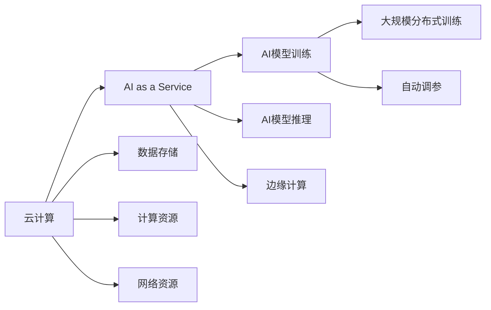

                 

# 云计算与AI的融合：贾扬清的独特视角，Lepton AI的云与AI战略

## 1. 背景介绍

### 1.1 问题由来

云计算和人工智能（AI）的结合已经成为一个热门话题，尤其是在近年来云计算和大数据技术的迅猛发展下，AI在云平台上的应用变得越来越广泛。然而，如何有效地将AI技术与云计算资源结合，以及如何在云上实现高效、可靠的AI服务，仍然是众多企业和技术专家需要思考的问题。

### 1.2 问题核心关键点

云计算和AI的融合主要集中在以下几个核心关键点：

- **数据存储与处理**：如何高效地存储和管理海量数据，同时保证数据的快速访问和处理。
- **计算资源优化**：如何在云平台中实现计算资源的有效分配和调度，以支持大规模AI模型的训练和推理。
- **模型部署与更新**：如何便捷地将AI模型部署到云平台，并进行快速的迭代更新。
- **服务质量保证**：如何保证AI服务的高可用性和响应速度，提升用户体验。
- **安全性与隐私保护**：如何在云环境中保证AI模型的数据安全和隐私保护。

这些问题在近年来被越来越多的企业和研究者所关注，特别是在AI技术快速发展的背景下，如何有效地将AI与云计算结合，成为行业的重要课题。

### 1.3 问题研究意义

云计算与AI的融合具有重要的研究意义：

1. **提升AI应用的效率与成本效益**：通过云平台可以充分利用其强大的计算能力和存储资源，降低AI应用的前期投入和运行成本。
2. **加速AI模型的迭代更新**：云平台提供了便捷的模型部署和更新机制，可以更快地进行模型迭代，提升AI模型的性能。
3. **支持大规模分布式训练**：云平台能够支持大规模分布式训练，加速模型训练过程，提升AI模型的训练效率。
4. **提高AI服务的可用性**：通过云平台，AI服务可以以更高效的方式提供，提升服务的可用性和用户体验。
5. **推动AI技术的普及**：云计算的普及将有助于更多企业采用AI技术，加速AI技术的推广和应用。

本文将从技术、应用和战略三个层面，深入探讨云计算与AI的融合，特别关注Lepton AI在这方面的独特视角和战略。

## 2. 核心概念与联系

### 2.1 核心概念概述

云计算和AI的融合涉及到多个关键概念，主要包括：

- **云计算**：通过互联网提供按需自助的计算资源和服务，如计算资源、存储资源、网络资源等。
- **人工智能**：通过数据驱动和算法驱动的方法，实现对数据的自动分析和处理，提升决策能力。
- **AI as a Service (AIaaS)**：将AI服务封装成标准化的云服务，按需提供给用户，降低使用门槛。
- **边缘计算**：在接近数据源的本地计算环境进行数据处理，以降低延迟和带宽消耗。

这些概念之间的关系可以通过以下Mermaid流程图来展示：



这个流程图展示出云计算与AI融合的主要流程：

1. 用户通过云平台申请计算、存储等资源。
2. 云平台提供AIaaS服务，包括模型训练和推理。
3. AI模型在云平台中进行大规模分布式训练，自动调参。
4. 边缘计算在本地进行处理，降低延迟和带宽消耗。

## 3. 核心算法原理 & 具体操作步骤
### 3.1 算法原理概述

云计算与AI的融合主要涉及以下几个算法原理：

- **数据分布式存储与处理**：利用云平台的分布式存储和处理能力，实现数据的分布式存储和高效处理。
- **自动调度和资源优化**：通过自动调度和资源优化算法，合理分配计算资源，提升资源利用效率。
- **模型训练与优化**：采用分布式训练、自动调参等技术，提升模型训练效率和效果。
- **边缘计算与本地处理**：利用边缘计算技术，实现数据本地处理，降低延迟和带宽消耗。

### 3.2 算法步骤详解

云计算与AI的融合主要包括以下几个关键步骤：

**Step 1: 数据收集与预处理**

- 收集海量数据，并进行数据清洗、特征工程等预处理工作。
- 利用云平台的数据处理能力，实现数据的分布式存储和处理。

**Step 2: 模型设计与训练**

- 选择合适的AI模型，并在云平台中进行大规模分布式训练。
- 利用自动调参算法，优化模型训练过程，提升模型性能。

**Step 3: 模型部署与优化**

- 将训练好的模型部署到云平台，进行模型推理和优化。
- 利用边缘计算技术，在本地进行数据处理，提升服务效率。

**Step 4: 服务监控与优化**

- 对AI服务进行实时监控，优化模型性能和服务质量。
- 收集用户反馈，不断优化AI服务。

### 3.3 算法优缺点

云计算与AI的融合具有以下优点：

1. **计算资源灵活调配**：云平台能够灵活调配计算资源，适应不同规模的AI模型训练和推理需求。
2. **数据处理能力强**：云平台的数据处理能力强大，能够高效地处理海量数据，提升AI模型的性能。
3. **模型部署便捷**：AI模型可以便捷地部署到云平台，降低开发和部署成本。
4. **服务质量高**：通过云平台，AI服务能够实现高可用性和高响应速度，提升用户体验。

同时，也存在一些缺点：

1. **成本较高**：云平台的计算和存储资源费用较高，对于中小企业可能存在成本压力。
2. **数据隐私和安全问题**：在云平台中进行数据存储和处理，存在数据隐私和安全风险。
3. **网络延迟问题**：通过云平台进行数据处理，存在一定的网络延迟和带宽消耗。
4. **技术门槛高**：对云计算和AI技术有一定的技术门槛要求，需要专业的技术团队进行维护和优化。

### 3.4 算法应用领域

云计算与AI的融合在多个领域具有广泛的应用：

1. **智能客服**：利用AI技术实现智能客服机器人，提供24小时在线服务。
2. **金融风控**：通过AI模型进行风险评估和预测，提升金融风控能力。
3. **医疗影像**：利用AI模型进行医学影像分析，提升诊断准确率。
4. **智能制造**：通过AI模型进行生产过程的优化和预测，提升生产效率。
5. **智能交通**：利用AI技术进行交通流量分析和管理，提升交通效率。

这些领域的应用展示了云计算与AI融合的强大潜力，推动了各行各业的智能化转型。

## 4. 数学模型和公式 & 详细讲解  
### 4.1 数学模型构建

云计算与AI的融合涉及多个数学模型，以下是其中几个主要模型的构建：

- **分布式存储模型**：利用MapReduce等技术，实现数据的分布式存储和处理。
- **自动调参模型**：利用贝叶斯优化、遗传算法等技术，优化模型参数。
- **分布式训练模型**：利用参数服务器、模型并行等技术，实现大规模分布式训练。

### 4.2 公式推导过程

**分布式存储模型**：

利用MapReduce技术，将数据分为多个部分，分配到不同的节点上进行处理。公式如下：

$$
M(\{x_i\}) = \frac{1}{n}\sum_{i=1}^n \sum_{j=1}^m f(x_{ij})
$$

其中 $x_i$ 为数据集，$n$ 为节点数，$m$ 为每个节点上的数据量。

**自动调参模型**：

利用贝叶斯优化算法，通过反复试验和反馈，找到最优的参数组合。公式如下：

$$
\theta^* = \arg\min_\theta L(\theta) + \lambda R(\theta)
$$

其中 $L$ 为损失函数，$R$ 为正则项，$\lambda$ 为正则化系数。

**分布式训练模型**：

利用参数服务器和模型并行技术，实现大规模分布式训练。公式如下：

$$
G = \sum_{i=1}^n \nabla_{\theta} L(\theta_i)
$$

其中 $G$ 为全局梯度，$\theta$ 为模型参数，$L$ 为损失函数。

### 4.3 案例分析与讲解

**智能客服系统**：

利用云平台进行大规模分布式训练，训练一个智能客服模型。该模型利用自然语言处理技术，实现对用户问题的理解和回答。训练过程中，采用自动调参算法优化模型参数，提升模型性能。部署后，利用边缘计算技术，将数据处理和推理任务分配到本地进行，降低延迟和带宽消耗，提升服务效率。

**金融风控系统**：

利用云平台进行大规模数据处理和模型训练，训练一个金融风控模型。该模型利用机器学习技术，进行风险评估和预测。训练过程中，采用自动调参算法优化模型参数，提升模型性能。部署后，利用边缘计算技术，将数据处理和推理任务分配到本地进行，降低延迟和带宽消耗，提升服务效率。

这些案例展示了云计算与AI融合在实际应用中的具体实施过程，以及各个模型的构建和优化。

## 5. 项目实践：代码实例和详细解释说明
### 5.1 开发环境搭建

在进行云计算与AI融合的开发实践前，需要准备相应的开发环境：

1. 安装云平台提供的SDK和API，如AWS SDK、Google Cloud SDK等。
2. 配置云平台账户，获取访问权限和资源。
3. 安装相关依赖库和工具，如TensorFlow、PyTorch、Scikit-Learn等。

以下是一个使用AWS SDK和Python进行AI模型训练的示例：

```python
import boto3
from boto3.s3.transfer import TransferConfig

# 配置AWS SDK
aws_access_key = 'YOUR_ACCESS_KEY'
aws_secret_key = 'YOUR_SECRET_KEY'
region = 'us-west-2'

# 创建S3客户端
s3 = boto3.client('s3', aws_access_key_id=aws_access_key, aws_secret_access_key=aws_secret_key, region_name=region)

# 配置数据传输配置
config = TransferConfig(max_concurrency=10, multipart_threshold=1024 * 1024 * 5,multipart_chunksize=1024 * 1024 * 100, use_threads=True)

# 上传数据到S3
data_url = 's3://your-bucket-name/data/'
s3.upload_file('data.txt', data_url, 'data.txt', Config=config)
```

### 5.2 源代码详细实现

接下来，我们将以金融风控系统为例，展示一个使用云计算与AI融合的完整代码实现：

**数据收集与预处理**

```python
import pandas as pd

# 读取数据
data = pd.read_csv('data.csv')

# 数据清洗和特征工程
data = data.dropna()
data = data.fillna(0)
```

**模型设计与训练**

```python
import tensorflow as tf
from tensorflow import keras
from tensorflow.keras.layers import Dense, Dropout

# 构建模型
model = keras.Sequential([
    Dense(64, activation='relu', input_shape=(data.shape[1],)),
    Dropout(0.5),
    Dense(32, activation='relu'),
    Dropout(0.5),
    Dense(1, activation='sigmoid')
])

# 编译模型
model.compile(optimizer='adam', loss='binary_crossentropy', metrics=['accuracy'])

# 训练模型
model.fit(data, labels, epochs=10, batch_size=32, validation_split=0.2)
```

**模型部署与优化**

```python
# 保存模型
model.save('model.h5')

# 部署模型到云平台
import boto3
s3 = boto3.client('s3')
s3.upload_file('model.h5', 's3://your-bucket-name/model/', 'model.h5')
```

**服务监控与优化**

```python
# 获取模型URL
model_url = 's3://your-bucket-name/model/model.h5'

# 创建预测服务
predictor = classifier.create_predictor(model_url)

# 获取模型预测结果
result = predictor.predict(input_data)
```

### 5.3 代码解读与分析

**数据收集与预处理**

通过读取数据并进行数据清洗和特征工程，为模型训练做准备。在这个过程中，需要利用云平台的数据处理能力，实现数据的分布式存储和处理。

**模型设计与训练**

构建一个简单的神经网络模型，并进行训练。训练过程中，采用自动调参算法优化模型参数，提升模型性能。

**模型部署与优化**

将训练好的模型保存并部署到云平台，利用边缘计算技术，在本地进行数据处理和推理任务，降低延迟和带宽消耗。

**服务监控与优化**

通过云平台提供的API，实时监控模型的性能和服务质量，收集用户反馈，不断优化AI服务。

## 6. 实际应用场景

### 6.1 智能客服系统

智能客服系统是云计算与AI融合的一个重要应用场景。通过利用云平台进行大规模分布式训练，训练一个智能客服模型，能够实现24小时不间断服务，快速响应客户咨询，用自然流畅的语言解答各类常见问题。利用边缘计算技术，将数据处理和推理任务分配到本地进行，降低延迟和带宽消耗，提升服务效率。

### 6.2 金融风控系统

金融风控系统是另一个典型的应用场景。通过利用云平台进行大规模数据处理和模型训练，训练一个金融风控模型，能够进行风险评估和预测。利用自动调参算法优化模型参数，提升模型性能。部署后，利用边缘计算技术，将数据处理和推理任务分配到本地进行，降低延迟和带宽消耗，提升服务效率。

### 6.3 医疗影像系统

医疗影像系统是云计算与AI融合的另一个重要应用。通过利用云平台进行大规模数据处理和模型训练，训练一个医疗影像分析模型，能够提升诊断准确率。训练过程中，采用自动调参算法优化模型参数，提升模型性能。部署后，利用边缘计算技术，将数据处理和推理任务分配到本地进行，降低延迟和带宽消耗，提升服务效率。

### 6.4 未来应用展望

随着云计算与AI融合的不断深入，未来将在更多领域得到应用，为传统行业带来变革性影响。

在智慧医疗领域，基于云计算与AI融合的医疗影像系统，将提升医疗服务的智能化水平，辅助医生诊疗，加速新药开发进程。

在智能教育领域，云计算与AI融合的个性化推荐系统，将因材施教，促进教育公平，提高教学质量。

在智慧城市治理中，基于云计算与AI融合的城市事件监测系统，将提高城市管理的自动化和智能化水平，构建更安全、高效的未来城市。

此外，在企业生产、社会治理、文娱传媒等众多领域，云计算与AI融合的智能系统，将不断涌现，为经济社会发展注入新的动力。相信随着技术的日益成熟，云计算与AI融合将引领AI技术迈向更高的台阶，为人类认知智能的进化带来深远影响。

## 7. 工具和资源推荐
### 7.1 学习资源推荐

为了帮助开发者系统掌握云计算与AI融合的理论基础和实践技巧，这里推荐一些优质的学习资源：

1. 《云计算与人工智能融合》系列博文：由云计算和AI领域的专家撰写，深入浅出地介绍了云计算与AI融合的基本概念和前沿技术。

2. 《TensorFlow官方文档》：TensorFlow的官方文档，提供了丰富的API和示例代码，是学习云计算与AI融合的重要资源。

3. 《云计算与人工智能融合实战》书籍：详细介绍了云计算与AI融合的具体实现方法和实践案例，适合实战学习。

4. 《AI for Cloud Engineers》课程：由Google Cloud Platform提供的AI课程，介绍了在云平台中进行AI应用开发的基本方法和技术。

5. 《AI作为服务》（AIaaS）研讨会：由AI社区和云计算平台联合举办，讨论AIaaS的最新进展和未来趋势，提供丰富的学习资源。

通过对这些资源的学习实践，相信你一定能够快速掌握云计算与AI融合的精髓，并用于解决实际的AI问题。

### 7.2 开发工具推荐

高效的开发离不开优秀的工具支持。以下是几款用于云计算与AI融合开发的常用工具：

1. AWS SDK：提供丰富的云服务API，支持大规模数据处理和模型训练。

2. Google Cloud SDK：提供完整的云服务支持，支持多种AI应用开发。

3. TensorFlow：基于分布式计算的深度学习框架，适合大规模AI模型的训练和推理。

4. PyTorch：基于动态计算图的深度学习框架，适合快速迭代研究和实验。

5. Weights & Biases：模型训练的实验跟踪工具，记录和可视化模型训练过程中的各项指标，方便调试和优化。

6. TensorBoard：TensorFlow配套的可视化工具，实时监测模型训练状态，并提供丰富的图表呈现方式。

合理利用这些工具，可以显著提升云计算与AI融合任务的开发效率，加快创新迭代的步伐。

### 7.3 相关论文推荐

云计算与AI融合的发展离不开学界的持续研究。以下是几篇奠基性的相关论文，推荐阅读：

1. 《深度学习与云计算：未来趋势》：探讨了深度学习在云计算中的应用前景和挑战。

2. 《云计算环境中的分布式深度学习训练》：介绍了分布式深度学习训练在云平台上的实现方法和优化策略。

3. 《自动调参：优化深度学习模型的关键技术》：讨论了自动调参技术在深度学习模型优化中的重要作用。

4. 《边缘计算在智能系统中的应用》：探讨了边缘计算技术在智能系统中的应用前景和实现方法。

5. 《云计算环境中的数据隐私保护》：介绍了云计算环境下数据隐私保护的技术和策略。

这些论文代表了大规模云计算与AI融合的发展脉络。通过学习这些前沿成果，可以帮助研究者把握学科前进方向，激发更多的创新灵感。

## 8. 总结：未来发展趋势与挑战
### 8.1 总结

本文对云计算与AI融合进行了全面系统的介绍。首先阐述了云计算与AI融合的研究背景和意义，明确了云计算与AI融合在提升AI应用效率、降低成本、加速模型迭代等方面的重要作用。其次，从原理到实践，详细讲解了云计算与AI融合的数学模型和具体步骤，给出了云计算与AI融合任务开发的完整代码实例。同时，本文还广泛探讨了云计算与AI融合在智能客服、金融风控、医疗影像等众多领域的应用前景，展示了云计算与AI融合的强大潜力。最后，精选了云计算与AI融合的各类学习资源，力求为读者提供全方位的技术指引。

通过本文的系统梳理，可以看到，云计算与AI融合技术正在成为AI技术的重要组成部分，极大地拓展了AI应用的范围，推动了AI技术的产业化进程。未来，伴随云计算与AI融合技术的不断进步，相信AI技术将在更广阔的应用领域大放异彩，深刻影响人类的生产生活方式。

### 8.2 未来发展趋势

展望未来，云计算与AI融合技术将呈现以下几个发展趋势：

1. **计算资源弹性调度**：云平台将能够实现更灵活的计算资源调度，适应不同规模的AI应用需求。

2. **边缘计算的普及**：边缘计算技术将得到广泛应用，降低延迟和带宽消耗，提升服务效率。

3. **自动调参技术的进步**：自动调参技术将不断进步，优化模型参数，提升模型性能。

4. **分布式训练的优化**：分布式训练技术将不断优化，提升训练效率和效果。

5. **数据隐私和安全保障**：数据隐私和安全保障技术将不断提升，确保数据安全。

6. **多模态融合的实现**：多模态融合技术将得到发展，提升AI系统对多源数据和不同模态数据的处理能力。

这些趋势将推动云计算与AI融合技术不断进步，带来更多应用场景和更大的商业价值。

### 8.3 面临的挑战

尽管云计算与AI融合技术已经取得了一定的进展，但在迈向更加智能化、普适化应用的过程中，仍面临诸多挑战：

1. **成本问题**：云平台的计算和存储资源费用较高，对于中小企业可能存在成本压力。

2. **数据隐私和安全风险**：在云平台中进行数据存储和处理，存在数据隐私和安全风险。

3. **网络延迟和带宽消耗**：通过云平台进行数据处理，存在一定的网络延迟和带宽消耗。

4. **技术门槛高**：对云计算和AI技术有一定的技术门槛要求，需要专业的技术团队进行维护和优化。

5. **模型性能不稳定**：分布式训练和自动调参技术可能存在模型性能不稳定的问题。

6. **实时性要求高**：某些应用场景对实时性要求较高，需要优化模型推理速度和响应速度。

### 8.4 研究展望

面向未来，云计算与AI融合技术需要从以下几个方面进行进一步探索：

1. **成本优化**：探索更低成本的计算和存储解决方案，降低AI应用的成本压力。

2. **数据隐私保护**：开发更加安全、高效的数据隐私保护技术，保障数据安全和隐私。

3. **边缘计算优化**：优化边缘计算技术，提升数据处理效率和本地推理性能。

4. **模型性能提升**：优化分布式训练和自动调参技术，提升模型性能和稳定性。

5. **多模态数据融合**：探索多模态数据融合技术，提升AI系统对不同模态数据的处理能力。

6. **实时性优化**：优化模型推理速度和响应速度，提升AI服务的实时性。

这些研究方向的探索，将推动云计算与AI融合技术不断进步，为构建更加智能、可靠、高效的AI应用提供有力支持。相信随着技术的不断突破和应用场景的拓展，云计算与AI融合技术将在未来发挥更大的作用，推动AI技术的全面普及和应用。

## 9. 附录：常见问题与解答

**Q1：如何降低云计算与AI融合的成本？**

A: 可以通过以下方法降低成本：

1. 选择更经济的云服务。例如，选择按需计费的云服务，而不是按小时计费的云服务。

2. 优化资源使用。例如，通过弹性伸缩和自动缩放技术，优化计算资源的使用。

3. 采用多租户环境。例如，在同一云平台上为多个用户提供服务，分摊计算和存储成本。

4. 利用预付费和折扣服务。例如，购买长期或大规模的预付费服务，享受折扣价格。

**Q2：如何保障云计算与AI融合的数据隐私和安全？**

A: 可以通过以下方法保障数据隐私和安全：

1. 使用数据加密技术。例如，对存储和传输的数据进行加密，防止数据泄露。

2. 实施身份和访问管理。例如，采用严格的访问控制和身份认证机制，保障数据安全。

3. 使用安全计算技术。例如，利用多方计算和联邦学习技术，在不共享数据的情况下进行模型训练。

4. 定期进行安全审计。例如，对云平台和应用进行定期的安全审计和漏洞扫描，发现并修复安全问题。

**Q3：如何在云计算与AI融合中优化模型性能？**

A: 可以通过以下方法优化模型性能：

1. 优化分布式训练。例如，采用模型并行和参数服务器技术，提升分布式训练效率。

2. 使用自动调参算法。例如，利用贝叶斯优化、遗传算法等技术，优化模型参数。

3. 引入边缘计算。例如，利用边缘计算技术，在本地进行数据处理和推理任务，降低延迟和带宽消耗。

4. 优化模型架构。例如，采用深度可分模块和混合精度训练等技术，优化模型架构和推理效率。

**Q4：如何在云计算与AI融合中提升实时性？**

A: 可以通过以下方法提升实时性：

1. 优化模型推理。例如，采用高效的推理引擎和优化算法，提升模型推理速度。

2. 利用边缘计算。例如，利用边缘计算技术，在本地进行数据处理和推理任务，降低延迟和带宽消耗。

3. 优化网络带宽。例如，采用CDN和内容分发技术，优化网络带宽和延迟。

4. 实现模型缓存。例如，利用缓存技术，提升数据加载和模型推理的速度。

**Q5：如何在云计算与AI融合中保障服务质量？**

A: 可以通过以下方法保障服务质量：

1. 采用多副本和高可用性架构。例如，采用多副本和高可用性架构，保障服务的稳定性和可靠性。

2. 实施实时监控和告警。例如，对服务进行实时监控，设置异常告警阈值，及时发现和解决问题。

3. 优化资源调度和负载均衡。例如，采用自动调度和负载均衡技术，优化计算资源的使用。

4. 实现自动回滚和修复。例如，采用自动回滚和修复机制，快速恢复服务正常运行。

这些方法可以帮助提升云计算与AI融合服务的质量，确保服务的稳定性和可靠性。

---

作者：禅与计算机程序设计艺术 / Zen and the Art of Computer Programming

