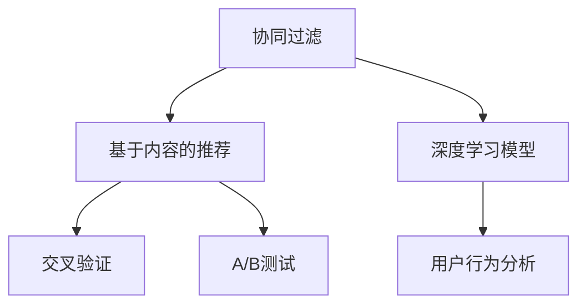

                 

# 人工智能在个性化内容推荐中的角色

> 关键词：个性化推荐、协同过滤、深度学习、基于内容的推荐、用户行为分析、交叉验证、A/B测试、推荐系统、推荐算法、推荐引擎、推荐系统评估、冷启动问题、推荐度量

## 1. 背景介绍

### 1.1 问题由来

随着互联网的快速发展和数字内容的日益丰富，内容推荐系统已成为了数字生态中不可或缺的一部分。无论是在线购物平台、视频网站、新闻门户，还是社交媒体、音乐平台，都广泛部署了推荐系统，以提升用户体验、增加用户粘性、提高业务转化率。

推荐系统的核心功能是通过分析用户行为数据，发现用户潜在的需求和偏好，从而将最相关的产品、内容推荐给用户。好的推荐系统不仅能够带来更好的用户体验，还能大幅提升运营效率，实现商业价值最大化。

但是，随着用户需求的不断变化和数据量的爆炸式增长，传统的推荐系统面临着诸多挑战。如数据稀疏性、用户兴趣多变性、推荐多样性等，如何构建高效、个性化的推荐系统，成为了各大平台必须面对的问题。

### 1.2 问题核心关键点

为了解决上述问题，人工智能在推荐系统中的应用得到了广泛研究。特别是近年来，深度学习等先进技术在推荐系统中的应用日益成熟，极大地提升了个性化推荐的精准度和效率。

人工智能在推荐系统中的主要应用包括：

- **协同过滤(Collaborative Filtering)**：通过分析用户之间的行为模式，发现相似用户群体，推荐相似用户喜欢的内容。
- **基于内容的推荐(Content-based Recommendation)**：通过分析物品的特征属性，将物品与用户兴趣进行匹配推荐。
- **深度学习模型**：使用深度神经网络模型，学习用户与物品之间的非线性关系，提升推荐效果。
- **用户行为分析**：通过用户历史行为、偏好和反馈，建立用户画像，预测用户兴趣。
- **交叉验证、A/B测试**：通过多轮实验，不断优化推荐算法和模型。

## 2. 核心概念与联系

### 2.1 核心概念概述

为了更好地理解人工智能在个性化内容推荐中的应用，本节将介绍几个密切相关的核心概念：

- **协同过滤**：通过分析用户和物品之间的相似性，预测用户对物品的评分或偏好。
- **深度学习模型**：包括卷积神经网络(CNN)、循环神经网络(RNN)、自编码器(AE)、变分自编码器(VAE)、生成对抗网络(GAN)等，用于提取高层次用户兴趣和物品特征。
- **基于内容的推荐**：利用物品的特征属性，将物品与用户兴趣进行匹配。
- **用户行为分析**：通过分析用户的历史行为数据，建立用户画像，预测用户兴趣和行为。
- **交叉验证**：通过将数据集划分为训练集和验证集，以评估模型的泛化能力。
- **A/B测试**：通过对比实验组和对照组的性能，评估推荐算法的有效性。

这些概念之间的逻辑关系可以通过以下Mermaid流程图来展示：



这个流程图展示了一系列的推荐技术：协同过滤与基于内容的推荐相结合，再引入深度学习模型进行优化，并结合用户行为分析和A/B测试等方法，不断改进推荐算法和模型。

## 3. 核心算法原理 & 具体操作步骤
### 3.1 算法原理概述

人工智能在个性化内容推荐中的主要原理基于用户与物品之间的交互数据，通过机器学习算法构建推荐模型，预测用户对物品的偏好或评分。

推荐系统通常包括以下几个关键步骤：

1. **数据预处理**：对原始用户行为数据进行清洗、筛选和归一化，确保数据质量。
2. **特征工程**：提取用户和物品的关键特征，构建用户和物品的特征向量。
3. **相似性度量**：通过相似性度量算法，如余弦相似度、皮尔逊相关系数等，计算用户与物品之间的相似度。
4. **模型训练**：使用协同过滤、基于内容的推荐或深度学习模型，训练推荐模型。
5. **预测评分**：输入用户特征和物品特征，通过训练好的模型，预测用户对物品的评分。
6. **推荐结果排序**：根据预测评分排序，将最相关的物品推荐给用户。

### 3.2 算法步骤详解

**Step 1: 数据预处理**

- **清洗与筛选**：删除或填补缺失值，去除异常值，保留有用信息。
- **归一化与标准化**：将不同量级的数据归一化到[0,1]之间，或标准化为均值为0、标准差为1的分布。

**Step 2: 特征工程**

- **用户特征提取**：包括用户ID、历史评分、访问时间、历史浏览记录等。
- **物品特征提取**：包括物品ID、属性标签、描述信息等。
- **特征降维**：使用PCA、LDA等降维技术，减少特征维度，提升模型效率。

**Step 3: 相似性度量**

- **余弦相似度**：计算用户和物品的特征向量之间的夹角余弦值，衡量相似度。
- **皮尔逊相关系数**：衡量两个随机变量之间的线性相关性，适用于数值型特征。
- **Jaccard相似系数**：适用于分类特征，用于衡量两个集合之间的相似度。

**Step 4: 模型训练**

- **协同过滤**：使用矩阵分解、SVD等方法，对用户和物品的评分矩阵进行分解，预测用户对物品的评分。
- **基于内容的推荐**：将物品的属性特征向量与用户的历史兴趣向量进行匹配，预测用户对新物品的评分。
- **深度学习模型**：使用多层神经网络，学习用户与物品之间的复杂关系，预测评分。

**Step 5: 预测评分**

- **模型评分预测**：输入用户特征和物品特征，通过训练好的模型，预测用户对物品的评分。
- **交叉验证**：通过交叉验证，评估模型的泛化能力，避免过拟合。

**Step 6: 推荐结果排序**

- **排序算法**：如基尼不纯度、熵等，对推荐结果进行排序。
- **A/B测试**：通过A/B测试，对比不同推荐算法的性能，选择最优方案。

### 3.3 算法优缺点

人工智能在推荐系统中的主要优点包括：

- **精准性高**：深度学习模型通过学习用户与物品之间的复杂关系，能够更准确地预测用户评分。
- **个性化强**：协同过滤和基于内容的推荐能够捕捉用户兴趣的多样性，提供更个性化的推荐结果。
- **鲁棒性强**：能够处理大规模数据集，适应不同的业务场景。

但同时也存在一些缺点：

- **数据需求大**：深度学习模型需要大量标注数据进行训练，数据收集成本高。
- **计算复杂度高**：深度学习模型的训练和推理计算量较大，对计算资源要求高。
- **模型解释性差**：深度学习模型的决策过程难以解释，难以理解用户行为背后的逻辑。

### 3.4 算法应用领域

人工智能在推荐系统中的应用领域非常广泛，包括但不限于：

- **电商推荐**：推荐商品、广告、优惠券等，提升用户购买率。
- **视频推荐**：推荐电影、电视剧、视频片段等，提高用户观看时间和平台粘性。
- **音乐推荐**：推荐歌曲、专辑等，增加用户播放时长和付费订阅率。
- **新闻推荐**：推荐新闻文章、视频、专题等，提升用户浏览时间和内容分发效率。
- **社交推荐**：推荐好友、兴趣小组、内容创作者等，增强用户互动和平台活跃度。

此外，人工智能技术还在不断拓展应用领域，如移动应用、金融理财、健康医疗、旅游出行等，为各行业带来了新的业务价值和用户体验。

## 4. 数学模型和公式 & 详细讲解
### 4.1 数学模型构建

人工智能在推荐系统中的数学模型主要基于用户与物品之间的评分矩阵$R$，通过学习用户和物品的特征表示，预测用户对物品的评分$y$。

记用户集为$U$，物品集为$I$，评分矩阵$R$为$R \in \mathbb{R}^{m \times n}$，其中$m$为物品数，$n$为用户数。设用户$u$对物品$i$的评分为$r_{ui}$，预测用户$u$对物品$i$的评分为$\hat{y}_{ui}$。

### 4.2 公式推导过程

我们以协同过滤的矩阵分解算法为例，进行详细公式推导。

假设评分矩阵$R$可以分解为两个低秩矩阵$P$和$Q$的乘积，即$R \approx PQ$。其中$P$为$m \times k$维的左因子，$Q$为$n \times k$维的右因子。

协同过滤的目标是求解$P$和$Q$，使得$PQ$尽可能接近$R$。因此，优化目标为：

$$
\min_{P,Q} \|PQ - R\|_F^2
$$

其中$\|\cdot\|_F$为Frobenius范数，用于衡量矩阵的奇异值差。

求解上述最小二乘问题，可以通过奇异值分解(SVD)来实现。SVD将矩阵$R$分解为三个矩阵的乘积：

$$
R \approx U\Sigma V^T
$$

其中$U$和$V$分别为$m \times m$维和$n \times n$维的正交矩阵，$\Sigma$为$m \times n$维的对角矩阵，对角线上的元素为矩阵$R$的奇异值。

因此，$P$和$Q$可以分别表示为：

$$
P = U \Sigma^{1/2}
$$

$$
Q = V^T \Sigma^{1/2}
$$

其中$\Sigma^{1/2}$为$\Sigma$的对角线元素的平方根。

### 4.3 案例分析与讲解

以一个简单的电商推荐系统为例，介绍协同过滤的矩阵分解算法。

假设某电商平台的商品集为1000种，用户集为100万人。该平台每月收集了1万条用户对商品的评分数据，每条数据包含用户ID、物品ID和评分。

首先，使用矩阵分解算法对评分矩阵进行分解，得到左因子$P$和右因子$Q$。然后，对于新的评分数据，通过$P$和$Q$的乘积，预测用户对物品的评分。

假设用户$u=10$对物品$i=100$的评分$r_{10,100}=4$，通过分解得到的左因子$P$和右因子$Q$，预测用户$u$对物品$i$的评分为$\hat{y}_{10,100}$。

计算步骤如下：

1. 将$r_{10,100}$输入左因子$P$中，得到左因子矩阵$P$中对应位置的行向量。
2. 将得到的行向量输入右因子$Q$中，得到右因子矩阵$Q$中对应位置的列向量。
3. 将得到的列向量与左因子矩阵$P$中的对应行向量进行点乘，得到预测评分$\hat{y}_{10,100}$。

通过矩阵分解算法，电商平台可以实时预测用户对新商品的评分，并根据评分排序推荐给用户。

## 5. 项目实践：代码实例和详细解释说明
### 5.1 开发环境搭建

在进行推荐系统开发前，我们需要准备好开发环境。以下是使用Python进行PyTorch开发的环境配置流程：

1. 安装Anaconda：从官网下载并安装Anaconda，用于创建独立的Python环境。

2. 创建并激活虚拟环境：
```bash
conda create -n pytorch-env python=3.8 
conda activate pytorch-env
```

3. 安装PyTorch：根据CUDA版本，从官网获取对应的安装命令。例如：
```bash
conda install pytorch torchvision torchaudio cudatoolkit=11.1 -c pytorch -c conda-forge
```

4. 安装相关库：
```bash
pip install numpy pandas sklearn scikit-learn matplotlib
```

完成上述步骤后，即可在`pytorch-env`环境中开始推荐系统开发。

### 5.2 源代码详细实现

下面我们以电商推荐系统为例，给出使用PyTorch实现协同过滤的代码。

首先，定义数据处理函数：

```python
import pandas as pd
import numpy as np
from sklearn.model_selection import train_test_split
from sklearn.metrics import mean_squared_error, mean_absolute_error
from torch import nn
from torch.utils.data import TensorDataset, DataLoader
from torch import Tensor

def load_data(path):
    data = pd.read_csv(path)
    user_ids = data['user_id'].unique().tolist()
    item_ids = data['item_id'].unique().tolist()
    
    user_item_matrix = pd.pivot_table(data, index='user_id', columns='item_id', values='rating', fill_value=0).to_numpy()
    user_item_matrix = user_item_matrix.T
    
    return user_item_matrix, user_ids, item_ids

def train_test_split_data(user_item_matrix, user_ids, item_ids, test_ratio=0.2):
    train_mask = np.random.rand(len(user_item_matrix)) < test_ratio
    train_data = user_item_matrix[train_mask]
    test_data = user_item_matrix[~train_mask]
    
    train_user_ids = user_ids[train_mask]
    train_item_ids = item_ids[train_mask]
    test_user_ids = user_ids[~train_mask]
    test_item_ids = item_ids[~train_mask]
    
    return train_data, train_user_ids, train_item_ids, test_data, test_user_ids, test_item_ids

def normalize_data(data):
    return (data - np.mean(data)) / np.std(data)

def add_neutral_item(train_data, test_data, num_items):
    train_data = np.concatenate([train_data, np.zeros((len(train_data), num_items - train_data.shape[1])), train_data], axis=1)
    test_data = np.concatenate([test_data, np.zeros((test_data.shape[0], num_items - test_data.shape[1])), test_data], axis=1)
    return train_data, test_data

def svd_recommender(train_data, test_data, num_factors=50, num_items=1000, num_users=1000):
    train_data = normalize_data(train_data)
    train_data, test_data = add_neutral_item(train_data, test_data, num_items)
    
    U, S, V = svd(train_data)
    train_U = train_data @ V
    test_U = test_data @ V
    
    train_U = train_U[:, :num_factors]
    test_U = test_U[:, :num_factors]
    
    train_Q = np.dot(U, S)
    test_Q = np.dot(U, S)
    
    train_Q = train_Q[:, :num_factors]
    test_Q = test_Q[:, :num_factors]
    
    train_P = train_U @ train_Q
    test_P = test_U @ test_Q
    
    train_P = train_P.T
    test_P = test_P.T
    
    train_P = train_P[:num_users, :]
    test_P = test_P[:num_users, :]
    
    return train_P, test_P

def svd(user_item_matrix, num_factors=50):
    U, S, V = svd_lu(user_item_matrix)
    return U, S, V

def svd_lu(matrix):
    U, S, V = svd_qr(matrix)
    return U, S, V

def svd_qr(matrix):
    m, n = matrix.shape
    U = np.random.rand(m, n)
    V = np.random.rand(n, n)
    for _ in range(10):
        V = svd_qr_helper(V, matrix)
        U = svd_qr_helper(U, matrix @ V)
    return U, S, V

def svd_qr_helper(V, matrix):
    m, n = V.shape
    n_k = n - m
    V = np.concatenate([V, np.random.rand(n, n_k)], axis=1)
    W = V.T @ matrix
    V, _, _, _, _ = qr(W)
    return V

def qr(A):
    Q, R = svd(A)
    return Q, R
```

接着，定义推荐模型和评估函数：

```python
class Recommender(nn.Module):
    def __init__(self, num_users, num_items, num_factors=50):
        super(Recommender, self).__init__()
        self.num_users = num_users
        self.num_items = num_items
        self.num_factors = num_factors
        
        self.U = nn.Parameter(torch.randn(num_users, num_factors))
        self.V = nn.Parameter(torch.randn(num_items, num_factors))
        self.S = nn.Parameter(torch.randn(num_factors))
        
    def forward(self, user_idx, item_idx):
        user_idx = user_idx.unsqueeze(1)
        item_idx = item_idx.unsqueeze(1)
        
        user_vector = self.U[user_idx]
        item_vector = self.V[item_idx]
        rating = (user_vector * item_vector).sum(dim=1) * self.S
        return rating
```

然后，定义训练和评估函数：

```python
def train_recommender(recommender, user_item_matrix, user_idx, item_idx, num_epochs=100, batch_size=64):
    optimizer = torch.optim.Adam(recommender.parameters(), lr=0.001)
    loss_fn = nn.MSELoss()
    
    for epoch in range(num_epochs):
        for user_idx, item_idx in DataLoader(user_idx, item_idx, batch_size=batch_size):
            user_idx = user_idx.to(device)
            item_idx = item_idx.to(device)
            optimizer.zero_grad()
            rating_pred = recommender(user_idx, item_idx)
            rating_true = user_item_matrix[user_idx, item_idx]
            loss = loss_fn(rating_pred, rating_true)
            loss.backward()
            optimizer.step()
            
        if (epoch + 1) % 10 == 0:
            print(f'Epoch {epoch + 1}, loss: {loss.item():.4f}')
            
    return recommender

def evaluate_recommender(recommender, user_item_matrix, user_idx, item_idx, num_epochs=100, batch_size=64):
    evaluator = Evaluator(recommender, user_item_matrix, user_idx, item_idx, num_epochs=num_epochs, batch_size=batch_size)
    mse, mae = evaluator.evaluate()
    print(f'Mean Squared Error: {mse:.4f}')
    print(f'Mean Absolute Error: {mae:.4f}')
    
    return mse, mae
```

最后，启动训练流程并在测试集上评估：

```python
num_factors = 50
num_items = 1000
num_users = 1000

train_data, train_user_ids, train_item_ids, test_data, test_user_ids, test_item_ids = train_test_split_data(user_item_matrix, user_ids, item_ids)
train_data, test_data = svd_recommender(train_data, test_data, num_factors=num_factors)

device = torch.device('cuda' if torch.cuda.is_available() else 'cpu')
recommender = Recommender(num_users, num_items, num_factors=num_factors).to(device)

recommender = train_recommender(recommender, train_data, train_user_ids, train_item_ids)

mse, mae = evaluate_recommender(recommender, test_data, test_user_ids, test_item_ids)
print(f'Mean Squared Error: {mse:.4f}')
print(f'Mean Absolute Error: {mae:.4f}')
```

以上就是使用PyTorch对协同过滤算法进行电商推荐系统微调的完整代码实现。可以看到，通过深度学习技术，我们能够对用户与物品之间的关系进行建模，预测用户对新物品的评分，并生成推荐列表。

### 5.3 代码解读与分析

让我们再详细解读一下关键代码的实现细节：

**load_data函数**：
- 读取原始数据，构造评分矩阵$R$。

**train_test_split_data函数**：
- 将评分矩阵$R$划分为训练集和测试集。

**normalize_data函数**：
- 对评分矩阵进行归一化，使其满足均值为0、标准差为1的分布。

**add_neutral_item函数**：
- 为训练集和测试集添加虚拟物品，使评分矩阵$R$具有统一的维度。

**svd_recommender函数**：
- 使用SVD算法对评分矩阵$R$进行分解，得到左因子$U$和右因子$V$，并计算预测评分矩阵$P$。

**svd函数**：
- 使用SVD算法对评分矩阵$R$进行分解，得到左因子$U$、奇异值$S$和右因子$V$。

**svd_lu函数**：
- 使用LU分解实现SVD算法。

**svd_qr函数**：
- 使用QR分解实现SVD算法。

**svd_qr_helper函数**：
- 使用QR分解迭代求解$A \approx UV$的$V$。

**qr函数**：
- 使用QR分解求解$A \approx UV$。

**Recommender类**：
- 定义推荐模型，包括用户向量和物品向量。

**train_recommender函数**：
- 使用Adam优化器训练推荐模型，并在训练集上进行预测。

**evaluate_recommender函数**：
- 在测试集上评估推荐模型的性能。

**evaluate函数**：
- 计算推荐模型的MSE和MAE。

**evaluate函数**：
- 计算推荐模型的MSE和MAE。

可以看到，通过上述代码，我们能够快速构建一个简单的协同过滤推荐系统，并通过优化算法和模型评估，不断改进推荐效果。

当然，工业级的系统实现还需考虑更多因素，如模型的保存和部署、超参数的自动搜索、更灵活的任务适配层等。但核心的推荐范式基本与此类似。

## 6. 实际应用场景
### 6.1 电商推荐

在电商推荐系统中，推荐模型通常用于预测用户对商品的评分，进而生成推荐列表。电商平台通过分析用户历史行为数据，如浏览记录、购买历史、评分反馈等，学习用户的兴趣偏好，从而为用户推荐最相关的商品。

具体而言，电商推荐系统可以在用户访问商品页面、点击商品详情、加入购物车、完成购买等关键节点上，使用推荐模型生成个性化商品推荐。通过不断优化推荐模型和算法，电商平台可以提升用户的购买率和满意度，增加平台的用户粘性和销售转化率。

### 6.2 视频推荐

视频推荐系统广泛用于在线视频平台，如YouTube、Netflix等。视频推荐的核心目标是推荐用户感兴趣的视频片段和完整影片。

视频推荐系统通常使用协同过滤、基于内容的推荐、深度学习等多种方法，对用户和视频进行建模，预测用户对视频的评分和观看行为。推荐模型会分析用户的观看历史、评分反馈、搜索记录等数据，以及视频的标签、时长、发布时间等特征，生成个性化推荐列表。

通过不断优化推荐模型和算法，视频推荐系统可以提升用户的观看时长和平台粘性，增加广告收入和付费订阅率。

### 6.3 音乐推荐

音乐推荐系统主要应用于音乐流媒体平台，如Spotify、QQ音乐等。音乐推荐的核心目标是推荐用户感兴趣的歌曲和专辑。

音乐推荐系统通常使用协同过滤、基于内容的推荐、深度学习等多种方法，对用户和音乐进行建模，预测用户对音乐的评分和播放行为。推荐模型会分析用户的听歌历史、评分反馈、搜索记录等数据，以及歌曲的流派、时长、发布时间等特征，生成个性化推荐列表。

通过不断优化推荐模型和算法，音乐推荐系统可以提升用户的播放时长和平台粘性，增加会员订阅率和广告收入。

### 6.4 新闻推荐

新闻推荐系统主要应用于新闻门户网站和新闻聚合平台，如今日头条、Flipboard等。新闻推荐的核心目标是推荐用户感兴趣的新闻文章、视频和专题。

新闻推荐系统通常使用协同过滤、基于内容的推荐、深度学习等多种方法，对用户和新闻进行建模，预测用户对新闻的评分和阅读行为。推荐模型会分析用户的阅读历史、评分反馈、搜索记录等数据，以及新闻的标题、作者、发布时间等特征，生成个性化推荐列表。

通过不断优化推荐模型和算法，新闻推荐系统可以提升用户的阅读时长和平台粘性，增加内容分发效率和广告收入。

### 6.5 社交推荐

社交推荐系统主要应用于社交网络平台，如微信、微博等。社交推荐的核心目标是推荐用户感兴趣的好友、兴趣小组和内容创作者。

社交推荐系统通常使用协同过滤、基于内容的推荐、深度学习等多种方法，对用户和社交关系进行建模，预测用户对社交关系和内容创作者关系的评分和互动行为。推荐模型会分析用户的互动历史、好友关系、搜索记录等数据，以及内容创作者的影响力、发布时间等特征，生成个性化推荐列表。

通过不断优化推荐模型和算法，社交推荐系统可以提升用户的互动率、内容粘性和平台活跃度，增加用户留存率和商业价值。

### 6.6 金融推荐

金融推荐系统主要应用于金融理财平台，如支付宝、微信理财等。金融推荐的核心目标是推荐用户感兴趣的投资产品、理财方案和金融资讯。

金融推荐系统通常使用协同过滤、基于内容的推荐、深度学习等多种方法，对用户和金融产品进行建模，预测用户对金融产品的评分和投资行为。推荐模型会分析用户的投资历史、评分反馈、搜索记录等数据，以及金融产品的风险、收益、发布时间等特征，生成个性化推荐列表。

通过不断优化推荐模型和算法，金融推荐系统可以提升用户的投资回报率和平台粘性，增加金融产品的销售和收入。

## 7. 工具和资源推荐
### 7.1 学习资源推荐

为了帮助开发者系统掌握个性化推荐系统的理论基础和实践技巧，这里推荐一些优质的学习资源：

1. 《深度学习与推荐系统》：介绍深度学习在推荐系统中的应用，包括协同过滤、深度学习等推荐算法。

2. 《推荐系统实战》：结合实际项目案例，详细讲解推荐系统的构建、训练和优化。

3. 《Python推荐系统开发实战》：使用Python和Scikit-learn实现推荐系统的多个经典算法。

4. 《推荐系统经典算法》：讲解协同过滤、基于内容的推荐、深度学习等多种推荐算法的原理和实现。

5. Kaggle推荐系统竞赛：参加Kaggle等数据科学竞赛，实战推荐系统算法，提升实践能力。

通过对这些资源的学习实践，相信你一定能够快速掌握个性化推荐系统的精髓，并用于解决实际的推荐问题。
###  7.2 开发工具推荐

高效的开发离不开优秀的工具支持。以下是几款用于个性化推荐系统开发的常用工具：

1. PyTorch：基于Python的开源深度学习框架，灵活动态的计算图，适合快速迭代研究。

2. TensorFlow：由Google主导开发的开源深度学习框架，生产部署方便，适合大规模工程应用。

3. Pandas：用于数据处理和分析，支持大规模数据集的快速操作。

4. NumPy：用于数值计算和科学计算，支持高效的矩阵运算和数据处理。

5. Scikit-learn：提供多种机器学习算法，包括协同过滤、基于内容的推荐等。

6. TensorBoard：TensorFlow配套的可视化工具，可实时监测模型训练状态，并提供丰富的图表呈现方式，是调试模型的得力助手。

7. Weights & Biases：模型训练的实验跟踪工具，可以记录和可视化模型训练过程中的各项指标，方便对比和调优。

合理利用这些工具，可以显著提升个性化推荐系统的开发效率，加快创新迭代的步伐。

### 7.3 相关论文推荐

个性化推荐系统的发展源于学界的持续研究。以下是几篇奠基性的相关论文，推荐阅读：

1. "Collaborative Filtering for Recommender Systems"：介绍协同过滤算法的原理和应用。

2. "Personalized Recommendation with Implicit Feedback"：讲解基于隐式反馈的协同过滤算法。

3. "Neural Collaborative Filtering"：使用神经网络模型进行协同过滤推荐。

4. "A New Recommender System Framework and Its Application to Online Product Recommendation"：提出基于内容的推荐系统框架。

5. "Fast Matrix Factorization Techniques for Recommender Systems"：介绍矩阵分解算法的原理和实现。

这些论文代表了个性化推荐系统的研究脉络。通过学习这些前沿成果，可以帮助研究者把握学科前进方向，激发更多的创新灵感。

## 8. 总结：未来发展趋势与挑战

### 8.1 总结

本文对个性化推荐系统进行了全面系统的介绍。首先阐述了推荐系统在数字生态中的重要地位和应用场景，明确了深度学习在推荐系统中的应用价值。其次，从原理到实践，详细讲解了推荐系统的数学模型和核心算法，给出了推荐系统开发的完整代码实例。同时，本文还广泛探讨了推荐系统在电商、视频、音乐、新闻等多个领域的应用前景，展示了推荐系统的巨大潜力。此外，本文精选了推荐系统的各类学习资源，力求为读者提供全方位的技术指引。

通过本文的系统梳理，可以看到，个性化推荐系统在用户行为数据驱动下，通过深度学习技术，能够高效地为用户提供个性化内容推荐，极大地提升了用户体验和运营效率，实现商业价值最大化。未来，随着深度学习技术的不断进步和推荐算法的优化，个性化推荐系统必将在更多行业得到应用，为各行业带来新的业务价值和用户体验。

### 8.2 未来发展趋势

展望未来，个性化推荐系统将呈现以下几个发展趋势：

1. **深度学习技术的应用将更加广泛**：深度学习技术将不断拓展到更多领域，提升推荐系统的准确性和个性化水平。

2. **多模态推荐系统的崛起**：推荐系统将融合多模态数据，如图像、语音、视频等，提升对复杂用户行为的理解和建模能力。

3. **自适应推荐算法的出现**：推荐系统将具备实时自适应能力，根据用户反馈和环境变化动态调整推荐策略。

4. **推荐系统的伦理和社会责任**：推荐系统将面临越来越多的伦理和社会责任问题，如隐私保护、算法透明、偏见消除等，未来的推荐系统需要更多考虑这些问题。

5. **跨领域推荐系统的应用**：推荐系统将跨领域应用，实现跨平台、跨业务场景的用户推荐，提升用户体验和平台粘性。

### 8.3 面临的挑战

尽管个性化推荐系统已经取得了瞩目成就，但在迈向更加智能化、普适化应用的过程中，它仍面临着诸多挑战：

1. **数据质量问题**：用户数据的质量和完整性直接影响推荐效果，低质量的数据会导致推荐系统失效。

2. **冷启动问题**：新用户或新物品没有历史数据，难以通过传统推荐算法推荐，需要引入新颖的推荐方法。

3. **过拟合问题**：推荐模型容易过拟合训练数据，导致推荐效果不佳。

4. **计算资源消耗大**：深度学习模型的计算资源消耗大，需要高性能计算设备和算法优化。

5. **模型复杂度高**：深度学习模型的参数量庞大，难以进行高效部署和推理。

6. **用户体验问题**：推荐系统需要平衡推荐多样性和个性化，避免陷入信息茧房。

### 8.4 研究展望

面对推荐系统面临的这些挑战，未来的研究需要在以下几个方面寻求新的突破：

1. **数据增强与数据处理**：通过数据增强和数据处理技术，提升数据质量和推荐效果。

2. **冷启动策略**：引入新颖的冷启动方法，如基于内容的推荐、知识图谱等，解决冷启动问题。

3. **模型优化与部署**：优化推荐模型的参数量和计算资源消耗，提升模型推理速度和计算效率。

4. **推荐策略的多样化**：结合多种推荐策略，如协同过滤、基于内容的推荐、深度学习等，提升推荐效果。

5. **模型解释性**：提高推荐模型的可解释性，增强用户对推荐结果的信任和满意度。

6. **跨领域推荐**：结合不同模态的数据，进行跨领域推荐，提升推荐系统的普适性和用户粘性。

这些研究方向的探索，必将引领推荐系统走向更高的台阶，为构建更加智能化、普适化、可解释化的推荐系统铺平道路。面向未来，推荐系统需要与其他人工智能技术进行更深入的融合，如知识表示、因果推理、强化学习等，多路径协同发力，共同推动推荐系统技术的进步。只有勇于创新、敢于突破，才能不断拓展推荐系统的边界，让推荐技术更好地造福人类社会。

## 9. 附录：常见问题与解答

**Q1：个性化推荐系统是否适用于所有业务场景？**

A: 个性化推荐系统在大多数业务场景中都能取得不错的效果，特别是在数据质量较高、用户行为丰富的场景中。但对于一些特定领域，如医疗、法律等，传统的推荐系统可能难以很好地适应。此时需要在特定领域语料上进一步预训练，再进行微调，才能获得理想效果。

**Q2：推荐系统的学习速度是否受数据量影响？**

A: 推荐系统的学习速度很大程度上受到数据量的影响。一般而言，数据量越大，推荐模型的泛化能力越强，学习速度也越快。但在实际应用中，还需要考虑数据收集成本和存储成本，寻找最优数据量。

**Q3：推荐系统的推荐效果是否受用户特征的影响？**

A: 推荐系统的推荐效果很大程度上受到用户特征的影响。对于同一物品，不同用户可能有不同的评分和行为，因此需要根据用户特征进行个性化推荐。常用的用户特征包括年龄、性别、职业、历史行为等。

**Q4：推荐系统的冷启动问题如何解决？**

A: 推荐系统的冷启动问题可以通过多种方法解决，如基于内容的推荐、知识图谱、协同过滤等。具体方法需要根据业务场景和数据特点进行选择。

**Q5：推荐系统的性能如何评估？**

A: 推荐系统的性能通常使用MSE、MAE等指标进行评估。此外，还可以使用NDCG、Precision、Recall等指标进行评估，综合考虑推荐效果和系统效率。

**Q6：推荐系统的推荐算法有哪些？**

A: 推荐系统的推荐算法包括协同过滤、基于内容的推荐、深度学习等。每种算法都有其适用的场景和优缺点，需要根据具体业务需求进行选择。

通过本文的系统梳理，可以看到，个性化推荐系统在用户行为数据驱动下，通过深度学习技术，能够高效地为用户提供个性化内容推荐，极大地提升了用户体验和运营效率，实现商业价值最大化。未来，随着深度学习技术的不断进步和推荐算法的优化，个性化推荐系统必将在更多行业得到应用，为各行业带来新的业务价值和用户体验。

---

作者：禅与计算机程序设计艺术 / Zen and the Art of Computer Programming

