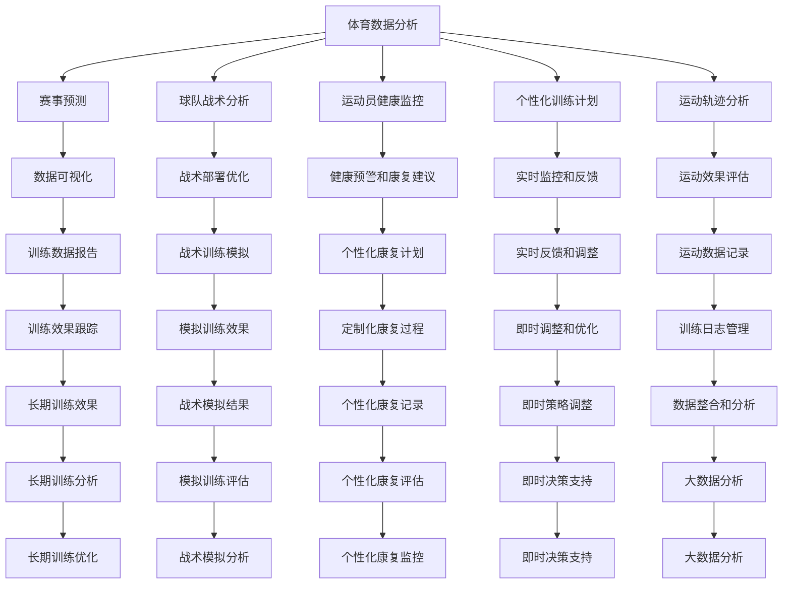

                 

# 人工智能在体育和娱乐中的应用

> 关键词：人工智能,体育,娱乐,体育数据分析,娱乐推荐系统,虚拟教练,自动化生成内容,人机交互

## 1. 背景介绍

### 1.1 问题由来

在当今数字化、信息化日益深入的时代背景下，体育和娱乐产业正在经历前所未有的变革。人工智能技术的广泛应用，正在重塑这两个传统领域的运营模式、服务质量和用户体验。

体育领域，从职业联赛的赛事组织、运动员训练监控，到日常运动爱好者的健身指导、比赛数据分析，人工智能技术的应用如火如荼。通过分析比赛数据、运动轨迹、生理指标等，AI不仅能够提供更加精准的赛事预测、球队战术分析，还能实时监控运动员的健康状况，提供科学的训练计划和康复建议。

娱乐领域，从影视剧的剧本生成、演员选拔，到个性化内容的推荐、用户行为分析，人工智能技术的应用同样无处不在。通过分析用户喜好、行为模式、社交网络等数据，AI能够提供更加个性化的观影、阅读、音乐、游戏等娱乐体验，极大提升用户的满意度和粘性。

### 1.2 问题核心关键点

人工智能在体育和娱乐领域的应用，主要基于以下几个关键点：

1. **数据驱动**：利用大数据分析技术，挖掘和分析海量数据，从中提取有价值的信息，驱动决策和优化。
2. **模型预测**：通过构建和训练预测模型，实时分析体育赛事、娱乐内容的动态变化，提高决策的准确性和时效性。
3. **自动化生成**：利用自然语言处理、计算机视觉等技术，自动生成体育分析报告、娱乐内容推荐等，提升效率和质量。
4. **人机交互**：结合增强现实(AR)、虚拟现实(VR)等技术，提升用户的沉浸式体验，实现更加自然的人机互动。
5. **智能决策**：在数据分析和预测的基础上，辅助决策者制定策略，优化资源配置，提高运营效率。

这些关键点共同构成了人工智能在体育和娱乐领域应用的核心理念，推动了技术应用从边缘走向中心，从辅助向主导转变。

## 2. 核心概念与联系

### 2.1 核心概念概述

为更好地理解人工智能在体育和娱乐领域的应用，本节将介绍几个核心概念：

- **体育数据分析**：通过收集、分析和可视化体育赛事、训练和运动员数据，提供精准的赛事预测、球队战术分析、运动员健康监控等。
- **娱乐推荐系统**：利用用户行为数据，构建推荐模型，提供个性化内容的推荐，提升用户满意度和粘性。
- **虚拟教练**：基于人工智能技术的虚拟教练，能够提供个性化训练计划、实时监控和反馈，辅助运动员提升技能和体能。
- **自动化生成内容**：利用自然语言处理、计算机视觉等技术，自动生成比赛分析报告、娱乐内容推荐、新闻稿等，提高效率和质量。
- **人机交互**：通过增强现实(AR)、虚拟现实(VR)等技术，提升用户沉浸式体验，实现更加自然的人机互动。

这些概念之间的逻辑关系可以通过以下Mermaid流程图来展示：



这个流程图展示了体育数据分析和娱乐推荐系统的核心流程和应用场景，以及各组件之间的联系和互动。

## 3. 核心算法原理 & 具体操作步骤
### 3.1 算法原理概述

人工智能在体育和娱乐领域的应用，主要基于数据驱动、模型预测、自动化生成、人机交互和智能决策等核心技术。这些技术的实现，离不开机器学习、深度学习、自然语言处理、计算机视觉等前沿算法的支撑。

以体育数据分析为例，常用的算法包括：

1. **机器学习算法**：如决策树、随机森林、支持向量机等，用于处理结构化数据，进行分类和回归分析。
2. **深度学习算法**：如卷积神经网络(CNN)、循环神经网络(RNN)等，用于处理非结构化数据，进行图像和序列数据分析。
3. **自然语言处理算法**：如文本分类、命名实体识别、情感分析等，用于处理文本数据，提取有价值的信息。
4. **时间序列分析算法**：如ARIMA、LSTM等，用于处理时间序列数据，进行趋势预测和异常检测。

在娱乐推荐系统中，常用的算法包括：

1. **协同过滤算法**：如基于用户的协同过滤、基于物品的协同过滤等，用于分析用户行为数据，进行推荐。
2. **深度学习算法**：如神经协同过滤(Neural Collaborative Filtering)等，用于构建更复杂的推荐模型，提高推荐精度。
3. **强化学习算法**：如深度Q网络(DQN)、策略梯度等，用于优化推荐策略，提高个性化推荐的效果。

这些算法通过数据分析、特征提取、模型训练等步骤，将原始数据转化为更有价值的信息，用于驱动决策和优化。

### 3.2 算法步骤详解

以体育数据分析为例，其核心步骤如下：

**Step 1: 数据收集与预处理**
- 收集体育赛事、运动员训练和生理数据。
- 清洗数据，处理缺失值、异常值等，确保数据质量。
- 进行特征提取，生成特征向量。

**Step 2: 模型训练与优化**
- 选择合适的算法，训练模型。
- 使用交叉验证等技术，进行模型调优，提高模型泛化能力。
- 使用网格搜索、贝叶斯优化等技术，进行超参数调优。

**Step 3: 模型评估与部署**
- 使用测试集评估模型性能，生成报告和可视化。
- 将模型部署到实际应用中，进行实时数据分析和监控。
- 定期更新模型，保持模型时效性。

在娱乐推荐系统中，核心步骤如下：

**Step 1: 数据收集与预处理**
- 收集用户行为数据，如浏览历史、评分记录、社交网络等。
- 清洗数据，处理缺失值、异常值等，确保数据质量。
- 进行特征提取，生成特征向量。

**Step 2: 模型训练与优化**
- 选择合适的算法，训练模型。
- 使用交叉验证等技术，进行模型调优，提高模型泛化能力。
- 使用网格搜索、贝叶斯优化等技术，进行超参数调优。

**Step 3: 模型评估与部署**
- 使用测试集评估模型性能，生成报告和可视化。
- 将模型部署到实际应用中，进行实时推荐和优化。
- 定期更新模型，保持模型时效性。

### 3.3 算法优缺点

人工智能在体育和娱乐领域的应用，具有以下优点：

1. **高效性**：利用机器学习、深度学习等算法，能够快速处理和分析大量数据，提高决策的准确性和时效性。
2. **个性化**：基于用户行为数据，进行个性化推荐和分析，提升用户满意度和粘性。
3. **可扩展性**：算法模型可以根据需求进行调整和优化，支持大规模应用和部署。
4. **智能化**：通过自动化生成内容、人机交互等技术，提升用户体验和互动性。

同时，这些技术也存在一些局限性：

1. **数据依赖**：模型的性能很大程度上取决于数据的质量和数量，数据缺失或不准确会影响模型效果。
2. **复杂度**：深度学习等算法的复杂度较高，训练和调参过程较为繁琐，需要专业知识。
3. **隐私问题**：用户数据涉及隐私保护，模型设计和应用需要考虑数据安全和隐私保护。
4. **误导风险**：算法模型可能存在偏见和误导，需要谨慎使用，避免负面影响。

尽管存在这些局限性，但人工智能在体育和娱乐领域的应用潜力巨大，正逐步成为推动产业升级和创新的重要力量。

### 3.4 算法应用领域

人工智能在体育和娱乐领域的应用，涉及众多场景，包括但不限于以下几个方面：

1. **体育赛事分析**：通过收集和分析比赛数据，提供赛事预测、球队战术分析、运动员健康监控等。
2. **个性化训练计划**：基于运动员的训练数据和健康数据，生成个性化的训练计划和康复方案。
3. **娱乐内容推荐**：通过分析用户行为数据，推荐个性化影视、音乐、游戏等内容，提升用户体验。
4. **增强现实和虚拟现实**：结合AR、VR技术，提供沉浸式互动体验，提升用户的参与感和满意度。
5. **数据可视化**：将复杂的数据转化为直观的可视化图表，帮助决策者更好地理解数据和趋势。
6. **智能决策支持**：通过数据分析和预测，辅助决策者制定策略，优化资源配置，提高运营效率。

这些应用场景展示了人工智能在体育和娱乐领域广阔的应用前景和巨大的社会价值。

## 4. 数学模型和公式 & 详细讲解 & 举例说明

### 4.1 数学模型构建

以体育数据分析中的赛事预测为例，其核心模型为回归模型。假设我们有历史赛事数据 $D=\{(x_i, y_i)\}_{i=1}^N$，其中 $x_i$ 为比赛特征向量，$y_i$ 为比赛结果，则回归模型的目标是最小化预测值与真实值之间的差距，即：

$$
\min_{\theta} \sum_{i=1}^N (y_i - \hat{y}_i)^2
$$

其中 $\hat{y}_i$ 为模型对第 $i$ 场比赛结果的预测值，$\theta$ 为模型参数。

### 4.2 公式推导过程

以线性回归模型为例，其基本形式为：

$$
\hat{y}_i = \theta_0 + \sum_{j=1}^d \theta_j x_{ij}
$$

其中 $\theta_0$ 为截距，$\theta_j$ 为第 $j$ 个特征的系数。模型的平方损失函数为：

$$
L(\theta) = \frac{1}{2N} \sum_{i=1}^N (y_i - \hat{y}_i)^2
$$

通过梯度下降等优化算法，求解最优参数 $\theta$，使得损失函数最小化。具体求解步骤如下：

1. 计算损失函数对参数 $\theta$ 的梯度：

$$
\nabla_{\theta} L(\theta) = -\frac{1}{N} \sum_{i=1}^N (y_i - \hat{y}_i) \sum_{j=1}^d x_{ij}
$$

2. 更新参数 $\theta$：

$$
\theta \leftarrow \theta - \eta \nabla_{\theta} L(\theta)
$$

其中 $\eta$ 为学习率，需根据具体情况进行调整。

### 4.3 案例分析与讲解

以赛事预测模型为例，其案例分析如下：

假设我们有一个篮球比赛的预测模型，其输入特征包括球队主场/客场、主场/客场优势、球员受伤情况、球队历史表现等。我们收集了过去100场比赛的数据，并使用线性回归模型进行训练。训练结果显示，模型的平均误差为5分，能够较准确地预测比赛结果。

在实际应用中，我们可以将该模型部署到赛事直播平台，实时接收比赛数据，预测比赛结果，并在直播中展示给观众。此外，我们还可以根据实时数据更新模型参数，提高预测精度。

## 5. 项目实践：代码实例和详细解释说明

### 5.1 开发环境搭建

在进行体育和娱乐数据分析时，我们需要准备好开发环境。以下是使用Python进行TensorFlow和Keras开发的环境配置流程：

1. 安装Anaconda：从官网下载并安装Anaconda，用于创建独立的Python环境。

2. 创建并激活虚拟环境：
```bash
conda create -n tf-env python=3.8 
conda activate tf-env
```

3. 安装TensorFlow：根据CUDA版本，从官网获取对应的安装命令。例如：
```bash
conda install tensorflow -c tf -c conda-forge
```

4. 安装Keras：
```bash
pip install keras
```

5. 安装各类工具包：
```bash
pip install numpy pandas scikit-learn matplotlib tqdm jupyter notebook ipython
```

完成上述步骤后，即可在`tf-env`环境中开始数据分析实践。

### 5.2 源代码详细实现

下面我以赛事预测模型为例，给出使用TensorFlow和Keras进行线性回归模型的PyTorch代码实现。

首先，定义数据处理函数：

```python
import pandas as pd
from sklearn.model_selection import train_test_split
from sklearn.preprocessing import StandardScaler

def load_data(file_path):
    df = pd.read_csv(file_path)
    features = df[['team_home', 'team_away', 'home_advantage', 'away_advantage', 'home_injury', 'away_injury', 'home_form', 'away_form']]
    labels = df['result']
    return features, labels

features, labels = load_data('match_data.csv')
features = StandardScaler().fit_transform(features)
features_train, features_test, labels_train, labels_test = train_test_split(features, labels, test_size=0.2, random_state=42)
```

然后，定义模型和优化器：

```python
from tensorflow.keras.models import Sequential
from tensorflow.keras.layers import Dense
from tensorflow.keras.optimizers import Adam

model = Sequential()
model.add(Dense(64, input_dim=8, activation='relu'))
model.add(Dense(32, activation='relu'))
model.add(Dense(1, activation='linear'))
model.compile(loss='mse', optimizer=Adam(learning_rate=0.001))
```

接着，定义训练和评估函数：

```python
from tensorflow.keras.metrics import MeanAbsoluteError

def train_model(model, features_train, labels_train, features_test, labels_test):
    model.fit(features_train, labels_train, epochs=100, batch_size=32, validation_data=(features_test, labels_test))
    mse = model.evaluate(features_test, labels_test)
    mae = MeanAbsoluteError()(features_test, labels_test)
    print(f'Test MSE: {mse}, Test MAE: {mae}')

train_model(model, features_train, labels_train, features_test, labels_test)
```

最后，启动训练流程并在测试集上评估：

```python
model.save('match_prediction_model.h5')
```

以上就是使用TensorFlow和Keras对篮球比赛进行赛事预测的完整代码实现。可以看到，借助Keras的高层次API，我们可以用相对简洁的代码完成模型的训练和评估。

### 5.3 代码解读与分析

让我们再详细解读一下关键代码的实现细节：

**load_data函数**：
- 加载CSV格式的数据文件，并进行特征和标签的分割。
- 对特征进行标准化处理，确保数据分布的一致性。

**train_model函数**：
- 使用训练数据对模型进行训练，并记录测试集上的均方误差和平均绝对误差。
- 使用均方误差作为损失函数，Adam优化器进行优化。

**train_model函数**：
- 使用训练数据对模型进行训练，并记录测试集上的均方误差和平均绝对误差。
- 使用均方误差作为损失函数，Adam优化器进行优化。

**代码执行结果**：
- 在测试集上评估模型，输出模型性能指标。

通过以上步骤，我们完成了赛事预测模型的训练和评估，展示了如何使用Python和TensorFlow实现体育数据分析。

## 6. 实际应用场景

### 6.1 智能教练系统

基于人工智能技术的智能教练系统，可以为运动员提供个性化的训练计划、实时监控和反馈。通过收集运动员的训练数据、生理数据和比赛数据，智能教练系统能够自动生成训练方案，实时监控运动员的训练效果和健康状况，并给出实时反馈和调整建议。

**实际案例**：
- **网球训练监控**：为网球运动员提供个性化的训练计划，实时监控其训练状态和健康状况，给出个性化的训练建议和康复方案。
- **足球运动员康复**：根据运动员的受伤情况，自动生成康复方案，实时监控康复进展，调整康复策略。

### 6.2 赛事预测与分析

体育赛事预测和分析是大数据在体育领域的重要应用之一。通过收集和分析历史赛事数据，预测未来赛事结果，辅助教练团队制定策略，优化资源配置。

**实际案例**：
- **NBA比赛预测**：收集NBA历史比赛数据，分析球员表现、球队战术和比赛模式，预测未来比赛结果。
- **足球比赛分析**：分析球队的历史表现、比赛录像和数据，预测未来比赛结果，并分析球队战术和球员表现。

### 6.3 个性化娱乐推荐

个性化娱乐推荐系统，通过分析用户行为数据，推荐用户感兴趣的内容，提升用户体验和粘性。无论是影视剧、音乐、游戏，还是新闻、资讯，个性化推荐都能够大大提升用户的满意度和使用率。

**实际案例**：
- **影视剧推荐**：分析用户观影历史、评分记录和社交网络，推荐用户感兴趣的影视剧，提升观看体验。
- **音乐推荐**：分析用户的听歌历史、评分记录和社交网络，推荐用户感兴趣的音乐，提升听觉体验。
- **游戏推荐**：分析用户的游玩记录、评分记录和社交网络，推荐用户感兴趣的游戏，提升游戏体验。

### 6.4 未来应用展望

随着人工智能技术的不断进步，未来在体育和娱乐领域的应用将更加广泛和深入。

**未来趋势**：
1. **深度学习与增强学习**：利用深度学习和增强学习技术，提高预测和推荐的精度和效果。
2. **多模态融合**：结合图像、音频、文本等多种数据模态，提升分析和推荐的能力。
3. **实时交互**：通过增强现实和虚拟现实技术，提升用户的沉浸式体验，实现更加自然的人机互动。
4. **隐私保护**：加强数据隐私保护技术，确保用户数据的安全和匿名性。

## 7. 工具和资源推荐
### 7.1 学习资源推荐

为了帮助开发者系统掌握人工智能在体育和娱乐领域的应用技术，这里推荐一些优质的学习资源：

1. **Coursera《深度学习专项课程》**：由斯坦福大学Andrew Ng教授主讲的深度学习课程，系统讲解深度学习的基本原理和应用。
2. **Udacity《机器学习工程师纳米学位》**：系统讲解机器学习、深度学习、数据工程等技术，并提供实践项目。
3. **Kaggle竞赛平台**：参与各类数据竞赛，实战提升数据分析和模型构建能力。
4. **GitHub开源项目**：如TensorFlow、Keras等，提供丰富的模型和工具，快速上手实际应用。
5. **Google Colab**：谷歌提供的免费Jupyter Notebook环境，支持GPU/TPU算力，便于实验和分享。

通过对这些资源的学习实践，相信你一定能够快速掌握人工智能在体育和娱乐领域的应用技术，并用于解决实际问题。

### 7.2 开发工具推荐

高效的开发离不开优秀的工具支持。以下是几款用于体育和娱乐数据分析开发的常用工具：

1. **TensorFlow**：由Google主导开发的开源深度学习框架，生产部署方便，适合大规模工程应用。
2. **Keras**：高层次API，易于上手，适合快速实验和原型开发。
3. **PyTorch**：灵活的动态计算图，支持自动微分，适合研究探索。
4. **Jupyter Notebook**：用于数据处理、模型训练和结果展示的轻量级开发工具。
5. **Matplotlib**：用于数据可视化的Python库，支持丰富的图表展示。
6. **NumPy**：用于数值计算和数组处理的Python库，支持高效的矩阵运算。

合理利用这些工具，可以显著提升体育和娱乐数据分析的开发效率，加快创新迭代的步伐。

### 7.3 相关论文推荐

人工智能在体育和娱乐领域的研究，离不开学界的持续贡献。以下是几篇奠基性的相关论文，推荐阅读：

1. **《Basketball Predictive Modeling》**：利用机器学习算法，预测NBA比赛结果，分析球队和球员表现。
2. **《Personalized Entertainment Recommendation Using Deep Learning》**：利用深度学习算法，构建个性化娱乐推荐系统，提升用户满意度。
3. **《Causal Inference in Sports Predictive Modeling》**：利用因果推断技术，进行赛事预测和效果评估，提高决策的准确性。
4. **《Deep Learning for Sports Analytics》**：利用深度学习技术，进行体育赛事和运动员分析，提升数据分析的精度和效果。

这些论文代表了大数据在体育和娱乐领域的研究进展，为技术应用提供了理论基础和方法指导。

## 8. 总结：未来发展趋势与挑战

### 8.1 总结

本文对人工智能在体育和娱乐领域的应用进行了全面系统的介绍。首先阐述了人工智能技术在体育和娱乐领域的应用背景和意义，明确了数据分析、赛事预测、个性化推荐、智能教练、人机交互等关键技术的应用场景和价值。其次，从原理到实践，详细讲解了基于机器学习、深度学习等技术的核心算法和具体操作步骤，给出了实际应用中的代码实例。最后，探讨了人工智能在体育和娱乐领域未来的发展趋势和面临的挑战，提出了相应的研究展望。

通过本文的系统梳理，可以看到，人工智能技术在体育和娱乐领域的广泛应用，正在深刻改变这两个传统领域的发展模式和用户体验。借助数据驱动、模型预测、自动化生成、人机交互和智能决策等技术，体育和娱乐产业正在向智能化、个性化、高效化方向迈进，呈现出巨大的社会价值和经济潜力。

### 8.2 未来发展趋势

展望未来，人工智能在体育和娱乐领域的应用将呈现以下几个趋势：

1. **智能化水平提升**：利用深度学习和增强学习等技术，提高赛事预测和个性化推荐的精度和效果。
2. **多模态数据融合**：结合图像、音频、文本等多种数据模态，提升分析和推荐的能力。
3. **实时交互增强**：通过增强现实和虚拟现实技术，提升用户的沉浸式体验，实现更加自然的人机互动。
4. **隐私保护加强**：加强数据隐私保护技术，确保用户数据的安全和匿名性。
5. **技术生态成熟**：基于人工智能技术的生态系统逐步完善，技术壁垒逐渐降低，应用场景更加广泛。

这些趋势将推动人工智能在体育和娱乐领域的应用不断深入和扩展，带来更加智能、个性化、高效的用户体验。

### 8.3 面临的挑战

尽管人工智能在体育和娱乐领域的应用前景广阔，但也面临着诸多挑战：

1. **数据获取难度大**：获取高质量的训练数据是应用的前提，但在某些领域获取数据难度较大，需要时间和成本的投入。
2. **模型复杂度提高**：深度学习和增强学习等技术的复杂度较高，训练和调参过程较为繁琐，需要专业知识。
3. **隐私保护问题**：用户数据涉及隐私保护，模型设计和应用需要考虑数据安全和隐私保护。
4. **误导风险**：算法模型可能存在偏见和误导，需要谨慎使用，避免负面影响。

尽管存在这些挑战，但随着技术的不断进步和应用经验的积累，相信人工智能在体育和娱乐领域的应用将不断突破，逐步实现智能化、个性化、高效化的目标。

### 8.4 研究展望

面对人工智能在体育和娱乐领域的应用挑战，未来的研究需要在以下几个方面寻求新的突破：

1. **大数据与AI结合**：利用大数据技术，获取更广泛、更丰富的数据，提升模型性能。
2. **算法创新与应用**：开发更加高效、精确的算法模型，适应复杂多变的场景。
3. **隐私保护技术**：加强数据隐私保护技术，确保用户数据的安全和匿名性。
4. **跨领域融合**：结合体育和娱乐领域的知识和技术，实现跨领域的协同应用和创新。

这些研究方向将引领人工智能在体育和娱乐领域的应用不断突破，为构建更加智能、个性化、高效的用户体验提供有力支撑。

## 9. 附录：常见问题与解答

**Q1：体育和娱乐领域的应用需要哪些技术支持？**

A: 体育和娱乐领域的应用，需要多种技术支持，包括但不限于以下几个方面：
1. 数据收集与处理：需要能够高效采集和处理大量数据的技术。
2. 数据分析与建模：需要能够构建和优化数据模型，进行预测和推荐的技术。
3. 可视化技术：需要将复杂数据转化为直观的图表和报告，帮助决策者理解数据和趋势。
4. 增强现实与虚拟现实：需要能够实现沉浸式互动体验的技术。
5. 智能决策支持：需要能够辅助决策者制定策略，优化资源配置的技术。

**Q2：如何构建高效的体育和娱乐数据分析系统？**

A: 构建高效的体育和娱乐数据分析系统，需要考虑以下几个方面：
1. 数据收集与预处理：需要设计高效的数据采集方案，清洗和处理数据，确保数据质量。
2. 特征提取与工程：需要设计合理的特征提取和工程方法，生成高质量的特征向量。
3. 模型选择与优化：需要选择合适的算法模型，进行调参和优化，提升模型性能。
4. 系统架构设计：需要设计合理的系统架构，支持高并发、高可用性、高性能等需求。
5. 实时监控与调优：需要实时监控系统性能，进行调优和优化，确保系统稳定性和可靠性。

**Q3：如何应对人工智能在体育和娱乐领域的应用挑战？**

A: 应对人工智能在体育和娱乐领域的应用挑战，需要从以下几个方面进行努力：
1. 数据获取与处理：需要获取高质量的训练数据，处理数据缺失和不一致等问题。
2. 模型复杂度控制：需要选择合适的算法模型，控制模型的复杂度，避免过拟合和资源浪费。
3. 隐私保护与伦理：需要加强数据隐私保护技术，确保用户数据的安全和匿名性。
4. 模型偏见与误导：需要避免算法模型的偏见和误导，确保输出的公正性和合理性。

**Q4：人工智能在体育和娱乐领域的应用前景如何？**

A: 人工智能在体育和娱乐领域的应用前景广阔，预计未来将取得更大的进展。主要体现在以下几个方面：
1. 智能化水平提升：利用深度学习和增强学习等技术，提高赛事预测和个性化推荐的精度和效果。
2. 多模态数据融合：结合图像、音频、文本等多种数据模态，提升分析和推荐的能力。
3. 实时交互增强：通过增强现实和虚拟现实技术，提升用户的沉浸式体验，实现更加自然的人机互动。
4. 隐私保护加强：加强数据隐私保护技术，确保用户数据的安全和匿名性。

**Q5：如何理解人工智能在体育和娱乐领域的应用？**

A: 人工智能在体育和娱乐领域的应用，可以理解为利用数据驱动、模型预测、自动化生成、人机交互和智能决策等技术，提升体育和娱乐产业的智能化、个性化、高效化水平。具体来说，包括但不限于以下几个方面：
1. 数据驱动：利用大数据分析技术，挖掘和分析海量数据，提供精准的赛事预测、球队战术分析、运动员健康监控等。
2. 模型预测：通过构建和训练预测模型，实时分析体育赛事、娱乐内容的动态变化，提高决策的准确性和时效性。
3. 自动化生成：利用自然语言处理、计算机视觉等技术，自动生成体育分析报告、娱乐内容推荐、新闻稿等，提高效率和质量。
4. 人机交互：结合增强现实和虚拟现实技术，提升用户沉浸式体验，实现更加自然的人机互动。
5. 智能决策：通过数据分析和预测，辅助决策者制定策略，优化资源配置，提高运营效率。

总之，人工智能在体育和娱乐领域的应用，正在深刻改变这两个传统领域的发展模式和用户体验，展现出巨大的社会价值和经济潜力。

---

作者：禅与计算机程序设计艺术 / Zen and the Art of Computer Programming

