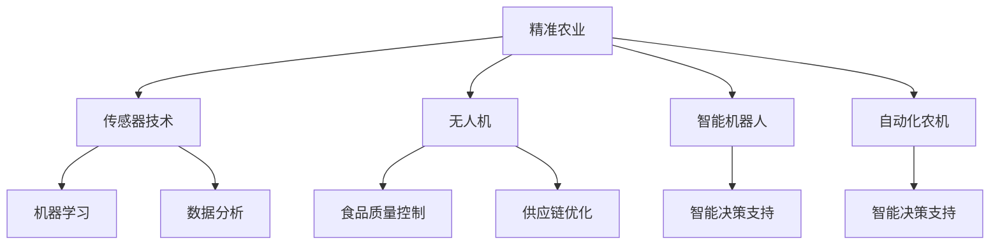

                 

# 人工智能在农业和食品行业中的应用

> 关键词：人工智能,农业,食品行业,自动化,精准农业,智能设备,食品质量控制,机器学习,数据分析,物联网(IoT)

## 1. 背景介绍

### 1.1 问题由来
农业和食品行业作为人类生存和发展的基础，长期以来面临着资源利用效率低、生产成本高、食品安全隐患等挑战。近年来，人工智能技术的快速发展，为农业和食品行业的转型升级提供了新的机遇。通过智能化改造，农业和食品产业可以大幅度提升生产效率、降低环境影响、保障食品安全，全面赋能乡村振兴。

### 1.2 问题核心关键点
人工智能在农业和食品行业中的应用，主要围绕以下几个关键点展开：

- **自动化**：通过智能机器人、自动化设备，减少人工参与，提高生产效率。
- **精准农业**：利用传感器、无人机等技术，实现对农田的精细化管理。
- **食品质量控制**：借助图像识别、光谱分析等技术，提升食品质量检测的准确性和速度。
- **供应链优化**：通过物联网和区块链技术，实现食品供应链的全程追溯和优化管理。
- **智能决策支持**：利用数据分析和机器学习模型，辅助农业生产决策。

这些核心点构成了人工智能在农业和食品行业应用的基础框架，推动了产业的智能化转型。

### 1.3 问题研究意义
人工智能在农业和食品行业的应用，对于提高农业生产效率、降低成本、保障食品安全、保护环境、推动产业升级具有重要意义：

1. **提高生产效率**：自动化和精准农业技术可以大幅减少人力物力投入，提高单位面积产量。
2. **降低成本**：智能设备减少了人工操作和原料浪费，降低生产成本。
3. **保障食品安全**：精准检测和供应链管理保证了食品从生产到餐桌的每一个环节都符合标准。
4. **保护环境**：智能灌溉、精准施肥等技术减少了农药和化肥的使用，保护了生态环境。
5. **推动产业升级**：人工智能技术的应用提升了农业和食品行业的技术含量，推动了产业的数字化、智能化发展。

## 2. 核心概念与联系

### 2.1 核心概念概述

为更好地理解人工智能在农业和食品行业中的应用，本节将介绍几个关键概念：

- **精准农业**：利用传感器、卫星图像、无人机等技术，对农田进行精细化管理，优化资源使用，提高农业生产效率。
- **自动化设备**：包括智能机器人、自动化农机等，通过智能算法控制，实现农作物的播种、施肥、灌溉等作业的自动化。
- **机器学习**：通过数据驱动的模型训练，实现对农业生产过程中的数据挖掘和智能决策。
- **食品质量控制**：利用图像识别、光谱分析等技术，对食品进行智能化检测，保障食品安全。
- **供应链优化**：通过物联网技术实现食品供应链的全程跟踪，提高物流效率，减少损耗。
- **智能决策支持**：利用数据分析和机器学习模型，为农业生产和管理提供决策支持。

这些核心概念之间的逻辑关系可以通过以下Mermaid流程图来展示：



这个流程图展示了人工智能在农业和食品行业应用的核心概念及其相互关系：

1. 精准农业通过传感器技术获取农田数据，无人机进行空中监控，智能机器人自动化作业，自动化农机完成播种、施肥等。
2. 传感器数据和无人机监控信息经过机器学习模型进行智能决策。
3. 食品质量控制借助图像识别和光谱分析，提升检测效率和准确性。
4. 供应链优化通过物联网技术，实现食品从生产到消费的全过程追溯。
5. 智能决策支持通过数据分析和机器学习，辅助生产和管理决策。

## 3. 核心算法原理 & 具体操作步骤
### 3.1 算法原理概述

人工智能在农业和食品行业的应用，主要基于以下几个核心算法原理：

- **机器学习**：通过监督学习和无监督学习，训练出预测模型，用于自动化决策和预测。
- **深度学习**：利用神经网络模型，进行图像识别、语音识别等任务，提升智能设备的识别准确率。
- **自然语言处理(NLP)**：通过文本分析，实现智能问答、情感分析等功能，提升人机交互体验。
- **优化算法**：如梯度下降、遗传算法等，用于求解模型最优参数。
- **强化学习**：通过与环境的交互，优化智能设备的控制策略，提升自动化性能。

### 3.2 算法步骤详解

基于人工智能的农业和食品行业应用，主要包括以下关键步骤：

**Step 1: 数据收集与预处理**
- 收集农业生产过程中的各类数据，如土壤湿度、气候信息、作物生长数据等。
- 对数据进行清洗、归一化、特征提取等预处理，以便后续建模使用。

**Step 2: 模型训练与优化**
- 选择合适的机器学习或深度学习模型，使用收集到的数据进行模型训练。
- 利用验证集评估模型性能，应用优化算法对模型进行调参和优化。

**Step 3: 模型部署与测试**
- 将训练好的模型部署到农业设备或食品质量检测设备中。
- 在实际生产环境中进行模型测试，评估其效果和性能。

**Step 4: 持续迭代与升级**
- 根据实际测试结果，不断调整模型参数和优化策略。
- 定期收集新数据，进行模型重新训练，保持模型的时效性和准确性。

### 3.3 算法优缺点

人工智能在农业和食品行业的应用，具有以下优点：

- **提升效率**：自动化和精准农业技术大大减少了人工操作，提高了生产效率。
- **降低成本**：智能设备减少了人力物力投入，降低了生产成本。
- **保障质量**：智能检测技术提高了食品安全检测的准确性和速度。
- **保护环境**：智能灌溉、精准施肥等技术减少了环境污染。
- **优化决策**：数据分析和机器学习模型提供科学决策支持，提升管理水平。

同时，也存在一些缺点：

- **数据依赖**：应用效果依赖高质量的数据，数据收集和预处理成本较高。
- **技术复杂**：涉及多个领域的技术，需要跨学科知识。
- **设备成本**：智能化设备前期投入较大，可能难以被中小型农业或食品企业接受。
- **安全性问题**：智能设备可能面临网络攻击、数据泄露等安全威胁。

### 3.4 算法应用领域

人工智能在农业和食品行业的应用，已经广泛应用于以下几个领域：

- **农业自动化**：智能机器人、自动化农机等，用于自动化种植、施肥、灌溉等作业。
- **精准农业**：无人机、传感器等技术，用于农田监测和精细化管理。
- **食品质量控制**：图像识别、光谱分析等技术，用于食品检测和质量保障。
- **供应链优化**：物联网技术，用于食品供应链的全程追溯和优化管理。
- **智能决策支持**：数据分析和机器学习模型，用于农业生产和管理决策。

除了上述应用外，人工智能还在农业无人机、农业物联网、农业机器人、食品追溯等领域展现了广泛的应用前景。

## 4. 数学模型和公式 & 详细讲解 & 举例说明
### 4.1 数学模型构建

本节将使用数学语言对人工智能在农业和食品行业中的应用进行更加严格的刻画。

设农业生产过程中收集到的数据为 $\mathcal{D}=\{(x_i, y_i)\}_{i=1}^N, x_i \in \mathcal{X}, y_i \in \mathcal{Y}$。其中，$x_i$ 表示农业生产过程中的环境数据，$y_i$ 表示相应的农业生产决策（如播种时间、施肥量等）。

定义模型 $M_{\theta}:\mathcal{X} \rightarrow \mathcal{Y}$，其中 $\theta$ 为模型参数。农业生产过程中的优化目标为最小化模型预测误差：

$$
\mathcal{L}(\theta) = \frac{1}{N} \sum_{i=1}^N \ell(M_{\theta}(x_i),y_i)
$$

其中 $\ell$ 为损失函数，常用的包括均方误差、交叉熵等。

在模型训练过程中，通过梯度下降等优化算法，不断更新模型参数 $\theta$，直至模型收敛：

$$
\theta \leftarrow \theta - \eta \nabla_{\theta}\mathcal{L}(\theta)
$$

其中 $\eta$ 为学习率，$\nabla_{\theta}\mathcal{L}(\theta)$ 为损失函数对模型参数的梯度，可通过反向传播算法高效计算。

### 4.2 公式推导过程

以农业无人机路径规划为例，其数学模型推导如下：

假设无人机在农田上空进行巡逻，需要规划一条最优路径。设无人机的位置为 $(x,y)$，农田边界为 $(x_1,y_1)$ 和 $(x_2,y_2)$，目标位置为 $(x_0,y_0)$。

无人机的路径规划问题可以转化为求解如下目标函数：

$$
\min_{x,y} \|(x_0-x,y_0-y)\|
$$

其中 $\|(x_0-x,y_0-y)\|$ 为无人机与目标位置的欧氏距离。

根据目标函数的性质，可以使用梯度下降法求解最优路径。目标函数对位置 $(x,y)$ 的梯度为：

$$
\nabla_{(x,y)}\|(x_0-x,y_0-y)\| = (-1, -1)
$$

因此，无人机路径规划的梯度下降更新公式为：

$$
(x,y) \leftarrow (x-\eta,-y-\eta)
$$

其中 $\eta$ 为学习率。

通过不断迭代，无人机路径规划模型将收敛于最优路径。

### 4.3 案例分析与讲解

假设某农场需要监测农田中的农作物生长情况，使用传感器收集土壤湿度、气候信息等数据，并利用深度学习模型进行图像分析。

1. **数据收集与预处理**：
   - 收集农田中的土壤湿度、温度、光照等信息，使用传感器进行实时监测。
   - 收集农田中农作物的图片数据，使用图像处理技术进行预处理。

2. **模型训练与优化**：
   - 使用深度学习模型（如卷积神经网络CNN）对农作物图片进行分类和识别。
   - 使用监督学习算法（如随机森林）对土壤湿度、温度等环境数据进行回归分析。

3. **模型部署与测试**：
   - 将训练好的深度学习模型部署到田间监测设备中。
   - 在农田中进行实际测试，评估模型准确性和实时性。

## 5. 项目实践：代码实例和详细解释说明
### 5.1 开发环境搭建

在进行农业和食品行业人工智能项目开发前，需要准备好开发环境。以下是使用Python进行TensorFlow开发的环境配置流程：

1. 安装Anaconda：从官网下载并安装Anaconda，用于创建独立的Python环境。

2. 创建并激活虚拟环境：
```bash
conda create -n tf-env python=3.8 
conda activate tf-env
```

3. 安装TensorFlow：根据CUDA版本，从官网获取对应的安装命令。例如：
```bash
conda install tensorflow -c pytorch -c conda-forge
```

4. 安装各类工具包：
```bash
pip install numpy pandas scikit-learn matplotlib tqdm jupyter notebook ipython
```

完成上述步骤后，即可在`tf-env`环境中开始项目开发。

### 5.2 源代码详细实现

下面我们以农作物分类任务为例，给出使用TensorFlow实现深度学习模型的PyTorch代码实现。

首先，定义模型结构：

```python
import tensorflow as tf
from tensorflow.keras import layers, models

# 定义卷积神经网络
model = models.Sequential([
    layers.Conv2D(32, (3, 3), activation='relu', input_shape=(64, 64, 3)),
    layers.MaxPooling2D((2, 2)),
    layers.Conv2D(64, (3, 3), activation='relu'),
    layers.MaxPooling2D((2, 2)),
    layers.Conv2D(64, (3, 3), activation='relu'),
    layers.MaxPooling2D((2, 2)),
    layers.Flatten(),
    layers.Dense(64, activation='relu'),
    layers.Dense(10)
])
```

然后，定义训练和评估函数：

```python
import tensorflow as tf
from tensorflow.keras import datasets, models, layers, optimizers

# 加载数据集
(train_images, train_labels), (test_images, test_labels) = datasets.cifar10.load_data()

# 数据预处理
train_images = train_images / 255.0
test_images = test_images / 255.0

# 定义损失函数和优化器
loss_fn = tf.keras.losses.SparseCategoricalCrossentropy(from_logits=True)
optimizer = optimizers.Adam()

# 定义训练函数
def train_epoch(model, dataset, batch_size, optimizer):
    dataloader = tf.data.Dataset.from_tensor_slices((dataset.images, dataset.labels)).batch(batch_size).shuffle(buffer_size=1024)
    model.train()
    epoch_loss = 0
    for images, labels in dataloader:
        with tf.GradientTape() as tape:
            logits = model(images, training=True)
            loss = loss_fn(labels, logits)
        grads = tape.gradient(loss, model.trainable_variables)
        optimizer.apply_gradients(zip(grads, model.trainable_variables))
        epoch_loss += loss
    return epoch_loss / len(dataloader)

# 定义评估函数
def evaluate(model, dataset, batch_size):
    dataloader = tf.data.Dataset.from_tensor_slices((dataset.images, dataset.labels)).batch(batch_size)
    model.eval()
    test_loss = 0
    for images, labels in dataloader:
        logits = model(images, training=False)
        test_loss += loss_fn(labels, logits).numpy()
    return test_loss / len(dataset)

# 启动训练流程并在测试集上评估
epochs = 5
batch_size = 32

for epoch in range(epochs):
    loss = train_epoch(model, train_images, batch_size, optimizer)
    print(f"Epoch {epoch+1}, train loss: {loss:.3f}")
    
    print(f"Epoch {epoch+1}, test loss: {evaluate(model, test_images, batch_size)}")
```

以上就是使用TensorFlow对深度学习模型进行农作物分类任务微调的完整代码实现。可以看到，TensorFlow提供了丰富的API，使得模型搭建和训练变得简单高效。

### 5.3 代码解读与分析

让我们再详细解读一下关键代码的实现细节：

**模型结构定义**：
- 使用了卷积神经网络（CNN），通过多层卷积、池化和全连接层，对农作物图片进行分类和识别。
- 每个卷积层后紧跟池化层，以减小特征图的尺寸和参数量。
- 最后通过全连接层进行分类，输出10个类别的概率分布。

**数据预处理**：
- 将图像数据归一化到0-1之间，以加快模型的训练速度。
- 使用数据集生成器，将图像和标签打包成批次，以便模型训练。

**损失函数和优化器定义**：
- 使用交叉熵损失函数，计算模型预测和真实标签之间的差异。
- 使用Adam优化器，通过梯度下降算法优化模型参数。

**训练和评估函数定义**：
- 使用自定义训练函数`train_epoch`，对模型进行批次训练，计算损失函数并反向传播。
- 使用自定义评估函数`evaluate`，对模型在测试集上的损失进行评估。

**训练流程**：
- 循环迭代训练5个epoch，每次更新模型参数并评估损失。
- 每个epoch结束时输出训练损失和测试损失，以便对比和调试。

## 6. 实际应用场景
### 6.1 智能灌溉系统

智能灌溉系统是农业领域人工智能应用的典型代表。通过传感器实时监测土壤湿度、气候信息，智能灌溉系统可以精准控制灌溉量，避免水资源浪费，提高农田灌溉效率。

在技术实现上，可以使用物联网设备采集农田数据，结合机器学习模型进行智能决策。具体步骤包括：
1. 传感器采集农田土壤湿度、温度等数据。
2. 数据传入中央控制平台，进行数据清洗和预处理。
3. 使用机器学习模型对数据进行分析，预测未来土壤湿度变化趋势。
4. 根据预测结果，智能控制灌溉设备开启或关闭，实现精准灌溉。

### 6.2 无人机巡检系统

无人机在农业和食品行业中的应用，不仅可以用于农田巡检和病虫害监测，还可以用于农药喷洒、农作物种植等作业。

在技术实现上，可以使用计算机视觉技术进行农田图像分析和无人机路径规划。具体步骤包括：
1. 无人机搭载高清摄像头，实时采集农田图像数据。
2. 使用深度学习模型对图像进行分类和识别，识别出病虫害或异常情况。
3. 根据识别结果，无人机自动规划飞行路径，进行精准喷洒或种植。

### 6.3 食品质量检测

食品质量检测是保障食品安全的重要环节。通过图像识别、光谱分析等技术，可以对食品进行智能化检测，提升检测效率和准确性。

在技术实现上，可以使用深度学习模型进行图像分类和目标检测。具体步骤包括：
1. 收集食品样本图像数据，并进行预处理。
2. 使用卷积神经网络模型进行图像分类和目标检测。
3. 对食品质量进行综合评估，筛选不合格产品，保障食品安全。

### 6.4 未来应用展望

随着人工智能技术的不断进步，农业和食品行业的应用场景将不断拓展，未来可能出现更多创新的应用：

1. **智能温室**：通过传感器和自动化设备，实时监测温室内的环境参数，自动控制光照、温度、湿度等条件，实现智能温室管理。
2. **食品追溯系统**：利用物联网技术，实现食品从生产到销售的全程追溯，保障食品来源可查、去向可追、责任可究。
3. **智能仓库管理**：通过机器学习模型，实现仓库物品自动分类、存储和取用，提升仓储管理效率。
4. **精准农业**：结合卫星遥感、无人机等技术，实现农田的精细化管理，提高土地利用率和作物产量。
5. **智能采摘机器人**：使用计算机视觉和深度学习技术，实现农产品的智能采摘和分拣，提高采摘效率和质量。

这些应用场景的实现，将极大地提升农业和食品行业的智能化水平，为乡村振兴和绿色发展提供强大的技术支撑。

## 7. 工具和资源推荐
### 7.1 学习资源推荐

为了帮助开发者系统掌握人工智能在农业和食品行业的应用，这里推荐一些优质的学习资源：

1. **Coursera《农业与食品系统中的AI应用》课程**：由斯坦福大学开设，涵盖农业、食品系统中AI技术应用的多个领域。

2. **《AI for Agriculture and Food》书籍**：全面介绍了人工智能在农业和食品行业的应用，包括自动化、精准农业、食品质量控制等方面。

3. **ArXiv论文库**：包含大量关于农业和食品领域AI技术的研究论文，是深入学习的重要资源。

4. **GitHub项目**：许多开源项目提供了详细的代码实现和文档，可以参考和复现研究结果。

5. **农业AI国际竞赛**：如Kaggle农业数据集竞赛，通过实际问题驱动学习，提升实战能力。

通过这些资源的学习实践，相信你一定能够快速掌握人工智能在农业和食品行业的应用，并用于解决实际的农业和食品问题。

### 7.2 开发工具推荐

高效的开发离不开优秀的工具支持。以下是几款用于农业和食品行业人工智能开发的常用工具：

1. **TensorFlow**：由Google主导开发的开源深度学习框架，生产部署方便，适合大规模工程应用。

2. **PyTorch**：基于Python的开源深度学习框架，灵活动态的计算图，适合快速迭代研究。

3. **Robot Operating System (ROS)**：广泛应用于机器人领域的开源操作系统，提供丰富的节点库和工具，便于开发自动化系统。

4. **MATLAB**：数学计算和数据分析工具，适用于对农业数据进行复杂计算和可视化。

5. **OpenCV**：计算机视觉库，提供丰富的图像处理和分析函数，适用于农业图像识别和分析。

6. **MySQL/MariaDB**：关系型数据库，适用于农业数据存储和管理。

合理利用这些工具，可以显著提升农业和食品行业人工智能项目的开发效率，加快创新迭代的步伐。

### 7.3 相关论文推荐

人工智能在农业和食品行业的应用，源于学界的持续研究。以下是几篇奠基性的相关论文，推荐阅读：

1. **A Survey on Artificial Intelligence Applications in Agriculture**：综述了人工智能在农业领域的应用，涵盖农业自动化、精准农业、农业物联网等方面。

2. **Artificial Intelligence for Precision Agriculture**：介绍了AI在精准农业中的多种应用，如智能灌溉、精准施肥、病虫害监测等。

3. **Deep Learning for Food Quality Control**：介绍了深度学习在食品质量检测中的应用，如图像分类、目标检测、光谱分析等。

4. **A Comparative Study of Machine Learning Algorithms for Irrigation Management**：比较了不同机器学习算法在灌溉管理中的效果，提出了改进建议。

5. **Food Safety and Quality Control with AI**：综述了AI在食品安全和质量控制中的应用，如智能检测、供应链管理等。

这些论文代表了大农业和食品领域AI技术的发展脉络。通过学习这些前沿成果，可以帮助研究者把握学科前进方向，激发更多的创新灵感。

## 8. 总结：未来发展趋势与挑战

### 8.1 总结

本文对人工智能在农业和食品行业中的应用进行了全面系统的介绍。首先阐述了人工智能技术在农业和食品行业应用的背景和意义，明确了AI技术在这些领域的应用前景和价值。其次，从原理到实践，详细讲解了基于深度学习和机器学习模型的农业和食品行业应用。最后，本文还探讨了AI技术在这些领域面临的挑战和未来发展方向。

通过本文的系统梳理，可以看到，人工智能在农业和食品行业的应用已经从简单的自动化向更智能、精细化的方向发展。AI技术为农业和食品产业带来了巨大的变革，提升了生产效率、降低了成本、保障了食品安全，推动了产业的智能化转型。未来，随着技术的不断进步和应用的深入，AI将在更多领域展现出其巨大的潜力和价值。

### 8.2 未来发展趋势

展望未来，人工智能在农业和食品行业的应用将呈现以下几个发展趋势：

1. **智能化程度提升**：随着深度学习、自然语言处理等技术的发展，农业和食品行业将更加智能化，能够更好地理解和应对复杂多变的生产环境。
2. **跨学科融合**：AI技术与物联网、区块链、大数据等技术的融合，将推动农业和食品行业的数字化转型，实现产业链的全面优化。
3. **精准化管理**：精准农业和智能灌溉等技术将进一步发展，实现农田的精细化管理，提高土地利用率和作物产量。
4. **自动化水平提高**：智能机器人、自动化设备等技术将广泛应用于农业和食品生产，减少人工操作，提高生产效率。
5. **数据驱动决策**：基于大数据分析和机器学习模型，农业和食品行业将更加依赖数据驱动的决策支持，提高管理水平和运营效率。

这些趋势展示了人工智能在农业和食品行业应用的广阔前景，预示着AI技术将为这些行业带来更深远的影响。

### 8.3 面临的挑战

尽管人工智能在农业和食品行业的应用已经取得了显著进展，但在迈向更加智能化、普适化应用的过程中，仍面临诸多挑战：

1. **数据质量问题**：农业和食品行业的数据采集和处理复杂，数据质量参差不齐，影响了AI模型的训练效果。
2. **设备成本高**：智能化设备的初期投入较大，中小型农业和食品企业难以承受。
3. **技术复杂性**：AI技术涉及多个领域，需要跨学科知识，增加了技术应用的复杂性。
4. **法规和标准缺失**：农业和食品行业的AI应用缺乏明确的法规和标准，存在安全隐患和法律风险。
5. **数据隐私保护**：农业和食品行业涉及大量个人隐私数据，数据隐私保护成为重要问题。

### 8.4 研究展望

面对AI技术在农业和食品行业应用所面临的挑战，未来的研究需要在以下几个方面寻求新的突破：

1. **数据采集与处理**：研发更加稳定、可靠的数据采集和处理技术，提高数据质量，降低数据采集成本。
2. **智能化设备**：开发低成本、高性价比的智能化设备，降低中小企业的设备投入门槛。
3. **跨学科融合**：加强农业、食品和AI等领域的交叉研究，推动技术融合，提升应用效果。
4. **法规与标准**：制定明确的技术标准和法规，保障AI技术在农业和食品行业应用的安全性和合规性。
5. **数据隐私保护**：建立有效的数据隐私保护机制，确保数据安全，保护用户隐私。

这些研究方向将推动AI技术在农业和食品行业的深入应用，为产业升级和可持续发展提供坚实的基础。

## 9. 附录：常见问题与解答

**Q1：农业自动化和精准农业的区别是什么？**

A: 农业自动化主要通过智能设备实现农业作业的自动化，如自动化农机、智能灌溉等。而精准农业则是在自动化基础上，利用传感器、无人机等技术，对农田进行精细化管理，优化资源使用，提高生产效率和产量。

**Q2：AI在食品质量控制中的应用主要有哪些？**

A: AI在食品质量控制中的应用主要包括以下几个方面：
1. **图像识别**：使用深度学习模型对食品图片进行分类和检测，识别不合格产品。
2. **光谱分析**：利用光谱传感器检测食品成分和质量指标，如水分、营养成分等。
3. **机器视觉**：通过计算机视觉技术检测食品表面瑕疵和污染物。
4. **智能检测系统**：结合图像识别和光谱分析，构建综合的食品质量检测系统。

**Q3：农业无人机在实际应用中面临哪些技术挑战？**

A: 农业无人机在实际应用中面临以下技术挑战：
1. **数据处理**：无人机采集的海量数据需要进行高效处理和分析，提取有用信息。
2. **飞行控制**：无人机的自主飞行和精确控制需要高精度的传感器和算法支持。
3. **模型训练**：深度学习模型需要大量标注数据进行训练，且训练过程复杂耗时。
4. **通信延迟**：无人机与地面站之间的通信延迟可能影响实时决策。

**Q4：智能温室系统的关键技术有哪些？**

A: 智能温室系统的关键技术包括：
1. **传感器技术**：用于监测土壤湿度、温度、光照等环境参数。
2. **自动化控制**：用于自动控制灌溉、施肥、通风等设备。
3. **机器学习**：用于数据分析和模型训练，优化温室管理策略。
4. **物联网**：用于设备联网和数据传输，实现远程控制和管理。

通过以上关键技术，智能温室系统可以实现自动化、精细化和智能化管理，提高生产效率和作物产量。

---

作者：禅与计算机程序设计艺术 / Zen and the Art of Computer Programming

