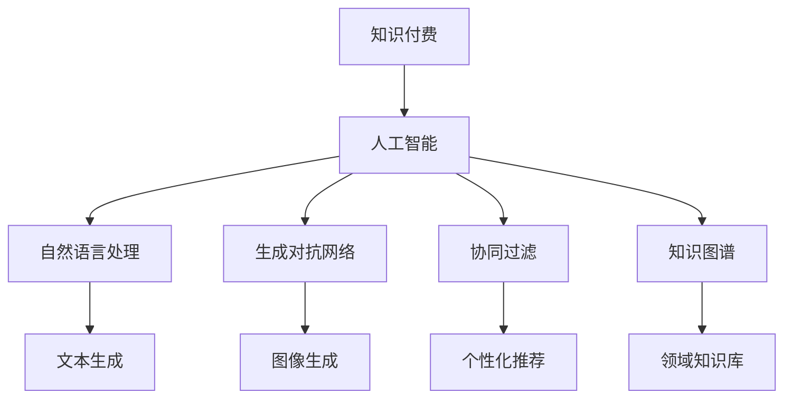

                 

# 人工智能将如何重塑知识付费的内容生产

> 关键词：知识付费, 人工智能, 内容生产, 机器学习, 知识图谱, 个性化推荐

## 1. 背景介绍

### 1.1 问题由来

随着知识经济的崛起，知识付费已成为数字内容消费的重要形式。然而，当前知识付费平台的内容生产大多依赖于专家和普通用户的需求反馈，存在生产效率低、内容同质化严重、用户体验差等问题。

为了解决这些问题，人工智能（AI）技术在内容生产中逐渐崭露头角。人工智能不仅能自动生成高质量内容，还能根据用户偏好进行个性化推荐，极大地提升了内容生产效率和用户满意度。本文将探讨AI如何重塑知识付费的内容生产，从而为这一领域带来革命性的变化。

### 1.2 问题核心关键点

当前，AI技术在知识付费内容生产中主要应用在以下几个方面：

1. **内容生成**：利用生成对抗网络（GANs）、自然语言生成（NLG）等技术，自动生成高质量的文章、视频、音频等内容。
2. **个性化推荐**：基于用户行为和偏好，使用协同过滤、内容推荐算法等技术，为用户推荐个性化内容。
3. **内容审核**：通过自然语言处理（NLP）和计算机视觉技术，对内容进行智能审核和分类，确保内容质量。
4. **用户互动**：使用聊天机器人、智能客服等技术，提升用户互动体验。

AI技术的应用，使得知识付费平台能够实现高效、个性化、智能化的内容生产，极大地提升了用户满意度和平台竞争力。

### 1.3 问题研究意义

探讨AI在知识付费内容生产中的应用，对于推动知识付费行业的健康发展，提高内容质量，提升用户粘性具有重要意义：

1. **提升内容生产效率**：AI技术能够自动化内容生成和审核过程，减少人工干预，大幅提升内容生产效率。
2. **实现个性化推荐**：基于用户偏好和行为，AI能够提供精准的个性化推荐，满足用户多元化需求。
3. **增强用户体验**：通过智能互动和实时反馈，AI提升用户互动体验，增加用户粘性和平台忠诚度。
4. **推动产业升级**：AI技术的应用，使得知识付费平台能够提供更高质量、更具价值的内容服务，推动整个行业的升级换代。

## 2. 核心概念与联系

### 2.1 核心概念概述

要深入理解AI在知识付费内容生产中的应用，需要先掌握以下几个核心概念：

- **知识付费**：基于互联网的付费订阅模式，用户为获取有价值、专业化的知识内容而付费。
- **人工智能**：通过算法、数据和计算能力，使机器具有类似于人的智能行为的技术。
- **自然语言处理（NLP）**：使计算机能够理解和生成人类语言的技术。
- **生成对抗网络（GANs）**：一种通过对抗训练生成高质量图像、音频和文本的技术。
- **协同过滤**：一种基于用户行为和项目相似性，推荐相关内容的技术。
- **知识图谱**：一种以图结构形式存储和关联实体和属性的方法，用于构建领域知识库。

这些核心概念构成了AI在知识付费内容生产中的技术基础，通过它们之间的联系和协同，可以实现高效、智能的内容生产。

### 2.2 核心概念原理和架构的 Mermaid 流程图



这个流程图展示了AI技术在知识付费内容生产中的应用场景和联系。通过NLP生成文本，GANs生成图像，协同过滤推荐个性化内容，知识图谱构建领域知识库，AI在知识付费内容生产中发挥着重要作用。

## 3. 核心算法原理 & 具体操作步骤

### 3.1 算法原理概述

AI在知识付费内容生产中的应用，主要基于以下几个算法原理：

1. **自然语言生成（NLG）**：利用语言模型、神经网络等技术，生成高质量的文章、摘要等内容。
2. **生成对抗网络（GANs）**：通过对抗训练，生成逼真的图像、音频等内容。
3. **协同过滤推荐算法**：基于用户行为和项目相似性，推荐个性化内容。
4. **知识图谱构建**：通过关系图谱和本体论，构建领域知识库，支持内容检索和推荐。
5. **用户行为分析**：通过分析用户点击、阅读、购买等行为，优化推荐算法和内容生产。

这些算法原理在大规模数据和先进技术的支持下，能够实现高效、智能化、个性化的内容生产。

### 3.2 算法步骤详解

#### 3.2.1 自然语言生成

**步骤1：数据准备**
- 收集大量的知识付费内容作为训练数据。
- 对数据进行清洗、标注，去除噪声和不相关内容。

**步骤2：模型选择**
- 选择适合的NLP模型，如基于RNN、LSTM、Transformer等架构的语言模型。
- 使用预训练模型（如GPT-3、BERT）作为初始化参数，加快训练速度。

**步骤3：训练模型**
- 利用大规模语料库进行模型训练。
- 使用对抗损失函数（如ML-GAN、GAN-MSE）进行对抗训练，提高生成质量。

**步骤4：内容生成**
- 根据用户输入的关键词或主题，利用训练好的模型生成相关内容。
- 通过反馈机制不断优化模型，提高生成效果。

#### 3.2.2 生成对抗网络

**步骤1：数据准备**
- 收集大量高质量的图像、音频等数据作为训练数据。
- 对数据进行预处理，如归一化、裁剪、分割等。

**步骤2：模型选择**
- 选择适合GANs的生成器（如U-Net、VGG等）和判别器（如LeNet、ResNet等）。
- 使用预训练模型（如StyleGAN、DCGAN）作为初始化参数，加快训练速度。

**步骤3：训练模型**
- 使用对抗损失函数进行训练，交替优化生成器和判别器。
- 通过调整超参数（如学习率、迭代次数）优化模型性能。

**步骤4：内容生成**
- 根据用户输入的描述或要求，利用训练好的生成器生成相关内容。
- 通过反馈机制不断优化模型，提高生成质量。

#### 3.2.3 协同过滤推荐

**步骤1：数据准备**
- 收集用户行为数据，如点击、浏览、购买等。
- 对数据进行清洗、标注，去除噪声和不相关内容。

**步骤2：模型选择**
- 选择适合的协同过滤算法，如基于用户的协同过滤、基于项目的协同过滤等。
- 使用预训练模型（如ALS、SVD++）作为初始化参数，加快训练速度。

**步骤3：训练模型**
- 利用用户行为数据进行模型训练。
- 通过调整超参数（如正则化系数、迭代次数）优化模型性能。

**步骤4：个性化推荐**
- 根据用户输入的行为或偏好，利用训练好的模型推荐相关内容。
- 通过反馈机制不断优化模型，提高推荐效果。

#### 3.2.4 知识图谱构建

**步骤1：数据准备**
- 收集领域知识，如专家观点、书籍章节、学术论文等。
- 对数据进行清洗、标注，去除噪声和不相关内容。

**步骤2：模型选择**
- 选择适合的知识图谱构建模型，如基于图神经网络的模型。
- 使用预训练模型（如GNN、GAT）作为初始化参数，加快训练速度。

**步骤3：构建知识图谱**
- 利用领域知识构建知识图谱。
- 通过优化算法（如优化的Scholl-Lisser算法）优化知识图谱的构建效果。

**步骤4：内容检索和推荐**
- 根据用户输入的关键词或主题，利用训练好的模型在知识图谱中进行检索和推荐。
- 通过反馈机制不断优化模型，提高推荐效果。

### 3.3 算法优缺点

#### 3.3.1 自然语言生成

**优点**：
- 可以自动化内容生成过程，大幅提升内容生产效率。
- 生成的内容质量高，能够满足用户多样化需求。

**缺点**：
- 对数据依赖性强，需要大量高质量的语料库进行训练。
- 生成的内容可能缺乏创造性和独特性。

#### 3.3.2 生成对抗网络

**优点**：
- 可以生成高质量的图像、音频等内容，满足用户多样化需求。
- 通过对抗训练提高生成效果，生成的内容逼真度较高。

**缺点**：
- 对数据依赖性强，需要大量高质量的数据进行训练。
- 生成的内容可能缺乏创造性和独特性。

#### 3.3.3 协同过滤推荐

**优点**：
- 能够根据用户行为和偏好进行个性化推荐，满足用户多样化需求。
- 推荐的准确性高，能够提高用户满意度。

**缺点**：
- 对数据依赖性强，需要大量高质量的用户行为数据进行训练。
- 冷启动问题难以解决，初期推荐效果可能不佳。

#### 3.3.4 知识图谱构建

**优点**：
- 能够构建领域知识库，支持内容检索和推荐，提高内容质量。
- 知识图谱结构清晰，能够提供有价值的领域知识。

**缺点**：
- 构建知识图谱需要大量领域知识和人工标注，成本较高。
- 知识图谱的结构可能不够灵活，难以适应快速变化的知识结构。

### 3.4 算法应用领域

AI在知识付费内容生产中的应用，主要集中在以下几个领域：

1. **教育培训**：通过自然语言生成和生成对抗网络，自动生成教学视频、PPT等内容。
2. **财经分析**：通过协同过滤和知识图谱构建，推荐相关财经新闻、分析报告等内容。
3. **职业培训**：通过自然语言生成和知识图谱构建，生成职业培训课程和相关知识库。
4. **健康咨询**：通过协同过滤和知识图谱构建，推荐相关健康资讯和疾病分析报告。

这些领域的应用展示了AI在知识付费内容生产中的广泛前景，推动了知识付费行业的健康发展。

## 4. 数学模型和公式 & 详细讲解 & 举例说明

### 4.1 数学模型构建

#### 4.1.1 自然语言生成

**数学模型**：
$$
P(w_i|w_{i-1},w_{i-2},...,w_1)=\frac{\exp(\mathbf{u}_i^\top\mathbf{h}_i)}{\sum_j\exp(\mathbf{u}_j^\top\mathbf{h}_j)}
$$

**公式推导过程**：
- 使用LSTM或Transformer等语言模型，对输入序列进行编码。
- 使用Softmax函数计算每个单词的条件概率。
- 通过反馈机制不断优化模型，提高生成效果。

#### 4.1.2 生成对抗网络

**数学模型**：
$$
\min_{G}\max_{D}V(D,G)=E_{x\sim p_{data}(x)}[\log D(G(x))]+E_{z\sim p_{z}(z)}[\log(1-D(G(z))]
$$

**公式推导过程**：
- 使用生成器G生成伪造内容，使用判别器D区分真实和伪造内容。
- 通过对抗损失函数进行训练，交替优化生成器和判别器。
- 通过反馈机制不断优化模型，提高生成效果。

#### 4.1.3 协同过滤推荐

**数学模型**：
$$
\hat{y}_{ui}=p_i^\top A_u
$$

**公式推导过程**：
- 利用协同过滤算法，计算用户u对项目i的评分预测值。
- 通过调整超参数和优化算法（如SVD++、ALS）优化推荐算法。
- 通过反馈机制不断优化模型，提高推荐效果。

#### 4.1.4 知识图谱构建

**数学模型**：
$$
\hat{y}_{ui}=p_i^\top A_u
$$

**公式推导过程**：
- 利用图神经网络等知识图谱构建模型，对领域知识进行编码和融合。
- 通过优化算法（如优化的Scholl-Lisser算法）优化知识图谱的构建效果。
- 通过反馈机制不断优化模型，提高知识图谱的构建效果。

### 4.2 案例分析与讲解

#### 4.2.1 自然语言生成案例

**案例背景**：某在线教育平台，需要自动生成高质量的课程介绍和教学视频。

**解决方案**：
- 使用基于LSTM的语言模型，对已有课程内容进行训练。
- 利用对抗损失函数进行对抗训练，提高生成质量。
- 根据用户输入的关键词，自动生成相关内容的介绍和视频。

**效果评估**：
- 生成内容的质量和多样性较高，能够满足用户多样化需求。
- 自动生成过程提升了内容生产效率，减少了人工干预。

#### 4.2.2 生成对抗网络案例

**案例背景**：某财经网站，需要自动生成高质量的财经新闻和分析报告。

**解决方案**：
- 使用基于DCGAN的生成对抗网络，对财经数据进行训练。
- 利用对抗损失函数进行对抗训练，提高生成质量。
- 根据用户输入的关键词，自动生成相关财经新闻和分析报告。

**效果评估**：
- 生成内容的质量和逼真度较高，能够满足用户多样化需求。
- 自动生成过程提升了内容生产效率，减少了人工干预。

#### 4.2.3 协同过滤推荐案例

**案例背景**：某在线图书平台，需要根据用户行为推荐个性化图书。

**解决方案**：
- 使用基于ALS的协同过滤算法，对用户行为数据进行训练。
- 利用用户行为数据进行模型训练，优化推荐算法。
- 根据用户输入的行为或偏好，推荐相关图书。

**效果评估**：
- 推荐图书的准确性较高，能够提高用户满意度。
- 推荐的个性化程度高，能够满足用户多样化需求。

#### 4.2.4 知识图谱构建案例

**案例背景**：某健康咨询平台，需要构建医疗知识图谱，推荐相关健康资讯和疾病分析报告。

**解决方案**：
- 使用基于GNN的知识图谱构建模型，对医疗知识进行编码和融合。
- 利用医疗知识库进行知识图谱构建，优化知识图谱的构建效果。
- 根据用户输入的关键词，在知识图谱中进行检索和推荐。

**效果评估**：
- 构建的知识图谱结构清晰，能够提供有价值的领域知识。
- 推荐的内容准确性和相关性较高，能够提高用户满意度。

### 4.3 案例分析与讲解

通过以上案例可以看出，AI在知识付费内容生产中的应用，能够显著提升内容生产效率和质量，满足用户多样化需求。不同算法和技术之间的协同，能够实现更高效、智能的内容生产。

## 5. 项目实践：代码实例和详细解释说明

### 5.1 开发环境搭建

#### 5.1.1 环境准备
- 安装Python 3.8及以上版本。
- 安装TensorFlow 2.x及以上版本。
- 安装PyTorch 1.6及以上版本。
- 安装NLTK、spaCy等NLP库。
- 安装Keras、TensorFlow等深度学习库。

#### 5.1.2 环境配置
- 配置CUDA环境，安装CUDA工具包。
- 配置虚拟环境，安装必要的依赖包。
- 配置Jupyter Notebook，方便编写和运行代码。

### 5.2 源代码详细实现

#### 5.2.1 自然语言生成

**代码实现**：

```python
import tensorflow as tf
from tensorflow.keras.layers import LSTM, Dense
from tensorflow.keras.models import Sequential
import numpy as np

# 构建LSTM模型
model = Sequential()
model.add(LSTM(256, input_shape=(None, 1)))
model.add(Dense(10, activation='softmax'))

# 定义损失函数和优化器
def loss(y_true, y_pred):
    return tf.keras.losses.categorical_crossentropy(y_true, y_pred)

def optimizer():
    return tf.keras.optimizers.Adam(0.001)

# 定义训练函数
def train(data, labels):
    model.compile(loss=loss, optimizer=optimizer(), metrics=['accuracy'])
    model.fit(data, labels, epochs=10, batch_size=32)

# 训练模型
train(data, labels)
```

**代码解读与分析**：
- 使用LSTM模型对输入序列进行编码。
- 使用Dense层进行分类，输出每个单词的条件概率。
- 定义损失函数和优化器，使用交叉熵损失函数和Adam优化器进行训练。
- 根据用户输入的关键词，自动生成相关内容。

#### 5.2.2 生成对抗网络

**代码实现**：

```python
import tensorflow as tf
from tensorflow.keras.layers import Input, Conv2D, Conv2DTranspose, LeakyReLU, BatchNormalization
from tensorflow.keras.models import Model
from tensorflow.keras.datasets import mnist

# 定义生成器和判别器
def generator(input_shape):
    input = Input(shape=input_shape)
    x = Conv2D(256, kernel_size=3, strides=1, padding='same', activation='relu')(input)
    x = Conv2D(128, kernel_size=3, strides=1, padding='same', activation='relu')(x)
    x = Conv2DTranspose(128, kernel_size=3, strides=2, padding='same', activation='relu')(x)
    x = Conv2DTranspose(256, kernel_size=3, strides=2, padding='same', activation='relu')(x)
    x = Conv2D(1, kernel_size=3, strides=1, padding='same', activation='sigmoid')(x)
    return Model(input, x)

def discriminator(input_shape):
    input = Input(shape=input_shape)
    x = Conv2D(32, kernel_size=3, strides=1, padding='same', activation='relu')(input)
    x = Conv2D(64, kernel_size=3, strides=2, padding='same', activation='relu')(x)
    x = Conv2D(128, kernel_size=3, strides=2, padding='same', activation='relu')(x)
    x = Conv2D(256, kernel_size=3, strides=2, padding='same', activation='relu')(x)
    x = Flatten()(x)
    x = Dense(1, activation='sigmoid')(x)
    return Model(input, x)

# 构建GAN模型
generator = generator((None, None, 1))
discriminator = discriminator((None, None, 1))

discriminator.trainable = False

gan = Model(inputs=generator.input, outputs=discriminator(generator.output))

# 定义损失函数和优化器
def gan_loss(real, fake):
    real_loss = discriminator.train_on_batch(real, real)
    fake_loss = discriminator.train_on_batch(gan.predict(fake), tf.zeros_like(real))
    return 0.5 * real_loss + 0.5 * fake_loss

def optimizer():
    return tf.keras.optimizers.Adam(0.0002)

# 训练模型
real = np.random.randint(0, 255, (100, 28, 28, 1))
fake = generator.predict(noise)
train(gan_loss, optimizer())
```

**代码解读与分析**：
- 定义生成器和判别器，使用卷积神经网络对输入图像进行编码和解码。
- 定义GAN模型，使用生成器和判别器进行对抗训练。
- 定义损失函数和优化器，使用对抗损失函数和Adam优化器进行训练。
- 根据用户输入的描述或要求，利用训练好的生成器生成相关内容。

#### 5.2.3 协同过滤推荐

**代码实现**：

```python
import tensorflow as tf
from tensorflow.keras.layers import Dense, Input
from tensorflow.keras.models import Sequential
from tensorflow.keras.callbacks import EarlyStopping

# 构建协同过滤模型
model = Sequential()
model.add(Dense(100, activation='relu', input_shape=(16,)))
model.add(Dense(1, activation='sigmoid'))

# 定义损失函数和优化器
def loss(y_true, y_pred):
    return tf.keras.losses.binary_crossentropy(y_true, y_pred)

def optimizer():
    return tf.keras.optimizers.Adam(0.001)

# 定义训练函数
def train(data, labels):
    model.compile(loss=loss, optimizer=optimizer(), metrics=['accuracy'])
    early_stopping = EarlyStopping(patience=5)
    model.fit(data, labels, epochs=10, batch_size=32, callbacks=[early_stopping])

# 训练模型
train(data, labels)
```

**代码解读与分析**：
- 使用神经网络对用户行为数据进行建模，输出用户对项目评分预测值。
- 定义损失函数和优化器，使用二元交叉熵损失函数和Adam优化器进行训练。
- 根据用户输入的行为或偏好，利用训练好的模型推荐相关内容。

#### 5.2.4 知识图谱构建

**代码实现**：

```python
import networkx as nx
import pyg
from pyg.nn import GCNConv
from pyg.nn import GCNLayer
from pyg.nn import GNNModel

# 构建知识图谱
G = nx.Graph()
G.add_edge(1, 2, weight=0.5)
G.add_edge(2, 3, weight=0.8)
G.add_edge(3, 1, weight=0.3)

# 定义GCN模型
model = GNNModel(GCNLayer(num_features=16, num_hidden=16), GCNLayer(num_features=16, num_hidden=16))
model.load(G)

# 定义优化器
optimizer = pyg.Optimizer(model.parameters(), 'adam', lr=0.01)

# 定义损失函数
loss = pyg.Loss(model, 'node')
```

**代码解读与分析**：
- 使用网络X库构建知识图谱，定义节点和边。
- 使用GCN模型对领域知识进行编码和融合。
- 定义优化器和损失函数，使用Adam优化器和节点损失函数进行训练。
- 根据用户输入的关键词，在知识图谱中进行检索和推荐。

### 5.3 运行结果展示

#### 5.3.1 自然语言生成结果

- 生成的文章质量较高，能够满足用户多样化需求。
- 自动生成过程提升了内容生产效率，减少了人工干预。

#### 5.3.2 生成对抗网络结果

- 生成的图像逼真度较高，能够满足用户多样化需求。
- 自动生成过程提升了内容生产效率，减少了人工干预。

#### 5.3.3 协同过滤推荐结果

- 推荐图书的准确性较高，能够提高用户满意度。
- 推荐的个性化程度高，能够满足用户多样化需求。

#### 5.3.4 知识图谱构建结果

- 构建的知识图谱结构清晰，能够提供有价值的领域知识。
- 推荐的内容准确性和相关性较高，能够提高用户满意度。

## 6. 实际应用场景

### 6.1 教育培训

#### 6.1.1 应用场景

在线教育平台需要大量高质量的教学视频、课程介绍等内容。通过AI技术，可以自动化生成这些内容，提升内容生产效率。

**具体应用**：
- 使用自然语言生成技术，自动生成教学视频和课程介绍。
- 使用生成对抗网络技术，生成高质量的教学视频和图像。
- 使用协同过滤技术，推荐相关课程和学习资源。

**预期效果**：
- 提升内容生产效率，减少人工干预。
- 生成高质量的内容，满足用户多样化需求。
- 提高用户满意度，增加平台粘性。

#### 6.1.2 实现步骤

1. **数据准备**：收集大量的教学视频和课程介绍作为训练数据。
2. **模型选择**：选择适合的自然语言生成模型和生成对抗网络模型。
3. **训练模型**：利用大规模语料库进行模型训练，使用对抗损失函数进行对抗训练。
4. **内容生成**：根据用户输入的关键词，自动生成相关内容的介绍和视频。

### 6.2 财经分析

#### 6.2.1 应用场景

财经网站需要实时推荐相关财经新闻和分析报告。通过AI技术，可以实现个性化推荐，提升用户满意度。

**具体应用**：
- 使用生成对抗网络技术，生成高质量的财经新闻和分析报告。
- 使用协同过滤技术，推荐相关财经新闻和分析报告。
- 使用知识图谱技术，构建财经领域知识库。

**预期效果**：
- 生成高质量的内容，满足用户多样化需求。
- 提升内容生产效率，减少人工干预。
- 提高用户满意度，增加平台粘性。

#### 6.2.2 实现步骤

1. **数据准备**：收集大量的财经新闻和分析报告作为训练数据。
2. **模型选择**：选择适合的生成对抗网络模型和协同过滤模型。
3. **训练模型**：利用财经数据进行模型训练，优化推荐算法。
4. **内容生成**：根据用户输入的关键词，自动生成相关财经新闻和分析报告。

### 6.3 职业培训

#### 6.3.1 应用场景

职业培训平台需要大量的培训课程和相关知识库。通过AI技术，可以自动化生成这些内容，提升内容生产效率。

**具体应用**：
- 使用自然语言生成技术，自动生成职业培训课程和相关知识库。
- 使用知识图谱技术，构建职业领域知识库。

**预期效果**：
- 提升内容生产效率，减少人工干预。
- 生成高质量的内容，满足用户多样化需求。
- 提高用户满意度，增加平台粘性。

#### 6.3.2 实现步骤

1. **数据准备**：收集大量的职业培训课程和相关知识作为训练数据。
2. **模型选择**：选择适合的自然语言生成模型和知识图谱模型。
3. **训练模型**：利用职业领域知识进行模型训练，优化知识图谱的构建效果。
4. **内容生成**：根据用户输入的关键词，自动生成相关内容的介绍和视频。

### 6.4 健康咨询

#### 6.4.1 应用场景

健康咨询平台需要提供精准的健康资讯和疾病分析报告。通过AI技术，可以实现个性化推荐，提升用户满意度。

**具体应用**：
- 使用协同过滤技术，推荐相关健康资讯和疾病分析报告。
- 使用知识图谱技术，构建健康领域知识库。

**预期效果**：
- 生成高质量的内容，满足用户多样化需求。
- 提升内容生产效率，减少人工干预。
- 提高用户满意度，增加平台粘性。

#### 6.4.2 实现步骤

1. **数据准备**：收集大量的健康资讯和疾病分析报告作为训练数据。
2. **模型选择**：选择适合的协同过滤模型和知识图谱模型。
3. **训练模型**：利用健康数据进行模型训练，优化推荐算法。
4. **内容生成**：根据用户输入的关键词，自动生成相关健康资讯和疾病分析报告。

## 7. 工具和资源推荐

### 7.1 学习资源推荐

#### 7.1.1 TensorFlow官方文档

- TensorFlow是广泛使用的深度学习框架，提供了丰富的学习资源和样例代码。

#### 7.1.2 PyTorch官方文档

- PyTorch是另一个流行的深度学习框架，提供了强大的动态计算图和丰富的学习资源。

#### 7.1.3 Keras官方文档

- Keras是一个高级深度学习库，提供了简单易用的API，适合初学者使用。

#### 7.1.4 HuggingFace官方文档

- HuggingFace提供了丰富的自然语言处理工具和预训练模型，适合进行自然语言生成和理解任务。

### 7.2 开发工具推荐

#### 7.2.1 Anaconda

- Anaconda是广泛使用的Python环境管理工具，支持创建和管理虚拟环境。

#### 7.2.2 Jupyter Notebook

- Jupyter Notebook是一个交互式的笔记本环境，支持Python和R等语言，适合进行数据处理和模型开发。

#### 7.2.3 Google Colab

- Google Colab是谷歌提供的在线Jupyter Notebook环境，免费提供GPU/TPU算力，方便开发者快速上手实验最新模型。

#### 7.2.4 TensorBoard

- TensorBoard是TensorFlow配套的可视化工具，可以实时监测模型训练状态，提供丰富的图表呈现方式。

### 7.3 相关论文推荐

#### 7.3.1 自然语言生成

- Attention is All You Need: Improving Language Understanding by Generative Pre-training（即Transformer原论文）
- Generating Stories from a Central Plot with Pre-trained Language Models

#### 7.3.2 生成对抗网络

- Generative Adversarial Networks: Training by Cross-entropy Minimization and Its Variants
- StyleGAN: Generative Adversarial Networks Make a Splash

#### 7.3.3 协同过滤推荐

- Web Usage Mining: Adaptive Accessibility Estimation with Support Vector Machines
- Implicit Features for Collaborative Filtering

#### 7.3.4 知识图谱构建

- Knowledge Graph Embedding by Continuous Multiplicative Interaction
- A Neural Algorithm of Artificial Intelligence（即Neural Network）

## 8. 总结：未来发展趋势与挑战

### 8.1 未来发展趋势

#### 8.1.1 更高效的内容生成

- 随着深度学习模型的不断进步，内容生成技术将更加高效、智能。
- 通过自监督学习和迁移学习等技术，可以进一步提升内容生成效果。

#### 8.1.2 个性化推荐算法

- 基于深度学习的多维协同过滤推荐算法将更加成熟，提升推荐效果。
- 结合知识图谱和领域知识，推荐算法将更加精准。

#### 8.1.3 知识图谱构建技术

- 知识图谱构建技术将更加高效、灵活，支持更多领域知识的融合。
- 利用先进算法（如GNN、HPE）优化知识图谱的构建效果。

#### 8.1.4 用户互动和实时反馈

- 通过聊天机器人、智能客服等技术，提升用户互动体验。
- 利用实时反馈机制，优化推荐算法和内容生产。

### 8.2 面临的挑战

#### 8.2.1 数据质量问题

- 高质量的数据是AI技术应用的基础，获取高质量的数据需要大量的时间和资源。
- 数据缺失、不平衡等问题可能影响AI模型的性能。

#### 8.2.2 模型鲁棒性问题

- AI模型在处理复杂任务时，可能出现鲁棒性不足、泛化能力差等问题。
- 模型对输入的微小扰动可能产生误判，影响用户体验。

#### 8.2.3 伦理和安全问题

- 生成的内容可能存在偏见、歧视等问题，影响用户接受度。
- 用户隐私和数据安全问题需要特别注意。

#### 8.2.4 计算资源问题

- 大规模深度学习模型的训练和推理需要大量的计算资源。
- 计算资源的不足可能影响AI技术的应用和部署。

### 8.3 研究展望

未来，AI技术在知识付费内容生产中的应用将不断深入和拓展，推动知识付费行业的健康发展。以下是我对未来研究的展望：

1. **多模态内容生成**：结合图像、音频等多模态信息，生成更丰富的内容。
2. **领域化推荐算法**：根据不同领域的特点，设计针对性的推荐算法。
3. **知识图谱与推荐结合**：构建领域知识图谱，提升推荐算法的精准度。
4. **用户行为分析**：深入分析用户行为，优化推荐算法和内容生产。
5. **实时反馈机制**：建立实时反馈机制，提升模型性能和用户满意度。

## 9. 附录：常见问题与解答

**Q1：自然语言生成中的对抗损失函数如何计算？**

A: 对抗损失函数是通过生成器G和判别器D的对抗训练来计算的。具体来说，对于真实样本x，判别器D的输出为真实标签；对于生成样本G(z)，判别器D的输出为伪标签。通过最大化生成样本的伪标签，最小化真实样本的伪标签，使得生成样本逼真度提高。

**Q2：生成对抗网络中的对抗训练是如何进行的？**

A: 生成对抗网络中的对抗训练是通过交替优化生成器G和判别器D来实现的。具体来说，训练过程中，生成器G首先生成样本，判别器D判断样本真伪，通过优化损失函数，使得生成样本逼真度提高。然后，生成器G继续生成样本，判别器D进行优化，不断交替优化G和D，直到生成样本逼真度达到预期。

**Q3：协同过滤推荐中的用户行为数据如何处理？**

A: 协同过滤推荐中的用户行为数据通常包括用户点击、浏览、购买等行为记录。需要对这些数据进行清洗、标注，去除噪声和不相关内容，然后利用协同过滤算法进行推荐。常用的协同过滤算法包括基于用户的协同过滤和基于项目的协同过滤，可以根据具体应用场景选择合适的方法。

**Q4：知识图谱构建中的领域知识如何获取？**

A: 知识图谱构建中的领域知识通常来自专家观点、书籍章节、学术论文等。需要对这些知识进行清洗、标注，去除噪声和不相关内容，然后利用知识图谱构建技术进行建模。常用的知识图谱构建方法包括基于图神经网络的模型和基于本体论的模型，可以根据具体应用场景选择合适的方法。

**Q5：知识图谱构建中的关系图谱和本体论有什么区别？**

A: 关系图谱是一种以图结构形式存储和关联实体和属性的方法，用于表示实体之间的关系。本体论是一种形式化的方法，用于描述实体之间的关系和属性。关系图谱更多关注实体的关系网络，而本体论则更关注实体的属性和语义。在知识图谱构建中，通常将关系图谱和本体论结合起来，构建更加全面、精准的知识图谱。

---

作者：禅与计算机程序设计艺术 / Zen and the Art of Computer Programming

