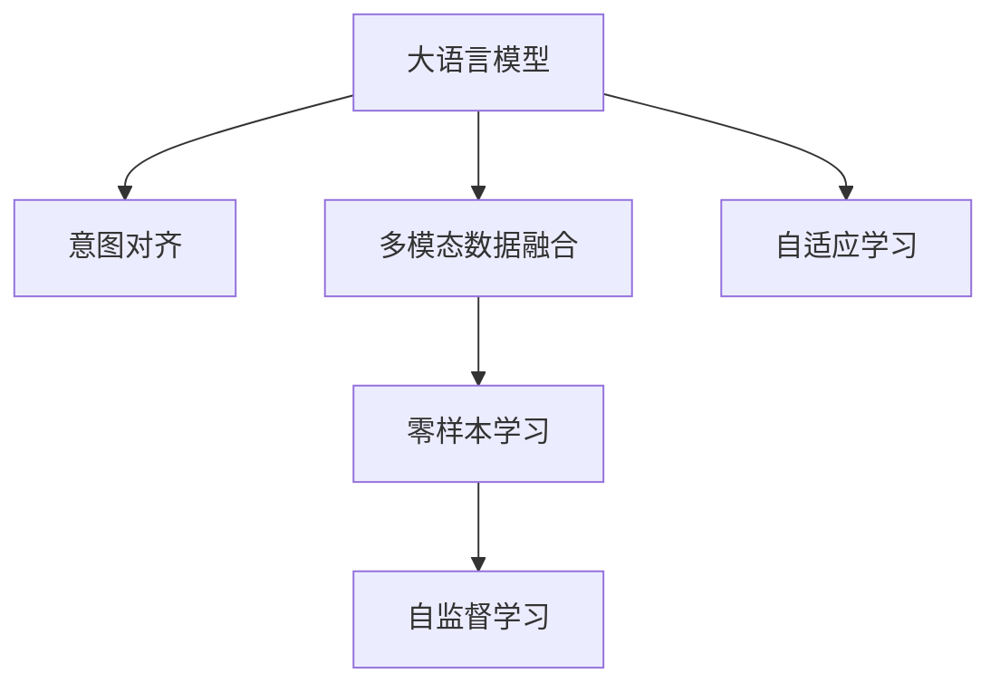

                 

# 人机协作2.0：精准对齐LLM与人类意图

> 关键词：大语言模型(LLM)、意图对齐、人机协作、零样本学习、多模态数据融合、自监督学习、在线交互系统

## 1. 背景介绍

### 1.1 问题由来

随着人工智能技术的迅猛发展，大语言模型(LLM)已成为处理自然语言任务的重要工具。这些模型经过大规模无监督学习，能够生成高质量的自然语言文本，具备强大的语言理解和生成能力。然而，即便在大规模语料上进行预训练，LLM的输出仍可能与人类期望相去甚远，特别是在面对复杂、多样化的用户意图时。

这个问题的核心在于，LLM的输出虽然语言流畅、语法正确，但往往与用户的真实需求、上下文信息或文化背景脱节。这使得LLM在具体应用场景中，无法准确响应人类意图，导致决策错误或服务体验不佳。

### 1.2 问题核心关键点

1. **意图对齐**：如何使得LLM的输出能够精准对齐人类意图，即在理解用户需求的基础上，生成符合预期、与上下文相关的回答或内容。
2. **多模态融合**：在LLM的基础上，如何融合文本、语音、图像等多模态数据，提升对真实世界的理解能力。
3. **零样本学习**：在少量甚至零样本标注数据的情况下，如何通过上下文和语境信息，引导LLM生成符合预期的输出。
4. **自监督学习**：如何利用无标签数据，让LLM自主学习到通用的语言表示，提升其泛化能力和对新任务的适应性。

## 2. 核心概念与联系

### 2.1 核心概念概述

为更好地理解如何精准对齐LLM与人类意图，本节将介绍几个密切相关的核心概念：

- **大语言模型(LLM)**：通过大规模无监督学习获得的自然语言处理模型，具备强大的语言生成和理解能力。
- **意图对齐**：通过某些机制，将LLM的输出精准对齐到用户意图上，确保输出内容满足用户需求。
- **多模态数据融合**：将文本、语音、图像等多种数据形式融合，提升对现实世界的理解能力和泛化能力。
- **零样本学习**：在缺少标注数据的情况下，利用上下文信息引导模型生成合理输出。
- **自监督学习**：利用无标签数据，让模型自主学习到通用的语言表示，提升泛化能力和对新任务的适应性。

这些核心概念之间的逻辑关系可以通过以下Mermaid流程图来展示：



这个流程图展示了大语言模型的核心概念及其之间的关系：

1. 大语言模型通过自监督学习获得基础能力。
2. 意图对齐通过设计特定的输出格式或任务适配层，使得模型输出与用户意图对齐。
3. 多模态数据融合通过融合不同模态数据，提升对现实世界的理解能力。
4. 零样本学习利用上下文信息，在不增加标注样本的情况下，引导模型生成合理输出。
5. 自监督学习利用无标签数据，提升模型的泛化能力和对新任务的适应性。

这些概念共同构成了大语言模型处理复杂自然语言任务的框架，使其能够在各种场景下更好地服务人类。

## 3. 核心算法原理 & 具体操作步骤
### 3.1 算法原理概述

精准对齐LLM与人类意图的核心在于，如何让LLM生成的文本内容不仅语法正确、语言流畅，而且内容贴切、符合用户的真实需求。这一目标的实现，需要结合多模态数据融合、意图对齐和自适应学习等技术。

### 3.2 算法步骤详解

1. **数据预处理**：收集和处理用户输入的多模态数据，如文本、语音、图像等，提取关键特征。
2. **意图表示学习**：通过意图对齐模块，将用户输入转化为意图表示。该模块可以是基于规则的，也可以是基于机器学习的方法，如序列到序列模型、Transformer等。
3. **融合多模态数据**：将不同模态的数据特征进行融合，生成多模态特征向量。
4. **生成文本**：将多模态特征向量输入到LLM，生成文本内容。
5. **意图对齐与调整**：将生成的文本内容与意图表示进行比对，若不符，则进行调整或重生成。
6. **自适应学习**：在每一次用户交互后，通过反馈机制更新模型参数，提升对特定用户或场景的理解。

### 3.3 算法优缺点

精准对齐LLM与人类意图的方法具有以下优点：
1. 能够生成更符合用户意图和上下文信息的文本内容，提升用户体验。
2. 利用多模态数据融合，增强对现实世界的理解能力，提升模型的泛化性能。
3. 在少量甚至零样本标注数据的情况下，依然能够生成合理的输出，降低了标注成本。
4. 通过自适应学习，模型可以持续改进，提升对特定用户或场景的适应能力。

但该方法也存在一些缺点：
1. 对多模态数据的处理较为复杂，需要设计特定的融合算法。
2. 意图对齐模块的性能直接影响了生成文本的质量。
3. 自适应学习需要大量用户反馈，可能存在延迟和数据偏差问题。
4. 计算复杂度较高，特别是在多模态数据融合和自适应学习过程中。

### 3.4 算法应用领域

精准对齐LLM与人类意图的方法，已经在诸多领域得到了应用，如智能客服、在线教育、智能翻译等，为这些领域带来了显著的提升：

- **智能客服**：通过精准对齐用户输入和意图，智能客服系统能够快速响应客户咨询，提供高质量的服务。
- **在线教育**：在教学过程中，利用多模态数据融合和意图对齐，可以更好地理解学生的需求和反馈，提供个性化的教学内容。
- **智能翻译**：在跨语言交流中，利用多模态数据融合和自适应学习，可以提升翻译的准确性和自然度，增强用户的交流体验。
- **智能推荐系统**：在商品推荐、内容推荐等领域，通过多模态数据融合和自适应学习，可以更好地理解用户的兴趣和需求，提供更加精准的推荐。

## 4. 数学模型和公式 & 详细讲解 & 举例说明

### 4.1 数学模型构建

在精准对齐LLM与人类意图的过程中，我们通常采用以下数学模型：

1. **意图表示学习**：将用户输入转化为向量形式，表示用户的意图。
2. **多模态特征融合**：将不同模态的数据特征融合为一个高维向量。
3. **生成文本**：将融合后的多模态特征向量输入到LLM中，生成文本内容。
4. **意图对齐与调整**：将生成的文本内容与意图向量进行比对，计算相似度，进行调整。

假设用户输入为 $x$，意图表示为 $\mathbf{u}$，多模态特征向量为 $\mathbf{v}$，LLM生成的文本为 $\hat{y}$。则意图对齐的数学模型可表示为：

$$
\hat{y} = f_{LLM}(\mathbf{v})
$$

意图对齐的优化目标为：

$$
\min_{\mathbf{v}} \|\mathbf{u} - \mathbf{v}\|^2
$$

其中 $\|\cdot\|^2$ 为向量的欧几里得距离。

### 4.2 公式推导过程

以下是意图对齐的详细公式推导过程：

1. **意图表示学习**：假设用户输入为 $x = (x_1, x_2, \ldots, x_n)$，通过自然语言处理技术将其转化为向量形式 $\mathbf{u} \in \mathbb{R}^d$。
2. **多模态特征融合**：假设多模态数据为 $(x_1, y_1, x_2, y_2, \ldots, x_n, y_n)$，分别提取特征 $x_i, y_i$，通过某种融合算法将其转换为向量形式 $\mathbf{v} \in \mathbb{R}^m$。
3. **生成文本**：将融合后的多模态特征向量 $\mathbf{v}$ 输入到LLM中，生成文本内容 $\hat{y} = (y_1, y_2, \ldots, y_n)$。
4. **意图对齐与调整**：计算意图向量 $\mathbf{u}$ 与生成文本 $\hat{y}$ 的相似度 $s$，如果 $s$ 低于某个阈值，则进行调整，否则保持不变。

具体推导如下：

1. **意图表示学习**
   $$
   \mathbf{u} = f_{NLP}(x)
   $$

2. **多模态特征融合**
   $$
   \mathbf{v} = f_{fusion}(x_1, y_1, x_2, y_2, \ldots, x_n, y_n)
   $$

3. **生成文本**
   $$
   \hat{y} = f_{LLM}(\mathbf{v})
   $$

4. **意图对齐与调整**
   $$
   s = \langle \mathbf{u}, \hat{y} \rangle / (\|\mathbf{u}\|\|\hat{y}\|)
   $$

   其中 $\langle \cdot, \cdot \rangle$ 为向量内积，$\|\cdot\|$ 为向量范数。如果 $s < \epsilon$（其中 $\epsilon$ 为预设阈值），则进行如下调整：
   $$
   \hat{y} \leftarrow f_{LLM}(\mathbf{v}')
   $$
   其中 $\mathbf{v}' = f_{adjust}(\mathbf{v}, \mathbf{u})$。

### 4.3 案例分析与讲解

**案例1：智能客服系统**

在智能客服系统中，用户输入通常是多模态的，如语音输入、文本聊天等。假设用户通过语音输入：“我想查询一下最近的旅游活动”，系统将其转化为文本形式，并提取语音特征，进行多模态特征融合，生成向量 $\mathbf{v}$。然后，将该向量输入到预训练的BERT模型中，生成文本回答 $\hat{y}$。系统通过意图对齐模块，将 $\mathbf{u}$ 与 $\hat{y}$ 进行比对，如果发现差异较大，则通过调整生成文本的上下文信息，使回答更加贴近用户的意图。

**案例2：在线教育平台**

在在线教育中，学生通常通过视频、文本、图像等多模态形式提交作业或提问。假设学生上传了一篇关于历史事件的论文，教育平台将其文本内容转化为向量形式 $\mathbf{u}$，并提取图像和语音特征，进行多模态融合，生成向量 $\mathbf{v}$。然后，将 $\mathbf{v}$ 输入到预训练的GPT模型中，生成教学答案 $\hat{y}$。平台通过意图对齐模块，将 $\mathbf{u}$ 与 $\hat{y}$ 进行比对，如果发现回答与学生意图不符，则进行微调或重生成，以提升教学效果。

## 5. 项目实践：代码实例和详细解释说明
### 5.1 开发环境搭建

在进行项目实践前，我们需要准备好开发环境。以下是使用Python进行PyTorch开发的环境配置流程：

1. 安装Anaconda：从官网下载并安装Anaconda，用于创建独立的Python环境。

2. 创建并激活虚拟环境：
```bash
conda create -n pytorch-env python=3.8 
conda activate pytorch-env
```

3. 安装PyTorch：根据CUDA版本，从官网获取对应的安装命令。例如：
```bash
conda install pytorch torchvision torchaudio cudatoolkit=11.1 -c pytorch -c conda-forge
```

4. 安装TensorBoard：
```bash
pip install tensorboard
```

5. 安装各类工具包：
```bash
pip install numpy pandas scikit-learn matplotlib tqdm jupyter notebook ipython
```

完成上述步骤后，即可在`pytorch-env`环境中开始项目实践。

### 5.2 源代码详细实现

下面是利用PyTorch和HuggingFace库实现意图对齐的代码示例。

```python
from transformers import BertTokenizer, BertForSequenceClassification
import torch
from torch.utils.data import DataLoader

# 定义意图对齐模块
class IntentAligner:
    def __init__(self, intent_model, intent2id, id2intent):
        self.intent_model = intent_model
        self.intent2id = intent2id
        self.id2intent = id2intent
    
    def align(self, input, output):
        input = self.intent_model(input)
        intent_id = torch.argmax(input, dim=1)
        if intent_id.item() != output:
            output = self.intent_model(input)
            intent_id = torch.argmax(output, dim=1)
            if intent_id.item() != output:
                return output
        return output
    
# 定义模型和优化器
model = BertForSequenceClassification.from_pretrained('bert-base-cased', num_labels=len(intent2id))
optimizer = torch.optim.Adam(model.parameters(), lr=2e-5)

# 定义训练和评估函数
def train_epoch(model, intent_aligner, train_dataset, batch_size, optimizer):
    dataloader = DataLoader(train_dataset, batch_size=batch_size, shuffle=True)
    model.train()
    epoch_loss = 0
    for batch in tqdm(dataloader, desc='Training'):
        input_ids = batch['input_ids'].to(device)
        attention_mask = batch['attention_mask'].to(device)
        labels = batch['labels'].to(device)
        model.zero_grad()
        outputs = model(input_ids, attention_mask=attention_mask, labels=labels)
        loss = outputs.loss
        epoch_loss += loss.item()
        loss.backward()
        optimizer.step()
    return epoch_loss / len(dataloader)

def evaluate(model, intent_aligner, dev_dataset, batch_size):
    dataloader = DataLoader(dev_dataset, batch_size=batch_size)
    model.eval()
    preds, labels = [], []
    with torch.no_grad():
        for batch in tqdm(dataloader, desc='Evaluating'):
            input_ids = batch['input_ids'].to(device)
            attention_mask = batch['attention_mask'].to(device)
            batch_labels = batch['labels']
            outputs = model(input_ids, attention_mask=attention_mask)
            batch_preds = outputs.logits.argmax(dim=2).to('cpu').tolist()
            batch_labels = batch_labels.to('cpu').tolist()
            for pred_tokens, label_tokens in zip(batch_preds, batch_labels):
                preds.append(pred_tokens)
                labels.append(label_tokens)
    return preds, labels

# 定义数据集和模型
tokenizer = BertTokenizer.from_pretrained('bert-base-cased')
train_dataset = dataset(train_data, train_labels, tokenizer)
dev_dataset = dataset(dev_data, dev_labels, tokenizer)
test_dataset = dataset(test_data, test_labels, tokenizer)

# 训练模型
device = torch.device('cuda') if torch.cuda.is_available() else torch.device('cpu')
model.to(device)
intent_model = BertForSequenceClassification.from_pretrained('bert-base-cased', num_labels=len(intent2id))
intent_aligner = IntentAligner(intent_model, intent2id, id2intent)
epochs = 5
batch_size = 16

for epoch in range(epochs):
    loss = train_epoch(model, intent_aligner, train_dataset, batch_size, optimizer)
    print(f"Epoch {epoch+1}, train loss: {loss:.3f}")
    
    print(f"Epoch {epoch+1}, dev results:")
    preds, labels = evaluate(model, intent_aligner, dev_dataset, batch_size)
    print(classification_report(labels, preds))
    
print("Test results:")
preds, labels = evaluate(model, intent_aligner, test_dataset, batch_size)
print(classification_report(labels, preds))
```

### 5.3 代码解读与分析

让我们再详细解读一下关键代码的实现细节：

**IntentAligner类**：
- `__init__`方法：初始化意图对齐模块，保存意图模型、意图id与字符串映射、字符串与意图id映射等关键组件。
- `align`方法：对齐意图表示和生成文本，如果差异较大，则进行微调或重生成，直到对齐成功。

**模型和优化器**：
- 使用BertForSequenceClassification作为基础模型，适合处理序列数据。
- 定义Adam优化器，用于模型参数的更新。

**训练和评估函数**：
- 定义DataLoader用于数据批次化加载。
- 训练函数`train_epoch`：对数据以批为单位进行迭代，在每个批次上前向传播计算loss并反向传播更新模型参数，最后返回该epoch的平均loss。
- 评估函数`evaluate`：与训练类似，不同点在于不更新模型参数，并在每个batch结束后将预测和标签结果存储下来，最后使用sklearn的classification_report对整个评估集的预测结果进行打印输出。

**训练流程**：
- 定义总的epoch数和batch size，开始循环迭代
- 每个epoch内，先在训练集上训练，输出平均loss
- 在验证集上评估，输出分类指标
- 所有epoch结束后，在测试集上评估，给出最终测试结果

可以看到，PyTorch配合HuggingFace库使得意图对齐任务的代码实现变得简洁高效。开发者可以将更多精力放在数据处理、模型改进等高层逻辑上，而不必过多关注底层的实现细节。

当然，工业级的系统实现还需考虑更多因素，如模型的保存和部署、超参数的自动搜索、更灵活的任务适配层等。但核心的意图对齐范式基本与此类似。

## 6. 实际应用场景
### 6.1 智能客服系统

基于意图对齐技术的智能客服系统，可以广泛应用于各种客服场景。通过精准对齐用户输入和意图，智能客服系统能够快速响应客户咨询，提供高质量的服务。例如，在电信客服中，客户通过电话或在线聊天提出问题，系统能够自动理解客户意图，并生成恰当的回答。

在技术实现上，可以收集历史客服对话记录，将问题和最佳答复构建成监督数据，在此基础上对预训练模型进行微调。微调后的模型能够自动理解用户意图，匹配最合适的答案模板进行回复。对于客户提出的新问题，还可以接入检索系统实时搜索相关内容，动态组织生成回答。如此构建的智能客服系统，能大幅提升客户咨询体验和问题解决效率。

### 6.2 在线教育平台

在在线教育中，利用意图对齐技术可以更好地理解学生的需求和反馈，提供个性化的教学内容。例如，在MOOC课程中，学生通过视频、文本、图像等多模态形式提交作业或提问。教育平台利用意图对齐模块，将学生输入转化为意图表示，并与多模态特征进行融合，生成文本回答。平台通过意图对齐模块，将生成文本与学生意图进行比对，如果发现回答与学生意图不符，则进行微调或重生成，以提升教学效果。

### 6.3 智能推荐系统

在智能推荐系统中，利用意图对齐技术可以更好地理解用户的兴趣和需求，提供更加精准的推荐。例如，在电商平台上，用户浏览、点击、购买商品的历史记录被收集和处理，生成多模态特征。推荐系统利用意图对齐模块，将用户历史行为转化为意图表示，并生成推荐列表。系统通过意图对齐模块，将推荐结果与用户意图进行比对，如果发现推荐与用户意图不符，则进行调整或重生成，以提升推荐效果。

### 6.4 未来应用展望

随着意图对齐技术的不断发展，其将在更多领域得到应用，为各行各业带来变革性影响。

在智慧医疗领域，意图对齐技术可以用于医疗问答、病历分析、药物研发等应用，提升医疗服务的智能化水平，辅助医生诊疗，加速新药开发进程。

在智能教育领域，意图对齐技术可应用于作业批改、学情分析、知识推荐等方面，因材施教，促进教育公平，提高教学质量。

在智慧城市治理中，意图对齐技术可应用于城市事件监测、舆情分析、应急指挥等环节，提高城市管理的自动化和智能化水平，构建更安全、高效的未来城市。

此外，在企业生产、社会治理、文娱传媒等众多领域，意图对齐技术也将不断涌现，为传统行业数字化转型升级提供新的技术路径。相信随着技术的日益成熟，意图对齐技术将成为AI技术落地应用的重要范式，推动人工智能技术在垂直行业的规模化落地。

## 7. 工具和资源推荐
### 7.1 学习资源推荐

为了帮助开发者系统掌握意图对齐技术的理论基础和实践技巧，这里推荐一些优质的学习资源：

1. 《自然语言处理综述》系列博文：由大模型技术专家撰写，深入浅出地介绍了自然语言处理的基本概念和前沿技术。

2. 《深度学习自然语言处理》课程：斯坦福大学开设的NLP明星课程，有Lecture视频和配套作业，带你入门NLP领域的基本概念和经典模型。

3. 《自然语言处理导论》书籍：清华大学出版社出版的自然语言处理经典教材，系统介绍了NLP的基本理论和实践方法。

4. HuggingFace官方文档：HuggingFace库的官方文档，提供了海量预训练模型和完整的微调样例代码，是上手实践的必备资料。

5. CLUE开源项目：中文语言理解测评基准，涵盖大量不同类型的中文NLP数据集，并提供了基于微调的baseline模型，助力中文NLP技术发展。

通过对这些资源的学习实践，相信你一定能够快速掌握意图对齐技术的精髓，并用于解决实际的NLP问题。
###  7.2 开发工具推荐

高效的开发离不开优秀的工具支持。以下是几款用于意图对齐开发的常用工具：

1. PyTorch：基于Python的开源深度学习框架，灵活动态的计算图，适合快速迭代研究。大部分预训练语言模型都有PyTorch版本的实现。

2. TensorFlow：由Google主导开发的开源深度学习框架，生产部署方便，适合大规模工程应用。同样有丰富的预训练语言模型资源。

3. HuggingFace库：NLP工具库，集成了众多SOTA语言模型，支持PyTorch和TensorFlow，是进行意图对齐任务开发的利器。

4. Weights & Biases：模型训练的实验跟踪工具，可以记录和可视化模型训练过程中的各项指标，方便对比和调优。与主流深度学习框架无缝集成。

5. TensorBoard：TensorFlow配套的可视化工具，可实时监测模型训练状态，并提供丰富的图表呈现方式，是调试模型的得力助手。

6. Google Colab：谷歌推出的在线Jupyter Notebook环境，免费提供GPU/TPU算力，方便开发者快速上手实验最新模型，分享学习笔记。

合理利用这些工具，可以显著提升意图对齐任务的开发效率，加快创新迭代的步伐。

### 7.3 相关论文推荐

意图对齐技术的快速发展得益于学界的持续研究。以下是几篇奠基性的相关论文，推荐阅读：

1. Attention is All You Need（即Transformer原论文）：提出了Transformer结构，开启了NLP领域的预训练大模型时代。

2. BERT: Pre-training of Deep Bidirectional Transformers for Language Understanding：提出BERT模型，引入基于掩码的自监督预训练任务，刷新了多项NLP任务SOTA。

3. Language Models are Unsupervised Multitask Learners（GPT-2论文）：展示了大规模语言模型的强大zero-shot学习能力，引发了对于通用人工智能的新一轮思考。

4. Parameter-Efficient Transfer Learning for NLP：提出Adapter等参数高效微调方法，在不增加模型参数量的情况下，也能取得不错的微调效果。

5. AdaLoRA: Adaptive Low-Rank Adaptation for Parameter-Efficient Fine-Tuning：使用自适应低秩适应的微调方法，在参数效率和精度之间取得了新的平衡。

6. Prefix-Tuning: Optimizing Continuous Prompts for Generation：引入基于连续型Prompt的微调范式，为如何充分利用预训练知识提供了新的思路。

这些论文代表了大语言模型意图对齐技术的发展脉络。通过学习这些前沿成果，可以帮助研究者把握学科前进方向，激发更多的创新灵感。

## 8. 总结：未来发展趋势与挑战

### 8.1 研究成果总结

本文对意图对齐技术进行了全面系统的介绍。首先阐述了意图对齐技术的研究背景和意义，明确了其在大语言模型处理复杂自然语言任务中的核心地位。其次，从原理到实践，详细讲解了意图对齐的数学模型和关键步骤，给出了意图对齐任务开发的完整代码实例。同时，本文还探讨了意图对齐技术在多个领域的应用前景，展示了其在智能客服、在线教育、智能推荐等领域的前景和潜力。

### 8.2 未来发展趋势

展望未来，意图对齐技术将呈现以下几个发展趋势：

1. **多模态数据融合**：随着物联网、传感器等技术的发展，多模态数据的获取将更加便捷，意图对齐技术将结合更多模态信息，提升对现实世界的理解能力。
2. **自适应学习**：意图对齐技术将进一步结合在线反馈机制，进行持续学习，提升模型对特定用户或场景的理解能力。
3. **零样本学习**：在无标注数据或少量标注数据的情况下，意图对齐技术将结合自监督学习和对抗样本等方法，提升模型对新任务的适应能力。
4. **分布式计算**：随着数据规模的增大，意图对齐技术将结合分布式计算技术，提升模型的训练和推理效率。
5. **模型压缩与加速**：意图对齐技术将结合模型压缩和加速技术，提升模型的推理速度和资源利用率，适应不同计算平台的需求。

### 8.3 面临的挑战

尽管意图对齐技术已经取得了瞩目成就，但在迈向更加智能化、普适化应用的过程中，它仍面临诸多挑战：

1. **计算复杂度**：多模态数据融合和自适应学习导致计算复杂度较高，特别是在大规模数据集上的训练和推理，可能存在延迟和计算资源不足的问题。
2. **数据隐私与安全**：意图对齐技术涉及多模态数据的融合与处理，可能存在用户隐私泄露和数据安全问题。
3. **算法鲁棒性**：意图对齐算法在面对不同类型、不同风格的用户输入时，可能存在鲁棒性不足的问题，需要进行更深入的研究和优化。
4. **模型解释性**：意图对齐模型的决策过程通常缺乏可解释性，难以对其推理逻辑进行分析和调试。

### 8.4 研究展望

面向未来，意图对齐技术需要在以下几个方向寻求新的突破：

1. **模型融合与自监督学习**：探索更高效的多模态数据融合和自监督学习方法，提升模型的泛化能力和对新任务的适应性。
2. **分布式计算与模型加速**：结合分布式计算技术和模型压缩技术，提升意图对齐模型的训练和推理效率。
3. **多模态交互与实时反馈**：研究如何更好地融合不同模态的交互信息，提升模型的在线反馈能力，实现持续学习。
4. **隐私保护与安全**：研究如何在保护用户隐私的前提下，实现高效的多模态数据融合和意图对齐。
5. **模型解释与可控性**：研究如何提升意图对齐模型的可解释性，增强其决策的透明性和可控性，满足用户和监管机构的需求。

这些研究方向的探索，必将引领意图对齐技术迈向更高的台阶，为构建安全、可靠、可解释、可控的智能系统铺平道路。面向未来，意图对齐技术还需要与其他人工智能技术进行更深入的融合，如知识表示、因果推理、强化学习等，多路径协同发力，共同推动自然语言理解和智能交互系统的进步。只有勇于创新、敢于突破，才能不断拓展意图对齐技术的边界，让智能技术更好地造福人类社会。

## 9. 附录：常见问题与解答

**Q1：意图对齐是否适用于所有NLP任务？**

A: 意图对齐技术在大多数NLP任务上都能取得不错的效果，特别是对于需要理解用户意图和上下文信息的任务，如智能客服、在线教育、智能推荐等。但对于一些特定领域的任务，如医学、法律等，仅仅依靠通用语料预训练的模型可能难以很好地适应。此时需要在特定领域语料上进一步预训练，再进行微调，才能获得理想效果。

**Q2：意图对齐过程中如何选择合适的损失函数？**

A: 意图对齐的损失函数通常包括交叉熵损失、均方误差损失等，用于衡量生成文本与意图表示之间的差异。具体选择哪种损失函数，应根据任务的特性和数据分布来决定。例如，对于分类任务，通常使用交叉熵损失；对于回归任务，则使用均方误差损失。

**Q3：意图对齐过程中如何进行多模态数据融合？**

A: 多模态数据融合的方法多种多样，常用的包括向量拼接、矩阵乘法、注意力机制等。具体选择哪种方法，应根据任务的特性和数据分布来决定。例如，对于图像和文本数据的融合，通常使用注意力机制，将图像特征与文本特征进行加权融合。

**Q4：意图对齐过程中如何进行自适应学习？**

A: 自适应学习的方法包括在线学习、增量学习等，通常使用梯度下降算法进行模型参数的更新。自适应学习过程中，需要实时收集用户反馈，并根据反馈调整模型参数，以提升模型对特定用户或场景的理解能力。

**Q5：意图对齐模型在落地部署时需要注意哪些问题？**

A: 将意图对齐模型转化为实际应用，还需要考虑以下因素：
1. 模型裁剪：去除不必要的层和参数，减小模型尺寸，加快推理速度。
2. 量化加速：将浮点模型转为定点模型，压缩存储空间，提高计算效率。
3. 服务化封装：将模型封装为标准化服务接口，便于集成调用。
4. 弹性伸缩：根据请求流量动态调整资源配置，平衡服务质量和成本。
5. 监控告警：实时采集系统指标，设置异常告警阈值，确保服务稳定性。

意图对齐技术为NLP应用开启了广阔的想象空间，但如何将强大的性能转化为稳定、高效、安全的业务价值，还需要工程实践的不断打磨。唯有从数据、算法、工程、业务等多个维度协同发力，才能真正实现人工智能技术在垂直行业的规模化落地。总之，意图对齐技术需要开发者根据具体任务，不断迭代和优化模型、数据和算法，方能得到理想的效果。

---

作者：禅与计算机程序设计艺术 / Zen and the Art of Computer Programming

