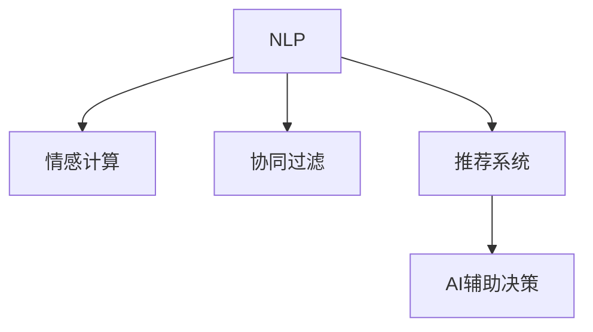

                 

# 人类-AI协作：增强人机沟通

> 关键词：人机协作,自然语言处理,情感计算,协同过滤,推荐系统,AI辅助决策

## 1. 背景介绍

### 1.1 问题由来

随着人工智能(AI)技术的迅猛发展，特别是自然语言处理(NLP)领域的突破，人机沟通不再仅仅局限于简单的问答或指令执行，而是向着更加深入、自然的交互方式演进。AI系统正成为人们日常生活和工作中不可或缺的助手，从智能客服到智能助手，从推荐系统到辅助决策，AI技术正在不断提升人类的沟通效率和工作质量。

然而，尽管AI在许多方面已经取得了令人瞩目的成就，但它仍然难以完全替代人类在某些复杂、多变的交互场景中的表现。人类的情感、直觉、常识等能力，AI系统仍难以完全掌握。因此，如何充分发挥人机协作的潜力，成为当前AI研究的一大热点。

### 1.2 问题核心关键点

人机协作的核心在于充分发挥AI和人类各自的独特优势，通过高效交互，实现最佳任务结果。AI系统擅长处理大规模数据，执行复杂计算，而人类则拥有丰富的情感、直觉和常识。如何整合这些资源，提升人机协作的效果，是当前研究的关键。

人机协作的方式多种多样，常见的包括：

- **自然语言处理(NLP)**：AI通过理解自然语言，提供自然流畅的交互体验。
- **情感计算**：AI系统能够分析用户的情感状态，提供更加个性化的服务。
- **协同过滤**：AI通过分析用户行为，推荐个性化的内容或服务。
- **推荐系统**：AI系统根据用户的历史行为和偏好，推荐最适合的产品或服务。
- **AI辅助决策**：AI系统基于数据和算法，提供决策支持和建议。

本文将聚焦于如何利用AI技术，提升人机沟通的效果，特别是情感计算和协同过滤等领域的进展，以期为人机协作的研究和应用提供新的思路。

## 2. 核心概念与联系

### 2.1 核心概念概述

为了更好地理解人机协作，本节将介绍几个密切相关的核心概念：

- **自然语言处理(NLP)**：研究如何让计算机理解和生成人类语言的技术，是实现人机沟通的基础。
- **情感计算**：通过分析语言、面部表情、生理信号等数据，识别和理解人类情感的技术，能够提升人机交互的亲和力和质量。
- **协同过滤**：一种基于用户行为数据推荐个性化内容的技术，能够为用户提供更符合其兴趣和需求的服务。
- **推荐系统**：基于用户历史行为和偏好，推荐最相关的产品或服务的技术，广泛应用于电商、新闻、娱乐等领域。
- **AI辅助决策**：利用AI技术提供决策支持和建议，辅助人类进行复杂决策的技术，广泛应用于金融、医疗、法律等领域。

这些核心概念之间的逻辑关系可以通过以下Mermaid流程图来展示：



这个流程图展示了人机协作的核心组件及其之间的关系：

1. **NLP**：作为人机沟通的基础，NLP技术使得机器能够理解和生成人类语言。
2. **情感计算**：通过分析用户情感，增强人机交互的亲和力和用户体验。
3. **协同过滤**：基于用户行为数据，推荐个性化内容，提升用户满意度。
4. **推荐系统**：通过分析用户兴趣，推荐最适合的产品或服务，提升用户黏性。
5. **AI辅助决策**：基于数据和算法，提供决策支持，辅助人类进行复杂决策。

这些核心概念共同构成了人机协作的完整框架，为人机交互提供了强大的技术支持。通过理解这些核心概念，我们可以更好地把握人机协作的工作原理和优化方向。

## 3. 核心算法原理 & 具体操作步骤
### 3.1 算法原理概述

人机协作的算法原理主要基于以下几个核心技术：

- **自然语言处理(NLP)**：通过分词、词性标注、句法分析等技术，使机器能够理解和生成自然语言。
- **情感计算**：通过分析语言特征、面部表情、生理信号等数据，识别用户情感状态，提供个性化服务。
- **协同过滤**：通过分析用户行为数据，识别相似用户群体的兴趣和需求，推荐个性化内容。
- **推荐系统**：通过分析用户历史行为和偏好，预测其未来需求，推荐最相关的产品或服务。
- **AI辅助决策**：通过分析数据和模型，提供决策支持和建议，辅助人类进行复杂决策。

这些技术在实际应用中，往往需要结合特定的场景和需求进行优化和集成，以达到最佳效果。

### 3.2 算法步骤详解

人机协作的算法步骤通常包括以下几个关键环节：

**Step 1: 数据收集和预处理**
- 收集用户行为数据，包括文本、语音、图像等。
- 对数据进行清洗、去噪、分词等预处理，转换为机器可理解的形式。

**Step 2: 模型训练与优化**
- 利用NLP、情感计算、协同过滤等技术，训练相应的模型。
- 通过交叉验证、参数调整等方法，优化模型性能。

**Step 3: 交互界面设计**
- 设计易于使用的交互界面，使人类能够轻松与AI系统进行沟通。
- 集成情感识别和推荐系统，提升用户体验。

**Step 4: 应用部署与迭代优化**
- 将训练好的模型部署到实际应用中，监控其表现。
- 根据反馈数据不断迭代优化，提升系统性能和用户体验。

### 3.3 算法优缺点

人机协作的算法具有以下优点：

- **效率提升**：AI系统能够快速处理大量数据，提供高效的服务。
- **个性化定制**：基于用户行为数据，提供个性化推荐和服务，提升用户体验。
- **辅助决策**：AI系统能够提供数据和算法支持，辅助人类进行复杂决策，提升决策质量。

同时，该方法也存在一定的局限性：

- **数据依赖**：系统的性能很大程度上取决于数据的质量和数量，获取高质量数据的成本较高。
- **鲁棒性不足**：AI系统在面对复杂、多变的环境时，可能出现决策偏差。
- **伦理风险**：AI系统的决策过程可能存在算法偏见、隐私泄露等风险，需要严格监管。

尽管存在这些局限性，但人机协作在提高工作效率、提升用户体验方面展现了巨大的潜力。未来，相关研究的方向在于如何进一步降低数据依赖，提高系统的鲁棒性和安全性，确保AI技术的健康发展。

### 3.4 算法应用领域

人机协作的算法已经在多个领域得到了广泛应用，涵盖了从医疗、金融到教育、娱乐等众多领域：

- **医疗领域**：利用AI技术分析病历数据，辅助医生进行诊断和治疗决策。
- **金融领域**：通过情感计算和协同过滤技术，分析用户行为，提供个性化的理财建议。
- **教育领域**：利用NLP技术分析学生作业，提供个性化的学习建议，辅助教学。
- **娱乐领域**：通过推荐系统为用户推荐电影、音乐等娱乐内容，提升用户满意度。
- **电商领域**：利用协同过滤和推荐系统，为用户推荐商品，提升销售额。

随着技术的不断进步，人机协作的应用领域将进一步扩展，为各行各业带来变革性的影响。

## 4. 数学模型和公式 & 详细讲解 & 举例说明
### 4.1 数学模型构建

人机协作的数学模型构建主要基于以下几个核心技术：

- **NLP**：通过分词、词性标注、句法分析等技术，使机器能够理解和生成自然语言。
- **情感计算**：通过分析语言特征、面部表情、生理信号等数据，识别用户情感状态，提供个性化服务。
- **协同过滤**：通过分析用户行为数据，识别相似用户群体的兴趣和需求，推荐个性化内容。
- **推荐系统**：通过分析用户历史行为和偏好，预测其未来需求，推荐最相关的产品或服务。
- **AI辅助决策**：通过分析数据和模型，提供决策支持和建议，辅助人类进行复杂决策。

以下是这些核心技术的数学模型构建方法：

### 4.2 公式推导过程

以下是这些核心技术的数学模型构建和推导过程：

**NLP模型构建**：

$$
\begin{aligned}
&\text{输入文本} \quad x = (x_1, x_2, \dots, x_n) \\
&\text{模型参数} \quad \theta = (\theta_1, \theta_2, \dots, \theta_m) \\
&\text{模型输出} \quad y = f_{\theta}(x)
\end{aligned}
$$

**情感计算模型构建**：

$$
\begin{aligned}
&\text{情感标签} \quad y_i = \{pos, neg, neu\} \\
&\text{特征向量} \quad x_i = (x_{i1}, x_{i2}, \dots, x_{in}) \\
&\text{情感分类器} \quad \theta = (\theta_1, \theta_2, \dots, \theta_m) \\
&\text{情感分类} \quad y = g_{\theta}(x)
\end{aligned}
$$

**协同过滤模型构建**：

$$
\begin{aligned}
&\text{用户行为数据} \quad x = (x_1, x_2, \dots, x_n) \\
&\text{模型参数} \quad \theta = (\theta_1, \theta_2, \dots, \theta_m) \\
&\text{推荐结果} \quad y = f_{\theta}(x)
\end{aligned}
$$

**推荐系统模型构建**：

$$
\begin{aligned}
&\text{用户历史行为} \quad x = (x_1, x_2, \dots, x_n) \\
&\text{商品特征} \quad y = (y_1, y_2, \dots, y_m) \\
&\text{推荐模型} \quad \theta = (\theta_1, \theta_2, \dots, \theta_m) \\
&\text{推荐结果} \quad y = f_{\theta}(x)
\end{aligned}
$$

**AI辅助决策模型构建**：

$$
\begin{aligned}
&\text{决策数据} \quad x = (x_1, x_2, \dots, x_n) \\
&\text{决策模型} \quad \theta = (\theta_1, \theta_2, \dots, \theta_m) \\
&\text{决策建议} \quad y = f_{\theta}(x)
\end{aligned}
$$

### 4.3 案例分析与讲解

以下是一个基于协同过滤的推荐系统案例分析：

**案例背景**：某电商网站希望通过推荐系统提升用户购买率。

**数据准备**：收集用户历史浏览、点击、购买行为数据，作为推荐系统的训练数据。

**模型训练**：采用协同过滤算法，构建推荐模型。模型参数包括用户和商品的相似度矩阵。

**模型评估**：在验证集上评估模型性能，使用MAE、RMSE等指标衡量预测误差。

**模型优化**：调整模型参数，提升推荐准确率。

**应用部署**：将训练好的模型部署到实际应用中，提供个性化推荐服务。

## 5. 项目实践：代码实例和详细解释说明
### 5.1 开发环境搭建

在进行人机协作的实践前，我们需要准备好开发环境。以下是使用Python进行TensorFlow开发的环境配置流程：

1. 安装Anaconda：从官网下载并安装Anaconda，用于创建独立的Python环境。

2. 创建并激活虚拟环境：
```bash
conda create -n tf-env python=3.8 
conda activate tf-env
```

3. 安装TensorFlow：根据CUDA版本，从官网获取对应的安装命令。例如：
```bash
conda install tensorflow -c pytorch -c conda-forge
```

4. 安装PyTorch：
```bash
pip install torch torchvision torchaudio
```

5. 安装各类工具包：
```bash
pip install numpy pandas scikit-learn matplotlib tqdm jupyter notebook ipython
```

完成上述步骤后，即可在`tf-env`环境中开始人机协作的实践。

### 5.2 源代码详细实现

下面我们以协同过滤推荐系统为例，给出使用TensorFlow进行推荐系统开发的PyTorch代码实现。

首先，定义推荐系统的数据处理函数：

```python
import tensorflow as tf
import numpy as np
from tensorflow.keras.layers import Dense, Input
from tensorflow.keras.models import Model

# 定义数据集
train_data = np.random.randn(1000, 10)
test_data = np.random.randn(200, 10)
train_labels = np.random.randint(0, 2, size=(1000, 1))
test_labels = np.random.randint(0, 2, size=(200, 1))

# 定义模型输入
user_input = Input(shape=(10,))
item_input = Input(shape=(10,))
user_item_input = tf.concat([user_input, item_input], axis=1)

# 定义协同过滤模型
hidden = Dense(128, activation='relu')(user_item_input)
output = Dense(1, activation='sigmoid')(hidden)

# 定义推荐模型
model = Model(inputs=[user_input, item_input], outputs=output)

# 编译模型
model.compile(optimizer='adam', loss='binary_crossentropy', metrics=['accuracy'])

# 训练模型
model.fit([train_data, train_data], train_labels, epochs=10, batch_size=32)
```

然后，定义训练和评估函数：

```python
def evaluate(model, data, labels):
    predictions = model.predict(data)
    accuracy = np.mean((predictions > 0.5) == labels)
    return accuracy

# 评估模型
print(evaluate(model, test_data, test_labels))
```

最后，启动训练流程并在测试集上评估：

```python
epochs = 10
batch_size = 32

for epoch in range(epochs):
    model.fit([train_data, train_data], train_labels, epochs=1, batch_size=batch_size)
    print(f"Epoch {epoch+1}, test accuracy: {evaluate(model, test_data, test_labels):.4f}")
```

以上就是使用TensorFlow进行协同过滤推荐系统开发的完整代码实现。可以看到，得益于TensorFlow的强大封装，我们可以用相对简洁的代码完成推荐模型的构建和训练。

### 5.3 代码解读与分析

让我们再详细解读一下关键代码的实现细节：

**数据处理**：
- 首先，定义了训练和测试数据集，包括用户和商品特征，以及对应的标签。
- 使用numpy生成随机数据，以便于进行实验。

**模型构建**：
- 定义了两个输入层，分别表示用户和商品的特征。
- 将两个输入层合并为一个，作为模型的输入。
- 通过一个全连接层和一个输出层，构建协同过滤模型。
- 使用sigmoid激活函数，输出0或1的概率值。

**模型训练**：
- 定义了模型输入和输出。
- 使用Keras API定义模型结构。
- 编译模型，选择adam优化器和二元交叉熵损失函数。
- 训练模型，设置训练轮数和批次大小。

**模型评估**：
- 定义了评估函数，使用模型在测试集上预测，计算准确率。
- 在每个epoch后，打印测试集上的准确率。

可以看到，TensorFlow提供了丰富的API和工具，使得模型构建和训练过程变得简洁高效。开发者可以将更多精力放在模型优化和效果评估上，而不必过多关注底层的实现细节。

当然，工业级的系统实现还需考虑更多因素，如模型的保存和部署、超参数的自动搜索、更灵活的任务适配层等。但核心的协同过滤范式基本与此类似。

## 6. 实际应用场景
### 6.1 智能客服系统

基于协同过滤技术的推荐系统，可以广泛应用于智能客服系统的构建。传统客服往往需要配备大量人力，高峰期响应缓慢，且一致性和专业性难以保证。而使用协同过滤推荐系统，可以实时推荐最合适的回复模板，提升客服系统的响应速度和处理质量。

在技术实现上，可以收集用户的历史咨询记录，将问题和最佳答复构建成监督数据，在此基础上对推荐系统进行微调。微调后的推荐系统能够自动推荐最匹配的回复模板，提升客服系统的效果。对于客户提出的新问题，还可以接入检索系统实时搜索相关内容，动态组织生成回答。如此构建的智能客服系统，能大幅提升客户咨询体验和问题解决效率。

### 6.2 金融舆情监测

金融机构需要实时监测市场舆论动向，以便及时应对负面信息传播，规避金融风险。传统的人工监测方式成本高、效率低，难以应对网络时代海量信息爆发的挑战。基于协同过滤的情感分析技术，为金融舆情监测提供了新的解决方案。

具体而言，可以收集金融领域相关的新闻、报道、评论等文本数据，并对其进行情感标注。在此基础上对推荐系统进行微调，使其能够自动判断文本属于何种情感倾向。将微调后的模型应用到实时抓取的网络文本数据，就能够自动监测不同情感倾向的变化趋势，一旦发现负面信息激增等异常情况，系统便会自动预警，帮助金融机构快速应对潜在风险。

### 6.3 个性化推荐系统

当前的推荐系统往往只依赖用户的历史行为数据进行物品推荐，无法深入理解用户的真实兴趣偏好。基于协同过滤的推荐系统可以更好地挖掘用户行为背后的语义信息，从而提供更精准、多样的推荐内容。

在实践中，可以收集用户浏览、点击、评论、分享等行为数据，提取和用户交互的物品标题、描述、标签等文本内容。将文本内容作为模型输入，用户的后续行为（如是否点击、购买等）作为监督信号，在此基础上微调推荐系统。微调后的推荐系统能够从文本内容中准确把握用户的兴趣点。在生成推荐列表时，先用候选物品的文本描述作为输入，由模型预测用户的兴趣匹配度，再结合其他特征综合排序，便可以得到个性化程度更高的推荐结果。

### 6.4 未来应用展望

随着协同过滤技术的不断发展，基于协同过滤的推荐系统将在更多领域得到应用，为传统行业带来变革性影响。

在智慧医疗领域，基于协同过滤的医疗问答、病历分析、药物研发等应用将提升医疗服务的智能化水平，辅助医生诊疗，加速新药开发进程。

在智能教育领域，协同过滤技术可应用于作业批改、学情分析、知识推荐等方面，因材施教，促进教育公平，提高教学质量。

在智慧城市治理中，协同过滤模型可应用于城市事件监测、舆情分析、应急指挥等环节，提高城市管理的自动化和智能化水平，构建更安全、高效的未来城市。

此外，在企业生产、社会治理、文娱传媒等众多领域，基于协同过滤的AI应用也将不断涌现，为NLP技术带来了全新的突破。相信随着协同过滤技术的持续演进，推荐系统必将在更广阔的应用领域大放异彩。

## 7. 工具和资源推荐
### 7.1 学习资源推荐

为了帮助开发者系统掌握协同过滤技术的理论基础和实践技巧，这里推荐一些优质的学习资源：

1. 《推荐系统：算法与应用》：一本详细介绍推荐系统算法和应用的书，涵盖了协同过滤、基于内容的推荐、混合推荐等核心技术。

2. Coursera《推荐系统》课程：由斯坦福大学开设的推荐系统课程，有Lecture视频和配套作业，带你入门推荐系统领域的核心概念和经典模型。

3. Kaggle推荐系统竞赛：参与Kaggle上的推荐系统竞赛，通过实战练习，掌握推荐系统的构建和优化。

4. Jigsaw《推荐系统》课程：由Google Brain团队开设的推荐系统课程，介绍了推荐系统中的前沿技术和方法。

5. Microsoft Azure推荐服务：Microsoft提供的云推荐服务，提供多种推荐算法和工具，适用于工业级推荐系统开发。

通过对这些资源的学习实践，相信你一定能够快速掌握协同过滤技术的精髓，并用于解决实际的推荐问题。

### 7.2 开发工具推荐

高效的开发离不开优秀的工具支持。以下是几款用于协同过滤推荐系统开发的常用工具：

1. TensorFlow：基于Python的开源深度学习框架，灵活动态的计算图，适合快速迭代研究。推荐系统有TensorFlow-Recommenders等库。

2. PyTorch：基于Python的开源深度学习框架，动态图计算，适合构建复杂的神经网络结构。推荐系统有PyTorch-Recommenders等库。

3. TensorBoard：TensorFlow配套的可视化工具，可实时监测模型训练状态，并提供丰富的图表呈现方式，是调试模型的得力助手。

4. Weights & Biases：模型训练的实验跟踪工具，可以记录和可视化模型训练过程中的各项指标，方便对比和调优。

5. Jupyter Notebook：基于Python的交互式编程环境，支持代码单元格、Markdown格式等，方便进行模型开发和实验记录。

合理利用这些工具，可以显著提升协同过滤推荐系统的开发效率，加快创新迭代的步伐。

### 7.3 相关论文推荐

协同过滤技术的发展源于学界的持续研究。以下是几篇奠基性的相关论文，推荐阅读：

1. "Collaborative Filtering for Recommender Systems"：一篇详细介绍协同过滤算法的综述论文，涵盖基于用户的协同过滤、基于商品的协同过滤等核心方法。

2. "A Survey of Collaborative Filtering Techniques for Recommendation Systems"：一篇系统介绍协同过滤算法的综述论文，介绍了协同过滤的原理、算法、应用等。

3. "Personalized Recommendation using Collaborative Filtering"：一篇介绍基于协同过滤的推荐系统的案例分析论文，通过实例展示了协同过滤的实际应用。

4. "Matrix Factorization Techniques for Recommender Systems"：一篇介绍矩阵分解算法的综述论文，介绍了矩阵分解在协同过滤中的应用。

5. "Neural Collaborative Filtering"：一篇介绍神经网络在协同过滤中的应用论文，展示了神经网络在协同过滤上的优越性能。

这些论文代表了大语言模型微调技术的发展脉络。通过学习这些前沿成果，可以帮助研究者把握学科前进方向，激发更多的创新灵感。

## 8. 总结：未来发展趋势与挑战

### 8.1 总结

本文对基于协同过滤的推荐系统进行了全面系统的介绍。首先阐述了协同过滤技术在推荐系统中的研究背景和意义，明确了协同过滤在提升推荐系统效果、个性化服务方面的独特价值。其次，从原理到实践，详细讲解了协同过滤算法的数学原理和关键步骤，给出了推荐系统开发的完整代码实例。同时，本文还广泛探讨了协同过滤技术在智能客服、金融舆情、个性化推荐等多个行业领域的应用前景，展示了协同过滤范式的巨大潜力。此外，本文精选了协同过滤技术的各类学习资源，力求为读者提供全方位的技术指引。

通过本文的系统梳理，可以看到，基于协同过滤的推荐系统正在成为推荐系统的重要范式，极大地拓展了推荐系统的应用边界，催生了更多的落地场景。受益于协同过滤技术的不断发展，推荐系统必将在更广阔的应用领域大放异彩，深刻影响人类的生产生活方式。

### 8.2 未来发展趋势

展望未来，协同过滤推荐系统将呈现以下几个发展趋势：

1. **多模态协同**：协同过滤技术将拓展到图像、视频、音频等多模态数据的处理，增强推荐系统的丰富性和多样性。

2. **融合知识图谱**：将符号化的先验知识与协同过滤技术结合，构建更加全面、准确的知识图谱推荐系统。

3. **跨领域推荐**：将协同过滤技术应用于不同领域，如医疗、教育、金融等，提供跨领域的个性化推荐服务。

4. **实时推荐**：基于流式数据和增量学习，实现实时推荐，提升用户体验和系统响应速度。

5. **隐私保护**：引入隐私保护技术，如差分隐私、联邦学习等，保护用户隐私，增强推荐系统的可信度。

以上趋势凸显了协同过滤推荐系统的广阔前景。这些方向的探索发展，必将进一步提升推荐系统的性能和应用范围，为各行各业带来变革性的影响。

### 8.3 面临的挑战

尽管协同过滤推荐系统已经取得了瞩目成就，但在迈向更加智能化、普适化应用的过程中，它仍面临着诸多挑战：

1. **数据稀缺**：某些领域如医疗、法律等，难以获取大量的用户行为数据，限制了协同过滤技术的应用。

2. **冷启动问题**：新用户或物品的推荐效果差，因为缺乏足够的历史数据。

3. **模型泛化**：协同过滤模型在不同用户群体、不同领域上的表现可能差异较大，泛化能力不足。

4. **隐私风险**：用户行为数据的收集和存储可能带来隐私泄露等风险，需要严格的数据保护措施。

尽管存在这些挑战，但协同过滤技术在提高用户体验和推荐效果方面展现了巨大的潜力。未来，相关研究需要在数据获取、模型优化、隐私保护等方面不断探索突破，才能更好地发挥协同过滤推荐系统的价值。

### 8.4 研究展望

面对协同过滤推荐系统所面临的种种挑战，未来的研究需要在以下几个方面寻求新的突破：

1. **跨模态数据融合**：将文本、图像、音频等多模态数据融合，提升推荐系统的丰富性和多样性。

2. **多领域协同**：将协同过滤技术与知识图谱、时间序列等技术结合，构建跨领域的推荐系统。

3. **实时推荐系统**：基于流式数据和增量学习，实现实时推荐，提升用户体验和系统响应速度。

4. **隐私保护技术**：引入差分隐私、联邦学习等隐私保护技术，保护用户隐私，增强推荐系统的可信度。

5. **推荐模型优化**：开发更加高效的推荐模型，提升推荐系统的计算效率和泛化能力。

6. **自适应推荐算法**：开发自适应推荐算法，根据用户反馈动态调整推荐策略，提升推荐效果。

这些研究方向的探索，必将引领协同过滤推荐技术迈向更高的台阶，为人机协作带来新的突破。面向未来，协同过滤推荐技术还需要与其他人工智能技术进行更深入的融合，如自然语言处理、情感计算、因果推理等，多路径协同发力，共同推动推荐系统的进步。只有勇于创新、敢于突破，才能不断拓展协同过滤推荐系统的边界，让推荐系统更好地服务于人类。

## 9. 附录：常见问题与解答

**Q1：协同过滤推荐系统适用于所有推荐任务吗？**

A: 协同过滤推荐系统在大多数推荐任务上都能取得不错的效果，特别是对于用户行为数据丰富的场景。但对于一些特定领域的推荐任务，如医疗、法律等，推荐效果可能不理想。此时需要结合领域知识，引入先验信息，进行联合建模。

**Q2：推荐系统中如何处理冷启动问题？**

A: 冷启动问题是协同过滤推荐系统面临的一大挑战。常见的处理方式包括：
1. 利用用户的基本信息，如性别、年龄、地域等，进行推荐。
2. 使用基于内容的推荐，结合物品的特征进行推荐。
3. 引入外部数据，如用户的历史评分、评价等，进行联合推荐。
4. 使用协同过滤与知识图谱结合的方式，利用知识图谱中的信息进行推荐。

这些方法可以互相结合使用，提升推荐系统的效果。

**Q3：推荐系统中如何保护用户隐私？**

A: 推荐系统中的用户隐私保护至关重要。常见的保护方式包括：
1. 使用差分隐私技术，在推荐过程中加入噪声，保护用户数据的隐私性。
2. 使用联邦学习技术，在分布式环境下进行模型训练，保护数据隐私。
3. 使用用户数据匿名化技术，将用户数据进行匿名化处理，保护用户隐私。

这些技术可以在不降低推荐效果的前提下，保护用户隐私。

**Q4：推荐系统中如何优化推荐效果？**

A: 推荐系统的效果优化可以从以下几个方面入手：
1. 优化数据收集方式，获取高质量、多样化的用户行为数据。
2. 选择适合的推荐算法，根据任务特点选择合适的协同过滤算法。
3. 进行参数调优，调整模型超参数，优化推荐效果。
4. 引入用户反馈，基于用户反馈动态调整推荐策略，提升推荐效果。
5. 引入多模态数据，提升推荐系统的丰富性和多样性。

这些方法需要根据具体任务和数据特点进行灵活组合。只有在数据、算法、工程、业务等多个维度协同发力，才能实现最佳推荐效果。

总之，协同过滤推荐系统在提升推荐效果、个性化服务方面展现了巨大的潜力。未来，相关研究需要在数据获取、模型优化、隐私保护等方面不断探索突破，才能更好地发挥协同过滤推荐系统的价值。

---

作者：禅与计算机程序设计艺术 / Zen and the Art of Computer Programming

