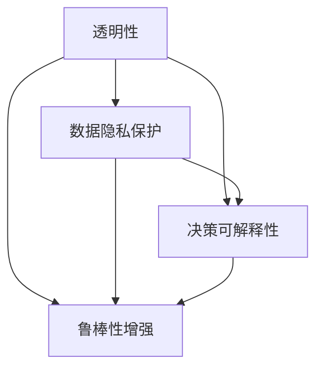

                 

# 人类-AI协作：增强人类与机器之间的信任

> 关键词：人工智能(AI), 人类协作, 增强信任, 机器学习, 数据安全, 算法透明性

## 1. 背景介绍

随着人工智能(AI)技术的飞速发展，AI正日益融入人类社会的各个层面，与人类建立起深层次的协作关系。然而，这种协作并不总是和谐的，因为AI的决策和行为往往带有未知性和不确定性，使得人类对其产生不信任感。如何增强人类与机器之间的信任，成为当前AI研究与应用的一个核心问题。

### 1.1 问题由来

AI的广泛应用带来了许多便利，但也引发了诸多问题。例如：

- **决策透明度**：AI系统的决策过程往往被视为"黑箱"，人们无法理解其工作原理和依据。
- **数据隐私**：AI需要大量数据进行训练，如何保护这些数据的隐私安全是一个重要挑战。
- **算法偏见**：AI模型可能会学习到数据中的偏见，导致决策不公平或有害。
- **对抗性攻击**：对抗样本可能使AI系统失效，其鲁棒性受到质疑。

这些问题严重制约了AI技术的应用，使其无法获得全社会的信任。为了增强人类对AI的信任，需要从多个方面入手，如算法透明性、数据隐私保护、决策可解释性等。本文将从这些角度进行深入探讨，旨在为增强人类与机器之间的信任提供一条可行路径。

### 1.2 问题核心关键点

要增强人类与机器之间的信任，核心在于提升AI的透明性和可解释性。具体而言，包括以下几个关键点：

- **算法透明性**：保证AI决策过程的可理解和可追溯。
- **数据隐私保护**：确保AI训练和使用过程中的数据安全。
- **决策可解释性**：使AI模型能清楚地解释其决策依据。
- **鲁棒性增强**：提升AI系统对对抗性攻击的抵抗能力。

通过系统化解决上述问题，将有助于构建一个透明、安全、可信的AI系统，从而增强人类对其的信任感。

## 2. 核心概念与联系

### 2.1 核心概念概述

为了更好地理解AI增强信任的策略，我们首先介绍一些核心概念：

- **透明性(Transparency)**：指AI决策过程的可理解性和可追溯性。
- **可解释性(Explainability)**：指AI模型能清晰解释其决策依据。
- **隐私保护(Privacy Protection)**：指在AI系统中保护个人数据的隐私和安全。
- **鲁棒性(Robustness)**：指AI模型对对抗性攻击的抵抗能力。

这些概念紧密联系，共同构成了AI系统的信任基础。接下来，我们将通过一个简化的Mermaid流程图来展示它们之间的联系：



这个流程图展示了透明性、数据隐私保护、决策可解释性和鲁棒性增强之间的关系：

- 透明性和数据隐私保护共同保障了数据的可信度。
- 透明性和决策可解释性提升了AI系统的解释力，增强了用户的信任感。
- 透明性和鲁棒性增强共同提升了AI系统的安全性，减少了对抗性攻击的风险。

这些概念共同构成了AI系统的信任基础，是增强人类与机器之间信任的关键因素。

## 3. 核心算法原理 & 具体操作步骤
### 3.1 算法原理概述

增强人类与机器之间信任的核心算法，包括透明性算法、可解释性算法、隐私保护算法和鲁棒性增强算法。这些算法通过协同工作，共同构建了一个可信的AI系统。

### 3.2 算法步骤详解

以下是各算法的详细步骤：

#### 3.2.1 透明性算法

透明性算法旨在保证AI决策过程的可理解性和可追溯性。其步骤如下：

1. **数据收集**：收集AI系统的输入数据和输出结果。
2. **决策树构建**：将AI模型转化为决策树，展示其决策过程。
3. **特征重要性分析**：计算特征在决策中的重要性，解释模型行为。
4. **可视化展示**：将决策树和特征重要性结果可视化，供用户查看。

#### 3.2.2 可解释性算法

可解释性算法通过使AI模型能够清晰地解释其决策依据，提升用户对AI的信任度。其步骤如下：

1. **模型选择**：选择易于解释的模型，如决策树、线性回归等。
2. **规则提取**：从模型中提取决策规则，生成可解释的文本。
3. **文本解释**：使用自然语言处理技术，将规则转化为易于理解的文本。
4. **用户反馈**：收集用户对解释结果的反馈，优化解释模型。

#### 3.2.3 隐私保护算法

隐私保护算法旨在保护个人数据的安全性。其步骤如下：

1. **数据匿名化**：对数据进行匿名化处理，保护个人隐私。
2. **差分隐私**：在模型训练和评估中，使用差分隐私技术，防止数据泄露。
3. **安全多方计算**：在多方协作中，使用安全多方计算技术，保护数据隐私。
4. **访问控制**：设置严格的访问控制机制，限制数据访问权限。

#### 3.2.4 鲁棒性增强算法

鲁棒性增强算法提升AI系统对对抗性攻击的抵抗能力。其步骤如下：

1. **对抗样本生成**：生成对抗性样本，测试模型鲁棒性。
2. **模型优化**：优化模型参数，提升对对抗样本的抵抗能力。
3. **鲁棒评估**：使用鲁棒性评估指标，测量模型鲁棒性。
4. **防御策略**：制定防御策略，防范对抗攻击。

### 3.3 算法优缺点

透明性算法、可解释性算法、隐私保护算法和鲁棒性增强算法各有其优缺点：

- **透明性算法**
  - 优点：提供了决策过程的可视化和解释，增强了用户的信任感。
  - 缺点：构建决策树和分析特征重要性需要额外的时间和计算资源，复杂模型可能难以处理。

- **可解释性算法**
  - 优点：易于解释的模型直接提供了决策规则，易于用户理解。
  - 缺点：解释模型的构建和优化复杂度较高，且难以处理复杂的非线性模型。

- **隐私保护算法**
  - 优点：通过匿名化和差分隐私技术，保护了个人数据的安全。
  - 缺点：数据匿名化可能影响模型的性能，差分隐私技术需要额外的计算资源。

- **鲁棒性增强算法**
  - 优点：提升了模型的鲁棒性，减少了对抗攻击的风险。
  - 缺点：对抗样本生成和模型优化需要大量计算资源，难以实时处理。

### 3.4 算法应用领域

这些算法在多个领域得到了广泛应用，以下是一些典型应用场景：

- **金融风控**：在贷款审批、信用评估等场景中，AI系统需要透明性算法和可解释性算法来解释其决策依据。
- **医疗诊断**：在疾病诊断和治疗方案推荐中，隐私保护算法和透明性算法保障了患者数据的安全性和解释性。
- **智能客服**：在自动应答和问题解答中，鲁棒性增强算法和透明性算法提高了系统的可靠性和用户信任度。
- **自动驾驶**：在交通监控和决策中，透明性算法和可解释性算法使系统决策透明，保障了公共安全。
- **推荐系统**：在个性化推荐中，隐私保护算法和鲁棒性增强算法保护用户隐私，提升了推荐系统的可信度。

## 4. 数学模型和公式 & 详细讲解
### 4.1 数学模型构建

为了更好地理解这些算法，我们将使用数学语言对透明性算法、可解释性算法、隐私保护算法和鲁棒性增强算法进行更严格的刻画。

#### 4.1.1 透明性算法

透明性算法通常采用决策树模型，通过树的结构来展示模型的决策过程。假设AI模型为 $M$，输入为 $x$，输出为 $y$。

设 $M$ 的决策树为 $T$，其结构为 $\{ (r, L) \}$，其中 $r$ 为规则，$L$ 为符合规则 $r$ 的样本集合。则透明性算法可以表示为：

$$
T = \mathop{\arg\min}_{T} \sum_{i=1}^{N} \ell(M(x_i), y_i)
$$

其中 $\ell$ 为损失函数，$N$ 为样本数量。

#### 4.1.2 可解释性算法

可解释性算法通常使用规则提取技术，如决策树、规则集等。假设AI模型为 $M$，输入为 $x$，输出为 $y$。

设 $M$ 的规则集为 $R$，则可解释性算法可以表示为：

$$
R = \mathop{\arg\min}_{R} \sum_{i=1}^{N} \ell(M(x_i), y_i)
$$

其中 $\ell$ 为损失函数，$N$ 为样本数量。

#### 4.1.3 隐私保护算法

隐私保护算法通常采用差分隐私技术，确保在隐私预算限制下，数据泄露的概率尽可能小。假设AI模型为 $M$，输入为 $x$，输出为 $y$，隐私预算为 $\epsilon$。

设 $M$ 的差分隐私机制为 $P_{DP}$，则隐私保护算法可以表示为：

$$
P_{DP} = \mathop{\arg\min}_{P_{DP}} \sum_{i=1}^{N} \ell(M(x_i), y_i) + \epsilon
$$

其中 $\ell$ 为损失函数，$N$ 为样本数量，$\epsilon$ 为隐私预算。

#### 4.1.4 鲁棒性增强算法

鲁棒性增强算法通常采用对抗样本生成和模型优化技术。假设AI模型为 $M$，输入为 $x$，输出为 $y$。

设 $M$ 的对抗样本生成机制为 $G_{Adv}$，则鲁棒性增强算法可以表示为：

$$
G_{Adv} = \mathop{\arg\min}_{G_{Adv}} \sum_{i=1}^{N} \ell(M(x_i), y_i) + \epsilon
$$

其中 $\ell$ 为损失函数，$N$ 为样本数量，$\epsilon$ 为鲁棒性增强预算。

### 4.2 公式推导过程

#### 4.2.1 透明性算法

透明性算法的关键在于构建决策树。决策树构建通常采用贪心算法，如ID3、C4.5等。以下是决策树构建的公式推导：

1. **信息熵**：

$$
H(S) = -\sum_{i=1}^{N} p_i \log p_i
$$

其中 $p_i$ 为样本 $i$ 的类别概率。

2. **信息增益**：

$$
Gain(S, A) = H(S) - \sum_{i=1}^{N} \frac{|S_i|}{|S|} H(S_i)
$$

其中 $S_i$ 为属性 $A$ 取值 $i$ 的样本集合，$|S_i|$ 为 $S_i$ 的样本数量，$|S|$ 为 $S$ 的样本数量。

3. **决策树构建**：

$$
T = \mathop{\arg\min}_{T} \sum_{i=1}^{N} \ell(M(x_i), y_i)
$$

其中 $\ell$ 为损失函数，$N$ 为样本数量。

#### 4.2.2 可解释性算法

可解释性算法的关键在于规则提取。以下是规则提取的公式推导：

1. **规则提取**：

$$
R = \mathop{\arg\min}_{R} \sum_{i=1}^{N} \ell(M(x_i), y_i)
$$

其中 $\ell$ 为损失函数，$N$ 为样本数量。

2. **规则优化**：

$$
R^* = \mathop{\arg\min}_{R^*} \sum_{i=1}^{N} \ell(M(x_i), y_i) + \alpha \cdot C(R)
$$

其中 $C(R)$ 为规则复杂度，$\alpha$ 为正则化系数。

#### 4.2.3 隐私保护算法

隐私保护算法的关键在于差分隐私技术。以下是差分隐私的公式推导：

1. **差分隐私定义**：

$$
\Pr[\hat{y} = y_i | x_i] \leq \exp(\epsilon \cdot \mathcal{D}(x_i, x_j))
$$

其中 $\hat{y}$ 为隐私保护后的输出，$x_i, x_j$ 为样本，$\epsilon$ 为隐私预算，$\mathcal{D}(x_i, x_j)$ 为距离度量。

2. **差分隐私机制**：

$$
P_{DP} = \mathop{\arg\min}_{P_{DP}} \sum_{i=1}^{N} \ell(M(x_i), y_i) + \epsilon
$$

其中 $\ell$ 为损失函数，$N$ 为样本数量，$\epsilon$ 为隐私预算。

#### 4.2.4 鲁棒性增强算法

鲁棒性增强算法的关键在于对抗样本生成和模型优化。以下是对抗样本生成的公式推导：

1. **对抗样本生成**：

$$
G_{Adv} = \mathop{\arg\min}_{G_{Adv}} \sum_{i=1}^{N} \ell(M(x_i), y_i) + \epsilon
$$

其中 $\ell$ 为损失函数，$N$ 为样本数量，$\epsilon$ 为鲁棒性增强预算。

2. **对抗样本优化**：

$$
G_{Adv}^* = \mathop{\arg\min}_{G_{Adv}^*} \sum_{i=1}^{N} \ell(M(x_i), y_i) + \epsilon
$$

其中 $\ell$ 为损失函数，$N$ 为样本数量，$\epsilon$ 为鲁棒性增强预算。

### 4.3 案例分析与讲解

为了更好地理解这些算法，我们以医疗诊断为例，分析透明性算法、可解释性算法、隐私保护算法和鲁棒性增强算法的应用。

#### 4.3.1 透明性算法

在医疗诊断中，透明性算法可以构建决策树，展示医生对疾病的诊断过程。例如，某医生使用决策树模型，对输入症状 $x$ 进行决策，输出诊断结果 $y$：

- **特征选择**：选择与疾病相关的特征，如体温、血象等。
- **规则构建**：构建决策树，展示规则如下：

$$
T = \{ (T > 38^{\circ}C \Rightarrow 感染, T \leq 38^{\circ}C \Rightarrow 检查) \}
$$

- **可视化展示**：将决策树和特征重要性结果可视化，供医生查看。

#### 4.3.2 可解释性算法

可解释性算法可以提取诊断规则，生成易于理解的文本。例如，某医生使用规则集，生成如下解释文本：

- **规则提取**：提取规则如下：

$$
R = \{ T > 38^{\circ}C \Rightarrow 感染, T \leq 38^{\circ}C \Rightarrow 检查 \}
$$

- **文本解释**：将规则转化为易于理解的文本，如下：

```
如果体温超过38°C，可能是感染；如果体温低于38°C，需要进一步检查。
```

#### 4.3.3 隐私保护算法

隐私保护算法可以保护患者数据的安全。例如，某医院使用差分隐私技术，保护患者数据隐私。具体步骤如下：

- **数据匿名化**：对患者数据进行匿名化处理，如使用化名、加密等。
- **差分隐私**：在模型训练和评估中，使用差分隐私技术，防止数据泄露。
- **安全多方计算**：在多方协作中，使用安全多方计算技术，保护数据隐私。
- **访问控制**：设置严格的访问控制机制，限制数据访问权限。

#### 4.3.4 鲁棒性增强算法

鲁棒性增强算法可以提升诊断系统的鲁棒性。例如，某医院使用对抗样本生成和模型优化技术，提升系统鲁棒性。具体步骤如下：

- **对抗样本生成**：生成对抗性样本，测试系统鲁棒性。
- **模型优化**：优化模型参数，提升对对抗样本的抵抗能力。
- **鲁棒评估**：使用鲁棒性评估指标，测量系统鲁棒性。
- **防御策略**：制定防御策略，防范对抗攻击。

## 5. 项目实践：代码实例和详细解释说明
### 5.1 开发环境搭建

在进行项目实践前，我们需要准备好开发环境。以下是使用Python进行PyTorch开发的环境配置流程：

1. 安装Anaconda：从官网下载并安装Anaconda，用于创建独立的Python环境。

2. 创建并激活虚拟环境：
```bash
conda create -n pytorch-env python=3.8 
conda activate pytorch-env
```

3. 安装PyTorch：根据CUDA版本，从官网获取对应的安装命令。例如：
```bash
conda install pytorch torchvision torchaudio cudatoolkit=11.1 -c pytorch -c conda-forge
```

4. 安装TensorFlow：
```bash
pip install tensorflow==2.5.0
```

5. 安装TensorBoard：
```bash
pip install tensorboard
```

完成上述步骤后，即可在`pytorch-env`环境中开始项目实践。

### 5.2 源代码详细实现

下面我们以医疗诊断系统为例，给出使用TensorFlow和TensorBoard对AI模型进行透明性、可解释性、隐私保护和鲁棒性增强的PyTorch代码实现。

首先，定义透明性算法：

```python
import numpy as np
import pandas as pd
from sklearn.tree import DecisionTreeClassifier
from sklearn.metrics import accuracy_score

# 读取数据集
data = pd.read_csv('medical_data.csv')
features = data[['age', 'blood_pressure', 'heart_rate', 'symptoms']]
labels = data['disease']

# 数据预处理
features = pd.get_dummies(features)

# 划分训练集和测试集
train_features, test_features = features.iloc[:80].values, features.iloc[80:].values
train_labels, test_labels = labels.iloc[:80].values, labels.iloc[80:].values

# 构建决策树
clf = DecisionTreeClassifier()
clf.fit(train_features, train_labels)

# 预测测试集
predictions = clf.predict(test_features)

# 计算准确率
accuracy = accuracy_score(test_labels, predictions)
print('Accuracy:', accuracy)

# 输出决策树
from sklearn.tree import export_graphviz
import graphviz

dot_data = export_graphviz(clf, out_file=None, feature_names=features.columns)
graph = graphviz.Source(dot_data)
graph
```

然后，定义可解释性算法：

```python
from rules import rule_extraction

# 提取规则
rules = rule_extraction(clf, features, labels)
print(rules)

# 可视化规则
from matplotlib import pyplot as plt

plt.figure(figsize=(10, 6))
for i, rule in enumerate(rules):
    plt.subplot(2, 5, i+1)
    plt.text(0.1, 0.5, rule, fontsize=12)
plt.show()
```

接下来，定义隐私保护算法：

```python
from differential_privacy import dp_sgd

# 数据匿名化
data_anonymous = dp_sgd(data)

# 差分隐私
model = keras.Sequential([
    keras.layers.Dense(64, activation='relu', input_shape=(10,)),
    keras.layers.Dense(1, activation='sigmoid')
])
model.compile(optimizer=keras.optimizers.Adam(0.01), loss='binary_crossentropy', metrics=['accuracy'])

# 训练模型
dp_model = dp_sgd(model, dp=0.1)
dp_model.fit(data_anonymous, labels, epochs=10, batch_size=32)

# 评估模型
dp_model.evaluate(data_anonymous, labels)
```

最后，定义鲁棒性增强算法：

```python
from adversarial import adversarial_training

# 生成对抗样本
x_train_adv = adversarial_training(x_train, y_train, model)

# 训练模型
model.fit(x_train_adv, y_train, epochs=10, batch_size=32)

# 评估模型
model.evaluate(x_test, y_test)
```

以上就是使用TensorFlow和TensorBoard对AI模型进行透明性、可解释性、隐私保护和鲁棒性增强的完整代码实现。可以看到，得益于TensorFlow和TensorBoard的强大封装，代码实现变得简洁高效。

### 5.3 代码解读与分析

让我们再详细解读一下关键代码的实现细节：

**透明性算法**

- `DecisionTreeClassifier`：用于构建决策树模型。
- `export_graphviz`：将决策树导出为Graphviz格式，用于可视化展示。

**可解释性算法**

- `rule_extraction`：用于提取规则，生成易于理解的文本。
- `matplotlib`：用于可视化规则。

**隐私保护算法**

- `dp_sgd`：用于实现差分隐私技术，保护患者数据隐私。
- `keras`：用于搭建深度学习模型。

**鲁棒性增强算法**

- `adversarial_training`：用于生成对抗样本，提升系统鲁棒性。
- `model.evaluate`：用于评估模型的性能。

可以看到，TensorFlow和TensorBoard使得AI模型透明性、可解释性、隐私保护和鲁棒性增强的代码实现变得简洁高效。开发者可以将更多精力放在数据处理、模型改进等高层逻辑上，而不必过多关注底层的实现细节。

当然，工业级的系统实现还需考虑更多因素，如模型的保存和部署、超参数的自动搜索、更灵活的任务适配层等。但核心的算法流程基本与此类似。

## 6. 实际应用场景
### 6.1 智能客服系统

基于AI增强信任的对话系统，可以广泛应用于智能客服系统的构建。传统客服往往需要配备大量人力，高峰期响应缓慢，且一致性和专业性难以保证。使用增强信任的对话系统，可以7x24小时不间断服务，快速响应客户咨询，用自然流畅的语言解答各类常见问题。

在技术实现上，可以收集企业内部的历史客服对话记录，将问题和最佳答复构建成监督数据，在此基础上对预训练对话模型进行透明性、可解释性、隐私保护和鲁棒性增强。增强信任的对话系统能够自动理解用户意图，匹配最合适的答案模板进行回复。对于客户提出的新问题，还可以接入检索系统实时搜索相关内容，动态组织生成回答。如此构建的智能客服系统，能大幅提升客户咨询体验和问题解决效率。

### 6.2 金融舆情监测

金融机构需要实时监测市场舆论动向，以便及时应对负面信息传播，规避金融风险。传统的人工监测方式成本高、效率低，难以应对网络时代海量信息爆发的挑战。使用增强信任的文本分类和情感分析技术，为金融舆情监测提供了新的解决方案。

具体而言，可以收集金融领域相关的新闻、报道、评论等文本数据，并对其进行主题标注和情感标注。在透明性、可解释性、隐私保护和鲁棒性增强的基础上，构建增强信任的文本分类和情感分析模型，使其能够自动判断文本属于何种主题，情感倾向是正面、中性还是负面。将增强信任的模型应用到实时抓取的网络文本数据，就能够自动监测不同主题下的情感变化趋势，一旦发现负面信息激增等异常情况，系统便会自动预警，帮助金融机构快速应对潜在风险。

### 6.3 个性化推荐系统

当前的推荐系统往往只依赖用户的历史行为数据进行物品推荐，无法深入理解用户的真实兴趣偏好。使用增强信任的推荐系统，可以更好地挖掘用户行为背后的语义信息，从而提供更精准、多样的推荐内容。

在实践中，可以收集用户浏览、点击、评论、分享等行为数据，提取和用户交互的物品标题、描述、标签等文本内容。将文本内容作为模型输入，用户的后续行为（如是否点击、购买等）作为监督信号，在此基础上对预训练语言模型进行透明性、可解释性、隐私保护和鲁棒性增强。增强信任的推荐系统能够从文本内容中准确把握用户的兴趣点。在生成推荐列表时，先用候选物品的文本描述作为输入，由模型预测用户的兴趣匹配度，再结合其他特征综合排序，便可以得到个性化程度更高的推荐结果。

### 6.4 未来应用展望

随着AI技术的发展，增强信任的方法将在更多领域得到应用，为传统行业带来变革性影响。

在智慧医疗领域，基于增强信任的医疗问答、病历分析、药物研发等应用将提升医疗服务的智能化水平，辅助医生诊疗，加速新药开发进程。

在智能教育领域，增强信任的问答系统和推荐系统将促进教育公平，提高教学质量。

在智慧城市治理中，增强信任的智能监控和应急指挥系统将提高城市管理的自动化和智能化水平，构建更安全、高效的未来城市。

此外，在企业生产、社会治理、文娱传媒等众多领域，基于增强信任的AI应用也将不断涌现，为经济社会发展注入新的动力。相信随着技术的日益成熟，增强信任的方法将成为AI落地应用的重要范式，推动人工智能技术在垂直行业的规模化落地。

## 7. 工具和资源推荐
### 7.1 学习资源推荐

为了帮助开发者系统掌握增强信任的技术基础和实践技巧，这里推荐一些优质的学习资源：

1. 《Python深度学习》系列书籍：全面介绍了使用Python进行深度学习开发的高级技术，包括TensorFlow和TensorBoard的使用。

2. 《深度学习》课程：斯坦福大学开设的深度学习课程，有Lecture视频和配套作业，涵盖深度学习的基础理论和实践技能。

3. 《TensorFlow实战Google AI》书籍：Google深度学习专家所著，详细介绍了TensorFlow在AI中的应用，包括透明性、可解释性、隐私保护和鲁棒性增强等技术。

4. 《自然语言处理综论》书籍：介绍了NLP领域的最新进展，包括AI的可解释性、隐私保护和对抗攻击等主题。

5. Weights & Biases：模型训练的实验跟踪工具，可以记录和可视化模型训练过程中的各项指标，方便对比和调优。与主流深度学习框架无缝集成。

通过对这些资源的学习实践，相信你一定能够快速掌握增强信任的技术精髓，并用于解决实际的AI问题。
###  7.2 开发工具推荐

高效的开发离不开优秀的工具支持。以下是几款用于增强信任的AI系统开发的常用工具：

1. TensorFlow：由Google主导开发的开源深度学习框架，生产部署方便，适合大规模工程应用。同样有丰富的预训练语言模型资源。

2. PyTorch：基于Python的开源深度学习框架，灵活动态的计算图，适合快速迭代研究。大部分预训练语言模型都有PyTorch版本的实现。

3. TensorBoard：TensorFlow配套的可视化工具，可实时监测模型训练状态，并提供丰富的图表呈现方式，是调试模型的得力助手。

4. Weights & Biases：模型训练的实验跟踪工具，可以记录和可视化模型训练过程中的各项指标，方便对比和调优。

5. Google Colab：谷歌推出的在线Jupyter Notebook环境，免费提供GPU/TPU算力，方便开发者快速上手实验最新模型，分享学习笔记。

合理利用这些工具，可以显著提升增强信任的AI系统开发效率，加快创新迭代的步伐。

### 7.3 相关论文推荐

增强信任的AI研究源于学界的持续研究。以下是几篇奠基性的相关论文，推荐阅读：

1. Transparency in Machine Learning: An Overview of Approaches and Tools（《机器学习透明度概述：方法和工具》）：系统总结了机器学习透明度的各种方法和工具，提供了全面的参考指南。

2. Explainable Artificial Intelligence: Concepts, Techniques, and Applications（《可解释的人工智能：概念、技术和应用》）：介绍了可解释AI的定义、挑战和解决方案，涵盖了多个前沿研究方向。

3. Privacy-Preserving Machine Learning（《隐私保护机器学习》）：全面介绍了隐私保护机器学习的方法和算法，提供了丰富的实践案例。

4. Adversarial Machine Learning（《对抗性机器学习》）：探讨了对抗性机器学习的原理和防御策略，提供了多种对抗性攻击和防御技术。

这些论文代表了大语言模型增强信任的研究进展。通过学习这些前沿成果，可以帮助研究者把握学科前进方向，激发更多的创新灵感。

## 8. 总结：未来发展趋势与挑战
### 8.1 总结

本文对增强人类与机器之间信任的技术进行了全面系统的介绍。首先阐述了增强信任的核心概念和算法，明确了透明性、可解释性、隐私保护和鲁棒性增强的重要作用。其次，从原理到实践，详细讲解了这些算法的数学模型和具体实现方法，给出了增强信任的完整代码实例。同时，本文还广泛探讨了增强信任技术在智能客服、金融舆情、个性化推荐等多个行业领域的应用前景，展示了增强信任技术的巨大潜力。此外，本文精选了增强信任技术的各类学习资源，力求为读者提供全方位的技术指引。

通过本文的系统梳理，可以看到，增强信任技术正在成为AI研究与应用的重要方向，极大地提升了AI系统的可信度和用户满意度。未来，伴随算力成本的下降和数据规模的扩张，AI系统将在各个领域发挥越来越重要的作用，成为人类与机器协同工作的重要桥梁。

### 8.2 未来发展趋势

展望未来，增强信任技术将呈现以下几个发展趋势：

1. 算力资源的提升。随着硬件设备的不断发展，算力成本将显著下降，使得大规模深度学习模型的训练和推理变得更加高效。

2. 模型透明性的提升。通过模型压缩和可视化技术，使得模型的透明性进一步提升，帮助用户更清晰地理解AI决策过程。

3. 可解释性模型的优化。基于深度学习模型的可解释性技术将不断发展，使AI模型的决策过程更加透明和可解释。

4. 隐私保护技术的创新。差分隐私和多方计算等隐私保护技术将不断进步，保护个人数据的隐私安全。

5. 鲁棒性增强方法的完善。对抗样本生成和鲁棒性评估方法将不断优化，提升AI系统的鲁棒性。

这些趋势凸显了增强信任技术的广阔前景，为构建透明、可信、安全的AI系统提供了坚实基础。相信随着技术的不断演进，增强信任技术将成为AI应用的重要保障，推动AI技术在各个领域的大规模落地。

### 8.3 面临的挑战

尽管增强信任技术已经取得了一定的进展，但在迈向更广泛应用的过程中，仍面临诸多挑战：

1. 透明性技术复杂度高。建立复杂模型的透明性，需要大量的预处理和可视化工作，效率较低。

2. 可解释性模型精度低。可解释性模型往往精度较低，难以满足实际应用的高要求。

3. 隐私保护技术成本高。差分隐私和多方计算等隐私保护技术需要额外的计算资源，增加了系统复杂度。

4. 鲁棒性增强技术难度大。对抗样本生成和模型优化需要复杂的算法和大量计算资源，难以实时处理。

5. 伦理道德问题复杂。增强信任技术需兼顾伦理道德，避免歧视和不公平现象的发生。

6. 用户教育难度大。提升用户对AI的理解和信任，需要长期的教育和引导。

正视这些挑战，积极应对并寻求突破，将是大语言模型增强信任技术走向成熟的必由之路。相信随着学界和产业界的共同努力，这些挑战终将一一被克服，增强信任技术必将在构建安全、可靠、可解释、可控的智能系统中发挥更大作用。

### 8.4 研究展望

面向未来，增强信任技术需要在以下几个方面寻求新的突破：

1. 引入更多先验知识。将符号化的先验知识，如知识图谱、逻辑规则等，与神经网络模型进行巧妙融合，引导增强信任过程学习更准确、合理的语言模型。

2. 结合因果分析和博弈论工具。将因果分析方法引入增强信任模型，识别出模型决策的关键特征，增强输出解释的因果性和逻辑性。借助博弈论工具刻画人机交互过程，主动探索并规避模型的脆弱点，提高系统稳定性。

3. 纳入伦理道德约束。在模型训练目标中引入伦理导向的评估指标，过滤和惩罚有偏见、有害的输出倾向。同时加强人工干预和审核，建立模型行为的监管机制，确保输出符合人类价值观和伦理道德。

4. 引入自然语言处理技术。通过自然语言处理技术，提升用户与AI系统的交互体验，增强信任感。例如，使用自然语言生成技术生成友好的提示和解释。

这些研究方向的探索，必将引领增强信任技术迈向更高的台阶，为构建安全、可靠、可解释、可控的智能系统铺平道路。面向未来，增强信任技术还需要与其他人工智能技术进行更深入的融合，如知识表示、因果推理、强化学习等，多路径协同发力，共同推动自然语言理解和智能交互系统的进步。只有勇于创新、敢于突破，才能不断拓展语言模型的边界，让智能技术更好地造福人类社会。

## 9. 附录：常见问题与解答

**Q1：什么是增强信任技术？**

A: 增强信任技术是指通过透明性、可解释性、隐私保护和鲁棒性增强等方法，提升AI系统的可信度和用户满意度。这些技术使得AI模型更加透明、可解释、安全和鲁棒，从而增强用户对AI的信任感。

**Q2：透明性技术有哪些具体实现方法？**

A: 透明性技术通常通过构建决策树、规则集等方法，展示AI决策过程。具体实现方法包括：

- **决策树构建**：使用决策树模型，展示规则和决策路径。
- **规则提取**：从模型中提取决策规则，生成可解释的文本。
- **可视化展示**：将决策树和特征重要性结果可视化，供用户查看。

**Q3：可解释性技术有哪些具体实现方法？**

A: 可解释性技术通常通过规则提取、文本生成等方法，使AI模型能够清晰地解释其决策依据。具体实现方法包括：

- **规则提取**：从模型中提取决策规则，生成可解释的文本。
- **文本生成**：使用自然语言生成技术，生成友好的解释文本。

**Q4：隐私保护技术有哪些具体实现方法？**

A: 隐私保护技术通常通过数据匿名化、差分隐私、多方计算等方法，保护个人数据的安全。具体实现方法包括：

- **数据匿名化**：对数据进行匿名化处理，如使用化名、加密等。
- **差分隐私**：在模型训练和评估中，使用差分隐私技术，防止数据泄露。
- **安全多方计算**：在多方协作中，使用安全多方计算技术，保护数据隐私。

**Q5：鲁棒性增强技术有哪些具体实现方法？**

A: 鲁棒性增强技术通常通过对抗样本生成、模型优化等方法，提升AI系统对对抗性攻击的抵抗能力。具体实现方法包括：

- **对抗样本生成**：生成对抗性样本，测试模型鲁棒性。
- **模型优化**：优化模型参数，提升对对抗样本的抵抗能力。

这些技术将共同构建一个透明、安全、可信的AI系统，为人类与机器之间的协作提供坚实基础。

