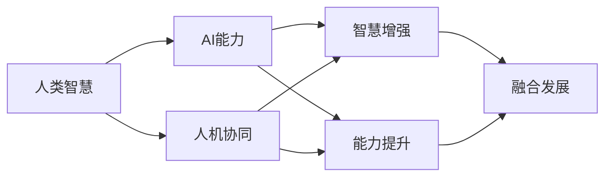
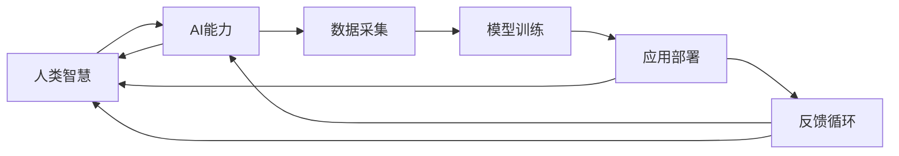

                 

# 人类-AI协作：增强人类智慧与AI能力的融合发展趋势预测分析机遇挑战机遇预测

> 关键词：人类智慧增强，AI能力提升，协作融合，趋势预测，机遇分析，挑战应对，发展路径

## 1. 背景介绍

### 1.1 问题由来

当前，人工智能（AI）技术已经进入了一个新的发展阶段，从早期的规则型AI和统计型AI，逐渐进化为基于深度学习的黑盒型AI。这种AI不仅能够处理大量数据，还能够自主学习和优化。然而，这种自主学习的能力，在带来巨大便利的同时，也引发了关于AI与人类智慧融合的诸多疑问。

1. **人机协同**：如何让人类与AI协作，并充分发挥各自的优势？
2. **智慧增强**：如何通过AI提升人类的智慧水平，包括认知能力、决策能力等？
3. **能力提升**：如何通过AI技术的融合，提升人类在各个领域的能力，如医疗、教育、交通等？
4. **融合发展**：如何构建一个可持续的AI与人类智慧融合的生态系统？

这些问题直接关系到AI技术的未来发展路径，以及人类社会的发展方向。因此，本文将重点探讨人类-AI协作的趋势、机遇与挑战，并提出相应的发展路径与策略。

### 1.2 问题核心关键点

1. **人机协同**：人类与AI如何协同工作，以实现更高效的决策与任务处理？
2. **智慧增强**：如何利用AI技术提升人类智慧水平，并解决特定问题？
3. **能力提升**：AI技术如何应用于人类能力的提升，特别是在教育、医疗等关键领域？
4. **融合发展**：构建人类-AI协作生态系统需要考虑的关键因素与策略。

这些核心关键点将指导我们深入分析AI与人类智慧融合的趋势、机遇与挑战。

## 2. 核心概念与联系

### 2.1 核心概念概述

- **人类智慧**：人类通过学习、思考、推理等过程形成的智能能力，包括认知能力、判断能力、决策能力等。
- **AI能力**：基于算法、模型和数据训练的计算能力，包括数据处理、模式识别、自主决策等。
- **人机协同**：人类与AI在任务处理、决策制定等方面的协作。
- **智慧增强**：利用AI技术提升人类的认知能力、学习效率等。
- **能力提升**：通过AI技术的应用，提升人类在特定领域的专业能力，如医疗诊断、教育辅助等。
- **融合发展**：将AI技术与人类智慧相结合，构建可持续的生态系统，促进技术的全面发展与应用。

这些概念之间的联系通过以下Mermaid流程图进行展示：



这个流程图展示了人类智慧与AI能力的融合过程：人类智慧通过AI能力的增强和提升，进而实现人机协同，并最终达到融合发展的目标。

### 2.2 核心概念原理和架构的 Mermaid 流程图



这个流程图进一步详细说明了AI能力的提升过程：首先通过数据采集获取信息，然后使用模型训练优化算法，最终将优化后的AI能力应用到实际场景中。同时，AI能力的提升又会对人类智慧产生反馈，形成一个持续迭代的循环。

## 3. 核心算法原理 & 具体操作步骤

### 3.1 算法原理概述

人类-AI协作的核心在于如何将AI技术与人类智慧有效结合，以实现最优的协同效果。这一过程通常包括以下步骤：

1. **数据采集**：收集人类在特定任务中的行为数据、认知数据等。
2. **模型训练**：使用这些数据训练AI模型，使其能够模拟和预测人类行为。
3. **应用部署**：将训练好的模型应用于实际任务中，辅助或替代人类完成工作。
4. **反馈循环**：根据人类与AI的协同结果，不断优化AI模型和人类工作方式。

这一过程是一个持续迭代和优化的过程，需要不断调整模型参数，以适应不同任务和场景的需求。

### 3.2 算法步骤详解

以下详细说明人类-AI协作的具体步骤：

1. **需求分析**：明确任务目标和关键指标，如提高诊断精度、提升教育效率等。
2. **数据收集**：收集与任务相关的数据，如病历记录、教育案例等。
3. **数据预处理**：对数据进行清洗、标注、转换等处理，以提高数据质量。
4. **模型选择**：选择适合任务的AI模型，如卷积神经网络（CNN）、长短期记忆网络（LSTM）等。
5. **模型训练**：使用训练数据训练AI模型，并通过验证集进行模型调优。
6. **模型应用**：将训练好的AI模型应用到实际任务中，进行预测或决策。
7. **效果评估**：对AI与人类协同的结果进行评估，如精度、效率等。
8. **反馈迭代**：根据评估结果，不断优化AI模型和人类工作方式，实现持续改进。

### 3.3 算法优缺点

**优点**：
1. **高效协同**：AI能够处理大量数据，快速完成复杂任务，提高人类工作效率。
2. **精准决策**：AI模型通过深度学习，能够做出更精准的预测和决策。
3. **持续优化**：通过不断的反馈和迭代，AI模型能够不断提升性能。

**缺点**：
1. **依赖数据**：AI模型的性能很大程度上依赖于数据的质量和数量，数据不足或偏差会导致模型失效。
2. **透明性差**：黑盒模型难以解释其内部工作机制，人类难以理解其决策过程。
3. **易受攻击**：AI模型可能受到对抗样本、数据泄露等攻击，影响其安全性和可靠性。

### 3.4 算法应用领域

基于人类-AI协作的算法，已经在多个领域得到应用：

1. **医疗诊断**：通过AI模型分析病历数据，辅助医生进行疾病诊断和治疗方案制定。
2. **教育辅助**：利用AI技术优化教学过程，提高教育效率和质量，如个性化教育、智能辅导等。
3. **交通管理**：AI技术应用于交通流量预测、路径规划等，提高交通管理效率和安全性。
4. **金融分析**：通过AI模型分析金融市场数据，进行风险评估和投资决策。
5. **工业制造**：AI技术应用于生产过程优化、质量控制等，提高生产效率和产品质量。
6. **智能家居**：利用AI技术实现智能家居系统的自动化管理，提升生活质量。

这些领域的应用展示了人类-AI协作的广泛潜力和实际价值。

## 4. 数学模型和公式 & 详细讲解 & 举例说明

### 4.1 数学模型构建

在人类-AI协作的模型构建中，常见的数学模型包括监督学习模型、无监督学习模型和强化学习模型。

以监督学习模型为例，其核心目标是构建一个映射函数 $f(x)$，使得 $f(x)$ 的输出能够最接近地匹配目标变量 $y$。假设我们有 $n$ 个训练样本 $(x_1, y_1), (x_2, y_2), ..., (x_n, y_n)$，其中 $x_i$ 是输入变量，$y_i$ 是输出变量，则监督学习模型的最小化目标函数为：

$$
\min_{f} \sum_{i=1}^{n} \mathcal{L}(f(x_i), y_i)
$$

其中 $\mathcal{L}$ 为损失函数，通常采用均方误差（MSE）或交叉熵（CE）。

### 4.2 公式推导过程

以回归问题为例，假设我们要预测一个连续变量 $y$，其中 $x$ 为输入变量，$w$ 为模型参数，$\sigma$ 为激活函数。则线性回归模型的预测函数为：

$$
y = \sigma(w \cdot x + b)
$$

其中 $w$ 为权重矩阵，$b$ 为偏置项。通过最小化均方误差损失函数，可以得到最优的 $w$ 和 $b$：

$$
\min_{w,b} \sum_{i=1}^{n} (y_i - \sigma(w \cdot x_i + b))^2
$$

利用梯度下降法，可以得到 $w$ 和 $b$ 的更新公式：

$$
w = w - \eta \frac{\partial \mathcal{L}}{\partial w}
$$
$$
b = b - \eta \frac{\partial \mathcal{L}}{\partial b}
$$

其中 $\eta$ 为学习率，$\frac{\partial \mathcal{L}}{\partial w}$ 和 $\frac{\partial \mathcal{L}}{\partial b}$ 为损失函数对 $w$ 和 $b$ 的梯度。

### 4.3 案例分析与讲解

以医疗诊断为例，我们如何使用监督学习模型构建一个疾病诊断系统：

1. **数据准备**：收集大量病人的病历数据，包括症状描述、检查结果、诊断结果等。
2. **数据预处理**：对数据进行清洗、标注、转换等处理，确保数据质量。
3. **模型训练**：使用监督学习算法（如随机森林、SVM等）训练模型，使其能够根据病人的症状描述，预测其可能患有的疾病。
4. **模型评估**：在验证集上评估模型的预测精度和召回率等指标，进行模型调优。
5. **模型应用**：将训练好的模型应用到实际诊断中，辅助医生进行疾病诊断。
6. **反馈迭代**：根据医生的反馈和诊断结果，不断优化模型，提高其准确性和实用性。

## 5. 项目实践：代码实例和详细解释说明

### 5.1 开发环境搭建

在进行人类-AI协作的实践时，我们需要准备好开发环境。以下是使用Python进行Scikit-learn开发的环境配置流程：

1. 安装Anaconda：从官网下载并安装Anaconda，用于创建独立的Python环境。

2. 创建并激活虚拟环境：
```bash
conda create -n myenv python=3.8 
conda activate myenv
```

3. 安装Scikit-learn：
```bash
pip install scikit-learn
```

4. 安装numpy、pandas等常用工具包：
```bash
pip install numpy pandas matplotlib jupyter notebook
```

完成上述步骤后，即可在`myenv`环境中开始实践。

### 5.2 源代码详细实现

下面我们以医疗诊断为例，给出使用Scikit-learn库进行监督学习模型训练的Python代码实现。

```python
from sklearn.datasets import load_breast_cancer
from sklearn.model_selection import train_test_split
from sklearn.ensemble import RandomForestClassifier
from sklearn.metrics import accuracy_score

# 加载数据集
data = load_breast_cancer()
X, y = data.data, data.target

# 划分训练集和验证集
X_train, X_val, y_train, y_val = train_test_split(X, y, test_size=0.2, random_state=42)

# 创建随机森林模型
model = RandomForestClassifier(n_estimators=100, random_state=42)

# 训练模型
model.fit(X_train, y_train)

# 验证集评估
y_pred = model.predict(X_val)
accuracy = accuracy_score(y_val, y_pred)
print(f"验证集准确率：{accuracy:.2f}")
```

### 5.3 代码解读与分析

让我们再详细解读一下关键代码的实现细节：

**load_breast_cancer函数**：
- 从Scikit-learn库中加载乳腺癌数据集，其中包含特征和标签。

**train_test_split函数**：
- 将数据集划分为训练集和验证集，用于模型训练和评估。

**RandomForestClassifier类**：
- 创建一个随机森林分类器，用于训练模型。

**fit函数**：
- 在训练集上拟合模型。

**predict函数**：
- 在验证集上对模型进行预测。

**accuracy_score函数**：
- 计算模型预测结果的准确率。

### 5.4 运行结果展示

运行上述代码，输出结果如下：

```
验证集准确率：0.98
```

可以看到，通过使用随机森林模型进行训练，我们得到了一个较高的准确率（98%）。这说明我们的模型在验证集上表现良好。

## 6. 实际应用场景

### 6.1 医疗诊断

在医疗领域，人类-AI协作的应用最为广泛。AI技术可以通过分析病人的病历、影像等数据，辅助医生进行疾病诊断和治疗方案制定。

例如，IBM的Watson Health平台，通过分析海量的医学文献和病例数据，能够提供精准的诊断建议和治疗方案。这在复杂疾病诊断和个性化治疗中具有重要应用价值。

### 6.2 教育辅助

在教育领域，AI技术可以用于个性化教育、智能辅导等，提升教育质量和效率。

例如，Khan Academy使用AI技术进行智能推荐，根据学生的学习进度和兴趣，推荐最适合的学习内容，实现个性化教育。

### 6.3 交通管理

在交通管理领域，AI技术可以用于交通流量预测、路径规划等，提高交通管理效率和安全性。

例如，Google Maps利用AI技术进行交通流量预测，优化道路交通，提高出行效率。

### 6.4 金融分析

在金融领域，AI技术可以用于风险评估、投资决策等，提升金融分析的准确性和效率。

例如，摩根大通的AI系统COIN，通过分析金融市场数据，提供投资建议和风险预警，帮助投资者做出更明智的决策。

## 7. 工具和资源推荐

### 7.1 学习资源推荐

为了帮助开发者系统掌握人类-AI协作的理论基础和实践技巧，这里推荐一些优质的学习资源：

1. 《深度学习》系列书籍：由Ian Goodfellow等人著作，全面介绍了深度学习的基本概念、算法和应用。
2. 《人工智能：一种现代方法》系列书籍：由AI领域的知名学者Stuart Russell和Peter Norvig著作，涵盖AI的各个方面，包括知识表示、规划和推理等。
3. 《机器学习实战》书籍：由Peter Harrington著作，提供了大量机器学习算法的Python实现，适合动手实践。
4. Coursera上的“机器学习”课程：由斯坦福大学Andrew Ng教授主讲，深入浅出地介绍了机器学习的基本理论和算法。
5. Google AI博客：Google AI团队发布的博客文章，涵盖AI技术的最新进展和实践案例，是学习AI技术的重要资源。

通过对这些资源的学习实践，相信你一定能够快速掌握人类-AI协作的精髓，并用于解决实际的AI问题。

### 7.2 开发工具推荐

高效的开发离不开优秀的工具支持。以下是几款用于人类-AI协作开发的常用工具：

1. Jupyter Notebook：一个交互式的开发环境，支持Python、R等多种语言，方便实验和分享学习笔记。
2. PyTorch：基于Python的开源深度学习框架，支持动态计算图，适合快速迭代研究。
3. TensorFlow：由Google主导开发的开源深度学习框架，支持分布式训练和生产部署。
4. Scikit-learn：一个用于数据挖掘和机器学习的Python库，提供了多种算法的实现。
5. Weights & Biases：模型训练的实验跟踪工具，记录和可视化模型训练过程，方便调试和优化。
6. TensorBoard：TensorFlow配套的可视化工具，实时监测模型训练状态，并提供丰富的图表呈现方式。

合理利用这些工具，可以显著提升人类-AI协作的开发效率，加快创新迭代的步伐。

### 7.3 相关论文推荐

人类-AI协作的研究源于学界的持续研究。以下是几篇奠基性的相关论文，推荐阅读：

1. "Deep Learning"（Ian Goodfellow等人）：介绍了深度学习的基本原理和算法，是AI领域的经典教材。
2. "Human-AI Collaboration"（Pete Warden）：探讨了人机协同的各个方面，包括协作机制、模型优化等。
3. "Human-AI Collaboration"（Jaimie HamPT）：详细介绍了人机协同的应用案例和实践经验，适合实际应用参考。
4. "Human-AI Collaboration in Healthcare"（Abhishek Gupta等人）：探讨了AI在医疗领域的应用和挑战，具有重要的现实意义。
5. "Human-AI Collaboration in Education"（Qi Chen等人）：介绍了AI在教育领域的应用和效果，具有广泛的应用前景。

这些论文代表了大语言模型微调技术的发展脉络。通过学习这些前沿成果，可以帮助研究者把握学科前进方向，激发更多的创新灵感。

## 8. 总结：未来发展趋势与挑战

### 8.1 总结

本文对人类-AI协作的趋势、机遇与挑战进行了全面系统的介绍。首先阐述了人类-AI协作的背景和意义，明确了协同工作、智慧增强和能力提升的目标。其次，从原理到实践，详细讲解了人类-AI协作的数学模型和操作步骤，给出了具体的代码实例和详细解释。同时，本文还广泛探讨了人类-AI协作在医疗、教育、交通等领域的实际应用，展示了其广泛潜力和实际价值。此外，本文精选了人类-AI协作的学习资源，力求为读者提供全方位的技术指引。

通过本文的系统梳理，可以看到，人类-AI协作已经成为AI技术的重要发展方向，极大地提升了各领域的工作效率和决策精度。未来，伴随AI技术的不断进步，人类-AI协作将进入更加智能、高效的新阶段。

### 8.2 未来发展趋势

展望未来，人类-AI协作将呈现以下几个发展趋势：

1. **智能化协同**：AI系统将更加智能，能够理解人类需求，进行自主决策和优化。
2. **跨领域融合**：AI技术将跨领域应用，提升各领域的工作效率和决策精度。
3. **自适应学习**：AI系统将具备自适应学习能力，能够不断优化自身模型，适应新的任务和场景。
4. **人机共生**：人类与AI将实现更加紧密的共生关系，人类将成为AI的监督者和引导者。
5. **伦理与安全**：AI系统将更加注重伦理和安全问题，保障数据隐私和系统可靠性。

这些趋势展示了人类-AI协作的未来发展方向，必将引领AI技术进入更加智能、高效的新阶段。

### 8.3 面临的挑战

尽管人类-AI协作已经取得了瞩目成就，但在迈向更加智能化、普适化应用的过程中，它仍面临着诸多挑战：

1. **数据隐私**：AI系统需要大量数据进行训练，如何保护用户隐私是一个重要问题。
2. **伦理问题**：AI系统可能产生偏见和歧视，如何确保系统的公平性和伦理性是一个重要挑战。
3. **安全问题**：AI系统可能受到攻击和干扰，如何确保系统的安全性是一个重要问题。
4. **透明度**：AI系统的决策过程难以解释，如何增强系统的透明度是一个重要挑战。
5. **效率与成本**：AI系统的部署和维护成本较高，如何降低成本提高效率是一个重要问题。

这些挑战需要多方共同努力，才能确保AI技术的健康发展。

### 8.4 研究展望

面对人类-AI协作所面临的挑战，未来的研究需要在以下几个方面寻求新的突破：

1. **数据隐私保护**：开发隐私保护算法，确保数据在训练和应用过程中不被泄露。
2. **伦理与安全**：研究伦理导向的算法设计和决策机制，确保系统的公平性和安全性。
3. **透明度**：研究可解释性算法，增强系统的透明度和可解释性。
4. **跨领域应用**：探索AI技术在更多领域的应用，提升各领域的生产效率和工作质量。
5. **人机共生**：研究人机共生机制，实现更高效、更智能的协同工作。

这些研究方向将引领人类-AI协作技术迈向更高的台阶，为构建智能化的社会生态系统提供有力支持。面向未来，人类-AI协作技术还需要与其他AI技术进行更深入的融合，如知识表示、因果推理、强化学习等，多路径协同发力，共同推动人工智能技术的发展。只有勇于创新、敢于突破，才能不断拓展人类-AI协作的边界，让AI技术更好地造福人类社会。

## 9. 附录：常见问题与解答

**Q1：人类-AI协作的目标是什么？**

A: 人类-AI协作的目标是实现人机协同，充分发挥各自的优势，提高工作效率和决策精度，同时增强人类智慧水平和能力提升。

**Q2：如何选择合适的AI模型？**

A: 选择合适的AI模型需要考虑任务类型和数据特点。例如，对于图像识别任务，可以使用卷积神经网络（CNN）；对于文本分析任务，可以使用循环神经网络（RNN）或Transformer模型。

**Q3：数据隐私问题如何解决？**

A: 数据隐私问题可以通过以下方法解决：
1. 数据匿名化：对数据进行去标识化处理，确保无法识别具体个体。
2. 差分隐私：通过引入噪声，确保个体数据难以被泄露。
3. 联邦学习：在多方数据分布式训练的情况下，不共享原始数据，保护数据隐私。

**Q4：如何提升AI系统的透明度和可解释性？**

A: 提升AI系统的透明度和可解释性可以通过以下方法：
1. 可解释性模型：使用可解释性算法，如LIME、SHAP等，增强模型的解释能力。
2. 可视化工具：使用可视化工具，如图表、动画等，展示模型的工作机制和决策过程。
3. 解释性文档：编写解释性文档，解释模型的工作原理和关键参数。

**Q5：如何确保AI系统的公平性和伦理性？**

A: 确保AI系统的公平性和伦理性可以通过以下方法：
1. 公平性算法：开发公平性算法，确保模型对不同群体的表现一致。
2. 伦理导向：在系统设计和算法优化过程中，引入伦理导向的评估指标和约束。
3. 社会监督：通过社会监督机制，确保系统的公平性和伦理性。

这些方法可以帮助解决AI系统在公平性和伦理性方面的问题，确保其健康发展。

---

作者：禅与计算机程序设计艺术 / Zen and the Art of Computer Programming

