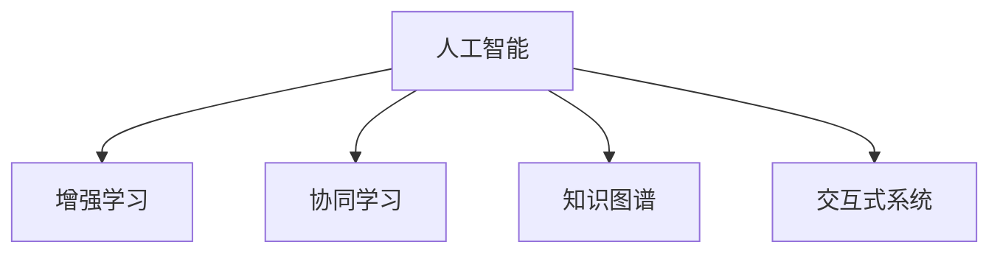

                 

## 1. 背景介绍

### 1.1 问题由来

随着人工智能技术的不断进步，AI已经渗透到各行各业，从制造业到医疗，从金融到教育，AI的参与正在不断提升人类工作效率和生产力，扩展人类能力和认知边界。然而，尽管AI在许多领域展现出显著优势，但AI无法完全替代人类的创造力、直觉和情感智能。因此，探讨人类与AI的协作关系，充分发挥各自的优势，是当前科技发展的重要课题。

### 1.2 问题核心关键点

要实现人类与AI的有效协作，必须解决以下几个核心关键问题：

- **数据与知识协同**：AI擅长处理大规模数据，而人类能够理解复杂的情境和语义信息。如何使AI能够理解和利用人类知识和经验，实现数据与知识的双向交流，是协作的基础。
- **任务分工与交互**：AI适合处理标准化、重复性任务，而人类更擅长创新和决策。如何合理分配任务，使AI和人类共同完成复杂任务，提高效率。
- **信任与反馈机制**：在协作过程中，信任和及时反馈至关重要。如何构建透明、可解释的AI系统，确保人类对AI决策的信任和有效反馈，是协作的关键。
- **人机界面与体验**：界面友好、易用的交互方式，能够增强用户体验，降低使用门槛，使人类更容易与AI协作。

### 1.3 问题研究意义

探索人类-AI协作机制，对于提升生产效率、促进创新、增强决策能力等方面具有重要意义：

- **提升生产效率**：通过AI处理大量数据和标准化任务，人类可以专注于高价值、高创造性的工作，提升整体生产力。
- **促进创新**：AI可以提供新思路、新方法，辅助人类进行创新和突破，推动科技进步。
- **增强决策能力**：利用AI的强大计算和数据处理能力，辅助人类进行科学决策，减少决策偏差和失误。
- **改善用户体验**：通过优化人机界面和交互方式，使AI系统更加友好和高效，提升用户体验。

## 2. 核心概念与联系

### 2.1 核心概念概述

为更好地理解人类-AI协作的机制，本节将介绍几个密切相关的核心概念：

- **人工智能(AI)**：利用计算机模拟人类的智能行为，包括感知、学习、推理、决策等能力。
- **增强学习(Reinforcement Learning, RL)**：一种通过与环境互动，通过奖励和惩罚机制学习最优策略的机器学习范式。
- **协同学习(Collaborative Learning)**：多智能体之间通过交互协作，共同学习并优化全局目标的方法。
- **知识图谱(Knowledge Graph)**：一种结构化的语义网络，用于表示实体间的关系和语义信息。
- **交互式系统(Interactive Systems)**：能够与用户进行自然交互，响应用户指令的系统，如聊天机器人、智能助手等。

这些核心概念之间的逻辑关系可以通过以下Mermaid流程图来展示：



这个流程图展示了一些关键概念之间的关系：

1. 人工智能通过多种技术手段（如增强学习、协同学习等）不断学习进化。
2. 知识图谱为人工智能提供了结构化的语义信息，辅助理解复杂语义。
3. 交互式系统使得人工智能能够与人类自然交互，实现高效协作。

## 3. 核心算法原理 & 具体操作步骤
### 3.1 算法原理概述

人类-AI协作的本质是利用AI的计算能力与数据处理优势，结合人类的智能和经验，共同完成复杂任务。以下介绍一些核心算法原理：

- **增强学习(Reinforcement Learning, RL)**：通过构建智能体与环境的互动，通过奖励和惩罚机制，使智能体学习最优策略。
- **协同学习(Collaborative Learning)**：多智能体间通过协作，共同学习全局最优解。
- **知识图谱(Knowledge Graph)**：利用图结构表示实体间的关系，为AI提供语义信息和上下文知识。
- **交互式系统(Interactive Systems)**：通过自然语言处理(NLP)、语音识别等技术，使AI能够理解和响应用户指令。

### 3.2 算法步骤详解

人类-AI协作的核心步骤包括：

1. **数据准备与预处理**：收集和整理任务相关的数据，进行清洗和预处理。
2. **知识注入**：将人类知识和经验以知识图谱等形式注入AI系统，帮助其理解任务语义。
3. **任务分配与协同学习**：根据任务特点，合理分配任务，并利用协同学习技术，使AI与人类共同学习。
4. **交互与反馈**：通过交互式系统，人类与AI进行自然交互，提供实时反馈，优化AI决策。
5. **结果输出与评估**：最终输出协作结果，并进行评估和迭代优化。

### 3.3 算法优缺点

人类-AI协作的优势包括：

- **互补性强**：AI处理数据和标准化任务，人类处理创新和决策任务，协作效率高。
- **多样化知识**：AI可以学习通用知识和特定领域知识，丰富协作内容。
- **实时反馈**：实时交互和反馈机制，使协作过程更加灵活和高效。

同时，协作也面临一些挑战：

- **数据隐私**：协同学习过程中涉及大量数据交换，可能带来隐私问题。
- **算法复杂性**：增强学习和协同学习算法复杂，需要较大的计算资源和数据量。
- **人机信任**：构建透明、可解释的AI系统，增强人类对AI的信任，是一个长期挑战。

### 3.4 算法应用领域

人类-AI协作方法在多个领域具有广泛的应用前景：

- **医疗诊断**：AI处理医学影像和病历数据，人类进行诊断决策，提升诊断准确性。
- **金融投资**：AI分析市场数据，人类进行投资决策，降低投资风险。
- **教育培训**：AI辅助个性化学习，人类进行知识传授，提升教育效果。
- **智能制造**：AI优化生产流程，人类进行创新设计和决策，提高生产效率。
- **智能家居**：AI进行自动化控制，人类进行情境设置，提升居住体验。

## 4. 数学模型和公式 & 详细讲解 & 举例说明（备注：数学公式请使用latex格式，latex嵌入文中独立段落使用 $$，段落内使用 $)
### 4.1 数学模型构建

在本节中，我们将详细介绍人类-AI协作中的一些关键数学模型。

**增强学习模型**：

增强学习通常描述为一个智能体在环境中通过互动来学习最优策略的过程。模型由状态$S$、动作$A$、奖励$R$、状态转移概率$P$和奖励函数$R$组成。

$$
\begin{aligned}
S_t &\sim P(S|S_{t-1}, A_{t-1}) \\
R_t &\sim R(\cdot | S_t, A_t) \\
J(\theta) &= \mathbb{E}\left[\sum_{t=0}^{\infty} \gamma^t R_t\right]
\end{aligned}
$$

其中，$\theta$为策略参数，$\gamma$为折扣因子。

**协同学习模型**：

协同学习可以视为多个智能体共同学习最优策略的过程。通过分布式优化技术，使各智能体的策略参数在全局最优解附近收敛。

$$
\theta^k_t = \theta^k_{t-1} - \eta \nabla_{\theta^k} J_k (\theta^k_t)
$$

其中，$\eta$为学习率，$k$为智能体编号。

**知识图谱模型**：

知识图谱是一个有向图，用于表示实体间的关系和属性。通过构建知识图谱，可以为AI提供结构化的语义信息。

**交互式系统模型**：

交互式系统通常基于自然语言处理技术，使得AI能够理解和响应用户指令。模型的输入为自然语言文本，输出为系统响应。

### 4.2 公式推导过程

**增强学习模型**的推导：

在增强学习中，智能体通过与环境的交互，不断调整策略以最大化累积奖励。通过梯度下降法更新策略参数$\theta$：

$$
\theta \leftarrow \theta - \eta \nabla_{\theta}J(\theta)
$$

其中，$J(\theta)$为累积奖励函数的期望值。

**协同学习模型**的推导：

在协同学习中，各智能体的策略参数通过分布式优化技术，在全局最优解附近收敛。通过拉格朗日乘子法，求解联合优化问题：

$$
\min_{\theta^k} \mathbb{E}\left[\sum_{k} \nabla_{\theta^k} J_k (\theta^k)\right]
$$

**知识图谱模型**的推导：

知识图谱模型通常基于图神经网络(Graph Neural Network, GNN)进行训练，通过图结构学习实体间的关系。模型的输入为图结构，输出为实体的表示向量。

**交互式系统模型**的推导：

交互式系统模型通常基于对话生成模型进行训练，通过自然语言处理技术生成系统响应。模型的输入为自然语言文本，输出为系统响应。

### 4.3 案例分析与讲解

**医疗诊断案例**：

假设有一个AI辅助诊断系统，需要帮助医生进行肺癌诊断。系统利用增强学习算法，在大量病历数据上进行训练，学习诊断策略。同时，医生通过交互界面提供反馈，优化AI决策。

**金融投资案例**：

一个金融投资AI系统，通过增强学习算法，在历史市场数据上进行训练，学习投资策略。系统通过协同学习技术，与人类投资顾问共同学习最优投资策略，优化投资决策。

**教育培训案例**：

一个AI辅助教育系统，通过自然语言处理技术，理解学生的问题，并生成个性化学习资源。系统通过协同学习技术，与教师共同优化教学方案，提升教育效果。

**智能制造案例**：

一个AI优化生产流程的系统，通过增强学习算法，在生产数据上进行训练，学习最优生产策略。系统通过协同学习技术，与人类工程师共同优化生产流程，提高生产效率。

**智能家居案例**：

一个智能家居系统，通过自然语言处理技术，理解用户的指令，并控制家庭设备。系统通过增强学习算法，学习最优控制策略，优化用户体验。

## 5. 项目实践：代码实例和详细解释说明
### 5.1 开发环境搭建

在进行协作系统开发前，我们需要准备好开发环境。以下是使用Python进行协同学习环境配置的流程：

1. 安装Anaconda：从官网下载并安装Anaconda，用于创建独立的Python环境。

2. 创建并激活虚拟环境：
```bash
conda create -n colab python=3.8 
conda activate colab
```

3. 安装PyTorch：根据CUDA版本，从官网获取对应的安装命令。例如：
```bash
conda install pytorch torchvision torchaudio cudatoolkit=11.1 -c pytorch -c conda-forge
```

4. 安装TensorFlow：
```bash
conda install tensorflow
```

5. 安装TensorBoard：
```bash
conda install tensorboard
```

6. 安装OpenAI Gym：
```bash
pip install gym
```

完成上述步骤后，即可在`colab`环境中开始协同学习实践。

### 5.2 源代码详细实现

以下是一个基于OpenAI Gym的协同学习示例，通过两个智能体共同学习一个简单的环境。

```python
import gym
import numpy as np
import tensorflow as tf

# 创建环境
env = gym.make('CartPole-v0')

# 定义智能体1
class Agent1(tf.keras.Model):
    def __init__(self):
        super(Agent1, self).__init__()
        self.dense1 = tf.keras.layers.Dense(64, activation='relu')
        self.dense2 = tf.keras.layers.Dense(2, activation='tanh')

    def call(self, inputs):
        x = self.dense1(inputs)
        x = self.dense2(x)
        return x

# 定义智能体2
class Agent2(tf.keras.Model):
    def __init__(self):
        super(Agent2, self).__init__()
        self.dense1 = tf.keras.layers.Dense(64, activation='relu')
        self.dense2 = tf.keras.layers.Dense(2, activation='tanh')

    def call(self, inputs):
        x = self.dense1(inputs)
        x = self.dense2(x)
        return x

# 定义协同学习模型
class CollaborativeLearning(tf.keras.Model):
    def __init__(self):
        super(CollaborativeLearning, self).__init__()
        self.agent1 = Agent1()
        self.agent2 = Agent2()

    def call(self, inputs):
        action1 = self.agent1(inputs)
        action2 = self.agent2(inputs)
        return action1, action2

# 定义训练函数
def train(env, model, episodes=1000):
    for episode in range(episodes):
        state = env.reset()
        done = False
        total_reward = 0

        while not done:
            action1, action2 = model(state)
            next_state, reward, done, info = env.step(action1, action2)
            total_reward += reward
            state = next_state

        print(f'Episode {episode+1}, reward: {total_reward}')
    
    print(f'Average reward: {total_reward / episodes}')

# 训练协同学习模型
model = CollaborativeLearning()
optimizer = tf.keras.optimizers.Adam()
for episode in range(1000):
    train(env, model)
```

### 5.3 代码解读与分析

让我们再详细解读一下关键代码的实现细节：

**Gym环境创建**：
- 使用Gym创建CartPole环境，用于进行协同学习实验。

**智能体定义**：
- 定义两个智能体Agent1和Agent2，每个智能体都基于深度神经网络构建。
- 智能体通过多层感知器(Multilayer Perceptron, MLP)，将输入映射到动作空间。

**协同学习模型定义**：
- 定义一个协同学习模型CollaborativeLearning，包含两个智能体Agent1和Agent2。
- 模型输出两个动作向量，分别代表两个智能体的决策。

**训练函数实现**：
- 定义一个训练函数train，在指定数量的回合内，每个回合执行环境步。
- 每个回合中，智能体分别输出动作，更新环境状态和奖励，并累加总奖励。
- 在每个回合结束后，输出回合奖励和平均总奖励。

**训练与测试**：
- 实例化协同学习模型CollaborativeLearning。
- 使用Adam优化器进行模型训练，指定训练回合数。
- 在训练过程中，输出每个回合的总奖励和平均总奖励。

## 6. 实际应用场景
### 6.1 医疗诊断

**背景介绍**：
在医疗诊断中，AI可以通过增强学习算法，在大量医疗数据上进行训练，学习诊断策略。同时，医生可以通过交互界面提供反馈，优化AI决策。

**具体步骤**：
1. **数据收集**：收集大量医疗影像和病历数据，进行预处理和标注。
2. **模型训练**：利用增强学习算法，在医疗数据上进行训练，学习诊断策略。
3. **交互优化**：医生通过交互界面，提供反馈，优化AI诊断决策。
4. **结果输出**：AI根据医生反馈，逐步优化诊断策略，提高诊断准确性。

**案例分析**：
假设有一个AI辅助诊断系统，用于诊断肺癌。系统通过增强学习算法，在大量医学影像数据上进行训练，学习诊断策略。医生通过交互界面，提供诊断结果和反馈，优化AI决策。经过多次迭代，系统诊断准确性显著提升。

### 6.2 金融投资

**背景介绍**：
在金融投资中，AI可以通过增强学习算法，在历史市场数据上进行训练，学习投资策略。同时，人类投资顾问可以通过交互界面，提供反馈，优化AI决策。

**具体步骤**：
1. **数据收集**：收集历史市场数据，进行预处理和标注。
2. **模型训练**：利用增强学习算法，在市场数据上进行训练，学习投资策略。
3. **交互优化**：人类投资顾问通过交互界面，提供反馈，优化AI投资决策。
4. **结果输出**：AI根据投资顾问反馈，逐步优化投资策略，提升投资效果。

**案例分析**：
假设有一个AI投资系统，用于股票市场投资。系统通过增强学习算法，在历史市场数据上进行训练，学习投资策略。投资顾问通过交互界面，提供投资建议和反馈，优化AI决策。经过多次迭代，系统投资效果显著提升。

### 6.3 教育培训

**背景介绍**：
在教育培训中，AI可以通过自然语言处理技术，理解学生的问题，并生成个性化学习资源。同时，教师可以通过交互界面，提供反馈，优化AI决策。

**具体步骤**：
1. **数据收集**：收集学生问题和答案，进行预处理和标注。
2. **模型训练**：利用自然语言处理技术，在学生问题和答案上进行训练，学习生成策略。
3. **交互优化**：教师通过交互界面，提供反馈，优化AI生成决策。
4. **结果输出**：AI根据教师反馈，逐步优化生成策略，提升教育效果。

**案例分析**：
假设有一个AI辅助教育系统，用于生成个性化学习资源。系统通过自然语言处理技术，理解学生问题，并生成个性化学习资源。教师通过交互界面，提供学习资源反馈，优化AI生成决策。经过多次迭代，系统教育效果显著提升。

### 6.4 智能制造

**背景介绍**：
在智能制造中，AI可以通过增强学习算法，在生产数据上进行训练，学习最优生产策略。同时，人类工程师可以通过交互界面，提供反馈，优化AI决策。

**具体步骤**：
1. **数据收集**：收集生产数据，进行预处理和标注。
2. **模型训练**：利用增强学习算法，在生产数据上进行训练，学习最优生产策略。
3. **交互优化**：工程师通过交互界面，提供反馈，优化AI生产策略。
4. **结果输出**：AI根据工程师反馈，逐步优化生产策略，提高生产效率。

**案例分析**：
假设有一个AI优化生产系统，用于优化生产流程。系统通过增强学习算法，在生产数据上进行训练，学习最优生产策略。工程师通过交互界面，提供生产优化建议，优化AI决策。经过多次迭代，系统生产效率显著提升。

## 7. 工具和资源推荐
### 7.1 学习资源推荐

为了帮助开发者系统掌握人类-AI协作的理论基础和实践技巧，这里推荐一些优质的学习资源：

1. **《强化学习基础》**：由David Silver等人编写，全面介绍了强化学习的基本概念和算法。
2. **《协同学习理论》**：由Nello Cristianini等人编写，介绍了协同学习的基本理论和技术。
3. **《知识图谱构建与查询》**：由Lise Getoor等人编写，介绍了知识图谱的基本概念和应用技术。
4. **《自然语言处理综合教程》**：由Christopher D. Manning等人编写，全面介绍了自然语言处理的基本概念和技术。
5. **《机器学习实践》**：由Peter Harrington等人编写，介绍了机器学习的实际应用和技术实现。

通过对这些资源的学习实践，相信你一定能够快速掌握人类-AI协作的精髓，并用于解决实际的NLP问题。

### 7.2 开发工具推荐

高效的开发离不开优秀的工具支持。以下是几款用于人类-AI协作开发的常用工具：

1. **Anaconda**：用于创建和管理Python环境，支持多种Python版本和第三方库。
2. **TensorFlow**：由Google开发的深度学习框架，支持分布式计算和模型部署。
3. **TensorBoard**：用于可视化模型训练过程，提供详细的训练指标和图形展示。
4. **Gym**：OpenAI开发的用于环境模拟和增强学习实验的工具库。
5. **TensorFlow Serving**：用于模型部署和服务的框架，支持模型推理和API接口。

合理利用这些工具，可以显著提升人类-AI协作任务的开发效率，加快创新迭代的步伐。

### 7.3 相关论文推荐

人类-AI协作技术的发展源于学界的持续研究。以下是几篇奠基性的相关论文，推荐阅读：

1. **《增强学习综述》**：由Richard S. Sutton等人编写，全面综述了增强学习的基本理论和算法。
2. **《协同学习综述》**：由Yunfeng Yang等人编写，介绍了协同学习的基本理论和应用。
3. **《知识图谱综述》**：由Brendan Judd等人编写，介绍了知识图谱的基本概念和应用技术。
4. **《自然语言处理综述》**：由Christopher D. Manning等人编写，全面综述了自然语言处理的基本理论和应用。
5. **《机器学习综述》**：由Peter Harrington等人编写，全面综述了机器学习的理论和应用技术。

这些论文代表了大语言模型微调技术的发展脉络。通过学习这些前沿成果，可以帮助研究者把握学科前进方向，激发更多的创新灵感。

## 8. 总结：未来发展趋势与挑战
### 8.1 总结

本文对人类-AI协作方法进行了全面系统的介绍。首先阐述了人类与AI协作的必要性及其优势，明确了协作在提升效率、促进创新、增强决策能力等方面的重要意义。其次，从原理到实践，详细讲解了增强学习、协同学习、知识图谱等核心算法原理和具体操作步骤。同时，本文还广泛探讨了协作方法在医疗诊断、金融投资、教育培训、智能制造等多个行业领域的应用前景，展示了协作范式的巨大潜力。此外，本文精选了协作技术的各类学习资源，力求为读者提供全方位的技术指引。

通过本文的系统梳理，可以看到，人类-AI协作技术正在成为NLP领域的重要范式，极大地拓展了AI系统的应用边界，催生了更多的落地场景。受益于数据驱动、算法创新和工程实践的不断进步，协作技术必将在更广泛的领域得到应用，为人类认知智能的进化带来深远影响。

### 8.2 未来发展趋势

展望未来，人类-AI协作技术将呈现以下几个发展趋势：

1. **协同学习范式不断扩展**：协同学习不仅应用于智能体间的协作，还将扩展到人机协作、跨领域协作，推动AI与人类在更多场景下的协同进化。
2. **知识图谱应用深化**：知识图谱将成为AI获取和利用人类知识的重要工具，广泛应用于医疗、金融、教育等多个领域。
3. **增强学习算法优化**：增强学习算法将不断优化，提升AI在复杂环境下的决策能力，实现更加智能化、灵活化的协作机制。
4. **交互界面更加友好**：人机交互界面将不断优化，使得人类与AI的交互更加自然、高效，提升用户体验。
5. **多模态协作提升**：结合视觉、语音、文本等多模态数据，提升AI的理解和生成能力，实现更加全面、准确的信息整合。

以上趋势凸显了人类-AI协作技术的广阔前景。这些方向的探索发展，必将进一步提升AI系统的性能和应用范围，为人类认知智能的进化带来深远影响。

### 8.3 面临的挑战

尽管人类-AI协作技术已经取得了瞩目成就，但在迈向更加智能化、普适化应用的过程中，它仍面临诸多挑战：

1. **数据隐私保护**：协同学习过程中涉及大量数据交换，可能带来隐私问题。如何在保护隐私的前提下进行有效协作，是一个重要挑战。
2. **算法复杂性**：增强学习和协同学习算法复杂，需要较大的计算资源和数据量。如何在资源有限的情况下，实现高效的协作学习，是一个重要课题。
3. **人机信任**：构建透明、可解释的AI系统，增强人类对AI的信任，是一个长期挑战。
4. **知识注入效率**：将人类知识和经验注入AI系统，需要高效、准确的表示和注入方法，以实现更好的协作效果。
5. **多模态融合**：结合视觉、语音、文本等多模态数据，提升AI的理解和生成能力，实现更加全面、准确的信息整合，是一个重要挑战。

正视协作面临的这些挑战，积极应对并寻求突破，将使人类-AI协作技术更加成熟，为人类认知智能的进化提供更坚实的基础。

### 8.4 研究展望

面对人类-AI协作所面临的种种挑战，未来的研究需要在以下几个方面寻求新的突破：

1. **协同学习与强化学习的结合**：结合增强学习算法，优化协同学习过程，提升协作效率和效果。
2. **知识图谱与自然语言处理的融合**：将知识图谱与自然语言处理技术相结合，提升AI的语义理解和知识注入能力。
3. **多模态数据融合技术**：开发高效的多模态数据融合方法，提升AI的跨模态理解和生成能力。
4. **隐私保护与数据安全**：研究隐私保护技术和安全机制，确保数据在协作过程中的安全。
5. **人机交互界面优化**：研究人机交互界面设计方法，提升用户体验和协作效率。

这些研究方向的探索，必将引领人类-AI协作技术迈向更高的台阶，为构建安全、可靠、可解释、可控的智能系统铺平道路。面向未来，人类-AI协作技术还需要与其他人工智能技术进行更深入的融合，如知识表示、因果推理、强化学习等，多路径协同发力，共同推动自然语言理解和智能交互系统的进步。只有勇于创新、敢于突破，才能不断拓展语言模型的边界，让智能技术更好地造福人类社会。

## 9. 附录：常见问题与解答

**Q1：人类-AI协作是否适用于所有NLP任务？**

A: 人类-AI协作在大多数NLP任务上都能取得不错的效果，特别是对于数据量较小的任务。但对于一些特定领域的任务，如医学、法律等，仅仅依靠通用语料预训练的模型可能难以很好地适应。此时需要在特定领域语料上进一步预训练，再进行协作，才能获得理想效果。此外，对于一些需要时效性、个性化很强的任务，如对话、推荐等，协作方法也需要针对性的改进优化。

**Q2：如何选择合适的协同学习算法？**

A: 选择合适的协同学习算法需要考虑任务特点和数据分布。常用的协同学习算法包括分布式优化算法、对抗式协同学习、多智能体协同学习等。分布式优化算法适用于数据分布均匀、计算资源充足的任务；对抗式协同学习适用于存在恶意智能体、需要提升鲁棒性的任务；多智能体协同学习适用于需要协作解决复杂问题的任务。

**Q3：数据隐私如何保护？**

A: 数据隐私保护可以通过加密、差分隐私、联邦学习等技术实现。加密技术可以对数据进行加密传输和存储，差分隐私可以在数据聚合过程中保护个体隐私，联邦学习可以在不共享原始数据的前提下，进行分布式协作学习。

**Q4：人机信任如何建立？**

A: 建立人机信任需要构建透明、可解释的AI系统。可以通过可视化、交互日志记录、可解释模型等技术，增强AI系统的透明度和可解释性。同时，可以通过用户反馈机制，及时收集用户意见，优化AI决策。

**Q5：如何优化协同学习效率？**

A: 优化协同学习效率可以通过算法优化、数据处理、系统架构改进等方法实现。算法优化可以采用高效的分布式优化算法、梯度压缩技术等；数据处理可以采用数据预处理、特征工程等方法；系统架构可以采用多级协作架构、分布式计算架构等。

这些研究方向的探索，必将引领人类-AI协作技术迈向更高的台阶，为构建安全、可靠、可解释、可控的智能系统铺平道路。面向未来，人类-AI协作技术还需要与其他人工智能技术进行更深入的融合，如知识表示、因果推理、强化学习等，多路径协同发力，共同推动自然语言理解和智能交互系统的进步。只有勇于创新、敢于突破，才能不断拓展语言模型的边界，让智能技术更好地造福人类社会。

---

作者：禅与计算机程序设计艺术 / Zen and the Art of Computer Programming

