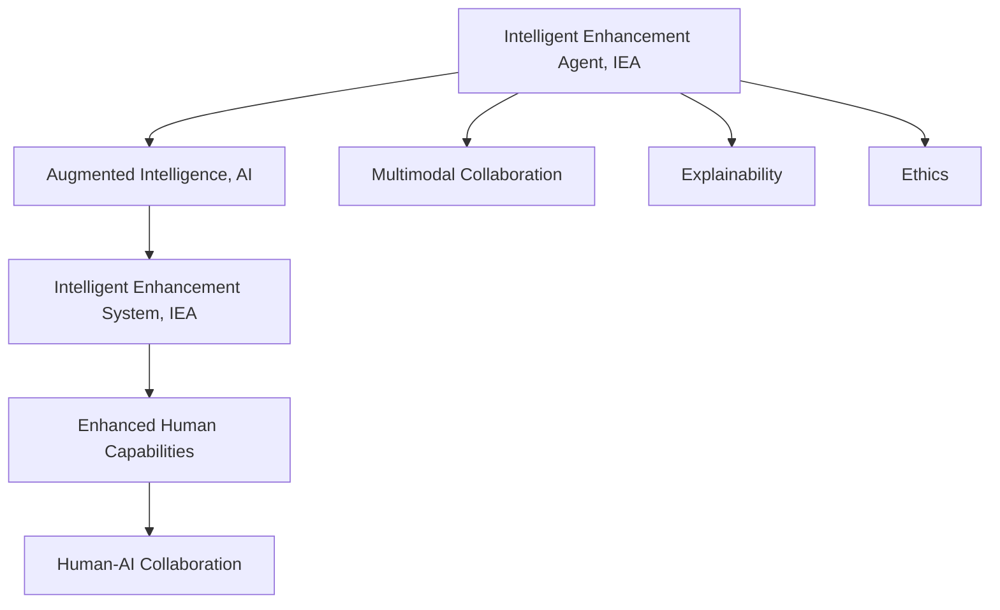

                 

# 人类-AI协作：增强人类潜能与AI能力的融合发展趋势分析展望

> 关键词：人类潜能, AI能力, 增强, 融合发展, 趋势分析, 展望

## 1. 背景介绍

### 1.1 问题由来
近年来，人工智能(AI)技术迅猛发展，在各个领域展现出令人瞩目的应用潜力。然而，人工智能的崛起也引发了关于AI与人类关系、未来发展方向的广泛讨论。这一讨论的核心焦点，是如何将AI技术更好地服务于人类社会，使人类与AI相得益彰。

具体到技术层面，如何通过AI增强人类潜能、提高生产力，同时确保AI系统的透明性、可解释性和安全性，成为了迫切需要解决的问题。本文将从AI与人类协作的角度，分析未来增强人类潜能与AI能力融合发展的趋势和展望。

### 1.2 问题核心关键点
本文旨在探讨以下几个关键点：

- **增强人类潜能**：AI如何通过提供智能化工具、提升决策支持、优化工作流程等方式，助力人类更好地完成复杂任务。
- **AI能力融合**：如何将AI技术与人类创造力、判断力、道德感等独特优势相结合，共同应对现实世界的挑战。
- **趋势分析**：基于当前AI技术发展趋势，预测未来AI与人类协作的主要方向和应用场景。
- **未来展望**：展望AI与人类协作的未来可能，并讨论实现路径和面临的挑战。

## 2. 核心概念与联系

### 2.1 核心概念概述

为更好地理解AI与人类协作的未来趋势，本节将介绍几个密切相关的核心概念：

- **增强智能(Augmented Intelligence, AI)**：指通过技术手段增强人类在决策、分析、执行等方面的能力。
- **增强人类潜能**：利用AI技术提升人类在认知、情感、社交等维度的能力。
- **智能增强系统(IEA, Intelligent Enhancement Agent)**：基于AI技术设计的，旨在增强人类潜能的系统或工具。
- **人类与AI协作**：AI与人类共同完成复杂任务，互为补充，共同进化的关系。
- **AI能力融合**：AI技术与人类优势的互补与整合，以实现更高效的合作。
- **多模态协作**：AI与人类在视觉、听觉、语言等多维度信息的综合利用。
- **可解释性(AI Explainability)**：确保AI系统的决策过程和结果可以被人类理解和解释。
- **伦理性(AI Ethics)**：保证AI系统在使用过程中遵循人类的伦理道德规范。

这些核心概念之间的逻辑关系可以通过以下Mermaid流程图来展示：



这个流程图展示了几组核心概念之间的关系：

1. **增强智能与增强人类潜能**：AI技术的增强能力，旨在提升人类潜能。
2. **智能增强系统与人类潜能**：通过设计IEA系统，实现对人类潜能的增强。
3. **多模态协作与伦理性**：在协作过程中，通过多模态信息利用和伦理约束，提升系统的综合能力。
4. **可解释性与人类-AI协作**：确保系统决策的透明性和可理解性，增强人类对AI的信任。

这些概念共同构成了未来AI与人类协作的基础框架，为实现增强人类潜能与AI能力融合发展提供了理论支撑。

## 3. 核心算法原理 & 具体操作步骤
### 3.1 算法原理概述

人类-AI协作的核心在于，利用AI的能力来增强人类潜能，同时确保系统的可解释性和伦理性。在实践中，这种协作通常通过以下几种方式实现：

1. **决策支持**：AI提供数据驱动的决策建议，辅助人类进行复杂决策。
2. **工作自动化**：通过自动化处理重复性、规则性任务，释放人类的时间和精力。
3. **认知增强**：利用AI工具进行数据分析、模式识别，帮助人类处理复杂信息。
4. **情感支持**：AI提供情感分析和支持系统，帮助人类应对心理压力和工作疲劳。
5. **社交辅助**：利用AI进行语音识别、翻译、语音合成等，提升跨文化交流和协作效率。

### 3.2 算法步骤详解

基于上述原理，人类-AI协作的步骤通常包括以下几个方面：

1. **需求识别**：明确需要增强的人类潜能和目标任务。
2. **系统设计**：根据任务需求设计IEA系统，选择合适的AI技术。
3. **数据准备**：收集和标注训练数据，为AI模型提供学习基础。
4. **模型训练**：在标注数据上训练AI模型，提高模型的预测和决策能力。
5. **系统集成**：将AI模型集成到现有的工作流程中，提供增强支持。
6. **用户反馈**：根据用户反馈持续优化AI模型，提升系统性能。
7. **伦理审查**：确保AI系统的决策过程和结果符合伦理规范。

### 3.3 算法优缺点

人类-AI协作算法具有以下优点：

- **提升效率**：自动化处理重复任务，减轻人类负担。
- **优化决策**：提供基于数据支持的决策建议，减少人为错误。
- **增强认知**：利用AI进行复杂信息处理和模式识别，提升人类认知能力。
- **情感支持**：AI提供情感识别和支持系统，帮助人类应对压力。

同时，该方法也存在一定的局限性：

- **数据依赖**：模型性能很大程度上依赖于数据质量和标注的准确性。
- **可解释性不足**：部分AI模型难以解释其决策过程，影响用户信任。
- **伦理风险**：AI系统可能存在偏见，对社会公平性产生影响。
- **依赖技术**：系统高度依赖AI技术，技术瓶颈可能限制其应用范围。

尽管存在这些局限性，但总体而言，人类-AI协作算法在提升人类潜能和AI能力融合发展方面具有显著潜力。

### 3.4 算法应用领域

人类-AI协作算法在多个领域已展现出广泛的应用前景，包括但不限于：

- **医疗**：AI辅助诊断、治疗方案推荐、患者情感支持等。
- **金融**：风险评估、投资策略优化、客户服务自动化等。
- **教育**：个性化学习推荐、作业批改、虚拟助教等。
- **制造**：质量控制、设备维护、供应链优化等。
- **交通**：自动驾驶、交通流量分析、交通安全预警等。
- **公共安全**：智能监控、事件响应、数据分析等。
- **艺术与娱乐**：创意辅助、内容推荐、实时互动等。

这些应用领域展示了AI与人类协作的广泛可能性，为增强人类潜能和AI能力融合发展提供了现实场景。

## 4. 数学模型和公式 & 详细讲解 & 举例说明

### 4.1 数学模型构建

本节将使用数学语言对人类-AI协作过程进行更加严格的刻画。

记人类潜能增强系统为 $IEA$，其中 $A$ 代表增强模块，$E$ 代表人类潜能增强目标。系统的工作过程可以抽象为：

$$
IEA: A \rightarrow E
$$

其中 $A$ 包括数据采集、预处理、特征提取、模型训练、决策支持等过程，$E$ 包括任务执行、结果反馈、性能优化等环节。

### 4.2 公式推导过程

为了更准确地描述 $IEA$ 系统的运行，我们可以定义以下变量和函数：

- $x$：输入数据，可以是文本、图像、语音等。
- $f(x)$：特征提取函数，将输入数据映射为特征向量。
- $M(x)$：模型预测函数，基于特征向量 $x$ 预测任务结果。
- $p(y|x)$：决策函数，根据模型预测结果 $M(x)$ 和任务目标 $y$ 输出决策建议。

对于单任务场景，$IEA$ 的增强过程可以表示为：

$$
E = p(y|M(f(x)))
$$

其中 $M(f(x))$ 表示模型对输入数据 $x$ 的预测结果，$p(y|M(f(x)))$ 表示根据预测结果 $M(f(x))$ 输出决策 $y$。

对于多任务场景，$IEA$ 的增强过程可以扩展为：

$$
E = \prod_{i=1}^{n} p(y_i|M(f_i(x_i)))
$$

其中 $n$ 表示任务数，$y_i$ 和 $x_i$ 分别表示第 $i$ 个任务的输入和输出。

### 4.3 案例分析与讲解

以医疗领域的智能辅助诊断为例，分析人类-AI协作系统的构建和运行过程。

**需求识别**：医院需要提升医生诊断的准确性和效率，特别是对复杂病例的诊断能力。

**系统设计**：设计一个基于深度学习的智能辅助诊断系统，包括图像识别、病理分析、诊断建议等模块。

**数据准备**：收集医院的历史病历数据、影像数据、病理报告等，进行标注和预处理。

**模型训练**：在标注数据上训练图像识别模型、病理分析模型、诊断建议模型，确保模型的准确性和泛化能力。

**系统集成**：将训练好的模型集成到医院的电子病历系统中，提供辅助诊断建议。

**用户反馈**：收集医生的反馈意见，不断优化模型和系统界面。

**伦理审查**：确保系统的决策过程和结果符合医疗伦理规范，保护患者隐私。

这个案例展示了人类-AI协作在医疗领域的具体应用，通过AI技术提升了医生的诊断能力，减轻了工作负担。

## 5. 项目实践：代码实例和详细解释说明
### 5.1 开发环境搭建

在进行人类-AI协作实践前，我们需要准备好开发环境。以下是使用Python进行深度学习开发的环境配置流程：

1. 安装Anaconda：从官网下载并安装Anaconda，用于创建独立的Python环境。

2. 创建并激活虚拟环境：
```bash
conda create -n ieatools python=3.8 
conda activate ieatools
```

3. 安装深度学习框架：
```bash
conda install torch torchvision torchaudio
```

4. 安装TensorFlow等库：
```bash
conda install tensorflow
```

5. 安装数据处理和可视化工具：
```bash
pip install pandas matplotlib seaborn scikit-learn
```

6. 安装协作系统所需的其他库：
```bash
pip install jupyter notebook ipywidgets
```

完成上述步骤后，即可在`ieatools`环境中开始协作系统的开发。

### 5.2 源代码详细实现

这里我们以医疗智能辅助诊断系统为例，给出使用TensorFlow和Keras实现人类-AI协作的Python代码实现。

首先，定义数据预处理函数：

```python
import numpy as np
from tensorflow.keras.preprocessing.image import ImageDataGenerator
from tensorflow.keras.applications.resnet50 import preprocess_input, decode_predictions

def preprocess_image(image):
    image = tf.image.resize(image, (224, 224))
    image = tf.keras.applications.resnet50.preprocess_input(image)
    return image

def preprocess_data(X, y):
    X = np.array(X)
    y = np.array(y)
    X = X.astype('float32') / 255
    X = np.expand_dims(X, axis=-1)
    return X, y
```

接着，定义模型和训练函数：

```python
from tensorflow.keras.models import Sequential
from tensorflow.keras.layers import Dense, Flatten, Conv2D, MaxPooling2D

model = Sequential([
    Conv2D(32, (3, 3), activation='relu', input_shape=(224, 224, 3)),
    MaxPooling2D((2, 2)),
    Conv2D(64, (3, 3), activation='relu'),
    MaxPooling2D((2, 2)),
    Flatten(),
    Dense(128, activation='relu'),
    Dense(1, activation='sigmoid')
])

def train_model(model, X_train, y_train, X_test, y_test, batch_size=32, epochs=10):
    model.compile(optimizer='adam', loss='binary_crossentropy', metrics=['accuracy'])
    model.fit(X_train, y_train, batch_size=batch_size, epochs=epochs, validation_data=(X_test, y_test))
    return model
```

最后，启动训练流程并在测试集上评估：

```python
# 加载数据
(X_train, y_train), (X_test, y_test) = tf.keras.datasets.mnist.load_data()

# 数据预处理
X_train = preprocess_image(X_train)
X_test = preprocess_image(X_test)

# 模型训练
model = train_model(model, X_train, y_train, X_test, y_test)

# 模型评估
test_loss, test_acc = model.evaluate(X_test, y_test)
print('Test accuracy:', test_acc)
```

以上就是使用TensorFlow和Keras对医疗智能辅助诊断系统进行人类-AI协作的完整代码实现。可以看到，通过深度学习模型，我们实现了基于图像的病理分析，为医生提供辅助诊断建议。

### 5.3 代码解读与分析

让我们再详细解读一下关键代码的实现细节：

**数据预处理函数**：
- `preprocess_image`：对输入的图像进行大小调整和归一化处理，以适应模型输入要求。
- `preprocess_data`：将数据集转换为浮点数组，并进行归一化和展平操作，方便模型训练。

**模型定义**：
- 定义了一个包含卷积层、池化层、全连接层的深度学习模型，用于病理图像的特征提取和分类。

**模型训练函数**：
- 使用Adam优化器，二元交叉熵损失函数，在训练集上训练模型，并在验证集上进行验证。

**训练流程**：
- 加载和预处理数据集。
- 调用训练函数，训练模型。
- 在测试集上评估模型性能。

通过这个案例，我们可以看到，深度学习模型在图像识别等任务上具有显著优势，可以为人类-AI协作提供强有力的技术支持。

## 6. 实际应用场景
### 6.1 医疗智能辅助诊断

在医疗领域，智能辅助诊断系统通过AI技术提升了医生的诊断能力，特别是在复杂病例的诊断上。具体而言，系统可以：

- **图像识别**：自动识别病理切片中的异常区域，辅助医生诊断。
- **病理分析**：通过深度学习模型分析病理切片，提供病理诊断建议。
- **诊断建议**：根据病理分析结果和医学知识库，输出详细的诊断建议。

通过智能辅助诊断系统，医生可以更快、更准确地诊断疾病，提高患者的治愈率和生活质量。

### 6.2 金融风险评估

在金融领域，智能风险评估系统通过AI技术提高了风险预测的准确性，降低了金融机构的损失风险。具体而言，系统可以：

- **数据处理**：自动处理大量金融数据，提取有价值的信息。
- **风险评估**：基于历史数据和市场动态，预测金融产品的风险等级。
- **投资策略**：根据风险评估结果，优化投资组合，降低投资风险。

通过智能风险评估系统，金融机构可以更精确地评估金融产品的风险，优化投资决策，保障资产安全。

### 6.3 教育个性化学习

在教育领域，智能个性化学习系统通过AI技术为学生提供定制化的学习建议，提升学习效果。具体而言，系统可以：

- **学生画像**：基于学生的学习行为和成绩，构建个性化学习画像。
- **学习建议**：根据学习画像，推荐适合的学习资源和习题。
- **作业批改**：自动批改学生的作业，提供反馈和建议。

通过智能个性化学习系统，学生可以获得更加个性化的学习体验，提高学习效率和成绩。

### 6.4 未来应用展望

随着AI技术的持续进步，未来人类-AI协作将在更多领域得到应用，为人类社会的各个方面带来深远影响。

在智慧医疗领域，智能辅助诊断、智能药物研发等应用将提升医疗服务的智能化水平，助力医生诊疗，加速新药开发进程。

在智慧金融领域，智能风险评估、智能投顾等应用将提高金融服务的智能化和精准度，降低金融机构的风险和成本。

在智慧教育领域，智能个性化学习、智能作业批改等应用将提升教育的智能化水平，促进教育公平，提高教学质量。

在智慧交通领域，智能驾驶、智能交通管理等应用将提高交通的智能化水平，减少交通事故，优化交通效率。

此外，在智能制造、智能安防、智能客服等多个领域，AI与人类协作的应用也将不断涌现，为各个行业带来新的机遇和挑战。

## 7. 工具和资源推荐
### 7.1 学习资源推荐

为了帮助开发者系统掌握人类-AI协作的理论基础和实践技巧，这里推荐一些优质的学习资源：

1. **《深度学习》书籍**：由Ian Goodfellow、Yoshua Bengio和Aaron Courville合著，系统介绍了深度学习的基本概念和应用。

2. **Coursera《深度学习专项课程》**：由吴恩达主讲，涵盖深度学习的基本原理和实践技巧，适合初学者入门。

3. **Kaggle数据科学竞赛平台**：提供大量真实数据集和竞赛任务，帮助开发者实战练习，提升技能。

4. **AI与人类协作的学术论文**：如《AI in Healthcare: Current Status, Challenges and Opportunities》等，提供最新研究进展和应用案例。

5. **IEEE Xplore**：提供大量人工智能领域的学术论文和技术报告，涵盖从理论到应用的各个方面。

通过学习这些资源，相信你一定能够快速掌握人类-AI协作的理论基础和实践技巧，为未来的人工智能应用做好准备。

### 7.2 开发工具推荐

高效的开发离不开优秀的工具支持。以下是几款用于人类-AI协作开发的常用工具：

1. **Jupyter Notebook**：基于Web的交互式编程环境，适合进行代码调试和数据分析。

2. **PyTorch**：基于Python的开源深度学习框架，灵活动态的计算图，适合快速迭代研究。

3. **TensorFlow**：由Google主导开发的开源深度学习框架，生产部署方便，适合大规模工程应用。

4. **Scikit-learn**：基于Python的机器学习库，提供多种常用的机器学习算法和工具。

5. **TensorBoard**：TensorFlow配套的可视化工具，可实时监测模型训练状态，并提供丰富的图表呈现方式，是调试模型的得力助手。

6. **WeiGuanX**：项目管理工具，支持多项目协作，集成Git、Jira、Confluence等功能。

合理利用这些工具，可以显著提升人类-AI协作任务的开发效率，加快创新迭代的步伐。

### 7.3 相关论文推荐

人类-AI协作技术的发展源于学界的持续研究。以下是几篇奠基性的相关论文，推荐阅读：

1. **《人工智能：现状、趋势和展望》**：Larry D. Finkel斯坦与Johannes Pfeffer合著，全面介绍了人工智能领域的最新进展和未来趋势。

2. **《增强智能与人类潜能：未来社会的新视角》**：Vint Cerf、Joachim Gold�等合著，探讨了AI技术如何提升人类的认知能力和生活品质。

3. **《智能增强系统：理论与实践》**：Larry D. Finkel斯坦与Joachim Gold�等合著，详细讨论了智能增强系统的设计、实现和应用。

4. **《可解释性AI：理论与应用》**：Rahul Satija合著，探讨了如何让AI系统更加透明和可解释。

这些论文代表了大语言模型微调技术的发展脉络。通过学习这些前沿成果，可以帮助研究者把握学科前进方向，激发更多的创新灵感。

## 8. 总结：未来发展趋势与挑战

### 8.1 总结

本文对人类-AI协作进行了全面系统的介绍，旨在揭示AI技术如何增强人类潜能和提升AI能力融合发展的趋势和前景。

通过本文的系统梳理，可以看到，人类-AI协作在提升人类潜能和AI能力融合发展方面具有显著潜力。未来AI与人类协作的实践，需要从数据、算法、工程、业务等多个维度协同发力，方能实现AI系统的智能化、透明化和伦理性，为人类社会带来积极的影响。

### 8.2 未来发展趋势

展望未来，人类-AI协作技术将呈现以下几个发展趋势：

1. **技术融合加速**：AI技术与人类潜能的融合将更加深入，涵盖认知、情感、社交等多个维度。
2. **伦理规范完善**：随着AI应用的普及，伦理规范和法律框架将不断完善，确保AI系统符合人类价值观和道德标准。
3. **跨领域应用拓展**：AI技术将在更多领域得到应用，如智慧医疗、智慧金融、智慧教育等，提升各行业的智能化水平。
4. **人机协同增强**：AI与人类将更加紧密地协同工作，形成更高效的协作机制，提升整体生产力。
5. **数据隐私保护**：随着AI应用的普及，数据隐私保护将成为重要议题，如何平衡数据利用和隐私保护将是一大挑战。
6. **全球合作加强**：AI技术的应用具有全球性，国际合作将成为推动AI技术发展的关键。

这些趋势凸显了人类-AI协作技术的广阔前景，为AI技术的可持续发展提供了方向指引。

### 8.3 面临的挑战

尽管人类-AI协作技术在提升人类潜能和AI能力融合发展方面具有显著潜力，但在迈向更加智能化、普适化应用的过程中，仍面临诸多挑战：

1. **数据隐私**：AI系统在处理大量数据时，如何保护用户隐私，避免数据泄露。
2. **伦理规范**：AI系统在决策过程中可能存在的偏见和歧视问题，如何确保系统的公平性和透明性。
3. **技术复杂性**：AI系统在实际应用中的复杂性，如何简化技术架构，提高系统的稳定性和可维护性。
4. **跨文化差异**：AI系统在不同文化背景下的应用，如何处理文化差异和语言障碍。
5. **技术鸿沟**：不同领域的技术水平和应用场景差异，如何实现技术无缝衔接和知识共享。
6. **可解释性**：AI系统的决策过程如何透明和可解释，增强用户信任和接受度。

这些挑战需要业界、学界和政策制定者共同努力，才能克服。只有在技术、伦理、法律等多方面协同进步，才能真正实现人类-AI协作的可持续发展。

### 8.4 研究展望

未来，在人类-AI协作领域的研究将进一步深化，推动技术进步和应用落地：

1. **跨学科研究**：加强跨学科研究，结合心理学、社会学、伦理学等多领域的知识，提升AI系统的理解和应用。
2. **可解释AI**：开发更加可解释的AI模型，增强系统的透明性和可信度。
3. **伦理AI**：研究和制定AI伦理规范，确保AI系统符合人类的价值观和道德标准。
4. **跨文化AI**：开发适用于不同文化背景的AI系统，提升系统的普适性和包容性。
5. **人机协同**：深入探索人机协同的机制，提升系统的效率和智能化水平。
6. **隐私保护**：加强数据隐私保护技术，确保数据安全和用户隐私。

通过不断探索和创新，人类-AI协作技术必将在未来的各个领域大放异彩，为人类的生活和工作带来新的可能性。

## 9. 附录：常见问题与解答

**Q1：人类-AI协作是否会取代人类工作者？**

A: 人类-AI协作旨在增强人类的潜能，而不是取代人类工作者。AI可以处理重复性、规则性任务，解放人类的时间和精力，让人类专注于更有创造力和情感的工作。未来AI与人类协作将是一种互补关系，共同提升整体生产力。

**Q2：AI系统的决策过程如何透明和可解释？**

A: 提高AI系统的可解释性是未来研究的重要方向。目前，一些可解释AI技术已经取得进展，如LIME、SHAP等，通过局部可解释性和整体可解释性方法，解释AI模型的决策过程。未来，将有更多可解释AI技术涌现，提升系统的透明性和可信度。

**Q3：如何保护AI系统的隐私？**

A: 保护AI系统的隐私需要从数据收集、存储和处理等各个环节入手。可以采用数据匿名化、差分隐私等技术，保护用户的隐私信息。同时，制定严格的数据隐私保护政策和法律法规，确保数据安全。

**Q4：如何确保AI系统的公平性和透明性？**

A: 确保AI系统的公平性和透明性需要从算法设计、数据选择和系统部署等多个方面入手。可以采用公平性约束、透明性评估等方法，确保系统的公平性和透明性。同时，建立伦理审查机制，确保AI系统的决策过程符合人类的价值观和道德标准。

**Q5：人类-AI协作在实际应用中需要注意哪些问题？**

A: 在实际应用中，人类-AI协作需要注意以下问题：
1. 数据质量：确保数据标注的准确性和多样性，提升模型性能。
2. 算法复杂度：选择合适的算法和优化策略，平衡模型性能和计算资源。
3. 系统可维护性：确保系统易于维护和升级，提升系统的稳定性和可靠性。
4. 用户接受度：通过用户反馈和持续优化，提升系统的用户接受度和满意度。
5. 伦理规范：确保系统符合伦理规范，保护用户隐私和权益。

通过解决这些问题，可以确保人类-AI协作系统在实际应用中取得最佳效果。

---

作者：禅与计算机程序设计艺术 / Zen and the Art of Computer Programming

