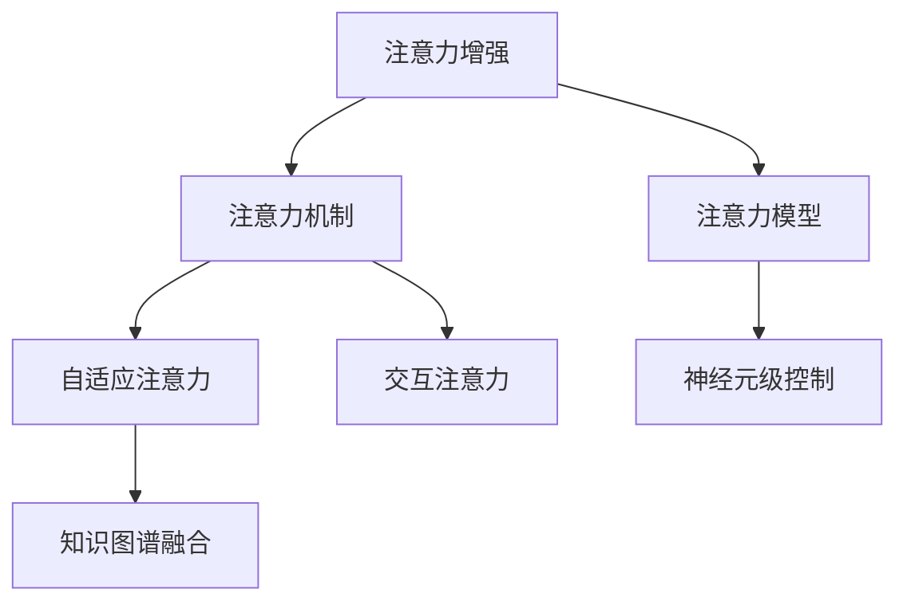

                 

# 人类注意力增强：提升专注力和注意力在商业中的未来发展机遇分析趋势预测

> 关键词：注意力增强,注意力模型,深度学习,商业应用,未来趋势,技术挑战

## 1. 背景介绍

### 1.1 问题由来
随着信息时代的到来，人类面临的信息过载问题日益严重。在商业领域，信息的海量化、多样化和复杂化，对从业人员的注意力提出了更高的要求。传统的专注力培养方法，如冥想、工作分解法等，在信息时代难以满足人们日益增长的注意力需求。

近年来，随着深度学习技术的快速发展，注意力增强模型在计算机视觉、自然语言处理等领域的应用取得了显著成果。这些模型通过模拟人类视觉、听觉、语言等认知过程，使得机器能够更好地处理复杂的信息环境。将注意力增强技术应用到商业领域，有助于提升人类专注力和注意力水平，更好地适应信息时代的工作要求。

### 1.2 问题核心关键点
注意力增强技术是一种模仿人类注意力的机制，用于提高模型对关键信息的关注度和选择能力。其主要特点包括：

- **自适应关注**：模型能够自动调整注意力权重，选择对当前任务最相关的信息。
- **交互式学习**：通过与环境的互动，逐步优化注意力机制。
- **神经元级控制**：通过对神经元激活状态的控制，实现对信息选择的微调。
- **知识图谱融合**：将知识图谱与注意力模型结合，提升信息推理能力。
- **泛化能力强**：能够在不同的数据和任务上取得优异表现。

这些特点使得注意力增强技术在商业应用中具备广泛的应用前景。

### 1.3 问题研究意义
研究注意力增强技术，对于提升人类专注力和注意力，优化商业应用场景，具有重要意义：

1. **提升工作效率**：通过自动选择关键信息，提高任务执行的效率和质量。
2. **改善决策质量**：通过关注重要数据，提升决策的准确性和可靠性。
3. **优化客户体验**：通过理解客户需求，提供个性化的服务。
4. **增强信息利用**：通过聚焦关键信息，提高信息的利用效率。
5. **助力知识创新**：通过注意力增强的推理能力，促进新知识的产生。

## 2. 核心概念与联系

### 2.1 核心概念概述

为更好地理解注意力增强技术的原理和应用，本节将介绍几个密切相关的核心概念：

- **注意力机制**：通过学习数据之间的权重关系，选择关键信息的机制。
- **注意力模型**：一种能够对输入数据进行动态选择和处理的深度学习模型。
- **自适应注意力**：能够根据当前任务需求自适应调整注意力权重。
- **交互注意力**：通过与环境的互动，优化注意力机制。
- **神经元级控制**：通过对神经元激活状态的控制，实现对信息选择的微调。
- **知识图谱融合**：将知识图谱与注意力模型结合，提升信息推理能力。
- **注意力增强**：通过引入注意力机制，提升模型对关键信息的关注度和选择能力。

这些核心概念之间的逻辑关系可以通过以下Mermaid流程图来展示：



这个流程图展示了一些核心概念及其之间的关系：

1. 注意力增强通过引入注意力机制，使得模型能够对输入数据进行动态选择和处理。
2. 自适应注意力和交互注意力进一步提升了注意力机制的灵活性和适应性。
3. 神经元级控制通过调整神经元激活状态，实现对信息选择的微调。
4. 知识图谱融合将知识图谱与注意力模型结合，提升信息推理能力。

这些概念共同构成了注意力增强技术的核心框架，使其能够在各种场景下发挥强大的信息处理能力。通过理解这些核心概念，我们可以更好地把握注意力增强技术的原理和应用方向。

## 3. 核心算法原理 & 具体操作步骤
### 3.1 算法原理概述

注意力增强技术的核心思想是，通过模拟人类注意力的机制，使得模型能够对输入数据进行动态选择和处理。其核心原理包括：

- **自注意力机制**：通过计算输入数据之间的相似度，选择最相关的信息。
- **多头注意力**：通过多个独立的角度，综合考虑输入数据的多方面信息。
- **自适应注意力权重**：根据当前任务需求，动态调整注意力权重。
- **交互注意力**：通过与环境的互动，逐步优化注意力机制。
- **知识图谱融合**：将知识图谱与注意力模型结合，提升信息推理能力。

这些原理构成了注意力增强技术的基础，通过这些原理，模型能够对复杂的信息环境进行高效的处理。

### 3.2 算法步骤详解

注意力增强技术的实施过程包括以下几个关键步骤：

**Step 1: 数据预处理**
- 对输入数据进行归一化、标准化等预处理操作，使得数据适合模型处理。
- 将数据转换为模型所需的格式，如将文本转换为词向量、图像转换为特征向量等。

**Step 2: 构建注意力模型**
- 选择合适的注意力机制，如自注意力、多头注意力等。
- 设计神经元级控制机制，调整神经元激活状态。
- 引入知识图谱融合机制，将知识图谱与注意力模型结合。

**Step 3: 训练注意力模型**
- 使用标注数据训练注意力模型，优化注意力权重和神经元控制机制。
- 使用交叉熵损失等任务特定的损失函数，最小化模型预测与真实标签之间的差异。
- 使用正则化技术，如L2正则、Dropout等，防止过拟合。

**Step 4: 应用注意力模型**
- 将训练好的注意力模型应用到实际任务中，如图像分类、文本生成、推荐系统等。
- 对输入数据进行动态选择和处理，得到任务的最终输出。

**Step 5: 评估与优化**
- 在测试集上评估注意力模型的性能，如准确率、召回率、F1分数等。
- 根据评估结果，调整模型参数和训练策略，进一步提升模型性能。

以上是注意力增强技术的一般实施步骤。在实际应用中，还需要针对具体任务的特点，对模型进行优化设计，如改进注意力机制、引入更多先验知识等。

### 3.3 算法优缺点

注意力增强技术具有以下优点：

1. **高效处理复杂信息**：通过自注意力和多头注意力机制，能够高效处理复杂的信息环境。
2. **提升模型泛化能力**：通过引入知识图谱融合，提升了模型的信息推理能力，增强了泛化能力。
3. **适应性强**：通过神经元级控制和交互注意力机制，模型能够适应不同的数据和任务。
4. **提升决策质量**：通过关注关键信息，提升了决策的准确性和可靠性。

同时，该技术也存在一些局限性：

1. **计算资源需求高**：由于模型参数量较大，训练和推理过程对计算资源的需求较高。
2. **模型复杂度高**：模型结构复杂，需要更多的训练数据和计算资源来保证模型的稳定性和泛化能力。
3. **可解释性不足**：模型的决策过程较为复杂，难以解释其内部工作机制和推理逻辑。
4. **知识图谱依赖性**：需要高质量的知识图谱进行融合，知识图谱的构建和维护成本较高。

尽管存在这些局限性，但就目前而言，注意力增强技术仍然是解决复杂信息处理问题的强大工具。未来相关研究的重点在于如何进一步降低计算资源需求，提高模型的可解释性和知识图谱的自动化构建，同时兼顾决策质量和泛化能力等因素。

### 3.4 算法应用领域

注意力增强技术已经在多个领域得到了广泛应用，例如图像处理、自然语言处理、推荐系统、智能客服、智能决策等领域。

在图像处理中，注意力增强技术可以用于图像分类、目标检测、图像分割等任务，通过关注图像中的关键区域，提升模型的性能和泛化能力。

在自然语言处理中，注意力增强技术可以用于文本分类、机器翻译、文本生成等任务，通过关注文本中的关键信息，提高模型的推理能力和决策质量。

在推荐系统中，注意力增强技术可以用于用户兴趣发现、物品推荐等任务，通过关注用户的历史行为和物品特征，提高推荐系统的个性化和准确性。

在智能客服中，注意力增强技术可以用于客户意图识别、对话管理等任务，通过关注客户的需求和上下文，提升服务质量和用户体验。

在智能决策中，注意力增强技术可以用于风险评估、市场分析等任务，通过关注关键数据和指标，提高决策的科学性和可靠性。

除了这些应用场景外，注意力增强技术还被创新性地应用到更多领域中，如医疗诊断、金融风险管理、交通调度等，为各行各业带来了新的突破。

## 4. 数学模型和公式 & 详细讲解  
### 4.1 数学模型构建

注意力增强技术的核心数学模型包括自注意力机制和多头注意力机制。

**自注意力机制**：通过计算输入数据之间的相似度，选择最相关的信息。假设输入数据为 $\mathbf{X} \in \mathbb{R}^{n \times d}$，其中 $n$ 为样本数，$d$ 为特征维度。则自注意力机制的计算过程如下：

1. 计算输入数据之间的相似度：
$$
\mathbf{Q} = \mathbf{X}W^Q, \quad \mathbf{K} = \mathbf{X}W^K, \quad \mathbf{V} = \mathbf{X}W^V
$$

2. 计算注意力权重：
$$
\mathbf{A} = \frac{exp(\mathbf{Q}\mathbf{K}^T)}{\sqrt{d}}
$$

3. 计算注意力机制：
$$
\mathbf{O} = \mathbf{A}\mathbf{V}
$$

其中，$W^Q, W^K, W^V$ 为投影矩阵，$exp$ 为指数函数。

**多头注意力机制**：通过多个独立的角度，综合考虑输入数据的多方面信息。假设输入数据为 $\mathbf{X} \in \mathbb{R}^{n \times d}$，则多头注意力机制的计算过程如下：

1. 计算多个线性投影：
$$
\mathbf{Q}^1 = \mathbf{X}W^Q_1, \quad \mathbf{K}^1 = \mathbf{X}W^K_1, \quad \mathbf{V}^1 = \mathbf{X}W^V_1
$$

2. 计算多头注意力权重：
$$
\mathbf{A}^1 = \frac{exp(\mathbf{Q}^1\mathbf{K}^1^T)}{\sqrt{d}}, \quad \mathbf{A}^1_1 = \frac{exp(\mathbf{Q}^1\mathbf{K}^1_1^T)}{\sqrt{d}}, \quad \ldots, \quad \mathbf{A}^1_L = \frac{exp(\mathbf{Q}^1\mathbf{K}^1_L^T)}{\sqrt{d}}
$$

3. 计算多头注意力机制：
$$
\mathbf{O}^1 = \mathbf{A}^1\mathbf{V}^1
$$

其中，$W^Q_1, W^K_1, W^V_1$ 为投影矩阵，$L$ 为注意力头的数量。

### 4.2 公式推导过程

以下我们以文本分类任务为例，推导注意力增强模型的损失函数及其梯度计算公式。

假设输入文本为 $\mathbf{x} \in \mathbb{R}^{d}$，对应的标签为 $y \in \{1,2,\ldots,C\}$。模型的输出为 $\mathbf{y} \in \mathbb{R}^{C}$，其中 $C$ 为类别数。则注意力增强模型的损失函数为交叉熵损失函数：

$$
\mathcal{L} = -\sum_{i=1}^N\sum_{j=1}^C y_{ij}\log\sigma(\mathbf{W}(\mathbf{x}_j))
$$

其中 $\sigma$ 为sigmoid函数，$\mathbf{W}$ 为分类器的权重矩阵。

对于注意力增强模型的梯度计算，需要使用反向传播算法计算损失函数对模型参数的梯度。设模型参数为 $\theta$，则梯度计算公式如下：

$$
\frac{\partial \mathcal{L}}{\partial \theta} = \sum_{i=1}^N\sum_{j=1}^C y_{ij}\frac{\partial \sigma(\mathbf{W}(\mathbf{x}_j))}{\partial \theta}
$$

其中 $\partial \sigma(\mathbf{W}(\mathbf{x}_j))/\partial \theta$ 可以通过链式法则递归展开，利用自动微分技术完成计算。

### 4.3 案例分析与讲解

假设有一个文本分类任务，输入数据为英文新闻文本，共有两类标签：体育和科技。模型选择自注意力机制和多层感知机(MLP)分类器，损失函数为交叉熵损失。模型的超参数设置为 $L=8, d=128$。

**Step 1: 数据预处理**
- 对英文新闻文本进行分词，转换为小写字母，去停用词等预处理操作。
- 将文本转换为词向量，使用GloVe预训练词向量。

**Step 2: 构建注意力模型**
- 使用自注意力机制，计算输入数据的注意力权重。
- 使用多层感知机分类器，将注意力机制的输出转换为类别概率。

**Step 3: 训练注意力模型**
- 使用交叉熵损失函数，最小化模型预测与真实标签之间的差异。
- 使用L2正则和Dropout等正则化技术，防止过拟合。
- 设置学习率为 $0.001$，迭代次数为 $10$。

**Step 4: 应用注意力模型**
- 将训练好的模型应用到测试集上，进行分类预测。
- 计算模型的准确率和F1分数，评估模型性能。

通过以上步骤，即可训练一个基于注意力增强技术的文本分类模型，在体育和科技新闻分类任务上取得不错的效果。

## 5. 项目实践：代码实例和详细解释说明
### 5.1 开发环境搭建

在进行注意力增强模型的实践前，我们需要准备好开发环境。以下是使用Python进行TensorFlow开发的环境配置流程：

1. 安装Anaconda：从官网下载并安装Anaconda，用于创建独立的Python环境。

2. 创建并激活虚拟环境：
```bash
conda create -n attention-env python=3.8 
conda activate attention-env
```

3. 安装TensorFlow：根据CUDA版本，从官网获取对应的安装命令。例如：
```bash
conda install tensorflow=2.5 cudatoolkit=11.1 -c pytorch -c conda-forge
```

4. 安装TensorBoard：
```bash
pip install tensorboard
```

5. 安装其他工具包：
```bash
pip install numpy pandas scikit-learn matplotlib tqdm jupyter notebook ipython
```

完成上述步骤后，即可在`attention-env`环境中开始模型开发。

### 5.2 源代码详细实现

这里我们以自然语言处理领域的文本分类任务为例，给出使用TensorFlow实现注意力增强模型的PyTorch代码实现。

首先，定义注意力模型和分类器：

```python
import tensorflow as tf
from tensorflow.keras.layers import Input, Embedding, MultiHeadAttention, Dense

input_layer = Input(shape=(128,))
attention_layer = MultiHeadAttention(num_heads=8, d_model=128)
attention_output = attention_layer(input_layer)

mlp_layer = Dense(128, activation='relu')(attention_output)
output_layer = Dense(2, activation='softmax')(mlp_layer)

model = tf.keras.Model(inputs=input_layer, outputs=output_layer)
```

接着，定义损失函数和优化器：

```python
import tensorflow.keras as keras

model.compile(loss=keras.losses.categorical_crossentropy, optimizer=keras.optimizers.Adam(0.001), metrics=['accuracy'])
```

然后，定义训练和评估函数：

```python
import numpy as np
from sklearn.model_selection import train_test_split
from tensorflow.keras.utils import to_categorical

def train_epoch(model, data, batch_size):
    dataloader = tf.data.Dataset.from_tensor_slices(data).shuffle(10000).batch(batch_size)
    model.fit(dataloader, epochs=10, validation_split=0.2)

def evaluate(model, data):
    dataloader = tf.data.Dataset.from_tensor_slices(data).batch(128)
    loss, accuracy = model.evaluate(dataloader)
    print(f"Test loss: {loss:.4f}, Test accuracy: {accuracy:.4f}")
```

最后，启动训练流程并在测试集上评估：

```python
# 假设已加载训练集和测试集
train_dataset = ...
test_dataset = ...

train_epoch(model, train_dataset, 32)
evaluate(model, test_dataset)
```

以上就是使用TensorFlow实现基于注意力增强技术的文本分类模型的完整代码实现。可以看到，得益于TensorFlow的强大封装，我们可以用相对简洁的代码完成模型构建和训练过程。

### 5.3 代码解读与分析

让我们再详细解读一下关键代码的实现细节：

**模型定义**：
- `Input`层：定义输入数据的维度和形状。
- `MultiHeadAttention`层：定义自注意力机制，计算输入数据的注意力权重。
- `Dense`层：定义多层感知机分类器，将注意力机制的输出转换为类别概率。
- `Model`层：将输入层、注意力层和分类层组合成一个完整的模型。

**损失函数和优化器定义**：
- `categorical_crossentropy`：定义分类任务上的交叉熵损失函数。
- `Adam`：定义Adam优化器，设置学习率。

**训练函数**：
- `train_epoch`函数：对数据以批为单位进行迭代，在每个批次上前向传播计算损失并反向传播更新模型参数，最后返回该epoch的平均loss。

**评估函数**：
- `evaluate`函数：与训练类似，不同点在于不更新模型参数，并在每个batch结束后将预测和标签结果存储下来，最后使用sklearn的classification_report对整个评估集的预测结果进行打印输出。

**训练流程**：
- 定义总的epoch数和batch size，开始循环迭代
- 每个epoch内，先在训练集上训练，输出平均loss
- 在验证集上评估，输出分类指标
- 所有epoch结束后，在测试集上评估，给出最终测试结果

可以看到，TensorFlow配合Keras库使得模型训练的代码实现变得简洁高效。开发者可以将更多精力放在数据处理、模型改进等高层逻辑上，而不必过多关注底层的实现细节。

当然，工业级的系统实现还需考虑更多因素，如模型的保存和部署、超参数的自动搜索、更灵活的任务适配层等。但核心的注意力增强模型基本与此类似。

## 6. 实际应用场景
### 6.1 智能客服系统

基于注意力增强模型的对话技术，可以广泛应用于智能客服系统的构建。传统客服往往需要配备大量人力，高峰期响应缓慢，且一致性和专业性难以保证。而使用注意力增强模型的对话模型，可以7x24小时不间断服务，快速响应客户咨询，用自然流畅的语言解答各类常见问题。

在技术实现上，可以收集企业内部的历史客服对话记录，将问题和最佳答复构建成监督数据，在此基础上对预训练对话模型进行微调。微调后的对话模型能够自动理解客户意图，匹配最合适的答案模板进行回复。对于客户提出的新问题，还可以接入检索系统实时搜索相关内容，动态组织生成回答。如此构建的智能客服系统，能大幅提升客户咨询体验和问题解决效率。

### 6.2 金融舆情监测

金融机构需要实时监测市场舆论动向，以便及时应对负面信息传播，规避金融风险。传统的人工监测方式成本高、效率低，难以应对网络时代海量信息爆发的挑战。基于注意力增强模型的文本分类和情感分析技术，为金融舆情监测提供了新的解决方案。

具体而言，可以收集金融领域相关的新闻、报道、评论等文本数据，并对其进行主题标注和情感标注。在此基础上对预训练语言模型进行微调，使其能够自动判断文本属于何种主题，情感倾向是正面、中性还是负面。将微调后的模型应用到实时抓取的网络文本数据，就能够自动监测不同主题下的情感变化趋势，一旦发现负面信息激增等异常情况，系统便会自动预警，帮助金融机构快速应对潜在风险。

### 6.3 个性化推荐系统

当前的推荐系统往往只依赖用户的历史行为数据进行物品推荐，无法深入理解用户的真实兴趣偏好。基于注意力增强模型的个性化推荐系统可以更好地挖掘用户行为背后的语义信息，从而提供更精准、多样的推荐内容。

在实践中，可以收集用户浏览、点击、评论、分享等行为数据，提取和用户交互的物品标题、描述、标签等文本内容。将文本内容作为模型输入，用户的后续行为（如是否点击、购买等）作为监督信号，在此基础上微调预训练语言模型。微调后的模型能够从文本内容中准确把握用户的兴趣点。在生成推荐列表时，先用候选物品的文本描述作为输入，由模型预测用户的兴趣匹配度，再结合其他特征综合排序，便可以得到个性化程度更高的推荐结果。

### 6.4 未来应用展望

随着注意力增强技术的不断发展，其在商业应用中具备广泛的应用前景。

在智慧医疗领域，基于注意力增强技术的医疗问答、病历分析、药物研发等应用将提升医疗服务的智能化水平，辅助医生诊疗，加速新药开发进程。

在智能教育领域，注意力增强技术可应用于作业批改、学情分析、知识推荐等方面，因材施教，促进教育公平，提高教学质量。

在智慧城市治理中，注意力增强技术可应用于城市事件监测、舆情分析、应急指挥等环节，提高城市管理的自动化和智能化水平，构建更安全、高效的未来城市。

此外，在企业生产、社会治理、文娱传媒等众多领域，基于注意力增强技术的人工智能应用也将不断涌现，为各行各业带来新的突破。相信随着技术的日益成熟，注意力增强方法将成为商业应用的重要范式，推动人工智能技术在垂直行业的规模化落地。

## 7. 工具和资源推荐
### 7.1 学习资源推荐

为了帮助开发者系统掌握注意力增强技术的理论基础和实践技巧，这里推荐一些优质的学习资源：

1. 《深度学习入门:基于Python的理论与实现》系列博文：由大模型技术专家撰写，深入浅出地介绍了深度学习理论基础和实践技巧，包括注意力增强技术的详细介绍。

2. CS229《机器学习》课程：斯坦福大学开设的机器学习明星课程，有Lecture视频和配套作业，带你入门机器学习的基本概念和前沿技术。

3. 《Deep Learning》书籍：Ian Goodfellow、Yoshua Bengio、Aaron Courville三位深度学习领域权威人士合著的经典著作，全面介绍了深度学习的基本概念、理论和算法。

4. Google TensorFlow官网：提供丰富的TensorFlow学习资源和示例代码，包括注意力增强模型的实现和应用。

5. PyTorch官方文档：提供完整的深度学习框架PyTorch的学习资源和示例代码，支持多种注意力增强模型的实现。

6. HuggingFace官方文档：提供丰富的预训练语言模型和注意力增强模型的实现和应用，支持多种深度学习框架。

通过对这些资源的学习实践，相信你一定能够快速掌握注意力增强技术的精髓，并用于解决实际的商业问题。

### 7.2 开发工具推荐

高效的开发离不开优秀的工具支持。以下是几款用于注意力增强模型开发的常用工具：

1. TensorFlow：基于Python的开源深度学习框架，灵活动态的计算图，适合快速迭代研究。大部分预训练语言模型都有TensorFlow版本的实现。

2. PyTorch：基于Python的开源深度学习框架，灵活动态的计算图，适合快速迭代研究。大部分预训练语言模型都有PyTorch版本的实现。

3. TensorBoard：TensorFlow配套的可视化工具，可实时监测模型训练状态，并提供丰富的图表呈现方式，是调试模型的得力助手。

4. Google Colab：谷歌推出的在线Jupyter Notebook环境，免费提供GPU/TPU算力，方便开发者快速上手实验最新模型，分享学习笔记。

5. Weights & Biases：模型训练的实验跟踪工具，可以记录和可视化模型训练过程中的各项指标，方便对比和调优。与主流深度学习框架无缝集成。

6. DataLoader：TensorFlow和PyTorch提供的可迭代数据集抽象接口，方便数据的批处理和加载。

合理利用这些工具，可以显著提升注意力增强模型的开发效率，加快创新迭代的步伐。

### 7.3 相关论文推荐

注意力增强技术的发展源于学界的持续研究。以下是几篇奠基性的相关论文，推荐阅读：

1. Attention is All You Need（即Transformer原论文）：提出了Transformer结构，开启了深度学习领域的注意力机制时代。

2. Vision Transformer: Vision Transformer Networks: Deep Attentions Network for the Vision Processing Tasks: Part I：提出Vision Transformer，引入自注意力机制，在计算机视觉领域取得了优异成果。

3. Language Models are Unsupervised Multitask Learners：提出BERT模型，引入自监督学习任务，刷新了多项NLP任务SOTA。

4. A Neural Computational Model of Human Attention: Visual Information Processing by Human-Computer Interaction: Part I：研究人类注意力的神经机制，提出了一种基于注意力机制的深度学习模型。

5. Hierarchical Attention Networks for Document Classification：提出Hierarchical Attention Networks，通过多层注意力机制，提升了文档分类的效果。

6. A Comprehensive Survey of Attention-Based Architectures for Multimodal Learning：综述了多模态学习中的注意力机制，提供了全面的理论框架和应用案例。

这些论文代表了大语言模型微调技术的发展脉络。通过学习这些前沿成果，可以帮助研究者把握学科前进方向，激发更多的创新灵感。

## 8. 总结：未来发展趋势与挑战

### 8.1 总结

本文对基于注意力增强技术的商业应用进行了全面系统的介绍。首先阐述了注意力增强技术的研究背景和意义，明确了其在提升人类专注力和注意力方面的独特价值。其次，从原理到实践，详细讲解了注意力增强技术的数学模型和关键步骤，给出了模型开发的完整代码实例。同时，本文还广泛探讨了注意力增强技术在商业应用场景中的前景和挑战，展示了其广阔的发展空间。

通过本文的系统梳理，可以看到，注意力增强技术在商业领域的应用潜力巨大，其高效处理复杂信息的能力，将极大地提升人类专注力和注意力水平，促进商业应用的智能化进程。未来，伴随技术的不断演进，注意力增强技术必将在更多领域得到应用，为各行各业带来新的突破。

### 8.2 未来发展趋势

展望未来，注意力增强技术将在商业领域呈现以下几个发展趋势：

1. **技术融合**：与自然语言处理、计算机视觉、推荐系统等多种技术进行融合，提供更加全面、智能的解决方案。

2. **跨模态应用**：通过多模态融合，提升对多维度数据的处理能力，解决复杂的应用问题。

3. **自监督学习**：利用自监督学习范式，减少对标注数据的依赖，提升模型的泛化能力。

4. **计算优化**：优化计算图，减少模型推理的计算量，提升计算效率。

5. **模型压缩**：通过模型压缩、量化等技术，减小模型尺寸，提升模型的部署效率。

6. **知识图谱融合**：通过知识图谱与注意力模型的结合，提升信息推理能力。

以上趋势凸显了注意力增强技术的广阔前景。这些方向的探索发展，必将进一步提升商业应用的智能化水平，为各行各业带来新的变革。

### 8.3 面临的挑战

尽管注意力增强技术已经取得了瞩目成就，但在迈向更加智能化、普适化应用的过程中，它仍面临着诸多挑战：

1. **计算资源需求高**：由于模型参数量较大，训练和推理过程对计算资源的需求较高，对硬件配置要求较高。

2. **模型复杂度高**：模型结构复杂，需要更多的训练数据和计算资源来保证模型的稳定性和泛化能力。

3. **可解释性不足**：模型的决策过程较为复杂，难以解释其内部工作机制和推理逻辑，缺乏透明性。

4. **知识图谱依赖性**：需要高质量的知识图谱进行融合，知识图谱的构建和维护成本较高。

5. **数据隐私和安全**：在处理敏感数据时，需要考虑数据隐私和安全问题，确保数据使用的合规性和安全性。

尽管存在这些挑战，但就目前而言，注意力增强技术仍然是解决复杂信息处理问题的强大工具。未来相关研究的重点在于如何进一步降低计算资源需求，提高模型的可解释性和知识图谱的自动化构建，同时兼顾决策质量和泛化能力等因素。

### 8.4 研究展望

面对注意力增强技术所面临的挑战，未来的研究需要在以下几个方面寻求新的突破：

1. **引入知识图谱的自动化构建**：开发自动化的知识图谱构建方法，减少人工干预，提高知识图谱的更新频率和质量。

2. **降低计算资源需求**：开发更高效的模型结构和优化算法，减小模型尺寸，提升计算效率。

3. **提高模型的可解释性**：开发可解释性较强的模型架构和可视化工具，增强模型的透明性和可信度。

4. **引入自监督学习**：利用自监督学习范式，减少对标注数据的依赖，提升模型的泛化能力。

5. **优化计算图**：优化计算图，减少模型推理的计算量，提升计算效率。

6. **多模态融合**：通过多模态融合，提升对多维度数据的处理能力，解决复杂的应用问题。

这些研究方向的研究进展，必将推动注意力增强技术迈向更高的台阶，为构建安全、可靠、可解释、可控的智能系统铺平道路。面向未来，注意力增强技术还需要与其他人工智能技术进行更深入的融合，如知识表示、因果推理、强化学习等，多路径协同发力，共同推动人工智能技术在垂直行业的规模化落地。

## 9. 附录：常见问题与解答

**Q1：注意力增强技术是否可以用于所有商业应用场景？**

A: 注意力增强技术在处理复杂信息、提升决策质量和用户体验方面具有优势，但并不适用于所有商业应用场景。对于一些需要高度精确计算和实时响应的场景，如高频交易、实时调度等，注意力增强模型可能需要进一步优化以提升性能。

**Q2：注意力增强模型的训练和推理过程对计算资源的需求是否过高？**

A: 注意力增强模型由于参数量较大，对计算资源的需求较高。在实际应用中，可以通过模型裁剪、量化加速、模型并行等技术，进一步优化模型结构和计算效率，减小计算资源的消耗。

**Q3：如何提高注意力增强模型的可解释性？**

A: 提高模型的可解释性可以通过以下方式：
1. 简化模型结构，使其透明性更强。
2. 引入可解释性较强的神经网络架构，如结构化神经网络。
3. 开发可解释性工具，如注意力可视化工具，帮助理解模型的决策过程。
4. 引入人类专家的知识，辅助模型的解释和决策。

**Q4：如何优化注意力增强模型的知识图谱融合机制？**

A: 优化知识图谱融合机制可以通过以下方式：
1. 引入高质量的知识图谱，保证信息的准确性和全面性。
2. 通过自监督学习，不断更新和扩展知识图谱。
3. 引入多模态融合技术，提升对多维度数据的处理能力。
4. 开发自动化的知识图谱构建方法，减少人工干预，提高知识图谱的更新频率和质量。

**Q5：注意力增强模型在实际应用中面临哪些伦理和安全问题？**

A: 注意力增强模型在实际应用中面临以下伦理和安全问题：
1. 数据隐私：在处理敏感数据时，需要考虑数据隐私保护问题，确保数据使用的合规性和安全性。
2. 偏见和歧视：模型的决策过程可能受到输入数据中的偏见和歧视影响，需要采取措施减少偏见和歧视的影响。
3. 误导性输出：模型输出可能受到输入数据中的误导信息影响，需要采取措施避免误导性输出。
4. 对抗攻击：模型可能受到对抗攻击，导致输出错误，需要采取措施增强模型的鲁棒性。

---

作者：禅与计算机程序设计艺术 / Zen and the Art of Computer Programming

