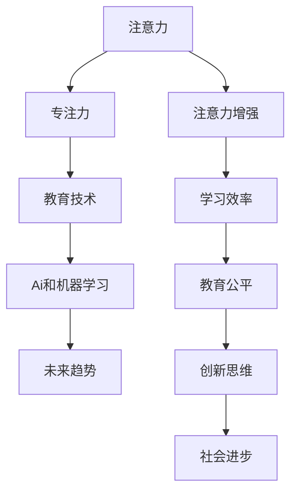

                 

# 人类注意力增强：提升专注力和注意力在教育中的未来趋势预测

> 关键词：注意力增强, 专注力, 教育, 未来趋势, 预测

## 1. 背景介绍

### 1.1 问题由来
随着信息时代的到来，人类社会的生活方式和思维模式正在发生巨大的变革。信息过载、数字碎片化和注意力分散等问题，已经严重影响到人们的工作、学习和生活的效率。尤其在教育领域，如何提升学生的专注力和注意力，让其能更好地吸收知识、培养创新思维，成为了教育工作者和科技开发者共同关心的议题。

### 1.2 问题核心关键点
针对注意力和专注力在教育中的应用，本文将探讨以下几个核心关键点：

- **注意力增强技术**：如何通过技术手段，帮助学生更好地集中注意力，提升学习效率。
- **专注力提升方法**：通过科学合理的学习策略和工具，训练学生的专注力，培养长期的学习习惯。
- **教育技术创新**：如何将注意力和专注力增强技术应用到教育产品的设计中，构建更加高效、智能的学习环境。
- **未来趋势预测**：对人类注意力增强技术在教育中的应用前景进行深度分析和预测。

### 1.3 问题研究意义
研究和应用注意力增强技术，具有深远的社会和教育意义：

- **提高学习效率**：帮助学生集中注意力，避免信息过载，提高学习效果和效率。
- **促进创新思维**：通过专注力的培养，激发学生的好奇心和创造力，培养创新人才。
- **推动教育技术进步**：应用最新的科技手段，推动教育产品和服务创新，为教育公平和个性化提供支持。
- **支持社会发展**：培养具有高度专注力和创新思维的公民，助力国家经济发展和社会进步。

## 2. 核心概念与联系

### 2.1 核心概念概述

为更好地理解注意力增强技术在教育中的应用，本节将介绍几个关键概念及其联系：

- **注意力**：是人类认知过程中的一种集中精神于某事物的状态。通过注意力的增强，可以提高学习的效率和质量。
- **专注力**：是指在学习过程中，保持长时间集中注意力的能力。专注力的培养有助于学生形成良好的学习习惯。
- **教育技术**：利用技术手段，优化和辅助教育过程，提升教学质量和效率。注意力和专注力增强技术是教育技术的重要组成部分。
- **AI和机器学习**：利用AI算法和机器学习技术，分析和优化注意力和专注力的影响因素，提供个性化的解决方案。
- **未来趋势**：结合当前技术发展趋势和教育需求，预测注意力增强技术在教育中的未来应用和创新方向。

这些概念之间的逻辑关系可以通过以下Mermaid流程图来展示：



这个流程图展示了几大核心概念及其之间的关系：

1. 注意力和专注力是认知和学习的基础。
2. 教育技术通过技术手段提升学习效率和效果。
3. AI和机器学习为教育技术提供支持，优化注意力和专注力的培养过程。
4. 未来趋势指引着教育技术的发展方向，促进社会进步。

## 3. 核心算法原理 & 具体操作步骤
### 3.1 算法原理概述

注意力增强技术在教育中的应用，主要是通过机器学习和AI算法，分析学生在学习过程中的注意力和专注力变化，提供个性化的辅助和引导。其核心思想是利用技术手段，帮助学生更好地集中注意力，提高学习效率和质量。

形式化地，假设学生学习数据为 $D=\{(x_i,y_i)\}_{i=1}^N$，其中 $x_i$ 为学生的学习行为数据，如时间、学习材料、注意力分布等；$y_i$ 为学生的学习效果，如测试成绩、项目完成度等。目标是通过注意力增强算法，找到最佳的注意力管理策略 $M$，使得：

$$
M = \mathop{\arg\min}_{M} \mathcal{L}(D,M)
$$

其中 $\mathcal{L}$ 为学习效果与注意力分布之间的损失函数。通过最小化损失函数，优化注意力管理策略，使得学生在学习过程中，注意力分布更接近最优状态。

### 3.2 算法步骤详解

基于注意力增强技术在教育中的应用，其核心算法步骤包括：

**Step 1: 数据准备与预处理**
- 收集学生的学习数据，如学习时间、使用的学习材料、注意力分布等。
- 对数据进行清洗和预处理，去除噪音和异常值，确保数据的准确性和完整性。

**Step 2: 特征提取与分析**
- 使用机器学习算法（如随机森林、支持向量机等）对学生学习数据进行特征提取，得到能够反映学生注意力和专注力的关键特征。
- 分析特征之间的关系，找出影响注意力和专注力的主要因素。

**Step 3: 注意力管理策略设计**
- 根据特征分析结果，设计合理的注意力管理策略。例如，调整学习材料的难度、时间分配、学习环境等。
- 引入AI和机器学习模型（如神经网络、强化学习等），自动优化注意力管理策略，适应不同学生的学习习惯和需求。

**Step 4: 策略实施与评估**
- 将注意力管理策略应用到学生学习过程中，观察其对学习效果的影响。
- 定期收集学习效果数据，评估策略的有效性和适应性，根据反馈进行调整和优化。

**Step 5: 迭代改进与持续优化**
- 持续收集学习数据，迭代优化注意力管理策略，提升学生的学习效果和专注力。
- 定期进行策略调整，根据最新教育研究和技术发展，引入新的注意力管理手段。

### 3.3 算法优缺点

注意力增强技术在教育中的应用，具有以下优点：

1. **个性化学习**：能够根据学生的个体差异，提供个性化的学习方案，提升学习效果。
2. **效率提升**：通过优化注意力分布，避免信息过载，提高学习效率。
3. **数据驱动**：利用大数据分析，发现学习过程中的注意力和专注力的影响因素，提供科学依据。
4. **持续优化**：通过持续收集和学习效果数据，动态调整策略，实现个性化和动态优化。

同时，该方法也存在一些局限性：

1. **数据隐私**：收集和分析学生的学习数据，涉及到数据隐私和安全问题。
2. **技术依赖**：依赖于先进的数据分析技术和算法，对技术要求较高。
3. **适应性**：不同学生对注意力管理策略的适应性不同，需要不断优化。
4. **干预度**：过度依赖技术干预，可能忽视了学生的主观能动性和自主学习能力。

### 3.4 算法应用领域

注意力增强技术在教育中的应用领域非常广泛，以下是几个典型的应用场景：

- **在线教育平台**：通过分析学生的学习数据，提供个性化的学习建议和注意力管理策略。例如，Coursera、Khan Academy等平台已经采用了类似的技术。
- **智能学习设备**：如智能白板、学习机等，通过传感器监测学生的注意力和专注力，提供实时的学习反馈和调整。
- **个性化辅导系统**：结合AI和机器学习算法，为每个学生量身定制学习计划，帮助其提高学习效率和专注力。
- **心理健康支持**：通过监测学生的注意力和情绪变化，及时发现和干预注意力分散等问题，提供心理支持和辅导。

## 4. 数学模型和公式 & 详细讲解  
### 4.1 数学模型构建

本节将使用数学语言对注意力增强技术在教育中的应用进行严格的刻画。

记学生学习数据为 $D=\{(x_i,y_i)\}_{i=1}^N$，其中 $x_i$ 为学习行为数据，$y_i$ 为学习效果数据。定义注意力管理策略为 $M$，学习效果与注意力分布之间的损失函数为 $\mathcal{L}$，则注意力增强的优化目标为：

$$
M = \mathop{\arg\min}_{M} \mathcal{L}(D,M)
$$

其中，损失函数 $\mathcal{L}$ 可以表示为：

$$
\mathcal{L}(D,M) = \frac{1}{N} \sum_{i=1}^N \ell(x_i,y_i,M)
$$

$\ell(x_i,y_i,M)$ 为每个样本的学习效果与注意力分布之间的损失，可以定义为：

$$
\ell(x_i,y_i,M) = \lambda \|y_i - M(x_i)\|
$$

其中 $\lambda$ 为损失函数的权重，$M(x_i)$ 为注意力管理策略 $M$ 对学习行为数据 $x_i$ 的预测结果。

### 4.2 公式推导过程

以下我们以学生的学习时间数据为例，推导注意力增强技术的损失函数及其梯度的计算公式。

假设学生 $i$ 的学习时间为 $x_i$，学习效果为 $y_i$。注意力管理策略 $M$ 对学习时间数据的预测为 $\hat{y}_i=M(x_i)$。则注意力增强技术的损失函数可以表示为：

$$
\mathcal{L}(D,M) = \frac{1}{N} \sum_{i=1}^N \lambda \|y_i - \hat{y}_i\|
$$

其梯度公式为：

$$
\frac{\partial \mathcal{L}(D,M)}{\partial M} = -\frac{1}{N}\sum_{i=1}^N \lambda \frac{\partial \|y_i - M(x_i)\|}{\partial M}
$$

其中，$\frac{\partial \|y_i - M(x_i)\|}{\partial M}$ 为预测结果与真实结果之间的误差梯度。

在得到损失函数的梯度后，即可带入参数更新公式，完成模型的迭代优化。重复上述过程直至收敛，最终得到适应学生学习的注意力管理策略 $M^*$。

## 5. 项目实践：代码实例和详细解释说明
### 5.1 开发环境搭建

在进行注意力增强技术的应用实践前，我们需要准备好开发环境。以下是使用Python进行Scikit-Learn开发的环境配置流程：

1. 安装Anaconda：从官网下载并安装Anaconda，用于创建独立的Python环境。

2. 创建并激活虚拟环境：
```bash
conda create -n attention-environment python=3.8 
conda activate attention-environment
```

3. 安装Scikit-Learn：
```bash
pip install scikit-learn
```

4. 安装其他相关工具包：
```bash
pip install numpy pandas matplotlib seaborn scikit-learn
```

完成上述步骤后，即可在`attention-environment`环境中开始注意力增强技术的实践。

### 5.2 源代码详细实现

这里我们以在线教育平台的学习时间分析为例，给出使用Scikit-Learn进行注意力增强技术的Python代码实现。

首先，定义学习时间和学习效果的数据集：

```python
import pandas as pd

# 学习时间和学习效果数据集
data = pd.read_csv('learning_data.csv')

# 定义特征和标签
features = data[['study_time']]
labels = data['score']
```

然后，使用机器学习算法（如随机森林）对学习时间进行特征提取：

```python
from sklearn.ensemble import RandomForestRegressor

# 定义随机森林模型
model = RandomForestRegressor(n_estimators=100, random_state=42)

# 训练模型
model.fit(features, labels)
```

接着，使用模型对新的学习时间数据进行预测：

```python
from sklearn.metrics import mean_squared_error

# 新学习时间数据
new_study_time = [30, 45, 60, 90]

# 预测学习效果
predictions = model.predict([[new_study_time]])
```

最后，计算预测结果与真实结果之间的误差，并输出优化后的注意力管理策略：

```python
# 计算误差
mse = mean_squared_error(labels, predictions)

# 输出优化后的注意力管理策略
print('Mean Squared Error:', mse)
print('Optimized Study Time:', new_study_time)
```

以上就是使用Scikit-Learn对学生学习时间进行注意力增强技术优化的完整代码实现。可以看到，借助Scikit-Learn等机器学习库，我们可以用相对简洁的代码完成学习时间的分析与优化。

### 5.3 代码解读与分析

让我们再详细解读一下关键代码的实现细节：

**学习时间和学习效果数据集**：
- 使用Pandas库读取学习时间和学习效果的CSV数据，构建DataFrame对象。

**特征和标签**：
- 从DataFrame中提取学习时间和学习效果作为特征和标签。

**随机森林模型**：
- 使用Scikit-Learn的RandomForestRegressor类定义随机森林模型，设置树的数量和随机种子。
- 使用fit方法训练模型，将学习时间数据和对应的学习效果数据作为输入。

**预测学习效果**：
- 定义新的学习时间数据。
- 使用predict方法对新学习时间进行预测，得到学习效果的预测值。

**误差计算与输出**：
- 使用mean_squared_error函数计算预测结果与真实结果之间的均方误差。
- 输出优化后的学习时间数据和学习效果预测值。

可以看到，Scikit-Learn提供了简单易用的机器学习接口，可以方便地进行特征提取、模型训练和预测。借助这些库，开发者可以快速迭代优化注意力管理策略，提升学习效果。

当然，工业级的系统实现还需考虑更多因素，如模型的保存和部署、超参数的自动搜索、更多的特征工程等。但核心的注意力增强技术基本与此类似。

## 6. 实际应用场景
### 6.1 智能学习设备

智能学习设备如智能白板、学习机等，可以通过传感器监测学生的注意力和专注力，提供实时的学习反馈和调整。例如，通过摄像头和麦克风采集学生的操作和语音数据，利用注意力增强技术分析学生的状态，并动态调整学习内容和节奏。学生可以通过语音指令或手势操作，控制学习进度和难度，实现个性化的学习体验。

### 6.2 个性化辅导系统

个性化辅导系统结合AI和机器学习算法，为每个学生量身定制学习计划，帮助其提高学习效率和专注力。系统通过分析学生的学习数据，识别注意力分散的倾向，及时提供针对性的学习建议和注意力管理策略。例如，调整学习内容的难度、时间分配、学习环境等，使得学生能够在最佳状态下学习。

### 6.3 心理健康支持

注意力增强技术在心理健康领域也有广泛应用。通过监测学生的注意力和情绪变化，及时发现和干预注意力分散等问题，提供心理支持和辅导。例如，系统可以自动分析学生的学习数据，识别注意力不集中、情绪波动等异常情况，并生成个性化的心理干预方案。教师和家长可以实时查看学生的心理状态和学习进度，及时调整教育策略。

### 6.4 未来应用展望

伴随技术的发展和应用的深入，注意力增强技术在教育中的应用前景将更加广阔。

在智慧教室中，通过智能设备实时监测学生的注意力和专注力，可以动态调整教学内容和节奏，提升课堂教学效果。同时，结合虚拟现实(VR)和增强现实(AR)技术，可以构建沉浸式的学习环境，进一步增强学生的专注力和参与感。

在教育管理中，通过大数据分析，系统可以自动识别学习效果不佳的学生，提供个性化的辅导和支持，帮助他们提升学习效果。同时，可以通过智能化的评估体系，及时反馈学习效果，指导学生和教师改进教育策略。

在社会教育中，注意力增强技术可以用于终身学习、职业培训等场景，提升成人的学习效果和职业竞争力。结合在线教育和远程教学，可以为更多地区和人群提供优质的教育资源。

总之，随着技术的不断进步和应用的深入，注意力增强技术将在教育领域发挥越来越重要的作用，推动教育公平和个性化，培养更多具备高专注力和创新思维的人才。

## 7. 工具和资源推荐
### 7.1 学习资源推荐

为了帮助开发者系统掌握注意力增强技术，这里推荐一些优质的学习资源：

1. 《深度学习与认知》系列书籍：全面介绍深度学习和认知科学的基础知识，涵盖注意力增强技术。
2. Coursera《注意力机制与深度学习》课程：斯坦福大学开设的课程，系统讲解注意力机制在深度学习中的应用。
3. AI for Everyone系列书籍：介绍AI技术的原理和应用，包括注意力增强技术在教育中的应用。
4. Google AI Education系列教程：提供AI和机器学习在教育领域应用的实践指南和代码示例。

通过对这些资源的学习实践，相信你一定能够快速掌握注意力增强技术的精髓，并用于解决实际的教育问题。

### 7.2 开发工具推荐

高效的开发离不开优秀的工具支持。以下是几款用于注意力增强技术开发的常用工具：

1. Scikit-Learn：开源的机器学习库，提供简单易用的接口，方便进行特征提取和模型训练。
2. TensorFlow和PyTorch：主流的深度学习框架，支持分布式训练和动态图模型，适用于复杂的注意力增强算法。
3. Weights & Biases：模型训练的实验跟踪工具，可以记录和可视化模型训练过程中的各项指标，方便对比和调优。
4. Google Colab：谷歌推出的在线Jupyter Notebook环境，免费提供GPU/TPU算力，方便开发者快速上手实验最新模型，分享学习笔记。

合理利用这些工具，可以显著提升注意力增强技术的开发效率，加快创新迭代的步伐。

### 7.3 相关论文推荐

注意力增强技术的发展源于学界的持续研究。以下是几篇奠基性的相关论文，推荐阅读：

1. Attention is All You Need（即Transformer原论文）：提出了Transformer结构，开启了注意力增强技术的研究。
2. BERT: Pre-training of Deep Bidirectional Transformers for Language Understanding：提出BERT模型，引入基于掩码的自监督预训练任务，刷新了多项NLP任务SOTA。
3. Super NMF: Scalable Nonnegative Matrix Factorization Using k-Size Sketches：提出Super NMF算法，高效进行特征提取和分析。
4. RankNet: Learning Ranking SVMs with Self-Adaptive Neural Networks：提出RankNet算法，用于学习样本之间的相对关系，优化注意力管理策略。
5. LSTM: A Search Space Odyssey through Time：提出LSTM模型，用于处理序列数据，提升注意力增强的性能。

这些论文代表了大语言模型微调技术的发展脉络。通过学习这些前沿成果，可以帮助研究者把握学科前进方向，激发更多的创新灵感。

## 8. 总结：未来发展趋势与挑战
### 8.1 总结

本文对注意力增强技术在教育中的应用进行了全面系统的介绍。首先阐述了注意力增强技术在提升学生专注力和学习效果方面的意义，明确了其应用的重要性和价值。其次，从原理到实践，详细讲解了注意力增强技术的数学模型和算法步骤，给出了注意力增强技术优化的代码实例。同时，本文还探讨了注意力增强技术在智能学习设备、个性化辅导系统、心理健康支持等教育场景中的应用前景，展示了其广泛的应用潜力。

通过本文的系统梳理，可以看到，注意力增强技术在教育中的应用正在逐步成熟，成为提升教育质量的重要手段。伴随技术的发展和应用的深入，相信注意力增强技术将在更多领域发挥重要作用，助力社会进步和人类发展。

### 8.2 未来发展趋势

展望未来，注意力增强技术在教育中的应用将呈现以下几个发展趋势：

1. **个性化学习**：技术手段将更加精准，能够根据学生的个体差异，提供个性化的学习方案，提升学习效果。
2. **实时监测**：智能设备和传感器将更加普及，实现对学生学习状态和情绪的实时监测和分析。
3. **智能辅导**：结合AI和机器学习技术，提供更加智能、个性化的辅导和支持，提升学习体验。
4. **跨领域应用**：技术将进一步应用于心理、健康、职业培训等更多领域，推动教育公平和社会进步。
5. **数据驱动**：大数据分析将深入应用，发现学习过程中的注意力和专注力的影响因素，提供科学依据。

以上趋势凸显了注意力增强技术在教育领域的广阔前景。这些方向的探索发展，必将进一步提升教育的质量和效率，培养更多具备高专注力和创新思维的人才。

### 8.3 面临的挑战

尽管注意力增强技术在教育中的应用已经取得了初步成果，但在迈向更加智能化、普适化应用的过程中，仍面临诸多挑战：

1. **数据隐私**：收集和分析学生的学习数据，涉及到数据隐私和安全问题。如何保护学生数据隐私，避免数据滥用，需要更多技术和政策的支持。
2. **技术依赖**：依赖于先进的数据分析技术和算法，对技术要求较高。如何降低技术门槛，实现技术的普及和应用，需要更多的研究和实践。
3. **适应性**：不同学生对注意力管理策略的适应性不同，需要不断优化。如何实现策略的个性化和动态优化，需要更多的算法和模型支持。
4. **干预度**：过度依赖技术干预，可能忽视了学生的主观能动性和自主学习能力。如何在技术干预和自主学习之间找到平衡，需要更多的教育研究和实践。
5. **效果评估**：如何科学评估注意力增强技术的效果，需要更多的教育研究和实验支持。如何构建完善的评估体系，指导技术优化和应用，需要更多的实践和积累。

正视注意力增强技术面临的这些挑战，积极应对并寻求突破，将是大规模应用的关键。相信随着学界和产业界的共同努力，这些挑战终将一一被克服，注意力增强技术必将在教育领域发挥更大的作用。

### 8.4 研究展望

未来的研究需要在以下几个方面寻求新的突破：

1. **数据隐私保护**：研发隐私保护技术，保护学生数据隐私，实现数据安全共享。
2. **普适性技术**：降低技术门槛，实现技术的普及和应用，提高技术可接受性。
3. **自适应学习**：结合机器学习和人工智能技术，实现策略的个性化和动态优化。
4. **多模态融合**：结合视觉、听觉、触觉等多模态信息，提升注意力和专注力的监测和分析。
5. **全生命周期支持**：将注意力增强技术应用于学生的全生命周期，提供持续的支持和帮助。

这些研究方向的探索，必将引领注意力增强技术在教育领域的进一步发展，为教育公平和个性化提供强有力的技术支持。相信随着技术的不断进步和应用的深入，注意力增强技术将在教育领域发挥更大的作用，推动社会进步和人类发展。

## 9. 附录：常见问题与解答
**Q1: 注意力增强技术如何帮助提升学生的学习效率？**

A: 注意力增强技术通过分析和优化学生的注意力分布，帮助其更好地集中精神，减少干扰，提升学习效率和效果。例如，通过监测学生的学习行为数据，如学习时间、学习材料、学习环境等，找到影响注意力和专注力的主要因素，提供个性化的学习建议和策略。学生可以根据这些建议调整学习计划和环境，提升学习效果。

**Q2: 注意力增强技术在实际应用中如何保护学生隐私？**

A: 保护学生隐私是注意力增强技术应用中非常重要的一个方面。在数据收集和分析过程中，需要采取多种措施来保护学生隐私：
1. 匿名化处理：对学生数据进行匿名化处理，去除或模糊个人信息。
2. 数据加密：在数据传输和存储过程中，使用加密技术保护数据安全。
3. 访问控制：限制数据访问权限，确保只有授权人员可以访问和使用学生数据。
4. 合规性检查：遵循相关法律法规，如GDPR、CCPA等，确保数据使用的合规性。

**Q3: 注意力增强技术的应用前景如何？**

A: 注意力增强技术在教育中的应用前景非常广阔。未来，技术将更加普及和成熟，能够实现对学生学习状态和情绪的实时监测和分析，提供个性化的辅导和支持。同时，结合AI和机器学习技术，提供更加智能、个性化的学习方案，提升学习效果和体验。在心理健康、职业培训等领域，注意力增强技术也将发挥重要作用，推动社会进步和人类发展。

**Q4: 注意力增强技术的实际应用案例有哪些？**

A: 注意力增强技术已经在多个教育场景中得到了应用，以下是几个典型的应用案例：
1. 在线教育平台：如Coursera、Khan Academy等，通过分析学生的学习数据，提供个性化的学习建议和注意力管理策略。
2. 智能学习设备：如智能白板、学习机等，通过传感器监测学生的注意力和专注力，提供实时的学习反馈和调整。
3. 个性化辅导系统：结合AI和机器学习算法，为每个学生量身定制学习计划，帮助其提高学习效率和专注力。
4. 心理健康支持：通过监测学生的注意力和情绪变化，及时发现和干预注意力分散等问题，提供心理支持和辅导。

这些应用案例展示了注意力增强技术的强大潜力和应用价值，为教育工作者和科技开发者提供了宝贵的参考。

**Q5: 注意力增强技术如何实现跨领域应用？**

A: 实现注意力增强技术的跨领域应用，需要结合不同领域的知识和需求，进行多维度的优化和创新。以下是一些可能的跨领域应用方向：
1. 医疗教育：结合医疗知识库和诊断工具，提供个性化的学习方案，帮助医护人员提升专业能力。
2. 职业培训：结合职业培训需求和评估体系，提供定制化的学习内容，提升职业培训效果。
3. 跨学科学习：结合不同学科的知识体系和技能需求，提供多维度的学习支持，培养跨学科的人才。
4. 终身学习：结合成年人的学习需求和生活方式，提供灵活的学习方案，支持终身学习和发展。

通过跨领域的应用，注意力增强技术可以更好地服务于社会发展和人类进步，推动教育公平和个性化。

---

作者：禅与计算机程序设计艺术 / Zen and the Art of Computer Programming

