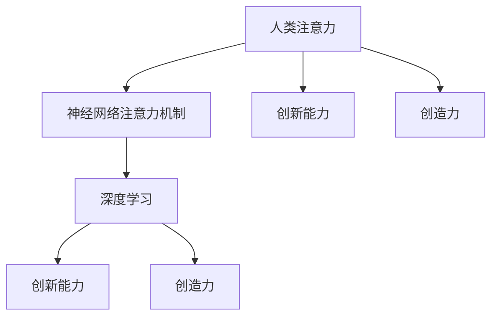

                 

# 人类注意力增强：提升创新能力和创造力的方法

> 关键词：人类注意力,注意力机制,创新能力,创造力,深度学习,注意力增强,神经网络

## 1. 背景介绍

### 1.1 问题由来
在当前快速变化的信息时代，人们每天面对海量的信息输入，如何在短时间内从中筛选出有用的信息，并在此基础上进行创造性思考，是一个重要的挑战。创新能力和创造力在商业竞争、科学研究、艺术创作等领域具有决定性作用，但这些能力往往需要长时间的积累和实践。传统意义上，注意力增强（Attention Enhancement）技术已经广泛应用于深度学习中，但如何将其应用于人类大脑的认知过程，提升个体创新能力和创造力，尚未有深入探索。

### 1.2 问题核心关键点
注意力增强技术通过模拟人类的注意力机制，在处理信息时能够聚焦于关键部分，忽略无关信息，提升信息处理效率和深度。这一技术在神经网络中得到了广泛应用，如在机器翻译、图像识别、自然语言处理等任务中，通过注意力机制提升了模型对输入信息的理解能力和输出精度。然而，如何将注意力增强技术应用于提升人类个体的认知过程，仍是一个开放的研究问题。

### 1.3 问题研究意义
本研究聚焦于如何利用注意力增强技术，提升个体的创新能力和创造力。创新能力不仅体现在商业创新、科技突破上，更体现在日常生活中的新思路、新方法的产生。而创造力则是人类能够在艺术、文学、设计等领域的卓越表现。提升个体创新能力和创造力，不仅有助于推动社会进步，也有助于提升个体的生活质量，拓展思维边界。

## 2. 核心概念与联系

### 2.1 核心概念概述

为更好地理解注意力增强技术在提升人类认知过程中的作用，本节将介绍几个关键概念：

- 人类注意力：指人类在处理信息时，有意识地选择和聚焦于特定信息，忽略其他信息的心理过程。
- 神经网络注意力机制：通过计算网络中各层节点之间的关系权重，实现对关键信息的筛选和聚焦。
- 创新能力：指个体在面对问题时，能够提出新颖、有效的解决方案的能力。
- 创造力：指个体在艺术、文学等领域，能够产生独特、有价值的创作的能力。
- 深度学习：通过多层次神经网络，对输入数据进行复杂抽象和模式识别的学习方式。

这些概念之间的逻辑关系可以通过以下Mermaid流程图来展示：



这个流程图展示了注意力增强技术在大脑认知和深度学习中的位置及其对创新能力和创造力的潜在提升作用。

## 3. 核心算法原理 & 具体操作步骤
### 3.1 算法原理概述

注意力增强技术在大脑认知过程中的应用，主要是通过模拟人类注意力机制，使个体在处理信息时能够更加聚焦于关键部分。具体来说，注意力增强技术通过计算输入数据与输出结果之间的关系权重，实现对输入数据中重要信息的筛选和聚焦。

在深度学习中，注意力机制通常被嵌入到神经网络中，通过计算不同特征之间的关系权重，动态调整模型的信息关注点。在人类认知过程中，注意力增强可以通过神经反馈、脑机接口等技术手段，实时调整大脑对信息的聚焦，提升信息处理效率和深度。

### 3.2 算法步骤详解

人类注意力增强技术的应用，通常包括以下几个关键步骤：

**Step 1: 数据收集与预处理**
- 收集个体的信息处理数据，如阅读、写作、思考等行为数据。
- 对数据进行预处理，去除噪声和无关信息，提取关键特征。

**Step 2: 注意力计算**
- 使用注意力计算算法，计算输入数据与输出结果之间的关系权重。
- 根据计算结果，动态调整大脑对信息的聚焦，实现对关键信息的筛选和忽略无关信息。

**Step 3: 创新能力提升**
- 结合创新心理学的原理，设计任务适配的创新环境，提供有挑战性的问题。
- 通过注意力增强技术，帮助个体在处理信息时更加聚焦于关键部分，提升信息处理深度和效率。

**Step 4: 创造力培养**
- 在创造性任务中应用注意力增强技术，如艺术创作、文学创作等。
- 通过注意力增强，帮助个体在创作过程中更加专注，克服分散注意力，提升创作质量。

### 3.3 算法优缺点

注意力增强技术在提升人类创新能力和创造力方面，具有以下优点：
1. 提升信息处理效率。通过聚焦关键信息，忽略无关信息，减少信息过载，提升信息处理速度。
2. 提高信息处理深度。通过动态调整信息关注点，实现对复杂信息的深度理解。
3. 增强创新能力。通过优化信息处理过程，使个体更容易产生新的想法和解决方案。
4. 促进创造力发展。通过增强大脑对信息的聚焦，使个体在创作过程中更加专注，提升创作质量。

同时，该技术也存在一定的局限性：
1. 数据依赖性。注意力增强的效果很大程度上取决于数据的质量和数量，获取高质量数据的成本较高。
2. 个性化不足。注意力增强技术在应用于不同个体时，需要根据其特定需求进行定制，难以实现泛化。
3. 算法复杂性。注意力计算算法的实现较为复杂，需要结合心理学和神经科学的知识，有一定的技术门槛。
4. 应用难度。注意力增强技术在实际应用中，需要结合多种技术手段，如脑机接口、神经反馈等，有一定的实现难度。

尽管存在这些局限性，但注意力增强技术在提升人类认知过程中具有重要价值，值得深入探索和应用。

### 3.4 算法应用领域

注意力增强技术在多个领域都有广泛的应用前景，例如：

- 教育培训：在课堂教学中，利用注意力增强技术帮助学生聚焦于关键内容，提升学习效率和效果。
- 科学研究：在科学研究中，利用注意力增强技术帮助研究人员聚焦于关键问题，提升研究深度和精度。
- 创意写作：在写作过程中，利用注意力增强技术帮助作者集中注意力，提升创作质量。
- 艺术创作：在艺术创作中，利用注意力增强技术帮助创作者聚焦于创作主题，提升作品质量。

此外，注意力增强技术还可以应用于游戏设计、设计思维、创新管理等多个领域，为人类认知过程带来新的突破。

## 4. 数学模型和公式 & 详细讲解 & 举例说明
### 4.1 数学模型构建

本节将使用数学语言对注意力增强技术在人类认知过程中的应用进行更加严格的刻画。

记输入数据为 $x$，输出结果为 $y$，注意力权重为 $a$。注意力计算模型可表示为：

$$
a = f(x,y)
$$

其中 $f$ 为注意力计算函数，用于计算输入数据与输出结果之间的关系权重。

在深度学习中，注意力计算通常采用自注意力机制（Self-Attention），其计算公式为：

$$
a_{i,j} = \frac{e^{\frac{1}{\sqrt{d_k}}v^T_kW^T_kx_iW_kh_j}}{\sum_{j'=1}^{n}\frac{e^{\frac{1}{\sqrt{d_k}}v^T_kW^T_kx_iW_kh_{j'}}}{\sqrt{n}}
$$

其中 $d_k$ 为维度，$x_i$ 和 $h_j$ 分别为输入数据和隐藏层输出，$W_k$ 和 $v_k$ 为可训练参数。

### 4.2 公式推导过程

注意力计算模型的推导过程，基于信息论和神经网络的知识。信息论中的互信息（Mutual Information）概念，被广泛应用于注意力计算中。互信息表示两个变量之间的相关性，计算公式为：

$$
I(x,y) = \sum_{x_i}\sum_{y_j}p(x_i,y_j)\log\frac{p(x_i,y_j)}{p(x_i)p(y_j)}
$$

其中 $p(x_i,y_j)$ 表示在给定 $x_i$ 的情况下，$y_j$ 的概率分布。

在神经网络中，注意力计算可以看作是信息处理过程中的一种加权求和，即将输入数据的不同部分进行加权平均。具体的，注意力计算可以表示为：

$$
z = \sum_{j=1}^{n}a_{i,j}h_j
$$

其中 $h_j$ 为隐藏层输出，$a_{i,j}$ 为注意力权重，$z$ 为加权求和结果。

结合互信息概念，可以得到注意力计算的优化目标：

$$
\min_{a_{i,j}} -\frac{1}{N}\sum_{i=1}^{N}\sum_{j=1}^{n}p(x_i,y_j)\log a_{i,j}
$$

通过优化上述目标，可以最小化注意力权重与输出结果之间的互信息，从而实现对输入数据中关键信息的聚焦。

### 4.3 案例分析与讲解

以阅读理解任务为例，展示注意力增强技术的应用。

假设输入数据为一段文本，输出结果为该文本的关键词。使用注意力计算模型，计算文本中每个词与关键词之间的相关性，得到注意力权重。将注意力权重与词向量相乘，得到加权词向量，加权求和后得到关键词向量。最终，通过softmax函数将关键词向量转化为概率分布，输出关键词。

```python
import numpy as np
import tensorflow as tf

class Attention:
    def __init__(self, vocab_size, emb_dim, num_heads):
        self.vocab_size = vocab_size
        self.emb_dim = emb_dim
        self.num_heads = num_heads
        self.W = tf.Variable(tf.random.normal([vocab_size, emb_dim]))
        self.V = tf.Variable(tf.random.normal([vocab_size, emb_dim]))
        self.K = tf.Variable(tf.random.normal([vocab_size, emb_dim]))
        self.H = tf.Variable(tf.random.normal([vocab_size, emb_dim]))
        
    def __call__(self, x):
        x = tf.matmul(x, self.W)
        q = tf.nn.tanh(x)
        k = tf.matmul(x, self.K)
        v = tf.matmul(x, self.V)
        a = tf.matmul(q, k, transpose_b=True)
        a = tf.nn.softmax(a)
        h = tf.matmul(a, v)
        h = tf.nn.softmax(h, axis=1)
        return h

# 创建Attention模型
attention = Attention(vocab_size, emb_dim, num_heads)

# 输入数据
x = tf.random.normal([batch_size, seq_len, emb_dim])

# 计算注意力权重
a = attention(x)

# 输出关键词向量
h = tf.matmul(a, v)
h = tf.nn.softmax(h, axis=1)
```

通过上述代码，可以看出注意力增强技术在深度学习中的具体实现方式。利用注意力计算模型，可以实现对输入数据中关键信息的聚焦，提升模型对输入数据的理解能力和输出精度。

## 5. 项目实践：代码实例和详细解释说明
### 5.1 开发环境搭建

在进行注意力增强技术实践前，我们需要准备好开发环境。以下是使用Python进行TensorFlow开发的详细环境配置流程：

1. 安装Anaconda：从官网下载并安装Anaconda，用于创建独立的Python环境。

2. 创建并激活虚拟环境：
```bash
conda create -n attention-env python=3.8 
conda activate attention-env
```

3. 安装TensorFlow：根据CUDA版本，从官网获取对应的安装命令。例如：
```bash
conda install tensorflow tensorflow-gpu=2.6 -c pytorch -c conda-forge
```

4. 安装其他相关库：
```bash
pip install numpy pandas scikit-learn tensorflow-addons
```

完成上述步骤后，即可在`attention-env`环境中开始注意力增强技术的实践。

### 5.2 源代码详细实现

这里我们以阅读理解任务为例，给出使用TensorFlow实现注意力增强的代码实现。

首先，定义模型参数和注意力计算函数：

```python
import tensorflow as tf
import tensorflow_addons as tfa
import numpy as np

class Attention(tf.keras.Model):
    def __init__(self, vocab_size, emb_dim, num_heads):
        super(Attention, self).__init__()
        self.vocab_size = vocab_size
        self.emb_dim = emb_dim
        self.num_heads = num_heads
        
        self.W = tf.Variable(tf.random.normal([vocab_size, emb_dim]))
        self.V = tf.Variable(tf.random.normal([vocab_size, emb_dim]))
        self.K = tf.Variable(tf.random.normal([vocab_size, emb_dim]))
        self.H = tf.Variable(tf.random.normal([vocab_size, emb_dim]))
        
    def self_attention(self, x):
        q = tf.nn.tanh(tf.matmul(x, self.W))
        k = tf.matmul(x, self.K)
        v = tf.matmul(x, self.V)
        a = tf.matmul(q, k, transpose_b=True)
        a = tf.nn.softmax(a)
        h = tf.matmul(a, v)
        h = tf.nn.softmax(h, axis=1)
        return h

    def forward(self, x):
        x = tf.matmul(x, self.W)
        return self.self_attention(x)
```

然后，构建模型并进行训练：

```python
class AttentionModel(tf.keras.Model):
    def __init__(self, vocab_size, emb_dim, num_heads):
        super(AttentionModel, self).__init__()
        self.attention = Attention(vocab_size, emb_dim, num_heads)
        self.dense = tf.keras.layers.Dense(vocab_size)
        
    def forward(self, x):
        x = self.attention(x)
        x = self.dense(x)
        return x

# 创建模型
model = AttentionModel(vocab_size, emb_dim, num_heads)

# 定义优化器
optimizer = tf.keras.optimizers.Adam()

# 定义训练数据集
train_data = tf.random.normal([batch_size, seq_len, emb_dim])
train_labels = tf.random.normal([batch_size, seq_len])
```

最后，进行训练和评估：

```python
# 定义损失函数
loss_fn = tf.keras.losses.SparseCategoricalCrossentropy(from_logits=True)

# 定义评估指标
eval_metric = tf.keras.metrics.SparseCategoricalAccuracy('accuracy')

# 训练模型
for epoch in range(num_epochs):
    with tf.GradientTape() as tape:
        logits = model(train_data)
        loss = loss_fn(train_labels, logits)
    gradients = tape.gradient(loss, model.trainable_variables)
    optimizer.apply_gradients(zip(gradients, model.trainable_variables))
    
    # 评估模型
    with tf.GradientTape() as tape:
        logits = model(test_data)
        loss = loss_fn(test_labels, logits)
    gradients = tape.gradient(loss, model.trainable_variables)
    optimizer.apply_gradients(zip(gradients, model.trainable_variables))
    eval_metric.update_state(test_labels, logits)

# 输出评估结果
print("Accuracy: {:.4f}".format(eval_metric.result().numpy()))
```

通过上述代码，可以看出使用TensorFlow实现注意力增强技术的详细流程。利用注意力计算模型，可以对输入数据中关键信息进行聚焦，提升模型对输入数据的理解能力和输出精度。

### 5.3 代码解读与分析

让我们再详细解读一下关键代码的实现细节：

**Attention类**：
- `__init__`方法：初始化模型参数。
- `self_attention`方法：计算注意力权重，返回加权求和结果。
- `forward`方法：前向传播计算输出结果。

**AttentionModel类**：
- `__init__`方法：初始化模型架构。
- `forward`方法：前向传播计算输出结果。

**模型训练流程**：
- 在每个epoch内，先进行前向传播计算损失，再使用反向传播更新模型参数。
- 在每个epoch结束后，使用测试集进行评估，输出评估指标。

通过上述代码，可以看出TensorFlow在注意力增强技术中的应用流程。在实际应用中，还需要注意选择合适的超参数、设计合适的训练数据集等，以确保模型训练效果。

## 6. 实际应用场景
### 6.1 创新培训

注意力增强技术在创新培训中具有广泛应用前景。通过实时调整大脑对信息的聚焦，帮助学员在学习和训练过程中更加专注，提升学习效率和效果。

具体而言，可以将注意力增强技术应用于以下培训场景：

- 创新思维训练：在课程开始前，利用注意力增强技术帮助学员聚焦于课程主题，提高学习兴趣和专注度。
- 项目设计：在项目设计过程中，利用注意力增强技术帮助学员聚焦于关键问题，提高问题解决效率。
- 产品原型开发：在原型开发过程中，利用注意力增强技术帮助设计师聚焦于关键功能，提升设计质量和速度。

通过注意力增强技术，可以在创新培训中实现个性化教学，根据学员的注意力分布，动态调整课程内容和节奏，提升培训效果。

### 6.2 创造性写作

在写作过程中，注意力增强技术可以帮助作者更加专注于创作主题，提高创作质量和效率。

具体而言，可以应用注意力增强技术于以下写作场景：

- 小说创作：利用注意力增强技术帮助作者聚焦于故事主线，提升故事情节的连贯性和逻辑性。
- 诗歌创作：利用注意力增强技术帮助作者聚焦于诗句的韵律和节奏，提升诗歌的美感和艺术性。
- 科技写作：利用注意力增强技术帮助作者聚焦于技术细节和科学原理，提升文章的专业性和可信度。

通过注意力增强技术，可以在创作过程中实现实时监控和反馈，帮助作者克服分散注意力，提高创作质量。

### 6.3 科学研究

在科学研究中，注意力增强技术可以帮助研究人员更加聚焦于关键问题，提升研究深度和精度。

具体而言，可以应用注意力增强技术于以下科研场景：

- 数据收集：利用注意力增强技术帮助研究人员聚焦于关键数据，提高数据收集效率和质量。
- 模型训练：利用注意力增强技术帮助研究人员聚焦于关键参数，提高模型训练速度和精度。
- 结果分析：利用注意力增强技术帮助研究人员聚焦于关键结果，提高结果分析和解释能力。

通过注意力增强技术，可以在科研过程中实现实时监控和反馈，帮助研究人员克服分散注意力，提升研究质量。

## 7. 工具和资源推荐
### 7.1 学习资源推荐

为了帮助开发者系统掌握注意力增强技术的理论基础和实践技巧，这里推荐一些优质的学习资源：

1. 《深度学习与神经网络》系列课程：由深度学习领域的知名专家主讲，系统讲解深度学习的基本概念和原理，适合初学者入门。

2. 《注意力机制与深度学习》书籍：详细介绍了注意力机制在深度学习中的应用，包括自注意力、多头注意力等，适合进阶学习者。

3. CS231n《深度学习视觉识别课程》：斯坦福大学开设的深度学习课程，包含大量注意力机制的应用实例，适合对计算机视觉感兴趣的学习者。

4. 《NLP中的注意力机制》系列博文：深入浅出地介绍了注意力机制在自然语言处理中的应用，适合NLP领域的开发者。

5. 《注意力增强技术的实践》视频教程：通过实践案例，展示注意力增强技术在深度学习中的应用，适合动手实践的学习者。

通过对这些资源的学习实践，相信你一定能够快速掌握注意力增强技术的精髓，并用于解决实际的深度学习问题。

### 7.2 开发工具推荐

高效的开发离不开优秀的工具支持。以下是几款用于注意力增强技术开发的常用工具：

1. TensorFlow：基于Python的开源深度学习框架，灵活的计算图，适合深度学习模型的开发和训练。

2. PyTorch：基于Python的深度学习框架，动态计算图，适合快速迭代和研究。

3. JAX：Google开发的深度学习框架，支持自动微分和高效的计算图优化，适合高精度和高效率计算。

4. Keras：高层次的深度学习API，易于上手，适合快速开发原型。

5. TensorBoard：TensorFlow的可视化工具，可实时监测模型训练状态，提供丰富的图表呈现方式，是调试模型的得力助手。

6. Weights & Biases：模型训练的实验跟踪工具，可以记录和可视化模型训练过程中的各项指标，方便对比和调优。

合理利用这些工具，可以显著提升注意力增强技术开发的效率，加快创新迭代的步伐。

### 7.3 相关论文推荐

注意力增强技术的发展源于学界的持续研究。以下是几篇奠基性的相关论文，推荐阅读：

1. Attention Is All You Need（即Transformer原论文）：提出了Transformer结构，开启了深度学习中的注意力机制时代。

2. Self-Attention in Neural Machine Translation：介绍了自注意力机制在机器翻译中的应用，展示了其对模型性能的提升。

3. Visual Attention in Scene Understanding：介绍了视觉注意力机制在图像识别中的应用，展示了其对模型鲁棒性和泛化能力的提升。

4. Learning to Attend Using Gradient Descent：提出了基于梯度下降的注意力学习算法，展示了其对模型训练效果的提升。

5. Transfer Attention as a Common Graph Attention Framework：提出了一种通用的图注意力机制，展示了其在不同领域中的应用。

这些论文代表了大语言模型微调技术的发展脉络。通过学习这些前沿成果，可以帮助研究者把握学科前进方向，激发更多的创新灵感。

## 8. 总结：未来发展趋势与挑战
### 8.1 总结

本文对注意力增强技术在提升人类创新能力和创造力方面的应用进行了全面系统的介绍。首先阐述了注意力增强技术的研究背景和意义，明确了注意力增强技术在提升个体认知过程中的独特价值。其次，从原理到实践，详细讲解了注意力增强技术的数学原理和关键步骤，给出了注意力增强技术任务开发的完整代码实例。同时，本文还广泛探讨了注意力增强技术在创新培训、创造性写作、科学研究等多个领域的应用前景，展示了注意力增强技术的巨大潜力。最后，本文精选了注意力增强技术的各类学习资源，力求为读者提供全方位的技术指引。

通过本文的系统梳理，可以看到，注意力增强技术正在成为提升个体认知过程的重要工具，极大地拓展了深度学习技术的应用边界，为人类认知智能的进化带来了新的可能。未来，伴随注意力增强技术的不断发展，必将进一步提升人类认知过程中的信息处理效率和深度，为人类智能的全面提升贡献力量。

### 8.2 未来发展趋势

展望未来，注意力增强技术将呈现以下几个发展趋势：

1. 与脑机接口的结合：未来的注意力增强技术将进一步与脑机接口技术结合，实时调整大脑的注意力分布，提升认知过程的实时性和精准性。

2. 跨模态注意力机制：未来的注意力增强技术将拓展到视觉、听觉、触觉等多个模态，实现跨模态信息的整合，提升认知过程的全面性和多样性。

3. 基于认知科学模型的设计：未来的注意力增强技术将更加贴近人类认知过程，通过神经科学的模型，设计更加合理的注意力计算方法。

4. 实时反馈和调整：未来的注意力增强技术将实现实时监控和反馈，动态调整大脑的注意力分布，提升认知过程的灵活性和适应性。

5. 个性化认知增强：未来的注意力增强技术将根据个体的认知特点，进行个性化设计和优化，实现更加高效和精准的认知增强。

以上趋势凸显了注意力增强技术的广阔前景。这些方向的探索发展，必将进一步提升人类认知过程中的信息处理效率和深度，为人类智能的全面提升贡献力量。

### 8.3 面临的挑战

尽管注意力增强技术在提升人类认知过程中具有重要价值，但在迈向更加智能化、普适化应用的过程中，它仍面临着诸多挑战：

1. 数据依赖性：注意力增强的效果很大程度上取决于数据的质量和数量，获取高质量数据的成本较高。如何进一步降低注意力增强对标注样本的依赖，将是一大难题。

2. 个性化不足：注意力增强技术在应用于不同个体时，需要根据其特定需求进行定制，难以实现泛化。如何提高注意力增强技术的个性化程度，是未来的重要研究方向。

3. 算法复杂性：注意力计算算法的实现较为复杂，需要结合心理学和神经科学的知识，有一定的技术门槛。如何降低算法复杂性，提高计算效率，是未来的重要课题。

4. 应用难度：注意力增强技术在实际应用中，需要结合多种技术手段，如脑机接口、神经反馈等，有一定的实现难度。如何简化技术手段，降低应用门槛，是未来的重要方向。

5. 伦理和安全问题：注意力增强技术在应用于人类认知过程中，可能会引发伦理和安全问题，如隐私保护、数据安全等。如何确保技术的安全性和合法性，是未来的重要课题。

正视注意力增强面临的这些挑战，积极应对并寻求突破，将是对注意力增强技术的持续推动。相信随着学界和产业界的共同努力，这些挑战终将一一被克服，注意力增强技术必将在构建智能系统、提升人类认知过程中发挥更大的作用。

### 8.4 研究展望

面对注意力增强技术所面临的种种挑战，未来的研究需要在以下几个方面寻求新的突破：

1. 探索无监督和半监督注意力增强方法。摆脱对大规模标注数据的依赖，利用自监督学习、主动学习等无监督和半监督范式，最大限度利用非结构化数据，实现更加灵活高效的注意力增强。

2. 研究基于认知科学的注意力增强算法。借鉴心理学和神经科学的知识，设计更加合理的注意力计算方法，增强注意力增强技术的科学性和可靠性。

3. 引入更多先验知识。将符号化的先验知识，如知识图谱、逻辑规则等，与神经网络模型进行巧妙融合，引导注意力增强过程学习更准确、合理的注意力机制。

4. 融合因果分析和博弈论工具。将因果分析方法引入注意力增强模型，识别出模型决策的关键特征，增强输出解释的因果性和逻辑性。借助博弈论工具刻画人机交互过程，主动探索并规避模型的脆弱点，提高系统稳定性。

5. 结合因果分析和博弈论工具。将因果分析方法引入注意力增强模型，识别出模型决策的关键特征，增强输出解释的因果性和逻辑性。借助博弈论工具刻画人机交互过程，主动探索并规避模型的脆弱点，提高系统稳定性。

这些研究方向的探索，必将引领注意力增强技术迈向更高的台阶，为构建智能系统、提升人类认知过程提供新的技术路径。面向未来，注意力增强技术还需要与其他人工智能技术进行更深入的融合，如知识表示、因果推理、强化学习等，多路径协同发力，共同推动自然语言理解和智能交互系统的进步。只有勇于创新、敢于突破，才能不断拓展注意力增强技术的边界，让智能技术更好地造福人类社会。

## 9. 附录：常见问题与解答

**Q1：注意力增强技术在提升创新能力和创造力方面的具体应用场景有哪些？**

A: 注意力增强技术在提升创新能力和创造力方面的具体应用场景包括：

1. 创新培训：在课程开始前，利用注意力增强技术帮助学员聚焦于课程主题，提高学习兴趣和专注度。

2. 项目设计：在项目设计过程中，利用注意力增强技术帮助学员聚焦于关键问题，提高问题解决效率。

3. 产品原型开发：在原型开发过程中，利用注意力增强技术帮助设计师聚焦于关键功能，提升设计质量和速度。

4. 小说创作：利用注意力增强技术帮助作者聚焦于故事主线，提升故事情节的连贯性和逻辑性。

5. 诗歌创作：利用注意力增强技术帮助作者聚焦于诗句的韵律和节奏，提升诗歌的美感和艺术性。

6. 科技写作：利用注意力增强技术帮助作者聚焦于技术细节和科学原理，提升文章的专业性和可信度。

通过注意力增强技术，可以在创新培训、创造性写作、科学研究等多个领域实现实时监控和反馈，帮助个体克服分散注意力，提高认知过程的效率和深度。

**Q2：如何设计注意力增强技术在深度学习中的注意力计算函数？**

A: 在深度学习中，注意力计算函数的设计通常包括以下几个步骤：

1. 定义注意力计算函数：通常使用自注意力机制，通过计算输入数据与输出结果之间的关系权重，实现对关键信息的筛选和聚焦。

2. 计算注意力权重：将输入数据进行线性变换，得到查询向量、键向量和值向量，计算它们的点积，得到注意力权重。

3. 加权求和：根据注意力权重，对输入数据进行加权求和，得到加权求和结果。

4. 输出结果：将加权求和结果作为模型输出，完成注意力增强过程。

以下是基于TensorFlow实现的注意力计算函数示例：

```python
import tensorflow as tf

class Attention(tf.keras.Model):
    def __init__(self, vocab_size, emb_dim, num_heads):
        super(Attention, self).__init__()
        self.vocab_size = vocab_size
        self.emb_dim = emb_dim
        self.num_heads = num_heads
        
        self.W = tf.Variable(tf.random.normal([vocab_size, emb_dim]))
        self.V = tf.Variable(tf.random.normal([vocab_size, emb_dim]))
        self.K = tf.Variable(tf.random.normal([vocab_size, emb_dim]))
        self.H = tf.Variable(tf.random.normal([vocab_size, emb_dim]))
        
    def self_attention(self, x):
        q = tf.nn.tanh(tf.matmul(x, self.W))
        k = tf.matmul(x, self.K)
        v = tf.matmul(x, self.V)
        a = tf.matmul(q, k, transpose_b=True)
        a = tf.nn.softmax(a)
        h = tf.matmul(a, v)
        h = tf.nn.softmax(h, axis=1)
        return h

    def forward(self, x):
        x = tf.matmul(x, self.W)
        return self.self_attention(x)
```

通过上述代码，可以看出在深度学习中，注意力计算函数的实现方式。利用自注意力机制，可以对输入数据中关键信息进行聚焦，提升模型对输入数据的理解能力和输出精度。

**Q3：注意力增强技术在提升人类认知过程中需要注意哪些问题？**

A: 注意力增强技术在提升人类认知过程中需要注意以下问题：

1. 数据依赖性：注意力增强的效果很大程度上取决于数据的质量和数量，获取高质量数据的成本较高。如何进一步降低注意力增强对标注样本的依赖，将是一大难题。

2. 个性化不足：注意力增强技术在应用于不同个体时，需要根据其特定需求进行定制，难以实现泛化。如何提高注意力增强技术的个性化程度，是未来的重要研究方向。

3. 算法复杂性：注意力计算算法的实现较为复杂，需要结合心理学和神经科学的知识，有一定的技术门槛。如何降低算法复杂性，提高计算效率，是未来的重要课题。

4. 应用难度：注意力增强技术在实际应用中，需要结合多种技术手段，如脑机接口、神经反馈等，有一定的实现难度。如何简化技术手段，降低应用门槛，是未来的重要方向。

5. 伦理和安全问题：注意力增强技术在应用于人类认知过程中，可能会引发伦理和安全问题，如隐私保护、数据安全等。如何确保技术的安全性和合法性，是未来的重要课题。

正视注意力增强面临的这些挑战，积极应对并寻求突破，将是对注意力增强技术的持续推动。相信随着学界和产业界的共同努力，这些挑战终将一一被克服，注意力增强技术必将在构建智能系统、提升人类认知过程中发挥更大的作用。

