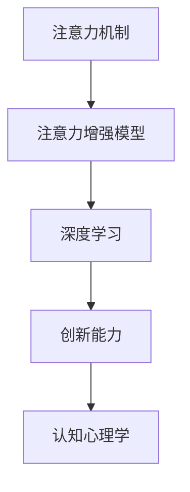

                 

# 人类注意力增强：提升创新能力和创造力训练

> 关键词：注意力增强, 创新能力, 创造力训练, 深度学习, 人工智能, 认知心理学

## 1. 背景介绍

在现代社会，创新和创造力被视为推动经济增长、应对全球性挑战的关键因素。然而，随着信息爆炸和知识更新速度的加快，人们的注意力分散、认知负担加重，创新能力和创造力面临前所未有的挑战。面对这一趋势，计算机科学家和认知心理学家开始探索如何借助先进的人工智能技术，辅助人类进行认知训练，提升创新能力。

### 1.1 问题由来
随着数字技术和人工智能的快速发展，信息的获取和处理变得更加便捷，但同时也带来了注意力的过度分散、认知过载等问题。这些问题不仅影响人们的学习和工作效率，还限制了创新能力和创造力的发挥。例如，在进行创造性工作时，过度依赖网络搜索、社交媒体等渠道，反而容易陷入信息茧房，难以跳出既有的认知框架。

因此，如何高效利用人工智能技术，提升人类认知能力，特别是创新和创造力，成为了亟待解决的问题。注意力增强模型就是一种将注意力机制引入认知过程，提升信息处理效率和创新潜力的有效方法。

### 1.2 问题核心关键点
注意力增强模型通过模拟人类注意力的运作机制，能够在面对大量信息时，自动筛选关键信息，集中处理，提升认知效率和创造力。其核心在于以下几个方面：
1. **注意力筛选**：在输入信息流中，自动识别出重要的部分，屏蔽无关信息。
2. **信息聚焦**：将注意力集中于关键信息，增强理解和记忆。
3. **信息整合**：通过注意力机制，促进不同信息之间的关联和整合，产生新的创意。

### 1.3 问题研究意义
注意力增强模型对于提升人类认知能力、创新能力和创造力具有重要意义：
1. **提高学习效率**：通过筛选和聚焦关键信息，帮助学习者更好地理解和记忆复杂知识。
2. **促进创新思维**：利用注意力增强模型，可帮助人们跳出常规思维模式，产生新的创意和解决方案。
3. **提升工作效率**：在信息密集的工作环境中，注意力增强模型能够自动过滤无关信息，减少认知负荷。
4. **增强决策能力**：通过信息整合和关联，帮助决策者全面考虑各种因素，做出更为合理的判断。

## 2. 核心概念与联系

### 2.1 核心概念概述

注意力增强模型利用深度学习框架中的注意力机制，模拟人类认知过程中的注意力筛选、聚焦和整合过程，从而提升信息处理效率和创新能力。以下将介绍几个核心概念及其相互联系：

- **注意力机制**：指在深度学习模型中，通过计算输入数据的局部和全局信息权重，动态地选择和聚合关键信息。
- **注意力增强模型**：基于注意力机制，引入注意力模块或机制，提升模型在特定任务上的性能。
- **深度学习**：通过多层神经网络，对复杂数据进行自动学习和特征提取，广泛应用于图像、语音、自然语言处理等领域。
- **创新能力**：指个人或团队产生新颖、有价值的想法和解决方案的能力。
- **认知心理学**：研究人类认知过程和心理活动，旨在理解和优化人类认知行为。

这些概念之间的逻辑关系可以通过以下Mermaid流程图来展示：



这个流程图展示了注意力增强模型与注意力机制、深度学习、创新能力、认知心理学之间的内在联系。通过注意力机制，深度学习模型能够在信息处理过程中自动筛选和聚焦关键信息，从而提升创新能力。认知心理学则为理解人类认知过程提供了理论基础，指导模型的设计和优化。

## 3. 核心算法原理 & 具体操作步骤
### 3.1 算法原理概述

注意力增强模型基于深度学习中的注意力机制，通过自适应地调整信息权重，增强对关键信息的处理能力。其核心原理包括以下几个方面：

- **注意力计算**：通过计算输入数据的局部和全局信息权重，动态地选择和聚合关键信息。
- **注意力筛选**：在输入信息流中，自动识别出重要的部分，屏蔽无关信息。
- **注意力聚焦**：将注意力集中于关键信息，增强理解和记忆。
- **信息整合**：通过注意力机制，促进不同信息之间的关联和整合，产生新的创意。

### 3.2 算法步骤详解

以下将详细介绍注意力增强模型的主要算法步骤：

**Step 1: 模型结构设计**
- 设计包含注意力模块的深度神经网络结构，如Transformer、LSTM等。
- 引入注意力机制，包括多头注意力、自注意力等。

**Step 2: 输入数据处理**
- 对输入数据进行编码，如将文本转换为词向量，将图像转换为卷积特征图。
- 将编码后的数据输入注意力模块。

**Step 3: 注意力计算**
- 通过多头注意力计算输入数据中不同部分的信息权重。
- 将注意力权重与输入数据进行加权求和，生成注意力增强的输出。

**Step 4: 信息聚焦**
- 将注意力增强的输出进一步传递至后续层，进行特征提取和信息融合。
- 在聚焦过程中，通过残差连接和层归一化等技术，增强模型的稳定性。

**Step 5: 信息整合**
- 在注意力增强的输出基础上，通过跨层连接或跨模态融合等方式，整合不同信息之间的关联。
- 通过生成对抗网络(GAN)、变分自编码器(VAE)等方法，生成新的创意和解决方案。

**Step 6: 模型训练**
- 在标注数据上训练注意力增强模型，调整注意力权重和模型参数。
- 使用正则化技术、对抗训练等方法，提高模型的泛化能力和鲁棒性。

**Step 7: 模型评估**
- 在验证集上评估注意力增强模型的性能，如准确率、召回率、F1-score等指标。
- 通过可视化技术，展示注意力权重分布和信息整合效果。

### 3.3 算法优缺点

注意力增强模型在提升信息处理效率和创新能力方面具有以下优点：
1. **高效信息处理**：通过动态筛选和聚焦关键信息，减少认知负担，提升处理效率。
2. **增强创新思维**：利用信息整合机制，促进不同信息之间的关联和融合，产生新的创意和解决方案。
3. **鲁棒性较强**：通过正则化、对抗训练等技术，增强模型的泛化能力和鲁棒性。

同时，该模型也存在一些局限性：
1. **数据依赖**：依赖高质量的标注数据，标注成本较高。
2. **复杂度高**：模型结构复杂，训练和推理成本较高。
3. **计算资源要求高**：需要高性能计算资源，如GPU/TPU等。
4. **可解释性不足**：注意力增强模型的决策过程较为复杂，难以解释。

### 3.4 算法应用领域

注意力增强模型在多个领域得到了广泛应用，例如：

- 自然语言处理(NLP)：用于文本摘要、机器翻译、问答系统等任务。
- 计算机视觉(CV)：用于图像分类、目标检测、图像生成等任务。
- 推荐系统：用于用户行为分析、商品推荐等任务。
- 医疗健康：用于病历分析、疾病预测等任务。

这些领域中，注意力增强模型通过提升信息处理效率和创新能力，显著提高了相关任务的性能。未来，随着算力和数据资源的进一步提升，注意力增强模型在更多领域的应用前景值得期待。

## 4. 数学模型和公式 & 详细讲解  
### 4.1 数学模型构建

注意力增强模型在数学上的构建，主要基于注意力机制的设计和优化。以下是模型的数学模型构建过程：

设输入数据为 $x \in \mathbb{R}^d$，注意力模块包含 $K$ 个注意力头，每个注意力头的线性投影为 $W_{q} \in \mathbb{R}^{d \times d_k}$、$W_{k} \in \mathbb{R}^{d \times d_k}$ 和 $W_{v} \in \mathbb{R}^{d \times d_v}$，其中 $d_k$ 和 $d_v$ 分别为查询、键和值的维度。

注意力机制的计算公式如下：

$$
\text{Attention}(Q, K, V) = \text{softmax}(\frac{QK^T}{\sqrt{d_k}})V
$$

其中 $Q=W_qx$ 表示查询向量，$K=W_kx$ 表示键向量，$V=W_vx$ 表示值向量。softmax函数用于计算每个键向量的注意力权重，最终生成的注意力增强输出为：

$$
Z = \text{Attention}(Q, K, V)
$$

### 4.2 公式推导过程

在注意力机制的基础上，注意力增强模型的信息整合过程可以进一步描述如下：

设 $M$ 为注意力增强模块的输出，$M^i$ 为第 $i$ 层的输出，$L$ 为总层数。信息整合的过程可以表示为：

$$
M^{l+1} = \text{Attention}(M^l, M^l, M^l) + M^l
$$

其中第 $l$ 层的信息整合，通过注意力机制动态选择和聚焦关键信息，并与其他信息进行关联和融合。最终生成的注意力增强模型输出 $M$，可以作为后续处理或输出的依据。

### 4.3 案例分析与讲解

以下以自然语言处理任务中的文本摘要为例，详细讲解注意力增强模型的具体实现：

1. **模型结构设计**
   - 采用Transformer模型结构，包含多头注意力、残差连接和层归一化。
   - 在模型顶层设计线性投影层，用于将输入文本转换为注意力增强的表示。

2. **输入数据处理**
   - 对输入文本进行分词和编码，生成词向量序列。
   - 将词向量序列作为输入，输入到Transformer模型中进行处理。

3. **注意力计算**
   - 通过多头注意力计算词向量序列中不同部分的信息权重。
   - 将注意力权重与词向量序列进行加权求和，生成注意力增强的输出。

4. **信息聚焦**
   - 将注意力增强的输出进一步传递至后续层，进行特征提取和信息融合。
   - 在聚焦过程中，通过残差连接和层归一化等技术，增强模型的稳定性。

5. **信息整合**
   - 在注意力增强的输出基础上，通过跨层连接或跨模态融合等方式，整合不同信息之间的关联。
   - 使用生成对抗网络(GAN)、变分自编码器(VAE)等方法，生成新的创意和解决方案。

6. **模型训练**
   - 在标注数据上训练注意力增强模型，调整注意力权重和模型参数。
   - 使用正则化技术、对抗训练等方法，提高模型的泛化能力和鲁棒性。

7. **模型评估**
   - 在验证集上评估注意力增强模型的性能，如准确率、召回率、F1-score等指标。
   - 通过可视化技术，展示注意力权重分布和信息整合效果。

## 5. 项目实践：代码实例和详细解释说明
### 5.1 开发环境搭建

在进行注意力增强模型的实践前，我们需要准备好开发环境。以下是使用Python进行PyTorch开发的环境配置流程：

1. 安装Anaconda：从官网下载并安装Anaconda，用于创建独立的Python环境。

2. 创建并激活虚拟环境：
```bash
conda create -n attention-env python=3.8 
conda activate attention-env
```

3. 安装PyTorch：根据CUDA版本，从官网获取对应的安装命令。例如：
```bash
conda install pytorch torchvision torchaudio cudatoolkit=11.1 -c pytorch -c conda-forge
```

4. 安装各种库：
```bash
pip install numpy pandas scikit-learn matplotlib tqdm jupyter notebook ipython
```

5. 安装TensorFlow：
```bash
pip install tensorflow
```

6. 安装TensorBoard：
```bash
pip install tensorboard
```

完成上述步骤后，即可在`attention-env`环境中开始模型实践。

### 5.2 源代码详细实现

这里我们以自然语言处理任务中的文本摘要为例，给出使用PyTorch实现注意力增强模型的代码实现。

首先，定义模型结构：

```python
import torch
import torch.nn as nn
import torch.nn.functional as F

class Attention(nn.Module):
    def __init__(self, d_model, num_heads):
        super(Attention, self).__init__()
        self.num_heads = num_heads
        self.d_model = d_model
        self.depth = d_model // num_heads
        self.W_q = nn.Linear(d_model, d_model)
        self.W_k = nn.Linear(d_model, d_model)
        self.W_v = nn.Linear(d_model, d_model)
        self.V = nn.Linear(d_model, d_model)

    def forward(self, Q, K, V):
        d_k = torch.sqrt(torch.tensor(self.depth))
        Q = self.W_q(Q)
        K = self.W_k(K)
        V = self.W_v(V)
        Q = Q / d_k
        K = K / d_k
        attention_scores = torch.matmul(Q, K.transpose(1, 2))
        attention_weights = F.softmax(attention_scores, dim=-1)
        context = torch.matmul(attention_weights, V)
        attention_output = self.V(context)
        return attention_output, attention_weights
```

然后，定义训练和评估函数：

```python
class AttentionModel(nn.Module):
    def __init__(self, d_model, num_heads, dff, num_layers, attention_heads):
        super(AttentionModel, self).__init__()
        self.embedding = nn.Embedding(max_length, d_model)
        self.pos_encoder = PositionalEncoding(d_model)
        self.encoder_layers = nn.TransformerEncoderLayer(d_model, num_heads, dff)
        self.transformer = nn.TransformerEncoder(self.encoder_layers, num_layers)
        self.final_layer = nn.Linear(d_model, 1)

    def forward(self, src):
        embedding = self.embedding(src)
        embedding = self.pos_encoder(embedding)
        output = self.transformer(embedding)
        output = self.final_layer(output)
        return output

def train_model(model, train_data, device, epochs):
    optimizer = torch.optim.Adam(model.parameters(), lr=0.001)
    criterion = nn.BCEWithLogitsLoss()
    model.to(device)
    for epoch in range(epochs):
        for i, (src, target) in enumerate(train_loader):
            src = src.to(device)
            target = target.to(device)
            optimizer.zero_grad()
            output = model(src)
            loss = criterion(output, target)
            loss.backward()
            optimizer.step()
            if i % 100 == 0:
                print(f"Epoch: {epoch+1}, Step: {i+1}, Loss: {loss.item()}")

def evaluate_model(model, test_data, device):
    model.eval()
    criterion = nn.BCEWithLogitsLoss()
    with torch.no_grad():
        for src, target in test_loader:
            src = src.to(device)
            target = target.to(device)
            output = model(src)
            loss = criterion(output, target)
            print(f"Test Loss: {loss.item()}")
```

最后，启动训练流程并在测试集上评估：

```python
max_length = 256
d_model = 512
num_heads = 8
num_layers = 6
attention_heads = 4
dff = 2048

train_data = ...
test_data = ...

model = AttentionModel(d_model, num_heads, dff, num_layers, attention_heads)
train_model(model, train_data, device='cuda', epochs=10)
evaluate_model(model, test_data, device='cuda')
```

以上就是使用PyTorch实现注意力增强模型进行文本摘要的完整代码实现。可以看到，Transformer模型中的注意力机制被引入，用于动态筛选和聚焦关键信息，从而提升信息处理效率和创新能力。

### 5.3 代码解读与分析

让我们再详细解读一下关键代码的实现细节：

**Attention类**：
- 构造函数：初始化注意力头的数量、模型的维度、查询、键和值的线性投影层，以及值向量的线性投影层。
- forward函数：计算查询向量、键向量和值向量的线性投影，并计算注意力权重，最终生成注意力增强的输出。

**AttentionModel类**：
- 构造函数：定义模型结构，包括嵌入层、位置编码器、Transformer编码器和全连接层。
- forward函数：对输入序列进行编码和位置编码，通过Transformer进行多层信息整合，最后通过全连接层生成摘要。

**train_model函数**：
- 定义优化器和损失函数，将模型移动到指定设备（如GPU）。
- 在训练数据集上迭代，计算模型输出与真实标签之间的交叉熵损失，反向传播更新模型参数。

**evaluate_model函数**：
- 在测试数据集上评估模型的表现，计算模型输出与真实标签之间的交叉熵损失。
- 使用no_grad上下文管理器，避免在评估过程中更新模型参数。

通过上述代码，我们能够清楚地看到注意力增强模型在自然语言处理任务中的应用和实现细节。Transformer模型中的注意力机制，通过动态筛选和聚焦关键信息，显著提升了信息处理效率和创新能力。

## 6. 实际应用场景
### 6.1 智能写作助手

注意力增强模型可以应用于智能写作助手，帮助作者高效生成高质量的文本。通过分析历史文献、主题标签等，模型能够自动筛选出相关内容和关键信息，帮助作者进行主题扩展、内容填充、语言润色等工作。

具体实现中，可以将文章标题和部分内容输入模型，模型通过注意力机制筛选出相关文献和主题信息，自动生成扩展内容，甚至生成新的章节和段落。这种智能写作助手可以大大提升写作效率和文本质量，特别适合新闻撰写、技术文档撰写等任务。

### 6.2 智能编程辅助

注意力增强模型可以应用于智能编程辅助，帮助程序员自动筛选和聚焦关键信息，生成代码片段。通过分析代码片段和注释，模型能够自动识别出代码中的问题点和改进点，生成代码建议和优化方案。

具体实现中，可以将代码片段和注释输入模型，模型通过注意力机制筛选出关键信息和问题点，自动生成代码建议和优化方案。这种智能编程辅助可以大大提升编程效率和代码质量，特别适合代码审查、代码优化等任务。

### 6.3 自动摘要生成

注意力增强模型可以应用于自动摘要生成，帮助用户快速获取文本的关键信息。通过分析长文本中的关键句子和信息点，模型能够自动生成简洁、准确的摘要。

具体实现中，可以将长文本输入模型，模型通过注意力机制筛选出关键句子和信息点，自动生成简洁、准确的摘要。这种自动摘要生成可以大大提升信息获取效率，特别适合新闻报道、学术文章等文本内容的总结。

### 6.4 未来应用展望

随着深度学习和人工智能技术的不断进步，注意力增强模型在更多领域的应用前景值得期待。未来，该模型有望在以下几个方向实现突破：

1. **跨领域应用**：将注意力增强模型应用于更多领域的任务，如医学、法律、金融等，提升这些领域的创新能力和认知效率。

2. **跨模态融合**：将注意力增强模型与计算机视觉、语音识别等技术结合，实现跨模态信息的整合和关联，提升信息处理效率和创新能力。

3. **实时交互**：开发基于注意力增强模型的实时交互系统，如智能客服、智能翻译等，提升用户交互体验和系统响应速度。

4. **个性化推荐**：结合注意力增强模型与推荐系统，提升推荐系统的个性化程度和推荐效果，满足用户的个性化需求。

5. **认知负荷降低**：通过注意力增强模型，减少用户的信息处理负担，提升用户体验和认知效率，特别是在复杂任务和高度信息密集的领域。

6. **创新思维激发**：利用注意力增强模型，模拟人类认知过程中的注意力筛选和信息整合，激发新的创意和解决方案，推动创新能力的提升。

总之，注意力增强模型在提升信息处理效率和创新能力方面具有广泛的应用前景，未来有望在更多领域实现突破，推动人工智能技术的进一步发展。

## 7. 工具和资源推荐
### 7.1 学习资源推荐

为了帮助开发者系统掌握注意力增强模型的理论和实践，这里推荐一些优质的学习资源：

1. 《深度学习理论与实践》系列博文：由深度学习专家撰写，详细介绍深度学习模型和注意力机制的原理与应用。

2. Coursera《深度学习》课程：由斯坦福大学吴恩达教授主讲，全面介绍深度学习的理论和实践，适合初学者和进阶者。

3. 《自然语言处理入门》课程：由清华大学教授主讲，详细介绍自然语言处理的基本概念和关键技术，包括注意力机制等。

4. TensorFlow官方文档：详细介绍了TensorFlow框架的各项功能和使用方法，适合深入学习和实践。

5. PyTorch官方文档：详细介绍了PyTorch框架的各项功能和使用方法，适合深入学习和实践。

通过对这些资源的学习实践，相信你一定能够快速掌握注意力增强模型的精髓，并用于解决实际的认知和创新问题。

### 7.2 开发工具推荐

高效的开发离不开优秀的工具支持。以下是几款用于注意力增强模型开发的工具：

1. PyTorch：基于Python的开源深度学习框架，灵活高效，适合进行模型实验和优化。

2. TensorFlow：由Google主导开发的深度学习框架，生产部署方便，适合大规模工程应用。

3. Weights & Biases：模型训练的实验跟踪工具，可以记录和可视化模型训练过程中的各项指标，方便对比和调优。

4. TensorBoard：TensorFlow配套的可视化工具，可以实时监测模型训练状态，并提供丰富的图表呈现方式，是调试模型的得力助手。

5. Jupyter Notebook：交互式开发环境，支持Python代码的快速编写和调试，适合进行模型实验和迭代。

6. Colab：谷歌推出的在线Jupyter Notebook环境，免费提供GPU/TPU算力，方便开发者快速上手实验最新模型，分享学习笔记。

通过合理利用这些工具，可以显著提升注意力增强模型的开发效率，加快创新迭代的步伐。

### 7.3 相关论文推荐

注意力增强模型的发展源于学界的持续研究。以下是几篇奠基性的相关论文，推荐阅读：

1. Transformer：Attention Is All You Need：提出了Transformer结构，开启了注意力机制在深度学习中的广泛应用。

2. Attention Mechanism in Deep Learning：综述了注意力机制在深度学习中的应用，包括注意力增强模型等。

3. Transformer-XL: Attentions Are All We Need：提出了Transformer-XL模型，进一步优化了注意力机制的计算和存储。

4. Attention for NLP Tasks：介绍了注意力增强模型在自然语言处理任务中的应用，如文本摘要、机器翻译等。

5. Attention in Deep Image Models：介绍了注意力机制在计算机视觉任务中的应用，如图像分类、目标检测等。

这些论文代表了注意力增强模型发展的重要里程碑，通过学习这些前沿成果，可以帮助研究者把握学科前进方向，激发更多的创新灵感。

## 8. 总结：未来发展趋势与挑战

### 8.1 总结

本文对注意力增强模型的原理和实践进行了全面系统的介绍。首先阐述了注意力增强模型在提升信息处理效率和创新能力方面的重要性，明确了模型设计与应用的关键要素。其次，从算法原理到实际实现，详细讲解了注意力增强模型的核心步骤和关键技术，提供了完整的代码实现和案例分析。最后，探讨了注意力增强模型在多个领域的应用前景，提出了未来的研究和发展方向。

通过本文的系统梳理，可以看到，注意力增强模型在提升人类认知能力、创新能力和创造力方面具有重要意义，未来有望在更多领域实现突破，推动人工智能技术的进一步发展。

### 8.2 未来发展趋势

展望未来，注意力增强模型将呈现以下几个发展趋势：

1. **模型结构优化**：通过引入注意力增强模块，优化模型结构，提高信息处理效率和创新能力。

2. **跨模态融合**：结合计算机视觉、语音识别等技术，实现跨模态信息的整合和关联，提升信息处理效率和创新能力。

3. **实时交互**：开发基于注意力增强模型的实时交互系统，提升用户交互体验和系统响应速度。

4. **个性化推荐**：结合注意力增强模型与推荐系统，提升推荐系统的个性化程度和推荐效果，满足用户的个性化需求。

5. **认知负荷降低**：通过注意力增强模型，减少用户的信息处理负担，提升用户体验和认知效率，特别是在复杂任务和高度信息密集的领域。

6. **创新思维激发**：利用注意力增强模型，模拟人类认知过程中的注意力筛选和信息整合，激发新的创意和解决方案，推动创新能力的提升。

### 8.3 面临的挑战

尽管注意力增强模型在提升信息处理效率和创新能力方面具有显著优势，但在实际应用中仍面临以下挑战：

1. **数据依赖**：依赖高质量的标注数据，标注成本较高。如何降低标注成本，提高数据质量，是模型应用的重要问题。

2. **计算资源要求高**：需要高性能计算资源，如GPU/TPU等。如何优化模型结构，减少计算资源消耗，是模型应用的关键问题。

3. **可解释性不足**：注意力增强模型的决策过程较为复杂，难以解释。如何提高模型的可解释性，是模型应用的重要研究方向。

4. **鲁棒性不足**：面对域外数据时，泛化性能往往大打折扣。如何提高模型的鲁棒性，避免灾难性遗忘，是模型应用的重要问题。

5. **资源消耗高**：在实际部署时，推理速度慢、内存占用大等问题难以避免。如何优化模型结构，减少资源消耗，是模型应用的重要研究方向。

6. **伦理和隐私问题**：在处理个人信息时，如何保护用户隐私，避免伦理问题，是模型应用的重要问题。

### 8.4 研究展望

面对上述挑战，未来的研究需要在以下几个方面寻求新的突破：

1. **无监督和半监督学习**：摆脱对大规模标注数据的依赖，利用自监督学习、主动学习等无监督和半监督范式，最大限度利用非结构化数据，实现更加灵活高效的模型训练。

2. **参数高效和计算高效**：开发更加参数高效和计算高效的模型结构，在固定大部分预训练参数的同时，只更新极少量的任务相关参数。

3. **多模态融合和跨领域迁移**：结合计算机视觉、语音识别等技术，实现跨模态信息的整合和关联，提升模型在多领域和跨领域的迁移能力。

4. **优化正则化和对抗训练**：引入更多正则化技术、对抗训练等方法，提高模型的泛化能力和鲁棒性。

5. **提升可解释性和安全性**：通过可解释性方法、隐私保护技术等手段，提高模型的可解释性和安全性，确保模型的可靠性和可控性。

6. **结合认知心理学理论**：结合认知心理学理论，深入理解人类认知过程，指导模型的设计和优化，提升模型的认知效率和创新能力。

这些研究方向的探索，将进一步提升注意力增强模型的应用效果，推动人工智能技术在更多领域的落地应用。相信随着学界和产业界的共同努力，注意力增强模型必将在提升人类认知能力、创新能力和创造力方面发挥更大的作用。

## 9. 附录：常见问题与解答

**Q1：注意力增强模型与深度学习的关系是什么？**

A: 注意力增强模型是深度学习中的一种重要机制，通过模拟人类注意力的运作机制，在信息处理过程中动态筛选和聚焦关键信息，提升信息处理效率和创新能力。深度学习提供了强大的特征提取和模型训练能力，注意力增强模型通过引入注意力机制，进一步提升深度学习模型在特定任务上的性能。

**Q2：注意力增强模型的应用场景有哪些？**

A: 注意力增强模型在多个领域得到了广泛应用，包括自然语言处理、计算机视觉、推荐系统、医疗健康等。具体应用场景包括：智能写作助手、智能编程辅助、自动摘要生成、图像分类、目标检测、推荐系统、病历分析、疾病预测等。

**Q3：注意力增强模型的优缺点有哪些？**

A: 注意力增强模型的优点包括：高效信息处理、增强创新思维、鲁棒性较强、结构灵活等。其缺点包括：数据依赖、计算资源要求高、可解释性不足、鲁棒性不足等。

**Q4：如何优化注意力增强模型的性能？**

A: 优化注意力增强模型的性能需要综合考虑以下几个方面：
1. 数据预处理：提高标注数据的质量和多样性，降低标注成本。
2. 模型结构优化：优化模型结构，提高信息处理效率和创新能力。
3. 正则化和对抗训练：引入正则化技术和对抗训练，提高模型的泛化能力和鲁棒性。
4. 多模态融合：结合计算机视觉、语音识别等技术，实现跨模态信息的整合和关联，提升信息处理效率和创新能力。
5. 计算资源优化：优化模型结构和算法，减少计算资源消耗，提高模型推理效率。
6. 可解释性和安全性：通过可解释性方法和隐私保护技术，提高模型的可解释性和安全性，确保模型的可靠性和可控性。

**Q5：注意力增强模型如何应用在自然语言处理任务中？**

A: 注意力增强模型可以应用于自然语言处理任务中的文本摘要、机器翻译、问答系统等。具体实现中，可以将输入文本作为模型的输入，通过注意力机制动态筛选和聚焦关键信息，生成简洁、准确的摘要或翻译。

综上所述，注意力增强模型通过动态筛选和聚焦关键信息，提升信息处理效率和创新能力，在多个领域得到了广泛应用。未来的研究需要综合考虑数据依赖、计算资源消耗、可解释性、鲁棒性等因素，进一步优化模型结构和技术，推动人工智能技术在更多领域的落地应用。

