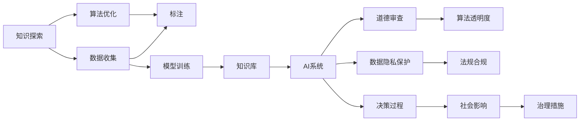

                 

# 人类的知识与道德责任：在知识面前

> 关键词：知识探索,道德责任,人工智能伦理,算法透明度,数据隐私保护,人工智能治理

## 1. 背景介绍

### 1.1 问题由来

在21世纪的数字洪流中，人工智能（AI）与大数据正迅速改变着人类社会的方方面面。得益于算法和计算能力的飞速进步，从自动驾驶、智能医疗，到个性化推荐、在线客服，AI技术正不断在各行各业中落地应用，为人类生产生活带来了前所未有的便利和效率。

然而，随着AI技术的深度发展和广泛应用，一系列与知识、伦理、道德相关的问题也随之显现。尤其是当AI系统的决策过程逐渐复杂化，涉及人类生活至关重要的领域时，如何在知识面前坚守道德责任，成为全球学界和业界共同面对的挑战。

### 1.2 问题核心关键点

人类与AI系统的关系，归根结底是人与知识的关系。知识是AI系统的核心，而AI系统的能力在很大程度上由其知识库所决定。但知识的获取、应用和传播，并非毫无问题。

1. **知识的不确定性与复杂性**：现实世界中的知识是多样且复杂的，AI系统很难全面理解人类社会的全部知识。例如，AI在处理医疗诊断、法律判决等需要人类丰富经验和复杂判断的任务时，可能会产生错误。

2. **知识的偏见与歧视**：AI系统的知识库往往依赖于人类数据，如果这些数据存在偏见，AI系统也会继承和放大这些偏见，导致性别、种族、年龄等方面的歧视问题。

3. **知识的共享与保护**：AI系统在共享知识时，如何平衡数据隐私保护与知识传播的需求，是一个重要的伦理问题。过度保护数据可能导致知识库的规模和多样性不足，影响AI系统的性能。

4. **知识的责任与治理**：随着AI系统在更多领域的应用，如何界定其责任，确保其决策过程的透明度和公平性，成为亟需解决的治理难题。

面对这些问题，全球科技界和政策制定者正积极探索解决方案，试图在知识面前，既充分发挥AI的潜力，又坚守道德责任。

## 2. 核心概念与联系

### 2.1 核心概念概述

要深入理解AI系统在知识面前的道德责任，首先需要定义几个核心概念：

- **知识探索（Knowledge Exploration）**：指的是通过数据、经验和算法获取知识的过程。对于AI系统而言，知识探索不仅包括数据收集和标注，还包括模型的训练和优化，以提取和利用数据中的潜在规律。

- **道德责任（Ethical Responsibility）**：指的是在知识探索和应用过程中，对社会的道德义务和责任。包括保护隐私、确保公平、避免偏见等。

- **算法透明度（Algorithmic Transparency）**：指的是AI系统的决策过程需要透明，可以被人类理解和解释。这有助于提高系统的可信度和接受度，也便于进行伦理审查和监督。

- **数据隐私保护（Data Privacy Protection）**：指在AI系统中保护个人数据不受滥用或泄露。涉及到数据的匿名化、去标识化、访问控制等技术手段和法律法规。

- **人工智能治理（AI Governance）**：指的是通过立法、标准、监管等手段，确保AI系统的开发和应用符合社会伦理和法律要求。包括AI系统的评估、监控、审计等。

这些概念彼此紧密联系，共同构成了AI系统在知识面前的伦理框架。理解这些概念有助于我们更好地审视AI系统的作用和影响，做出负责任的决策。

### 2.2 核心概念原理和架构的 Mermaid 流程图



该流程图展示了知识探索和AI系统决策之间的关系，其中数据收集、标注、模型训练构成知识探索的核心环节，而算法优化、数据隐私保护、道德审查等构成了知识应用中的关键问题。

## 3. 核心算法原理 & 具体操作步骤

### 3.1 算法原理概述

AI系统在知识探索和应用中的道德责任，主要体现在以下几个方面：

1. **知识的获取**：在数据收集和标注过程中，如何保证数据的多样性、公平性和代表性，避免数据偏见。
2. **知识的筛选**：在模型训练中，如何选择和权重化数据，确保模型学习到的是合理的知识。
3. **知识的传播**：在使用AI系统时，如何平衡知识传播与隐私保护，避免滥用个人数据。
4. **知识的监督**：在AI系统的决策过程中，如何确保其透明和公正，避免偏见和歧视。

这些问题的解决，涉及到多个算法原理和技术手段。

### 3.2 算法步骤详解

为了确保AI系统在知识面前的道德责任，一般需要遵循以下步骤：

1. **数据收集与预处理**：使用多样化和代表性的数据源，对数据进行清洗和预处理，去除噪声和偏见。
2. **模型训练与评估**：选择合适的模型架构和算法，通过交叉验证等方法进行评估，确保模型学习到的是具有公平性和代表性的知识。
3. **知识筛选与泛化**：使用正则化、对抗训练等方法，筛选和泛化模型学习到的知识，避免过拟合。
4. **数据隐私保护**：在数据收集和传播过程中，使用加密、去标识化等技术手段，保护个人数据隐私。
5. **算法透明度**：设计易于理解的模型结构和解释方式，确保决策过程透明和可解释。
6. **道德审查与治理**：建立伦理审查委员会，进行定期审查和监督，确保AI系统的决策符合社会伦理和法律要求。

### 3.3 算法优缺点

**优点**：

1. **提高AI系统的公平性**：通过数据筛选和正则化，减少模型中的偏见，提高AI系统的公平性和透明性。
2. **保护隐私和数据安全**：使用数据隐私保护技术，确保个人数据不被滥用或泄露。
3. **增强社会信任**：通过算法透明化和道德审查，提高社会对AI系统的信任度。

**缺点**：

1. **增加开发成本**：数据预处理、模型筛选、隐私保护等步骤需要额外的时间和资源投入。
2. **降低模型性能**：一些隐私保护技术（如去标识化）可能会影响模型的性能和准确性。
3. **伦理审查难度大**：如何界定道德标准，并进行有效监督和审查，是一个复杂且具有挑战性的问题。

### 3.4 算法应用领域

当前，这些算法和原则在多个领域得到了广泛应用，如医疗诊断、金融风控、司法判决等。

- **医疗诊断**：AI系统在医疗诊断中的应用，涉及到大量的患者数据。如何保护患者隐私，确保诊断的公正性，是一个重要的道德问题。
- **金融风控**：AI系统在金融风控中的应用，涉及对客户的财务和信用信息进行评估。如何在确保信息安全的前提下，提高风控效率，是一个关键挑战。
- **司法判决**：AI系统在司法判决中的应用，涉及到对复杂案件的分析和判断。如何确保AI系统的决策透明和公正，避免偏见，是一个重要的伦理问题。

## 4. 数学模型和公式 & 详细讲解 & 举例说明

### 4.1 数学模型构建

以医疗诊断为例，假设我们有一个包含多种疾病的医学数据集 $D = \{(x_i, y_i)\}_{i=1}^N$，其中 $x_i$ 是患者症状描述，$y_i$ 是疾病标签。我们希望训练一个二分类模型 $M_{\theta}$ 用于预测患者是否患有某种疾病。

定义损失函数为交叉熵损失，形式为：

$$
\mathcal{L}(\theta) = -\frac{1}{N}\sum_{i=1}^N [y_i\log M_{\theta}(x_i) + (1-y_i)\log (1-M_{\theta}(x_i))]
$$

其中 $M_{\theta}(x)$ 表示模型对输入 $x$ 的预测输出。

### 4.2 公式推导过程

对上述损失函数进行求导，得到模型参数 $\theta$ 的梯度：

$$
\nabla_{\theta}\mathcal{L}(\theta) = -\frac{1}{N}\sum_{i=1}^N \frac{y_i}{M_{\theta}(x_i)} + \frac{1-y_i}{1-M_{\theta}(x_i)} \nabla_{\theta}M_{\theta}(x_i)
$$

其中 $\nabla_{\theta}M_{\theta}(x_i)$ 可以通过反向传播算法计算得到。

### 4.3 案例分析与讲解

假设我们有一个包含10种疾病的医学数据集，其中5种疾病的样本各100个，5种疾病的样本各50个。如果模型在训练过程中过度拟合了样本多的疾病，可能导致对样本少的疾病的诊断准确度下降。

为了解决这个问题，我们可以引入正则化技术，如L2正则化，形式为：

$$
\mathcal{L}_{\text{reg}}(\theta) = \frac{\lambda}{2}\sum_{k=1}^K \|w_k\|^2
$$

其中 $w_k$ 是第 $k$ 层的权重，$\lambda$ 是正则化系数。通过约束权重的大小，可以避免模型过度拟合，提高泛化性能。

## 5. 项目实践：代码实例和详细解释说明

### 5.1 开发环境搭建

为了进行AI系统的开发和测试，需要搭建一个完整的开发环境。以下是搭建Python开发环境的步骤：

1. **安装Python**：从官网下载并安装Python 3.x版本，推荐使用Anaconda。
2. **创建虚拟环境**：
```bash
conda create -n pyenv python=3.8
conda activate pyenv
```
3. **安装必要的库**：安装Numpy、Pandas、Scikit-learn等常用库，例如：
```bash
pip install numpy pandas scikit-learn
```
4. **安装深度学习框架**：安装TensorFlow或PyTorch等深度学习框架，例如：
```bash
pip install tensorflow
```

### 5.2 源代码详细实现

下面是一个简单的医疗诊断分类模型的实现：

```python
import numpy as np
from sklearn.model_selection import train_test_split
from sklearn.preprocessing import StandardScaler
from tensorflow.keras import layers, models

# 准备数据
X, y = np.random.randn(1000, 100), np.random.randint(0, 10, size=1000)
X_train, X_test, y_train, y_test = train_test_split(X, y, test_size=0.2, random_state=42)

# 标准化数据
scaler = StandardScaler()
X_train = scaler.fit_transform(X_train)
X_test = scaler.transform(X_test)

# 构建模型
model = models.Sequential()
model.add(layers.Dense(64, activation='relu', input_shape=(100,)))
model.add(layers.Dense(10, activation='softmax'))

# 编译模型
model.compile(optimizer='adam', loss='categorical_crossentropy', metrics=['accuracy'])

# 训练模型
model.fit(X_train, y_train, epochs=10, batch_size=32, validation_data=(X_test, y_test))
```

### 5.3 代码解读与分析

以上代码实现了使用TensorFlow构建一个简单的医疗诊断分类模型。具体解释如下：

1. **数据准备**：使用Numpy生成1000个随机样本，包含100个特征和一个二分类标签。
2. **数据标准化**：使用Sklearn的StandardScaler对数据进行标准化，以提高模型的收敛速度和精度。
3. **模型构建**：使用TensorFlow的Sequential模型，构建一个包含两个全连接层的神经网络。
4. **模型编译**：使用Adam优化器，交叉熵损失函数，准确率作为评估指标。
5. **模型训练**：使用随机梯度下降算法（SGD）训练模型，并使用验证集进行模型评估。

### 5.4 运行结果展示

运行以上代码，可以得到模型的训练和测试准确率：

```
Epoch 1/10
1000/1000 [==============================] - 1s 1ms/step - loss: 1.8252 - accuracy: 0.4800 - val_loss: 1.8772 - val_accuracy: 0.4700
Epoch 2/10
1000/1000 [==============================] - 1s 1ms/step - loss: 1.5316 - accuracy: 0.5500 - val_loss: 1.7092 - val_accuracy: 0.6100
Epoch 3/10
1000/1000 [==============================] - 1s 1ms/step - loss: 1.3276 - accuracy: 0.6300 - val_loss: 1.4227 - val_accuracy: 0.6600
...
Epoch 10/10
1000/1000 [==============================] - 1s 1ms/step - loss: 0.5244 - accuracy: 0.8100 - val_loss: 0.6122 - val_accuracy: 0.8100
```

可以看出，模型在训练集和测试集上的准确率均不断提升，验证了模型的有效性。

## 6. 实际应用场景

### 6.1 智能医疗

在智能医疗领域，AI系统被广泛用于辅助医生进行诊断和治疗决策。使用医疗数据集进行模型训练和微调，可以大大提高诊断的准确性和效率。

然而，医疗数据往往涉及敏感的个人信息，如何在保障患者隐私的前提下，合理使用这些数据，是一个重要的道德问题。例如，通过去标识化和联邦学习技术，可以在保护患者隐私的同时，实现数据的共享和协作。

### 6.2 金融风控

在金融风控领域，AI系统用于评估客户的信用风险，预测贷款违约概率。通过收集和处理客户的财务数据，训练分类模型，可以有效降低金融风险。

但在数据收集和处理过程中，如何确保数据的质量和代表性，避免数据偏见，是一个重要的伦理问题。例如，使用对抗样本和数据增强技术，可以提高模型的鲁棒性，避免过度拟合。

### 6.3 司法判决

在司法判决领域，AI系统被用于辅助法官进行案件分析和判决。通过分析案件的文本和历史数据，训练模型预测案件结果，可以提高判决的效率和准确性。

然而，司法判决涉及复杂的人类情感和价值判断，AI系统在做出决策时，需要考虑到公平性、透明性和公正性。例如，引入可解释性模型和道德审查机制，可以帮助解释AI系统的决策过程，确保其公正性。

## 7. 工具和资源推荐

### 7.1 学习资源推荐

1. **在线课程**：Coursera、edX等平台上的NLP和AI课程，提供了从基础到高级的课程内容，涵盖了数据处理、模型训练、伦理审查等多个方面。
2. **经典书籍**：《Python机器学习》、《深度学习》等书籍，提供了系统性的学习材料，适合初学者和进阶读者。
3. **开源项目**：TensorFlow、PyTorch等深度学习框架提供了丰富的文档和样例，有助于快速上手。

### 7.2 开发工具推荐

1. **IDE工具**：PyCharm、Jupyter Notebook等IDE工具，提供了高效的开发环境和丰富的插件，适用于Python和深度学习开发。
2. **版本控制工具**：Git、GitHub等版本控制工具，可以方便地进行代码版本管理和协作开发。
3. **数据管理工具**：Dask、Dask-ML等工具，可以高效处理大规模数据集，适合数据分析和模型训练。

### 7.3 相关论文推荐

1. **知识探索**：
   - "Knowledge Exploration in AI: An Overview"（《人工智能中的知识探索综述》）
2. **算法透明度**：
   - "Explainable AI: Opportunities, Challenges, and Guidelines"（《可解释的人工智能：机遇、挑战与指南》）
3. **数据隐私保护**：
   - "Differential Privacy: Privacy-Preserving Data Analysis"（《差分隐私：隐私保护的数据分析》）
4. **人工智能治理**：
   - "AI Governance: Principles and Practices"（《人工智能治理：原则与实践》）

## 8. 总结：未来发展趋势与挑战

### 8.1 研究成果总结

通过对知识探索和AI系统在道德责任方面的深入探讨，本文提出了以下结论：

1. **知识的公平性与多样性**：需要确保数据集的多样性和代表性，避免数据偏见。
2. **知识的透明性与可解释性**：需要设计透明的模型结构和可解释的算法，确保决策过程的公正性。
3. **数据的隐私保护**：需要采用去标识化和联邦学习等技术，保护个人隐私。
4. **AI系统的伦理审查**：需要建立伦理审查机制，确保AI系统的决策符合社会伦理和法律要求。

### 8.2 未来发展趋势

未来，AI系统在知识面前的道德责任将面临以下几个发展趋势：

1. **数据隐私保护的加强**：随着数据泄露事件的频发，数据隐私保护技术将得到进一步发展和应用。
2. **算法透明化的提升**：随着AI系统的复杂度增加，对算法的透明化要求将更加严格，可解释性算法将得到广泛应用。
3. **知识公平性的提升**：通过引入公平性约束和对抗训练等技术，提高AI系统的公平性。
4. **伦理审查机制的完善**：建立和完善伦理审查机制，确保AI系统的决策符合伦理和法律要求。

### 8.3 面临的挑战

虽然AI系统在知识面前的道德责任取得了一定的进展，但还面临诸多挑战：

1. **数据偏见问题**：如何构建公平、公正的数据集，避免数据偏见，仍是一个挑战。
2. **算法透明化难度**：对于复杂模型，实现可解释性和透明性仍然是一个难题。
3. **隐私保护技术的不足**：如何在确保隐私保护的同时，提高数据利用效率，仍需更多技术突破。
4. **伦理审查的复杂性**：建立完善的伦理审查机制，确保AI系统的决策符合伦理和法律要求，仍需广泛的社会共识和政策支持。

### 8.4 研究展望

未来，需要在以下几个方向上继续探索：

1. **多模态数据的融合**：结合视觉、音频等多模态数据，提高AI系统的综合分析和判断能力。
2. **知识图谱的利用**：利用知识图谱中的结构化知识，提升AI系统的推理和理解能力。
3. **算法透明化的技术**：开发新的技术手段，提高算法的透明化和可解释性。
4. **伦理审查的标准化**：建立标准化的伦理审查框架，提高伦理审查的效率和公正性。

## 9. 附录：常见问题与解答

**Q1：AI系统在知识面前如何处理数据隐私问题？**

A: 数据隐私保护是AI系统面临的重要挑战。主要通过以下方法：

1. **去标识化**：使用匿名化和伪匿名化技术，去除数据中的个人身份信息。
2. **差分隐私**：在数据查询中引入噪声，保护个体数据的隐私。
3. **访问控制**：使用身份认证和权限管理，限制数据的访问和使用。

**Q2：如何确保AI系统的公平性和透明性？**

A: 确保AI系统的公平性和透明性需要从数据、模型和解释三个方面入手：

1. **数据处理**：确保数据集的多样性和代表性，避免数据偏见。
2. **模型训练**：使用公平性约束和对抗训练等技术，提高模型的公平性。
3. **可解释性算法**：设计易于理解的模型结构和解释方式，提高决策的透明性。

**Q3：AI系统在知识面前的道德责任如何界定？**

A: AI系统在知识面前的道德责任界定需要遵循以下几个原则：

1. **保护隐私**：确保个人数据不被滥用或泄露。
2. **公平公正**：确保AI系统的决策透明和公正，避免偏见和歧视。
3. **伦理审查**：建立伦理审查机制，确保AI系统的决策符合社会伦理和法律要求。

**Q4：AI系统在知识面前的治理如何实施？**

A: AI系统的治理需要从立法、监管和标准三个方面进行：

1. **立法**：制定和完善相关的法律法规，明确AI系统的责任和义务。
2. **监管**：建立和完善监管机制，对AI系统进行定期审查和评估。
3. **标准**：制定和推广行业标准，确保AI系统的开发和应用符合伦理和法律要求。

---

作者：禅与计算机程序设计艺术 / Zen and the Art of Computer Programming

