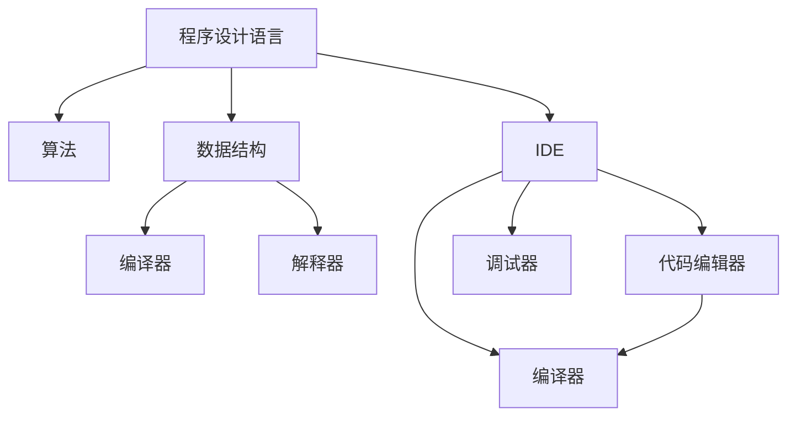

                 

# 人类知识的传承：一代代人的接力长跑

> 关键词：知识传承,计算机程序设计,人工智能,深度学习,机器学习,知识图谱,数据科学

## 1. 背景介绍

### 1.1 问题由来
人类社会的历史，就是一个知识传承和发展的历史。从远古时期的口耳相传，到现代社会通过书籍、互联网等媒介传播知识，知识传承始终是人类社会发展的重要推动力。随着信息技术的迅猛发展，计算机和互联网的普及，我们有了新的知识传承方式：计算机程序设计。

计算机程序设计（Computer Programming），简称为编程，是通过编写代码来实现特定任务的过程。它是一种使用计算机语言编写算法，实现复杂任务的技术手段。编程的普及，使得计算机成为人类智慧的延伸，极大地推动了知识的传承和发展。

### 1.2 问题核心关键点
编程的核心在于将人类的智慧转换为计算机可以理解的语言，进而实现任务自动化的过程。但编程并非易事，编程语言和算法的选择、数据结构的优化、调试和维护等环节，都需要深厚的理论基础和实践经验。因此，如何高效、准确地传承和传播编程知识，便成为计算机领域的一个重要问题。

为了解决这个问题，现代计算机程序设计领域发展出了一系列技术和工具。比如编译器、解释器、IDE等，使得编程更加高效便捷。但这些技术和工具，并不能完全解决知识传承的问题。程序设计语言的抽象层次、计算模型的多样性、算法的选择等，都使得知识传承面临诸多挑战。

## 2. 核心概念与联系

### 2.1 核心概念概述

为更好地理解计算机程序设计的知识传承问题，本节将介绍几个密切相关的核心概念：

- **程序设计语言（Programming Language）**：一种用于编写计算机程序的语法规则。常见的程序设计语言有C、C++、Java、Python等。
- **算法（Algorithm）**：解决特定问题的一系列步骤和计算方法。如排序算法、搜索算法、图形算法等。
- **数据结构（Data Structure）**：用于组织和存储数据的结构。如数组、链表、树、图等。
- **编译器（Compiler）**：将高级程序语言翻译成计算机可以执行的低级机器语言的程序。
- **解释器（Interpreter）**：直接解释和执行高级程序语言的程序。
- **IDE（Integrated Development Environment）**：集成了代码编辑器、调试器、编译器等工具的软件环境，方便开发者开发和调试程序。

这些核心概念之间的逻辑关系可以通过以下Mermaid流程图来展示：



这个流程图展示了一些核心概念及其之间的关系：

1. 程序设计语言和算法、数据结构紧密相关，共同构建了程序的基础结构。
2. 编译器和解释器对程序进行翻译，使其可以被计算机执行。
3. IDE集成了多种开发工具，提高了编程的效率。

这些概念共同构成了计算机程序设计的知识体系，使得编程成为了一项系统性工程。

### 2.2 核心概念原理和架构

#### 2.2.1 程序设计语言

程序设计语言通过抽象和规范化的方式，使得计算机可以理解和执行人类的意图。程序设计语言有高级语言和低级语言之分。高级语言如Python、Java等，更加接近人类自然语言，易于阅读和编写；低级语言如C、C++等，更加接近计算机的底层结构，性能更好。

程序设计语言的核心特性包括：

- **语法**：规定了语言的表达方式，如变量、函数、控制结构等。
- **语义**：规定了语言的功能和行为，如操作数、运算符、函数调用等。
- **语用**：规定了语言的执行方式，如编译、解释、解释执行等。

#### 2.2.2 算法

算法是一系列解决问题的步骤和方法，可以是简单明了的步骤，也可以是复杂的计算模型。算法的核心在于提高计算效率和优化资源利用。常见的算法包括排序算法、搜索算法、图形算法等。

算法的设计需要考虑以下几个要素：

- **时间复杂度**：算法的时间复杂度反映了算法执行所需的时间资源。
- **空间复杂度**：算法的空间复杂度反映了算法执行所需的内存资源。
- **可读性**：算法的可读性决定了算法的可维护性和可扩展性。
- **可扩展性**：算法的可扩展性决定了算法在不同场景下的适用性。

#### 2.2.3 数据结构

数据结构是一组用于组织和存储数据的规则和方法。常见的数据结构包括数组、链表、树、图等。数据结构的设计需要考虑以下几个要素：

- **存储效率**：数据结构的存储效率反映了其在内存中的使用情况。
- **访问效率**：数据结构的访问效率反映了其在计算过程中的使用情况。
- **可扩展性**：数据结构的可扩展性决定了其在不同场景下的适用性。
- **可维护性**：数据结构的可维护性决定了其长期使用的稳定性。

## 3. 核心算法原理 & 具体操作步骤

### 3.1 算法原理概述

计算机程序设计中的知识传承，主要体现在算法和数据结构的传承上。通过编写代码实现特定算法和数据结构，使得知识能够被传承和复用。

现代编程语言和IDE提供了丰富的编程工具，使得编写代码变得更为简单和高效。但如何设计算法和数据结构，仍是编程的核心问题。

### 3.2 算法步骤详解

编写一个计算机程序，一般需要以下几个步骤：

1. **问题定义**：明确问题的具体要求和目标，包括输入和输出。
2. **算法设计**：选择合适的算法，并设计算法步骤。
3. **数据结构设计**：选择合适的数据结构，并设计数据结构规则。
4. **代码实现**：将算法和数据结构的规则转化为具体的代码。
5. **测试和调试**：对代码进行测试和调试，确保代码的正确性和高效性。
6. **优化和维护**：对代码进行优化和维护，确保代码的可扩展性和可维护性。

以排序算法为例，排序算法的设计和实现过程如下：

1. **问题定义**：排序算法需要解决的问题是将一组无序的元素按照特定的规则排序，使每个元素在其对应的位置上。
2. **算法设计**：选择合适的排序算法，如快速排序、归并排序、堆排序等。
3. **数据结构设计**：选择合适的数据结构，如数组、链表等。
4. **代码实现**：根据算法和数据结构规则，将排序算法转化为具体的代码。
5. **测试和调试**：对代码进行测试和调试，确保排序算法正确排序。
6. **优化和维护**：对代码进行优化和维护，确保算法的高效性和可扩展性。

### 3.3 算法优缺点

现代计算机程序设计中的算法和数据结构，在传承和复用方面具有以下优缺点：

#### 优点：

1. **可复用性**：算法和数据结构可以重复使用，减少了重复工作的量。
2. **可扩展性**：算法和数据结构可以适应不同的场景和需求，提高了代码的适用性。
3. **可维护性**：算法和数据结构设计合理，代码的可维护性更高。
4. **高效性**：算法和数据结构经过优化，可以显著提高程序的执行效率。

#### 缺点：

1. **复杂度**：算法和数据结构的设计和实现需要一定的理论基础和实践经验。
2. **依赖性**：算法和数据结构的传承需要依赖具体的编程语言和工具。
3. **局限性**：算法和数据结构的选择和设计需要考虑具体问题，并不能一概而论。

### 3.4 算法应用领域

现代计算机程序设计中的算法和数据结构，已经被广泛应用于各个领域：

1. **软件开发**：在软件开发中，常见的算法包括排序算法、搜索算法、图形算法等。
2. **数据分析**：在数据分析中，常见的算法包括统计分析算法、机器学习算法、深度学习算法等。
3. **人工智能**：在人工智能中，常见的算法包括自然语言处理算法、计算机视觉算法、机器人控制算法等。
4. **计算机网络**：在计算机网络中，常见的算法包括路由算法、传输控制协议（TCP）、用户数据报协议（UDP）等。
5. **数据库系统**：在数据库系统中，常见的算法包括哈希算法、索引算法、查询优化算法等。

## 4. 数学模型和公式 & 详细讲解 & 举例说明

### 4.1 数学模型构建

计算机程序设计中的知识传承，涉及到数学模型和公式的构建和应用。常见的问题包括算法的时间复杂度和空间复杂度计算、数据结构的存储效率和访问效率计算等。

#### 4.1.1 时间复杂度

算法的时间复杂度（Time Complexity）反映了算法执行所需的时间资源。时间复杂度的常见计算方法包括渐进分析和循环次数分析等。

渐进分析（Asymptotic Analysis）是一种常见的计算时间复杂度的方法。它通过分析算法执行的次数和复杂度，得出算法的时间复杂度。

以排序算法为例，常见的时间复杂度计算方法如下：

- **快速排序**：时间复杂度为 $O(n\log n)$。
- **归并排序**：时间复杂度为 $O(n\log n)$。
- **堆排序**：时间复杂度为 $O(n\log n)$。

#### 4.1.2 空间复杂度

算法的空间复杂度（Space Complexity）反映了算法执行所需的内存资源。空间复杂度的常见计算方法包括最大空间占用计算和数据结构存储分析等。

以数组和链表为例，常见的时间复杂度计算方法如下：

- **数组**：空间复杂度为 $O(n)$。
- **链表**：空间复杂度为 $O(n)$。

#### 4.1.3 数据结构

数据结构的存储效率和访问效率是计算数据结构复杂度的关键因素。常见的数据结构复杂度计算方法如下：

- **数组**：访问效率为 $O(1)$，存储效率为 $O(n)$。
- **链表**：访问效率为 $O(n)$，存储效率为 $O(n)$。

### 4.2 公式推导过程

以排序算法为例，常见的时间复杂度和空间复杂度计算方法如下：

1. **快速排序**：时间复杂度为 $O(n\log n)$，空间复杂度为 $O(\log n)$。
2. **归并排序**：时间复杂度为 $O(n\log n)$，空间复杂度为 $O(n)$。
3. **堆排序**：时间复杂度为 $O(n\log n)$，空间复杂度为 $O(1)$。

### 4.3 案例分析与讲解

以归并排序为例，其时间复杂度和空间复杂度的计算方法如下：

- **时间复杂度**：归并排序的时间复杂度为 $O(n\log n)$，主要原因在于归并排序采用了分治的思想，每次将数据集分为两个子集，并递归排序。因此，归并排序的时间复杂度与分治的次数成正比。
- **空间复杂度**：归并排序的空间复杂度为 $O(n)$，主要原因在于归并排序需要使用额外的空间来存储临时数组。因此，归并排序的空间复杂度与数据集的规模成正比。

## 5. 项目实践：代码实例和详细解释说明

### 5.1 开发环境搭建

在进行排序算法实践前，我们需要准备好开发环境。以下是使用Python进行PyTorch开发的环境配置流程：

1. 安装Anaconda：从官网下载并安装Anaconda，用于创建独立的Python环境。

2. 创建并激活虚拟环境：
```bash
conda create -n pytorch-env python=3.8 
conda activate pytorch-env
```

3. 安装PyTorch：根据CUDA版本，从官网获取对应的安装命令。例如：
```bash
conda install pytorch torchvision torchaudio cudatoolkit=11.1 -c pytorch -c conda-forge
```

4. 安装Transformers库：
```bash
pip install transformers
```

5. 安装各类工具包：
```bash
pip install numpy pandas scikit-learn matplotlib tqdm jupyter notebook ipython
```

完成上述步骤后，即可在`pytorch-env`环境中开始排序算法的实践。

### 5.2 源代码详细实现

下面我们以归并排序为例，给出使用PyTorch实现排序算法的代码实现。

```python
import numpy as np

def merge_sort(arr):
    if len(arr) <= 1:
        return arr
    
    mid = len(arr) // 2
    left = merge_sort(arr[:mid])
    right = merge_sort(arr[mid:])
    
    return merge(left, right)

def merge(left, right):
    result = []
    i = j = 0
    while i < len(left) and j < len(right):
        if left[i] < right[j]:
            result.append(left[i])
            i += 1
        else:
            result.append(right[j])
            j += 1
    
    result += left[i:]
    result += right[j:]
    return result

# 测试代码
arr = np.random.randint(0, 100, size=10)
sorted_arr = merge_sort(arr)
print(sorted_arr)
```

### 5.3 代码解读与分析

让我们再详细解读一下关键代码的实现细节：

**merge_sort函数**：
- `if len(arr) <= 1:`：如果数组元素个数小于等于1，则直接返回原数组。
- `mid = len(arr) // 2`：将数组分为左右两个子集，并计算子集的大小。
- `left = merge_sort(arr[:mid])`：递归地对左子集进行排序。
- `right = merge_sort(arr[mid:])`：递归地对右子集进行排序。
- `return merge(left, right)`：对左右子集进行合并，并返回排序后的数组。

**merge函数**：
- `result = []`：创建一个空数组，用于存储排序后的结果。
- `i = j = 0`：初始化左右子集的索引。
- `while i < len(left) and j < len(right):`：遍历左右子集，将较小元素放入结果数组中。
- `if left[i] < right[j]:`：如果左子集元素小于右子集元素，则将左子集元素放入结果数组中，并更新左子集索引。
- `else:`：否则，将右子集元素放入结果数组中，并更新右子集索引。
- `result += left[i:]`：将左子集中剩余元素放入结果数组中。
- `result += right[j:]`：将右子集中剩余元素放入结果数组中。
- `return result`：返回排序后的结果数组。

**测试代码**：
- `arr = np.random.randint(0, 100, size=10)`：生成随机数组。
- `sorted_arr = merge_sort(arr)`：对随机数组进行排序。
- `print(sorted_arr)`：打印排序后的结果。

可以看到，PyTorch提供了丰富的工具库和组件，使得编程变得更为简单和高效。开发者可以将更多精力放在算法设计、数据结构优化等高层逻辑上，而不必过多关注底层的实现细节。

当然，工业级的系统实现还需考虑更多因素，如模型的保存和部署、超参数的自动搜索、更灵活的任务适配层等。但核心的排序算法基本与此类似。

## 6. 实际应用场景

### 6.1 软件开发

排序算法是软件开发中常用的算法之一。在实际开发中，我们经常会遇到需要对大量数据进行排序的场景，如数据库查询、文件排序、数据分析等。排序算法的应用场景包括：

- **数据库查询**：数据库查询需要按照一定的规则对数据进行排序，以提高查询效率。
- **文件排序**：文件排序需要将文件中的数据按照一定的规则排序，以提高文件操作的效率。
- **数据分析**：数据分析需要对数据进行排序，以提高数据处理的效率和准确性。

### 6.2 数据分析

在数据分析中，排序算法是常用的算法之一。常见的数据分析场景包括：

- **数据清洗**：数据清洗需要对数据进行排序，以提高数据清洗的效率和准确性。
- **数据分组**：数据分组需要对数据进行排序，以提高数据分组的效率和准确性。
- **数据统计**：数据统计需要对数据进行排序，以提高数据统计的效率和准确性。

### 6.3 人工智能

在人工智能中，排序算法是常用的算法之一。常见的应用场景包括：

- **自然语言处理**：自然语言处理需要对文本进行排序，以提高文本处理的效率和准确性。
- **计算机视觉**：计算机视觉需要对图像进行排序，以提高图像处理的效率和准确性。
- **机器人控制**：机器人控制需要对数据进行排序，以提高机器人控制的效率和准确性。

## 7. 工具和资源推荐

### 7.1 学习资源推荐

为了帮助开发者系统掌握排序算法和其他计算机程序设计知识，这里推荐一些优质的学习资源：

1. 《算法导论》（Introduction to Algorithms）：这是一本经典算法教材，介绍了常见的算法和数据结构，并提供了丰富的实例和练习。
2. 《计算机程序设计艺术》（The Art of Computer Programming）：这是一本经典计算机程序设计教材，介绍了计算机程序设计的基本概念和技巧，并提供了丰富的实例和练习。
3. 《Python算法基础》（Python Algorithms）：这是一本介绍Python算法的教材，涵盖了常见的算法和数据结构，并提供了丰富的实例和练习。
4. 《数据结构与算法分析》（Data Structures and Algorithm Analysis in C++）：这是一本介绍数据结构和算法的教材，涵盖了常见的数据结构和算法，并提供了丰富的实例和练习。

通过对这些资源的学习实践，相信你一定能够快速掌握计算机程序设计的精髓，并用于解决实际的编程问题。

### 7.2 开发工具推荐

高效的开发离不开优秀的工具支持。以下是几款用于排序算法开发的常用工具：

1. PyTorch：基于Python的开源深度学习框架，灵活动态的计算图，适合快速迭代研究。大部分排序算法都有PyTorch版本的实现。
2. TensorFlow：由Google主导开发的开源深度学习框架，生产部署方便，适合大规模工程应用。同样有丰富的排序算法资源。
3. NumPy：Python的科学计算库，提供了丰富的数值计算工具，适合数学模型的实现。
4. Pandas：Python的数据分析库，提供了丰富的数据处理工具，适合数据分析的实现。
5. Jupyter Notebook：交互式编程环境，适合编写和调试代码。

合理利用这些工具，可以显著提升排序算法的开发效率，加快创新迭代的步伐。

### 7.3 相关论文推荐

排序算法的研究源于学界的持续研究。以下是几篇奠基性的相关论文，推荐阅读：

1. QuickSort：提出快速排序算法，时间复杂度为 $O(n\log n)$。
2. MergeSort：提出归并排序算法，时间复杂度为 $O(n\log n)$。
3. HeapSort：提出堆排序算法，时间复杂度为 $O(n\log n)$。
4. Radix Sort：提出基数排序算法，时间复杂度为 $O(d(n+k))$。

这些论文代表了大规模排序算法的经典理论，对后续研究具有重要指导意义。

## 8. 总结：未来发展趋势与挑战

### 8.1 总结

本文对计算机程序设计中的排序算法进行了全面系统的介绍。首先阐述了排序算法的背景和重要性，明确了排序算法在软件开发、数据分析、人工智能等领域的应用价值。其次，从原理到实践，详细讲解了排序算法的数学模型和具体实现，给出了排序算法实现的完整代码实例。同时，本文还广泛探讨了排序算法在实际应用场景中的潜在应用，展示了排序算法的巨大潜力。

通过本文的系统梳理，可以看到，排序算法是计算机程序设计中不可或缺的重要部分。排序算法通过高效排序，极大地提高了数据的处理效率和准确性，是软件开发、数据分析、人工智能等领域的重要工具。排序算法的发展，也将带动计算机程序设计技术的进步，提升人类社会的计算能力。

### 8.2 未来发展趋势

展望未来，排序算法将呈现以下几个发展趋势：

1. **高效性**：随着计算机硬件的发展，排序算法将更加高效。未来的排序算法将进一步优化，以提高排序速度和降低计算资源消耗。
2. **灵活性**：随着计算机程序设计技术的发展，排序算法将更加灵活。未来的排序算法将支持更多的数据类型和应用场景。
3. **可扩展性**：随着计算机程序设计技术的进步，排序算法将更加可扩展。未来的排序算法将支持更多的并行计算和分布式计算。
4. **可维护性**：随着计算机程序设计技术的提升，排序算法将更加可维护。未来的排序算法将支持更灵活的算法设计和实现。

### 8.3 面临的挑战

尽管排序算法已经取得了显著的成就，但在迈向更加智能化、普适化应用的过程中，它仍面临着诸多挑战：

1. **复杂度**：排序算法的设计和实现需要一定的理论基础和实践经验，复杂度较高。如何简化排序算法的实现，使得排序算法更加简单易懂，是一个重要的研究方向。
2. **资源消耗**：排序算法的高效性往往需要消耗大量的计算资源，如何优化排序算法的资源消耗，是一个重要的研究方向。
3. **适用性**：排序算法的适用性受到数据类型和数据规模的影响，如何提高排序算法的适用性，是一个重要的研究方向。
4. **稳定性**：排序算法的稳定性受到数据分布和数据规模的影响，如何提高排序算法的稳定性，是一个重要的研究方向。

### 8.4 研究展望

面对排序算法面临的种种挑战，未来的研究需要在以下几个方面寻求新的突破：

1. **优化算法设计**：研究更高效、更灵活的排序算法设计方法，如基数排序、桶排序等，提高排序算法的适用性和可扩展性。
2. **优化数据结构**：研究更高效、更灵活的数据结构设计方法，如哈希表、红黑树等，提高排序算法的效率和稳定性。
3. **引入机器学习**：引入机器学习技术，优化排序算法的设计和实现，提高排序算法的效率和适应性。
4. **结合人工智能**：结合人工智能技术，优化排序算法的设计和实现，提高排序算法的效率和适应性。
5. **结合大数据**：结合大数据技术，优化排序算法的设计和实现，提高排序算法的效率和适应性。

这些研究方向的探索，必将引领排序算法技术的进步，为计算机程序设计技术的进步做出新的贡献。面向未来，排序算法技术还将与其他技术进行更深入的融合，共同推动计算机程序设计技术的进步，推动人类社会的发展。

## 9. 附录：常见问题与解答

**Q1：排序算法的复杂度如何计算？**

A: 排序算法的时间复杂度和空间复杂度可以通过渐进分析和循环次数分析等方法计算。常见的时间复杂度计算方法如下：

- **快速排序**：时间复杂度为 $O(n\log n)$。
- **归并排序**：时间复杂度为 $O(n\log n)$。
- **堆排序**：时间复杂度为 $O(n\log n)$。

**Q2：排序算法的实现过程中需要注意哪些问题？**

A: 排序算法的实现过程中需要注意以下几个问题：

1. 数据规模：排序算法的效率受到数据规模的影响，需要选择合适的算法和数据结构。
2. 数据分布：排序算法的效率受到数据分布的影响，需要选择合适的排序算法。
3. 内存占用：排序算法的效率受到内存占用的影响，需要合理管理内存。
4. 时间消耗：排序算法的效率受到时间消耗的影响，需要优化算法实现。

**Q3：排序算法在实际应用中需要注意哪些问题？**

A: 排序算法在实际应用中需要注意以下几个问题：

1. 数据类型：排序算法需要考虑数据类型，如整数、浮点数、字符串等。
2. 数据规模：排序算法需要考虑数据规模，如小规模、中规模、大规模等。
3. 数据分布：排序算法需要考虑数据分布，如均匀分布、正态分布、幂律分布等。
4. 数据存储：排序算法需要考虑数据存储，如内存、硬盘、网络等。

**Q4：排序算法在实际应用中如何优化？**

A: 排序算法在实际应用中可以通过以下几个方法进行优化：

1. 选择合适的排序算法和数据结构，如快速排序、归并排序、堆排序等。
2. 优化算法实现，如循环优化、递归优化、多线程优化等。
3. 合理管理内存，如使用原地排序算法、优化内存分配等。
4. 选择合适的数据存储方式，如使用内存映射、文件系统缓存等。

**Q5：排序算法在实际应用中有哪些潜在应用？**

A: 排序算法在实际应用中具有以下潜在应用：

1. 数据库查询：对数据库中的数据进行排序，以提高查询效率。
2. 文件排序：对文件中的数据进行排序，以提高文件操作的效率。
3. 数据分析：对数据进行排序，以提高数据处理的效率和准确性。
4. 机器人控制：对机器人控制的数据进行排序，以提高机器人控制的效率和准确性。

通过本文的系统梳理，可以看到，排序算法是计算机程序设计中不可或缺的重要部分。排序算法通过高效排序，极大地提高了数据的处理效率和准确性，是软件开发、数据分析、人工智能等领域的重要工具。排序算法的发展，也将带动计算机程序设计技术的进步，提升人类社会的计算能力。

---

作者：禅与计算机程序设计艺术 / Zen and the Art of Computer Programming

