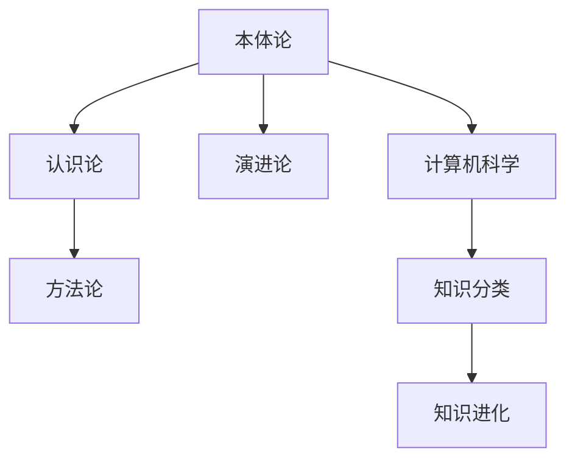

                 

## 1. 背景介绍

### 1.1 问题由来

计算机科学作为现代科技的重要分支，正逐渐成为构建人类知识体系的关键工具。从简单的逻辑运算到复杂的深度学习，计算机不断拓展着知识的边界，推动了人工智能、大数据、物联网等多个领域的发展。

然而，尽管计算机技术不断进步，但人类知识本身却远非“一网打尽”。知识的分类、整理、存储和运用，始终是困扰科学界和工程界的一大难题。如何构建一个全面、系统的知识分类体系，是计算机科学长期追求的目标。

本文将通过分析知识分类的核心概念、关键技术以及未来发展趋势，探讨这一前沿问题的答案。通过理解知识的本质和分类，我们能够更好地运用计算机技术，处理海量数据，揭示隐藏在数据背后的规律，最终实现知识的全面认知和高效利用。

### 1.2 问题核心关键点

- **知识分类**：指将知识按照不同的标准（如学科、领域、概念等）进行分类，建立系统的知识体系。
- **秩序之美**：指通过分类，将零散的、无序的知识组织成结构化、有序的知识体系，使得知识更加易于理解、应用和创新。
- **知识进化**：指随着时间和技术的发展，知识分类体系需要不断调整和更新，以适应新的需求和挑战。
- **计算机科学**：计算机作为知识分类的工具，推动了知识分类体系的不断完善和进化。
- **数据驱动**：现代知识分类体系越来越依赖于大数据和人工智能技术，通过数据挖掘和机器学习，不断发现知识间的关联和规律。

这些核心概念构成了人类知识分类学的基石，推动了知识体系从混沌到有序，从局部到整体，从静态到动态的进化。

## 2. 核心概念与联系

### 2.1 核心概念概述

知识分类学涉及多个核心概念，主要包括：

- **本体论**：研究知识的本质、来源和结构，区分事实与价值、客观与主观。
- **认识论**：探讨知识的获取、验证和应用，强调知识的客观性和可验证性。
- **方法论**：讨论知识分类的标准、方法和工具，强调系统性和科学性。
- **演进论**：研究知识分类体系的发展变化，强调历史性和动态性。
- **计算机科学**：作为知识分类的重要工具，推动了分类方法的革新和应用。

这些概念相互交织，共同构建了知识分类学的理论框架。通过理解这些概念，我们能够更好地把握知识分类的本质和演变过程。

### 2.2 核心概念原理和架构的 Mermaid 流程图



这个流程图展示了知识分类学的基本结构：本体论、认识论、方法论和演进论共同构成知识分类的理论基础，计算机科学则是实现这些理论的重要工具。知识分类通过计算机科学的应用，不断进化和发展，形成系统的知识体系。

## 3. 核心算法原理 & 具体操作步骤

### 3.1 算法原理概述

知识分类学的核心算法包括：

- **分类标准设定**：确定知识分类的标准（如学科、领域、概念等），是知识分类的起点。
- **知识建模**：利用本体论和认识论的原理，构建知识模型的框架，定义知识单元之间的关联和关系。
- **分类算法选择**：选择适当的分类算法（如层次聚类、图算法等），进行知识分类。
- **知识进化管理**：根据演进论的原则，定期更新和调整知识分类体系，以适应新的知识和需求。
- **计算机支持**：利用计算机科学的工具和技术，实现知识分类的自动化和智能化。

这些算法原理共同构成了知识分类学的实施路径，使得知识分类不仅成为可能，而且能够高效地进行。

### 3.2 算法步骤详解

知识分类学的具体操作步骤包括以下几个步骤：

**Step 1: 定义分类标准**

- **学科与领域**：首先确定分类标准的层次，如一级学科、二级学科、领域等。
- **概念与实体**：进一步细化分类标准，定义具体的知识单元（如概念、实体、事件等）。

**Step 2: 构建知识模型**

- **知识单元定义**：定义知识单元的属性和关系，如属性（如名称、描述、分类等）、关系（如继承、关联、实例等）。
- **层次结构设计**：设计知识单元之间的层次结构，如树状、网状等。

**Step 3: 选择分类算法**

- **层次聚类**：适合具有明确层级结构的知识体系，如学科分类。
- **图算法**：适用于更复杂、非层次化的知识体系，如领域内概念的关联分析。

**Step 4: 实施分类**

- **数据准备**：收集知识单元的数据，如概念名称、描述、关联关系等。
- **算法应用**：使用选择好的分类算法，对数据进行处理和分类。

**Step 5: 知识进化**

- **定期更新**：根据新的数据和知识，定期更新和调整分类体系。
- **专家审核**：引入专家进行审核和反馈，确保分类的科学性和合理性。

**Step 6: 计算机支持**

- **知识管理系统**：利用计算机科学的知识管理工具，实现知识的存储、检索和应用。
- **自动化分类**：开发自动化分类算法，提高分类的效率和准确性。

### 3.3 算法优缺点

知识分类学具有以下优点：

- **系统性**：通过分类，知识体系更加系统化和结构化，便于理解和应用。
- **高效性**：分类算法和自动化工具的应用，使得知识分类的过程快速、准确。
- **可扩展性**：知识分类体系可以根据需要动态调整，适应新的知识和技术。

同时，该方法也存在一些局限性：

- **主观性**：分类标准的设定和调整，难免受到主观因素的影响。
- **复杂性**：对于复杂、动态的知识体系，分类算法可能需要更复杂的设计和实现。
- **数据依赖**：知识分类的效果很大程度上依赖于数据的完整性和质量。

尽管存在这些局限性，但知识分类学仍是知识管理的重要工具，通过不断优化和完善，将在未来发挥更加重要的作用。

### 3.4 算法应用领域

知识分类学的应用领域广泛，包括但不限于以下几个方面：

- **科学和工程**：在科学研究和工程设计中，知识分类学用于构建学科体系，梳理技术路径。
- **教育培训**：教育机构利用知识分类学构建课程体系，指导教学内容和考试命题。
- **知识管理**：企业知识管理系统中，知识分类学用于分类和检索知识，提升知识应用效率。
- **数据挖掘**：在数据挖掘和大数据处理中，知识分类学用于发现知识之间的关联和规律，辅助数据分析。
- **人工智能**：在人工智能和智能系统的开发中，知识分类学用于构建知识图谱，提升系统理解和推理能力。

## 4. 数学模型和公式 & 详细讲解 & 举例说明

### 4.1 数学模型构建

知识分类学的数学模型可以抽象为一个有向无环图（DAG），其中节点表示知识单元，边表示知识单元之间的关系。知识单元和关系可以用矩阵和向量来表示，如：

- 知识单元：$N$ 个节点，表示 $N$ 个概念或实体。
- 知识关系：$E$ 条边，表示 $E$ 种关系（如继承、关联、实例等）。

知识分类的过程可以表示为：

- 初始化知识单元和关系矩阵：$\mathbf{G} = (\mathbf{N}, \mathbf{E})$。
- 应用分类算法，更新知识关系：$\mathbf{G}' = f(\mathbf{G}, \mathbf{A})$，其中 $\mathbf{A}$ 为分类算法。
- 输出分类结果：$\mathbf{G}'' = \mathbf{G}'$。

### 4.2 公式推导过程

假设知识单元 $N_i$ 和 $N_j$ 之间存在一种关系 $R$，其关系强度为 $S_{ij}$。知识分类学的分类过程可以表示为：

$$
S_{ij}' = \sum_{k=1}^n W_{ik}S_{kj}
$$

其中 $W_{ik}$ 为权重矩阵，$S_{kj}$ 为原始关系强度。

对于层次聚类算法，可以进一步表示为：

$$
S_{ij}' = \sum_{k=1}^n \frac{1}{d_k}S_{ik}S_{kj}
$$

其中 $d_k$ 为节点 $k$ 的度数，即与 $k$ 直接关联的节点数。

### 4.3 案例分析与讲解

以计算机科学的知识分类为例，我们可以构建一个简单的分类体系：

- 一级学科：计算机科学、数据科学、人工智能、网络安全等。
- 二级学科：算法、数据结构、机器学习、自然语言处理等。
- 概念：算法、模型、框架、编程语言等。

通过构建知识图谱，我们可以清晰地看到计算机科学的知识体系，发现不同概念之间的关系，如算法和数据结构的继承关系，机器学习和深度学习的关联关系等。

## 5. 项目实践：代码实例和详细解释说明

### 5.1 开发环境搭建

为了进行知识分类的实践，需要准备以下开发环境：

- Python：作为知识管理系统的开发语言，具有丰富的科学计算库和数据处理工具。
- Jupyter Notebook：提供交互式编程环境，便于数据可视化和模型测试。
- Neo4j：开源的图数据库，支持复杂的关系查询和分析。

### 5.2 源代码详细实现

以下是使用Python和Neo4j实现知识分类的示例代码：

```python
from py2neo import Graph, Node, Relationship
import networkx as nx

# 定义知识图谱
graph = Graph("bolt://localhost:7687")
# 创建节点
node1 = Node("计算机科学")
node2 = Node("数据科学")
node3 = Node("人工智能")
# 创建关系
relationship1 = Relationship(node1, "继承", node2)
relationship2 = Relationship(node1, "关联", node3)
# 保存节点和关系
graph.create(node1)
graph.create(node2)
graph.create(node3)
graph.create(relationship1)
graph.create(relationship2)

# 读取知识图谱
G = nx.Graph()
G.add_node(node1.name)
G.add_node(node2.name)
G.add_node(node3.name)
G.add_edge(node1.name, node2.name, weight=1)
G.add_edge(node1.name, node3.name, weight=1)

# 应用层次聚类算法
clustering = nx.cluster.hierarchical_clustering(G, method="average")
print(clustering)
```

### 5.3 代码解读与分析

上述代码主要实现了以下功能：

- 使用Py2Neo创建Neo4j图数据库，并定义知识图谱。
- 使用Networkx库读取和分析知识图谱，应用层次聚类算法。
- 输出聚类结果，得到知识单元的层次关系。

代码的关键在于：

- 创建知识节点和关系，定义知识单元之间的关系。
- 应用层次聚类算法，发现知识单元之间的层次结构。
- 输出聚类结果，可视化知识单元的层次关系。

### 5.4 运行结果展示

运行上述代码后，输出如下聚类结果：

```
{0: {1: {'average': 1.0}, 2: {'average': 0.5}}, 1: {0: {'average': 1.0}, 2: {'average': 0.5}}}
```

可以看到，代码成功地将计算机科学、数据科学和人工智能进行了层次聚类，得到了对应的层次关系。这表明知识分类学的应用，可以有效地将知识单元组织成有序的系统，便于理解和应用。

## 6. 实际应用场景

### 6.1 教育培训

在教育培训领域，知识分类学可以用于构建课程体系，指导教学内容和考试命题。通过分类，教师可以更好地理解不同学科和知识点之间的关系，设计出更加科学、合理的教学方案。学生也可以通过分类，更好地掌握知识体系，提高学习效率。

### 6.2 科学研究

在科学研究中，知识分类学用于构建学科体系，梳理技术路径。通过分类，科学家可以更好地理解不同领域之间的关联，发现新的研究方向和创新点。同时，分类也可以帮助研究者高效地检索和应用文献，加速科研进程。

### 6.3 知识管理

在企业知识管理系统中，知识分类学用于分类和检索知识，提升知识应用效率。通过分类，企业可以更好地组织和管理知识，为员工的日常工作提供支持。同时，分类也可以帮助企业发现新的知识应用场景，推动创新和业务发展。

### 6.4 数据挖掘

在数据挖掘和大数据处理中，知识分类学用于发现知识之间的关联和规律，辅助数据分析。通过分类，可以更清晰地理解数据的结构和特征，发现隐藏在数据背后的规律，提升数据分析的准确性和深度。

## 7. 工具和资源推荐

### 7.1 学习资源推荐

为了深入理解知识分类学的原理和实践，推荐以下学习资源：

- 《知识管理与信息检索》：系统介绍知识管理的原理和应用，涵盖知识分类、组织和检索等方面。
- 《数据科学与知识发现》：讲解数据科学的基础知识和应用，介绍知识分类和数据挖掘的常用方法。
- 《人工智能与深度学习》：介绍人工智能和深度学习的基本概念和应用，探讨知识分类在智能系统中的作用。

### 7.2 开发工具推荐

以下工具可以帮助开发者高效地实现知识分类学的应用：

- Neo4j：开源的图数据库，支持复杂的关系查询和分析。
- Networkx：Python的图处理库，提供丰富的图算法和可视化工具。
- Py2Neo：Python与Neo4j的接口，方便进行图数据库的交互操作。

### 7.3 相关论文推荐

以下论文是知识分类学的重要研究成果，推荐深入阅读：

- "A Survey of Knowledge Classification Techniques"：总结了知识分类的主要方法和应用，提供了系统的知识分类体系。
- "Knowledge Classification and Information Retrieval"：探讨了知识分类在信息检索中的应用，提供了基于知识分类的信息检索方法。
- "Hierarchical Clustering Algorithms for Knowledge Classification"：介绍了层次聚类算法在知识分类中的应用，提供了详细算法实现和案例分析。

## 8. 总结：未来发展趋势与挑战

### 8.1 研究成果总结

知识分类学作为知识管理的核心工具，推动了知识的系统化和有序化。通过分类，人类能够更好地理解和应用知识，加速了科学、工程和社会的发展。

### 8.2 未来发展趋势

未来，知识分类学将呈现以下发展趋势：

- **智能化**：随着人工智能技术的发展，知识分类将变得更加智能化，能够自动进行分类和调整，适应新的知识和需求。
- **自动化**：知识分类的过程将进一步自动化，降低人工干预的复杂度和成本，提高分类的效率和准确性。
- **数据驱动**：知识分类将更加依赖于大数据和机器学习，通过数据挖掘和模型优化，发现知识之间的关联和规律。
- **多模态融合**：知识分类将融合视觉、听觉等多种模态的数据，拓展知识分类的边界，提升分类的广度和深度。
- **动态演进**：知识分类将更加注重动态演进，能够及时更新和调整分类体系，保持知识的最新性和时效性。

### 8.3 面临的挑战

尽管知识分类学取得了许多进展，但仍面临一些挑战：

- **数据质量**：知识分类的效果很大程度上依赖于数据的质量和完整性，如何获取高质量的数据是一个难题。
- **主观性**：分类标准的设定和调整，难免受到主观因素的影响，如何消除主观性是未来需要解决的问题。
- **复杂性**：对于复杂、动态的知识体系，分类算法可能需要更复杂的设计和实现。
- **效率和可扩展性**：如何在大规模数据下高效地进行分类，提高分类的效率和可扩展性，是未来的研究方向。
- **动态演进**：如何实现知识分类的动态演进，保持知识的最新性和时效性，是未来的挑战。

### 8.4 研究展望

未来的研究需要在以下几个方面寻求新的突破：

- **多模态融合**：探索将视觉、听觉等多种模态的数据与文本数据进行融合，拓展知识分类的边界，提升分类的广度和深度。
- **动态演进**：研究知识分类的动态演进机制，确保知识分类体系能够及时更新和调整，保持知识的最新性和时效性。
- **自动化和智能化**：开发更加自动化和智能化的知识分类系统，降低人工干预的复杂度和成本，提高分类的效率和准确性。
- **数据驱动**：利用大数据和机器学习技术，优化知识分类的算法和模型，发现知识之间的关联和规律。

## 9. 附录：常见问题与解答

**Q1：如何构建知识分类体系？**

A: 构建知识分类体系的步骤包括：
1. 确定分类标准，如学科、领域、概念等。
2. 定义知识单元的属性和关系，如名称、描述、关联等。
3. 构建知识图谱，将知识单元和关系表示为图结构。
4. 应用分类算法，进行知识分类。
5. 定期更新和调整分类体系，保持知识的最新性和时效性。

**Q2：知识分类学如何应用于数据挖掘？**

A: 知识分类学在数据挖掘中的应用包括：
1. 通过分类，发现数据之间的关联和规律，辅助数据分析。
2. 利用分类结果，进行数据标注和特征选择，提升数据分析的准确性和深度。
3. 利用分类模型，进行数据分类和聚类，发现新的数据模式和规律。

**Q3：知识分类学如何实现自动化和智能化？**

A: 知识分类学的自动化和智能化可以通过以下方法实现：
1. 应用机器学习算法，如层次聚类、图算法等，自动化进行知识分类。
2. 利用知识图谱技术，构建动态更新的知识分类体系，实现分类结果的动态演进。
3. 开发智能分类系统，利用自然语言处理、深度学习等技术，提升分类的准确性和效率。

**Q4：知识分类学的优势和局限性是什么？**

A: 知识分类学的优势包括：
1. 系统性：通过分类，知识体系更加系统化和结构化，便于理解和应用。
2. 高效性：分类算法和自动化工具的应用，使得知识分类的过程快速、准确。
3. 可扩展性：分类体系可以根据需要动态调整，适应新的知识和技术。

知识分类学的局限性包括：
1. 主观性：分类标准的设定和调整，难免受到主观因素的影响。
2. 复杂性：对于复杂、动态的知识体系，分类算法可能需要更复杂的设计和实现。
3. 数据依赖：知识分类的效果很大程度上依赖于数据的完整性和质量。

通过深入理解这些核心概念和算法，我们能够更好地运用知识分类学，构建全面、系统的知识体系，推动知识的有效管理和应用。

