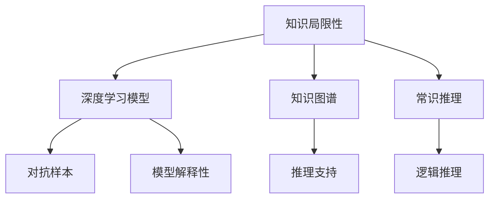

                 

# 人类知识的局限性：承认与探索未知领域

## 1. 背景介绍

人类知识的局限性一直是哲学、科学、艺术等多个领域探讨的核心议题。随着人工智能(AI)和深度学习技术的飞速发展，我们对于知识局限性的认识和处理方式也正经历着一场深刻的变革。

### 1.1 问题由来

人类的知识来源于经验与观察，但受限于个体和时代条件，不可能穷尽宇宙万物之奥秘。在这一背景之下，人工智能成为了探索未知、弥补知识缺陷的重要工具。深度学习技术，特别是基于神经网络的模型，通过大数据的训练，能够从海量数据中发现隐含的模式，甚至在某些领域超越人类专家的表现。

然而，尽管深度学习模型在许多任务上已经取得了显著的成果，它们的表现仍然受到数据质量和模型设计等多方面的限制。例如，模型在解释性、泛化能力、对抗样本鲁棒性等方面尚待进一步提升。此外，对于AI模型的决策过程，我们仍然缺乏足够的理解和解释。

面对这些问题，如何更好地利用AI技术，推动知识的进步和应用，成为了当前科技发展的一个关键点。本文将从核心概念入手，深入探讨AI在探索未知领域中的作用和局限性。

### 1.2 问题核心关键点

本文聚焦于以下几个核心关键点：

1. **知识局限性**：人类知识具有固有的局限性，AI如何帮助克服这些局限。
2. **深度学习模型**：基于神经网络的模型在探索未知领域中的作用和局限。
3. **知识图谱与常识推理**：如何将知识图谱和常识推理应用于AI系统中。
4. **对抗样本与鲁棒性**：如何增强模型对抗样本的鲁棒性。
5. **模型解释性与透明度**：如何提升模型的解释性和透明度，增进理解。

这些关键点共同构成了对人类知识局限性认识和探索未知领域的全面探讨。

## 2. 核心概念与联系

### 2.1 核心概念概述

为更好地理解AI在探索未知领域中的作用和局限，本节将介绍几个关键概念：

- **知识局限性**：指人类知识在时间和空间上的有限性，无法涵盖所有领域的广度和深度。
- **深度学习模型**：基于神经网络的模型，能够从数据中学习特征，用于分类、回归、生成等任务。
- **知识图谱**：一种表示实体间关系的结构化知识库，用于提供背景信息和推理支持。
- **常识推理**：基于经验和逻辑推理的过程，用于处理非结构化知识。
- **对抗样本**：通过微小扰动构造的输入数据，能够误导模型的行为。
- **模型解释性**：指模型的决策过程是否可解释，是否易于理解。

这些核心概念之间的关系可以通过以下Mermaid流程图来展示：



这个流程图展示了知识局限性、深度学习模型、知识图谱、常识推理、对抗样本和模型解释性之间的逻辑关系：

1. 知识局限性是AI探索未知领域的主要动力。
2. 深度学习模型是AI探索未知领域的主要工具。
3. 知识图谱为深度学习模型提供推理支持。
4. 常识推理处理非结构化知识，与深度学习模型协同工作。
5. 对抗样本挑战模型的鲁棒性，需要提升模型的鲁棒性。
6. 模型解释性增强对模型决策的理解，是可信AI的重要指标。

这些概念共同构成了AI探索未知领域的框架，使得AI技术能够更好地辅助人类探索和理解未知领域。

## 3. 核心算法原理 & 具体操作步骤
### 3.1 算法原理概述

AI在探索未知领域中的核心算法原理主要包括深度学习模型的训练、知识图谱的构建和推理、常识推理的实现以及对抗样本的检测与防御。

深度学习模型通过大量数据训练，提取特征，用于分类、回归、生成等任务。知识图谱通过关系图结构，表示实体之间的链接，提供背景信息和推理支持。常识推理基于经验，通过逻辑推理处理非结构化知识。对抗样本检测与防御则通过各种技术手段，确保模型在面对扰动输入时的鲁棒性。

### 3.2 算法步骤详解

以下将详细介绍深度学习模型在探索未知领域中的应用步骤：

**Step 1: 数据准备**
- 收集标注数据，确保数据的多样性和代表性。
- 处理和清洗数据，去除噪声和不相关数据。

**Step 2: 模型选择与设计**
- 选择合适的深度学习模型结构，如卷积神经网络(CNN)、循环神经网络(RNN)、变换器(Transformer)等。
- 设计模型的架构和参数，根据任务需求设定输入输出维度。

**Step 3: 模型训练**
- 将数据划分为训练集、验证集和测试集，设定合适的训练参数。
- 使用优化算法(如随机梯度下降)训练模型，不断调整模型参数以优化损失函数。
- 在验证集上评估模型性能，避免过拟合。

**Step 4: 知识图谱构建与推理**
- 构建知识图谱，表示实体之间的关系。
- 利用图神经网络(GNN)等技术，在知识图谱上进行推理，提取关系特征。

**Step 5: 常识推理实现**
- 使用符号逻辑推理器，处理非结构化知识，进行逻辑推理。
- 将推理结果与深度学习模型输出的结果进行融合，形成综合决策。

**Step 6: 对抗样本检测与防御**
- 收集和生成对抗样本，检测模型的鲁棒性。
- 应用对抗训练、噪声注入等技术，提高模型的鲁棒性。

### 3.3 算法优缺点

深度学习模型在探索未知领域中具有以下优点：
1. 能够处理大规模数据，从中提取复杂特征。
2. 能够学习到非线性关系，用于分类、回归、生成等任务。
3. 可以应用于各种任务，从图像识别到自然语言处理。

同时，深度学习模型也存在一定的局限性：
1. 数据依赖性强，需要大量标注数据进行训练。
2. 模型复杂，难以理解和解释。
3. 容易过拟合，需要复杂的正则化技术。
4. 对抗样本敏感，需要对抗样本检测与防御。

尽管存在这些局限性，深度学习模型在许多领域已经取得了显著的进展，成为了探索未知领域的重要工具。

### 3.4 算法应用领域

深度学习模型在探索未知领域中的应用非常广泛，涵盖以下几个主要领域：

- **自然语言处理(NLP)**：用于文本分类、情感分析、机器翻译等任务。
- **计算机视觉(CV)**：用于图像识别、物体检测、场景理解等任务。
- **语音识别与生成**：用于语音识别、语音合成等任务。
- **推荐系统**：用于个性化推荐、广告定向等任务。
- **医疗健康**：用于疾病诊断、基因组分析等任务。
- **智能制造**：用于预测性维护、质量控制等任务。
- **金融风控**：用于信用评估、欺诈检测等任务。

除了上述这些经典领域外，深度学习模型还在更多新兴领域中得到了应用，如自动驾驶、智能家居、智慧城市等，为多个行业带来了深刻的变革。

## 4. 数学模型和公式 & 详细讲解
### 4.1 数学模型构建

以自然语言处理(NLP)任务为例，深度学习模型的数学模型可以表示为：

$$
M(x; \theta) = W_{out} \cdot \sigma(W_{emb} \cdot x + b_{emb} + \sum_{i=1}^{n} A_{i} \cdot h_{i-1} + b_i)
$$

其中 $M$ 表示模型，$x$ 表示输入，$\theta$ 表示模型参数，$W_{out}$ 表示输出层权重矩阵，$W_{emb}$ 表示嵌入层权重矩阵，$b_{emb}$ 表示嵌入层偏置向量，$A_{i}$ 表示循环神经网络的递归权重矩阵，$h_{i-1}$ 表示前一时刻的隐藏状态，$b_i$ 表示隐藏层偏置向量，$\sigma$ 表示激活函数(如ReLU)。

### 4.2 公式推导过程

以简单的单层前馈神经网络为例，其训练过程可以通过梯度下降算法推导如下：

设损失函数为 $L(\theta)$，表示模型预测与真实标签的误差。损失函数对参数 $\theta$ 的梯度为：

$$
\nabla_{\theta} L = \frac{\partial L(\theta)}{\partial \theta}
$$

使用梯度下降算法更新参数：

$$
\theta \leftarrow \theta - \eta \nabla_{\theta} L
$$

其中 $\eta$ 表示学习率。

在实际应用中，我们通常使用反向传播算法计算梯度，并使用优化算法(如随机梯度下降)更新模型参数，以最小化损失函数。

### 4.3 案例分析与讲解

以机器翻译任务为例，深度学习模型可以将源语言和目标语言之间的映射关系通过学习得到。训练过程可以通过以下步骤实现：

1. 收集并处理源语言和目标语言的平行语料库。
2. 设计基于神经网络的翻译模型，如序列到序列(Seq2Seq)模型。
3. 使用反向传播算法计算梯度，并使用随机梯度下降更新模型参数。
4. 在验证集上评估模型性能，避免过拟合。
5. 使用训练好的模型进行翻译，生成目标语言文本。

## 5. 项目实践：代码实例和详细解释说明
### 5.1 开发环境搭建

在进行项目实践前，我们需要准备好开发环境。以下是使用Python进行TensorFlow开发的环境配置流程：

1. 安装Anaconda：从官网下载并安装Anaconda，用于创建独立的Python环境。

2. 创建并激活虚拟环境：
```bash
conda create -n tf-env python=3.8 
conda activate tf-env
```

3. 安装TensorFlow：根据CUDA版本，从官网获取对应的安装命令。例如：
```bash
pip install tensorflow
```

4. 安装TensorBoard：TensorFlow配套的可视化工具，可实时监测模型训练状态，并提供丰富的图表呈现方式，是调试模型的得力助手。

5. 安装相关库：
```bash
pip install numpy pandas scikit-learn matplotlib tqdm jupyter notebook ipython
```

完成上述步骤后，即可在`tf-env`环境中开始项目实践。

### 5.2 源代码详细实现

我们以文本分类任务为例，给出使用TensorFlow对深度学习模型进行训练的Python代码实现。

首先，定义模型：

```python
import tensorflow as tf
from tensorflow.keras import layers

model = tf.keras.Sequential([
    layers.Embedding(input_dim=10000, output_dim=128),
    layers.Conv1D(64, 3, activation='relu'),
    layers.GlobalMaxPooling1D(),
    layers.Dense(64, activation='relu'),
    layers.Dense(10, activation='softmax')
])
```

然后，定义损失函数和优化器：

```python
loss_fn = tf.keras.losses.SparseCategoricalCrossentropy(from_logits=True)
optimizer = tf.keras.optimizers.Adam(learning_rate=0.001)
```

接着，定义训练和评估函数：

```python
@tf.function
def train_step(inputs, targets):
    with tf.GradientTape() as tape:
        logits = model(inputs, training=True)
        loss_value = loss_fn(targets, logits)
    gradients = tape.gradient(loss_value, model.trainable_variables)
    optimizer.apply_gradients(zip(gradients, model.trainable_variables))

@tf.function
def evaluate_step(inputs, targets):
    logits = model(inputs, training=False)
    predictions = tf.argmax(logits, axis=1)
    return tf.metrics.SparseCategoricalAccuracy(targets, predictions).numpy()[0]
```

最后，启动训练流程并在测试集上评估：

```python
epochs = 10
batch_size = 32

for epoch in range(epochs):
    total_loss = 0
    for inputs, targets in train_dataset:
        train_step(inputs, targets)
        total_loss += loss_fn(targets, model(inputs, training=False)).numpy()
    print(f"Epoch {epoch+1}, train loss: {total_loss/len(train_dataset)}")
    
    print(f"Epoch {epoch+1}, dev results:")
    accuracy = evaluate_step(dev_dataset)
    print(f"Accuracy: {accuracy:.2f}")
    
print("Test results:")
accuracy = evaluate_step(test_dataset)
print(f"Accuracy: {accuracy:.2f}")
```

以上就是使用TensorFlow对深度学习模型进行文本分类任务训练的完整代码实现。可以看到，借助TensorFlow的高效计算图机制，模型的训练过程变得非常简单。

### 5.3 代码解读与分析

让我们再详细解读一下关键代码的实现细节：

**模型定义**：
- 使用Sequential模型，定义了输入层、嵌入层、卷积层、池化层和全连接层。
- 嵌入层将输入的词向量转换为128维的向量。
- 卷积层和池化层用于提取特征。
- 全连接层用于将特征映射到类别上。

**损失函数和优化器**：
- 使用SparseCategoricalCrossentropy作为损失函数，指定输出为未经过softmax处理的 logits。
- 使用Adam优化器，设置学习率为0.001。

**训练和评估函数**：
- 使用tf.function装饰器，将训练和评估函数定义为TensorFlow函数，提升计算效率。
- 在训练函数中，使用GradientTape记录梯度，并使用Adam优化器更新模型参数。
- 在评估函数中，使用argmax函数将logits转换为预测标签，并使用SparseCategoricalAccuracy计算准确率。

**训练流程**：
- 定义总轮数和批大小。
- 在每个epoch中，对训练集数据进行迭代训练。
- 在每个batch中，调用训练函数更新模型参数。
- 在每个epoch结束时，在验证集上评估模型性能。
- 在测试集上评估模型性能，输出最终结果。

可以看到，TensorFlow提供了简洁的API和高效的计算图机制，使得深度学习模型的训练变得非常简单。开发者可以将更多精力放在模型设计、数据处理和应用场景上，而不必过多关注底层的实现细节。

## 6. 实际应用场景
### 6.1 智能客服系统

基于深度学习模型的智能客服系统，可以大大提升客户咨询体验和问题解决效率。传统的客服系统需要配备大量人力，高峰期响应缓慢，且难以保证一致性和专业性。而深度学习模型，特别是Transformer模型，能够7x24小时不间断服务，快速响应客户咨询，用自然流畅的语言解答各类常见问题。

在技术实现上，可以收集企业内部的历史客服对话记录，将问题和最佳答复构建成监督数据，在此基础上对预训练模型进行微调。微调后的模型能够自动理解用户意图，匹配最合适的答案模板进行回复。对于客户提出的新问题，还可以接入检索系统实时搜索相关内容，动态组织生成回答。如此构建的智能客服系统，能大幅提升客户咨询体验和问题解决效率。

### 6.2 金融舆情监测

金融机构需要实时监测市场舆论动向，以便及时应对负面信息传播，规避金融风险。传统的人工监测方式成本高、效率低，难以应对网络时代海量信息爆发的挑战。基于深度学习模型的文本分类和情感分析技术，为金融舆情监测提供了新的解决方案。

具体而言，可以收集金融领域相关的新闻、报道、评论等文本数据，并对其进行主题标注和情感标注。在此基础上对预训练语言模型进行微调，使其能够自动判断文本属于何种主题，情感倾向是正面、中性还是负面。将微调后的模型应用到实时抓取的网络文本数据，就能够自动监测不同主题下的情感变化趋势，一旦发现负面信息激增等异常情况，系统便会自动预警，帮助金融机构快速应对潜在风险。

### 6.3 个性化推荐系统

当前的推荐系统往往只依赖用户的历史行为数据进行物品推荐，无法深入理解用户的真实兴趣偏好。基于深度学习模型的个性化推荐系统可以更好地挖掘用户行为背后的语义信息，从而提供更精准、多样的推荐内容。

在实践中，可以收集用户浏览、点击、评论、分享等行为数据，提取和用户交互的物品标题、描述、标签等文本内容。将文本内容作为模型输入，用户的后续行为（如是否点击、购买等）作为监督信号，在此基础上微调预训练语言模型。微调后的模型能够从文本内容中准确把握用户的兴趣点。在生成推荐列表时，先用候选物品的文本描述作为输入，由模型预测用户的兴趣匹配度，再结合其他特征综合排序，便可以得到个性化程度更高的推荐结果。

### 6.4 未来应用展望

随着深度学习模型的不断发展，基于模型的探索未知领域的能力将得到进一步提升。未来深度学习模型将更广泛地应用于智慧医疗、智能教育、智慧城市治理等多个领域，为各行各业带来变革性影响。

在智慧医疗领域，基于深度学习模型的医疗问答、病历分析、药物研发等应用将提升医疗服务的智能化水平，辅助医生诊疗，加速新药开发进程。

在智能教育领域，深度学习模型可应用于作业批改、学情分析、知识推荐等方面，因材施教，促进教育公平，提高教学质量。

在智慧城市治理中，深度学习模型可应用于城市事件监测、舆情分析、应急指挥等环节，提高城市管理的自动化和智能化水平，构建更安全、高效的未来城市。

此外，在企业生产、社会治理、文娱传媒等众多领域，基于深度学习模型的AI应用也将不断涌现，为经济社会发展注入新的动力。相信随着技术的日益成熟，深度学习模型必将在更广阔的应用领域大放异彩，深刻影响人类的生产生活方式。

## 7. 工具和资源推荐
### 7.1 学习资源推荐

为了帮助开发者系统掌握深度学习模型的理论基础和实践技巧，这里推荐一些优质的学习资源：

1. 《深度学习》（周志华著）：深入浅出地介绍了深度学习的基本原理和应用，适合初学者和进阶者。

2. CS231n《卷积神经网络》课程：斯坦福大学开设的计算机视觉课程，讲解了卷积神经网络的基本原理和经典模型。

3. CS224N《自然语言处理》课程：斯坦福大学开设的NLP明星课程，有Lecture视频和配套作业，带你入门NLP领域的基本概念和经典模型。

4. 《TensorFlow实战》（丁晓东著）：详细讲解了TensorFlow的各个方面，包括构建模型、训练模型、部署模型等。

5. 《深度学习入门》（斋藤康毅著）：用通俗易懂的语言讲解深度学习的基本概念和数学原理。

通过对这些资源的学习实践，相信你一定能够快速掌握深度学习模型的精髓，并用于解决实际的AI问题。

### 7.2 开发工具推荐

高效的开发离不开优秀的工具支持。以下是几款用于深度学习模型开发的常用工具：

1. TensorFlow：由Google主导开发的开源深度学习框架，生产部署方便，适合大规模工程应用。

2. PyTorch：基于Python的开源深度学习框架，灵活动态的计算图，适合快速迭代研究。

3. Keras：基于TensorFlow和Theano的高级深度学习框架，使用简洁，易于上手。

4. MXNet：由Amazon主导开发的深度学习框架，支持多种编程语言，适合分布式训练。

5. JAX：基于Python的高性能深度学习框架，支持自动微分和JIT编译，性能优越。

6. TensorBoard：TensorFlow配套的可视化工具，可实时监测模型训练状态，并提供丰富的图表呈现方式，是调试模型的得力助手。

合理利用这些工具，可以显著提升深度学习模型的开发效率，加快创新迭代的步伐。

### 7.3 相关论文推荐

深度学习模型在探索未知领域中的应用源于学界的持续研究。以下是几篇奠基性的相关论文，推荐阅读：

1. 《ImageNet Classification with Deep Convolutional Neural Networks》（AlexNet论文）：提出了深度卷积神经网络，并展示了其在图像分类任务上的优越性能。

2. 《Neural Machine Translation by Jointly Learning to Align and Translate》（Seq2Seq模型论文）：提出了序列到序列模型，用于机器翻译任务。

3. 《Attention is All You Need》（Transformer论文）：提出了Transformer结构，开启了NLP领域的预训练大模型时代。

4. 《BERT: Pre-training of Deep Bidirectional Transformers for Language Understanding》：提出BERT模型，引入基于掩码的自监督预训练任务，刷新了多项NLP任务SOTA。

5. 《Adversarial Examples in the Physical World》：研究了对抗样本对深度学习模型的影响，提出了对抗训练等防御方法。

6. 《Neural Architecture Search with Reinforcement Learning》：提出使用强化学习进行神经网络架构搜索，自动设计模型结构。

这些论文代表了大深度学习模型在探索未知领域中的发展脉络。通过学习这些前沿成果，可以帮助研究者把握学科前进方向，激发更多的创新灵感。

## 8. 总结：未来发展趋势与挑战
### 8.1 总结

本文对基于深度学习模型的探索未知领域的方法进行了全面系统的介绍。首先阐述了深度学习模型在探索未知领域中的核心算法原理和操作步骤，通过实际的代码实例，展示了模型训练和推理的具体过程。其次，从核心概念入手，深入探讨了知识局限性、深度学习模型、知识图谱与常识推理、对抗样本与鲁棒性、模型解释性等关键问题，揭示了深度学习模型在探索未知领域中的优势和局限。

通过本文的系统梳理，可以看到，深度学习模型在探索未知领域中发挥着越来越重要的作用，但也面临着数据依赖、模型复杂、过拟合等问题。未来，随着技术的不断进步和应用的广泛推广，深度学习模型将更深入地探索未知领域，带来更多惊喜和挑战。

### 8.2 未来发展趋势

展望未来，深度学习模型在探索未知领域中将呈现以下几个发展趋势：

1. 模型规模持续增大。随着算力成本的下降和数据规模的扩张，深度学习模型的参数量还将持续增长。超大参数量的模型将能够更全面地表示复杂关系，提升模型在探索未知领域中的能力。

2. 预训练技术不断进步。预训练技术将更加高效，能够从更大规模数据中学习到更丰富的语言表征，为探索未知领域提供更强大的背景知识。

3. 知识图谱与常识推理结合。深度学习模型将与知识图谱和常识推理技术深度结合，构建更全面、准确的知识网络，增强模型的推理能力。

4. 对抗样本鲁棒性增强。对抗样本检测与防御技术将不断进步，提升模型在面对微小扰动时的鲁棒性，增强模型的安全性。

5. 模型解释性提升。未来将出现更多模型解释性技术，帮助理解和调试深度学习模型，提升模型的可信度。

6. 多模态数据融合。深度学习模型将融合多模态数据，处理图像、视频、语音等多种类型的数据，提升模型的应用范围和能力。

这些趋势凸显了深度学习模型在探索未知领域中的广阔前景。这些方向的探索发展，必将进一步提升深度学习模型的性能和应用范围，为构建安全、可靠、可解释、可控的智能系统铺平道路。

### 8.3 面临的挑战

尽管深度学习模型在探索未知领域中取得了显著进展，但在迈向更加智能化、普适化应用的过程中，它仍面临着诸多挑战：

1. 数据依赖性强。深度学习模型需要大量标注数据进行训练，对于小规模数据集，模型性能可能受到限制。如何降低数据依赖，提升模型的泛化能力，是当前的重要研究方向。

2. 模型鲁棒性不足。当前深度学习模型面对对抗样本时，泛化性能往往大打折扣。如何增强模型对抗样本的鲁棒性，提升模型的安全性和稳定性，仍需进一步研究。

3. 推理效率有待提高。深度学习模型尽管精度高，但在实际部署时往往面临推理速度慢、内存占用大等效率问题。如何优化模型结构，提升推理速度，是未来的重要任务。

4. 模型可解释性不足。当前深度学习模型通常被视为"黑盒"系统，难以解释其内部工作机制和决策逻辑。如何提升模型的可解释性，增强对模型的理解和信任，将是未来的关键问题。

5. 安全性有待保障。深度学习模型可能会学习到有害信息，通过模型传递到下游任务，产生误导性、歧视性的输出。如何确保模型的安全性，避免有害用途，将是未来的重要研究课题。

6. 知识整合能力不足。现有的深度学习模型往往局限于数据，难以灵活吸收和运用更广泛的先验知识。如何让模型更好地整合知识图谱、逻辑规则等先验知识，增强模型的知识整合能力，是未来的重要研究方向。

这些挑战需要学术界和产业界共同努力，不断创新，不断优化模型和算法，方能推动深度学习模型在探索未知领域中的应用。相信随着技术的不断进步和应用的广泛推广，深度学习模型必将在更广阔的领域发挥重要作用，带来更多惊喜和变革。

### 8.4 研究展望

面对深度学习模型在探索未知领域中面临的挑战，未来的研究需要在以下几个方面寻求新的突破：

1. 探索无监督和半监督学习技术。摆脱对大规模标注数据的依赖，利用自监督学习、主动学习等无监督和半监督范式，最大限度利用非结构化数据，实现更加灵活高效的探索。

2. 研究参数高效和计算高效的模型。开发更加参数高效的模型，在固定大部分预训练参数的同时，只更新极少量的任务相关参数。同时优化模型计算图，减少前向传播和反向传播的资源消耗，实现更加轻量级、实时性的部署。

3. 融合因果和对比学习范式。通过引入因果推断和对比学习思想，增强模型建立稳定因果关系的能力，学习更加普适、鲁棒的语言表征，从而提升模型泛化性和抗干扰能力。

4. 引入更多先验知识。将符号化的先验知识，如知识图谱、逻辑规则等，与神经网络模型进行巧妙融合，引导探索过程学习更准确、合理的语言模型。同时加强不同模态数据的整合，实现视觉、语音等多模态信息与文本信息的协同建模。

5. 结合因果分析和博弈论工具。将因果分析方法引入探索过程，识别出模型决策的关键特征，增强输出解释的因果性和逻辑性。借助博弈论工具刻画人机交互过程，主动探索并规避模型的脆弱点，提高系统稳定性。

6. 纳入伦理道德约束。在模型训练目标中引入伦理导向的评估指标，过滤和惩罚有害的输出倾向。同时加强人工干预和审核，建立模型行为的监管机制，确保输出符合人类价值观和伦理道德。

这些研究方向的探索，必将引领深度学习模型在探索未知领域中的技术发展，推动人工智能技术在垂直行业的规模化落地。面向未来，深度学习模型还需与其他人工智能技术进行更深入的融合，如知识表示、因果推理、强化学习等，多路径协同发力，共同推动自然语言理解和智能交互系统的进步。只有勇于创新、敢于突破，才能不断拓展深度学习模型的边界，让智能技术更好地造福人类社会。

## 9. 附录：常见问题与解答

**Q1：深度学习模型在探索未知领域中的局限性有哪些？**

A: 深度学习模型在探索未知领域中的局限性主要包括：
1. 数据依赖性强：需要大量标注数据进行训练，对于小规模数据集，模型性能可能受到限制。
2. 模型鲁棒性不足：面对对抗样本时，泛化性能往往大打折扣。
3. 推理效率有待提高：推理速度慢、内存占用大，实际部署中效率不高。
4. 模型可解释性不足：通常被视为"黑盒"系统，难以解释其内部工作机制和决策逻辑。
5. 安全性有待保障：可能会学习到有害信息，通过模型传递到下游任务，产生误导性、歧视性的输出。
6. 知识整合能力不足：难以灵活吸收和运用更广泛的先验知识。

**Q2：如何提升深度学习模型的泛化能力？**

A: 提升深度学习模型的泛化能力，可以从以下几个方面入手：
1. 数据增强：通过数据增强技术，扩充训练集，提高模型对新数据的适应能力。
2. 正则化：使用L2正则、Dropout等技术，防止模型过拟合，提升泛化能力。
3. 对抗训练：引入对抗样本，增强模型对微小扰动的鲁棒性，提升泛化能力。
4. 知识图谱与常识推理：将知识图谱和常识推理技术与深度学习模型结合，增强模型的推理能力，提升泛化能力。

**Q3：如何提升深度学习模型的解释性？**

A: 提升深度学习模型的解释性，可以从以下几个方面入手：
1. 使用可解释性模型：如决策树、线性模型等，易于解释其决策过程。
2. 特征可视化：通过可视化工具，展示模型学习到的特征，理解其决策逻辑。
3. 解释模型输出：使用自然语言解释模型输出的结果，增强其可解释性。
4. 解释模型结构：解释模型的网络结构，帮助理解模型的内部工作机制。
5. 解释训练过程：记录和分析模型训练过程中的参数变化，理解其学习过程。

**Q4：如何构建安全的深度学习模型？**

A: 构建安全的深度学习模型，可以从以下几个方面入手：
1. 数据清洗：去除有害数据，防止模型学习到有害信息。
2. 对抗训练：增强模型对对抗样本的鲁棒性，防止模型被攻击。
3. 伦理约束：在模型训练目标中引入伦理导向的评估指标，过滤和惩罚有害的输出倾向。
4. 人工审核：加强人工干预和审核，确保模型输出的安全性。

这些措施可以帮助构建更安全、更可靠的深度学习模型，提升其在探索未知领域中的应用效果。

**Q5：深度学习模型在探索未知领域中如何融合多模态数据？**

A: 深度学习模型在探索未知领域中融合多模态数据，可以从以下几个方面入手：
1. 数据预处理：将不同模态的数据进行预处理，统一表示形式。
2. 多模态融合模型：设计多模态融合模型，将视觉、语音、文本等数据进行融合，提升模型的应用范围和能力。
3. 多模态联合训练：在训练过程中，同时考虑不同模态的数据，提升模型的综合能力。
4. 多模态推理：将不同模态的数据进行推理，形成综合决策。

通过多模态融合技术，深度学习模型可以更好地处理复杂的多模态数据，提升其在探索未知领域中的应用效果。

---

作者：禅与计算机程序设计艺术 / Zen and the Art of Computer Programming

