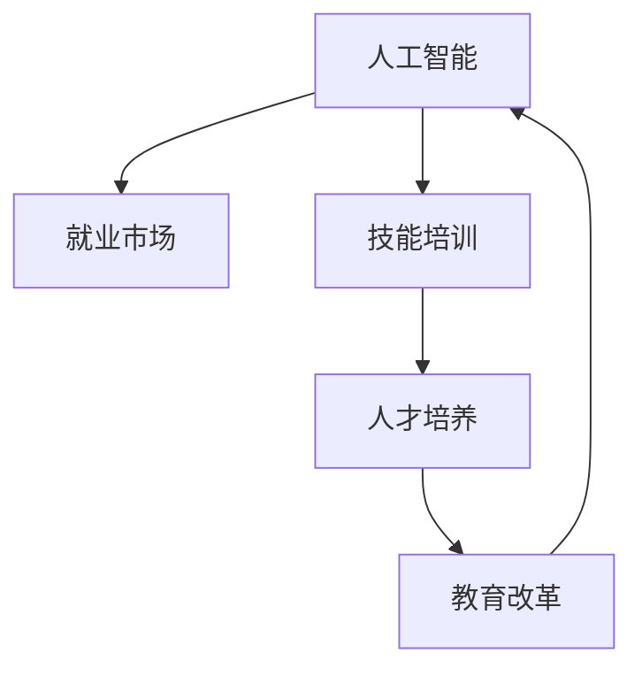

                 

# 人类计算：AI时代的未来就业市场与技能培训发展分析预测

> 关键词：人工智能,就业市场,技能培训,未来发展,人才培养,教育改革

## 1. 背景介绍

### 1.1 问题由来
随着人工智能（AI）技术的迅猛发展，AI时代已经到来。AI的广泛应用正在重新定义各行各业，对就业市场和人才培养模式产生了深远影响。如何适应AI时代的变革，成为当下社会需要解决的重要问题。

AI技术的迅猛发展不仅催生了大量的新兴职业，如数据科学家、AI工程师、机器人操作员等，同时也引发了对现有岗位的变革需求，如传统制造业、金融业、医疗业等领域的智能转型。这要求人才必须具备跨学科的知识技能，同时也对教育体系和技能培训提出了新的挑战。

### 1.2 问题核心关键点
本研究聚焦于AI时代的就业市场变化和技能培训的发展趋势。具体包括以下几个核心关键点：

1. **就业市场变化**：AI技术将如何改变现有就业结构，哪些岗位将会被替代，哪些岗位将出现新的需求。
2. **技能培训需求**：AI时代需要哪些新型技能，现有教育体系如何培养这些技能。
3. **人才培养模式**：未来人才的培养应如何设计和实施，以适应AI时代的就业需求。
4. **教育改革建议**：基于当前就业市场和技能培训的现状，提出教育改革的方向和具体措施。

## 2. 核心概念与联系

### 2.1 核心概念概述

为更好地理解AI时代就业市场和技能培训的变化，本节将介绍几个密切相关的核心概念：

- **人工智能（AI）**：一种模拟人类智能的技术，包括机器学习、深度学习、自然语言处理等，其核心在于让机器能够自动执行复杂任务。
- **就业市场**：不同行业和岗位的劳动力供需情况，受技术变革、政策调整、经济周期等多种因素影响。
- **技能培训**：为了适应职业需求，对劳动力进行的知识和技能培训活动。
- **人才培养**：通过教育体系，系统性地培养和塑造符合未来职业需求的各类人才。
- **教育改革**：为适应未来职业需求和经济发展，对现有教育体系进行的一系列改革。

这些概念之间的逻辑关系可以通过以下Mermaid流程图来展示：



这个流程图展示了几者之间的关系：

1. AI技术的进步推动就业市场和技能培训的需求变化。
2. 技能培训和人才培养在适应AI时代需求的过程中相互促进。
3. 教育改革则是系统性适应未来职业需求的必要手段。

## 3. 核心算法原理 & 具体操作步骤
### 3.1 算法原理概述

AI时代的就业市场与技能培训发展，涉及到大量的数据收集、分析和预测。其核心算法原理包括：

1. **数据分析**：收集和处理来自就业市场、教育系统、行业报告等数据，提取关键特征。
2. **模型构建**：构建预测模型，如回归模型、分类模型、时间序列模型等，预测未来就业市场变化和技能需求。
3. **仿真模拟**：使用仿真模拟技术，预测未来技术变革对不同职业的影响，评估技能培训需求。

### 3.2 算法步骤详解

基于上述算法原理，AI时代的就业市场与技能培训发展分析预测主要分为以下几步：

1. **数据收集与处理**：
   - 收集就业市场数据，如岗位数量、薪资水平、失业率等。
   - 收集技能培训数据，如培训课程、师资力量、培训效果等。
   - 收集教育系统数据，如教育资源、课程设置、学生就业情况等。

2. **特征提取与选择**：
   - 提取关键特征，如岗位需求变化趋势、技能培训课程结构、教育体系改革方向等。
   - 选择最相关的特征，减少数据维度，提高分析效率。

3. **模型构建与训练**：
   - 构建预测模型，如时间序列模型、回归模型、决策树模型等。
   - 使用历史数据对模型进行训练，评估模型效果。
   - 调整模型参数，优化模型性能。

4. **预测与评估**：
   - 使用训练好的模型对未来就业市场和技能培训需求进行预测。
   - 评估预测结果，验证模型的准确性和可靠性。
   - 根据预测结果，调整模型参数和培训方案，优化预测效果。

### 3.3 算法优缺点

AI时代的就业市场与技能培训发展分析预测算法具有以下优点：

1. **高效性**：利用大量历史数据和先进算法，可以快速分析出未来就业市场和技能培训需求的变化趋势。
2. **系统性**：能够系统性地评估不同因素对就业市场和技能培训的影响，提供全面的分析视角。
3. **预测性**：通过模型预测，能够对未来就业市场和技能培训需求做出前瞻性的规划和建议。

同时，该算法也存在一些局限性：

1. **数据依赖**：预测结果高度依赖于数据的质量和完整性，数据缺失或不准确可能导致预测偏差。
2. **模型复杂性**：构建复杂的预测模型需要专业知识，模型的选择和调参可能比较困难。
3. **动态变化**：就业市场和技术变革的速度非常快，模型需要不断更新才能保持准确性。

### 3.4 算法应用领域

AI时代的就业市场与技能培训发展分析预测算法，主要应用于以下几个领域：

1. **政策制定**：帮助政府部门制定合理的就业政策，推动劳动力市场健康发展。
2. **企业战略**：指导企业根据未来就业市场趋势，制定人力资源规划和培训方案。
3. **教育改革**：为教育机构提供数据支持和决策依据，优化课程设置和培训内容。
4. **技能培训**：提供针对未来市场需求的技能培训指导，帮助劳动者提升就业竞争力。

## 4. 数学模型和公式 & 详细讲解 & 举例说明

### 4.1 数学模型构建

为了分析AI时代的就业市场变化和技能培训需求，本研究构建了一个多变量时间序列模型。其基本形式如下：

$$
Y_t = \alpha + \beta_1X_{t1} + \beta_2X_{t2} + \ldots + \beta_nX_{tn} + \epsilon_t
$$

其中：
- $Y_t$ 表示第 $t$ 期的就业市场或技能培训需求。
- $X_{ti}$ 表示第 $i$ 个影响因子在 $t$ 期的数据。
- $\alpha$ 为截距项。
- $\beta_i$ 为各影响因子的系数。
- $\epsilon_t$ 为随机误差项。

### 4.2 公式推导过程

假设 $Y_t$ 和 $X_{ti}$ 均为线性关系，即满足线性回归模型。根据最小二乘法，求解模型参数 $\beta_i$ 的公式为：

$$
\hat{\beta}_i = \frac{cov(X_{ti}, Y_t)}{var(X_{ti})}
$$

其中：
- $cov(X_{ti}, Y_t)$ 为 $X_{ti}$ 和 $Y_t$ 的协方差。
- $var(X_{ti})$ 为 $X_{ti}$ 的方差。

求解截距项 $\alpha$ 的公式为：

$$
\hat{\alpha} = \bar{Y} - \sum_{i=1}^{n} \hat{\beta}_i \bar{X}_{ti}
$$

其中：
- $\bar{Y}$ 为 $Y_t$ 的均值。
- $\bar{X}_{ti}$ 为 $X_{ti}$ 的均值。

### 4.3 案例分析与讲解

以就业市场为例，假设有两个影响因子 $X_{t1}$ 和 $X_{t2}$，分别为技术进步速率和行业投资水平。使用上述线性回归模型进行预测：

$$
Y_t = \alpha + \beta_1X_{t1} + \beta_2X_{t2} + \epsilon_t
$$

其中 $Y_t$ 为第 $t$ 期的就业市场规模，$X_{t1}$ 为第 $t$ 期的技术进步速率，$X_{t2}$ 为第 $t$ 期的行业投资水平。假设 $X_{t1}$ 和 $X_{t2}$ 均为线性关系，则求解模型参数 $\beta_1$ 和 $\beta_2$ 的公式为：

$$
\hat{\beta}_1 = \frac{cov(X_{t1}, Y_t)}{var(X_{t1})}
$$
$$
\hat{\beta}_2 = \frac{cov(X_{t2}, Y_t)}{var(X_{t2})}
$$

根据历史数据，计算出 $\hat{\beta}_1$ 和 $\hat{\beta}_2$ 的值，即可对未来就业市场规模进行预测。

## 5. 项目实践：代码实例和详细解释说明

### 5.1 开发环境搭建

在进行AI时代就业市场与技能培训发展分析预测项目开发前，需要准备好以下开发环境：

1. 安装Python编程语言。
2. 安装相关数据分析库，如Pandas、NumPy、SciPy等。
3. 安装机器学习库，如Scikit-learn、TensorFlow、Keras等。
4. 安装时间序列分析库，如statsmodels、pyflux等。
5. 安装数据可视化库，如Matplotlib、Seaborn等。

### 5.2 源代码详细实现

以下是使用Python进行时间序列模型构建的代码实现：

```python
import pandas as pd
from sklearn.linear_model import LinearRegression
import matplotlib.pyplot as plt

# 读取数据
data = pd.read_csv('data.csv')

# 数据预处理
X = data[['X1', 'X2']]  # 影响因子数据
Y = data['Y']  # 就业市场或技能培训需求数据

# 构建线性回归模型
model = LinearRegression()
model.fit(X, Y)

# 模型预测
future_data = pd.read_csv('future_data.csv')
X_future = future_data[['X1', 'X2']]
Y_pred = model.predict(X_future)

# 输出预测结果
print(Y_pred)
```

### 5.3 代码解读与分析

**数据读取与预处理**：
- 使用Pandas库读取数据，并进行初步的清洗和处理。

**模型构建与训练**：
- 构建线性回归模型，使用历史数据对模型进行训练。

**模型预测**：
- 使用训练好的模型对未来数据进行预测。

**输出结果**：
- 输出预测结果，用于后续分析和应用。

## 6. 实际应用场景

### 6.1 就业市场变化

随着AI技术的快速发展，一些传统岗位将逐渐被机器人和自动化工具取代。例如，制造业中的装配线工人、客服中心的电话接线员、金融行业中的数据录入员等岗位，将面临较大的失业风险。

相反，AI也催生了许多新兴岗位，如数据科学家、AI工程师、机器人维护员等。这些岗位对人才的需求快速增长，需要大量的高技能劳动力。

### 6.2 技能培训需求

AI时代对人才的需求发生了显著变化，技能培训需要从以下几个方面进行调整：

1. **编程与算法**：编程语言如Python、R，以及机器学习、深度学习的算法基础，是未来就业市场的重要需求。
2. **数据处理与分析**：数据清洗、数据可视化、数据挖掘等技能，对于处理大数据和人工智能任务至关重要。
3. **跨领域知识**：AI的应用领域非常广泛，如医疗、金融、教育、制造业等，跨领域的知识技能将更具竞争力。
4. **软技能**：沟通能力、团队协作、项目管理等软技能，对于AI时代团队合作和项目管理至关重要。

### 6.3 未来应用展望

未来，AI时代的就业市场和技能培训将呈现以下几个趋势：

1. **终身学习**：终身学习将成为未来的主流趋势，职场人士需要不断更新知识和技能以适应新技术的变化。
2. **跨学科融合**：各学科间的交叉融合将更加紧密，未来的职场需要具备跨学科知识的复合型人才。
3. **虚拟培训**：虚拟现实、增强现实等技术将为技能培训带来新的形式，提供更加沉浸式和互动的学习体验。
4. **个性化培训**：基于AI的个性化培训推荐系统，将能够为个人提供量身定制的学习计划，提升学习效率。

## 7. 工具和资源推荐

### 7.1 学习资源推荐

为了帮助开发者系统掌握AI时代就业市场和技能培训的发展趋势，这里推荐一些优质的学习资源：

1. **《人工智能基础》在线课程**：由Coursera提供的AI基础课程，涵盖了机器学习、深度学习、数据处理等基础知识，适合初学者。
2. **《AI与人类未来》系列书籍**：由斯坦福大学学者编写的系列书籍，探讨AI技术对人类未来的影响，提供前沿视角。
3. **《机器学习实战》书籍**：介绍机器学习算法和实践应用的经典书籍，适合想要深入学习的开发者。
4. **Kaggle平台**：全球最大的数据科学竞赛平台，提供丰富的数据集和比赛项目，适合实践和提高技能。
5. **Google AI实验室博客**：定期发布AI技术的最新进展和研究动态，提供学习参考。

### 7.2 开发工具推荐

高效的开发离不开优秀的工具支持。以下是几款用于AI时代就业市场与技能培训发展的常用工具：

1. **Jupyter Notebook**：交互式的编程环境，支持Python、R等语言，方便数据处理和模型构建。
2. **Google Colab**：谷歌提供的免费Jupyter Notebook环境，支持GPU和TPU计算，方便快速实验。
3. **PyTorch**：深度学习框架，支持动态计算图和GPU加速，适合构建复杂神经网络。
4. **TensorFlow**：谷歌提供的深度学习框架，支持静态计算图和分布式训练，适合大规模模型训练。
5. **statsmodels**：统计分析库，支持时间序列分析、回归模型等，适合数据分析和建模。

### 7.3 相关论文推荐

AI时代的就业市场和技能培训发展是一个复杂的系统性问题，以下几篇论文对该领域的研究具有重要参考价值：

1. **《人工智能时代的就业市场》（2021年）**：探讨AI技术对就业市场的影响，提出未来就业市场的发展趋势。
2. **《技能培训需求分析与预测》（2022年）**：研究AI时代对技能培训的需求，提出适应未来职业的技能培训方案。
3. **《教育体系与AI技术融合》（2023年）**：探讨AI技术在教育中的应用，提出教育体系改革的建议。
4. **《终身学习与AI时代的职业发展》（2024年）**：研究终身学习与AI技术的结合，提出未来职业发展的路径和策略。

## 8. 总结：未来发展趋势与挑战

### 8.1 总结

本文对AI时代的就业市场与技能培训的发展进行了全面系统的介绍。首先阐述了AI技术的快速发展对就业市场的影响，明确了未来就业市场和技能培训的需求变化。其次，从原理到实践，详细讲解了就业市场与技能培训的数学模型和具体操作步骤，给出了项目开发的完整代码实例。同时，本文还探讨了AI时代就业市场和技能培训的未来发展趋势和面临的挑战。

通过本文的系统梳理，可以看到，AI技术正在深刻改变就业市场和技能培训的格局。AI时代的就业市场需要具备高技能的复合型人才，技能培训则需要不断更新和优化，以适应新技术的需求。教育体系和政策制定也需要进行相应的改革，以培养符合未来职业需求的人才。

### 8.2 未来发展趋势

展望未来，AI时代的就业市场与技能培训将呈现以下几个发展趋势：

1. **技能多元化**：未来职场需要具备跨学科知识的复合型人才，技能培训应注重多元化能力的培养。
2. **技术更新快**：AI技术的快速迭代要求人才持续学习，终身学习将成为未来的主流。
3. **全球化需求**：AI技术的应用具有全球化特征，未来的技能培训应具备国际视野。
4. **创新与创业**：AI时代创新创业机会增加，未来的技能培训应注重创新思维和创业能力的培养。

### 8.3 面临的挑战

尽管AI时代的就业市场和技能培训具有广阔的发展前景，但在迈向更加智能化、普适化应用的过程中，仍然面临诸多挑战：

1. **资源投入大**：AI技术的学习和应用需要大量的资源投入，包括时间、金钱和教育资源。
2. **技能差距大**：AI技术在提高生产效率的同时，也加剧了人才供需的不平衡，导致技能差距问题。
3. **伦理与安全**：AI技术的应用可能带来伦理和安全问题，如何规范AI的使用成为重要课题。
4. **就业不稳定**：AI技术的广泛应用可能导致部分岗位的消失，如何保障就业稳定需要多方努力。

### 8.4 研究展望

面对AI时代就业市场和技能培训的诸多挑战，未来的研究需要在以下几个方面寻求新的突破：

1. **数据驱动的预测**：利用大数据和机器学习技术，对未来就业市场和技能培训需求进行更加精准的预测和评估。
2. **个性化培训**：开发基于AI的个性化培训推荐系统，提供量身定制的学习计划，提升学习效率。
3. **终身学习平台**：建立终身学习平台，支持多种学习形式和路径，促进职场人士持续学习和职业发展。
4. **跨学科融合**：探索跨学科融合的教育模式，培养具备跨学科知识的复合型人才。
5. **伦理与规范**：制定AI技术应用的伦理规范，保障AI技术的安全使用和公平性。

这些研究方向的探索，将引领AI时代就业市场和技能培训进入新的发展阶段，为未来的技术应用和人才培养提供坚实的理论基础和实践指导。

## 9. 附录：常见问题与解答

**Q1：AI时代就业市场和技能培训的未来发展趋势是什么？**

A: AI时代就业市场和技能培训的未来发展趋势包括：
1. 技能多元化：未来职场需要具备跨学科知识的复合型人才，技能培训应注重多元化能力的培养。
2. 技术更新快：AI技术的快速迭代要求人才持续学习，终身学习将成为未来的主流。
3. 全球化需求：AI技术的应用具有全球化特征，未来的技能培训应具备国际视野。
4. 创新与创业：AI时代创新创业机会增加，未来的技能培训应注重创新思维和创业能力的培养。

**Q2：AI时代的就业市场和技能培训面临的主要挑战有哪些？**

A: AI时代的就业市场和技能培训面临的主要挑战包括：
1. 资源投入大：AI技术的学习和应用需要大量的资源投入，包括时间、金钱和教育资源。
2. 技能差距大：AI技术在提高生产效率的同时，也加剧了人才供需的不平衡，导致技能差距问题。
3. 伦理与安全：AI技术的应用可能带来伦理和安全问题，如何规范AI的使用成为重要课题。
4. 就业不稳定：AI技术的广泛应用可能导致部分岗位的消失，如何保障就业稳定需要多方努力。

**Q3：如何构建基于AI的终身学习平台？**

A: 构建基于AI的终身学习平台需要以下几个步骤：
1. 数据收集：收集用户的学习需求、学习行为和反馈数据。
2. 模型构建：构建推荐算法模型，如协同过滤、内容推荐、时间序列预测等。
3. 平台开发：开发用户界面和交互系统，提供学习资源的搜索和推荐功能。
4. 数据更新：持续收集和更新学习数据，优化推荐算法。
5. 应用推广：通过社交媒体、合作伙伴等渠道，推广平台和吸引用户使用。

通过以上步骤，可以构建一个基于AI的终身学习平台，支持多种学习形式和路径，促进职场人士持续学习和职业发展。

---

作者：禅与计算机程序设计艺术 / Zen and the Art of Computer Programming

