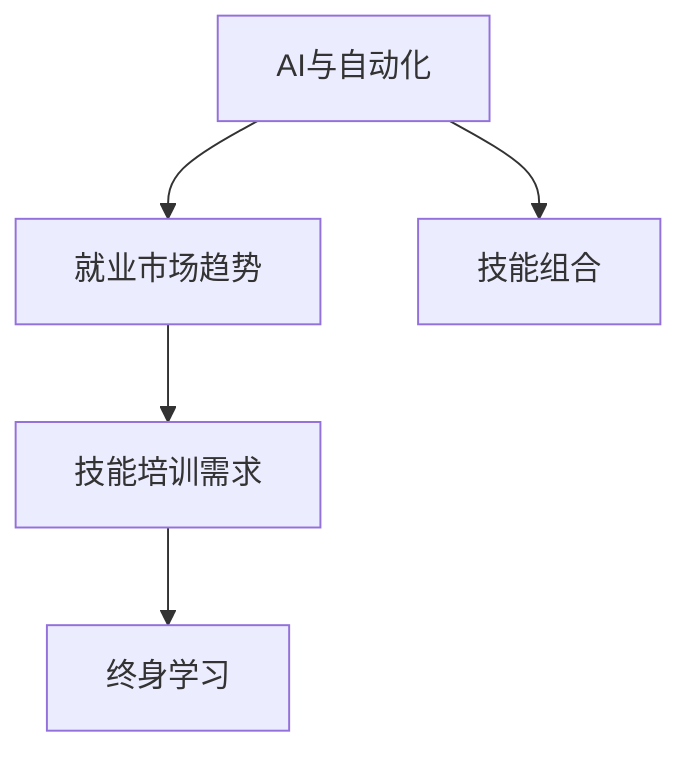

                 

# 人类计算：AI时代的未来就业市场趋势与技能培训需求

在AI时代，技术的快速发展正在重塑全球就业市场，引发了一系列变革和挑战。本文将深入探讨AI时代下人类计算的角色与未来的就业市场趋势，并分析技能培训需求的变化，以期为从业者提供前瞻性指导。

## 1. 背景介绍

### 1.1 问题由来
人工智能(AI)技术的快速进步正在重塑全球就业市场，机器学习、深度学习、自然语言处理等领域的专业人才需求日益增加。同时，传统的基于规则的重复性工作逐渐被自动化取代，导致某些行业岗位数量减少。如何在AI时代保持就业竞争力，成为当前从业者面临的重要问题。

### 1.2 问题核心关键点
AI时代下的就业市场变革主要集中在以下几个方面：
- **就业结构变化**：AI技术在自动化和智能化方面的应用，使得传统的制造业和服务业岗位大幅减少，而数据科学家、AI工程师、机器学习专家等新兴岗位需求激增。
- **技能需求升级**：随着AI技术的发展，对从业者的技术要求日益提升，需要掌握更多的AI相关知识和技能。
- **终身学习趋势**：AI技术的快速发展使得终身学习成为必然趋势，从业者需要不断更新知识，跟上技术变化。

## 2. 核心概念与联系

### 2.1 核心概念概述

为更好地理解AI时代的就业市场和技能培训需求，本节将介绍几个关键概念：

- **AI与自动化**：人工智能技术通过机器学习、深度学习等方法，实现自动化和智能化，替代传统的人工操作。
- **就业市场趋势**：AI技术的发展导致就业市场结构的变化，新兴岗位需求增加，传统岗位数量减少。
- **技能培训需求**：随着AI技术的应用，对从业者的技能要求发生变化，需要掌握更多的AI相关知识和技能。
- **终身学习**：AI技术的快速发展使得终身学习成为必然趋势，从业者需要不断更新知识，跟上技术变化。
- **技能组合**：在AI时代，仅具备单一技能已难以满足市场需求，需要具备多种技能组合。

这些核心概念之间的逻辑关系可以通过以下Mermaid流程图来展示：



这个流程图展示了几者之间的逻辑关系：

1. AI技术的发展导致就业市场结构的变化，新兴岗位需求增加，传统岗位数量减少。
2. 新兴岗位的需求激增，使得技能培训需求提升。
3. 终身学习成为必然趋势，从业者需要不断更新知识。
4. 新兴岗位的需求和终身学习的趋势，需要从业者具备多种技能组合。

这些概念共同构成了AI时代就业市场和技能培训的基础框架，帮助从业者把握未来的趋势和需求。

## 3. 核心算法原理 & 具体操作步骤
### 3.1 算法原理概述

AI时代下的就业市场变化和技能培训需求，主要基于以下核心算法原理：

- **数据驱动决策**：AI技术的发展使得数据驱动决策成为可能，从业者需要具备数据处理和分析能力。
- **跨领域技能**：AI技术的应用范围广泛，从业者需要具备跨领域技能，如数据科学、编程、人工智能等。
- **终身学习机制**：AI技术的快速发展使得终身学习成为必然趋势，从业者需要不断更新知识，跟上技术变化。

### 3.2 算法步骤详解

AI时代下的就业市场变化和技能培训需求，可以通过以下步骤来详细阐述：

**Step 1: 数据收集与分析**
- 收集当前就业市场的数据，包括岗位数量、岗位要求、技能需求等。
- 分析数据，识别新兴岗位和传统岗位的变化趋势。

**Step 2: 技能需求预测**
- 结合AI技术的快速发展，预测未来技能需求的变化。
- 考虑不同行业、不同地区的就业市场特点，进行技能需求预测。

**Step 3: 技能培训计划制定**
- 根据技能需求预测结果，制定相应的技能培训计划。
- 选择适当的培训方式，如在线课程、培训中心、企业内训等。

**Step 4: 技能培训实施与评估**
- 实施技能培训计划，确保培训内容的质量和有效性。
- 定期评估培训效果，调整培训计划，确保与市场需求匹配。

**Step 5: 终身学习机制构建**
- 建立终身学习机制，鼓励从业者持续学习新知识。
- 提供持续学习资源，如在线课程、书籍、研讨会等。

通过以上步骤，可以系统地应对AI时代下的就业市场变化和技能培训需求，确保从业者具备所需技能，跟上技术发展的步伐。

### 3.3 算法优缺点

AI时代下的就业市场变化和技能培训需求，具有以下优点：
1. 系统性：通过数据驱动决策和技能培训计划，确保培训内容与市场需求匹配。
2. 前瞻性：结合AI技术的发展趋势，预测未来技能需求的变化，制定相应的培训计划。
3. 灵活性：根据不同行业、不同地区的特点，灵活调整培训内容和方式。

同时，该方法也存在一定的局限性：
1. 数据获取难度：获取准确的就业市场数据可能存在难度，影响预测结果的准确性。
2. 技能培训成本：大规模技能培训可能涉及高昂的培训费用，对企业和个人都具有挑战。
3. 终身学习负担：终身学习机制的构建需要大量的资源投入，可能对从业者造成一定的负担。

尽管存在这些局限性，但就目前而言，基于AI的就业市场变化和技能培训需求分析方法仍是最主流的研究方向。未来相关研究的重点在于如何进一步提高数据获取的准确性，降低培训成本，同时兼顾终身学习的可行性和经济性。

### 3.4 算法应用领域

基于AI的就业市场变化和技能培训需求分析方法，已经在多个领域得到了应用，例如：

- **教育培训**：分析当前教育培训市场需求，制定相应的技能培训计划，提高从业者的技能水平。
- **人力资源管理**：通过技能培训需求分析，优化招聘流程，提升员工的技能水平和岗位匹配度。
- **政府政策制定**：结合技能需求预测，制定相应的就业和培训政策，促进就业市场健康发展。
- **企业战略规划**：分析行业内的技能需求变化，制定企业的培训和人才发展规划，提升企业竞争力。

除了上述这些经典应用外，AI时代下的人类计算领域还将不断拓展，为更多行业带来变革性影响。

## 4. 数学模型和公式 & 详细讲解 & 举例说明

### 4.1 数学模型构建

本节将使用数学语言对AI时代下的就业市场变化和技能培训需求进行分析。

假设就业市场中有 $N$ 个岗位，每个岗位对 $K$ 种技能的需求分别为 $a_{ij}$，其中 $i$ 表示岗位，$j$ 表示技能。设技能 $j$ 的当前需求量为 $d_j$，未来需求量为 $d_j'$。则技能需求预测模型为：

$$
d_j' = f(d_j, \alpha, \beta)
$$

其中 $f$ 为预测函数，$\alpha$ 为技能更新率，$\beta$ 为技术变化率。

### 4.2 公式推导过程

以下我们以线性预测模型为例，推导技能需求预测公式。

假设技能需求 $d_j$ 与当前需求 $d_j^0$ 的关系为线性变化，即：

$$
d_j = d_j^0 + \alpha \Delta t
$$

其中 $\Delta t$ 为时间间隔。根据假设，未来需求 $d_j'$ 与当前需求 $d_j$ 的关系为：

$$
d_j' = d_j + \beta \Delta t
$$

结合上述两式，可得：

$$
d_j' = d_j^0 + (1 + \beta - \alpha)\Delta t
$$

这就是基于线性假设的技能需求预测公式。

### 4.3 案例分析与讲解

以数据科学为例，当前数据科学岗位对Python、R、SQL等技能的需求分别为 $a_{ij}$。假设当前需求为 $d_j^0$，未来需求为 $d_j'$，设技能更新率为 $\alpha = 0.1$，技术变化率为 $\beta = 0.05$。则未来需求为：

$$
d_j' = d_j^0 + (1 + 0.05 - 0.1) \Delta t = d_j^0 + 0.05 \Delta t
$$

这意味着，随着时间的推移，数据科学岗位对Python、R、SQL等技能的需求将增加，且增加的速度为5%。这可以作为技能培训计划制定的依据。

## 5. 项目实践：代码实例和详细解释说明
### 5.1 开发环境搭建

在进行技能培训计划制定和终身学习机制构建的实践前，我们需要准备好开发环境。以下是使用Python进行开发的环境配置流程：

1. 安装Anaconda：从官网下载并安装Anaconda，用于创建独立的Python环境。

2. 创建并激活虚拟环境：
```bash
conda create -n python-env python=3.8 
conda activate python-env
```

3. 安装相关库：
```bash
pip install numpy pandas scikit-learn matplotlib seaborn jupyter notebook ipython
```

4. 准备数据集：获取当前就业市场的数据，如岗位数量、岗位要求、技能需求等。

### 5.2 源代码详细实现

下面我们以数据科学岗位技能培训为例，给出使用Python进行技能培训计划制定的代码实现。

```python
import numpy as np
import pandas as pd
import seaborn as sns
import matplotlib.pyplot as plt

# 准备数据
data = pd.read_csv('job_skills.csv')
jobs = data['岗位'].unique()
skills = data['skill'].unique()

# 构建技能需求矩阵
skill_matrix = pd.DataFrame(index=jobs, columns=skills)
for i, row in data.iterrows():
    if row['岗位'] in jobs and row['skill'] in skills:
        skill_matrix.loc[row['岗位'], row['skill']] = row['skill_count']

# 预测技能需求
alpha = 0.1
beta = 0.05
future_skill_matrix = skill_matrix * (1 + beta) + (1 - alpha) * np.diff(skill_matrix)

# 可视化技能需求变化
sns.heatmap(future_skill_matrix, annot=True, cmap='YlGnBu')
plt.title('未来技能需求变化')
plt.show()
```

这个代码实现了对当前数据科学岗位技能需求的变化预测，并通过热图进行了可视化展示。可以看到，随着时间的推移，Python、R、SQL等技能的需求量呈上升趋势，这为技能培训计划的制定提供了依据。

### 5.3 代码解读与分析

让我们再详细解读一下关键代码的实现细节：

**准备数据**：
- `pd.read_csv('job_skills.csv')`：读取就业市场数据集，包含岗位名称、技能名称和技能需求量。
- `jobs = data['岗位'].unique()`：获取所有岗位名称。
- `skills = data['skill'].unique()`：获取所有技能名称。

**构建技能需求矩阵**：
- `skill_matrix`：构建技能需求矩阵，其中行表示岗位，列表示技能。
- `for i, row in data.iterrows():`：遍历数据集中的每一行，更新技能需求矩阵。

**预测技能需求**：
- `alpha = 0.1`：技能更新率。
- `beta = 0.05`：技术变化率。
- `future_skill_matrix`：根据线性预测模型计算未来技能需求。

**可视化技能需求变化**：
- `sns.heatmap(future_skill_matrix, annot=True, cmap='YlGnBu')`：使用seaborn库绘制热图，展示未来技能需求的变化趋势。

通过上述代码，可以直观地看到未来技能需求的变化趋势，从而制定相应的技能培训计划。

## 6. 实际应用场景

### 6.1 智能教育

基于AI的就业市场变化和技能培训需求分析，可以在智能教育领域得到广泛应用。AI技术可以通过个性化学习路径的推荐，帮助学生更有针对性地掌握所需技能，从而提升学习效果。

在技术实现上，可以通过分析学生的学习行为和反馈，预测未来技能需求，制定个性化的学习计划。例如，对于数据分析岗位，可以推荐Python、R、SQL等技能的学习路径，帮助学生全面提升相关能力。

### 6.2 人力资源管理

人力资源管理部门可以利用AI技术进行技能培训需求分析，优化招聘流程，提升员工的技能水平和岗位匹配度。例如，对于数据科学岗位，可以分析当前市场需求，制定相应的招聘策略，同时制定技能培训计划，提升现有员工的岗位适应能力。

在技术实现上，可以建立员工技能数据库，利用AI技术分析技能需求和员工技能匹配情况，制定个性化的培训计划。通过AI的自动化和智能化，提升人力资源管理的效率和效果。

### 6.3 政府政策制定

政府部门可以利用AI技术进行技能培训需求分析，制定相应的就业和培训政策，促进就业市场健康发展。例如，对于AI领域的技能需求，可以制定相应的培训补贴政策，鼓励更多人参与培训，提升AI领域的技能供给。

在技术实现上，可以利用大数据分析和AI预测技术，对未来技能需求进行预测，制定相应的政策措施。通过AI的自动化和智能化，提升政策制定的科学性和有效性。

### 6.4 企业战略规划

企业可以利用AI技术进行技能培训需求分析，制定相应的培训和人才发展规划，提升企业竞争力。例如，对于数据科学岗位，可以分析当前市场需求，制定相应的培训计划，提升员工的岗位适应能力。

在技术实现上，可以建立员工技能数据库，利用AI技术分析技能需求和员工技能匹配情况，制定个性化的培训计划。通过AI的自动化和智能化，提升企业人才管理的效率和效果。

## 7. 工具和资源推荐
### 7.1 学习资源推荐

为了帮助从业者系统掌握AI时代的就业市场变化和技能培训需求，这里推荐一些优质的学习资源：

1. **《AI就业市场分析与技能培训》系列博文**：深入浅出地介绍AI时代下就业市场的变化趋势和技能培训需求，提供实用的指导和建议。

2. **Coursera《人工智能基础》课程**：由斯坦福大学教授讲授，涵盖AI技术的基本概念和前沿进展，适合从业者系统学习。

3. **Udacity《人工智能应用开发》课程**：结合实际案例，讲解AI技术在各行各业中的应用，提供实战练习机会。

4. **LinkedIn Learning《数据科学与分析》课程**：涵盖数据科学和数据分析的基本技能和工具，适合从业者掌握必备知识。

5. **Kaggle竞赛平台**：提供大量的数据科学竞赛和项目，适合从业者通过实战提升技能。

通过对这些资源的学习实践，相信你一定能够快速掌握AI时代的就业市场变化和技能培训需求，并应用于实际工作中。

### 7.2 开发工具推荐

高效的开发离不开优秀的工具支持。以下是几款用于AI时代就业市场变化和技能培训开发的常用工具：

1. **Jupyter Notebook**：轻量级的交互式编程环境，适合数据科学和机器学习项目的开发和共享。

2. **Python编程语言**：灵活的动态语言，支持大量的AI相关库和框架，如TensorFlow、PyTorch、Scikit-learn等。

3. **Google Colab**：免费的在线Jupyter Notebook环境，提供GPU/TPU算力，方便从业者快速实验最新模型。

4. **Anaconda**：Python环境管理工具，支持虚拟环境的创建和激活，方便管理Python依赖库。

5. **TensorBoard**：TensorFlow配套的可视化工具，可实时监测模型训练状态，提供丰富的图表呈现方式。

6. **Weights & Biases**：模型训练的实验跟踪工具，记录和可视化模型训练过程中的各项指标，方便调试和优化。

合理利用这些工具，可以显著提升AI时代就业市场变化和技能培训任务的开发效率，加快创新迭代的步伐。

### 7.3 相关论文推荐

AI时代下就业市场变化和技能培训需求的研究源于学界的持续探索。以下是几篇奠基性的相关论文，推荐阅读：

1. **《未来的就业市场：AI和自动化对职业的影响》**：探讨AI和自动化技术对未来就业市场的影响，预测不同岗位的需求变化。

2. **《数据驱动的就业市场预测模型》**：利用机器学习技术，构建就业市场预测模型，分析技能需求变化。

3. **《终身学习：AI时代下的技能培训策略》**：讨论终身学习机制在AI时代下的重要性，提出相应的技能培训策略。

4. **《技能组合分析：AI时代下的就业市场趋势》**：利用多变量分析方法，探讨技能组合与就业市场趋势的关系，提出技能培训建议。

5. **《技能培训的有效性评估》**：通过实证研究，评估不同技能培训方式的效果，提出优化建议。

这些论文代表了大数据和AI技术在就业市场变化和技能培训需求研究中的应用方向，为从业者提供理论支持和实践指导。

## 8. 总结：未来发展趋势与挑战

### 8.1 研究成果总结

本文对AI时代下的就业市场变化和技能培训需求进行了全面系统的介绍，主要研究成果包括：

1. **就业市场变化趋势**：AI技术的发展导致就业市场结构的变化，新兴岗位需求增加，传统岗位数量减少。
2. **技能培训需求**：AI技术的应用范围广泛，对从业者的技能要求发生变化，需要掌握更多的AI相关知识和技能。
3. **终身学习机制**：AI技术的快速发展使得终身学习成为必然趋势，从业者需要不断更新知识，跟上技术变化。

通过本文的系统梳理，可以看到，AI时代下的就业市场变化和技能培训需求正在经历深刻的变革，为从业者提供了新的机遇和挑战。

### 8.2 未来发展趋势

展望未来，AI时代下的就业市场变化和技能培训需求将呈现以下几个发展趋势：

1. **AI技术普及**：AI技术将在更多行业得到应用，催生更多新兴岗位和技能需求。
2. **技能组合重要性增加**：从业者需要具备多种技能组合，才能适应复杂多变的市场需求。
3. **终身学习机制常态化**：AI技术的快速发展使得终身学习成为必然趋势，从业者需要不断更新知识，跟上技术变化。
4. **技能培训工具多样化**：未来将出现更多基于AI的技能培训工具，提升培训效果和效率。
5. **跨领域技能需求增加**：AI技术的应用范围广泛，跨领域技能的需求将大幅增加。

以上趋势凸显了AI时代下就业市场和技能培训的广阔前景，为从业者提供了新的机遇和挑战。从业者需要不断学习和适应，才能在AI时代中保持竞争力。

### 8.3 面临的挑战

尽管AI时代下就业市场变化和技能培训需求前景广阔，但仍面临诸多挑战：

1. **技能培训成本高**：大规模技能培训可能涉及高昂的培训费用，对企业和个人都具有挑战。
2. **终身学习负担重**：终身学习机制的构建需要大量的资源投入，可能对从业者造成一定的负担。
3. **技能培训效果不一**：不同培训机构和课程质量参差不齐，需要从业者具备一定的甄别能力。
4. **技能培训内容更新慢**：AI技术的发展速度很快，技能培训内容需要及时更新，才能保持前沿性和实用性。
5. **技能培训资源不足**：部分地区和行业的技能培训资源不足，难以满足从业者的需求。

尽管存在这些挑战，但就目前而言，基于AI的就业市场变化和技能培训需求分析方法仍是最主流的研究方向。未来相关研究的重点在于如何进一步提高技能培训效果，降低培训成本，同时兼顾终身学习的可行性和经济性。

### 8.4 研究展望

面向未来，AI时代下的就业市场变化和技能培训需求研究需要在以下几个方面寻求新的突破：

1. **技能培训内容个性化**：根据从业者的职业背景和学习需求，制定个性化的培训计划，提升学习效果。
2. **跨领域技能融合**：将不同领域的技能进行融合，提升从业者的综合能力。
3. **在线学习平台优化**：优化在线学习平台，提供高质量的培训资源和互动学习环境，提升学习效率。
4. **终身学习机制保障**：建立完善的终身学习机制，确保从业者能够持续学习和适应技术变化。
5. **技能培训效果评估**：建立科学的评估指标，评估培训效果，优化培训计划。

这些研究方向的探索，必将引领AI时代下的就业市场变化和技能培训需求研究迈向更高的台阶，为从业者提供更系统、更高效、更全面的技能培训支持。

## 9. 附录：常见问题与解答

**Q1：AI技术对就业市场的影响是什么？**

A: AI技术的发展对就业市场的影响主要体现在以下几个方面：
- **岗位结构变化**：AI技术的应用导致部分传统岗位减少，新兴岗位增加，如数据科学家、AI工程师、机器学习专家等。
- **技能需求变化**：AI技术的应用使得对从业者的技能要求发生变化，需要掌握更多的AI相关知识和技能。
- **职业发展路径多元化**：AI技术的应用为从业者提供了更多元化的职业发展路径，如数据科学、人工智能、自动化等领域。

**Q2：如何制定个性化的技能培训计划？**

A: 制定个性化的技能培训计划，需要考虑以下几个因素：
- **从业者背景**：根据从业者的职业背景和学习需求，制定相应的培训计划。
- **技能需求预测**：利用AI技术预测未来技能需求，制定相应的培训内容。
- **培训方式选择**：选择合适的培训方式，如在线课程、培训中心、企业内训等。
- **培训效果评估**：定期评估培训效果，调整培训计划，确保与市场需求匹配。

**Q3：终身学习机制如何构建？**

A: 构建终身学习机制，需要考虑以下几个因素：
- **学习资源提供**：提供持续学习资源，如在线课程、书籍、研讨会等。
- **学习激励机制**：建立学习激励机制，鼓励从业者持续学习。
- **学习平台优化**：优化学习平台，提供高质量的培训资源和互动学习环境，提升学习效率。
- **学习效果评估**：建立科学的评估指标，评估学习效果，优化学习计划。

**Q4：技能培训效果如何评估？**

A: 评估技能培训效果，需要考虑以下几个因素：
- **技能测试**：通过技能测试评估培训效果，判断从业者是否掌握所需技能。
- **项目实践**：通过实际项目评估培训效果，判断从业者是否能够应用所学技能。
- **反馈机制**：建立反馈机制，收集从业者的反馈，优化培训计划。
- **效果对比**：对比培训前后的效果变化，评估培训效果。

通过上述问题与解答，从业者可以更好地理解AI时代下的就业市场变化和技能培训需求，掌握制定个性化的培训计划和构建终身学习机制的方法，提升自身的竞争力。

---

作者：禅与计算机程序设计艺术 / Zen and the Art of Computer Programming

