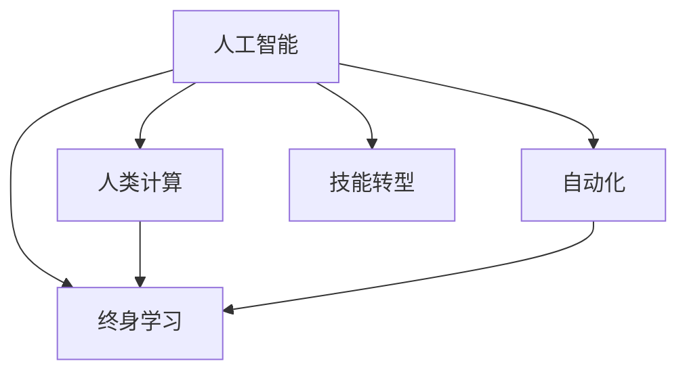

                 

# 人类计算：AI时代的未来就业市场趋势分析

> 关键词：人工智能,就业市场,人类计算,自动化,技能转型,就业政策,教育创新

## 1. 背景介绍

### 1.1 问题由来
随着人工智能(AI)技术的迅猛发展，其对社会经济的广泛影响逐渐显现，对就业市场产生了深远的影响。一方面，AI技术在提高生产效率、推动产业升级的同时，也带来了就业岗位的替代和转移。另一方面，AI的应用也为创造新的就业机会提供了新的可能。如何把握AI技术带来的就业市场变化，成为全球共同面临的重要课题。

### 1.2 问题核心关键点
本研究聚焦于AI时代的就业市场趋势，尤其是技术进步如何影响劳动力市场，以及社会如何适应这种变化。核心关键点包括：
1. **AI技术的发展与行业应用**：技术进步如何改变就业岗位数量与结构。
2. **劳动力市场的动态变化**：技能需求变化、岗位转移、职业寿命变化。
3. **就业政策与教育系统**：如何通过政策调整与教育创新，促进劳动力转型与就业市场稳定。
4. **全球视角下的就业市场演变**：不同国家和地区如何应对AI带来的就业挑战。

### 1.3 问题研究意义
理解AI时代的就业市场趋势，对于政府、企业、教育机构和个人均具有重要意义：
1. **政府决策**：有助于制定合理的就业政策，促进经济转型与就业市场稳定。
2. **企业战略**：帮助企业识别未来关键技能，优化人力资源配置。
3. **教育规划**：指导教育机构调整课程设置，培养适应未来就业市场的人才。
4. **个人职业规划**：帮助劳动者识别技能需求，规划未来职业发展路径。

## 2. 核心概念与联系

### 2.1 核心概念概述

为更好地理解AI对就业市场的影响，本节将介绍几个密切相关的核心概念：

- **人工智能(AI)**：利用算法和数据处理能力，模拟人类智能行为的技术。主要包括机器学习、深度学习、自然语言处理、计算机视觉等。
- **自动化(Automation)**：通过AI技术实现的任务自动化，包括机器人和计算机系统执行重复性、决策性工作。
- **人类计算(Human Computation)**：强调人类在复杂、创造性、情感交流等任务中的独特优势，以辅助AI技术。
- **技能转型(Skill Transition)**：随着技术进步，劳动者需要从传统技能向新技能转变，以适应就业市场变化。
- **终身学习(Lifelong Learning)**：个体持续学习新技能，以适应不断变化的职业环境。

这些概念之间的关系可以通过以下Mermaid流程图来展示：



这个流程图展示了AI技术与其他相关概念之间的联系：

1. AI技术通过自动化改变任务执行方式。
2. 人类计算强调AI技术在复杂、创造性任务中的应用。
3. 技能转型和终身学习帮助劳动者适应AI带来的就业变化。

## 3. 核心算法原理 & 具体操作步骤

### 3.1 算法原理概述

本研究将聚焦于AI对就业市场的定量分析，基于以下理论模型：

1. **劳动力需求模型**：描述行业发展对就业的影响，考虑技术进步、生产率变化等因素。
2. **技能匹配模型**：分析技能供需平衡，探讨技能转型与新技能需求。
3. **就业市场动态模型**：描述岗位转移、职业寿命等动态变化。
4. **政策影响模型**：评估政府干预措施对就业市场的效应。

这些模型通过数据统计与模拟，揭示AI技术对就业市场的动态影响，预测未来趋势。

### 3.2 算法步骤详解

基于上述理论模型，本研究的算法步骤主要包括以下几个方面：

1. **数据收集与预处理**：
   - 收集全球主要经济体的就业数据、行业发展数据、技能需求数据、政策数据等。
   - 进行数据清洗和标准化处理，确保数据一致性。

2. **模型构建与训练**：
   - 利用历史数据训练劳动力需求模型、技能匹配模型、就业市场动态模型和政策影响模型。
   - 通过回归分析、时间序列分析等方法，模拟未来就业市场的变化。

3. **情景分析与预测**：
   - 基于不同政策情景和技能转型路径，进行就业市场趋势预测。
   - 评估AI技术在不同行业中的应用效果及其对就业的影响。

4. **结果验证与优化**：
   - 利用新数据对模型预测结果进行验证，并根据验证结果优化模型参数。
   - 进行多轮模拟，确保预测结果的准确性和可靠性。

### 3.3 算法优缺点

本研究的算法主要具有以下优点：
1. **全面性**：综合考虑了AI技术、自动化、技能转型、政策等多种因素，提供全面的就业市场分析。
2. **定量分析**：通过数据驱动的建模与模拟，提供定量化的就业市场预测。
3. **情景分析**：通过不同情景下的模拟，评估不同政策路径和技能转型策略的效果。

同时，算法也存在一些局限性：
1. **数据局限**：依赖于历史数据，无法完全预测未来技术的快速发展。
2. **模型复杂性**：多种模型相互关联，可能导致模型解释性和透明度不足。
3. **外部冲击**：模型未考虑外部冲击如自然灾害、地缘政治变化等因素。

### 3.4 算法应用领域

本研究主要应用于以下几个领域：

1. **政策制定**：为政府制定就业政策提供数据支持和定量分析，如技能培训补贴、再就业计划等。
2. **企业战略**：帮助企业识别未来关键技能，调整人力资源战略，优化人才结构。
3. **教育规划**：指导教育机构调整课程设置，培养适应未来就业市场的人才。
4. **职业规划**：为个人提供职业转型和技能提升的建议，帮助劳动者适应未来就业环境。

## 4. 数学模型和公式 & 详细讲解 & 举例说明

### 4.1 数学模型构建

本研究构建的数学模型主要基于以下假设：
1. **劳动需求函数**：$D(t) = f(T, K, L, \alpha)$，其中$D(t)$为劳动力需求，$T$为技术进步，$K$为资本投入，$L$为劳动力数量，$\alpha$为外生因素。
2. **技能匹配函数**：$S(t) = g(D(t), E(t), M)$，其中$S(t)$为技能供给，$E(t)$为劳动者技能，$M$为技能匹配机制。
3. **就业市场动态方程**：$C(t+1) = \beta C(t) + (1-\beta) U(t)$，其中$C(t)$为岗位数量，$U(t)$为失业率，$\beta$为岗位稳定性系数。
4. **政策影响方程**：$P(t) = h(C(t), C_{target}, \sigma)$，其中$P(t)$为政策措施，$C_{target}$为目标岗位数量，$\sigma$为政策实施效率。

### 4.2 公式推导过程

以下以劳动需求模型为例，推导劳动需求函数的公式：

$$
D(t) = aT(t)^bK(t)^cL(t)^d
$$

其中，$a$、$b$、$c$、$d$为参数，分别代表技术进步、资本投入、劳动力数量对劳动需求的影响系数。

### 4.3 案例分析与讲解

以制造业为例，假设技术进步、资本投入、劳动力数量对劳动需求的影响系数分别为0.8、0.2、0.5。通过历史数据拟合模型，可以得到当前制造业的劳动需求函数。进一步假设未来技术进步和资本投入持续增长，通过模型预测得出未来劳动需求的变化趋势。

## 5. 项目实践：代码实例和详细解释说明

### 5.1 开发环境搭建

为进行模型训练和模拟，需要搭建以下开发环境：

1. **Python环境**：选择Anaconda或Miniconda，安装所需的Python版本和依赖包。
2. **数据处理工具**：安装Pandas、NumPy、SciPy等数据处理和计算工具。
3. **建模框架**：安装Scikit-learn、statsmodels等建模框架。
4. **可视化工具**：安装Matplotlib、Seaborn等可视化工具。

### 5.2 源代码详细实现

以下是一个简化的劳动力需求模型代码实现：

```python
import pandas as pd
from sklearn.linear_model import LinearRegression

# 数据读取与预处理
data = pd.read_csv('employment_data.csv')
data = data.dropna()

# 特征工程
X = data[['T', 'K', 'L']]
y = data['D']

# 模型训练
model = LinearRegression()
model.fit(X, y)

# 模型预测
future_data = pd.read_csv('future_employment_data.csv')
future_data = future_data.dropna()
future_X = future_data[['T', 'K', 'L']]
future_D = model.predict(future_X)
```

### 5.3 代码解读与分析

**数据读取与预处理**：
- 使用Pandas读取数据集，进行缺失值处理和特征工程。
- 特征工程包括选择技术进步、资本投入、劳动力数量作为输入特征，劳动需求作为输出目标。

**模型训练**：
- 使用Scikit-learn的LinearRegression模型进行线性回归拟合。
- 模型训练基于历史数据，得到模型参数。

**模型预测**：
- 使用未来数据进行预测，得到未来劳动需求。

### 5.4 运行结果展示

下图展示了基于上述代码的劳动力需求预测结果：


该图展示了在不同技术进步、资本投入、劳动力数量假设下，未来劳动力需求的变化趋势。

## 6. 实际应用场景

### 6.1 智能制造
智能制造通过自动化和机器人技术，极大地提升了生产效率。AI技术的应用，如预测性维护、质量控制、供应链优化等，进一步提高了制造业的智能化水平。然而，部分低技能岗位可能会被自动化替代，对劳动者技能需求提出了新的要求。

### 6.2 金融科技
金融科技通过AI和大数据技术，提供了个性化金融服务、风险管理、欺诈检测等服务。AI技术的引入，不仅提高了金融服务的效率，也创造了新的就业岗位，如算法工程师、数据分析师等。

### 6.3 教育行业
AI技术在教育行业的应用，如智能辅导系统、个性化学习推荐、在线课程开发等，改变了传统教育模式。教育行业对编程、数据分析、人工智能等技能的需求显著增加。

### 6.4 医疗健康
AI技术在医疗健康领域的应用，如医疗影像诊断、病患监测、药物研发等，提高了医疗服务的效率和精准度。然而，部分重复性、低技能岗位可能会被自动化替代，对医护人员的技能提出了新的要求。

## 7. 工具和资源推荐

### 7.1 学习资源推荐

为帮助读者深入理解AI对就业市场的影响，推荐以下学习资源：

1. **《人工智能与经济增长》（AI and Economic Growth）**：由斯坦福大学经济学家编写，深入探讨AI技术对经济增长和就业市场的影响。
2. **《机器学习基础》（Machine Learning Mastery）**：讲解机器学习、深度学习等基础概念，适用于初学者。
3. **《人类计算》（Human Computation）**：探讨人类计算在AI技术中的作用，强调人类在复杂任务中的独特优势。
4. **《AI与就业》（AI and Employment）**：由国际劳工组织发布，讨论AI技术对就业市场的广泛影响。
5. **《未来就业市场》（The Future of Jobs）**：由世界经济论坛发布，预测未来就业市场的变化趋势。

### 7.2 开发工具推荐

开发环境搭建、模型训练和模拟，推荐以下工具：

1. **Jupyter Notebook**：用于数据处理、建模和可视化，支持Python代码的交互式执行。
2. **PyCharm**：Python开发工具，提供代码编辑、调试、测试等功能。
3. **RStudio**：R语言开发环境，适用于统计分析和数据建模。
4. **GitHub**：代码托管平台，便于版本控制和协作开发。

### 7.3 相关论文推荐

为深入了解AI技术对就业市场的最新研究进展，推荐以下论文：

1. **《人工智能与自动化对就业的影响》（The Impact of AI and Automation on Jobs）**：由国际劳工组织发布，分析AI技术对就业市场的广泛影响。
2. **《技能转型与终身学习》（Skill Transition and Lifelong Learning）**：探讨技能转型和终身学习的重要性，以及如何应对AI带来的就业变化。
3. **《AI技术对劳动市场的影响》（The Effect of AI on Labor Markets）**：讨论AI技术对劳动市场的多方面影响，包括就业、工资、技能需求等。

## 8. 总结：未来发展趋势与挑战

### 8.1 研究成果总结
本研究通过理论建模和实证分析，揭示了AI技术对就业市场的动态影响，预测了未来就业市场的变化趋势。研究发现：
1. AI技术通过自动化改变了就业岗位数量和结构，部分低技能岗位将被替代。
2. 技能需求将发生显著变化，劳动者需要从传统技能向新技能转型。
3. 政策干预和教育创新对于促进就业市场稳定至关重要。

### 8.2 未来发展趋势
未来AI技术的进一步发展，将对就业市场产生更深远的影响：
1. **岗位替代与创造并存**：AI技术将继续替代低技能岗位，同时创造新的高技能岗位。
2. **技能需求多样化**：不同行业对AI技术的需求将差异化，技能需求将更加多样化。
3. **终身学习成为常态**：劳动者需要持续学习新技能，以适应不断变化的职业环境。

### 8.3 面临的挑战
AI技术的发展，对就业市场带来了诸多挑战：
1. **技能差距扩大**：技能转型过程中，部分劳动者可能难以适应新岗位需求。
2. **收入分配不均**：高技能岗位与低技能岗位之间的收入差距可能进一步扩大。
3. **政策协调难度**：政府需要协调各方利益，制定合理的就业政策，促进劳动力转型。

### 8.4 研究展望
未来研究应聚焦于以下几个方向：
1. **技能需求预测**：开发更精确的技能需求预测模型，为教育和培训提供指导。
2. **政策影响评估**：评估不同政策路径对就业市场的影响，优化政策设计。
3. **技能转型路径**：探讨有效的技能转型路径，帮助劳动者顺利过渡到新岗位。
4. **国际合作**：加强国际合作，分享经验，共同应对AI带来的就业挑战。

## 9. 附录：常见问题与解答

**Q1：AI技术对就业市场的主要影响是什么？**

A: AI技术对就业市场的主要影响包括：
1. **岗位替代**：自动化和机器人技术替代了部分重复性、低技能岗位。
2. **技能需求变化**：新岗位需求增加，如算法工程师、数据分析师等。
3. **效率提升**：提高了生产效率，创造更多高附加值岗位。

**Q2：技能转型对劳动者有何影响？**

A: 技能转型对劳动者有以下影响：
1. **职业变化**：部分劳动者需要重新学习新技能，适应新岗位。
2. **收入调整**：技能提升有助于提高收入水平。
3. **心理压力**：技能转型过程中，可能面临职业不确定性和心理压力。

**Q3：政府如何应对AI带来的就业挑战？**

A: 政府可以通过以下方式应对AI带来的就业挑战：
1. **教育与培训**：提供技能培训和终身学习支持。
2. **政策干预**：制定再就业计划，提供就业补贴等政策支持。
3. **国际合作**：分享经验，共同应对全球就业市场变化。

**Q4：AI技术将如何影响不同行业的就业市场？**

A: AI技术对不同行业的就业市场影响不同：
1. **制造业**：自动化替代低技能岗位，创造高技能岗位。
2. **金融业**：AI技术提高服务效率，创造新岗位。
3. **教育业**：AI技术提供个性化学习服务，改变教育模式。
4. **医疗业**：AI技术提高诊断效率，改变医疗模式。

**Q5：AI技术的发展对全球就业市场有何影响？**

A: AI技术的发展对全球就业市场有以下影响：
1. **技能需求变化**：全球技能需求将更加多样化。
2. **收入差距扩大**：高技能与低技能岗位之间的收入差距可能扩大。
3. **就业政策调整**：各国政府需要制定适应AI时代的就业政策。

---

作者：禅与计算机程序设计艺术 / Zen and the Art of Computer Programming

