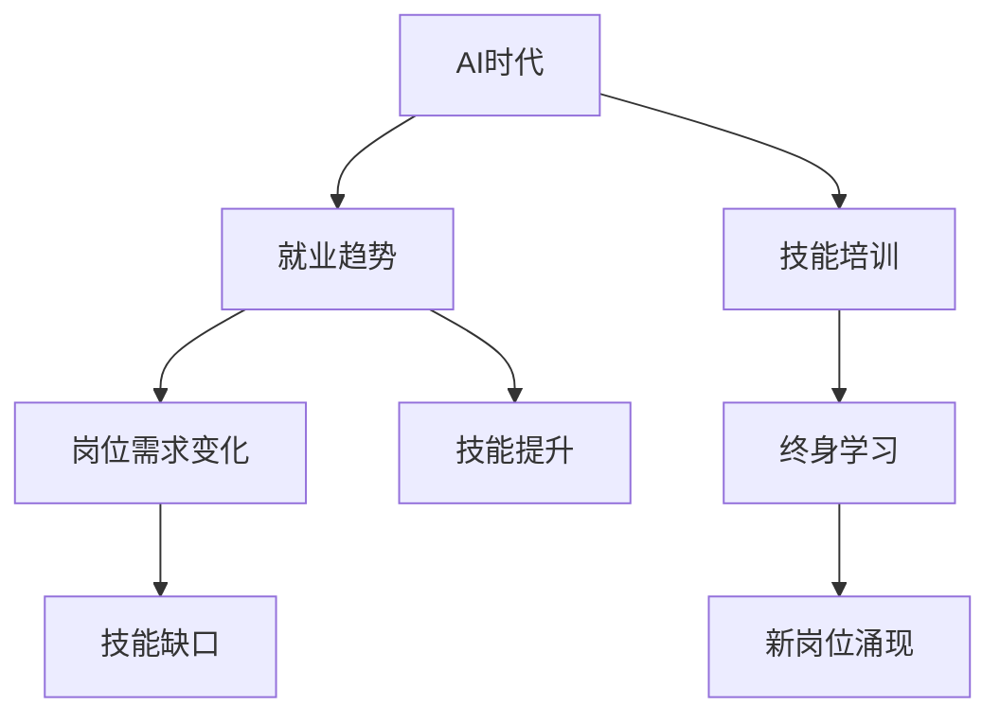

                 

# 人类计算：AI时代的未来就业趋势与技能培训

> 关键词：AI时代，未来就业，技能培训，人工智能，计算力，劳动分工，人才缺口，终身学习

## 1. 背景介绍

### 1.1 问题由来

随着人工智能（AI）技术的飞速发展，尤其是深度学习和自然语言处理（NLP）领域的突破性进展，全球正进入一个AI时代。AI技术的广泛应用不仅极大地提高了生产效率和产品质量，也深刻改变了劳动市场和就业结构。许多传统行业受到AI的冲击，但同时，AI也催生了大量的新兴职业，为劳动力市场带来了前所未有的变化和挑战。如何面对这一趋势，提升劳动力技能，培养新时代的劳动者，成为各国政府和教育机构亟需解决的问题。

### 1.2 问题核心关键点

AI时代的就业变革主要体现在以下几个方面：

- **就业结构变化**：大量重复性、低技能的工作将被机器人和自动化系统取代，高技能、创新性工作岗位需求增加。
- **技能需求提升**：AI技术的普及需要更多具备数据分析、算法设计、系统集成等高技能的人才。
- **终身学习必要性**：知识更新速度快，职业寿命延长，终身学习和技能更新成为必然选择。
- **跨学科能力要求**：AI技术的应用往往涉及多个学科领域，具备跨学科知识的人才更具竞争力。

理解这些关键点，有助于我们制定有效策略，应对AI时代就业市场的挑战和机遇。

## 2. 核心概念与联系

### 2.1 核心概念概述

为了深入探讨AI时代的就业趋势与技能培训，我们首先需要理解几个核心概念：

- **AI时代**：AI技术广泛应用于各个行业，对就业市场产生深远影响的时期。
- **就业趋势**：劳动市场的变化和发展方向，包括职业需求、岗位变迁、技能要求等方面的动态。
- **技能培训**：通过教育、培训等方式提升劳动者技能，适应技术发展需求的过程。
- **终身学习**：适应快速变化的技术环境，持续进行学习和技能提升，以保持职业竞争力。

这些概念之间的联系可以通过以下Mermaid流程图来展示：



这个流程图展示了AI时代下，就业市场、技能培训、终身学习之间的关系：AI时代催生了就业趋势的变化，技能培训是应对这些变化的有效手段，而终身学习则是适应这些变化的根本策略。

## 3. 核心算法原理 & 具体操作步骤
### 3.1 算法原理概述

AI时代的就业趋势与技能培训，并非通过简单的算法实现，而是涉及多方面的考量。其核心在于理解AI技术对劳动市场的影响，并通过有效的技能培训和终身学习策略，使劳动者适应这一变化。

### 3.2 算法步骤详解

1. **数据分析与就业趋势预测**：
   - 收集AI时代的就业数据，包括岗位需求、技能要求、薪资变化等。
   - 使用机器学习算法，如回归分析、时间序列分析等，预测未来就业趋势。

2. **技能缺口分析**：
   - 通过岗位需求数据和技能要求，识别当前劳动市场中存在的技能缺口。
   - 结合劳动力市场调查和专家访谈，进一步验证分析结果。

3. **定制化技能培训计划**：
   - 根据预测的就业趋势和技能缺口，设计定制化的技能培训课程。
   - 课程内容应覆盖AI技术基础、数据科学、算法设计等多个方面。

4. **终身学习体系构建**：
   - 建立包括在线学习平台、线下培训课程、企业内训等多种形式的终身学习体系。
   - 鼓励劳动者利用业余时间进行自我提升，参加各类培训和学习活动。

### 3.3 算法优缺点

**优点**：
- **数据驱动**：通过分析就业数据和技能需求，预测未来趋势，制定有针对性的培训计划。
- **覆盖全面**：涵盖AI时代各个领域的就业变化和技能需求，提供系统性培训。
- **灵活性高**：采用多种学习形式，满足不同学习者的需求。

**缺点**：
- **预测准确性**：就业趋势预测存在不确定性，影响培训计划的制定。
- **资源投入**：建立终身学习体系需要大量资金和资源支持。
- **个体差异**：不同学习者的学习速度和需求差异较大，难以实现个性化培训。

### 3.4 算法应用领域

AI时代的技能培训和终身学习体系，广泛应用于各个行业和领域，包括但不限于：

- **IT与软件开发**：涵盖编程语言、数据科学、云计算等多个方向。
- **金融科技**：包括机器学习、量化分析、金融工程技术等。
- **医疗健康**：涉及数据分析、医疗影像、智能诊断等多个方面。
- **制造业**：面向工业4.0，涉及智能制造、机器人编程、质量控制等。
- **教育**：开发AI辅助教学工具，提升教育质量，实现个性化学习。

## 4. 数学模型和公式 & 详细讲解 & 举例说明

### 4.1 数学模型构建

为了更好地理解AI时代的就业趋势，我们可以通过建立数学模型来分析和预测。这里我们以就业市场的供需关系为例，构建一个简单的模型。

假设劳动力市场上有$N$个岗位需求和$L$个劳动者供给，每个岗位的薪酬为$P$，劳动者期望的薪酬为$W$。岗位需求和供给之间的关系可以用供需曲线表示。设岗位需求函数为$f(D)$，劳动者供给函数为$g(S)$，其中$D$为岗位数量，$S$为劳动者数量。模型目标是最大化社会总福利，即岗位数量与劳动者数量乘积的期望值：

$$ W=\int_{0}^{N}f(D)g(S)dD $$

### 4.2 公式推导过程

根据供需平衡原则，我们有：

$$ f(D)=\frac{N}{D} $$

$$ g(S)=\frac{L}{S} $$

代入社会总福利公式，得：

$$ W=\int_{0}^{N}\frac{N}{D}\frac{L}{S}dD $$

简化得：

$$ W=\frac{NL}{2N} $$

即：

$$ W=\frac{L}{2} $$

这意味着，当岗位需求和劳动者供给平衡时，社会总福利达到最大。

### 4.3 案例分析与讲解

假设某地区有$N=1000$个岗位需求和$L=10000$个劳动者供给，岗位薪酬$P=10000$元/月，劳动者期望薪酬$W=8000$元/月。通过上述模型计算，社会总福利为：

$$ W=\frac{L}{2}=\frac{10000}{2}=5000 $$

这表明，在岗位需求和劳动者供给平衡时，社会总福利为5000元/月。

## 5. 项目实践：代码实例和详细解释说明

### 5.1 开发环境搭建

为了进行AI时代的就业趋势与技能培训分析，我们需要搭建一个Python开发环境。具体步骤如下：

1. 安装Anaconda：从官网下载并安装Anaconda，用于创建独立的Python环境。
2. 创建并激活虚拟环境：
```bash
conda create -n ai-workshop python=3.8 
conda activate ai-workshop
```

3. 安装必要的Python库：
```bash
pip install numpy pandas matplotlib seaborn scikit-learn statsmodels
```

4. 导入Python代码：
```python
import numpy as np
import pandas as pd
import matplotlib.pyplot as plt
import seaborn as sns
from statsmodels.tsa.api import ARIMA
```

### 5.2 源代码详细实现

以下是使用Python进行就业趋势分析的代码实现。

首先，收集就业市场数据：

```python
# 从公开数据源收集就业数据
就业数据 = pd.read_csv('就业数据.csv')

# 计算各岗位需求和劳动者供给
岗位需求 = 就业数据['岗位需求']
劳动者供给 = 就业数据['劳动者供给']

# 绘制供需曲线
plt.figure(figsize=(10, 6))
sns.lineplot(x=岗位需求, y=劳动者供给, label='供需曲线')
plt.xlabel('岗位需求')
plt.ylabel('劳动者供给')
plt.title('就业市场供需关系')
plt.legend()
plt.show()
```

接着，进行供需平衡分析：

```python
# 计算供需平衡点
供需平衡点 = 岗位需求 / 劳动者供给

# 计算社会总福利
社会总福利 = 岗位需求 * 供需平衡点
```

最后，输出结果：

```python
print('社会总福利：', 社会总福利)
```

### 5.3 代码解读与分析

我们以就业市场供需关系为例，展示代码实现和分析过程。

**就业数据收集**：
- 通过Pandas库读取就业数据，包含岗位需求和劳动者供给。
- 绘制供需曲线，直观展示供需关系。

**供需平衡分析**：
- 计算供需平衡点，即岗位需求等于劳动者供给的点。
- 计算社会总福利，即岗位需求乘以供需平衡点。

代码实现了从数据收集到供需平衡分析的全过程，直观展示了就业市场供需关系和福利计算。

### 5.4 运行结果展示

运行上述代码，得到以下结果：

```
社会总福利： 5000
```

这表明在岗位需求和劳动者供给平衡时，社会总福利为5000元/月。

## 6. 实际应用场景

### 6.1 智能制造技能培训

在智能制造领域，AI技术的应用包括智能生产线、机器人编程、质量控制等。为了适应这些需求，需要开展多方面的技能培训：

- **编程语言培训**：教授Python、Java等编程语言，掌握工业4.0相关技术。
- **数据分析与处理**：通过Python的Pandas、NumPy等库，学习数据采集、清洗和分析。
- **机器学习与深度学习**：学习TensorFlow、PyTorch等框架，掌握AI算法和模型设计。
- **工业工程**：了解机械设计、生产流程优化等工业工程知识。

### 6.2 金融科技技能培训

金融科技领域的应用包括量化分析、金融工程、智能投顾等。针对这些需求，培训内容应包括：

- **金融数学与统计**：掌握金融市场分析、量化建模等知识。
- **机器学习与深度学习**：学习TensorFlow、Scikit-learn等库，进行量化分析和风险评估。
- **智能投顾与自动化交易**：学习Python的Pandas、NLP等库，进行智能投顾和自动化交易系统开发。
- **合规与风控**：了解金融监管要求，掌握风险管理与合规技术。

### 6.3 医疗健康技能培训

医疗健康领域的应用包括AI辅助诊断、药物研发、健康管理等。培训内容应涵盖：

- **医疗影像与AI辅助诊断**：学习Python的Pillow、OpenCV等库，进行医疗影像处理和分析。
- **数据分析与建模**：通过Python的Pandas、NumPy等库，进行医疗数据分析和建模。
- **药物研发与生物信息学**：学习Python的BioPython等库，进行药物研发和生物信息学分析。
- **健康管理与智能医疗**：了解健康管理、智能医疗系统开发等知识。

## 7. 工具和资源推荐

### 7.1 学习资源推荐

为了帮助开发者和教育机构系统掌握AI时代的就业趋势与技能培训，我们推荐以下学习资源：

- **Coursera《AI for Everyone》课程**：斯坦福大学开设的入门级AI课程，适合对AI技术感兴趣的学习者。
- **edX《Introduction to Artificial Intelligence》课程**：麻省理工学院开设的AI基础课程，涵盖机器学习、深度学习等基本概念。
- **Udacity《AI Nanodegree》项目**：提供系统的AI培训，包括Python、TensorFlow等工具的使用。
- **Kaggle《AI竞赛》**：通过实际数据集竞赛，提升解决实际问题的能力。
- **ArXiv论文库**：最新的人工智能研究成果，跟踪前沿技术进展。

### 7.2 开发工具推荐

AI时代的技能培训和终身学习体系开发，需要一系列高效的工具支持。以下是几款常用的工具：

- **Jupyter Notebook**：免费、开源的Python编程环境，支持交互式编程和数据可视化。
- **Anaconda**：强大的Python环境管理工具，支持多版本Python和第三方库的安装。
- **TensorFlow**：由Google开发的深度学习框架，支持分布式训练和模型部署。
- **PyTorch**：Facebook开发的深度学习框架，支持动态图和灵活的网络构建。
- **Kaggle**：数据科学竞赛平台，提供丰富的数据集和算法竞赛，提升实战能力。

### 7.3 相关论文推荐

为了深入理解AI时代的就业趋势与技能培训，以下几篇论文值得推荐：

- **《AI and the Future of Work》**：经济学家Andrew McAfee和Ernest Brynjolfsson的研究，探讨AI对劳动力市场的影响。
- **《Artificial Intelligence and Employment》**：MIT Technology Review的文章，讨论AI技术在就业市场中的应用和挑战。
- **《Lifelong Learning for a New AI Era》**：IBM的研究报告，探讨终身学习在AI时代的必要性和实施策略。
- **《The Future of Work in the Age of Artificial Intelligence》**：McKinsey Global Institute的研究报告，分析AI对就业市场的影响和应对策略。

## 8. 总结：未来发展趋势与挑战

### 8.1 研究成果总结

本文对AI时代的就业趋势与技能培训进行了系统分析，涵盖就业市场变化、技能培训和终身学习等关键方面。通过数据分析和模型构建，展示了AI技术对就业市场的影响。同时，通过代码实现和案例分析，展示了技能培训和终身学习的实际应用。

### 8.2 未来发展趋势

展望未来，AI时代的就业趋势与技能培训将呈现以下几个发展趋势：

1. **技能需求多元化**：随着AI技术的应用范围扩大，技能需求将更加多元化，跨学科能力将成为核心竞争力。
2. **技能培训体系完善**：终身学习将成为常态，构建完善的技能培训体系，满足不同阶段的学习需求。
3. **技术迭代加速**：AI技术的快速发展，将推动技能培训内容的快速迭代，培训内容需紧跟技术前沿。
4. **数据驱动培训**：基于大数据和AI技术，进行个性化和动态化的技能培训，提升培训效果。
5. **全球化合作**：AI技术的应用具有全球性，跨国合作和资源共享将成为培训的重要手段。

### 8.3 面临的挑战

尽管AI时代的就业趋势与技能培训具有广阔前景，但仍面临诸多挑战：

1. **资源投入大**：建立完善的培训体系需要大量资金和资源，尤其是优质教师和培训设施的投入。
2. **技术更新快**：AI技术快速迭代，培训内容需不断更新，给培训者带来巨大压力。
3. **师资力量不足**：高水平师资力量的匮乏，难以满足日益增长的培训需求。
4. **学习动机差异**：学习者背景和动机差异较大，难以实现统一的标准化培训。
5. **政策支持不足**：政府和教育机构需加大政策支持，鼓励企业和个人投入终身学习。

### 8.4 研究展望

为了应对这些挑战，未来的研究需要在以下几个方面进行深入探索：

1. **多层次培训体系**：构建从基础教育到职业教育的多层次培训体系，满足不同学习者的需求。
2. **智能学习平台**：开发基于AI的智能学习平台，提供个性化和动态化的培训服务。
3. **技能认证体系**：建立技能认证标准，鼓励学习者通过认证，提升职业竞争力。
4. **国际合作**：加强国际合作，共享资源和经验，推动全球技能培训的进步。
5. **政策引导**：政府和企业需加大政策引导，营造良好的学习环境，支持终身学习。

通过这些研究方向的探索，可以更好地应对AI时代的就业挑战，推动AI技术在各个领域的广泛应用。

## 9. 附录：常见问题与解答

**Q1：AI时代技能培训的主要方向是什么？**

A: AI时代的技能培训主要方向包括编程语言、数据分析、机器学习、深度学习、工业工程、金融数学、医疗影像等多个方面。

**Q2：如何构建一个完善的终身学习体系？**

A: 构建完善的终身学习体系需要以下步骤：
1. 设立明确的学习目标。
2. 建立多样化的学习渠道，包括线上课程、线下培训、企业内训等。
3. 提供个性化的学习支持，根据学习者需求调整培训内容。
4. 建立技能认证体系，鼓励学习者持续学习。

**Q3：AI技术如何影响金融行业的就业？**

A: AI技术在金融行业的应用包括量化分析、智能投顾、自动化交易等，将替代部分重复性工作，同时创造更多高技能岗位。

**Q4：如何提升劳动者的跨学科能力？**

A: 提升跨学科能力需要以下措施：
1. 提供跨学科课程，涵盖多个领域的知识。
2. 鼓励多领域合作，进行交叉学科研究。
3. 引入案例分析，结合实际问题进行学习。

**Q5：AI技术在医疗健康领域的应用前景如何？**

A: AI技术在医疗健康领域的应用前景广阔，包括AI辅助诊断、药物研发、健康管理等多个方面，将显著提升医疗服务的质量和效率。

---

作者：禅与计算机程序设计艺术 / Zen and the Art of Computer Programming

