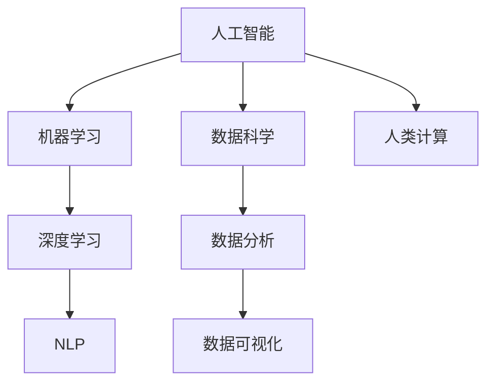

                 

## 1. 背景介绍

在人工智能（AI）时代，技术进步的速率远远超越了人类的适应能力。人类计算，作为AI时代的重要基础技能，正在面临前所未有的挑战和变革。无论是编程、数据分析、机器学习还是自然语言处理，都需要重新审视和更新其核心技能。本文将深入探讨AI时代下，人类计算所面临的变革需求及其未来发展趋势。

### 1.1 问题由来

人工智能技术的快速发展，正在逐渐替代人类的某些重复性、低价值工作，导致就业市场出现了结构性变化。技术进步不仅在提高生产效率的同时，也要求劳动者具备更高层次的技能和知识。人类计算作为人类处理和利用信息的基本能力，正处于一个重要的转折点。

### 1.2 问题核心关键点

AI时代下，人类计算的需求和技能培训面临以下几个核心问题：

- **技能更新迭代**：随着技术的更新，原有的技能和知识迅速过时，要求从业者不断更新知识和技能。
- **跨学科融合**：AI技术的应用跨越了多个学科领域，从业者需要具备跨学科知识，以适应多变的工作环境。
- **数据驱动决策**：AI时代的数据量爆炸式增长，数据分析和数据驱动决策成为核心技能。
- **创新与创造力**：AI技术的迭代加速了创新的速度，从业者需要具备更高的创新能力和创造力。
- **终身学习**：AI技术的快速更新，要求从业者具备终身学习的能力，不断提升自我。

## 2. 核心概念与联系

### 2.1 核心概念概述

为更好地理解AI时代下人类计算的需求，本节将介绍几个密切相关的核心概念：

- **人工智能（AI）**：利用算法和数据处理技术，模拟人类智能的机器系统。AI技术包括机器学习、深度学习、自然语言处理等。
- **机器学习（ML）**：通过数据驱动，使机器能够从经验中学习，提高其处理数据的能力。
- **深度学习（DL）**：一种基于神经网络的机器学习方法，能够自动学习数据中的抽象特征。
- **自然语言处理（NLP）**：使计算机能够理解和处理自然语言的技术。
- **人类计算**：人类处理和利用信息的能力，包括数据处理、逻辑推理、问题解决等。
- **数据科学**：涉及数据获取、处理、分析和可视化的综合性学科。

这些核心概念之间的逻辑关系可以通过以下Mermaid流程图来展示：



这个流程图展示了一系列与AI相关的核心概念及其之间的联系：

1. 人工智能涵盖机器学习和深度学习，利用这些技术处理自然语言数据。
2. 数据科学为人工智能提供数据支持和分析工具，是实现AI技术的基础。
3. 人类计算是AI时代下劳动者需要具备的核心能力，涉及数据处理、逻辑推理和问题解决等多个方面。
4. 数据分析和数据可视化是数据科学的核心，是理解数据、提取信息的基础。

## 3. 核心算法原理 & 具体操作步骤
### 3.1 算法原理概述

在AI时代，人类计算的根本任务是理解和应用AI技术，使其服务于人类社会的各个方面。AI时代下，人类计算的算法原理可以概括为以下几个方面：

- **数据驱动决策**：基于数据分析和机器学习模型，对数据进行推理和预测。
- **问题解决与创造力**：利用AI技术辅助解决问题，并在复杂环境中进行创新。
- **终身学习与自我更新**：不断学习新的知识和技术，适应AI技术的快速迭代。

### 3.2 算法步骤详解

以下是AI时代下人类计算的核心算法步骤：

1. **数据获取与处理**：收集数据，进行预处理、清洗和特征工程，准备数据输入模型。
2. **模型训练与优化**：选择适当的算法和模型，训练模型，通过调整超参数和正则化技术优化模型性能。
3. **数据分析与可视**：利用数据分析工具和可视化技术，从数据中提取有价值的信息。
4. **问题解决与创新**：结合数据分析结果，进行问题解决和创新，提出可行的方案。
5. **持续学习与更新**：不断学习新知识和技术，更新自身能力，以适应AI技术的快速变化。

### 3.3 算法优缺点

AI时代下人类计算的算法具有以下优点：

- **高效性与准确性**：AI技术能够处理大量数据，快速准确地进行推理和预测。
- **泛化能力**：AI技术可以应用于多种任务，具备较强的泛化能力。
- **创新潜力**：AI技术能够提供新的方法和视角，激发创新和创造力。

但同时，这些算法也存在以下缺点：

- **依赖数据与质量**：AI技术的效果依赖于数据的质量和数量，高质量数据获取成本较高。
- **模型复杂性**：复杂的模型需要大量的计算资源和时间进行训练和优化。
- **伦理与隐私问题**：AI技术可能带来隐私泄露、算法偏见等伦理问题。

### 3.4 算法应用领域

AI时代下，人类计算的应用领域广泛，包括但不限于：

- **金融科技（FinTech）**：利用AI技术进行风险管理、客户分析、自动化交易等。
- **医疗健康**：通过数据分析和机器学习模型，辅助诊断、治疗和个性化医疗。
- **智能制造**：利用AI技术优化生产流程、质量控制和供应链管理。
- **教育科技（EdTech）**：通过AI技术提供个性化学习方案、智能评估和反馈系统。
- **自动驾驶**：利用AI技术实现车辆自主导航和环境感知。
- **智慧城市**：利用AI技术进行交通管理、环境监测和社会治理。

## 4. 数学模型和公式 & 详细讲解 & 举例说明

### 4.1 数学模型构建

在AI时代，人类计算的数学模型构建主要基于数据科学和机器学习理论。以线性回归模型为例，假设有一个自变量 $X$ 和一个因变量 $Y$，线性回归模型的目标是找到一个线性关系 $Y = \alpha + \beta X + \epsilon$，其中 $\alpha$ 和 $\beta$ 为模型参数，$\epsilon$ 为误差项。

### 4.2 公式推导过程

根据最小二乘法，线性回归模型的目标是最小化误差项 $\epsilon$ 的平方和，即：

$$
\min_{\alpha, \beta} \sum_{i=1}^n (Y_i - \alpha - \beta X_i)^2
$$

通过求导和矩阵运算，可以得到参数 $\alpha$ 和 $\beta$ 的求解公式为：

$$
\alpha = \bar{Y} - \beta \bar{X}
$$
$$
\beta = \frac{\sum_{i=1}^n (X_i - \bar{X})(Y_i - \bar{Y})}{\sum_{i=1}^n (X_i - \bar{X})^2}
$$

其中 $\bar{X}$ 和 $\bar{Y}$ 分别为自变量和因变量的均值。

### 4.3 案例分析与讲解

以房价预测为例，假设有一个包含多个特征（如面积、位置等）的数据集，目标是对新房的房价进行预测。可以首先进行特征工程，将数据标准化，然后使用线性回归模型进行训练，得到预测结果。具体的计算步骤如下：

1. 收集房价数据，包含房屋面积、地理位置、交通状况等特征。
2. 对数据进行预处理，包括缺失值填充、特征编码等。
3. 使用标准化方法将数据转换为标准正态分布。
4. 训练线性回归模型，得到参数 $\alpha$ 和 $\beta$。
5. 使用模型对新房的面积、位置等特征进行预测，得到房价。

## 5. 项目实践：代码实例和详细解释说明

### 5.1 开发环境搭建

在进行AI时代下的人类计算项目实践前，需要先准备好开发环境。以下是使用Python进行Scikit-Learn库开发的环境配置流程：

1. 安装Anaconda：从官网下载并安装Anaconda，用于创建独立的Python环境。

2. 创建并激活虚拟环境：
```bash
conda create -n my_env python=3.7 
conda activate my_env
```

3. 安装Scikit-Learn：
```bash
pip install scikit-learn
```

4. 安装其他工具包：
```bash
pip install numpy pandas matplotlib seaborn jupyter notebook
```

完成上述步骤后，即可在`my_env`环境中开始项目实践。

### 5.2 源代码详细实现

下面以房价预测项目为例，给出使用Scikit-Learn库对线性回归模型进行训练的Python代码实现。

```python
import numpy as np
import pandas as pd
from sklearn.model_selection import train_test_split
from sklearn.linear_model import LinearRegression
from sklearn.metrics import mean_squared_error

# 加载数据
data = pd.read_csv('house_prices.csv')

# 数据预处理
X = data[['area', 'location', 'traffic']]
y = data['price']

# 特征缩放
from sklearn.preprocessing import StandardScaler
scaler = StandardScaler()
X_scaled = scaler.fit_transform(X)

# 分割数据集
X_train, X_test, y_train, y_test = train_test_split(X_scaled, y, test_size=0.2, random_state=42)

# 训练模型
model = LinearRegression()
model.fit(X_train, y_train)

# 预测并评估
y_pred = model.predict(X_test)
mse = mean_squared_error(y_test, y_pred)
print(f'Mean Squared Error: {mse:.2f}')
```

### 5.3 代码解读与分析

让我们再详细解读一下关键代码的实现细节：

**数据加载与预处理**：
- 使用Pandas库加载数据集，并进行特征选择。
- 对数据进行标准化，消除特征量级差异。
- 使用train_test_split方法将数据集分为训练集和测试集。

**模型训练与评估**：
- 使用LinearRegression类创建线性回归模型。
- 通过fit方法训练模型，使用训练集进行拟合。
- 使用predict方法对测试集进行预测。
- 使用mean_squared_error计算预测误差。

可以看到，Scikit-Learn库使得机器学习模型的构建和评估变得简洁高效。开发者可以将更多精力放在数据处理和模型改进等高层逻辑上，而不必过多关注底层的实现细节。

## 6. 实际应用场景

### 6.1 智能制造

在智能制造领域，AI技术被广泛应用于生产流程优化、质量控制和供应链管理。通过数据分析和机器学习模型，企业可以实现对生产设备的实时监控和预测维护，减少停机时间和生产成本。

具体而言，可以利用传感器数据进行实时监测，通过机器学习模型预测设备故障，提前进行维护。同时，利用数据分析优化生产流程，提高生产效率。智能制造的应用不仅提高了生产效率，还提升了产品品质和供应链响应速度。

### 6.2 医疗健康

在医疗健康领域，AI技术被用于疾病预测、诊断和治疗方案推荐。通过分析大量的电子病历、基因数据和影像数据，AI模型能够识别疾病早期信号，提供精准的诊断和治疗建议。

具体而言，可以利用AI技术分析患者的基因数据，预测患病风险，并根据病情推荐个性化的治疗方案。同时，利用影像数据进行病灶检测和诊断，提高诊断准确率。AI技术的应用不仅提高了医疗效率，还提升了患者的治疗效果和满意度。

### 6.3 智慧城市

在智慧城市建设中，AI技术被广泛应用于交通管理、环境监测和社会治理。通过数据分析和机器学习模型，城市管理部门可以实现对城市运行状态的实时监控和预测，提升城市管理效率和居民生活质量。

具体而言，可以利用AI技术分析交通数据，优化交通流量，减少交通拥堵。同时，利用数据分析进行环境监测，预测污染趋势，制定环境保护措施。智慧城市的应用不仅提高了城市管理效率，还提升了居民的生活质量。

### 6.4 未来应用展望

随着AI技术的不断进步，未来AI时代下的人类计算将呈现以下几个发展趋势：

1. **跨学科融合**：AI技术与更多学科的融合将进一步推动技术创新和社会进步。跨学科的人才将更具竞争力。
2. **数据驱动决策**：大数据分析和机器学习将更加普及，数据驱动的决策将成为主流。
3. **终身学习**：AI技术的快速迭代要求从业者具备终身学习的能力，不断更新知识和技能。
4. **伦理与隐私保护**：AI技术的发展将带来伦理和隐私保护的新挑战，从业者需要具备伦理意识和隐私保护能力。
5. **创新与创造力**：AI技术将激发更多的创新和创造力，从业者需要具备更强的创新能力和创造力。
6. **多模态融合**：AI技术将与更多模态的数据进行融合，推动多模态计算的发展。

## 7. 工具和资源推荐

### 7.1 学习资源推荐

为了帮助开发者系统掌握AI时代下人类计算的理论基础和实践技巧，这里推荐一些优质的学习资源：

1. **《机器学习》（周志华著）**：全面介绍了机器学习的基本概念和算法，适合入门学习。
2. **《深度学习》（Ian Goodfellow等著）**：深入介绍了深度学习的基本原理和算法，适合进阶学习。
3. **Coursera的《机器学习》课程**：由斯坦福大学教授Andrew Ng主讲，覆盖了机器学习的基本概念和算法。
4. **Kaggle**：数据科学竞赛平台，提供大量数据集和模型训练样例，适合实践学习。
5. **GitHub**：代码托管平台，可以找到大量的开源机器学习项目和样例代码。

通过对这些资源的学习实践，相信你一定能够快速掌握AI时代下人类计算的精髓，并用于解决实际的AI问题。

### 7.2 开发工具推荐

高效的开发离不开优秀的工具支持。以下是几款用于AI项目开发的常用工具：

1. **Jupyter Notebook**：交互式编程环境，支持代码编写、数据可视化、文档记录等，适合数据科学和机器学习开发。
2. **TensorFlow**：由Google主导开发的深度学习框架，支持大规模分布式训练和模型部署。
3. **PyTorch**：由Facebook主导开发的深度学习框架，支持动态计算图和模型训练。
4. **Scikit-Learn**：基于NumPy和SciPy库的数据科学工具，提供了多种机器学习算法的实现。
5. **Keras**：高层神经网络API，简化了深度学习模型的构建和训练过程。

合理利用这些工具，可以显著提升AI项目开发的效率，加快创新迭代的步伐。

### 7.3 相关论文推荐

AI时代下人类计算的研究源于学界的持续研究。以下是几篇奠基性的相关论文，推荐阅读：

1. **《深度学习》（Ian Goodfellow等著）**：介绍了深度学习的基本原理和算法，是深度学习领域的经典之作。
2. **《自然语言处理综论》（Daniel Jurafsky等著）**：全面介绍了自然语言处理的基本概念和算法，是NLP领域的经典之作。
3. **《机器学习：原理、算法和结构》（Tom Mitchell著）**：介绍了机器学习的基本概念和算法，是机器学习领域的经典之作。
4. **《算法导论》（Thomas H. Cormen等著）**：介绍了计算机科学的经典算法和数据结构，适合深入学习。

这些论文代表了大规模机器学习技术的发展脉络。通过学习这些前沿成果，可以帮助研究者把握学科前进方向，激发更多的创新灵感。

## 8. 总结：未来发展趋势与挑战

### 8.1 总结

本文对AI时代下人类计算的需求进行了全面系统的介绍。首先阐述了AI时代下人类计算的需求和变革，明确了AI技术对人类计算能力的重塑。其次，从原理到实践，详细讲解了AI时代下人类计算的数学模型和算法步骤，给出了AI项目开发的完整代码实例。同时，本文还广泛探讨了AI时代下人类计算在智能制造、医疗健康、智慧城市等多个领域的应用前景，展示了AI技术的巨大潜力。此外，本文精选了AI时代下人类计算的学习资源、开发工具和相关论文，力求为读者提供全方位的技术指引。

通过本文的系统梳理，可以看到，AI时代下人类计算的需求和技能培训面临诸多变革，AI技术的应用正在深刻改变人类社会的各个方面。从业者需要不断更新知识和技能，以适应AI技术的快速迭代，推动社会进步。

### 8.2 未来发展趋势

展望未来，AI时代下人类计算将呈现以下几个发展趋势：

1. **跨学科融合**：AI技术与更多学科的融合将进一步推动技术创新和社会进步。跨学科的人才将更具竞争力。
2. **数据驱动决策**：大数据分析和机器学习将更加普及，数据驱动的决策将成为主流。
3. **终身学习**：AI技术的快速迭代要求从业者具备终身学习的能力，不断更新知识和技能。
4. **伦理与隐私保护**：AI技术的发展将带来伦理和隐私保护的新挑战，从业者需要具备伦理意识和隐私保护能力。
5. **创新与创造力**：AI技术将激发更多的创新和创造力，从业者需要具备更强的创新能力和创造力。
6. **多模态融合**：AI技术将与更多模态的数据进行融合，推动多模态计算的发展。

## 8.3 面临的挑战

尽管AI时代下人类计算正在蓬勃发展，但在迈向更加智能化、普适化应用的过程中，它仍面临着诸多挑战：

1. **数据获取与质量**：AI技术的效果依赖于数据的质量和数量，高质量数据获取成本较高。
2. **模型复杂性**：复杂的模型需要大量的计算资源和时间进行训练和优化。
3. **伦理与隐私问题**：AI技术可能带来隐私泄露、算法偏见等伦理问题。
4. **资源与效率**：AI技术的快速迭代需要大量的计算资源和存储空间，带来了资源和效率问题。
5. **跨学科融合难度**：AI技术与不同学科的融合需要专业知识和技术支持，难度较大。
6. **人才培养**：具备跨学科知识和高技能的AI从业者仍然稀缺，需要更多的教育资源和培训支持。

正视AI时代下人类计算面临的这些挑战，积极应对并寻求突破，将是大规模机器学习技术走向成熟的必由之路。相信随着学界和产业界的共同努力，这些挑战终将一一被克服，AI时代下的人类计算必将在构建智能社会中扮演越来越重要的角色。

### 8.4 研究展望

未来在AI时代下人类计算的研究方向可以从以下几个方面寻求新的突破：

1. **跨学科融合**：进一步推动AI技术与更多学科的融合，提升技术的创新和社会价值。
2. **数据驱动决策**：研究数据驱动决策的理论和算法，提升决策的科学性和准确性。
3. **伦理与隐私保护**：研究AI技术的伦理和隐私保护问题，制定相关规范和标准。
4. **模型压缩与优化**：研究模型压缩和优化技术，提升模型的计算效率和资源利用率。
5. **跨学科人才培养**：加强跨学科人才培养，提升从业者的综合素质和创新能力。

这些研究方向将推动AI时代下人类计算技术的不断发展，为构建智能社会提供坚实的技术基础和人才保障。

## 9. 附录：常见问题与解答

**Q1: AI时代下人类计算是否会取代人类的工作？**

A: AI技术将取代一些重复性、低价值的工作，但也会创造出更多的高级别、创新型岗位。AI技术更多地是辅助人类进行决策和问题解决，提升工作效率和质量。

**Q2: AI时代下人类计算的技能培训如何展开？**

A: AI时代下人类计算的技能培训应注重跨学科知识、数据科学和机器学习算法。可以通过在线课程、工作坊、竞赛等多种方式进行。

**Q3: AI时代下人类计算的伦理问题如何解决？**

A: 解决AI伦理问题需要从算法设计、数据获取和模型训练等多个环节进行规范和监管，建立透明的决策过程和可解释性机制。

**Q4: AI时代下人类计算的未来发展方向是什么？**

A: AI时代下人类计算的未来发展方向是跨学科融合、数据驱动决策、终身学习、伦理与隐私保护、创新与创造力、多模态融合等，将推动技术创新和社会进步。

---

作者：禅与计算机程序设计艺术 / Zen and the Art of Computer Programming

