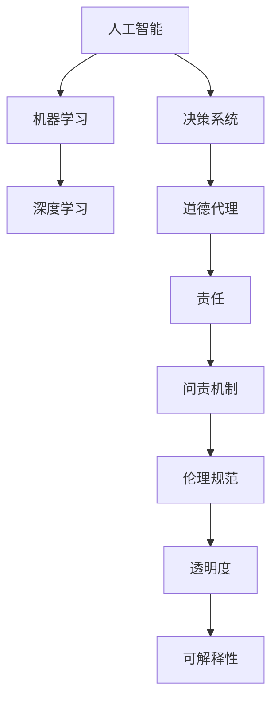

                 

# 人类计算：AI时代的道德代理和责任

> 关键词：人工智能,人类计算,道德代理,责任,伦理,机器学习,深度学习,决策系统

## 1. 背景介绍

### 1.1 问题由来

随着人工智能技术的迅速发展，尤其是深度学习和机器学习的进步，人类社会正在经历前所未有的变革。AI正在逐渐渗透到各个领域，从金融、医疗、教育到交通、能源、安全等，AI技术的力量无处不在。然而，这种技术的进步也带来了新的挑战，尤其是伦理和责任问题。

AI系统作为一种工具，其决策过程、数据处理和行为模式往往超越了人类的理解范畴。当AI系统用于影响人类社会的重大决策时，如何确保其行为的公正性、透明性和可解释性，成为全球范围内亟待解决的问题。

### 1.2 问题核心关键点

当前，AI系统的决策过程通常依赖于大规模数据集进行训练，而这些数据往往包含各种偏见和错误。例如，面部识别系统可能对某些族裔的人识别效果较差，贷款审批系统可能对女性或少数族裔的申请者更严苛。这些问题不仅影响AI系统的公平性，还可能引发严重的社会不公。

此外，AI系统的决策过程通常缺乏透明度，难以解释其推理过程。这使得在关键决策时，无法对其进行有效监督，容易引发不可预见的风险。例如，自动驾驶汽车在面对复杂交通情况时，其决策过程可能涉及多方面因素，包括传感器数据、历史行驶数据和预测模型，难以简单解释其决策依据。

### 1.3 问题研究意义

研究AI系统的道德代理和责任，对于保障AI技术的健康发展，促进社会公平正义，具有重要意义：

1. **提升AI系统的可信度**：确保AI系统的决策过程透明、可解释，增加公众对其的信任度。
2. **防止偏见和歧视**：通过公平、无偏见的训练数据和算法，减少AI系统对特定群体的歧视。
3. **促进社会公平**：确保AI系统在决策过程中不偏袒任何一方，保护弱势群体的权益。
4. **增强问责机制**：建立有效的问责机制，确保AI系统的行为可追溯、可问责。
5. **推动伦理规范**：制定和推广AI伦理规范，指导AI技术的开发和应用。

## 2. 核心概念与联系

### 2.1 核心概念概述

为了更好地理解AI系统的道德代理和责任，本节将介绍几个关键概念及其之间的联系：

- **人工智能（AI）**：通过算法和模型，使计算机具备自主解决问题的能力，包括机器学习、深度学习等技术。
- **机器学习（ML）**：一种通过数据训练模型，使其具备泛化能力的算法。
- **深度学习（DL）**：一种多层神经网络，用于处理复杂数据和模式识别。
- **决策系统**：使用AI技术进行自动决策的系统，广泛应用于金融、医疗、安全等领域。
- **道德代理（Ethical Agents）**：具备道德判断能力的AI系统，能够在决策过程中考虑伦理和社会影响。
- **责任（Accountability）**：AI系统在决策过程中应当承担的责任，包括错误判断、数据偏见、隐私泄露等。

这些概念之间的关系可以通过以下Mermaid流程图来展示：



这个流程图展示了AI技术从基础到应用的过程，以及道德代理和责任的实现路径。

## 3. 核心算法原理 & 具体操作步骤
### 3.1 算法原理概述

AI系统的道德代理和责任，主要涉及以下几个方面：

- **数据预处理**：确保训练数据的公正性和代表性，减少数据偏见。
- **算法设计**：设计公平、无偏见的算法，避免算法歧视。
- **决策过程透明**：确保AI系统的决策过程透明可解释，便于监督和问责。
- **问责机制建立**：建立有效的问责机制，确保AI系统的行为可追溯和可问责。

### 3.2 算法步骤详解

#### 数据预处理

1. **数据采集**：收集来自不同来源的数据，确保数据的多样性和代表性。
2. **数据清洗**：剔除不完整、不一致、存在偏见的数据，保证数据质量。
3. **数据标注**：对数据进行标注，确保标注的准确性和公正性。

#### 算法设计

1. **算法选择**：选择适合特定任务的算法，如分类、回归、聚类等。
2. **模型训练**：使用标注数据训练模型，调整模型参数，优化模型性能。
3. **算法优化**：通过正则化、交叉验证等方法，减少算法偏见和过拟合。

#### 决策过程透明

1. **决策记录**：记录AI系统的决策过程，包括输入数据、模型参数、推理路径等。
2. **模型解释**：使用可解释性方法，如LIME、SHAP等，解释AI系统的决策依据。
3. **透明度评估**：定期评估AI系统的透明度，确保其符合伦理标准。

#### 问责机制建立

1. **责任分配**：明确AI系统在决策过程中的责任分配，包括数据来源、算法选择、模型参数等。
2. **行为监测**：实时监测AI系统的行为，发现异常情况及时干预。
3. **问责处理**：建立问责处理流程，对AI系统的错误行为进行纠正和惩罚。

### 3.3 算法优缺点

AI系统的道德代理和责任方法具有以下优点：

1. **提高决策公正性**：通过数据预处理和算法优化，减少数据偏见和算法歧视，提升决策的公正性。
2. **增强透明度和问责性**：确保决策过程透明，便于监督和问责。
3. **促进社会公平**：通过公平算法和问责机制，保护弱势群体的权益。

同时，也存在一些缺点：

1. **数据依赖**：数据预处理和算法设计依赖高质量数据，数据获取和标注成本较高。
2. **模型复杂性**：深度学习模型复杂度高，难以解释其决策过程。
3. **技术挑战**：建立有效的问责机制和透明度评估方法，仍需解决诸多技术难题。

### 3.4 算法应用领域

AI系统的道德代理和责任方法在多个领域都有广泛应用，例如：

- **金融风控**：使用AI系统进行信用评估、风险控制等，确保决策过程透明、公正。
- **医疗诊断**：使用AI系统进行疾病诊断、治疗方案推荐等，确保其决策可解释、可问责。
- **司法判决**：使用AI系统进行案件分析、判决建议等，确保其行为符合伦理规范。
- **智能交通**：使用AI系统进行交通管理、自动驾驶等，确保其决策透明、可解释。
- **安全监控**：使用AI系统进行异常行为检测、预警等，确保其行为符合伦理标准。

这些应用场景都需要AI系统具备高度的道德代理和责任能力，以确保其决策过程公正、透明、可解释。

## 4. 数学模型和公式 & 详细讲解
### 4.1 数学模型构建

在AI系统的道德代理和责任研究中，数学模型主要用于决策过程的透明和问责机制的建立。以下是几个常见的数学模型：

- **线性回归模型**：用于预测连续型变量，如房价预测、股票价格预测等。
- **决策树模型**：用于分类和回归任务，具有可解释性强、易理解的特点。
- **神经网络模型**：用于处理复杂数据和模式识别，具有强大的泛化能力。
- **集成学习模型**：通过组合多个模型，提升预测准确性和鲁棒性。

### 4.2 公式推导过程

以线性回归模型为例，其基本公式如下：

$$ y = \beta_0 + \beta_1x_1 + \beta_2x_2 + \ldots + \beta_nx_n + \epsilon $$

其中 $y$ 为预测值，$x_i$ 为输入特征，$\beta_i$ 为模型参数，$\epsilon$ 为误差项。

通过对训练数据进行最小二乘法求解，得到模型参数：

$$ \beta = (X^TX)^{-1}X^Ty $$

其中 $X$ 为特征矩阵，$Y$ 为标注数据。

### 4.3 案例分析与讲解

**案例一：信用评分系统**

信用评分系统是一种常见的AI应用，用于评估个人或企业的信用风险。为了确保系统的道德代理和责任，可以采用以下方法：

1. **数据预处理**：确保数据的多样性和代表性，剔除存在偏见的数据。
2. **算法设计**：使用决策树或线性回归模型，避免算法歧视。
3. **决策透明**：记录输入数据、模型参数、推理路径等，确保决策过程透明。
4. **问责机制**：建立问责处理流程，对错误决策进行纠正和惩罚。

**案例二：智能诊断系统**

智能诊断系统用于辅助医疗诊断，具有较高的技术复杂度。为了确保系统的道德代理和责任，可以采用以下方法：

1. **数据预处理**：确保数据的准确性和代表性，减少数据偏见。
2. **算法设计**：使用深度学习模型，提高诊断准确性。
3. **决策透明**：使用可解释性方法，解释AI系统的决策依据。
4. **问责机制**：建立医疗伦理委员会，确保AI系统的行为符合伦理规范。

## 5. 项目实践：代码实例和详细解释说明
### 5.1 开发环境搭建

在进行道德代理和责任项目开发前，需要准备好开发环境。以下是使用Python进行Scikit-learn开发的简单环境配置流程：

1. 安装Anaconda：从官网下载并安装Anaconda，用于创建独立的Python环境。

2. 创建并激活虚拟环境：
```bash
conda create -n sklearn-env python=3.8 
conda activate sklearn-env
```

3. 安装Scikit-learn：
```bash
conda install scikit-learn
```

4. 安装NumPy、Pandas等依赖：
```bash
pip install numpy pandas matplotlib
```

完成上述步骤后，即可在`sklearn-env`环境中开始项目开发。

### 5.2 源代码详细实现

以下是使用Scikit-learn进行线性回归模型训练的简单代码实现：

```python
from sklearn.linear_model import LinearRegression
from sklearn.datasets import load_boston
from sklearn.model_selection import train_test_split
import matplotlib.pyplot as plt

# 加载波士顿房价数据集
boston = load_boston()
X = boston.data
y = boston.target

# 划分训练集和测试集
X_train, X_test, y_train, y_test = train_test_split(X, y, test_size=0.3, random_state=42)

# 建立线性回归模型
model = LinearRegression()
model.fit(X_train, y_train)

# 预测测试集
y_pred = model.predict(X_test)

# 绘制误差图
plt.scatter(y_test, y_pred)
plt.xlabel('True Prices')
plt.ylabel('Predicted Prices')
plt.title('Boston Housing Prices Prediction')
plt.show()
```

这段代码实现了使用波士顿房价数据集进行线性回归模型训练和测试的过程，并绘制了预测误差图。可以看到，Scikit-learn的线性回归模型简单易用，非常适合进行数据分析和预测。

### 5.3 代码解读与分析

让我们再详细解读一下关键代码的实现细节：

**load_boston函数**：
- 加载波士顿房价数据集，该数据集包含13个影响房价的特征和目标变量（房价）。

**train_test_split函数**：
- 将数据集划分为训练集和测试集，用于模型的训练和测试。

**LinearRegression模型**：
- 使用Scikit-learn的线性回归模型，输入特征为X，目标变量为y。

**模型训练和预测**：
- 使用训练集数据训练模型，并使用测试集数据进行预测。

**误差图绘制**：
- 使用matplotlib库绘制预测误差图，可视化模型性能。

可以看到，Scikit-learn提供了丰富的机器学习算法和工具，使得模型训练和分析变得更加高效便捷。

## 6. 实际应用场景
### 6.1 智能决策系统

智能决策系统广泛应用于金融、医疗、司法等领域，用于辅助决策。使用AI系统进行决策，可以大幅提高决策效率和准确性，但也带来了新的伦理和责任问题。

为了确保智能决策系统的道德代理和责任，可以采用以下方法：

1. **数据预处理**：确保数据的多样性和代表性，减少数据偏见。
2. **算法设计**：选择公平、无偏见的算法，设计透明的决策过程。
3. **决策透明**：记录决策过程，使用可解释性方法解释AI系统的决策依据。
4. **问责机制**：建立问责处理流程，对错误决策进行纠正和惩罚。

### 6.2 智能医疗系统

智能医疗系统用于辅助诊断和治疗，具有较高的技术复杂度。为了确保系统的道德代理和责任，可以采用以下方法：

1. **数据预处理**：确保数据的准确性和代表性，减少数据偏见。
2. **算法设计**：使用深度学习模型，提高诊断准确性。
3. **决策透明**：使用可解释性方法，解释AI系统的决策依据。
4. **问责机制**：建立医疗伦理委员会，确保AI系统的行为符合伦理规范。

### 6.3 智能交通系统

智能交通系统用于交通管理、自动驾驶等，具有较高的技术复杂度。为了确保系统的道德代理和责任，可以采用以下方法：

1. **数据预处理**：确保数据的准确性和代表性，减少数据偏见。
2. **算法设计**：使用深度学习模型，提高决策准确性。
3. **决策透明**：记录决策过程，使用可解释性方法解释AI系统的决策依据。
4. **问责机制**：建立问责处理流程，对错误决策进行纠正和惩罚。

## 7. 工具和资源推荐
### 7.1 学习资源推荐

为了帮助开发者系统掌握AI系统的道德代理和责任理论基础和实践技巧，这里推荐一些优质的学习资源：

1. 《人工智能伦理与法律》书籍：系统介绍了人工智能伦理的基本概念、法律框架和实际应用。

2. 《深度学习与人类福祉》课程：由斯坦福大学开设，讨论深度学习对人类福祉的影响，探讨伦理和社会责任。

3. 《机器学习实战》书籍：介绍了机器学习的基本概念和实际应用，重点讨论了算法设计和伦理问题。

4. 《人工智能伦理指南》白皮书：由IEEE发布，提供全面的伦理框架和指南，指导AI技术的开发和应用。

5. 《道德机器》系列文章：作者MIT的Hanna Lei，讨论AI系统的道德判断和决策过程，引用大量实际案例。

通过对这些资源的学习实践，相信你一定能够快速掌握AI系统的道德代理和责任精髓，并用于解决实际的伦理和责任问题。

### 7.2 开发工具推荐

高效的开发离不开优秀的工具支持。以下是几款用于AI系统道德代理和责任开发的常用工具：

1. Jupyter Notebook：用于编写、测试和展示代码的交互式开发环境。

2. Matplotlib：用于绘制图形，可视化分析结果。

3. Scikit-learn：用于建立和训练机器学习模型，支持多种算法。

4. TensorFlow：由Google主导的深度学习框架，支持复杂的神经网络模型。

5. PyTorch：由Facebook主导的深度学习框架，支持动态计算图，适合快速迭代研究。

合理利用这些工具，可以显著提升AI系统道德代理和责任开发的效率，加快创新迭代的步伐。

### 7.3 相关论文推荐

AI系统道德代理和责任的研究源于学界的持续探索。以下是几篇奠基性的相关论文，推荐阅读：

1. 《人工智能伦理：历史、现状与未来》论文：系统回顾了人工智能伦理的历史和现状，探讨了未来发展的方向。

2. 《公平性、透明性和可解释性：人工智能的伦理挑战》论文：讨论了AI系统在公平性、透明性和可解释性方面面临的挑战，提出了改进建议。

3. 《责任与透明度：人工智能系统的道德代理》论文：探讨了AI系统的责任分配和透明度评估方法，提出了具体的应用案例。

4. 《人工智能伦理：理论与实践》论文：结合理论研究和实际案例，讨论了AI系统的伦理问题。

5. 《AI伦理与法律：从技术到社会》论文：讨论了AI技术的伦理和法律问题，提出了具体的伦理规范和法律框架。

这些论文代表了大规模AI系统道德代理和责任研究的发展脉络。通过学习这些前沿成果，可以帮助研究者把握学科前进方向，激发更多的创新灵感。

## 8. 总结：未来发展趋势与挑战

### 8.1 总结

本文对AI系统的道德代理和责任进行了全面系统的介绍。首先阐述了AI系统在实际应用中面临的伦理和责任问题，明确了道德代理和责任在保障AI技术健康发展中的重要性。其次，从原理到实践，详细讲解了数据预处理、算法设计、决策透明、问责机制等关键步骤，给出了道德代理和责任项目开发的完整代码实例。同时，本文还广泛探讨了AI系统在多个领域的应用前景，展示了道德代理和责任范式的广泛应用。

通过本文的系统梳理，可以看到，AI系统的道德代理和责任研究正在成为AI技术发展的重要方向，在保障AI系统的公正性、透明性和可解释性方面，发挥着越来越重要的作用。未来，伴随AI技术的不断进步，道德代理和责任研究将进一步拓展AI系统的应用边界，促进社会公平正义。

### 8.2 未来发展趋势

展望未来，AI系统的道德代理和责任研究将呈现以下几个发展趋势：

1. **数据治理**：建立完善的数据治理机制，确保数据的多样性和代表性，减少数据偏见。
2. **算法透明**：开发可解释性算法，增强AI系统的透明度和问责性。
3. **决策过程透明**：记录和解释AI系统的决策过程，确保决策透明、可解释。
4. **问责机制完善**：建立完善的问责机制，确保AI系统的行为可追溯、可问责。
5. **伦理规范推广**：制定和推广AI伦理规范，指导AI技术的开发和应用。

这些趋势凸显了AI系统道德代理和责任研究的广阔前景。这些方向的探索发展，将进一步提升AI系统的性能和应用范围，为构建安全、可靠、可解释、可控的智能系统铺平道路。

### 8.3 面临的挑战

尽管AI系统的道德代理和责任研究已经取得了不少进展，但在迈向更加智能化、普适化应用的过程中，仍面临诸多挑战：

1. **数据获取成本**：高质量数据获取和标注成本较高，尤其是特定领域的垂直数据。
2. **算法复杂度**：深度学习模型复杂度高，难以解释其决策过程。
3. **透明度评估**：建立有效的透明度评估方法，仍需解决诸多技术难题。
4. **问责机制复杂**：建立完善的问责机制，需综合考虑技术、法律、伦理等多方面因素。
5. **伦理规范冲突**：不同国家和行业的伦理规范可能存在冲突，难以统一。

这些挑战需要我们从技术、法律、伦理等多个维度协同发力，共同推动AI系统的道德代理和责任研究迈向成熟。只有勇于创新、敢于突破，才能真正实现人工智能技术在垂直行业的规模化落地。

### 8.4 研究展望

面对AI系统道德代理和责任所面临的挑战，未来的研究需要在以下几个方面寻求新的突破：

1. **数据治理创新**：探索无监督和半监督数据治理方法，降低数据获取和标注成本。
2. **算法透明优化**：开发可解释性算法，增强AI系统的透明度和问责性。
3. **决策过程透明**：引入因果推断和对比学习思想，增强决策过程的透明性。
4. **问责机制优化**：建立分布式问责机制，提升问责效率和公平性。
5. **伦理规范协同**：推动跨行业、跨国家的伦理规范协同，形成统一的伦理标准。

这些研究方向将引领AI系统的道德代理和责任研究迈向更高的台阶，为构建安全、可靠、可解释、可控的智能系统铺平道路。面向未来，AI系统的道德代理和责任研究还需要与其他人工智能技术进行更深入的融合，如知识表示、因果推理、强化学习等，多路径协同发力，共同推动自然语言理解和智能交互系统的进步。只有勇于创新、敢于突破，才能不断拓展语言模型的边界，让智能技术更好地造福人类社会。

## 9. 附录：常见问题与解答

**Q1：如何确保AI系统的数据公正性？**

A: 确保AI系统的数据公正性，主要通过以下方法：

1. **数据多样性**：确保数据的多样性和代表性，避免单一来源的数据偏见。
2. **数据清洗**：剔除不完整、不一致、存在偏见的数据，保证数据质量。
3. **数据标注**：对数据进行标注，确保标注的准确性和公正性。

**Q2：如何确保AI系统的决策透明？**

A: 确保AI系统的决策透明，主要通过以下方法：

1. **决策记录**：记录AI系统的决策过程，包括输入数据、模型参数、推理路径等。
2. **模型解释**：使用可解释性方法，如LIME、SHAP等，解释AI系统的决策依据。
3. **透明度评估**：定期评估AI系统的透明度，确保其符合伦理标准。

**Q3：如何建立AI系统的问责机制？**

A: 建立AI系统的问责机制，主要通过以下方法：

1. **责任分配**：明确AI系统在决策过程中的责任分配，包括数据来源、算法选择、模型参数等。
2. **行为监测**：实时监测AI系统的行为，发现异常情况及时干预。
3. **问责处理**：建立问责处理流程，对AI系统的错误行为进行纠正和惩罚。

这些措施可以确保AI系统的行为可追溯、可问责，从而提升系统的道德代理能力。

---

作者：禅与计算机程序设计艺术 / Zen and the Art of Computer Programming

