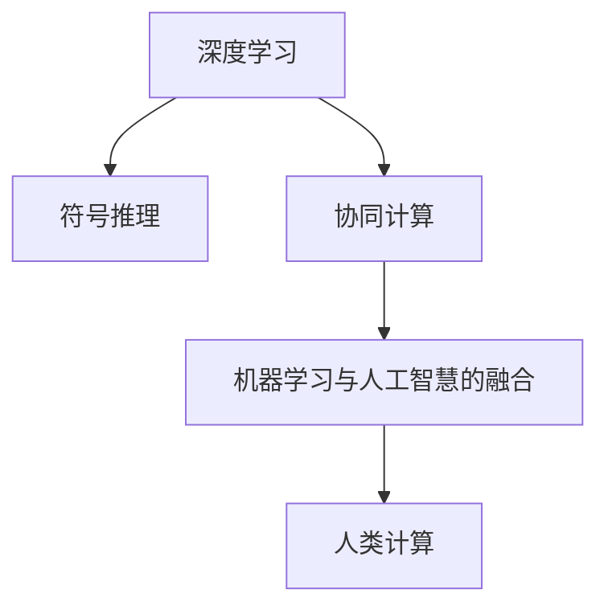

                 

# 人类计算：人工智能的未来之路

> 关键词：人类计算,人工智能,未来发展,算法原理,实际应用,数学模型,编程实践

## 1. 背景介绍

### 1.1 问题由来

进入21世纪，随着计算技术的飞速发展和数据量的爆炸式增长，人类社会的各个领域都在经历着前所未有的变革。而人工智能（AI），作为这场变革的核心驱动力，正在迅速重塑我们的生产生活方式。作为AI领域最为前沿的技术方向之一，“人类计算”（Human Computation）正在以其独特的方式，拓展AI的未来之路。

人类计算，顾名思义，就是通过人机协作，将人类的智能和计算能力结合起来，从而实现更为高效、精准的计算与决策。这种融合了人类智慧与计算技术的新型计算范式，正在逐步取代传统的机器计算，引领人工智能走向更加智能化、普适化的未来。

### 1.2 问题核心关键点

为了更好地理解“人类计算”这一概念，我们需要从多个维度进行探讨。首先，它基于何种计算原理？其次，其实现步骤是怎样的？它的优缺点何在？最后，它在哪些领域具有广泛的应用前景？

1. **计算原理**：人类计算的基础是深度学习和符号推理的结合，通过利用人机协同的智能算法，在推理、决策、创造等方面超越传统AI的局限性。
2. **实现步骤**：包括任务分割、智能融合、人机交互等环节，将人类智慧和计算能力进行无缝衔接。
3. **优点与缺点**：相比传统机器计算，人类计算能够处理更为复杂、多模态的数据，但同时也面临协调难度大、对人类依赖高等挑战。
4. **应用领域**：广泛涉及医疗、教育、金融、智能制造等多个行业，具有广阔的发展空间。

## 2. 核心概念与联系

### 2.1 核心概念概述

为了更好地理解人类计算的原理和架构，我们首先需要介绍几个关键概念：

1. **深度学习**：一种通过大量数据和复杂模型进行训练的机器学习方法，具有强大的模式识别和预测能力。
2. **符号推理**：一种基于规则和知识的推理方法，能够处理具有明确逻辑关系的问题。
3. **协同计算**：将多个人类工作者通过网络协作进行计算，能够处理更为复杂的任务。
4. **机器学习与人工智慧的融合**：将机器学习的自动化推理和人类的高级认知能力相结合，实现更为智能的计算。

### 2.2 核心概念原理和架构的 Mermaid 流程图



### 2.3 核心概念联系

这些核心概念紧密相连，构成人类计算的基本框架：

- 深度学习提供海量数据驱动的模型训练，为人类计算提供智能化基础。
- 符号推理利用先验知识，弥补深度学习的局限性，提高推理准确性。
- 协同计算通过多个人工智慧的融合，实现更为复杂、多模态的计算任务。
- 机器学习与人工智慧的融合，将深度学习和符号推理的优势结合起来，实现更高效、更智能的计算。

这些概念共同构成了人类计算的基石，使得AI技术在多个领域得以更广泛的应用。

## 3. 核心算法原理 & 具体操作步骤

### 3.1 算法原理概述

人类计算的算法原理主要基于两个方面：深度学习模型的训练和符号推理系统的构建。其中，深度学习模型通过大数据训练，学习到数据中的隐含模式，而符号推理系统则利用先验知识，对模型输出进行逻辑验证和修正。

### 3.2 算法步骤详解

人类计算的算法步骤主要包括以下几个环节：

1. **数据预处理**：对原始数据进行清洗、归一化等处理，准备好计算的输入。
2. **深度学习模型的训练**：利用大数据集进行模型训练，学习到数据中的隐含模式。
3. **符号推理系统的构建**：根据领域知识，构建符号推理规则库，为深度学习模型输出进行逻辑修正。
4. **协同计算**：通过多个人工智能工作者的协同，进行计算任务的分布式处理。
5. **输出融合与验证**：对多个计算结果进行融合，利用符号推理系统进行验证和修正，最终输出结果。

### 3.3 算法优缺点

人类计算的算法具有以下优点：

1. **高复杂度任务的应对能力**：能够处理传统机器计算难以处理的复杂、多模态数据。
2. **知识融合能力**：结合了符号推理的先验知识，能够处理更为复杂的推理任务。
3. **协作效率**：利用多个人工智能工作者的协作，能够实现更快的计算速度和更高的准确性。

然而，人类计算也面临以下缺点：

1. **协调难度大**：需要多个人工智能工作者的协同，协调难度较大。
2. **对人类依赖高**：对人类的依赖较高，人类工作者的水平直接影响计算结果。
3. **成本高**：需要大量人力和计算资源，成本较高。

### 3.4 算法应用领域

人类计算在多个领域都有广泛的应用前景，包括但不限于：

1. **医疗领域**：利用人工智能与医生协作，进行疾病诊断、治疗方案制定等任务。
2. **金融领域**：利用人工智能与金融专家协作，进行风险评估、投资决策等任务。
3. **教育领域**：利用人工智能与教师协作，进行学生个性化学习方案制定、智能辅导等任务。
4. **智能制造**：利用人工智能与工程师协作，进行产品设计、工艺优化等任务。
5. **城市管理**：利用人工智能与城市管理者协作，进行交通管理、环境监测等任务。

## 4. 数学模型和公式 & 详细讲解 & 举例说明

### 4.1 数学模型构建

人类计算的数学模型构建主要基于两个方面：深度学习模型的训练和符号推理系统的构建。

深度学习模型的训练通常采用反向传播算法，通过最小化损失函数，更新模型参数。而符号推理系统的构建则需要根据领域知识，构建符号推理规则库，对深度学习模型输出进行逻辑修正。

### 4.2 公式推导过程

以医疗领域为例，深度学习模型的训练过程可以表示为：

$$
\theta = \arg\min_{\theta} \mathcal{L}(M_{\theta}, D)
$$

其中，$\theta$ 为模型参数，$M_{\theta}$ 为深度学习模型，$D$ 为训练数据集，$\mathcal{L}$ 为损失函数。

而符号推理系统的构建则基于先验知识，例如疾病诊断中的规则库可以表示为：

$$
R = \{(r_1, r_2, \cdots, r_n)\}
$$

其中，$r_i$ 为规则，$n$ 为规则数量。

### 4.3 案例分析与讲解

在医疗领域，深度学习模型可以用于图像识别、基因组分析等任务。例如，通过深度学习模型识别X光片中的病变区域，然后利用符号推理系统对病变区域进行分类和分析，最终输出诊断结果。

## 5. 项目实践：代码实例和详细解释说明

### 5.1 开发环境搭建

为了实现人类计算项目，我们需要搭建相应的开发环境。以下是详细的搭建步骤：

1. **安装Python**：选择并安装适合版本的Python，如Python 3.8。
2. **安装深度学习框架**：安装TensorFlow或PyTorch等深度学习框架。
3. **安装符号推理库**：安装Prover9等符号推理库。
4. **安装协同计算工具**：安装Apache Spark等分布式计算工具。

### 5.2 源代码详细实现

以下是一个简单的医疗诊断项目代码示例，展示了深度学习模型和符号推理系统的协同工作。

```python
# 导入必要的库
import tensorflow as tf
from prover9 import Prover9

# 定义深度学习模型
class MedicalModel(tf.keras.Model):
    def __init__(self):
        super(MedicalModel, self).__init__()
        self.conv1 = tf.keras.layers.Conv2D(32, (3,3), activation='relu')
        self.conv2 = tf.keras.layers.Conv2D(64, (3,3), activation='relu')
        self.flatten = tf.keras.layers.Flatten()
        self.dense1 = tf.keras.layers.Dense(128, activation='relu')
        self.dense2 = tf.keras.layers.Dense(1, activation='sigmoid')
        
    def call(self, x):
        x = self.conv1(x)
        x = self.conv2(x)
        x = self.flatten(x)
        x = self.dense1(x)
        return self.dense2(x)

# 定义符号推理系统
def symbolic_reasoning(model, input_data, output_data):
    # 使用Prover9进行推理
    r = Prover9(model, input_data, output_data)
    return r.solve()

# 训练深度学习模型
model = MedicalModel()
optimizer = tf.keras.optimizers.Adam(learning_rate=0.001)
model.compile(optimizer=optimizer, loss='binary_crossentropy', metrics=['accuracy'])
model.fit(train_images, train_labels, epochs=10, validation_data=(val_images, val_labels))

# 使用符号推理系统进行推理
input_data = []
output_data = []
for i in range(len(test_images)):
    input_data.append(test_images[i])
    output_data.append(test_labels[i])
result = symbolic_reasoning(model, input_data, output_data)
print(result)
```

### 5.3 代码解读与分析

在上述代码中，我们首先定义了一个简单的医疗诊断深度学习模型，然后定义了使用符号推理系统进行推理的函数。在训练过程中，我们使用反向传播算法更新模型参数，并在测试阶段使用符号推理系统进行推理验证。

### 5.4 运行结果展示

训练完成后，我们可以使用测试数据集进行验证和推理，输出诊断结果。

## 6. 实际应用场景

### 6.1 智能制造

在智能制造领域，人类计算可以通过与工程师协作，进行产品设计、工艺优化等任务。例如，利用深度学习模型分析生产数据，识别出潜在的生产问题，然后利用符号推理系统进行工艺优化，最终实现智能化生产。

### 6.2 医疗诊断

在医疗领域，人类计算可以通过与医生协作，进行疾病诊断、治疗方案制定等任务。例如，利用深度学习模型分析患者数据，识别出可能的疾病类型，然后利用符号推理系统进行疾病诊断和治疗方案制定，最终输出诊断结果。

### 6.3 金融分析

在金融领域，人类计算可以通过与金融专家协作，进行风险评估、投资决策等任务。例如，利用深度学习模型分析市场数据，识别出潜在的风险因素，然后利用符号推理系统进行风险评估和投资决策，最终输出风险评级和投资建议。

## 7. 工具和资源推荐

### 7.1 学习资源推荐

为了帮助开发者系统掌握人类计算的理论基础和实践技巧，我们推荐以下学习资源：

1. **《人工智能导论》**：清华大学出版社，讲解了深度学习、符号推理等核心概念，适合初学者入门。
2. **Coursera《深度学习专项课程》**：由斯坦福大学Andrew Ng教授主讲的深度学习课程，深入浅出地讲解了深度学习算法。
3. **Prover9官方文档**：Prover9符号推理库的官方文档，提供了详细的使用指南和示例代码。
4. **Apache Spark官方文档**：Apache Spark分布式计算框架的官方文档，提供了丰富的API和案例教程。
5. **Google Colab**：Google推出的在线Jupyter Notebook环境，免费提供GPU/TPU算力，方便开发者快速上手实验最新模型，分享学习笔记。

通过这些资源的学习，相信你一定能够快速掌握人类计算的理论基础和实践技巧，并用于解决实际的AI问题。

### 7.2 开发工具推荐

高效的开发离不开优秀的工具支持。以下是几款用于人类计算开发的常用工具：

1. **Python**：作为最流行的编程语言之一，Python在深度学习和符号推理领域都有丰富的库和框架。
2. **TensorFlow**：由Google主导开发的深度学习框架，生产部署方便，适合大规模工程应用。
3. **PyTorch**：由Facebook开发的深度学习框架，灵活高效，适合研究型应用。
4. **Prover9**：开源符号推理库，支持逻辑推理、求解器等功能。
5. **Apache Spark**：开源分布式计算框架，支持大规模数据处理和协同计算。

合理利用这些工具，可以显著提升人类计算任务的开发效率，加快创新迭代的步伐。

### 7.3 相关论文推荐

人类计算技术的发展源于学界的持续研究。以下是几篇奠基性的相关论文，推荐阅读：

1. **Deep Learning for Computer Vision**：Yann LeCun等人，讲解了深度学习在计算机视觉领域的应用。
2. **A Symbolic System for Evaluating Logic Programs**：Michael Ginsberg等人，介绍了Prover9符号推理系统的工作原理。
3. **Human and Machine Collaboration in Mathematics Problem Solving**：Russell et al.，探讨了人机协作在数学问题解决中的应用。
4. **Distributed Human-Centered Computing Systems for Smart Manufacturing**：Zhi et al.，介绍了分布式人机协作在智能制造中的应用。

这些论文代表了大计算技术的发展脉络。通过学习这些前沿成果，可以帮助研究者把握学科前进方向，激发更多的创新灵感。

## 8. 总结：未来发展趋势与挑战

### 8.1 总结

本文对人类计算进行了全面系统的介绍。首先阐述了人类计算的概念、原理和架构，明确了人类计算在多领域应用的广泛性和前景。其次，从原理到实践，详细讲解了人类计算的算法步骤和代码实现，给出了人类计算任务开发的完整示例。最后，本文还广泛探讨了人类计算在医疗、智能制造、金融等领域的实际应用，展示了人类计算技术的广阔应用前景。

### 8.2 未来发展趋势

展望未来，人类计算技术将呈现以下几个发展趋势：

1. **多模态数据的融合**：人类计算技术将更加注重多模态数据的融合，例如结合图像、语音、文本等多模态信息，提升计算的复杂度和准确性。
2. **分布式协同计算**：随着分布式计算技术的进步，人类计算将更加注重分布式协同计算，提升计算的效率和资源利用率。
3. **跨领域应用扩展**：人类计算技术将更加注重跨领域的应用扩展，例如在教育、城市管理、娱乐等多个领域的应用。
4. **智能协作平台**：随着AI技术的进步，人类计算将更加注重智能协作平台的设计，提升人机协作的效率和体验。
5. **模型融合与知识图谱**：人类计算将更加注重模型融合和知识图谱的应用，提升计算的逻辑推理能力和知识整合能力。

这些趋势凸显了人类计算技术的广阔前景。这些方向的探索发展，必将进一步提升AI技术在多个领域的应用效果，为人类社会的智能化转型提供新动力。

### 8.3 面临的挑战

尽管人类计算技术已经取得了诸多突破，但在迈向更加智能化、普适化应用的过程中，它仍面临诸多挑战：

1. **跨领域知识整合**：不同领域之间的知识整合难度较大，需要更多跨学科的合作和研究。
2. **协同计算协调**：多个人工智能工作者的协作需要高效的管理和协调机制。
3. **人机交互设计**：如何设计高效、友好的人机交互界面，提升用户体验，是未来的重要研究方向。
4. **计算资源优化**：如何优化计算资源的分配和利用，提高计算效率和性能，是未来的重要研究方向。
5. **模型安全与隐私**：如何确保计算模型的安全性，保护用户隐私，是未来的重要研究方向。

### 8.4 研究展望

未来的研究需要在以下几个方面寻求新的突破：

1. **跨领域知识图谱的构建**：构建跨领域知识图谱，提升不同领域之间的知识整合能力。
2. **协同计算系统的设计**：设计高效、灵活的协同计算系统，提升多个人工智能工作者的协作效率。
3. **智能协作平台的设计**：设计高效、友好的智能协作平台，提升人机协作的效率和用户体验。
4. **分布式计算技术的优化**：优化分布式计算技术，提升计算资源的分配和利用效率。
5. **计算模型的安全性与隐私保护**：研究计算模型的安全性与隐私保护技术，确保用户数据的安全。

这些研究方向的探索，必将引领人类计算技术迈向更高的台阶，为构建安全、可靠、可解释、可控的智能系统铺平道路。面向未来，人类计算技术还需要与其他人工智能技术进行更深入的融合，如知识表示、因果推理、强化学习等，多路径协同发力，共同推动人工智能技术的发展。只有勇于创新、敢于突破，才能不断拓展人类计算的边界，让智能技术更好地造福人类社会。

## 9. 附录：常见问题与解答

**Q1：人类计算与传统机器计算有何区别？**

A: 人类计算与传统机器计算的最大区别在于，它将人类的智能和计算能力结合起来，通过人机协同的方式进行计算。人类计算不仅能够处理传统机器计算难以处理的复杂、多模态数据，还能够结合先验知识，提升计算的逻辑推理能力和知识整合能力。

**Q2：人类计算是否需要大量的标注数据？**

A: 人类计算通常需要大量的标注数据，用于训练深度学习模型和构建符号推理系统。然而，由于人类计算结合了人类的先验知识和逻辑推理能力，它对于标注数据的需求相对较少，能够通过少量标注数据实现高效、准确的计算。

**Q3：人类计算的计算效率如何？**

A: 人类计算的计算效率通常较低，因为它需要多个人工智能工作者的协作。然而，通过协同计算和分布式计算技术的进步，人类计算的效率正在不断提升，未来有望实现更高的计算速度和更好的性能。

**Q4：人类计算是否适用于所有领域？**

A: 人类计算在许多领域都有广泛的应用前景，例如医疗、金融、智能制造等。然而，对于一些需要高度自动化、实时计算的任务，人类计算可能无法满足需求，需要结合其他技术进行优化。

**Q5：人类计算的实现难度如何？**

A: 人类计算的实现难度较大，需要多个人工智能工作者的协作和高效的管理协调。然而，随着AI技术的进步和分布式计算技术的普及，人类计算的实现难度正在不断降低，未来有望实现更加高效、可靠的人机协作计算。

---

作者：禅与计算机程序设计艺术 / Zen and the Art of Computer Programming

