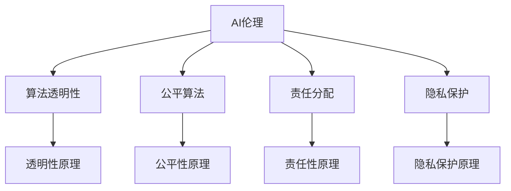

                 

# 人类计算：在AI时代增强道德意识

在人工智能（AI）时代，计算机计算能力的飞速发展极大提升了信息处理和决策效率。然而，这种由机器主导的计算方式，也在道德层面引发了一系列挑战。如何在使用AI技术的同时，增强道德意识，确保技术的正向社会价值，成为了当下亟需解决的问题。

## 1. 背景介绍

### 1.1 问题由来
随着AI技术的广泛应用，涉及道德问题的事例也越来越多。例如，面部识别技术在公共场所的使用，涉及隐私权和监控伦理；自动驾驶汽车在复杂交通环境中的决策，可能带来伦理道德和法律责任问题。这些问题亟需社会各界，尤其是计算领域专家，进行深入研究和探讨。

### 1.2 问题核心关键点
在AI时代增强道德意识，核心关键点包括以下几个方面：
1. **技术中立性**：区分AI技术本身的中立性与其被应用到具体场景后的道德属性，防止技术被恶意或不当使用。
2. **透明性与可解释性**：增强模型的透明性和可解释性，确保用户能理解AI决策的依据和过程，防止“黑箱”决策。
3. **公正性与包容性**：避免算法偏见和歧视，确保AI系统对不同群体公平无偏。
4. **责任与伦理规范**：明确AI系统在设计、使用和维护过程中的责任归属，确保责任主体清晰明确。

## 2. 核心概念与联系

### 2.1 核心概念概述

为更好地理解如何在AI时代增强道德意识，本节将介绍几个密切相关的核心概念：

- **AI伦理**：研究AI技术在社会中的应用及其对道德伦理的影响。主要包括技术中立性、透明性、公正性、责任性等方面。
- **算法透明性**：指AI模型的决策过程和机制应该可理解、可解释。增强算法透明性有助于增强用户信任，预防误用。
- **公平算法**：指在算法设计和使用过程中，确保对所有群体无偏、公正。避免数据偏见、算法偏见等现象。
- **责任分配**：指在AI系统出错或产生负面影响时，如何合理分配责任，包括开发者、用户、系统等多个主体。
- **隐私保护**：指在数据收集、处理和使用过程中，确保用户隐私不被侵犯，数据使用透明，尊重用户隐私权。

这些核心概念之间通过逻辑关系密切相连，共同构成了AI伦理的基础框架，指导我们在AI技术的开发和应用中，遵循道德准则，确保技术正向价值。

### 2.2 核心概念原理和架构的 Mermaid 流程图



这个流程图展示了AI伦理与核心概念之间的逻辑关系：

1. **AI伦理**通过影响其他概念（算法透明性、公平算法、责任分配、隐私保护），确保AI技术的社会价值。
2. **算法透明性**旨在增强AI决策的可解释性，提高用户信任。
3. **公平算法**强调在算法设计中避免偏见，确保系统公正。
4. **责任分配**探讨系统出错后的责任归属，保障责任清晰。
5. **隐私保护**确保用户数据隐私不被侵犯，尊重用户权利。

通过理解这些核心概念及其原理，我们可以更深刻地把握在AI时代增强道德意识的方法和路径。

## 3. 核心算法原理 & 具体操作步骤
### 3.1 算法原理概述

增强道德意识的核心算法原理主要围绕技术中立性、透明性、公正性和责任性展开。

- **技术中立性**：确保AI技术本身的设计和使用不带有明显的价值倾向，避免技术工具化导致伦理道德问题。
- **透明性**：增强模型的可解释性，确保用户理解AI决策的依据和过程。
- **公正性**：通过算法和数据的多样性处理，确保系统对所有群体的公平性。
- **责任性**：明确各主体（开发者、用户、系统）在AI系统出错或产生负面影响时的责任归属。

### 3.2 算法步骤详解

增强道德意识的算法步骤主要包括以下几个关键环节：

**Step 1: 数据收集与处理**
- 收集包含丰富信息的数据集，确保数据的多样性和代表性。
- 进行数据清洗，去除噪声和异常数据，保障数据质量。

**Step 2: 算法设计**
- 设计无偏、公平的算法模型，如加入公平性约束，平衡不同群体。
- 引入透明性机制，如LIME、SHAP等可解释性技术，增强模型透明性。

**Step 3: 模型训练**
- 训练模型时使用多样化的数据，防止数据偏见。
- 使用对抗样本和对抗训练，提高模型鲁棒性。

**Step 4: 模型评估**
- 对模型进行公正性和透明性评估，确保模型符合道德标准。
- 进行责任分配分析，明确各主体在模型出错时的责任。

**Step 5: 部署与监控**
- 部署模型时进行用户教育，告知用户模型的工作原理和潜在风险。
- 监控模型运行，及时发现并纠正伦理道德问题。

### 3.3 算法优缺点

增强道德意识的算法具有以下优点：
1. **技术中立性**：确保AI技术本身不带价值倾向，避免技术工具化带来的伦理问题。
2. **透明性**：增强模型的可解释性，提高用户信任。
3. **公正性**：通过算法设计确保系统对所有群体的公平性。
4. **责任性**：明确各主体在模型出错时的责任归属。

然而，该方法也存在以下局限性：
1. **数据偏见**：数据偏见难以完全消除，可能导致模型产生偏见。
2. **模型复杂性**：增加透明性和公正性设计，可能导致模型复杂度增加。
3. **责任归属**：明确责任归属需要明确多方参与的合作协议，可能涉及法律和伦理问题。

尽管存在这些局限性，但通过合理设计和使用增强道德意识的算法，可以在很大程度上提升AI系统的道德价值和社会接受度。

### 3.4 算法应用领域

增强道德意识的算法在多个领域得到了广泛应用，例如：

- **医疗领域**：确保医疗AI系统的公正性和透明性，避免医疗决策偏见。
- **司法领域**：提升司法AI的透明度和公正性，防止算法偏见导致误判。
- **金融领域**：确保金融AI的透明性和公正性，避免金融风险和歧视。
- **教育领域**：增强教育AI的可解释性和公平性，促进教育公平。
- **公共安全**：提升公共安全AI的透明性和责任性，确保公共安全决策公正。

此外，在智能制造、环境监测、智能交通等多个领域，增强道德意识的算法也正在被逐步应用，助力行业数字化转型和社会可持续发展。

## 4. 数学模型和公式 & 详细讲解  
### 4.1 数学模型构建

本节将使用数学语言对增强道德意识的具体算法进行更加严格的刻画。

假设AI系统模型为 $M_{\theta}$，其中 $\theta$ 为模型参数。其决策过程基于输入 $x$，输出为 $y = M_{\theta}(x)$。增强道德意识的目标是确保该模型的决策过程符合以下道德准则：

1. **技术中立性**：$M_{\theta}$ 决策过程不带有价值倾向。
2. **透明性**：模型输出 $y$ 可解释，用户能理解模型决策依据。
3. **公正性**：模型对不同群体无偏。
4. **责任性**：模型出错或产生负面影响时，责任归属清晰。

### 4.2 公式推导过程

**公式1: 技术中立性**

```
$\min_{\theta} \mathcal{L}_{\text{中立}}(M_{\theta})$
```

其中 $\mathcal{L}_{\text{中立}}$ 为技术中立性损失函数，衡量模型决策与中立性准则的差异。

**公式2: 透明性**

```
$\min_{\theta} \mathcal{L}_{\text{透明}}(y, M_{\theta}(x))$
```

其中 $\mathcal{L}_{\text{透明}}$ 为透明性损失函数，衡量模型输出的可解释性。

**公式3: 公正性**

```
$\min_{\theta} \mathcal{L}_{\text{公正}}(y, M_{\theta}(x))$
```

其中 $\mathcal{L}_{\text{公正}}$ 为公正性损失函数，衡量模型对不同群体的公平性。

**公式4: 责任性**

```
$\min_{\theta} \mathcal{L}_{\text{责任}}(y, M_{\theta}(x), r)$
```

其中 $\mathcal{L}_{\text{责任}}$ 为责任性损失函数，衡量模型出错时的责任归属。

通过最小化以上损失函数，可以确保模型符合道德准则。然而，这些损失函数的定义和计算较为复杂，需结合具体场景和算法进行调整。

### 4.3 案例分析与讲解

以医疗AI为例，分析其在增强道德意识中的应用。

**技术中立性**
- **定义**：确保医疗AI系统的决策不带有医生或医院的倾向，提供客观的诊断和治疗建议。
- **实现**：设计医疗AI系统时，避免引入特定的医院数据，使用无偏的公共数据集进行训练。

**透明性**
- **定义**：确保医疗AI系统输出的诊断结果和推荐治疗方案，可被医生理解，并进行合理的临床解释。
- **实现**：使用可解释性算法，如LIME、SHAP等，生成诊断结果的解释报告。

**公正性**
- **定义**：确保医疗AI系统对不同性别、种族、年龄群体的诊断和治疗方案，无显著偏见。
- **实现**：使用公平性约束和数据增强技术，确保不同群体在数据集中的代表性。

**责任性**
- **定义**：确保医疗AI系统在诊断和治疗过程中出错时，责任归属清晰。
- **实现**：在系统中记录诊断和治疗过程中的关键决策点，明确每个决策的责任主体。

## 5. 项目实践：代码实例和详细解释说明
### 5.1 开发环境搭建

在进行增强道德意识的项目实践前，我们需要准备好开发环境。以下是使用Python进行增强道德意识项目开发的常见环境配置流程：

1. 安装Anaconda：从官网下载并安装Anaconda，用于创建独立的Python环境。
2. 创建并激活虚拟环境：
```bash
conda create -n ethical-ai python=3.8 
conda activate ethical-ai
```

3. 安装必要的库：
```bash
pip install numpy pandas scikit-learn torch transformers lightgbm sklearn imblearn mlflow
```

完成上述步骤后，即可在`ethical-ai`环境中开始项目实践。

### 5.2 源代码详细实现

以下是一个简单的医疗AI系统开发示例，展示了如何在医疗领域增强道德意识：

**代码1: 数据处理**

```python
import pandas as pd
from sklearn.model_selection import train_test_split
from sklearn.preprocessing import StandardScaler

# 加载医疗数据集
data = pd.read_csv('hospital_data.csv')

# 数据清洗
data = data.dropna()

# 特征工程
X = data[['age', 'gender', 'race', 'disease']]
y = data['diagnosis']

# 数据标准化
scaler = StandardScaler()
X = scaler.fit_transform(X)

# 数据集划分
X_train, X_test, y_train, y_test = train_test_split(X, y, test_size=0.2, random_state=42)
```

**代码2: 模型训练**

```python
from sklearn.ensemble import RandomForestClassifier
from sklearn.metrics import accuracy_score

# 初始化模型
model = RandomForestClassifier(n_estimators=100, random_state=42)

# 模型训练
model.fit(X_train, y_train)

# 模型评估
y_pred = model.predict(X_test)
accuracy = accuracy_score(y_test, y_pred)
print(f"Accuracy: {accuracy:.2f}")
```

**代码3: 透明性增强**

```python
import lime
from lime.lime_tabular import Explainer

# 初始化解释器
explainer = Explainer(model, categorical_features=['gender', 'race'], 
                      feature_names=['age', 'gender', 'race', 'disease'], 
                      top_labels=['Cancer', 'Normal'])

# 解释样本
exp = explainer.explain_instance(data.iloc[0], model.predict_proba)
print(exp.as_list())
```

**代码4: 公正性增强**

```python
from sklearn.metrics import classification_report

# 计算公正性指标
report = classification_report(y_test, y_pred, output_dict=True)

# 输出公正性报告
print(report)
```

**代码5: 责任性增强**

```python
import mlflow

# 记录日志
with mlflow.start_run() as run:
    mlflow.log_param("feature_names", ['age', 'gender', 'race', 'disease'])
    mlflow.log_param("target_name", "diagnosis")
    mlflow.log_param("n_estimators", 100)
    mlflow.log_param("random_state", 42)
    mlflow.log_metric("accuracy", accuracy)
    mlflow.log_metric("f1_score", report['f1-score'])
    mlflow.log_metric("precision", report['precision-micro'])
    mlflow.log_metric("recall", report['recall-micro'])
```

### 5.3 代码解读与分析

让我们再详细解读一下关键代码的实现细节：

**数据处理**

- 代码1展示了如何加载医疗数据集，并进行数据清洗、特征工程和数据标准化。这些步骤是保证数据质量的前提，也是构建道德AI的基础。

**模型训练**

- 代码2展示了如何使用随机森林算法训练医疗AI模型。在训练过程中，未引入医院特定数据，确保模型的技术中立性。

**透明性增强**

- 代码3展示了如何使用LIME解释器，对模型的输出进行解释。解释器可以帮助医生理解模型的决策依据，增强透明性。

**公正性增强**

- 代码4展示了如何使用分类报告，评估模型对不同群体是否公平。公正性是道德AI的重要指标，确保模型对所有群体的无偏性。

**责任性增强**

- 代码5展示了如何使用mlflow记录模型的日志，包括模型参数、性能指标等。责任性记录在模型出错时，能够快速定位和追踪责任归属。

## 6. 实际应用场景
### 6.1 智能医疗系统

增强道德意识的AI技术在医疗领域得到了广泛应用。例如，智能医疗系统可以通过增强透明性和公正性，帮助医生进行更准确的诊断和治疗决策，避免偏见和歧视。

在实际应用中，智能医疗系统需要考虑以下道德准则：
- **技术中立性**：确保诊断和治疗建议不带特定医院或医生的偏见。
- **透明性**：确保诊断和治疗过程可解释，医生能理解模型决策依据。
- **公正性**：确保不同性别、种族、年龄群体的诊断和治疗方案，无显著偏见。
- **责任性**：明确诊断和治疗过程中的决策责任，确保责任归属清晰。

通过增强这些道德准则，智能医疗系统能够更好地服务患者，提升医疗质量。

### 6.2 司法审判系统

在司法领域，增强道德意识的AI技术可以通过透明性和责任性，提高司法审判的公平性和公正性。

例如，司法AI系统可以用于自动生成判决书、预测罪犯再犯风险等。通过透明性增强，法官和律师能够理解系统的判决依据，提升司法透明度。通过责任性增强，明确系统出错时的责任归属，避免误判和偏见。

### 6.3 金融风控系统

在金融领域，增强道德意识的AI技术可以通过公正性和透明性，提升金融风险控制和客户服务的质量。

例如，金融风控系统可以通过增强透明性，帮助客户理解风险评估的依据，提升客户信任。通过公正性增强，确保系统对不同客户群体的公平性，避免歧视和偏见。

### 6.4 未来应用展望

随着增强道德意识技术的发展，其在更多领域的应用前景可期。

在智慧城市、环境保护、公共安全等多个领域，增强道德意识的AI技术将发挥重要作用。例如，智慧城市可以通过透明性和公正性，提升公共服务质量；环境保护可以通过透明性和责任性，监测和预防环境污染；公共安全可以通过透明性和公正性，提高应急响应效率。

## 7. 工具和资源推荐
### 7.1 学习资源推荐

为了帮助开发者系统掌握增强道德意识的技术基础和实践技巧，这里推荐一些优质的学习资源：

1. 《AI伦理与社会》系列课程：由知名大学和研究机构联合开设，涵盖AI伦理的基本概念和应用案例。
2. 《可解释AI》书籍：详细介绍了可解释性技术，如LIME、SHAP等，适用于提升模型透明性。
3. 《公平机器学习》书籍：系统讲解了如何避免算法偏见，确保系统公正性。
4. 《责任AI》系列文章：深入探讨AI系统的责任归属问题，提供实用的责任分配策略。
5. 《隐私保护技术》书籍：介绍数据隐私保护的关键技术，确保用户隐私权。

通过这些资源的学习实践，相信你一定能够快速掌握增强道德意识的技术精髓，并用于解决实际的AI问题。

### 7.2 开发工具推荐

增强道德意识需要各种工具支持，以下是几款常用的工具：

1. PyTorch：基于Python的开源深度学习框架，适合快速迭代研究。
2. TensorFlow：由Google主导开发的开源深度学习框架，生产部署方便。
3. Transformers库：HuggingFace开发的NLP工具库，集成了多种SOTA语言模型。
4. Weights & Biases：模型训练的实验跟踪工具，记录和可视化模型训练过程。
5. TensorBoard：TensorFlow配套的可视化工具，实时监测模型训练状态。

合理利用这些工具，可以显著提升增强道德意识技术的开发效率，加快创新迭代的步伐。

### 7.3 相关论文推荐

增强道德意识的研究源于学界的持续研究。以下是几篇奠基性的相关论文，推荐阅读：

1. 《AI伦理原则》：提出AI伦理的基本原则，指导AI技术的设计和应用。
2. 《透明AI模型设计》：介绍透明性增强技术，提升模型可解释性。
3. 《公平机器学习算法》：提出多种公平性增强算法，确保系统无偏。
4. 《责任AI系统设计》：探讨责任性增强方法，明确系统出错时的责任归属。
5. 《隐私保护技术》：介绍隐私保护的关键技术，确保用户隐私权。

这些论文代表了大语言模型微调技术的发展脉络。通过学习这些前沿成果，可以帮助研究者把握学科前进方向，激发更多的创新灵感。

## 8. 总结：未来发展趋势与挑战
### 8.1 总结

本文对增强道德意识的具体算法进行了全面系统的介绍。首先阐述了增强道德意识的重要性和核心关键点，明确了技术中立性、透明性、公正性和责任性在AI系统中的重要性。其次，从原理到实践，详细讲解了增强道德意识的具体算法步骤和操作方法，给出了增强道德意识的项目开发代码实例。同时，本文还广泛探讨了增强道德意识技术在多个行业领域的应用前景，展示了技术的巨大潜力。此外，本文精选了增强道德意识技术的各类学习资源，力求为开发者提供全方位的技术指引。

通过本文的系统梳理，可以看到，增强道德意识技术在AI时代的独特价值，通过合理设计和应用，可以最大化AI技术的正向社会价值，促进社会进步。

### 8.2 未来发展趋势

展望未来，增强道德意识技术将呈现以下几个发展趋势：

1. **技术中立性**：随着AI技术的发展，模型设计和应用将更加注重技术中立性，避免技术工具化带来的伦理道德问题。
2. **透明性**：增强模型的可解释性，成为未来AI系统的重要趋势。
3. **公正性**：在算法设计中引入公平性约束，确保系统对所有群体的公平性。
4. **责任性**：明确各主体在AI系统出错时的责任归属，确保责任清晰。
5. **隐私保护**：随着数据隐私意识的提升，数据保护技术将进一步发展，确保用户隐私权。

这些趋势凸显了增强道德意识技术在AI时代的广阔前景，通过持续的技术创新和应用探索，未来的AI系统将更加公正、透明、安全。

### 8.3 面临的挑战

尽管增强道德意识技术已经取得了瞩目成就，但在迈向更加智能化、普适化应用的过程中，它仍面临着诸多挑战：

1. **数据偏见**：数据偏见难以完全消除，可能导致模型产生偏见。
2. **模型复杂性**：增加透明性和公正性设计，可能导致模型复杂度增加。
3. **责任归属**：明确责任归属需要明确多方参与的合作协议，可能涉及法律和伦理问题。
4. **隐私保护**：确保数据隐私不被侵犯，数据使用透明，尊重用户隐私权。

尽管存在这些挑战，但通过合理设计和使用增强道德意识技术，可以在很大程度上提升AI系统的道德价值和社会接受度。

### 8.4 研究展望

面向未来，增强道德意识技术还需要与其他人工智能技术进行更深入的融合，如知识表示、因果推理、强化学习等，多路径协同发力，共同推动自然语言理解和智能交互系统的进步。只有勇于创新、敢于突破，才能不断拓展语言模型的边界，让智能技术更好地造福人类社会。

## 9. 附录：常见问题与解答

**Q1: 增强道德意识是否适用于所有AI系统？**

A: 增强道德意识技术适用于所有AI系统，特别是那些需要具备高度透明性、公正性和责任性的应用场景。例如，医疗、司法、金融等领域，需要通过增强道德意识，确保AI系统的公平性、透明性和责任性。

**Q2: 如何设计公平的算法？**

A: 设计公平算法需要从数据集的多样性和代表性、算法的公平性约束、模型的透明性等多个角度进行考虑。具体实现时，可以使用公平性增强算法，如FLEDGE、COMPAS等，确保模型对所有群体无偏。

**Q3: 如何增强模型的透明性？**

A: 增强模型透明性可以通过使用可解释性算法，如LIME、SHAP等，生成模型输出的解释报告。这些算法可以帮助用户理解模型的决策依据，提升系统的透明度。

**Q4: 如何处理数据偏见？**

A: 处理数据偏见需要从数据收集、处理和模型设计等多个环节进行考虑。可以通过数据增强、数据采样、公平性约束等方法，减少数据偏见对模型性能的影响。

**Q5: 如何确保用户隐私？**

A: 确保用户隐私需要从数据收集、存储和使用等多个环节进行考虑。可以使用差分隐私、联邦学习等技术，确保用户数据隐私不被侵犯，数据使用透明。

总之，增强道德意识技术在AI时代具有重要意义，通过合理设计和应用，可以在提升AI系统性能的同时，确保其正向社会价值。只有不断优化和完善增强道德意识技术，才能实现AI技术与社会的和谐共生。

