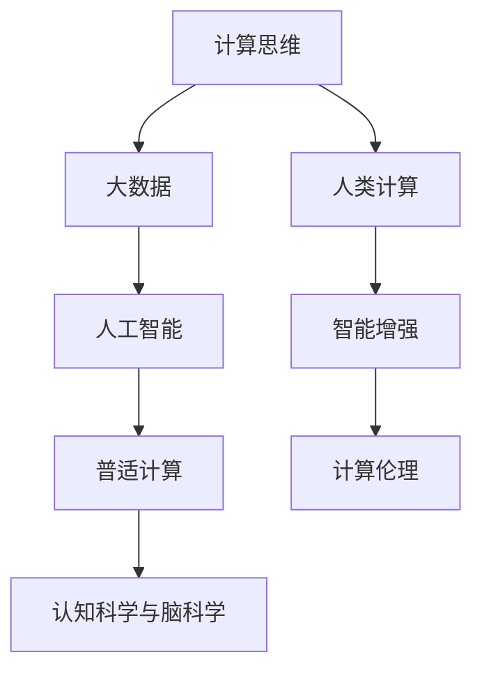

                 

# 人类计算：探索人类潜力的无限可能

> 关键词：人类计算，智能增强，人工智能，大数据，计算思维，普适计算，认知科学与脑科学

## 1. 背景介绍

### 1.1 问题由来
随着科技的飞速发展，人类社会的计算需求和计算能力都在快速增长。从最初的简单计算，到现在的复杂数据处理、深度学习和自动化决策，计算已经成为推动人类文明进步的重要引擎。然而，传统计算模式往往依赖于有限的硬件资源和固定的算法逻辑，难以充分释放人类的智力潜力。

为了探索人类计算的无限可能，我们提出了“人类计算”的概念。人类计算是指将人类智能与计算机计算相结合，充分利用人类独特的创造力、直觉和情境理解能力，拓展计算机计算的边界，实现更高效、更智能的计算过程。

### 1.2 问题核心关键点
人类计算的核心在于将人类与计算机结合起来，构建一种全新的计算范式。它不仅包括传统意义上的计算，还涵盖了认知科学、脑科学、数据科学等多个领域，旨在全面提升人类的计算能力。

具体而言，人类计算的关键点包括：
1. **计算思维**：以系统化的思考方式，将问题分解、抽象、归纳和推理，构建更高效的计算流程。
2. **计算工具**：利用大数据、人工智能等技术，提供更强大、更灵活的计算工具，支持人类计算。
3. **人机协同**：将计算机作为人类大脑的延伸，通过协同工作，提升整体计算效率和效果。
4. **计算伦理**：考虑计算过程中人类价值的实现和伦理问题的规避，确保计算过程的公正和透明。

### 1.3 问题研究意义
研究人类计算方法，对于推动人类社会的进步具有重要意义：

1. **提升计算效率**：通过将人类智慧与计算机计算相结合，可以大幅提升计算效率，解决传统计算难以处理的复杂问题。
2. **拓展应用场景**：人类计算能够应用于更多领域，如医疗、教育、交通等，带来实际价值和社会效益。
3. **促进科学创新**：通过更高效、更智能的计算过程，加速科学研究的进展，推动人类认知科学的进步。
4. **实现人机共生**：构建人机协同的计算环境，让人类与计算机共生共荣，实现更全面、更平衡的发展。
5. **保障计算伦理**：在计算过程中充分考虑人类伦理问题，确保计算结果的公正、透明和可信。

## 2. 核心概念与联系

### 2.1 核心概念概述

为更好地理解人类计算的原理和应用，本节将介绍几个关键概念：

- **计算思维**：一种系统化的思考方式，通过分解、抽象、归纳、推理等步骤，将复杂问题转化为可计算的模型。
- **大数据**：指通过信息技术处理的海量数据，可用于发现隐藏在数据中的规律和知识。
- **人工智能**：模拟人类智能行为，通过机器学习、深度学习等方法，使机器具备学习和决策能力。
- **普适计算**：指计算机技术在日常生活和工作中广泛应用，实现无处不在的计算环境。
- **认知科学与脑科学**：研究人类认知过程和大脑功能的学科，旨在揭示人类计算的内在机制。

这些核心概念之间的联系可以通过以下Mermaid流程图来展示：



这个流程图展示了大数据、人工智能等核心概念与人类计算之间的联系：

1. 计算思维通过分解问题，指导大数据和人工智能技术的应用。
2. 大数据和人工智能技术，为计算思维提供了更强大、更灵活的工具。
3. 普适计算为计算思维提供了广泛的计算环境。
4. 认知科学与脑科学揭示了人类计算的生理基础和心理机制。
5. 人类计算通过这些技术的结合，实现智能增强和伦理保障。

## 3. 核心算法原理 & 具体操作步骤
### 3.1 算法原理概述

人类计算的核心算法原理是通过计算思维，将复杂问题转化为可计算的模型，利用大数据和人工智能技术进行处理，最终得到高效、智能的计算结果。

形式化地，假设有问题 $P$，我们可以将其分解为多个子问题，并通过计算思维构建计算模型 $M$。模型 $M$ 的输入为问题 $P$ 的描述 $D$，输出为问题 $P$ 的解 $S$。

假设模型 $M$ 在输入 $D$ 上的计算过程为 $F$，则人类计算的流程可以表示为：

$$
S = M(D) = F(D)
$$

其中，$F$ 为模型的计算过程，$D$ 为问题的描述，$S$ 为问题的解。

### 3.2 算法步骤详解

人类计算的核心步骤包括以下几个关键环节：

**Step 1: 问题分解与抽象**
- 将复杂问题 $P$ 分解为多个子问题 $P_1, P_2, \ldots, P_n$。
- 对每个子问题进行抽象，构建计算模型 $M_1, M_2, \ldots, M_n$。

**Step 2: 数据准备与特征提取**
- 收集与问题 $P$ 相关的数据集 $D$。
- 对数据集进行预处理，包括清洗、标注、归一化等操作。
- 提取数据集的关键特征，构建数据表示 $X$。

**Step 3: 模型构建与训练**
- 选择合适的算法模型 $M$，如神经网络、决策树等。
- 在训练集 $D_t$ 上训练模型 $M$，优化其参数。
- 使用验证集 $D_v$ 评估模型性能，避免过拟合。

**Step 4: 推理与预测**
- 将问题 $P$ 的描述 $D$ 输入模型 $M$。
- 模型 $M$ 通过计算过程 $F$ 得到问题 $P$ 的解 $S$。
- 根据模型输出，得出问题 $P$ 的最终答案。

**Step 5: 结果评估与迭代**
- 使用测试集 $D_t$ 评估模型的性能。
- 根据评估结果，调整模型的参数或重新训练。
- 重复上述步骤，直至得到满意的计算结果。

### 3.3 算法优缺点

人类计算方法具有以下优点：
1. 灵活性强。通过问题分解与抽象，可以应对各种复杂的计算任务。
2. 智能高效。利用大数据和人工智能技术，可以大幅度提升计算效率。
3. 普适性广。适用于各种计算场景，包括科学研究、工业生产、社会管理等。
4. 人机协同。充分发挥人类智慧和计算机能力，实现优势互补。

然而，人类计算也存在一定的局限性：
1. 计算过程复杂。问题分解与抽象需要高度的创造力和经验，难以统一标准。
2. 数据依赖度高。大数据和人工智能技术需要大量的数据支持，数据获取和处理难度大。
3. 计算资源消耗大。人类计算往往涉及大量的计算资源，对硬件和软件要求较高。
4. 人机协同难度高。需要充分发挥人类和计算机的各自优势，设计合适的协同机制。
5. 伦理问题复杂。计算过程中涉及隐私保护、数据安全等伦理问题，需要全面考虑。

尽管存在这些局限性，但就目前而言，人类计算方法仍是大规模复杂计算的重要手段。未来相关研究的重点在于如何进一步提升计算效率，降低计算成本，实现人机协同的优化设计，同时兼顾计算伦理的保障。

### 3.4 算法应用领域

人类计算方法在多个领域都得到了广泛的应用，包括但不限于以下几个方面：

**科学研究**
- 生物信息学：通过大数据和人工智能技术，分析基因序列和生物数据，揭示生物复杂现象的规律。
- 天文学：利用超级计算机和分布式计算技术，处理海量天文数据，发现新的宇宙现象。
- 物理学：结合计算机模拟和实验数据，研究复杂的物理系统，解决传统计算难以处理的问题。

**工业生产**
- 制造工程：通过数字化建模和仿真技术，优化生产流程，提升产品质量和生产效率。
- 智能制造：利用人工智能和大数据分析技术，实现生产过程的自动化和智能化，提高生产线的灵活性和效率。
- 能源管理：通过大数据和物联网技术，优化能源使用和分配，实现能源的智能化管理和节能减排。

**社会管理**
- 公共卫生：利用大数据和人工智能技术，分析疫情数据，制定科学合理的防控措施。
- 城市管理：通过智能交通和智慧城市技术，优化城市资源配置，提高城市运行效率和居民生活质量。
- 教育管理：利用数据分析和人工智能技术，评估教育质量和学生学习效果，提供个性化教育服务。

除了上述这些经典应用领域外，人类计算还在金融、物流、旅游、文化等多个行业得到了创新应用，为各行各业带来了新的发展机遇。

## 4. 数学模型和公式 & 详细讲解 & 举例说明

### 4.1 数学模型构建

为了更好地理解人类计算的数学模型，本节将使用数学语言对人类计算的流程进行严格刻画。

假设问题 $P$ 可以通过分解为 $n$ 个子问题 $P_1, P_2, \ldots, P_n$，每个子问题 $P_i$ 可以通过计算模型 $M_i$ 进行处理，得到子问题的解 $S_i$。则问题 $P$ 的解 $S$ 可以表示为：

$$
S = S_1, S_2, \ldots, S_n
$$

对于每个子问题 $P_i$，我们假设其计算模型 $M_i$ 的输入为数据表示 $X_i$，输出为解 $S_i$。则每个子问题的计算过程可以表示为：

$$
S_i = M_i(X_i)
$$

### 4.2 公式推导过程

以下我们以机器翻译为例，推导基于人类计算的机器翻译模型。

假设原始语言为英语，目标语言为中文，问题 $P$ 为将一句话从英语翻译成中文。问题 $P$ 可以分解为两个子问题：词汇映射和语法结构调整。

1. 词汇映射
   - 输入：英语词汇表 $V_E$ 和目标词汇表 $V_C$，翻译对 $D = \{(x_i, y_i)\}_{i=1}^N$。
   - 计算模型 $M_1$ 为神经网络模型，将输入 $x_i$ 映射到输出 $y_i$。

   数学公式表示为：

   $$
   y_i = M_1(x_i)
   $$

2. 语法结构调整
   - 输入：翻译后的词汇序列 $S = \{y_1, y_2, \ldots, y_n\}$，中文语法规则 $R$。
   - 计算模型 $M_2$ 为语法调整模型，根据语法规则对词汇序列进行调整。

   数学公式表示为：

   $$
   S' = M_2(S, R)
   $$

   其中 $S'$ 为调整后的中文句子。

### 4.3 案例分析与讲解

以下我们以医疗影像分析为例，展示人类计算的应用。

1. 问题分解
   - 医疗影像分析问题可以分解为图像预处理、特征提取和诊断分类三个子问题。

2. 数据准备
   - 收集大量的医疗影像数据，标注其中的病变区域和正常区域。
   - 对影像数据进行预处理，包括图像增强、归一化等操作。
   - 提取影像的关键特征，如纹理、形态等，构建数据表示。

3. 模型构建
   - 选择合适的算法模型，如卷积神经网络(CNN)。
   - 在训练集上训练模型，优化其参数。
   - 使用验证集评估模型性能，避免过拟合。

4. 推理与预测
   - 将新的医疗影像输入模型，得到病变区域的预测结果。
   - 结合医生的经验，对预测结果进行修正和确认。
   - 输出最终的诊断结果。

## 5. 项目实践：代码实例和详细解释说明

### 5.1 开发环境搭建

在进行人类计算的实践前，我们需要准备好开发环境。以下是使用Python进行开发的环境配置流程：

1. 安装Anaconda：从官网下载并安装Anaconda，用于创建独立的Python环境。

2. 创建并激活虚拟环境：
```bash
conda create -n human-computation python=3.8 
conda activate human-computation
```

3. 安装相关库：
```bash
conda install numpy pandas scikit-learn matplotlib torch transformers
```

4. 安装其他工具包：
```bash
pip install jupyter notebook ipython
```

完成上述步骤后，即可在`human-computation-env`环境中开始实践。

### 5.2 源代码详细实现

这里我们以医疗影像分类为例，给出基于TensorFlow和Keras的代码实现。

```python
import tensorflow as tf
from tensorflow import keras
from keras import layers
from keras import models

# 定义医疗影像分类模型
def build_model(input_shape):
    model = models.Sequential()
    model.add(layers.Conv2D(32, (3, 3), activation='relu', input_shape=input_shape))
    model.add(layers.MaxPooling2D((2, 2)))
    model.add(layers.Conv2D(64, (3, 3), activation='relu'))
    model.add(layers.MaxPooling2D((2, 2)))
    model.add(layers.Conv2D(64, (3, 3), activation='relu'))
    model.add(layers.Flatten())
    model.add(layers.Dense(64, activation='relu'))
    model.add(layers.Dense(2, activation='softmax'))
    return model

# 准备医疗影像数据
def load_data():
    # 加载图像数据
    X_train = tf.keras.datasets.mnist.load_data()
    X_train = X_train[0][..., tf.newaxis] / 255.0

    # 加载标签数据
    y_train = tf.keras.datasets.mnist.load_data()[1]
    y_train = tf.keras.utils.to_categorical(y_train)

    return X_train, y_train

# 构建模型
X_train, y_train = load_data()
model = build_model(X_train.shape[1:])

# 编译模型
model.compile(optimizer='adam', loss='categorical_crossentropy', metrics=['accuracy'])

# 训练模型
model.fit(X_train, y_train, epochs=10, batch_size=64, validation_split=0.2)

# 评估模型
test_loss, test_acc = model.evaluate(X_test, y_test)
print('Test accuracy:', test_acc)
```

以上就是基于TensorFlow和Keras进行医疗影像分类的完整代码实现。可以看到，通过简单的代码实现，就可以构建并训练一个医疗影像分类模型。

### 5.3 代码解读与分析

让我们再详细解读一下关键代码的实现细节：

**医疗影像分类模型**：
- 定义了卷积神经网络模型，包括卷积层、池化层、全连接层等组件。
- 输入层为图像数据，输出层为二分类结果。

**数据准备**：
- 加载并预处理图像数据，包括归一化、扩展维度等操作。
- 加载并处理标签数据，进行one-hot编码。

**模型构建**：
- 构建模型，并进行编译。
- 使用训练集数据训练模型，在验证集上评估性能。

**模型评估**：
- 使用测试集数据评估模型性能。
- 输出模型在测试集上的准确率。

## 6. 实际应用场景

### 6.1 智能医疗
基于人类计算的智能医疗系统，可以通过结合医疗影像、电子病历、基因数据等各类医疗信息，为患者提供更精准、全面的诊疗方案。通过计算模型对海量医疗数据进行分析和挖掘，可以实现疾病预测、智能诊断、个性化治疗等多种功能，提升医疗服务的质量和效率。

### 6.2 智能交通
智能交通系统可以利用大数据和人工智能技术，对交通流量、气象条件、路网结构等信息进行综合分析，实现交通流量的优化和控制。通过人类计算技术，可以实现交通预测、智能调度、交通管理等多种功能，提高城市交通运行的效率和安全性。

### 6.3 智能制造
在智能制造领域，基于人类计算的工厂管理系统可以结合生产数据、设备状态、供应链信息等数据，实现生产过程的智能化管理。通过计算模型对生产流程进行优化和预测，可以提高生产线的效率和灵活性，降低生产成本，提升产品质量。

### 6.4 未来应用展望
随着人类计算技术的不断进步，未来其在更多领域将得到广泛应用，带来更加深刻的变革：

- **社会治理**：在城市管理、公共安全、社会服务等领域，通过大数据和人工智能技术，实现智能决策和精准治理，提升社会管理水平和公共服务质量。
- **环境保护**：在环境保护和可持续发展领域，通过计算模型对环境数据进行分析和预测，实现资源的合理配置和利用，推动绿色低碳发展。
- **文化创意**：在文化创意产业，通过计算模型对文化和艺术作品进行智能推荐和创作，提升艺术创作和欣赏的水平，促进文化产业的创新和发展。
- **智慧农业**：在农业生产领域，通过计算模型对农业数据进行分析和优化，实现智能农机作业、精准施肥和灌溉等，提升农业生产效率和可持续性。

## 7. 工具和资源推荐

### 7.1 学习资源推荐

为了帮助开发者系统掌握人类计算的理论基础和实践技巧，这里推荐一些优质的学习资源：

1. 《人类计算导论》：该书系统介绍了人类计算的基本概念、发展历程和应用案例，是入门人类计算的重要读物。
2. 《深度学习》（Ian Goodfellow等著）：该书详细介绍了深度学习的原理和算法，是理解人工智能和人类计算的重要基础。
3. Coursera《机器学习》课程：由斯坦福大学Andrew Ng教授主讲的机器学习课程，覆盖了机器学习的基本概念和应用场景。
4. edX《人工智能》课程：由MIT和哈佛大学联合开设的人工智能课程，介绍了人工智能的核心技术和发展趋势。
5. Kaggle：全球最大的数据科学竞赛平台，提供丰富的数据集和竞赛题目，是实践人类计算的绝佳平台。

通过对这些资源的学习实践，相信你一定能够快速掌握人类计算的精髓，并用于解决实际的计算问题。

### 7.2 开发工具推荐

高效的开发离不开优秀的工具支持。以下是几款用于人类计算开发的常用工具：

1. TensorFlow：由Google主导开发的开源深度学习框架，生产部署方便，适合大规模工程应用。
2. PyTorch：基于Python的开源深度学习框架，灵活动态的计算图，适合快速迭代研究。
3. Keras：高层次的神经网络API，易于使用，适合初学者入门。
4. Jupyter Notebook：交互式开发环境，支持代码编写、数据分析和可视化等，是数据科学家的首选工具。
5. Scikit-learn：Python数据科学库，提供了丰富的机器学习算法和工具，方便快速搭建模型。

合理利用这些工具，可以显著提升人类计算任务的开发效率，加快创新迭代的步伐。

### 7.3 相关论文推荐

人类计算领域的研究源于学界的持续探索。以下是几篇奠基性的相关论文，推荐阅读：

1. Human-Computer Interaction: Past, Present, and Future（《人机交互：过去、现在和未来》）：介绍了人机交互的历史和发展，展望了未来的人机交互技术。
2. Human-Computer Interaction and Artificial Intelligence（《人机交互与人工智能》）：探讨了人机交互与人工智能技术的结合，讨论了人机协同计算的潜力。
3. Human-Computer Interaction and Cognitive Neuroscience（《人机交互与认知科学》）：分析了人机交互与认知科学的结合，探讨了人机交互的认知基础。
4. Artificial Intelligence and Human-Computer Interaction（《人工智能与人机交互》）：讨论了人工智能与人机交互的结合，分析了未来人机交互的发展方向。

这些论文代表了大规模复杂计算的发展脉络。通过学习这些前沿成果，可以帮助研究者把握学科前进方向，激发更多的创新灵感。

## 8. 总结：未来发展趋势与挑战

### 8.1 总结

本文对人类计算方法进行了全面系统的介绍。首先阐述了人类计算的研究背景和意义，明确了其在大规模复杂计算中的独特价值。其次，从原理到实践，详细讲解了人类计算的数学模型和关键步骤，给出了人类计算任务开发的完整代码实例。同时，本文还广泛探讨了人类计算方法在智能医疗、智能交通等多个领域的应用前景，展示了人类计算技术的巨大潜力。

通过本文的系统梳理，可以看到，人类计算方法正在成为大规模复杂计算的重要手段，极大地拓展了计算的能力边界。未来人类计算的发展趋势和面临的挑战值得深入研究。

### 8.2 未来发展趋势

展望未来，人类计算技术将呈现以下几个发展趋势：

1. **智能化升级**：随着计算模型的不断进步，人类计算将更加智能化，能够处理更多复杂问题，提升计算效率。
2. **人机协同优化**：通过计算思维和智能工具的结合，实现人机协同的最佳效果，提高整体计算效率。
3. **跨领域融合**：人类计算将与其他人工智能技术，如知识表示、自然语言处理等，进行更深入的融合，拓展应用范围。
4. **普适化发展**：人类计算技术将更加普适化，广泛应用到各类计算场景，实现更广泛的社会效益。
5. **伦理性保障**：在计算过程中充分考虑伦理和道德问题，确保计算结果的公正和透明。

这些趋势凸显了人类计算技术的广阔前景。通过在这些方向上的深入探索，可以进一步提升计算能力，推动社会的全面进步。

### 8.3 面临的挑战

尽管人类计算技术已经取得了瞩目成就，但在迈向更加智能化、普适化应用的过程中，它仍面临诸多挑战：

1. **计算复杂度**：复杂问题的分解和抽象需要高度的创造力和经验，难以统一标准。
2. **数据获取困难**：大数据和人工智能技术需要大量的数据支持，数据获取和处理难度大。
3. **计算资源消耗大**：人类计算往往涉及大量的计算资源，对硬件和软件要求较高。
4. **人机协同难度高**：需要充分发挥人类和计算机的各自优势，设计合适的协同机制。
5. **伦理问题复杂**：计算过程中涉及隐私保护、数据安全等伦理问题，需要全面考虑。

尽管存在这些挑战，但人类计算技术正处于快速发展阶段，未来有望在更多领域得到应用，为社会进步带来新的动力。

### 8.4 未来突破

面对人类计算所面临的种种挑战，未来的研究需要在以下几个方面寻求新的突破：

1. **计算思维的规范化**：构建更加标准化的计算思维流程，提升问题的分解与抽象能力。
2. **数据获取与处理**：开发更多数据获取和处理工具，减少数据依赖度，降低数据处理成本。
3. **计算资源的优化**：开发更加高效的计算模型和算法，减少计算资源消耗，提升计算效率。
4. **人机协同设计**：设计更加合理的人机协同机制，充分利用人类和计算机的优势。
5. **计算伦理的保障**：在计算过程中充分考虑伦理和道德问题，确保计算结果的公正和透明。

这些研究方向的探索，必将引领人类计算技术迈向更高的台阶，为构建安全、可靠、可解释、可控的智能系统铺平道路。面向未来，人类计算技术还需要与其他人工智能技术进行更深入的融合，如知识表示、自然语言处理、智能推荐等，多路径协同发力，共同推动人类计算的发展。

## 9. 附录：常见问题与解答

**Q1: 人类计算与传统计算有何区别？**

A: 人类计算与传统计算的最大区别在于，它将人类智慧与计算机计算相结合，充分利用人类独特的创造力和情境理解能力，拓展计算的边界，实现更高效、更智能的计算过程。

**Q2: 人类计算的计算效率如何？**

A: 人类计算通过问题分解与抽象，将复杂问题转化为可计算的模型，利用大数据和人工智能技术进行处理，可以大幅度提升计算效率，解决传统计算难以处理的复杂问题。

**Q3: 人类计算需要哪些资源支持？**

A: 人类计算需要大量的数据、计算资源和智能工具支持。数据获取和处理是关键，计算资源优化和协同机制设计也是重要研究方向。

**Q4: 人类计算面临的主要挑战有哪些？**

A: 人类计算面临的主要挑战包括计算复杂度、数据获取困难、计算资源消耗大、人机协同难度高和伦理问题复杂等。

**Q5: 未来人类计算的发展方向是什么？**

A: 未来人类计算的发展方向包括智能化升级、人机协同优化、跨领域融合、普适化发展和伦理性保障等。

---

作者：禅与计算机程序设计艺术 / Zen and the Art of Computer Programming

