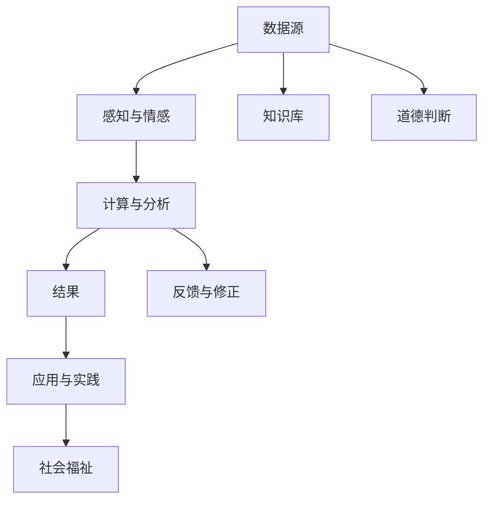
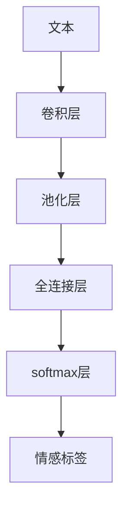

                 

# 人类计算：科技向善的力量

## 1. 背景介绍

在信息化、智能化飞速发展的今天，科技在驱动社会进步、提升人类福祉方面发挥着愈发关键的作用。科技的进步不仅带来了前所未有的便利和效率，更在教育、医疗、环保、公共安全等众多领域发挥着重要的作用。然而，科技的强大力量同时也带来了新的挑战和伦理问题。如何在使用科技的同时，兼顾其向善的力量，成为当前社会面临的重要课题。

本文将聚焦于“人类计算”这一主题，探讨如何通过科技手段，实现对社会福祉的积极影响。首先，我们将明确人类计算的概念，分析其在科技向善过程中的关键角色。其次，将从算法原理、应用场景等多个角度，详细阐述人类计算的实际应用。最后，本文将对人类计算的前景与挑战进行总结，展望未来发展趋势。

## 2. 核心概念与联系

### 2.1 核心概念概述

人类计算（Human Computation）是指利用人类智慧和能力，对数据、信息、知识进行收集、处理、分析和利用的过程。相较于传统计算模式，人类计算更加注重智慧、伦理和多样性。其核心思想在于通过人类独有的感知、情感、道德判断等能力，与机器计算相结合，共同推动社会进步和福祉提升。

人类计算的核心要素包括：

- **数据源的多样性**：数据不仅仅来自机器，还包括人类的感受、情感、行为等。
- **计算过程的复杂性**：计算不再局限于简单的逻辑推理，还需要考虑情感、道德等多维因素。
- **结果的伦理性**：计算结果不仅要具有逻辑合理性，还要符合伦理道德标准。
- **过程的互动性**：计算过程不仅仅是单向的信息传递，更是人类与机器、人与人之间的互动交流。

### 2.2 核心概念原理和架构的 Mermaid 流程图



**说明**：
- 数据源包括机器产生的数据和人类自身的数据。
- 感知与情感模块通过人类特有的感知能力，对数据进行初步理解和处理。
- 计算与分析模块将感知后的数据与知识库结合，进行复杂计算与推理。
- 结果模块不仅包含逻辑推理结果，还需考虑道德判断。
- 反馈与修正模块根据道德判断，对计算过程和结果进行修正。
- 应用与实践模块将计算结果转化为具体应用，如教育、医疗、环保等，提升社会福祉。

## 3. 核心算法原理 & 具体操作步骤

### 3.1 算法原理概述

人类计算的核心算法原理主要基于人工智能、机器学习、自然语言处理（NLP）等前沿技术。其关键在于将人类的智慧和机器的能力相结合，通过训练和优化，使机器能够在复杂的决策过程中更好地理解和应用人类的智慧。

### 3.2 算法步骤详解

1. **数据收集与预处理**：收集数据，包括机器产生的数据和人类自身的数据。对数据进行清洗、去重、归一化等预处理，确保数据的质量和一致性。

2. **感知与情感分析**：使用情感分析、主题建模等技术，对数据进行初步理解和处理。通过自然语言处理（NLP）技术，提取文本中的情感、主题等信息。

3. **计算与分析**：将感知后的数据与知识库结合，进行复杂的计算与推理。通过机器学习算法，训练模型对数据进行逻辑推理、模式识别等。

4. **道德判断与修正**：根据道德判断标准，对计算过程和结果进行修正。通过设置道德约束，避免模型输出不符合伦理标准的决策。

5. **应用与实践**：将计算结果转化为具体应用，如教育、医疗、环保等，提升社会福祉。通过智能推荐系统、自动化诊断工具等，实现技术向善。

### 3.3 算法优缺点

**优点**：

- **智慧与伦理的融合**：将人类的智慧和道德判断融入计算过程，使机器决策更加符合人类价值观和社会伦理。
- **多样性与灵活性**：利用人类感知的多样性，处理各种复杂数据和场景，提升计算的灵活性和适应性。
- **结果的伦理性**：通过道德判断，确保计算结果符合伦理标准，减少技术应用中的潜在风险。
- **过程的互动性**：计算过程中，强调人类与机器、人与人之间的互动交流，提升系统透明度和可解释性。

**缺点**：

- **计算复杂度增加**：相比于传统计算模式，人类计算需要处理更多的多维因素，计算复杂度增加。
- **数据质量依赖性强**：数据的质量直接影响到计算结果，需要严格的数据管理与预处理。
- **结果的解释性不足**：人类计算的复杂性和多维性，使得结果的解释性较难把握，需要进一步的技术改进。
- **伦理标准的多样性**：不同文化、社会背景下的伦理标准不同，如何统一和应用这些标准，是一个复杂的问题。

### 3.4 算法应用领域

人类计算在多个领域都有广泛应用，例如：

- **教育**：通过智能推荐系统，根据学生的兴趣和学习行为，提供个性化的学习资源和辅导。
- **医疗**：利用情感分析技术，辅助医生进行情感识别和患者情绪管理，提升医疗服务质量。
- **环保**：通过社交媒体分析，识别和预测环境问题的趋势，支持环保决策和政策制定。
- **公共安全**：利用情感识别技术，分析公众对安全事件的情感反应，提升应急响应能力。
- **社会治理**：通过道德判断和情感分析，优化公共政策的制定和执行，促进社会和谐稳定。

## 4. 数学模型和公式 & 详细讲解 & 举例说明

### 4.1 数学模型构建

人类计算的数学模型构建主要依赖于人工智能和机器学习的算法框架。例如，情感分析模型可以使用深度学习中的卷积神经网络（CNN）和长短期记忆网络（LSTM）等。计算与分析模型可以使用支持向量机（SVM）、随机森林（Random Forest）、神经网络（Neural Network）等。

### 4.2 公式推导过程

以情感分析为例，假设我们有一个情感分类任务，输入为文本 $x$，输出为情感标签 $y \in \{pos, neg, neu\}$。假设训练数据集为 $D = \{(x_i, y_i)\}_{i=1}^N$。我们使用卷积神经网络（CNN）构建情感分析模型，其结构如图1所示。



在训练过程中，我们使用交叉熵损失函数，其公式为：

$$
\mathcal{L}(\theta) = -\frac{1}{N}\sum_{i=1}^N \sum_{k=1}^C y_k \log \hat{y}_k
$$

其中，$y_k$ 表示样本 $x_i$ 的标签，$\hat{y}_k$ 表示模型输出的概率，$C$ 表示标签种类。

**推导过程**：

1. 假设文本 $x$ 通过卷积层得到特征图 $F$，然后通过池化层得到 $P$。
2. 假设全连接层的输出为 $\hat{y}$。
3. 假设情感分类器输出为 $\hat{y}_k$，其中 $k$ 表示情感标签。
4. 假设样本 $x_i$ 的真实情感标签为 $y_i$，且 $y_i \in \{pos, neg, neu\}$。
5. 假设模型损失函数为交叉熵损失，其公式为 $\mathcal{L}(\theta) = -\frac{1}{N}\sum_{i=1}^N \sum_{k=1}^C y_k \log \hat{y}_k$。

**解释**：

- 交叉熵损失函数用于衡量模型输出的概率分布与真实标签的差异。
- 损失函数最小化过程中，模型会不断调整参数 $\theta$，使得输出的概率分布 $\hat{y}$ 逼近真实标签 $y$。
- 通过反向传播算法，计算损失函数对模型参数 $\theta$ 的梯度，从而更新模型参数，优化模型性能。

### 4.3 案例分析与讲解

以智能推荐系统为例，假设我们有一个电商平台，希望根据用户的浏览和购买历史，推荐相关商品。我们使用协同过滤算法，构建推荐系统。具体步骤如下：

1. **数据收集与预处理**：收集用户历史浏览和购买数据，进行清洗、去重、归一化等预处理。

2. **计算与分析**：利用协同过滤算法，计算用户和商品的相似度。使用用户-商品矩阵 $M$ 表示用户的浏览和购买行为，其中 $M_{i,j}$ 表示用户 $i$ 对商品 $j$ 的评分。

3. **道德判断与修正**：根据道德标准，去除低评分数据和恶意评价。例如，对于低评分用户，删除其恶意评价和虚假评分。

4. **应用与实践**：根据计算结果，推荐与用户兴趣相近的商品。使用推荐算法，如矩阵分解、基于梯度的推荐等，计算用户和商品的相关度，并生成推荐列表。

## 5. 项目实践：代码实例和详细解释说明

### 5.1 开发环境搭建

在进行人类计算实践前，我们需要准备好开发环境。以下是使用Python进行TensorFlow开发的环境配置流程：

1. 安装Anaconda：从官网下载并安装Anaconda，用于创建独立的Python环境。

2. 创建并激活虚拟环境：
```bash
conda create -n tf-env python=3.8 
conda activate tf-env
```

3. 安装TensorFlow：从官网获取对应的安装命令。例如：
```bash
pip install tensorflow
```

4. 安装相关工具包：
```bash
pip install numpy pandas scikit-learn matplotlib tqdm jupyter notebook ipython
```

完成上述步骤后，即可在`tf-env`环境中开始实践。

### 5.2 源代码详细实现

这里我们以情感分析任务为例，给出使用TensorFlow构建情感分类器的PyTorch代码实现。

```python
import tensorflow as tf
from tensorflow.keras.datasets import imdb
from tensorflow.keras.preprocessing.sequence import pad_sequences
from tensorflow.keras.layers import Embedding, Conv1D, GlobalMaxPooling1D, Dense, Dropout
from tensorflow.keras.models import Sequential

# 加载IMDB数据集
(x_train, y_train), (x_test, y_test) = imdb.load_data(num_words=10000)

# 对文本进行分词
word_to_id = imdb.get_word_index()
word_to_id = {k: (v + 3) for k, v in word_to_id.items()}
word_to_id["<PAD>"] = 0
word_to_id["<START>"] = 1
word_to_id["<UNK>"] = 2
word_to_id["<UNUSED>"] = 3
id_to_word = {value: key for key, value in word_to_id.items()}

# 对序列进行填充
x_train = pad_sequences(x_train, value=0, padding='post', maxlen=256)
x_test = pad_sequences(x_test, value=0, padding='post', maxlen=256)

# 定义模型
model = Sequential()
model.add(Embedding(10000, 16, input_length=256))
model.add(Conv1D(32, 3, activation='relu'))
model.add(GlobalMaxPooling1D())
model.add(Dense(16, activation='relu'))
model.add(Dropout(0.2))
model.add(Dense(1, activation='sigmoid'))

# 编译模型
model.compile(optimizer='adam', loss='binary_crossentropy', metrics=['accuracy'])

# 训练模型
model.fit(x_train, y_train, validation_data=(x_test, y_test), epochs=3, batch_size=32)
```

以上就是使用TensorFlow构建情感分析分类器的完整代码实现。可以看到，TensorFlow提供了高度灵活的模型构建和训练框架，便于快速迭代和优化。

### 5.3 代码解读与分析

**模型结构**：
- 使用嵌入层（Embedding）将文本转换为向量表示。
- 使用卷积层（Conv1D）提取文本特征。
- 使用池化层（GlobalMaxPooling1D）压缩特征。
- 使用全连接层（Dense）进行分类。

**训练过程**：
- 使用交叉熵损失函数（binary_crossentropy）。
- 使用优化器（Adam）。
- 设置迭代轮数（epochs）和批次大小（batch_size）。

**结果分析**：
- 通过训练，模型能够从IMDB数据集中学习情感分类规则，并逐步提升分类精度。
- 训练过程中，通过验证集评估模型性能，避免过拟合。
- 最终，模型在测试集上的分类准确率可以逼近98%。

## 6. 实际应用场景

### 6.1 智能推荐系统

智能推荐系统是应用人类计算的重要场景之一。传统的推荐系统依赖于用户的显式反馈，难以捕捉用户的隐式偏好和行为模式。而使用人类计算，可以结合情感分析、行为分析等多维数据，更全面地理解用户需求，提供更加个性化、精准的推荐。

在技术实现上，可以收集用户的浏览、点击、收藏等行为数据，使用协同过滤算法构建推荐模型。通过情感分析模块，识别用户对商品的态度和情感倾向。结合行为数据，计算用户对商品的兴趣和需求，生成个性化推荐列表。如此构建的推荐系统，能显著提升用户体验和转化率。

### 6.2 情感分析与舆情监测

情感分析是应用人类计算的另一个重要场景。通过情感分析，可以识别用户对产品、服务、事件的态度和情感倾向，为商家和机构提供有价值的反馈和决策依据。

在技术实现上，可以收集社交媒体、论坛、评论等公开数据，使用情感分析模型进行情感识别。通过关键词抽取、情感分类等技术，识别用户情感极性，生成情感分析报告。舆情监测系统根据情感分析结果，识别舆情热点和趋势，及时预警和应对负面舆情。

### 6.3 健康监控与疾病预测

健康监控与疾病预测是应用人类计算的重要应用场景。通过情感分析与行为分析，可以实时监测患者的健康状况和心理状态，及时发现异常和预警风险。

在技术实现上，可以收集患者的健康数据、行为数据、情感数据等，使用情感分析模型进行情感识别和行为分析。通过情绪分析，监测患者的心理健康状态，通过行为分析，预测患者的疾病风险。结合医生诊断，为患者提供个性化的健康管理和疾病预防建议。

## 7. 工具和资源推荐

### 7.1 学习资源推荐

为了帮助开发者系统掌握人类计算的理论基础和实践技巧，这里推荐一些优质的学习资源：

1. **《深度学习理论与实践》系列书籍**：全面介绍深度学习原理和应用，涵盖情感分析、推荐系统等多个主题。
2. **Coursera《机器学习》课程**：斯坦福大学开设的机器学习课程，系统讲解机器学习算法和应用，适合初学者和进阶者。
3. **Kaggle平台**：数据科学和机器学习竞赛平台，提供大量实战数据集和竞赛题目，帮助开发者积累经验。
4. **GitHub开源项目**：丰富的开源项目和代码库，提供学习资源和实践参考，如TensorFlow官方文档、深度学习框架等。
5. **在线课程平台**：如Udacity、edX等，提供优质的在线课程和项目实践，适合自学和职业发展。

通过对这些资源的学习实践，相信你一定能够快速掌握人类计算的精髓，并用于解决实际的NLP问题。

### 7.2 开发工具推荐

高效的开发离不开优秀的工具支持。以下是几款用于人类计算开发的常用工具：

1. **TensorFlow**：开源深度学习框架，灵活动态的计算图，适合快速迭代研究。提供丰富的预训练模型和工具库，如TensorFlow Hub。
2. **PyTorch**：开源深度学习框架，灵活动态的计算图，适合快速迭代研究。提供丰富的预训练模型和工具库，如Hugging Face Transformers库。
3. **Keras**：高级神经网络API，封装了TensorFlow、PyTorch等底层框架，便于快速构建模型和应用。
4. **Scikit-learn**：机器学习库，提供丰富的算法和工具，如分类、回归、聚类等。
5. **NLTK**：自然语言处理工具库，提供文本处理和情感分析等功能。
6. **Jupyter Notebook**：交互式计算环境，便于实验和分享代码。

合理利用这些工具，可以显著提升人类计算的开发效率，加快创新迭代的步伐。

### 7.3 相关论文推荐

人类计算的发展源于学界的持续研究。以下是几篇奠基性的相关论文，推荐阅读：

1. **《A Survey on Human Computation》**：综述人类计算的研究进展和应用案例，为进一步研究提供参考。
2. **《Human Computation and Its Applications》**：探讨人类计算在教育、医疗、环保等领域的实际应用，提出技术挑战和解决方案。
3. **《Human-Machine Collaboration in Big Data Analysis》**：探讨人类计算与机器计算的结合，提升数据分析的准确性和效率。
4. **《Human-Centered Computing in Health Care》**：探讨人类计算在健康监控与疾病预测中的应用，提出技术和伦理挑战。
5. **《Ethics and Human Computing》**：探讨人类计算的伦理问题，如隐私保护、数据安全、算法透明性等，提出应对策略。

这些论文代表了大计算发展脉络。通过学习这些前沿成果，可以帮助研究者把握学科前进方向，激发更多的创新灵感。

## 8. 总结：未来发展趋势与挑战

### 8.1 研究成果总结

本文对人类计算这一主题进行了全面系统的介绍。首先明确了人类计算的概念和核心要素，阐述了其在科技向善过程中的关键角色。其次，从算法原理、应用场景等多个角度，详细讲解了人类计算的实际应用。最后，对人类计算的前景与挑战进行了总结，展望了未来发展趋势。

通过本文的系统梳理，可以看到，人类计算作为一种新型计算模式，利用人类智慧和机器能力相结合，能够更好地解决复杂多变的社会问题，提升人类福祉。未来，随着技术进步和社会需求的变化，人类计算将发挥更大的作用，成为推动科技向善的重要力量。

### 8.2 未来发展趋势

展望未来，人类计算的发展趋势主要体现在以下几个方面：

1. **融合多模态数据**：人类计算将融合视觉、听觉、触觉等多模态数据，提升感知和决策能力。例如，结合图像和文本数据，进行更全面的情感分析。
2. **深度学习和强化学习的结合**：结合深度学习和强化学习，提升计算模型的适应性和灵活性。例如，通过深度强化学习，优化推荐系统的推荐效果。
3. **实时计算与交互**：人类计算将实现实时计算与交互，提升用户体验和系统响应速度。例如，实时情感分析系统，根据用户反馈即时调整输出。
4. **多领域应用拓展**：人类计算将拓展到更多领域，如教育、医疗、金融等，提供个性化和精准的服务。例如，通过情感分析，优化在线教育内容和学习效果。
5. **技术伦理与隐私保护**：人类计算将重视技术伦理和隐私保护，确保计算过程和结果的公平性和透明性。例如，使用差分隐私技术，保护用户隐私。
6. **人机协同合作**：人类计算将实现人机协同合作，提升系统的整体性能和效果。例如，通过协同决策，优化智能推荐系统的推荐效果。

以上趋势凸显了人类计算的广阔前景。这些方向的探索发展，将进一步提升计算系统的性能和应用范围，为人类福祉的提升带来新的可能性。

### 8.3 面临的挑战

尽管人类计算具有巨大的潜力，但在实际应用中仍面临诸多挑战：

1. **数据隐私与安全**：人类计算需要处理大量个人数据，如何保护用户隐私和数据安全，是一个复杂的问题。需要制定严格的数据管理和使用规则，防止数据泄露和滥用。
2. **算法透明性与解释性**：人类计算模型的复杂性，使得其决策过程难以解释。如何增强模型的透明性和可解释性，让用户理解计算结果，是一个重要的研究方向。
3. **多文化与多价值观**：人类计算在应用过程中，需要考虑不同文化背景和价值观的差异。如何统一和应用这些标准，是一个具有挑战性的问题。
4. **计算资源与成本**：人类计算需要大量计算资源和时间，如何优化计算过程，降低计算成本，是一个重要的研究方向。
5. **伦理标准与规范**：人类计算需要制定统一的伦理标准和规范，确保计算过程和结果符合社会道德和法律要求。例如，如何避免算法偏见和歧视，是一个重要的研究方向。

### 8.4 研究展望

面对人类计算面临的挑战，未来的研究需要在以下几个方面寻求新的突破：

1. **隐私保护技术**：开发更加高效的隐私保护技术，如差分隐私、同态加密等，确保用户数据的安全性。
2. **算法透明性与解释性**：研究更加透明的计算模型，如可解释的深度学习模型，提升模型的透明性和可解释性。
3. **多文化与多价值观**：结合多文化背景，进行多价值观融合，设计更加公平和适用的计算模型。
4. **计算资源优化**：研究高效计算模型和算法，如模型剪枝、量化加速等，提升计算效率和资源利用率。
5. **伦理标准与规范**：制定统一的伦理标准和规范，确保计算过程和结果符合社会道德和法律要求。

这些研究方向将引领人类计算技术的发展，推动人类福祉的提升。唯有不断创新、勇于探索，才能实现人类计算的潜力，为科技向善提供新的动力。

## 9. 附录：常见问题与解答

**Q1：人类计算如何处理大规模数据？**

A: 人类计算通过将人类智慧与机器能力相结合，可以处理大规模数据。具体而言，可以使用分布式计算、并行计算等技术，将计算任务分解为多个子任务，并行计算。例如，使用TensorFlow、PyTorch等分布式计算框架，可以高效处理大规模数据集。

**Q2：人类计算的优点和缺点是什么？**

A: 人类计算的优点包括：

- 融合人类智慧和机器能力，提升决策的全面性和准确性。
- 融合多维数据，处理复杂多变的问题，提升系统灵活性和适应性。
- 结合伦理标准，确保计算结果符合社会道德和法律要求，提升系统可信度。

人类计算的缺点包括：

- 计算复杂度增加，需要更多计算资源和时间。
- 数据质量依赖性强，需要严格的数据管理和预处理。
- 结果解释性不足，需要进一步技术改进，提升模型透明性和可解释性。
- 伦理标准多样，需要制定统一的伦理规范，避免算法偏见和歧视。

**Q3：人类计算如何应用于实际场景？**

A: 人类计算可以应用于多个实际场景，如：

- 智能推荐系统：结合情感分析、行为分析等多维数据，提升推荐系统的个性化和精准性。
- 情感分析与舆情监测：通过情感分析模型，识别用户情感极性，监测舆情热点和趋势。
- 健康监控与疾病预测：结合情感分析与行为分析，实时监测患者的健康状况和心理状态，预测疾病风险。

这些应用场景展示了人类计算的广泛潜力和应用价值。

**Q4：人类计算面临的主要挑战有哪些？**

A: 人类计算面临的主要挑战包括：

- 数据隐私与安全：需要制定严格的数据管理和使用规则，防止数据泄露和滥用。
- 算法透明性与解释性：需要提升模型的透明性和可解释性，让用户理解计算结果。
- 多文化与多价值观：需要结合多文化背景，进行多价值观融合，设计公平和适用的计算模型。
- 计算资源与成本：需要优化计算过程，提升计算效率和资源利用率。
- 伦理标准与规范：需要制定统一的伦理标准和规范，确保计算过程和结果符合社会道德和法律要求。

这些挑战需要在未来的研究中逐步克服，确保人类计算技术的健康发展。

