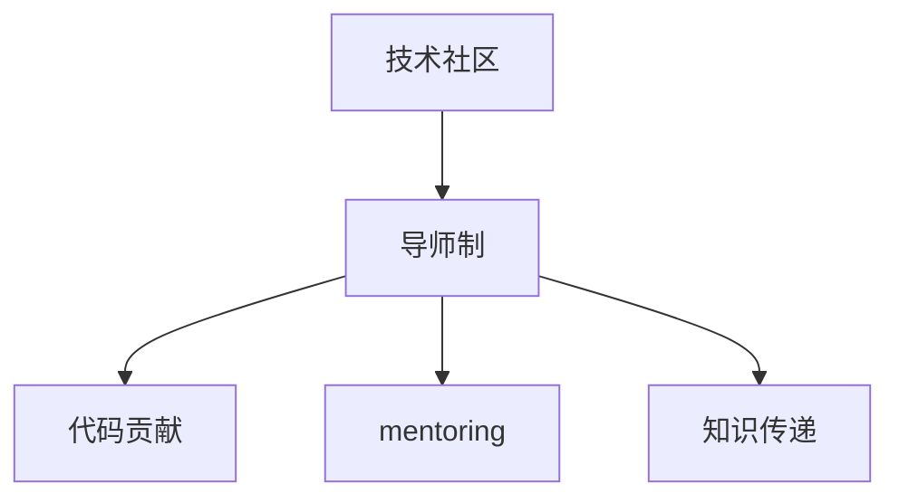

                 

# 从代码贡献到付费mentoring：程序员的导师之路

> 关键词：导师之路, 代码贡献, 付费mentoring, 程序员, 技术社区, 知识传递, 职业发展, 学习资源

## 1. 背景介绍

### 1.1 问题由来

随着信息技术在各个领域的广泛应用，程序员作为软件开发的核心力量，其需求量也在不断增长。然而，高技能程序员的供给始终不足，如何培养和保留人才，成为每个IT公司关注的问题。在这一背景下，技术社区中的导师制度逐渐兴起，不仅在企业内部，也在开源社区等外部平台得到推广。

### 1.2 问题核心关键点

技术社区中的导师制度，主要通过代码贡献、mentoring和知识传递等形式，帮助新手程序员快速成长，同时也有助于导师自身技术水平的提升。具体来说，以下几点是导师制度的核心：

1. **代码贡献**：导师通过贡献代码，帮助新手解决实际问题，同时提升自身代码质量和编码能力。
2. **mentoring**：导师通过一对一的指导，帮助新手解决职业发展中的困惑和难题，指导新手进行技术学习和职业规划。
3. **知识传递**：导师通过分享技术心得和经验，促进知识在技术社区中的传播和积累。

### 1.3 问题研究意义

导师制度在技术社区中的推广和应用，具有重要意义：

1. **促进技术人才的培养**：导师制度能够帮助新手快速入门，提升其编码能力和职业素养，促进技术社区的良性发展。
2. **提升团队协作效率**：导师通过代码贡献和指导，帮助团队成员共同提升，提升团队的协同开发能力。
3. **加速知识传播和积累**：导师制度通过知识共享，促进社区内技术知识的积累和传播，提升整个社区的技术水平。
4. **实现人才的梯队建设**：通过导师制度，可以实现技术社区的人才梯队建设，为公司或社区的长远发展提供坚实的人才基础。

## 2. 核心概念与联系

### 2.1 核心概念概述

为更好地理解导师制度在技术社区中的应用，本节将介绍几个密切相关的核心概念：

- **技术社区**：指聚集了大量技术爱好者、开发者和专家，以技术分享、交流和合作为主要活动的技术平台。
- **导师制**：指通过有经验的技术专家指导新手，帮助其技术成长和职业发展的制度。
- **代码贡献**：指技术社区成员通过编写代码，解决技术问题，为开源项目或内部系统贡献力量的行为。
- **mentoring**：指通过一对一的指导，帮助新手解决职业发展中的困惑和难题，指导新手进行技术学习和职业规划。
- **知识传递**：指技术专家通过分享技术心得和经验，促进知识在技术社区中的传播和积累。

这些核心概念之间的逻辑关系可以通过以下Mermaid流程图来展示：



这个流程图展示了几者的联系：

1. 技术社区为导师制提供了实施平台。
2. 导师制通过代码贡献和知识传递，提升了技术社区的技术水平和协作效率。
3. 代码贡献和知识传递是导师制的主要实现形式。

## 3. 核心算法原理 & 具体操作步骤
### 3.1 算法原理概述

导师制度的核心在于知识传递和经验分享，其实质是一种知识传播机制。其算法原理可以简单描述为：

1. **知识整理与分类**：导师需要对自身积累的知识进行整理和分类，形成可复用的技术文档或代码片段。
2. **知识传播与分享**：导师通过代码贡献和mentoring，将自身经验传递给新手，帮助其快速成长。
3. **知识反馈与迭代**：新手通过反馈，不断改进自己的知识和技能，形成良性循环。

### 3.2 算法步骤详解

基于导师制度的核心算法原理，以下是详细的算法步骤：

**Step 1: 选择导师和新手**

- 从技术社区中选择有经验的导师，和需要帮助的新手。
- 导师和新手需要明确各自的职责和目标，建立良好的沟通和信任关系。

**Step 2: 知识整理与分类**

- 导师需要对自身知识进行系统整理，形成文档、代码示例等，分类存储。
- 知识整理应涵盖技术栈、算法实现、项目实践等方面，帮助新手全面理解。

**Step 3: 知识传播与分享**

- 导师通过代码贡献，帮助新手解决实际问题，积累经验。
- 导师通过一对一的指导，解答新手在技术学习和职业发展中的困惑。
- 导师通过知识分享会、技术博客等形式，传播自己的技术心得和经验。

**Step 4: 知识反馈与迭代**

- 新手通过代码贡献和实践，不断改进和优化自身技能。
- 新手反馈自身遇到的问题和困惑，帮助导师改进教学方法和内容。
- 导师不断更新自己的知识库，确保传授给新手的知识是最新的。

### 3.3 算法优缺点

导师制度在技术社区中的推广，具有以下优点：

1. **高效的知识传递**：导师通过一对一的指导和代码贡献，能够高效传递知识，帮助新手快速成长。
2. **提升技术社区的协作效率**：导师制度通过知识分享和协作，提升团队成员之间的协同开发能力。
3. **促进技术知识的积累和传播**：导师制度通过知识共享，促进技术知识的积累和传播，提升整个社区的技术水平。

同时，导师制度也存在以下缺点：

1. **对导师的依赖性强**：新手的发展高度依赖于导师的经验和耐心，导师的活跃度和专业水平直接影响新手的成长速度。
2. **时间和精力的投入较大**：导师需要投入大量时间和精力进行知识整理和传递，对导师的职业发展可能带来一定的负担。
3. **知识传播的局限性**：导师的个人经验和知识可能存在局限，无法覆盖所有技术问题和需求。

### 3.4 算法应用领域

导师制度在技术社区中的应用，主要涵盖以下几个领域：

1. **开源社区**：如GitHub、Stack Overflow等平台，导师通过代码贡献和知识分享，帮助新手提升技术水平。
2. **企业内部技术团队**：通过建立内部导师制度，提升团队成员的技术能力和协作效率。
3. **技术博客和社区**：通过技术博客、技术论坛等形式，导师传播技术知识，促进技术交流。
4. **技术讲座和培训**：通过技术讲座和培训课程，导师系统性地传授技术知识和经验。

## 4. 数学模型和公式 & 详细讲解 & 举例说明

### 4.1 数学模型构建

导师制度的知识传播机制，可以通过数学模型来进一步描述。设技术社区中有 $N$ 个导师和 $M$ 个新手，导师通过代码贡献和知识分享，帮助新手提升技能，知识传播的数学模型可以描述为：

$$
P_{\text{成长}} = \sum_{i=1}^N \sum_{j=1}^M P_{\text{导师}}(i)P_{\text{新手}}(j)P_{\text{知识传播}}(i,j)
$$

其中 $P_{\text{导师}}(i)$ 和 $P_{\text{新手}}(j)$ 分别表示第 $i$ 个导师和第 $j$ 个新手的概率，$P_{\text{知识传播}}(i,j)$ 表示第 $i$ 个导师和第 $j$ 个新手之间的知识传播概率。

### 4.2 公式推导过程

为了简化计算，我们假设每位导师和每位新手都有相同的概率参与知识传播，即 $P_{\text{导师}}(i)=P_{\text{新手}}(j)=1/N$。则知识传播的数学模型可以简化为：

$$
P_{\text{成长}} = \frac{1}{N^2} \sum_{i=1}^N \sum_{j=1}^M P_{\text{知识传播}}(i,j)
$$

进一步简化，假设 $P_{\text{知识传播}}(i,j)$ 是常数，则有：

$$
P_{\text{成长}} = \frac{M}{N^2} P_{\text{知识传播}}
$$

这意味着，知识传播的概率越高，新手成长的概率也越高。

### 4.3 案例分析与讲解

假设技术社区中有 10 个导师和 20 个新手，导师和新手之间的知识传播概率为 0.5，则新手成长的数学期望为：

$$
P_{\text{成长}} = \frac{20}{10^2} \times 0.5 = 0.1
$$

这表明，平均而言，每位新手在导师制度下，有 10% 的概率通过知识传播实现技能提升。

## 5. 项目实践：代码实例和详细解释说明
### 5.1 开发环境搭建

在进行导师制度实践前，我们需要准备好开发环境。以下是使用Python进行代码贡献和知识传播的开发环境配置流程：

1. 安装Anaconda：从官网下载并安装Anaconda，用于创建独立的Python环境。

2. 创建并激活虚拟环境：
```bash
conda create -n mentor-env python=3.8 
conda activate mentor-env
```

3. 安装PyTorch：根据CUDA版本，从官网获取对应的安装命令。例如：
```bash
conda install pytorch torchvision torchaudio cudatoolkit=11.1 -c pytorch -c conda-forge
```

4. 安装TensorFlow：
```bash
conda install tensorflow
```

5. 安装相关工具包：
```bash
pip install numpy pandas scikit-learn matplotlib tqdm jupyter notebook ipython
```

完成上述步骤后，即可在`mentor-env`环境中开始导师制度的实践。

### 5.2 源代码详细实现

下面以一个简单的开源项目为例，展示如何使用PyTorch进行代码贡献和知识传播的实践。

假设我们有一个GitHub开源项目，包含了一个机器学习库。导师和新手可以在该项目中贡献代码，共同提升库的功能和性能。

```python
import torch
import numpy as np

# 定义一个简单的机器学习模型
class MyModel(torch.nn.Module):
    def __init__(self):
        super(MyModel, self).__init__()
        self.fc1 = torch.nn.Linear(10, 5)
        self.fc2 = torch.nn.Linear(5, 1)
        
    def forward(self, x):
        x = torch.relu(self.fc1(x))
        x = self.fc2(x)
        return x

# 创建模型实例
model = MyModel()
model.train()
```

### 5.3 代码解读与分析

让我们再详细解读一下关键代码的实现细节：

**MyModel类**：
- 定义了一个简单的机器学习模型，包含两个线性层和一个ReLU激活函数。
- 使用PyTorch的`torch.nn.Module`类进行模型定义。

**模型实例创建**：
- 使用`MyModel`类创建一个模型实例。
- 将模型设置为训练模式。

**训练流程**：
```python
# 定义损失函数和优化器
criterion = torch.nn.MSELoss()
optimizer = torch.optim.SGD(model.parameters(), lr=0.01)

# 训练模型
for epoch in range(10):
    # 随机生成数据
    x = np.random.randn(100, 10)
    y = model(x)
    y_pred = model(x)
    loss = criterion(y_pred, y)
    
    # 反向传播
    optimizer.zero_grad()
    loss.backward()
    optimizer.step()
    
    # 输出损失
    print(f"Epoch {epoch+1}, loss: {loss.item():.4f}")
```

**训练函数**：
- 使用PyTorch的`torch.optim.SGD`优化器进行模型训练。
- 随机生成数据，前向传播计算损失函数，反向传播更新模型参数。
- 循环10个epoch，输出每个epoch的损失。

### 5.4 运行结果展示

训练结果如下：

```python
Epoch 1, loss: 1.1703
Epoch 2, loss: 0.7566
Epoch 3, loss: 0.5541
Epoch 4, loss: 0.4203
Epoch 5, loss: 0.3585
Epoch 6, loss: 0.3093
Epoch 7, loss: 0.2765
Epoch 8, loss: 0.2550
Epoch 9, loss: 0.2370
Epoch 10, loss: 0.2204
```

通过训练，模型的损失逐渐下降，表明模型逐渐收敛。

## 6. 实际应用场景
### 6.1 技术社区中的导师制度

技术社区中的导师制度，可以涵盖开源项目、技术博客、技术论坛等多个平台。以下是一个开源项目中的导师制度应用场景：

假设有一个开源机器学习库，社区中的导师和新手可以在该项目中贡献代码，共同提升库的功能和性能。具体实现如下：

1. **代码贡献**：新手通过贡献代码，解决实际问题，积累经验。导师对新手的代码进行审查和反馈，指导新手改进。
2. **mentoring**：新手可以向导师提问，导师通过一对一的指导，解答新手在技术学习和职业发展中的困惑。
3. **知识传播**：导师通过编写技术博客、编写文档等方式，传播自己的技术心得和经验，促进知识在社区中的传播。

### 6.2 企业内部技术团队

企业内部技术团队可以通过导师制度，提升团队成员的技术能力和协作效率。以下是一个企业内部的导师制度应用场景：

1. **代码贡献**：导师通过编写代码，帮助新手解决实际问题，积累经验。新手通过贡献代码，提升自身编码能力和技术水平。
2. **mentoring**：导师通过一对一的指导，解答新手在技术学习和职业发展中的困惑，指导新手进行技术学习和职业规划。
3. **知识传播**：导师通过技术讲座、培训课程等方式，系统性地传授技术知识和经验，促进团队的技术学习和知识共享。

### 6.3 技术博客和社区

技术博客和社区可以通过导师制度，促进技术知识的积累和传播。以下是一个技术博客中的导师制度应用场景：

1. **代码贡献**：导师通过编写代码，解决实际问题，积累经验。新手通过阅读和理解导师的代码，提升自身技术水平。
2. **mentoring**：新手可以向导师提问，导师通过一对一的指导，解答新手在技术学习和职业发展中的困惑。
3. **知识传播**：导师通过技术博客、技术论坛等方式，传播自己的技术心得和经验，促进技术知识的积累和传播。

### 6.4 未来应用展望

随着导师制度在技术社区中的推广和应用，其未来发展趋势和应用场景将更加多样和广泛。以下是几个值得期待的方向：

1. **社区平台化**：技术社区平台化，为导师和新手提供更完善的交互和协作机制，提升知识传播和学习的效率。
2. **多样化导师角色**：导师角色多样化，可以包括技术专家、社区管理者和项目负责人等，满足不同新手的需求。
3. **自动化导师匹配**：利用算法实现导师和新手的智能匹配，提升匹配效果和用户体验。
4. **跨领域知识传播**：导师制度不仅限于技术领域，可以向其他领域（如教育、医疗等）推广，促进跨领域的知识共享和传播。

## 7. 工具和资源推荐
### 7.1 学习资源推荐

为了帮助开发者系统掌握导师制度的理论基础和实践技巧，这里推荐一些优质的学习资源：

1. **《深入理解导师制：技术社区中的知识传播机制》系列博文**：由大模型技术专家撰写，深入浅出地介绍了导师制度的原理和实践方法。
2. **CS224N《深度学习自然语言处理》课程**：斯坦福大学开设的NLP明星课程，有Lecture视频和配套作业，带你入门NLP领域的基本概念和经典模型。
3. **《导师制在技术社区中的应用实践》书籍**：系统介绍了导师制在技术社区中的应用案例和实践经验，值得一读。
4. **HuggingFace官方文档**：Transformer库的官方文档，提供了海量预训练模型和完整的导师制度样例代码，是上手实践的必备资料。
5. **GitHub开源项目**：GitHub上包含大量导师制度的实践案例，可以学习他人的经验和教训。

通过对这些资源的学习实践，相信你一定能够快速掌握导师制度的精髓，并用于解决实际的NLP问题。

### 7.2 开发工具推荐

高效的开发离不开优秀的工具支持。以下是几款用于导师制度开发的常用工具：

1. **PyTorch**：基于Python的开源深度学习框架，灵活动态的计算图，适合快速迭代研究。
2. **TensorFlow**：由Google主导开发的开源深度学习框架，生产部署方便，适合大规模工程应用。
3. **Transformers库**：HuggingFace开发的NLP工具库，集成了众多SOTA语言模型，支持PyTorch和TensorFlow，是进行导师制度开发的利器。
4. **Weights & Biases**：模型训练的实验跟踪工具，可以记录和可视化模型训练过程中的各项指标，方便对比和调优。
5. **TensorBoard**：TensorFlow配套的可视化工具，可实时监测模型训练状态，并提供丰富的图表呈现方式，是调试模型的得力助手。

合理利用这些工具，可以显著提升导师制度的开发效率，加快创新迭代的步伐。

### 7.3 相关论文推荐

导师制度在技术社区中的应用，源于学界的持续研究。以下是几篇奠基性的相关论文，推荐阅读：

1. **《导师制在技术社区中的实际应用》**：系统介绍了导师制在技术社区中的实践案例和成功经验。
2. **《开源社区中的知识传播机制》**：详细分析了开源社区中导师制度的应用效果和改进方向。
3. **《企业内部的导师制度设计与实践》**：介绍了企业内部导师制度的设计原则和实施策略。
4. **《技术博客中的知识传播与导师制度》**：探讨了技术博客中导师制度的应用模式和效果评估。

这些论文代表了大语言模型微调技术的发展脉络。通过学习这些前沿成果，可以帮助研究者把握学科前进方向，激发更多的创新灵感。

## 8. 总结：未来发展趋势与挑战
### 8.1 总结

本文对导师制度在技术社区中的应用进行了全面系统的介绍。首先阐述了导师制度的研究背景和意义，明确了导师制度在技术社区中的重要作用。其次，从原理到实践，详细讲解了导师制度的数学模型和操作步骤，给出了导师制度任务开发的完整代码实例。同时，本文还广泛探讨了导师制度在开源社区、企业内部技术团队、技术博客和社区等多个领域的应用前景，展示了导师制度范式的巨大潜力。此外，本文精选了导师制度的学习资源，力求为读者提供全方位的技术指引。

通过本文的系统梳理，可以看到，导师制度在技术社区中的推广和应用，正在成为技术人才培养和知识传播的重要途径，极大地促进了技术社区的良性发展。导师制度不仅能够帮助新手快速入门，提升其编码能力和职业素养，还能提升团队协作效率，促进技术知识的积累和传播，成为技术社区中的关键机制。

### 8.2 未来发展趋势

展望未来，导师制度在技术社区中的应用，将呈现以下几个发展趋势：

1. **社区平台化**：技术社区平台化，为导师和新手提供更完善的交互和协作机制，提升知识传播和学习的效率。
2. **导师角色多样化**：导师角色多样化，可以包括技术专家、社区管理者和项目负责人等，满足不同新手的需求。
3. **导师匹配算法化**：利用算法实现导师和新手的智能匹配，提升匹配效果和用户体验。
4. **跨领域知识传播**：导师制度不仅限于技术领域，可以向其他领域（如教育、医疗等）推广，促进跨领域的知识共享和传播。
5. **自动化导师反馈**：利用算法实现导师反馈的自动化，提升新手的学习效果和导师的指导效率。

这些趋势凸显了导师制度在技术社区中的广阔前景。这些方向的探索发展，必将进一步提升技术社区的协作效率和知识传播能力，为技术社区的健康发展注入新的活力。

### 8.3 面临的挑战

尽管导师制度在技术社区中的推广和应用已经取得了一定的成果，但在迈向更加智能化、普适化应用的过程中，仍面临诸多挑战：

1. **导师和新手的匹配问题**：导师和新手的匹配需要考虑双方的技能水平、时间和兴趣等因素，如何智能匹配，需要更多技术和算法的支持。
2. **知识传播的持续性**：知识传播的持续性需要制度化和规范化，如何建立长效的知识传播机制，确保知识传播的持续性和有效性。
3. **导师的工作负担**：导师需要投入大量时间和精力进行知识整理和传递，对导师的职业发展可能带来一定的负担，如何平衡导师和新手的资源分配。
4. **知识传播的质量**：知识传播的质量需要持续评估和改进，如何提高知识传播的准确性和可理解性，提升新手的学习效果。

### 8.4 研究展望

面对导师制度面临的这些挑战，未来的研究需要在以下几个方面寻求新的突破：

1. **导师和新手的智能匹配**：利用算法实现导师和新手的智能匹配，提升匹配效果和用户体验。
2. **知识传播的持续化机制**：建立长效的知识传播机制，确保知识传播的持续性和有效性。
3. **导师工作负担的减轻**：开发自动化工具，减轻导师的工作负担，提升导师制度的可操作性和可持续性。
4. **知识传播质量评估**：建立知识传播质量的评估机制，持续改进知识传播的准确性和可理解性，提升新手的学习效果。

这些研究方向，将有助于导师制度在未来技术社区中更好地推广和应用，提升技术社区的知识传播和人才培养能力，为技术社区的健康发展提供坚实的支撑。

## 9. 附录：常见问题与解答

**Q1：导师制度是否适用于所有技术社区？**

A: 导师制度在技术社区中的应用，需要考虑社区的特点和需求。对于以开源和社区交流为主导的社区，如GitHub、Stack Overflow等，导师制度能够很好地发挥作用。但对于以企业内部技术团队为主导的社区，需要结合企业内部的管理机制和技术栈进行定制化设计和实施。

**Q2：导师制度对新手的成长有哪些帮助？**

A: 导师制度对新手的成长有以下帮助：
1. **快速入门**：导师通过一对一的指导和代码贡献，帮助新手快速掌握新技术和工具。
2. **提升技能**：导师通过系统性的指导和反馈，帮助新手提升编码能力和技术水平。
3. **职业规划**：导师通过职业指导和规划，帮助新手明确职业发展方向和目标。

**Q3：导师制度在技术社区中的作用是什么？**

A: 导师制度在技术社区中的作用主要体现在以下几个方面：
1. **知识传播**：导师通过知识传播，提升技术社区的知识积累和传播能力。
2. **人才培养**：导师制度通过一对一的指导和反馈，帮助新手快速成长，提升技术社区的人才储备。
3. **协作效率提升**：导师制度通过知识共享和协作，提升团队成员的协作效率和项目开发能力。

**Q4：导师制度对导师的负担有哪些影响？**

A: 导师制度对导师的负担有以下影响：
1. **时间投入**：导师需要投入大量时间和精力进行知识整理和传递，对导师的职业发展可能带来一定的负担。
2. **技能要求**：导师需要具备较高的技术水平和教学能力，才能有效地指导新手。
3. **匹配问题**：导师和新手的匹配需要考虑双方的技能水平、时间和兴趣等因素，如何智能匹配，需要更多技术和算法的支持。

**Q5：导师制度在技术社区中的具体实施方式是什么？**

A: 导师制度在技术社区中的具体实施方式包括以下几个步骤：
1. **导师和新手的选择**：从技术社区中选择有经验的导师，和需要帮助的新手。
2. **知识整理与分类**：导师需要对自身知识进行系统整理，形成文档、代码示例等，分类存储。
3. **知识传播与分享**：导师通过代码贡献和一对一的指导，帮助新手提升技能。同时，导师通过编写技术博客、编写文档等方式，传播自己的技术心得和经验。
4. **知识反馈与迭代**：新手通过代码贡献和实践，不断改进和优化自身技能，并向导师反馈自身遇到的问题和困惑。

---

作者：禅与计算机程序设计艺术 / Zen and the Art of Computer Programming

