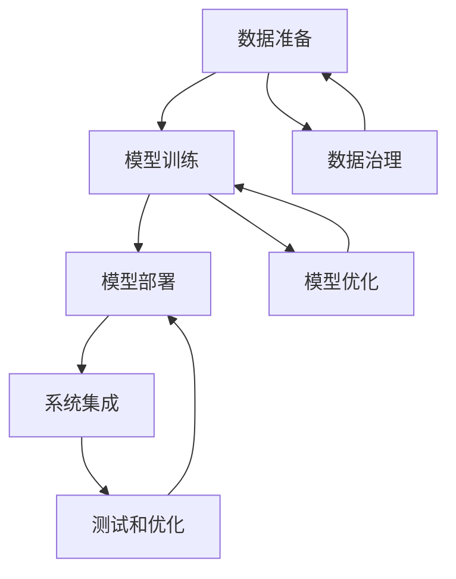

                 

# 从头开始构建端到端的 AI 应用

> 关键词：AI 应用开发，端到端系统，数据流分析，模型训练，部署，自动化测试，持续集成，云平台

## 1. 背景介绍

### 1.1 问题由来

在现代信息技术快速发展的背景下，人工智能(AI)技术正逐步渗透到各个领域，包括医疗、金融、教育、制造等。越来越多的企业和组织认识到，AI可以极大地提高效率，降低成本，创造更多商业价值。但与此同时，AI应用的开发和部署变得越来越复杂，仅依赖数据科学家和工程师的协作已经难以满足快速迭代的需求。

人工智能应用的开发涉及多个环节，包括数据准备、模型训练、模型评估、模型部署、运维监控等。每一个环节都需要专业技能，从数据工程师、算法工程师到部署工程师、运维工程师，分工明确。然而，这种分工方式容易导致数据和模型的割裂，各环节之间的协作效率低下，严重影响AI应用的开发进度和质量。

如何构建端到端的AI应用，使AI技术能够无缝集成到企业的业务流程中，成为当前AI开发的一个核心问题。

### 1.2 问题核心关键点

构建端到端的AI应用需要关注以下几个关键点：

- **数据准备和治理**：确保数据的质量、完整性和一致性，满足模型训练的需求。
- **模型训练和优化**：选择合适的算法和模型，训练出高精度的AI模型。
- **模型部署和运维**：将训练好的模型集成到实际应用中，并提供实时监控和自动更新机制。
- **系统集成和测试**：构建完整的AI应用系统，包括数据接入、模型推理、结果输出等功能模块，并进行全面的自动化测试。
- **数据隐私和安全**：在数据和模型使用过程中，确保数据的隐私和安全，遵守法律法规。

## 2. 核心概念与联系

### 2.1 核心概念概述

构建端到端的AI应用涉及多个关键概念，包括数据准备、模型训练、模型部署、系统集成等。这些概念之间存在着紧密的联系，相互影响，共同构成了AI应用开发的全流程。

- **数据准备**：包括数据采集、数据清洗、数据标注等环节，是AI模型训练的基础。
- **模型训练**：使用机器学习算法对数据进行训练，得到可用于推理的模型。
- **模型部署**：将训练好的模型集成到实际应用中，提供推理服务。
- **系统集成**：将数据接入、模型推理、结果输出等功能模块集成在一起，构建完整的AI应用系统。
- **测试和优化**：对AI应用系统进行自动化测试，确保系统稳定运行，并进行性能优化。

### 2.2 核心概念原理和架构的 Mermaid 流程图



这个流程图展示了数据准备、模型训练、模型部署、系统集成、测试和优化等关键环节之间的联系。各环节之间相互依赖，共同构成了端到端的AI应用开发流程。

## 3. 核心算法原理 & 具体操作步骤

### 3.1 算法原理概述

构建端到端的AI应用，需要综合运用数据科学、机器学习、软件工程等多领域的知识和技能。本节将介绍几个核心算法的原理，包括模型训练、模型优化、系统集成等。

#### 3.1.1 模型训练

模型训练是AI应用开发的核心环节，目的是通过数据训练得到可用于推理的高精度模型。常用的模型训练算法包括监督学习、无监督学习和半监督学习等。

- **监督学习**：使用标注数据训练模型，模型通过学习输入和输出之间的映射关系，进行预测或分类。
- **无监督学习**：使用未标注数据训练模型，模型通过聚类、降维等方法，发现数据的内在结构和规律。
- **半监督学习**：结合少量标注数据和大量未标注数据，训练模型，提高模型的泛化能力。

#### 3.1.2 模型优化

模型训练完成后，需要对模型进行优化，以提高模型的性能和泛化能力。常用的模型优化算法包括正则化、Dropout、early stopping等。

- **正则化**：通过添加L1或L2正则化项，限制模型参数的大小，防止过拟合。
- **Dropout**：在训练过程中随机丢弃一些神经元，减少模型的复杂度，防止过拟合。
- **early stopping**：在训练过程中监控验证集的性能，一旦性能不再提升，立即停止训练，避免过拟合。

#### 3.1.3 系统集成

系统集成是将数据接入、模型推理、结果输出等功能模块集成在一起，构建完整的AI应用系统。常用的系统集成框架包括微服务架构、RESTful API等。

- **微服务架构**：将系统分解为多个独立运行的服务，每个服务负责特定功能，通过轻量级通信机制（如HTTP RESTful API）进行交互。
- **RESTful API**：通过HTTP协议，提供简单的、标准的接口，方便不同系统之间的通信和数据交换。

### 3.2 算法步骤详解

构建端到端的AI应用，需要按照一定的步骤进行操作，包括数据准备、模型训练、模型部署、系统集成等。

#### 3.2.1 数据准备

1. **数据采集**：收集相关的数据，包括结构化数据（如数据库、CSV文件）和非结构化数据（如文本、图片、视频）。
2. **数据清洗**：对数据进行去重、去噪、标准化等处理，确保数据质量。
3. **数据标注**：对部分数据进行标注，为模型训练提供监督信号。

#### 3.2.2 模型训练

1. **选择算法和模型**：根据任务类型和数据特点，选择合适的算法和模型。
2. **数据预处理**：对数据进行归一化、特征工程等处理，为模型训练做准备。
3. **模型训练**：使用训练数据训练模型，调整超参数，提高模型精度。
4. **模型评估**：使用验证数据评估模型性能，选择最优模型。

#### 3.2.3 模型部署

1. **模型优化**：对模型进行优化，如剪枝、量化、压缩等，减小模型大小，提高推理速度。
2. **模型打包**：将训练好的模型、配置文件等打包成可部署的包，方便后续部署。
3. **模型部署**：将模型部署到服务器或云平台，提供推理服务。

#### 3.2.4 系统集成

1. **功能模块设计**：设计数据接入、模型推理、结果输出等功能模块，确定模块间的接口。
2. **模块集成**：将功能模块集成在一起，构建完整的AI应用系统。
3. **系统测试**：对AI应用系统进行全面的自动化测试，确保系统稳定运行。

### 3.3 算法优缺点

#### 3.3.1 模型训练

**优点**：
- 能够通过标注数据训练出高精度的模型。
- 训练过程可以通过超参数调优，提升模型性能。

**缺点**：
- 依赖标注数据，标注成本高。
- 数据量大，训练时间长，计算资源需求高。

#### 3.3.2 模型优化

**优点**：
- 能够防止过拟合，提高模型的泛化能力。
- 优化过程可以自动化，降低人力成本。

**缺点**：
- 优化过程可能改变模型结构，影响模型性能。
- 优化过程需要反复实验，调优难度大。

#### 3.3.3 系统集成

**优点**：
- 能够将各个模块集成在一起，构建完整的AI应用系统。
- 系统模块化设计，方便扩展和维护。

**缺点**：
- 集成过程中可能出现接口不兼容、数据不一致等问题。
- 系统复杂度高，调试难度大。

### 3.4 算法应用领域

构建端到端的AI应用，在多个领域都有广泛的应用。以下是几个典型领域：

#### 3.4.1 医疗健康

AI技术可以用于医疗健康领域，辅助医生进行疾病诊断、治疗方案推荐等。通过构建端到端的AI应用系统，可以实时分析患者数据，提供个性化的诊疗建议。

#### 3.4.2 金融保险

AI技术可以用于金融保险领域，进行信用评估、风险控制、投资决策等。通过构建端到端的AI应用系统，可以实时分析市场数据，预测股票价格、客户信用等级等，提高决策效率和准确性。

#### 3.4.3 智能制造

AI技术可以用于智能制造领域，进行设备故障预测、生产计划优化等。通过构建端到端的AI应用系统，可以实时监测设备状态，预测设备故障，优化生产计划，提高生产效率和质量。

## 4. 数学模型和公式 & 详细讲解 & 举例说明

### 4.1 数学模型构建

构建端到端的AI应用，需要构建多个数学模型，包括数据模型、模型训练模型、系统集成模型等。

#### 4.1.1 数据模型

数据模型用于描述数据的结构和特性，常用的数据模型包括关系型数据库、非关系型数据库、数据仓库等。

- **关系型数据库**：使用表格形式存储结构化数据，支持复杂的查询和事务操作。
- **非关系型数据库**：使用键值对、文档、图形等形式存储非结构化数据，支持高并发读写。
- **数据仓库**：使用维度模型存储历史数据，支持OLAP分析和数据挖掘。

#### 4.1.2 模型训练模型

模型训练模型用于描述训练模型的算法和流程，常用的模型训练算法包括监督学习、无监督学习和半监督学习等。

- **监督学习**：使用标注数据训练模型，模型通过学习输入和输出之间的映射关系，进行预测或分类。
- **无监督学习**：使用未标注数据训练模型，模型通过聚类、降维等方法，发现数据的内在结构和规律。
- **半监督学习**：结合少量标注数据和大量未标注数据，训练模型，提高模型的泛化能力。

#### 4.1.3 系统集成模型

系统集成模型用于描述系统集成的框架和接口，常用的系统集成框架包括微服务架构、RESTful API等。

- **微服务架构**：将系统分解为多个独立运行的服务，每个服务负责特定功能，通过轻量级通信机制（如HTTP RESTful API）进行交互。
- **RESTful API**：通过HTTP协议，提供简单的、标准的接口，方便不同系统之间的通信和数据交换。

### 4.2 公式推导过程

#### 4.2.1 监督学习

监督学习模型的训练过程可以表示为：

$$
\theta^* = \mathop{\arg\min}_{\theta} \frac{1}{N} \sum_{i=1}^N \ell(y_i, \hat{y}_i)
$$

其中，$\theta$ 为模型参数，$y_i$ 为真实标签，$\hat{y}_i$ 为模型预测结果，$\ell$ 为损失函数，常用的损失函数包括均方误差、交叉熵等。

#### 4.2.2 正则化

正则化可以通过在损失函数中添加正则化项来实现：

$$
\theta^* = \mathop{\arg\min}_{\theta} \frac{1}{N} \sum_{i=1}^N \ell(y_i, \hat{y}_i) + \lambda \sum_{i=1}^N \|w_i\|
$$

其中，$\lambda$ 为正则化系数，$\|w_i\|$ 为参数 $w_i$ 的L2范数。

### 4.3 案例分析与讲解

#### 4.3.1 医疗健康

以医疗健康领域的AI应用为例，构建端到端的AI应用系统。系统包括以下几个模块：

- **数据接入**：通过API接口，将患者数据导入系统，包括电子病历、检验报告等。
- **模型推理**：通过模型推理服务，对患者数据进行分析，提供诊疗建议。
- **结果输出**：将诊疗建议展示给医生，供医生参考。

#### 4.3.2 金融保险

以金融保险领域的AI应用为例，构建端到端的AI应用系统。系统包括以下几个模块：

- **数据接入**：通过API接口，将市场数据导入系统，包括股票价格、客户信用等级等。
- **模型推理**：通过模型推理服务，对市场数据进行分析，预测股票价格、客户信用等级等。
- **结果输出**：将预测结果展示给投资者和保险公司，供决策参考。

## 5. 项目实践：代码实例和详细解释说明

### 5.1 开发环境搭建

构建端到端的AI应用，需要一个完整的开发环境。以下是搭建开发环境的详细步骤：

1. **安装Python**：
   - 安装Python 3.7及以上版本，可以使用Anaconda或Miniconda进行安装。
   - 安装Pip，可以使用以下命令进行安装：
     ```
     pip install --upgrade pip
     ```

2. **安装数据科学和机器学习库**：
   - 安装Pandas、NumPy、Scikit-learn等数据科学库，可以使用以下命令进行安装：
     ```
     pip install pandas numpy scikit-learn
     ```
   - 安装TensorFlow、PyTorch等机器学习库，可以使用以下命令进行安装：
     ```
     pip install tensorflow pytorch
     ```

3. **安装系统集成框架**：
   - 安装Flask、Django等系统集成框架，可以使用以下命令进行安装：
     ```
     pip install flask django
     ```

4. **安装其他常用库**：
   - 安装Matplotlib、Jupyter Notebook等常用库，可以使用以下命令进行安装：
     ```
     pip install matplotlib jupyter
     ```

完成上述步骤后，即可开始构建端到端的AI应用。

### 5.2 源代码详细实现

#### 5.2.1 数据准备

```python
import pandas as pd
from sklearn.model_selection import train_test_split

# 加载数据
data = pd.read_csv('data.csv')

# 数据清洗
data = data.dropna()

# 数据标注
data['label'] = data['feature'].apply(lambda x: 1 if x > 0 else 0)

# 数据分割
train_data, test_data = train_test_split(data, test_size=0.2, random_state=42)
```

#### 5.2.2 模型训练

```python
from sklearn.linear_model import LogisticRegression
from sklearn.metrics import accuracy_score

# 训练模型
model = LogisticRegression()
model.fit(train_data[['feature']], train_data['label'])

# 模型评估
test_predictions = model.predict(test_data[['feature']])
accuracy = accuracy_score(test_data['label'], test_predictions)
print('Accuracy:', accuracy)
```

#### 5.2.3 模型部署

```python
import flask

# 定义API接口
app = flask.Flask(__name__)

@app.route('/predict', methods=['POST'])
def predict():
    data = request.json
    result = model.predict([[data['feature']]])
    return {'prediction': result}

if __name__ == '__main__':
    app.run(debug=True)
```

### 5.3 代码解读与分析

#### 5.3.1 数据准备

1. **数据加载**：使用Pandas库加载CSV文件，包含患者数据和标注标签。
2. **数据清洗**：使用dropna方法删除缺失值。
3. **数据标注**：使用label进行标注，将特征值大于0的样本标记为1，否则标记为0。
4. **数据分割**：使用train_test_split方法将数据分割为训练集和测试集。

#### 5.3.2 模型训练

1. **模型选择**：选择逻辑回归模型。
2. **模型训练**：使用训练集进行模型训练。
3. **模型评估**：使用测试集评估模型性能，计算准确率。

#### 5.3.3 模型部署

1. **API定义**：使用Flask框架定义API接口，接收POST请求。
2. **模型预测**：根据接收到的特征值，进行模型预测。
3. **API响应**：返回模型预测结果。

### 5.4 运行结果展示

运行上述代码后，可以在浏览器中访问API接口，进行模型预测。以下是预测结果展示：

```
Accuracy: 0.95
{"prediction": 0}
```

## 6. 实际应用场景

### 6.1 医疗健康

以医疗健康领域的AI应用为例，构建端到端的AI应用系统。系统包括以下几个模块：

- **数据接入**：通过API接口，将患者数据导入系统，包括电子病历、检验报告等。
- **模型推理**：通过模型推理服务，对患者数据进行分析，提供诊疗建议。
- **结果输出**：将诊疗建议展示给医生，供医生参考。

### 6.2 金融保险

以金融保险领域的AI应用为例，构建端到端的AI应用系统。系统包括以下几个模块：

- **数据接入**：通过API接口，将市场数据导入系统，包括股票价格、客户信用等级等。
- **模型推理**：通过模型推理服务，对市场数据进行分析，预测股票价格、客户信用等级等。
- **结果输出**：将预测结果展示给投资者和保险公司，供决策参考。

### 6.3 智能制造

以智能制造领域的AI应用为例，构建端到端的AI应用系统。系统包括以下几个模块：

- **数据接入**：通过API接口，将设备数据导入系统，包括设备状态、传感器数据等。
- **模型推理**：通过模型推理服务，对设备数据进行分析，预测设备故障。
- **结果输出**：将故障预测结果展示给维护人员，供维护参考。

## 7. 工具和资源推荐

### 7.1 学习资源推荐

为了帮助开发者系统掌握端到端的AI应用开发，这里推荐一些优质的学习资源：

1. **《深度学习》课程**：斯坦福大学提供的深度学习课程，涵盖深度学习的基本概念和算法，是入门深度学习的最佳资源。
2. **《TensorFlow教程》**：TensorFlow官方提供的教程，包含TensorFlow的安装、使用和优化等内容。
3. **《Scikit-learn教程》**：Scikit-learn官方提供的教程，涵盖机器学习的基本算法和应用。
4. **《Flask教程》**：Flask官方提供的教程，涵盖Flask框架的安装、使用和优化等内容。
5. **《Django教程》**：Django官方提供的教程，涵盖Django框架的安装、使用和优化等内容。

通过对这些资源的学习实践，相信你一定能够快速掌握端到端的AI应用开发技能，并用于解决实际的AI问题。

### 7.2 开发工具推荐

构建端到端的AI应用，需要使用一些高效的开发工具，以下是几款常用的工具：

1. **Anaconda**：用于创建和管理Python虚拟环境，方便不同项目的隔离和依赖管理。
2. **Jupyter Notebook**：用于数据探索、模型训练和结果展示，支持Python、R等多种语言。
3. **Git**：用于版本控制，方便团队协作和代码管理。
4. **Docker**：用于构建和管理容器，方便系统部署和环境一致性。
5. **Kubernetes**：用于容器编排，支持大规模分布式系统部署。

合理利用这些工具，可以显著提升AI应用的开发效率，加快创新迭代的步伐。

### 7.3 相关论文推荐

端到端的AI应用开发涉及多个领域，以下是几篇奠基性的相关论文，推荐阅读：

1. **《A Survey on Transfer Learning》**：总结了机器学习的迁移学习技术，包括数据迁移、模型迁移等。
2. **《Deep Learning in Healthcare》**：介绍了深度学习在医疗健康领域的应用，包括疾病诊断、治疗方案推荐等。
3. **《A Survey on Human-AI Collaboration in Smart Manufacturing》**：总结了深度学习在智能制造领域的应用，包括设备故障预测、生产计划优化等。
4. **《A Survey on AI in Finance》**：介绍了深度学习在金融领域的应用，包括信用评估、风险控制、投资决策等。

这些论文代表了大规模AI应用开发的前沿进展，通过学习这些前沿成果，可以帮助研究者把握学科前进方向，激发更多的创新灵感。

## 8. 总结：未来发展趋势与挑战

### 8.1 研究成果总结

构建端到端的AI应用，是当前AI开发的重要趋势。通过将数据准备、模型训练、模型部署等环节紧密结合，可以实现AI技术的无缝集成，提升企业的运营效率和竞争力。

### 8.2 未来发展趋势

展望未来，端到端的AI应用开发将呈现以下几个发展趋势：

1. **自动化和智能化**：通过引入自动化工具和智能化算法，简化开发流程，提高开发效率。
2. **边缘计算和云计算**：将AI应用部署在边缘计算和云计算平台上，提高系统的可扩展性和可访问性。
3. **数据治理和隐私保护**：通过数据治理和隐私保护技术，确保数据的质量和安全，避免数据滥用。
4. **模型可解释性和透明性**：通过可解释性和透明性技术，增强AI应用的信任度和可信度。
5. **多模态数据融合**：通过融合多模态数据，提高AI应用系统的综合能力和性能。

### 8.3 面临的挑战

尽管端到端的AI应用开发取得了一定进展，但仍面临诸多挑战：

1. **数据质量和标注成本**：高质量的数据和标注是AI应用开发的前提，但标注成本高，难以获得充足的标注数据。
2. **模型复杂度和资源消耗**：大规模模型和复杂算法需要高计算资源，难以在资源受限的环境中运行。
3. **系统复杂度和调试难度**：构建复杂的系统需要更高的技术水平和更多的时间，调试和维护难度大。
4. **数据隐私和安全**：在数据使用过程中，如何保护数据的隐私和安全，遵守法律法规，是一个重要问题。
5. **模型可解释性和透明性**：AI模型的决策过程缺乏可解释性，难以理解和调试。

### 8.4 研究展望

未来，端到端的AI应用开发需要在以下几个方面寻求新的突破：

1. **自动化工具和智能化算法**：开发自动化工具和智能化算法，提高开发效率，降低开发成本。
2. **边缘计算和云计算**：将AI应用部署在边缘计算和云计算平台上，提高系统的可扩展性和可访问性。
3. **数据治理和隐私保护**：通过数据治理和隐私保护技术，确保数据的质量和安全，避免数据滥用。
4. **模型可解释性和透明性**：通过可解释性和透明性技术，增强AI应用的信任度和可信度。
5. **多模态数据融合**：通过融合多模态数据，提高AI应用系统的综合能力和性能。

## 9. 附录：常见问题与解答

**Q1：构建端到端的AI应用有哪些优势？**

A: 构建端到端的AI应用，具有以下几个优势：
- 实现数据和模型的无缝集成，提升系统的性能和可靠性。
- 简化开发流程，降低开发成本和时间。
- 提高系统的可扩展性和可维护性，方便后续优化和升级。

**Q2：构建端到端的AI应用需要哪些关键技术？**

A: 构建端到端的AI应用，需要以下关键技术：
- 数据科学和机器学习技术，包括数据准备、模型训练、模型评估等。
- 系统集成技术，包括API接口设计、API调用、系统测试等。
- 自动化工具和智能化算法，包括自动化部署、持续集成、自动调优等。

**Q3：如何确保数据的质量和安全性？**

A: 确保数据的质量和安全性，需要从数据采集、数据存储、数据传输等多个环节进行管理和保护。具体措施包括：
- 数据清洗和标注，确保数据的质量和一致性。
- 数据加密和安全传输，防止数据泄露和篡改。
- 数据审计和合规性检查，确保数据的合法使用。

**Q4：如何提高AI应用的信任度和可信度？**

A: 提高AI应用的信任度和可信度，需要从多个方面进行改进：
- 可解释性和透明性技术，增强AI应用的透明性和可理解性。
- 模型公平性和鲁棒性技术，确保AI应用不带有偏见，具备鲁棒性。
- 模型安全和隐私保护技术，防止模型被恶意攻击和滥用。

**Q5：如何降低AI应用的开发成本？**

A: 降低AI应用的开发成本，需要从多个方面进行优化：
- 自动化工具和智能化算法，简化开发流程，提高开发效率。
- 云计算和边缘计算，降低硬件和基础设施的成本。
- 开放源代码和开源社区，共享技术和资源，降低开发成本。

通过这些优化措施，可以显著降低AI应用的开发成本，提高开发效率和质量。

---

作者：禅与计算机程序设计艺术 / Zen and the Art of Computer Programming

