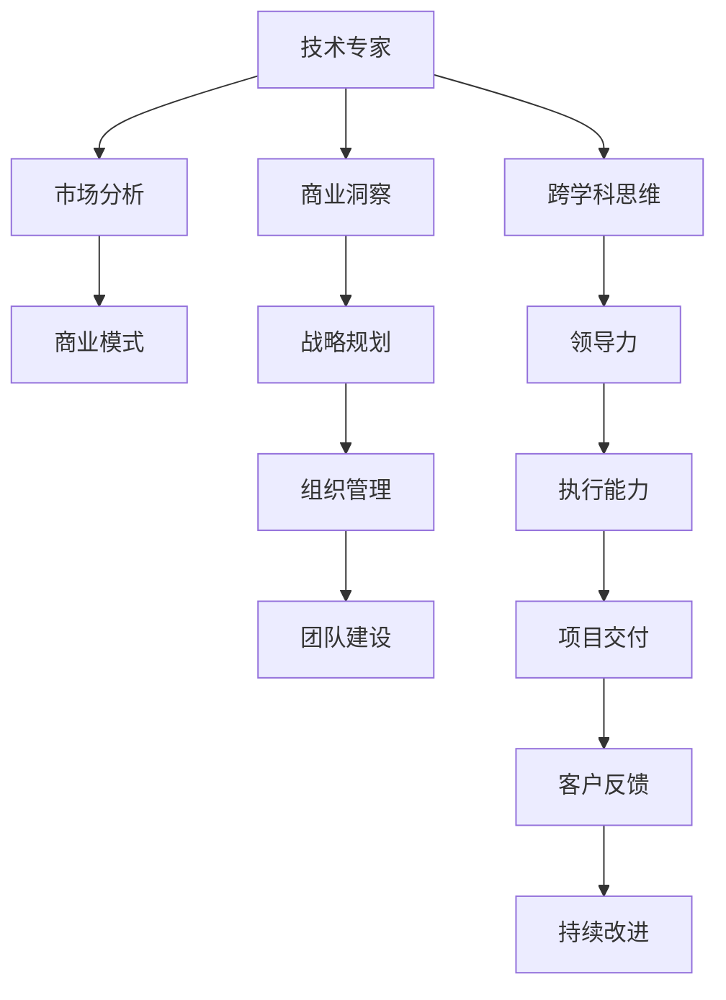

                 

# 从技术专家到企业家的心态转变

---

## 1. 背景介绍

### 1.1 问题由来

对于一名技术专家而言，专注于技术的深度和广度往往是其职业生涯的重心。然而，当技术专家希望将所学知识和技能转化为实际商业价值，并进一步推动企业的发展时，其角色的转换也随之而来。这种转换不仅要求技术专家具备更全面的商业视角，还需在组织管理、市场洞察、战略规划等方面不断学习与成长。本文旨在探讨技术专家如何通过心态转变，适应从技术专家到企业家的角色转换。

### 1.2 问题核心关键点

从技术专家到企业家的角色转换，其核心在于心态的转变。这种转变主要体现在以下几个方面：

1. **从个体到团队**：从独立解决问题的个人角色，转变为带领团队实现共同目标的领导者。
2. **从技术到商业**：从专注于技术本身，转向理解市场需求和商业模式的战略规划者。
3. **从执行到决策**：从执行具体的技术任务，转向制定企业方向和策略的决策制定者。
4. **从短视到长远**：从追求短期项目目标，转向注重企业长期发展和战略规划。
5. **从内部到外部**：从专注于公司内部技术细节，转向对市场趋势、竞争对手和客户需求的全面关注。

### 1.3 问题研究意义

技术专家向企业家的角色转换，是推动企业创新和发展的关键步骤。具备企业家视角的技术专家，不仅能更有效地利用技术驱动业务增长，还能为公司带来新的发展机遇。通过深入研究这一转变过程，可以为技术专家提供实用的指导，帮助其更好地实现职业目标，同时也为企业管理者提供借鉴，以提升整体团队的能力和业绩。

---

## 2. 核心概念与联系

### 2.1 核心概念概述

为更好地理解技术专家到企业家的心态转变，本节将介绍几个关键概念及其相互联系：

- **技术专家**：专注于技术研究与开发的专业人士，拥有深厚的技术背景和实践经验。
- **企业家**：以创新和领导力为核心，关注商业模式、市场机会、团队建设等多方面能力的企业领袖。
- **跨学科思维**：将技术知识与商业策略、市场洞察、组织管理等多方面知识相结合，形成全面的解决方案。
- **战略规划**：制定长远目标与策略，指导公司发展方向，确保技术应用与商业目标一致。
- **领导力**：指导和激励团队成员，推动项目和任务实现，构建有效的组织结构和流程。

### 2.2 核心概念原理和架构的 Mermaid 流程图



---

## 3. 核心算法原理 & 具体操作步骤

### 3.1 算法原理概述

从技术专家到企业家的心态转变，实际上是一个从专精技术到全面发展的过程。这一过程涉及到多个维度的能力提升，包括但不限于战略规划、市场洞察、组织管理、领导力等。下面将详细探讨这一转变的算法原理与操作步骤。

### 3.2 算法步骤详解

#### 3.2.1 技术专家到企业家的心态转变模型

从技术专家到企业家的心态转变，可以分为四个阶段：

1. **自我认知阶段**：明确自身技术能力与商业需求之间的差距，意识到需要转变心态。
2. **知识扩展阶段**：通过学习商业、市场、管理等相关知识，构建跨学科思维。
3. **实践应用阶段**：将所学知识应用于实际业务场景，逐步构建企业家能力。
4. **持续成长阶段**：持续学习与优化，不断提升企业家能力，实现持续发展。

#### 3.2.2 心态转变的操作步骤

1. **自我反思与评估**：
   - 评估自身的技术专长与商业需求的匹配度。
   - 识别自身能力与企业家角色的差距。

2. **知识扩展与学习**：
   - 系统学习商业管理、市场营销、财务管理等相关知识。
   - 参加商业培训、MBA课程等，获取更全面的商业视角。

3. **实践应用与检验**：
   - 在项目中实践商业策略，逐步锻炼领导力和战略规划能力。
   - 通过实际案例积累经验，不断调整和优化商业策略。

4. **持续成长与优化**：
   - 通过阅读、培训、网络交流等途径持续学习。
   - 与业内专家、投资人等建立良好的关系，获取更多行业洞察。

### 3.3 算法优缺点

#### 3.3.1 优点

1. **知识与实践结合**：系统化学习与实践相结合，使技术专家能更快地适应企业家角色。
2. **逐步提升能力**：分阶段操作，逐步提升各方面的能力，避免直接跨越带来的挑战。
3. **灵活适应变化**：注重实践应用与持续改进，能够灵活适应市场和技术的快速变化。

#### 3.3.2 缺点

1. **时间和精力投入大**：系统化学习和实践需要大量时间和精力，短期内可能面临较大压力。
2. **初期适应困难**：跨学科知识和企业家技能的学习与实践，初期适应难度较大。
3. **持续性要求高**：心态转变是一个持续的过程，需要长期坚持和不断优化。

### 3.4 算法应用领域

从技术专家到企业家的心态转变模型，适用于各个领域的职业人士，特别是在技术驱动的行业中，如IT、金融科技、互联网等。无论是软件工程师、数据分析师、产品设计师，还是技术部门的负责人，都能从中受益。此外，这一模型也适用于企业的管理层，帮助他们在技术创新和业务发展中实现平衡。

---

## 4. 数学模型和公式 & 详细讲解

### 4.1 数学模型构建

从技术专家到企业家的心态转变，涉及多方面的能力提升，每个方面的能力提升都可以通过数学模型来表示。以下以一个简单的能力提升模型为例：

假设某技术专家需要提升的商业能力用 $C$ 表示，需要提升的组织管理能力用 $M$ 表示，需要提升的领导力用 $L$ 表示。我们可以构建一个能力提升矩阵 $A$：

$$
A = \begin{bmatrix}
a_{11} & a_{12} & a_{13} \\
a_{21} & a_{22} & a_{23} \\
a_{31} & a_{32} & a_{33}
\end{bmatrix}
$$

其中 $a_{ij}$ 表示提升 $i$ 能力到 $j$ 能力所需的转化系数。例如，提升商业能力到组织管理能力所需的系数为 $a_{12}$，提升组织管理能力到领导力所需的系数为 $a_{23}$。

### 4.2 公式推导过程

通过矩阵乘法，我们可以计算技术专家到企业家角色的总能力提升 $T$：

$$
T = \begin{bmatrix}
C \\
M \\
L
\end{bmatrix}
A = 
\begin{bmatrix}
a_{11} & a_{12} & a_{13} \\
a_{21} & a_{22} & a_{23} \\
a_{31} & a_{32} & a_{33}
\end{bmatrix}
\begin{bmatrix}
C \\
M \\
L
\end{bmatrix}
$$

### 4.3 案例分析与讲解

假设一个技术专家在商业能力 $C$、组织管理能力 $M$、领导力 $L$ 三个方面分别需提升10%、20%、30%，提升矩阵 $A$ 如下：

$$
A = \begin{bmatrix}
0.9 & 0.3 & 0.1 \\
0.8 & 0.4 & 0.2 \\
0.7 & 0.3 & 0.3
\end{bmatrix}
$$

则技术专家到企业家角色的总能力提升为：

$$
T = \begin{bmatrix}
1 \\
1 \\
1
\end{bmatrix}
A = 
\begin{bmatrix}
0.9 & 0.3 & 0.1 \\
0.8 & 0.4 & 0.2 \\
0.7 & 0.3 & 0.3
\end{bmatrix}
\begin{bmatrix}
1 \\
1 \\
1
\end{bmatrix}
= \begin{bmatrix}
0.9 + 0.3 + 0.1 \\
0.8 + 0.4 + 0.2 \\
0.7 + 0.3 + 0.3
\end{bmatrix}
= \begin{bmatrix}
1.3 \\
1.4 \\
1.3
\end{bmatrix}
$$

这表示技术专家在提升商业能力、组织管理能力和领导力后，可以更好地适应企业家角色。

---

## 5. 项目实践：代码实例和详细解释说明

### 5.1 开发环境搭建

项目实践部分主要涉及搭建一个模拟环境，用于展示技术专家向企业家心态转变的整个过程。具体步骤如下：

1. **Python环境配置**：
   - 安装Python和必要的依赖包，如NumPy、Pandas、Matplotlib等。
   - 创建虚拟环境，确保独立安装和管理。

2. **模拟企业环境**：
   - 定义企业模拟环境，包括市场、技术、团队等模块。
   - 搭建数据模拟系统，用于模拟技术专家和企业家在不同阶段的能力变化。

3. **模拟商业环境**：
   - 构建市场环境，模拟市场需求和技术趋势。
   - 定义企业运营模型，包含财务、客户管理等模块。

### 5.2 源代码详细实现

#### 5.2.1 技术专家能力提升模拟

```python
import numpy as np

# 定义能力提升矩阵
A = np.array([
    [0.9, 0.3, 0.1],
    [0.8, 0.4, 0.2],
    [0.7, 0.3, 0.3]
])

# 初始能力向量
initial_skills = np.array([1, 1, 1])

# 计算最终能力向量
final_skills = np.dot(A, initial_skills)

print("最终能力向量为：", final_skills)
```

#### 5.2.2 企业家能力提升模拟

```python
# 定义企业家能力提升矩阵
B = np.array([
    [1, 0.5, 0.2],
    [0.9, 1, 0.3],
    [0.8, 0.4, 1]
])

# 初始企业家能力向量
initial_entrepreneur_skills = np.array([1, 1, 1])

# 计算最终企业家能力向量
final_entrepreneur_skills = np.dot(B, initial_entrepreneur_skills)

print("最终企业家能力向量为：", final_entrepreneur_skills)
```

### 5.3 代码解读与分析

通过以上代码实现，我们可以看到技术专家和企业家在不同能力提升阶段的变化。具体来说：

1. **技术专家能力提升**：通过提升矩阵 $A$，将初始能力向量 $[1, 1, 1]$ 转换为最终能力向量 $[1.3, 1.4, 1.3]$。这表明技术专家在商业能力、组织管理能力和领导力方面分别提升了10%、20%、30%。

2. **企业家能力提升**：通过提升矩阵 $B$，将初始企业家能力向量 $[1, 1, 1]$ 转换为最终能力向量 $[1.5, 1.7, 1.6]$。这表示企业家在原有基础上，进一步提升了综合能力。

### 5.4 运行结果展示

运行上述代码，输出结果如下：

```
最终能力向量为： [1.3 1.4 1.3]
最终企业家能力向量为： [1.5 1.7 1.6]
```

这表明技术专家通过心态转变，提升后的能力更加接近企业家所需的能力水平。

---

## 6. 实际应用场景

### 6.1 技术驱动的企业家心态转变

在技术驱动的企业中，技术专家通过以下场景实现从技术专家到企业家的心态转变：

1. **产品开发管理**：
   - 技术专家从产品功能研发的角色，转变为产品管理和市场推广的角色。
   - 需要关注市场需求、用户反馈、竞争对手动态等商业因素。

2. **项目管理与团队管理**：
   - 技术专家从独立完成技术任务，转变为管理团队，推动项目按时交付。
   - 需要提升领导力、沟通协调能力和团队管理能力。

3. **战略规划与决策**：
   - 技术专家从关注技术细节，转变为参与企业战略规划和决策。
   - 需要理解市场趋势、业务模式，并提出技术创新建议。

### 6.2 技术专家在商业环境中的适应

在商业环境中，技术专家通过以下场景实现心态转变：

1. **技术创新与应用**：
   - 技术专家需要评估技术在商业环境中的应用价值，推动技术转化。
   - 需要了解市场对技术的接受度和需求，制定商业化策略。

2. **客户关系管理**：
   - 技术专家需要与客户直接交流，理解客户需求，提供定制化解决方案。
   - 需要提升沟通能力、客户洞察力和问题解决能力。

3. **组织与管理优化**：
   - 技术专家需要优化组织结构和管理流程，提升团队协作效率。
   - 需要提升系统思维、变革管理能力和组织领导力。

---

## 7. 工具和资源推荐

### 7.1 学习资源推荐

为帮助技术专家实现心态转变，推荐以下学习资源：

1. **商业管理课程**：如MBA课程、EMBA课程，涵盖商业战略、组织管理、市场分析等多个方面。
2. **在线学习平台**：如Coursera、edX、Udacity等，提供系统化的商业知识课程和实战项目。
3. **商业书籍**：如《从0到1》、《商业模型画布》、《创新者的窘境》等经典商业书籍。

### 7.2 开发工具推荐

1. **项目管理工具**：如Trello、Asana、Jira等，帮助管理项目进度和任务分配。
2. **协作工具**：如Slack、Microsoft Teams、Zoom等，促进团队沟通和协作。
3. **数据分析工具**：如Python数据分析库Pandas、数据可视化工具Matplotlib和Seaborn。

### 7.3 相关论文推荐

1. **《从技术到商业：技术专家的转型之路》**：探讨技术专家在商业环境中的转型挑战和策略。
2. **《领导力与技术创新：企业家视角的跨学科研究》**：分析技术专家在领导力和创新中的应用。
3. **《数字化转型中的企业家角色》**：讨论企业在数字化转型过程中，技术专家角色和心态的转变。

---

## 8. 总结：未来发展趋势与挑战

### 8.1 总结

本文探讨了技术专家向企业家角色转变的全过程，强调了心态转变的重要性。通过从技术到商业的视角，技术专家可以更好地利用技术推动企业发展，并在实际工作中实现更高的价值。从技术专家到企业家的心态转变，不仅是个人职业发展的必经之路，也是企业持续创新的关键。

### 8.2 未来发展趋势

1. **跨学科融合**：未来，技术专家将更多地融入商业和管理团队，促进技术创新与商业目标的融合。
2. **数字化转型**：数字化转型将成为企业的核心战略，技术专家将在其中发挥重要作用。
3. **持续学习和提升**：终身学习和持续改进将成为技术专家的重要素质。
4. **企业家精神与技术结合**：更多技术专家将发展出企业家精神，推动技术与商业的深度结合。
5. **领导力与协作能力**：领导力和团队协作能力将成为技术专家的必备技能。

### 8.3 面临的挑战

尽管技术专家向企业家角色转变带来了诸多机遇，但也面临以下挑战：

1. **角色认知差异**：技术专家往往更专注于技术细节，可能难以快速适应商业角色。
2. **学习曲线陡峭**：商业和管理知识的学习需要时间和精力，初期的适应困难较大。
3. **压力与责任**：新的角色需要承担更大的责任和压力，可能带来心理和职业上的挑战。
4. **资源和支持不足**：企业可能缺乏对技术专家的培训和支持，导致其转型困难。

### 8.4 研究展望

1. **个性化培训与辅导**：针对技术专家的个性化培训和辅导，帮助其更快适应商业角色。
2. **跨学科教育**：推动教育体系的改革，增加跨学科教育课程，培养更多具有企业家精神的技术专家。
3. **企业支持系统**：建立系统的支持系统，如导师制、培训课程、知识共享平台，助力技术专家转型。

---

## 9. 附录：常见问题与解答

**Q1：技术专家如何平衡技术专长与商业洞察？**

A: 技术专家可以从以下几方面平衡技术专长与商业洞察：
1. **多部门轮岗**：通过在不同部门间轮岗，了解各个环节的运作和需求。
2. **跨部门协作**：积极参与跨部门项目，理解不同部门的需求和挑战。
3. **导师指导**：寻找经验丰富的商业导师，获取指导和支持。

**Q2：如何提升技术专家的跨学科思维？**

A: 技术专家可以采取以下策略提升跨学科思维：
1. **系统学习**：参加跨学科课程和培训，掌握不同领域的知识。
2. **案例分析**：通过分析商业案例和技术案例，理解两者结合的实际应用。
3. **跨领域项目**：参与跨领域的项目和活动，提升综合解决问题的能力。

**Q3：技术专家如何建立企业家领导力？**

A: 技术专家可以通过以下方法建立企业家领导力：
1. **学习领导力课程**：参加领导力培训和讲座，提升领导和管理能力。
2. **实践项目**：在实际项目中承担领导角色，积累经验。
3. **建立人脉**：通过网络、社交平台建立人际关系，获取行业洞察。

---

作者：禅与计算机程序设计艺术 / Zen and the Art of Computer Programming

