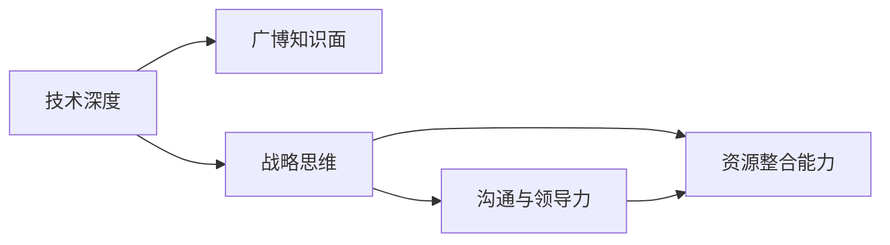

                 

## 1. 背景介绍

### 1.1 问题由来

作为技术领域的领军人物，在职业生涯的某个时刻，你可能发现自己不再满足于纯技术岗位，而希望拓展影响力，实现更大价值。从技术专家到创业导师，这是一条充满挑战与机遇的道路。这一转型不仅需要技术深度，还需要广博的知识面和战略思维，以帮助初创公司、年轻团队在激烈的市场竞争中脱颖而出。

### 1.2 问题核心关键点

- **技术深度与广度**：作为创业导师，需要深入了解某一技术领域的核心原理，同时掌握多领域的基础知识。
- **战略思维与执行**：不仅能洞察市场趋势，还能制定有效的业务策略，并推动其实现。
- **沟通与领导力**：能够在团队内部和外部进行有效的沟通，激励团队达成目标。
- **资源整合能力**：获取和管理资源，包括人才、资金和信息，以支撑业务发展。

### 1.3 问题研究意义

从技术专家到创业导师的转变，不仅能发挥你的技术专长，还能为更多创业者提供宝贵的指导和支持。这一过程不仅能够推动自身成长，还能为整个行业带来积极影响，促进技术创新和产业升级。

## 2. 核心概念与联系

### 2.1 核心概念概述

为更好地理解这一转变的内涵，本节将介绍几个关键概念及其相互关系：

- **技术深度**：深入掌握某一技术领域的核心原理和最佳实践。
- **广博知识面**：对多个技术领域和业务领域有广泛了解。
- **战略思维**：能够从宏观和微观角度分析市场趋势和竞争环境，制定有效的业务策略。
- **沟通与领导力**：具备良好的沟通能力和团队领导能力，能够激励和引导团队。
- **资源整合能力**：能够有效地获取和管理资源，包括资金、人才和信息。

这些核心概念之间的联系可以通过以下Mermaid流程图来展示：



这个流程图展示了技术专长与创业指导之间的逻辑关系：

1. 技术深度是创业导师的基础，提供了分析问题、解决问题的重要工具。
2. 广博知识面扩展了技术专长，使其能更好地理解跨领域问题和机会。
3. 战略思维整合了技术深度和知识面，能够从全局角度制定业务策略。
4. 沟通与领导力确保了战略的执行和团队协作。
5. 资源整合能力支持了战略的实现，提供了必要的外部资源。

这些概念共同构成了从技术专家到创业导师的核心能力框架。

## 3. 核心算法原理 & 具体操作步骤

### 3.1 算法原理概述

作为创业导师，你的核心工作是将技术专长转化为战略指导和团队激励。这一过程涉及多个层面的算法原理：

- **技术专家到创业导师的转化**：需要理解技术原理，并将其与业务战略相结合，制定出符合市场需求的解决方案。
- **战略分析与决策**：基于市场数据和竞争环境，使用数据分析和预测算法制定战略。
- **团队管理和激励**：应用心理学和行为科学原理，构建高效的团队管理和激励机制。

### 3.2 算法步骤详解

具体步骤如下：

1. **评估自身能力**：确定自己在技术深度和广度方面的优势和不足。
2. **市场和竞争分析**：收集并分析市场数据和竞争对手信息，制定战略方向。
3. **制定业务策略**：根据市场需求和技术趋势，制定具体的业务策略。
4. **团队建设和激励**：招聘合适的人才，建立高效的团队合作机制，并制定激励计划。
5. **资源整合与利用**：获取和管理资金、技术、人才等资源，确保战略实施。
6. **持续优化与迭代**：根据反馈和市场变化，不断优化业务模型和团队管理策略。

### 3.3 算法优缺点

**优点**：

- 能够将技术深度与市场洞察结合起来，提供有深度的业务策略。
- 拥有广泛的知识面，能从多角度理解问题和机会。
- 具备战略思维和领导力，能有效地引导团队和资源。

**缺点**：

- 需要持续学习和更新知识，以跟上技术发展和市场变化。
- 战略制定和执行可能面临不确定性，需要灵活应对和调整。
- 需要较强的沟通和领导能力，可能对某些人来说是一个挑战。

### 3.4 算法应用领域

作为创业导师，你可以应用于多个领域，包括但不限于：

- **初创企业的技术指导**：帮助创业团队选择合适的技术方案，制定业务策略。
- **技术型企业的战略咨询**：提供技术前沿和市场洞察，推动业务创新。
- **教育和培训机构**：指导学生和从业者掌握技术知识，培养战略思维。
- **开源社区的贡献**：参与开源项目的技术指导和战略规划，推动社区发展。
- **企业内部培训**：在企业内部进行技术培训和战略管理培训，提升员工能力。

## 4. 数学模型和公式 & 详细讲解 & 举例说明

### 4.1 数学模型构建

在技术指导和创业策略的制定过程中，数学模型和公式提供了严谨的计算基础。这里以市场竞争分析为例，构建一个简单的数学模型：

假设市场规模为 $M$，竞争对手 $A$ 和 $B$ 的市场份额分别为 $P_A$ 和 $P_B$，且 $P_A + P_B < 1$。我们定义市场竞争指数 $CI$ 为：

$$
CI = \frac{P_A}{M} + \frac{P_B}{M}
$$

其中 $CI$ 越接近 1，表示市场竞争越激烈。

### 4.2 公式推导过程

根据上述定义，我们可以推导出市场竞争指数的计算公式：

$$
CI = \sum_{i=1}^n \frac{P_i}{M}
$$

其中 $P_i$ 是第 $i$ 个竞争对手的市场份额，$M$ 是市场总规模。

### 4.3 案例分析与讲解

以一家新兴SaaS公司为例，如果其面临一个市场规模为 $1000$ 的细分市场，竞争对手 $A$ 的市场份额为 $30\%$，竞争对手 $B$ 的市场份额为 $20\%$，那么市场竞争指数为：

$$
CI = \frac{30\%}{1000} + \frac{20\%}{1000} = 0.5
$$

这表示市场竞争相对较激烈。创业导师可以根据此数据，提出进入市场的时间、竞争策略等建议。

## 5. 项目实践：代码实例和详细解释说明

### 5.1 开发环境搭建

项目实践需要一个良好的开发环境。以下是使用Python进行数据分析的开发环境配置流程：

1. 安装Anaconda：从官网下载并安装Anaconda，用于创建独立的Python环境。
2. 创建并激活虚拟环境：
```bash
conda create -n data-env python=3.8 
conda activate data-env
```
3. 安装必要的Python库：
```bash
pip install numpy pandas scikit-learn matplotlib
```

完成上述步骤后，即可在`data-env`环境中进行数据分析项目的开发。

### 5.2 源代码详细实现

以下是一个简单的市场竞争指数计算代码实现：

```python
import numpy as np

def market_competition_index(competitors, market_size):
    competition_index = np.sum([competitor/market_size for competitor in competitors])
    return competition_index

# 示例数据
market_size = 1000
competitors = [30, 20, 15] # 假设三个竞争对手的市场份额
ci = market_competition_index(competitors, market_size)
print(f"市场竞争指数为: {ci}")
```

### 5.3 代码解读与分析

上述代码中，`market_competition_index`函数用于计算市场竞争指数。参数`competitors`为竞争对手的市场份额列表，`market_size`为市场总规模。使用NumPy库的向量化操作，提高了计算效率。

在示例中，市场规模为1000，假设三个竞争对手的市场份额分别为30%、20%和15%，计算得到市场竞争指数为0.5。这表示市场竞争相对较激烈。

## 6. 实际应用场景

### 6.1 初创企业技术指导

作为初创企业的技术导师，你可以：

- 评估技术需求和可行性，选择合适的技术架构和工具。
- 帮助制定业务战略，确定技术实现的优先级。
- 指导团队进行技术栈选择和架构设计。
- 提供技术培训，提升团队的技术能力。

### 6.2 技术型企业战略咨询

技术型企业的战略咨询主要包括以下步骤：

1. **市场和竞争分析**：收集和分析市场数据和竞争对手信息，确定市场规模和竞争态势。
2. **技术趋势分析**：研究最新技术趋势，评估其对业务的影响。
3. **业务策略制定**：根据市场和技术分析结果，制定具体的业务策略。
4. **技术路线图规划**：制定长期和短期的技术路线图，推动业务创新。

### 6.3 教育和培训机构贡献

在教育和培训机构中，创业导师可以：

- 设计课程内容，涵盖技术深度和战略思维。
- 提供实战项目指导，帮助学生应用所学知识解决实际问题。
- 组织技术讲座和研讨会，提升师生对前沿技术的理解。

### 6.4 开源社区贡献

开源社区贡献主要包括：

- 参与开源项目的代码审核和技术指导。
- 组织技术研讨会和培训课程，提升社区技术水平。
- 制定社区发展战略，推动社区创新和扩展。

## 7. 工具和资源推荐

### 7.1 学习资源推荐

为了帮助创业者提升技术指导能力，这里推荐一些优质的学习资源：

1. **《深入理解计算机系统》**：该书介绍了计算机系统基础和编程原理，是技术专家必备的工具书。
2. **《软件设计模式》**：学习经典的设计模式，提升软件设计和架构能力。
3. **Coursera和edX在线课程**：提供广泛的计算机科学和商业管理的课程，适合学习最新技术和战略思维。
4. **Hacker News**：关注技术趋势和创新案例，获取行业洞察。
5. **GitHub**：学习开源项目，提升技术实践和协作能力。

### 7.2 开发工具推荐

高效的开发离不开优秀的工具支持。以下是几款用于数据和战略分析的常用工具：

1. **Jupyter Notebook**：一个交互式的编程环境，便于快速迭代和分享代码。
2. **Python**：一个强大的编程语言，支持丰富的数据处理和科学计算库。
3. **Excel**：一个功能强大的电子表格工具，用于数据可视化和管理。
4. **Tableau**：一个数据可视化工具，帮助数据分析师快速生成图表和报表。
5. **Power BI**：一个商业智能工具，支持多维数据建模和交互式报表。

### 7.3 相关论文推荐

创业导师需要持续学习最新的研究成果，以下是几篇奠基性的相关论文，推荐阅读：

1. **《分布式系统原理与设计》**：该书介绍了分布式系统的设计原理和实现方法，是构建高可用系统的基石。
2. **《算法导论》**：该书是计算机科学领域的经典教材，涵盖算法设计和分析的基本原理。
3. **《精益创业》**：该书介绍了精益创业的方法论，帮助创业者快速迭代和优化业务模型。
4. **《黑客与画家》**：该书探讨了编程和创新之间的关系，提供了很多关于技术创新和商业模式设计的洞见。

## 8. 总结：未来发展趋势与挑战

### 8.1 总结

本文对从技术专家到创业导师的转变进行了全面系统的介绍。首先阐述了这一转变的背景和意义，明确了技术深度、广博知识面、战略思维、沟通与领导力、资源整合能力等核心能力。其次，从原理到实践，详细讲解了技术指导和创业策略制定的算法原理和具体操作步骤，给出了完整的代码实例和分析。最后，广泛探讨了技术指导在多个行业领域的应用前景，展示了这一转型的巨大潜力。

通过本文的系统梳理，可以看到，从技术专家到创业导师的转变不仅需要深厚的技术基础，还需要多领域的知识和战略视野。这一转变不仅能帮助个人成长，还能为更多创业者提供宝贵的指导和支持，推动整个行业的创新和发展。

### 8.2 未来发展趋势

展望未来，从技术专家到创业导师的转变将呈现以下几个发展趋势：

1. **跨领域融合**：未来的创业导师需要具备跨领域的知识，能够将技术深度和业务洞察结合起来。
2. **数据驱动决策**：数据科学和机器学习将成为决策的基础，帮助创业导师制定科学合理的战略。
3. **全球化视野**：技术创新和市场机会越来越全球化，未来的创业导师需要具备全球化视野和国际化的能力。
4. **可持续发展**：可持续发展成为全球关注的热点，未来的创业导师需要考虑环境和社会责任，推动可持续发展。
5. **人工智能与技术的深度融合**：AI技术的应用日益广泛，未来的创业导师需要掌握AI技术，提升决策的科学性和效率。

### 8.3 面临的挑战

尽管这一转变充满机遇，但创业导师在成长过程中仍面临诸多挑战：

1. **持续学习压力**：技术日新月异，创业导师需要不断更新知识，保持技术前沿。
2. **决策不确定性**：市场和环境变化快速，决策过程中面临诸多不确定性。
3. **沟通和协调难度**：需要协调多方利益，平衡团队需求和项目目标。
4. **资源管理复杂**：获取和管理资金、人才和信息，需要高效的资源整合和利用能力。

### 8.4 研究展望

为了应对这些挑战，未来的研究需要在以下几个方面寻求新的突破：

1. **跨学科知识整合**：将技术、管理、经济等领域的知识进行整合，提升综合能力。
2. **数据科学和决策支持**：应用大数据和机器学习技术，提供科学合理的决策支持。
3. **团队管理和激励机制**：研究有效的团队管理方法和激励机制，提升团队协作效率。
4. **资源优化与利用**：研究资源整合和优化的方法，提高资源利用效率。
5. **技术趋势预测**：研究技术发展趋势，提前布局未来技术。

这些研究方向的探索，将引领创业导师技术转型的未来，为更多创业者提供更有价值的指导和支持。

## 9. 附录：常见问题与解答

**Q1: 如何评估自身技术深度和广度？**

A: 评估自身技术深度和广度的方法包括：
1. 自我反思：定期回顾和总结自己在技术领域的成就和不足。
2. 同行评估：向同行和导师寻求反馈，了解自己的技术水平和改进方向。
3. 在线测试：参加技术测试和竞赛，评估自己在特定技术领域的能力。

**Q2: 如何提升战略思维能力？**

A: 提升战略思维能力的方法包括：
1. 学习战略管理理论：阅读相关的书籍和文章，理解战略规划的基本原理。
2. 分析实际案例：研究成功的商业案例，分析其战略制定和执行的过程。
3. 练习战略制定：模拟不同业务场景，制定具体的战略方案。
4. 多方听取意见：与多方利益相关者沟通，获取不同角度的战略建议。

**Q3: 如何提升沟通与领导力？**

A: 提升沟通与领导力的方法包括：
1. 沟通技巧训练：学习有效的沟通技巧，提高口头和书面表达能力。
2. 领导力培训：参加领导力培训课程，学习领导和激励团队的方法。
3. 团队建设：在团队中担任领导角色，积累实战经验。
4. 反馈与改进：定期接收团队成员的反馈，改进沟通和领导方式。

**Q4: 如何获取和管理资源？**

A: 获取和管理资源的方法包括：
1. 网络拓展：建立广泛的人脉关系，获取更多的资源和机会。
2. 资源规划：制定详细的资源规划，明确资源的获取和使用方式。
3. 团队协作：建立高效的团队协作机制，合理分配资源。
4. 持续优化：定期评估资源使用情况，进行优化调整。

---

作者：禅与计算机程序设计艺术 / Zen and the Art of Computer Programming

