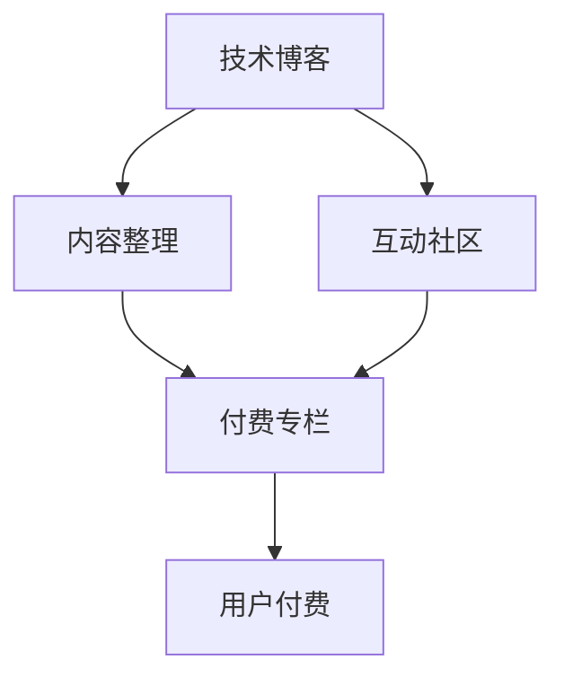

                 

# 从技术博客到付费专栏的进阶之路

在数字化、信息化飞速发展的今天，技术博客成为了技术人展现专业才华、交流经验的重要平台。然而，单纯的技术博客已经难以满足技术社区对内容深度的需求。将博客内容进行体系化整理，提升内容价值，打造付费专栏，成为技术人进阶的重要方向。本文将系统介绍如何从技术博客到付费专栏的进阶之路，包括核心概念、关键步骤、实用建议等，帮助技术人提升内容影响力，实现价值变现。

## 1. 背景介绍

### 1.1 问题由来

随着互联网技术的发展，信息过载问题日益严重，技术人如何创作高质量的技术文章，成为他们关注的核心问题。技术博客因其深度性、实用性、原创性等特质，受到广大技术爱好者的追捧。但随着行业变化和技术更新速度加快，技术博客单一的内容形式，越来越难以满足读者的需求。与此同时，随着数字出版的兴起，付费内容逐渐成为市场主流，技术社区也意识到付费专栏的价值。

### 1.2 问题核心关键点

1. **内容深度与广度：** 如何保证内容深度，覆盖更广泛的技术主题，吸引更多读者。
2. **商业变现能力：** 如何构建内容付费体系，实现内容变现，获取收益。
3. **用户体验与互动：** 如何优化用户体验，提高用户粘性，实现内容社区化。

## 2. 核心概念与联系

### 2.1 核心概念概述

- **技术博客：** 技术人通过博客平台发布的技术文章，内容一般以技术分享、问题解答、项目案例等为主。
- **付费专栏：** 在技术博客的基础上，对内容进行体系化整理，通过付费订阅、单次购买等方式获取收益，同时提供更多互动功能，提升用户体验。
- **技术社区：** 技术人通过博客平台与读者进行互动交流，形成以技术为中心的社区文化。

### 2.2 核心概念原理和架构的 Mermaid 流程图



这个流程图展示了技术博客、内容整理、付费专栏和互动社区之间的联系。技术博客通过内容的深度和广度吸引读者，内容整理提升内容价值，付费专栏实现内容变现，互动社区提升用户体验。

## 3. 核心算法原理 & 具体操作步骤

### 3.1 算法原理概述

从技术博客到付费专栏的进阶，核心算法包括内容生成、内容整理、内容发布和内容变现。内容生成依赖技术人的技术积累和写作能力，内容整理依赖对内容的深度理解和体系化处理，内容发布依赖有效的平台运营，内容变现依赖合理的付费策略和用户反馈。

### 3.2 算法步骤详解

#### 3.2.1 内容生成

技术人需关注以下几个方面：

- **选题策划：** 关注行业热点、技术趋势，策划高质量的选题。
- **内容创作：** 聚焦核心技术问题，结合实际项目案例，进行深度技术讲解。
- **稿件审校：** 多轮审校，保证文章质量。

#### 3.2.2 内容整理

内容整理是提升内容价值的关键步骤，包括以下几个环节：

- **内容分类：** 按主题、难度、深度等维度进行分类。
- **内容聚合：** 将同类文章进行聚合，形成专题和系列。
- **内容更新：** 定期更新内容，保持最新技术信息的传递。

#### 3.2.3 内容发布

内容发布需注重平台的选择和运营：

- **选择平台：** 根据受众群体选择合适的平台，如知乎、掘金、CSDN等。
- **运营策略：** 通过运营手段提升内容曝光，如SEO优化、推广活动等。

#### 3.2.4 内容变现

内容变现依赖合理的付费策略：

- **定价策略：** 根据内容价值和用户需求，设置合理的价格。
- **订阅模式：** 提供单次购买、订阅制等多种付费方式。
- **会员权益：** 提供专属内容、互动答疑等会员权益，提升用户粘性。

### 3.3 算法优缺点

#### 3.3.1 优点

- **深度内容：** 提升内容深度，满足用户需求。
- **系统化体系：** 提高内容价值，吸引更多读者。
- **变现能力强：** 实现内容变现，获取收益。
- **用户互动：** 通过互动提升用户体验，形成技术社区。

#### 3.3.2 缺点

- **内容创作难度大：** 深度内容创作需要技术积累和写作能力。
- **内容整理复杂：** 需要时间和精力进行内容整理和分类。
- **运营成本高：** 内容发布和用户互动需要运营和推广。
- **变现过程繁琐：** 付费策略和用户管理需要细致运营。

### 3.4 算法应用领域

付费专栏的创建，主要应用于以下几个领域：

- **技术培训：** 通过付费专栏提升技术培训的效果，形成系统化学习路径。
- **技术咨询：** 提供深度技术咨询，满足企业的技术需求。
- **技术交流：** 形成技术交流社区，提升用户互动和社区粘性。

## 4. 数学模型和公式 & 详细讲解 & 举例说明

### 4.1 数学模型构建

在技术博客到付费专栏的进阶过程中，可以构建一个内容生成与更新的数学模型。假设技术人创作一篇文章需要的时间为 $t$，内容被用户阅读的时间为 $r$，则单篇文章的总价值 $V$ 可以表示为：

$$
V = \frac{1}{t} + \frac{r}{t}
$$

其中，$\frac{1}{t}$ 表示创作单篇文章的成本，$\frac{r}{t}$ 表示文章被用户阅读的时间与创作成本的比值。

### 4.2 公式推导过程

假设技术人创作一篇文章的平均时间为 $t$，内容被用户阅读的时间为 $r$，每篇文章的平均阅读量为 $m$，付费订阅用户的数量为 $n$，单篇文章的订阅价格为 $p$，则总收益 $R$ 可以表示为：

$$
R = p \cdot m \cdot n
$$

将上述公式代入，得：

$$
V = \frac{R}{mt}
$$

这意味着，单篇文章的价值与总收益、阅读量、订阅用户数量以及创作时间成反比。在提升内容价值的过程中，优化阅读量、提升订阅用户数量、减少创作时间都是重要因素。

### 4.3 案例分析与讲解

假设一篇技术文章的总收益为 $1000$ 元，阅读量为 $1000$ 次，订阅用户数量为 $500$ 人，创作时间为 $2$ 小时，则单篇文章的价值 $V$ 为：

$$
V = \frac{1000}{2 \cdot 1000} = 0.5
$$

这意味着，每篇文章的创作成本占总收益的 $0.5$，即 $50\%$。因此，提升创作效率、优化阅读量、增加订阅用户数量等措施，都是提升内容价值的有效手段。

## 5. 项目实践：代码实例和详细解释说明

### 5.1 开发环境搭建

技术博客到付费专栏的进阶，需搭建一个集内容生成、内容整理、内容发布和内容变现于一体的系统平台。开发环境搭建主要包括以下几个步骤：

- **选择合适的开发平台：** 如WordPress、Ghost、Hugo等。
- **配置开发环境：** 安装必要的开发工具和库，如Python、Ruby等。
- **数据管理：** 使用MySQL或PostgreSQL等关系型数据库，存储文章、评论等数据。

### 5.2 源代码详细实现

#### 5.2.1 内容管理系统

开发一个内容管理系统，实现文章创建、分类、更新等操作。代码示例：

```python
# 创建文章
def create_article(title, content, category):
    # 数据库操作
    # 返回文章ID

# 更新文章
def update_article(article_id, new_content):
    # 数据库操作
    # 返回更新状态

# 获取分类文章列表
def get_articles_by_category(category):
    # 数据库操作
    # 返回文章列表
```

#### 5.2.2 内容订阅系统

开发一个订阅系统，实现用户订阅、付费操作。代码示例：

```python
# 用户注册
def register_user(username, password):
    # 数据库操作
    # 返回注册状态

# 用户订阅
def subscribe_to_content():
    # 数据库操作
    # 返回订阅状态

# 获取付费文章列表
def get_paid_articles():
    # 数据库操作
    # 返回付费文章列表
```

#### 5.2.3 内容互动系统

开发一个互动系统，实现用户评论、点赞、分享等功能。代码示例：

```python
# 用户评论
def add_comment(article_id, user_id, comment_content):
    # 数据库操作
    # 返回评论状态

# 点赞文章
def like_article(article_id, user_id):
    # 数据库操作
    # 返回点赞状态

# 分享文章
def share_article(article_id, user_id):
    # 数据库操作
    # 返回分享状态
```

### 5.3 代码解读与分析

#### 5.3.1 内容管理系统

- **数据库操作：** 通过SQL语句或ORM工具，对文章、分类等数据进行增删改查操作。
- **API接口：** 提供RESTful接口，供外部调用。

#### 5.3.2 内容订阅系统

- **用户注册：** 注册功能，保存用户基本信息，生成唯一ID。
- **订阅操作：** 用户选择订阅内容，更新订阅状态。
- **付费文章列表：** 根据订阅状态，返回用户可以访问的付费文章列表。

#### 5.3.3 内容互动系统

- **评论功能：** 用户对文章进行评论，生成评论记录。
- **点赞功能：** 用户对文章进行点赞，更新点赞记录。
- **分享功能：** 用户对文章进行分享，更新分享记录。

### 5.4 运行结果展示

- **内容管理系统：** 文章创建、分类、更新等操作，界面展示清晰。
- **内容订阅系统：** 用户注册、订阅、付费文章列表等操作，界面友好。
- **内容互动系统：** 评论、点赞、分享等互动操作，界面响应及时。

## 6. 实际应用场景

### 6.1 技术培训

技术培训可以通过付费专栏，提升培训效果。例如，某技术培训机构可以开设一个“深度学习入门”专栏，包含多篇文章，从基础到高级，逐步讲解深度学习的各个环节。用户订阅专栏后，即可享受系统化学习路径，提升学习效率。

### 6.2 技术咨询

技术咨询可以通过付费专栏，提供深度技术支持。例如，某IT公司可以开设一个“企业架构设计”专栏，讲解企业架构设计原理、最佳实践等，帮助企业进行架构设计。用户订阅专栏后，即可获取专家级指导，解决技术难题。

### 6.3 技术交流

技术交流可以通过付费专栏，提升用户互动和社区粘性。例如，某技术社区可以开设一个“编程心得”专栏，邀请技术人分享编程经验、心得体会。用户订阅专栏后，不仅可以获取技术文章，还可以参与社区互动，与其他技术人交流学习。

## 7. 工具和资源推荐

### 7.1 学习资源推荐

#### 7.1.1 书籍

- **《编程珠玑》：** 介绍编程中经典问题和算法，提升编程技能。
- **《深入理解计算机系统》：** 深入讲解计算机系统原理，提升技术水平。
- **《代码大全》：** 介绍代码编写规范和最佳实践，提升代码质量。

#### 7.1.2 在线课程

- **Coursera：** 提供大量高质量的计算机科学课程。
- **Udacity：** 提供前沿技术和职业发展课程。
- **edX：** 提供大学级别的高质量课程，涵盖多个领域。

#### 7.1.3 技术博客

- **CSDN：** 中国最大的技术社区，提供大量技术文章和资源。
- **掘金：** 国内知名技术社区，提供优质技术文章和工具。
- **知乎：** 用户讨论和分享技术问题的平台，值得关注。

### 7.2 开发工具推荐

#### 7.2.1 开发环境

- **IDE：** 如Visual Studio Code、PyCharm等，提供良好的开发体验。
- **版本控制：** 如Git、GitHub等，方便版本管理和协作。
- **文档管理：** 如Confluence、Notion等，帮助团队进行文档管理和协作。

#### 7.2.2 数据库

- **MySQL：** 广泛使用的关系型数据库，适合中小规模应用。
- **PostgreSQL：** 功能强大的关系型数据库，支持复杂查询和事务处理。
- **MongoDB：** 非关系型数据库，适合大规模数据处理和存储。

#### 7.2.3 部署平台

- **AWS：** 亚马逊云平台，提供丰富云服务，支持各种应用部署。
- **阿里云：** 国内领先的云服务平台，提供稳定的云服务和支持。
- **腾讯云：** 提供丰富的云服务，支持各种应用部署。

### 7.3 相关论文推荐

#### 7.3.1 深度学习

- **《深度学习》：** 深度学习领域的经典教材，涵盖深度学习基础和应用。
- **《神经网络与深度学习》：** 介绍神经网络和深度学习的原理和应用。
- **《TensorFlow实战》：** 介绍TensorFlow的使用和最佳实践。

#### 7.3.2 自然语言处理

- **《自然语言处理综论》：** 自然语言处理领域的经典教材，涵盖自然语言处理基础和应用。
- **《神经网络语言模型》：** 介绍神经网络语言模型的原理和应用。
- **《Seq2Seq: Sequence-to-Sequence Model》：** 介绍序列到序列模型的原理和应用。

## 8. 总结：未来发展趋势与挑战

### 8.1 研究成果总结

从技术博客到付费专栏的进阶，是技术人提升内容价值和变现能力的重要途径。通过内容生成、内容整理、内容发布和内容变现，技术人可以在技术社区中获得更大的影响力，实现价值变现。

### 8.2 未来发展趋势

未来，付费专栏的发展趋势主要包括以下几个方面：

- **内容精细化：** 内容更加精细化、系统化，满足用户深度学习的需求。
- **互动社区化：** 建立技术社区，增强用户互动，提升用户体验。
- **变现多元化：** 通过多种付费模式，实现内容变现，满足不同用户需求。
- **技术普及化：** 通过付费专栏，提升技术普及度，推动技术发展。

### 8.3 面临的挑战

尽管付费专栏具有很大的潜力，但在实际应用过程中，仍面临以下挑战：

- **内容创作难度大：** 高质量内容创作需要技术积累和写作能力。
- **平台运营成本高：** 平台搭建和运营需要时间和资金投入。
- **用户互动不足：** 用户互动不足，难以形成社区氛围。
- **变现模式单一：** 现有的付费模式较为单一，难以满足多样化的用户需求。

### 8.4 研究展望

未来的研究，需要从以下几个方面进行：

- **内容创新：** 提供更加丰富和多样化的内容，满足用户需求。
- **平台优化：** 优化平台运营机制，降低运营成本。
- **互动机制：** 提升用户互动机制，增强社区粘性。
- **付费模式：** 探索多样化的付费模式，满足用户需求。

## 9. 附录：常见问题与解答

### 9.1 问题解答

#### 9.1.1 问题1：如何提升内容创作能力？

**解答：** 提升内容创作能力，需要以下几个方面的努力：
- **技术积累：** 不断学习和积累技术知识，掌握最新技术趋势。
- **写作能力：** 提升写作水平，学会深度讲解技术问题。
- **时间管理：** 合理安排时间，提高创作效率。

#### 9.1.2 问题2：如何提升内容质量？

**解答：** 提升内容质量，需要以下几个方面的努力：
- **选题策划：** 关注行业热点和技术趋势，策划高质量的选题。
- **稿件审校：** 多轮审校，保证文章质量。
- **用户反馈：** 及时收集用户反馈，不断优化内容。

#### 9.1.3 问题3：如何选择平台？

**解答：** 选择平台时，需要考虑以下几个因素：
- **受众群体：** 选择目标受众群体较多的平台。
- **内容形式：** 选择支持丰富内容形式的平台。
- **运营成本：** 考虑平台的运营成本和盈利模式。

#### 9.1.4 问题4：如何提升用户互动？

**解答：** 提升用户互动，需要以下几个方面的努力：
- **互动机制：** 设计合理的互动机制，鼓励用户参与。
- **社区文化：** 建立良好的社区文化，增强用户粘性。
- **内容更新：** 定期更新内容，保持社区活力。

---

作者：禅与计算机程序设计艺术 / Zen and the Art of Computer Programming

