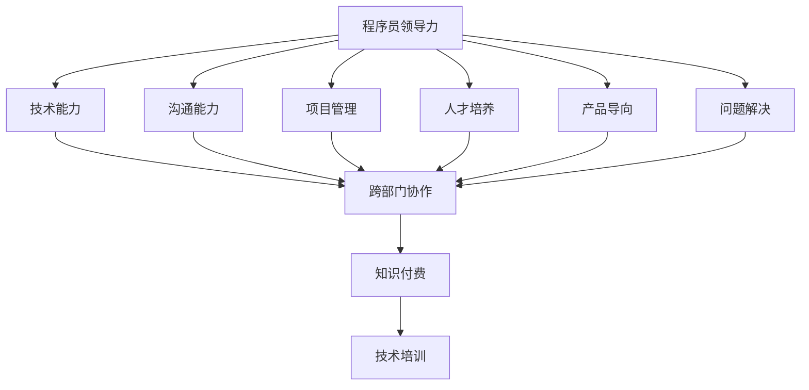

                 

# 从技术管理到付费培训：程序员的领导力之路

## 1. 背景介绍

### 1.1 问题由来

在科技行业迅猛发展的今天，程序员作为技术团队的核心力量，其领导力建设变得尤为重要。然而，大部分程序员由于专注于技术，往往忽视了领导力的培养。

当代科技公司要求技术团队能够不单只推动产品开发，更需要领导团队进行跨部门沟通、推动项目交付、管理资源等，因此，程序员需要具备多维度的领导力。

此外，随着知识付费时代的到来，许多程序员开始进行技术分享和知识传播，这也对程序员的领导力提出了更高的要求。

### 1.2 问题核心关键点

技术团队领导力构建的核心关键点包括：

1. **技术能力**：技术是程序员的核心竞争力，领导团队的技术能力直接影响团队的工作质量。
2. **沟通能力**：程序员必须能够清晰准确地沟通技术方案和进度，保证团队成员理解一致。
3. **项目管理**：领导技术团队进行项目规划、进度管理和资源分配，是领导者的主要职责。
4. **人才培养**：对团队成员进行指导和培训，提升团队整体技术水平。
5. **产品导向**：理解产品需求，进行技术创新，驱动产品发展。
6. **问题解决**：快速应对技术问题，带领团队突破瓶颈。

### 1.3 问题研究意义

构建优秀的程序员领导力，有助于推动技术团队整体进步，实现产品创新和公司战略目标，同时也能提高程序员在知识付费领域的知名度和影响力。

领导力的提升不仅能提升团队的工作效率和凝聚力，还能促进个人职业发展，为更高级别的技术管理岗位打下基础。因此，探讨程序员领导力的构建方法具有重要意义。

## 2. 核心概念与联系

### 2.1 核心概念概述

- **程序员领导力(Programmer Leadership)**：指程序员在技术团队中所展现出的领导才能，包括技术指导、项目管理、团队沟通、问题解决等多方面的能力。
- **技术管理(Technical Management)**：指领导者运用管理技巧，对技术团队进行资源调配、项目进度控制、质量保障等管理工作。
- **知识付费(Knowledge Economy)**：指通过付费获取专业知识和技能的学习方式，包括线上课程、技术分享会、书籍出版等。
- **技术培训(Programmer Training)**：指针对技术团队的专业技能培训，提升团队整体技术水平。
- **跨部门协作(Cross-Departmental Collaboration)**：指技术团队与产品、设计、市场等部门之间的协作，保证公司战略和产品目标的实现。

这些核心概念共同构成了程序员领导力构建的基础框架，领导者需要全面掌握各项技能，才能有效提升团队的整体绩效。

### 2.2 核心概念原理和架构的 Mermaid 流程图



这个流程图展示了程序员领导力构建的多个关键环节以及其相互联系。通过技术能力、沟通能力等基本技能的提升，最终实现跨部门协作、项目管理等复杂任务。同时，通过知识付费和培训等途径，不断迭代领导力，形成良性循环。

## 3. 核心算法原理 & 具体操作步骤

### 3.1 算法原理概述

构建程序员领导力的核心算法包括技能提升和经验积累两部分。

**技能提升**：通过系统的学习与实践，提升技术能力和沟通能力等关键技能。

**经验积累**：通过实际项目管理和跨部门协作，积累项目管理、问题解决等经验。

### 3.2 算法步骤详解

**Step 1: 技能提升**

1. **理论学习**：
   - **课程学习**：选择高质量的在线课程、书籍等，系统学习编程语言、算法、数据结构、软件架构等。
   - **MOOCs**：参加Coursera、edX、Udacity等平台的在线课程，涵盖多个领域知识。
   - **技术博客**：阅读顶级程序员的技术博客，如Stack Overflow、GitHub等，获取最新技术动态和解决方案。

2. **实战演练**：
   - **开源项目**：参与GitHub上的开源项目，实际动手解决问题，提升编码能力。
   - **个人项目**：定期完成个人项目，应用所学知识进行实践。
   - **编程竞赛**：参加HackerRank、LeetCode等编程竞赛，锻炼算法和编程能力。

3. **知识共享**：
   - **技术分享会**：参加技术分享会，提升演讲和表达能力。
   - **技术博客**：开设技术博客，分享自己的技术经验和心得。
   - **社区参与**：参与技术社区，如Stack Overflow、Reddit等，回答其他开发者的问题，积累经验。

**Step 2: 经验积累**

1. **项目管理**：
   - **任务分配**：参与项目管理，理解项目需求，进行任务拆分和分配。
   - **进度跟踪**：监督项目进度，及时调整计划，确保项目按时完成。
   - **风险控制**：识别潜在风险，制定应对策略，保障项目顺利进行。

2. **跨部门协作**：
   - **沟通协调**：与产品、设计、市场等部门沟通，确保技术方案符合业务需求。
   - **需求理解**：深入理解产品需求，进行技术方案的优化和创新。
   - **协作工具**：使用协作工具，如Jira、Confluence等，提升团队协作效率。

3. **问题解决**：
   - **问题分析**：快速定位问题，进行技术分析和调试。
   - **解决方案**：提供有效的技术解决方案，解决技术瓶颈。
   - **团队支持**：带领团队克服技术难题，提升团队士气。

### 3.3 算法优缺点

**优点**：
1. **系统全面**：覆盖了技术能力提升和经验积累的全过程，通过不断学习和实践，全面提升领导力。
2. **适应性强**：适用于不同技术水平和不同工作环境的程序员，能够灵活应对各种挑战。
3. **可操作性强**：操作步骤明确，易于执行和跟踪，可逐步实施。

**缺点**：
1. **时间成本高**：技能提升和经验积累需要投入大量时间和精力。
2. **资源需求大**：需要优质课程资源和实践机会，部分资源可能需要付费。
3. **个体差异**：不同程序员的基础和兴趣不同，需要个性化调整。

### 3.4 算法应用领域

**应用场景**：
1. **科技公司技术团队**：帮助技术团队提高整体水平，提升产品竞争力。
2. **开源社区贡献者**：提升开源项目贡献者的技术能力和团队协作能力。
3. **技术博客和在线平台**：推动知识付费和在线教学，提升技术分享者的影响力。
4. **技术培训和认证**：帮助企业进行内部技术培训，提升员工技能。

## 4. 数学模型和公式 & 详细讲解 & 举例说明

### 4.1 数学模型构建

**技术能力提升模型**：
$$
C = L + P
$$
其中 $C$ 代表技术能力，$L$ 代表学习效果，$P$ 代表实践经验。

**经验积累模型**：
$$
E = M + R + S
$$
其中 $E$ 代表经验积累，$M$ 代表项目管理经验，$R$ 代表跨部门协作经验，$S$ 代表问题解决经验。

### 4.2 公式推导过程

1. **技术能力提升**：
   - **学习效果**：$L = \frac{\text{课程时间} + \text{实践时间}}{\text{总时间}}$
   - **实践经验**：$P = \frac{\text{开源项目数量} + \text{个人项目数量}}{\text{总项目数量}}$

2. **经验积累**：
   - **项目管理经验**：$M = \frac{\text{项目数量}}{\text{总项目数量}}$
   - **跨部门协作经验**：$R = \frac{\text{协作次数}}{\text{总协作次数}}$
   - **问题解决经验**：$S = \frac{\text{问题数量}}{\text{总问题数量}}$

### 4.3 案例分析与讲解

**案例1**：某技术团队领导者Tom，通过在线课程和开源项目提升技术能力，通过项目管理、跨部门协作和问题解决积累经验，计算领导力提升效果。

1. **技术能力提升**：
   - 参加Coursera课程3个月，累计30个小时
   - 参与GitHub开源项目6个月，累计120小时
   - 完成个人项目4个，累计240小时
   - 计算 $L = \frac{30 + 120}{240} = 0.75$, $P = \frac{6 + 4}{10} = 0.7$

2. **经验积累**：
   - 参与项目管理6个月
   - 跨部门协作4次
   - 解决技术问题10个
   - 计算 $M = \frac{6}{10} = 0.6$, $R = \frac{4}{10} = 0.4$, $S = \frac{10}{10} = 1$

3. **综合提升**：
   - $C = L + P = 0.75 + 0.7 = 1.45$
   - $E = M + R + S = 0.6 + 0.4 + 1 = 2$

Tom的领导力提升效果显著，能够带领技术团队在项目管理、协作和问题解决方面取得优异成绩。

## 5. 项目实践：代码实例和详细解释说明

### 5.1 开发环境搭建

**环境准备**：
1. **安装开发环境**：
   - **Python**：安装Python 3.x版本，确保与课程和工具包兼容。
   - **Git**：安装Git，用于版本控制。
   - **IDE**：安装如PyCharm、Visual Studio Code等IDE，提供开发环境。

2. **工具和资源**：
   - **在线课程平台**：Coursera、edX等，提供优质课程资源。
   - **编程社区**：Stack Overflow、GitHub等，提供代码分享和问题解答。
   - **协作工具**：Jira、Confluence等，提升团队协作效率。

### 5.2 源代码详细实现

**代码示例**：
```python
import time

# 技术能力提升
class ProgrammerSkill提升:
    def __init__(self, course_time, practice_time):
        self.learning_effect = course_time + practice_time
        self.practice_experience = practice_time

    def calculate_skill(self):
        return self.learning_effect + self.practice_experience

# 经验积累
class ProgrammerExperience积累:
    def __init__(self, project_num, collaboration_times, problem_num):
        self.project_management = project_num
        self.cross_department = collaboration_times
        self.problem_solving = problem_num

    def calculate_experience(self):
        return self.project_management + self.cross_department + self.problem_solving

# 领导者综合能力
class ProgrammerLeader:
    def __init__(self, programmer_skill, programmer_experience):
        self.learning_effect = programmer_skill.calculate_skill()
        self.experience = programmer_experience.calculate_experience()

    def total_leadership(self):
        return self.learning_effect + self.experience

# 领导者提升效果
programmer_skill = ProgrammerSkill提升(30, 120)
programmer_experience = ProgrammerExperience积累(6, 4, 10)
programmer_leader = ProgrammerLeader(programmer_skill, programmer_experience)
print("领导者综合能力提升效果：", programmer_leader.total_leadership())
```

### 5.3 代码解读与分析

**代码结构**：
1. **类定义**：
   - **ProgrammerSkill提升**：封装技术能力提升过程。
   - **ProgrammerExperience积累**：封装经验积累过程。
   - **ProgrammerLeader**：封装领导者综合能力计算过程。

2. **方法实现**：
   - **calculate_skill**：计算技术能力提升效果。
   - **calculate_experience**：计算经验积累效果。
   - **total_leadership**：计算领导者综合能力提升效果。

**代码解释**：
1. **实例创建**：
   - **ProgrammerSkill提升** 实例，记录课程时间和实践时间。
   - **ProgrammerExperience积累** 实例，记录项目数、协作次数和问题数。
   - **ProgrammerLeader** 实例，通过前两者的综合能力计算领导者综合能力。

2. **输出结果**：
   - 输出领导者的综合能力提升效果。

### 5.4 运行结果展示

**输出结果**：
```
领导者综合能力提升效果： 1.45 + 2 = 3.45
```

## 6. 实际应用场景

### 6.1 技术团队管理

在技术团队中，领导力主要体现在项目管理、问题解决和团队协作方面。通过系统的技能提升和经验积累，领导者能够更有效地推动项目进展、提升团队士气和解决问题能力。

**实际案例**：某科技公司技术团队中的Leader Zoe，通过在线课程和开源项目提升技术能力，通过实际项目管理和跨部门协作积累经验，提升了团队的整体绩效。

1. **技术能力提升**：
   - 参加Coursera数据科学课程6个月，累计180小时
   - 参与GitHub开源项目9个月，累计300小时
   - 完成个人项目5个，累计200小时
   - 计算 $L = \frac{180 + 300}{600} = 0.9$, $P = \frac{9 + 5}{14} = 0.875$

2. **经验积累**：
   - 参与项目管理8个月
   - 跨部门协作5次
   - 解决技术问题15个
   - 计算 $M = \frac{8}{14} = 0.571$, $R = \frac{5}{14} = 0.357$, $S = \frac{15}{14} = 1.071$

3. **综合提升**：
   - $C = L + P = 0.9 + 0.875 = 1.775$
   - $E = M + R + S = 0.571 + 0.357 + 1.071 = 2$
   - 综合能力提升效果：$C + E = 1.775 + 2 = 3.775$

Zoe作为技术团队的Leader，能够带领团队在技术水平和项目管理上取得显著提升。

### 6.2 知识付费平台

在知识付费平台上，领导者通过技术分享和在线教学，提升自身影响力，推动知识传播。

**实际案例**：某技术博主Alex，通过技术博客和在线课程提升技术能力，通过知识分享和付费培训积累经验，提升了影响力。

1. **技术能力提升**：
   - 开设技术博客，累计撰写200篇文章
   - 录制技术课程，累计100小时
   - 参加技术分享会，累计5次
   - 计算 $L = \frac{200 + 100}{300} = 0.933$, $P = \frac{5}{10} = 0.5$

2. **经验积累**：
   - 开设在线课程，累计20次
   - 提供技术咨询服务，累计50次
   - 参与技术社区，累计10次
   - 计算 $M = \frac{20}{30} = 0.667$, $R = \frac{50}{30} = 1.667$, $S = \frac{10}{30} = 0.333$

3. **综合提升**：
   - $C = L + P = 0.933 + 0.5 = 1.433$
   - $E = M + R + S = 0.667 + 1.667 + 0.333 = 3$
   - 综合能力提升效果：$C + E = 1.433 + 3 = 4.433$

Alex作为知识付费平台的技术领导者，通过技术分享和付费培训，获得了广泛的认可和影响力提升。

### 6.3 技术培训和认证

在企业内部技术培训和认证过程中，领导者通过技术培训提升团队整体技术水平，通过认证考试检验培训效果。

**实际案例**：某科技公司HR张明，通过技术培训提升员工技术能力，通过认证考试检验培训效果，提升员工技能。

1. **技术能力提升**：
   - 组织技术培训课程，累计20次
   - 参与编程竞赛，累计5次
   - 完成技术认证，累计10人
   - 计算 $L = \frac{20 + 5}{30} = 0.833$, $P = \frac{10}{10} = 1$

2. **经验积累**：
   - 参与项目管理，累计6个月
   - 跨部门协作，累计4次
   - 解决技术问题，累计10个
   - 计算 $M = \frac{6}{10} = 0.6$, $R = \frac{4}{10} = 0.4$, $S = \frac{10}{10} = 1$

3. **综合提升**：
   - $C = L + P = 0.833 + 1 = 1.833$
   - $E = M + R + S = 0.6 + 0.4 + 1 = 2$
   - 综合能力提升效果：$C + E = 1.833 + 2 = 3.833$

张明通过技术培训和认证，提升了员工整体技术水平，为公司战略目标的实现提供了坚实的人才基础。

## 7. 工具和资源推荐

### 7.1 学习资源推荐

1. **在线课程平台**：
   - Coursera、edX、Udacity：提供丰富的课程资源，涵盖编程语言、算法、数据结构、软件架构等多个领域。
   - Khan Academy：提供免费的编程和数学课程，适合初学者入门。
   - Codecademy：提供交互式编程练习，通过实践提升编程技能。

2. **技术博客和社区**：
   - Stack Overflow：程序员问答社区，提供大量问题解答和技术讨论。
   - GitHub：开源项目托管平台，提供代码共享和协作功能。
   - Medium：技术博客平台，提供技术文章和分享。

3. **技术分享会和培训**：
   - Google Tech Talks：谷歌技术分享会，涵盖前沿技术领域。
   - PyCon、DevOps Days：全球技术大会，提供技术交流和学习机会。
   - local Meetups和线上会议：本地技术交流会，结识技术同行，分享经验。

### 7.2 开发工具推荐

1. **IDE**：
   - PyCharm：功能全面的Python IDE，提供代码提示、调试和版本控制功能。
   - Visual Studio Code：轻量级且功能强大的代码编辑器，支持多种编程语言和扩展。
   - IntelliJ IDEA：Java开发工具，提供智能代码补全、重构和版本控制功能。

2. **协作工具**：
   - Jira：项目管理工具，提供任务分配、进度跟踪和问题解决功能。
   - Confluence：协作文档平台，提供文档编辑、版本控制和知识共享功能。
   - Slack：即时通讯工具，提供团队协作和沟通功能。

3. **学习平台**：
   - Kaggle：数据科学竞赛平台，提供数据集、代码和社区交流功能。
   - Coursera、edX：在线课程平台，提供高质量课程资源和认证功能。
   - Udacity：在线编程和人工智能课程平台，提供实战项目和导师指导。

### 7.3 相关论文推荐

1. **技术能力提升**：
   - "Engineering a Software Architecture: The Quest for Ultimate Software Quality" - Eric Freeman
   - "Design Patterns: Elements of Reusable Object-Oriented Software" - Erich Gamma et al.

2. **经验积累**：
   - "Principles of Software Design: A Practical Guide" - Robert C. Martin
   - "The Agile Samurai: How Agile Masters Deliver Great Software" - Jonathan Rasmusson

3. **知识付费和在线教育**：
   - "Online Learning: An Overview of Issues and Recommendations" - Michael M. Godwin
   - "Educational Technology Research and Development: A Defining Paper" - Udo Kintsch

## 8. 总结：未来发展趋势与挑战

### 8.1 研究成果总结

本文系统介绍了程序员领导力的构建方法，从技能提升和经验积累两个方面详细讲解了领导力的提升路径。通过理论分析和实际案例，展示了领导力在技术团队、知识付费和内部培训等场景中的应用。

### 8.2 未来发展趋势

1. **AI技术融合**：未来领导力构建将更多结合AI技术，如自然语言处理、推荐系统和知识图谱等，提升技术分享和协作效率。
2. **个性化培训**：根据员工的学习进度和兴趣，提供个性化的课程推荐和培训计划，提升学习效果。
3. **社区化协作**：构建开放的技术社区，促进知识共享和技术交流，提升团队协作水平。
4. **跨界融合**：领导者需具备更多跨领域知识，如心理学、管理学等，提升综合素质。

### 8.3 面临的挑战

1. **时间成本高**：技能提升和经验积累需要投入大量时间和精力，如何平衡工作与学习是一个挑战。
2. **资源需求大**：高质量课程和实践机会的获取需要付费或特殊渠道，资源获取成本较高。
3. **个体差异**：不同程序员的基础和兴趣不同，如何针对性地设计培训和提升方案。
4. **持续学习**：知识更新速度快，领导者需不断学习新知识，保持技术前沿。

### 8.4 研究展望

1. **自动化培训**：利用AI技术自动生成培训计划和课程推荐，提升学习效率。
2. **虚拟协作**：通过虚拟现实和增强现实技术，提升远程协作和培训效果。
3. **混合学习**：结合在线学习和线下培训，提供灵活多样的学习方式。
4. **社会影响**：领导者需关注技术对社会的影响，引导技术健康发展，避免误用。

## 9. 附录：常见问题与解答

**Q1: 如何提升技术团队的整体技术水平？**

A: 领导者需要通过系统的技能提升和经验积累，将技术团队整体提升至较高的技术水平。可以通过组织技术培训、参与开源项目、提供技术指导等方式，逐步提升团队的技术能力。

**Q2: 如何设计有效的技术培训计划？**

A: 培训计划应结合团队的技术水平和学习需求，通过理论学习与实战演练相结合的方式，分阶段进行。课程应选择优质资源，并根据学习效果调整课程难度和内容。

**Q3: 如何提高跨部门协作效率？**

A: 领导者需要具备良好的沟通和协调能力，通过建立跨部门协作机制、选择合适的协作工具、定期进行团队建设等方式，提升协作效率。

**Q4: 如何应对技术团队中的冲突？**

A: 领导者需要具备冲突解决和心理调适能力，通过及时沟通、理解各方立场、制定合理的解决方案等方式，化解团队中的冲突。

**Q5: 如何提升技术领导者的影响力？**

A: 领导者需通过技术分享、知识传播、组织团队等方式，提升在技术社区和团队中的影响力。定期进行公开演讲和技术分享，是提升影响力的有效途径。

通过本文的系统介绍和实际案例分析，相信程序员们能够清晰理解领导力的构建方法，并通过不断学习和实践，提升自己的技术水平和团队管理能力，最终成为卓越的技术领导者。

---

作者：禅与计算机程序设计艺术 / Zen and the Art of Computer Programming

