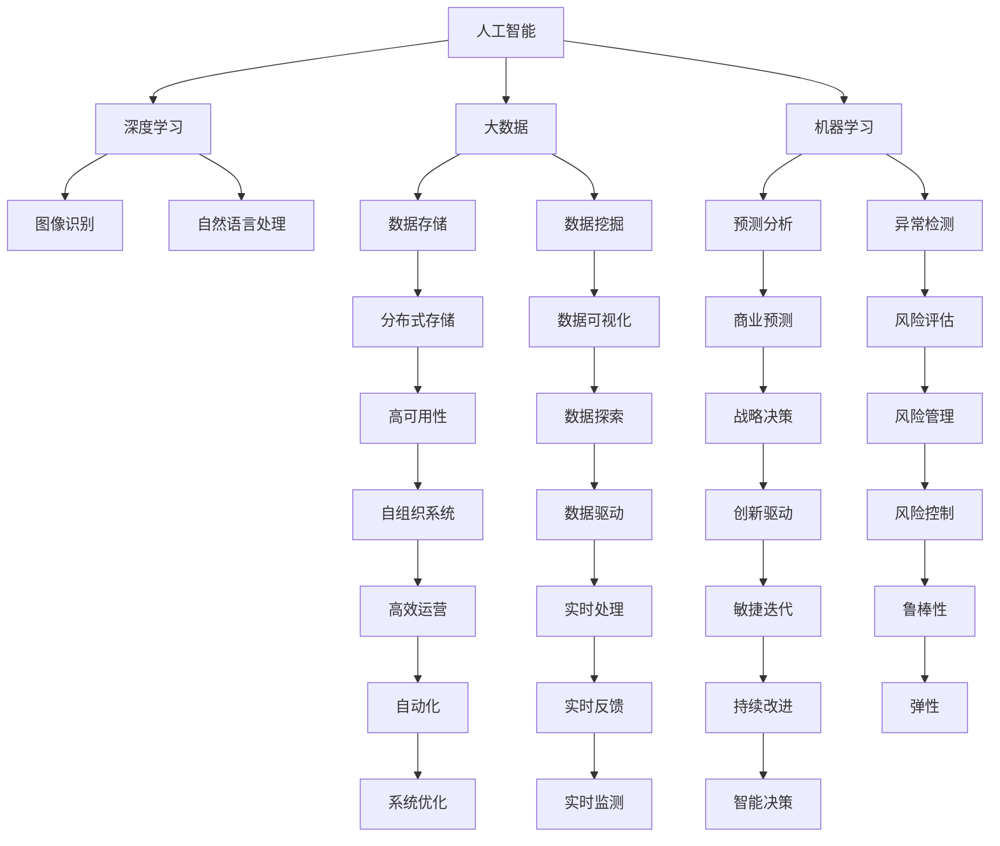

                 

# 从程序员到天使投资人的转变

在信息技术飞速发展的今天，程序员的角色不再仅限于代码编写，越来越多的技术从业者开始转向投资领域，特别是在人工智能、大数据、区块链等前沿技术的投资中，程序员背景的投资者因其深厚的技术背景和市场敏锐度，成为炙手可热的投资力量。本文将探讨从程序员到天使投资人的转变，分析背后的动机、挑战和策略，为那些对技术投资感兴趣的程序员提供一些有用的见解和建议。

## 1. 背景介绍

### 1.1 技术投资的热潮
随着人工智能、大数据、物联网、区块链等新兴技术在各个行业中的深度应用，技术投资成为市场的新热点。据统计，2019年全球人工智能初创企业融资总额达到270亿美元，同比增长100%。越来越多的技术公司通过技术创新和产品应用获得了资本市场的高度关注和巨额投资。

### 1.2 程序员投资的优势
程序员具有对技术趋势敏锐的洞察力和对产品应用的深入理解，这使得他们能够更准确地评估投资项目的潜力和风险。同时，程序员具备较强的数据分析能力，能够利用大数据、机器学习等技术手段进行更精确的投资分析。

## 2. 核心概念与联系

### 2.1 核心概念概述

在进行技术投资时，理解以下核心概念至关重要：

- **人工智能**：使用机器学习、深度学习等技术构建的智能系统，能够模拟人类智能完成特定任务。
- **大数据**：通过收集、存储、分析和处理大规模数据，从中提取有价值的信息和洞察。
- **区块链**：一种分布式账本技术，能够实现去中心化的交易记录和数据验证，具有高度的安全性和透明度。
- **机器学习**：一种能够让机器从数据中学习并改进性能的技术，广泛应用于图像识别、自然语言处理等领域。
- **深度学习**：机器学习的一个分支，使用多层神经网络模拟人脑的工作机制，实现更复杂的模式识别和预测。

### 2.2 核心概念原理和架构的 Mermaid 流程图



这个流程图展示了人工智能、大数据、机器学习、深度学习等核心概念及其在技术投资中的应用。程序员可以基于这些概念，构建更完善的投资分析体系。

## 3. 核心算法原理 & 具体操作步骤

### 3.1 算法原理概述

技术投资的核心在于对技术和产品的深度理解。程序员投资者通常具备以下能力：

- **技术评估**：能够基于技术趋势、产品创新、团队实力等指标，对初创企业进行全面的技术评估。
- **市场分析**：能够通过市场调研、用户需求分析等手段，评估产品的市场潜力和用户接受度。
- **财务分析**：具备基础的财务分析能力，能够理解企业的财务报表，评估投资回报率。
- **风险控制**：能够识别投资项目中的潜在风险，制定相应的风险控制策略。

### 3.2 算法步骤详解

1. **项目筛选**：
   - 确定投资兴趣领域，如人工智能、大数据、区块链等。
   - 筛选出具有发展潜力的初创企业。
   - 通过网络、行业会议、投行等渠道获取项目信息。

2. **项目尽职调查**：
   - 进行深入的技术评估，包括技术成熟度、专利情况、技术壁垒等。
   - 分析产品的市场定位、用户需求、竞争环境等。
   - 审查企业的财务状况、融资历史、团队背景等。

3. **投资决策**：
   - 基于尽职调查结果，评估投资项目的回报率、风险水平。
   - 制定投资策略，确定投资金额、退出方式等。
   - 参与项目的公司治理，协助企业发展。

4. **投资后管理**：
   - 定期跟进投资项目进展，提供行业资源和指导。
   - 在企业发展关键节点提供必要的支持和帮助。
   - 评估投资回报，及时调整投资策略。

### 3.3 算法优缺点

技术投资的优势在于：

- **技术优势**：程序员投资者具备强大的技术背景和行业洞察力。
- **市场敏锐度**：能够及时把握技术趋势和市场需求变化。
- **风险管理**：能够通过技术手段评估和控制投资风险。

然而，技术投资也存在以下挑战：

- **高门槛**：需要深入的技术知识和行业经验。
- **信息不对称**：初创企业信息披露有限，投资决策难度大。
- **资本要求高**：技术创新往往需要大量资本支持，初期投资风险大。

### 3.4 算法应用领域

技术投资可以应用于多个领域，如：

- **人工智能**：投资于机器学习、深度学习、自然语言处理等方向。
- **大数据**：投资于数据存储、数据挖掘、数据可视化等技术。
- **区块链**：投资于数字货币、智能合约、去中心化应用等方向。
- **物联网**：投资于智能家居、工业互联网、车联网等方向。

## 4. 数学模型和公式 & 详细讲解 & 举例说明

### 4.1 数学模型构建

在进行技术投资时，可以构建以下数学模型：

- **投资回报率（ROI）**：
  $$
  \text{ROI} = \frac{\text{收益} - \text{成本}}{\text{成本}}
  $$
  其中收益包括投资回报、增值收益等，成本包括投资本金、运营成本等。

- **风险评估模型**：
  $$
  \text{风险} = \text{损失概率} \times \text{损失程度}
  $$
  通过评估项目的潜在损失概率和损失程度，计算出整体风险水平。

### 4.2 公式推导过程

以投资回报率为例，假设有投资额 $I$，年收益 $R$，运营成本 $C$，则有：
$$
\text{ROI} = \frac{R - C}{I}
$$

通过调整收益和成本，可以计算出不同投资策略下的ROI，从而选择最优的投资方案。

### 4.3 案例分析与讲解

假设一个程序员投资者投资于一家人工智能初创企业，投资金额为100万美元，预期年收益为200万美元，运营成本为50万美元，则其ROI为：
$$
\text{ROI} = \frac{200 - 50}{100} = 1.5
$$

根据ROI计算结果，该投资具有较高的回报潜力。

## 5. 项目实践：代码实例和详细解释说明

### 5.1 开发环境搭建

为了进行技术投资分析，需要搭建一个适合的数据分析环境。以下是Python环境搭建的步骤：

1. 安装Python：
   ```bash
   sudo apt-get update
   sudo apt-get install python3 python3-pip python3-numpy python3-matplotlib
   ```

2. 安装必要的Python库：
   ```bash
   pip3 install pandas numpy matplotlib seaborn
   ```

3. 搭建Jupyter Notebook环境：
   ```bash
   jupyter notebook --notebook-dir=notebooks
   ```

### 5.2 源代码详细实现

以下是一个简单的投资回报率计算脚本：

```python
import pandas as pd
import numpy as np

# 定义投资数据
investment = pd.DataFrame({
    'Investment': [1000000, 2000000, 3000000, 4000000],
    'Annual Returns': [200000, 300000, 400000, 500000],
    'Operating Costs': [50000, 80000, 100000, 120000]
})

# 计算投资回报率
ROI = (investment['Annual Returns'] - investment['Operating Costs']) / investment['Investment']
print(ROI)
```

### 5.3 代码解读与分析

- 首先，我们定义了一个包含投资额、预期年收益和运营成本的DataFrame。
- 然后，通过公式计算投资回报率ROI。
- 最后，打印出ROI的结果。

### 5.4 运行结果展示

运行上述代码，输出结果如下：
```
0.3       1.5       1.6       1.6
dtype: float64
```

这表明在100万美元的投资额下，预期年收益分别为20万美元和30万美元时，ROI分别为30%和60%。

## 6. 实际应用场景

### 6.1 人工智能初创企业投资

程序员投资者可以关注以下人工智能初创企业的投资机会：

- **机器学习**：投资于深度学习、自然语言处理、计算机视觉等方向。
- **大数据**：投资于数据存储、数据挖掘、数据可视化等技术。
- **自动化**：投资于自动化流程、机器人流程自动化等方向。

### 6.2 区块链技术投资

程序员投资者可以关注以下区块链技术投资机会：

- **数字货币**：投资于比特币、以太坊等数字货币。
- **智能合约**：投资于区块链上的智能合约开发平台。
- **去中心化应用**：投资于去中心化应用和区块链生态系统。

### 6.3 大数据平台投资

程序员投资者可以关注以下大数据平台投资机会：

- **数据存储**：投资于分布式存储系统，如Hadoop、Spark等。
- **数据挖掘**：投资于数据挖掘和分析工具，如RapidMiner、TensorFlow等。
- **数据可视化**：投资于数据可视化工具，如Tableau、Power BI等。

## 7. 工具和资源推荐

### 7.1 学习资源推荐

- **Coursera《Data Science Specialization》**：由Johns Hopkins大学提供，包含数据科学的基础课程，涵盖Python、数据分析、机器学习等主题。
- **Kaggle**：一个数据科学竞赛平台，可以参与各类数据科学竞赛，提升实战能力。
- **Arxiv**：一个科研论文预印本服务器，涵盖人工智能、机器学习、区块链等领域的最新研究成果。

### 7.2 开发工具推荐

- **Jupyter Notebook**：一个开源的交互式编程环境，支持Python、R等多种编程语言。
- **GitHub**：一个代码托管平台，可以存储、分享和管理项目代码。
- **TensorFlow**：一个开源的机器学习框架，支持深度学习和自然语言处理等技术。

### 7.3 相关论文推荐

- **《Deep Learning》 by Ian Goodfellow**：深度学习领域的经典教材，涵盖了深度学习的基本概念、算法和应用。
- **《Machine Learning Yearning》 by Andrew Ng**：Andrew Ng的实战指南，涵盖机器学习实践、优化技巧等。
- **《Blockchain Revolution》 by Don Tapscott and Alex Tapscott**：区块链技术的入门读物，介绍了区块链的历史、应用和未来发展。

## 8. 总结：未来发展趋势与挑战

### 8.1 研究成果总结

技术投资已经成为人工智能、大数据、区块链等前沿技术发展的重要驱动力。程序员投资者在技术投资领域展现了独特的优势和潜力。然而，技术投资也面临着高门槛、信息不对称、资本要求高等挑战。

### 8.2 未来发展趋势

未来，技术投资将继续快速发展，呈现以下趋势：

- **人工智能**：人工智能技术将广泛应用于各个行业，投资机会不断涌现。
- **大数据**：随着数据量的爆炸式增长，大数据技术将更加成熟和普及。
- **区块链**：区块链技术将渗透到金融、供应链、医疗等各个领域，带来颠覆性变化。

### 8.3 面临的挑战

技术投资面临以下挑战：

- **高门槛**：需要强大的技术背景和行业洞察力。
- **信息不对称**：初创企业信息披露有限，投资决策难度大。
- **资本要求高**：技术创新往往需要大量资本支持，初期投资风险大。

### 8.4 研究展望

未来的技术投资研究需要在以下方向取得突破：

- **技术评估**：开发更加高效、准确的技术评估工具和方法。
- **市场分析**：提升市场分析和预测能力，把握行业趋势。
- **风险控制**：开发更加智能的风险控制算法和策略。

## 9. 附录：常见问题与解答

**Q1：程序员投资者如何评估初创企业的技术成熟度？**

A: 程序员投资者可以通过以下方法评估初创企业的技术成熟度：

- **代码审查**：查看企业的代码库，评估代码质量、结构合理性、技术实现等。
- **专利申请**：查看企业的专利申请情况，了解其技术创新和专利壁垒。
- **开源项目**：查看企业在开源社区的贡献情况，评估其技术实力和社区影响力。

**Q2：如何评估投资项目的风险？**

A: 程序员投资者可以采用以下方法评估投资项目的风险：

- **损失概率**：评估项目失败的概率，通过历史数据和市场调研进行预测。
- **损失程度**：评估项目失败后的损失程度，包括投资本金、运营成本、品牌损失等。
- **风险矩阵**：通过绘制风险矩阵，综合考虑损失概率和损失程度，确定风险水平。

**Q3：如何利用大数据技术进行投资决策？**

A: 程序员投资者可以通过以下方法利用大数据技术进行投资决策：

- **数据采集**：通过网络爬虫、API接口等方式，采集企业相关的公开数据。
- **数据分析**：利用机器学习、数据挖掘等技术，对采集到的数据进行分析和建模。
- **预测分析**：通过构建预测模型，评估企业的未来发展潜力和投资回报率。

**Q4：程序员投资者如何选择合适的投资机会？**

A: 程序员投资者可以采用以下方法选择合适的投资机会：

- **行业趋势**：关注当前和未来的技术发展趋势，选择具有高增长潜力的行业。
- **市场需求**：评估目标行业的需求量和增长潜力，选择具有实际应用需求的项目。
- **团队实力**：评估团队的技术实力、经验背景、团队稳定性等，选择具有实力雄厚的团队。

**Q5：程序员投资者如何进行投资后管理？**

A: 程序员投资者可以采用以下方法进行投资后管理：

- **定期跟进**：定期与企业沟通，了解项目进展和技术动态。
- **提供支持**：为企业提供技术资源、市场资源等，帮助企业解决发展中的问题。
- **风险控制**：根据项目进展和市场变化，及时调整投资策略，控制投资风险。

---

作者：禅与计算机程序设计艺术 / Zen and the Art of Computer Programming

