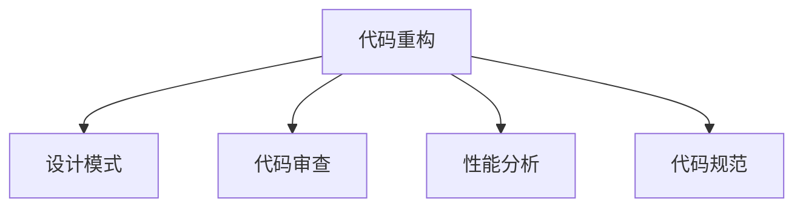

                 

# 代码重构的技巧与模式总结

> 关键词：代码重构, 模式总结, 技术提升, 代码优化, 软件工程

## 1. 背景介绍

在软件开发中，重构是提升代码质量和可维护性的重要手段。随着项目的演进，代码往往变得复杂、冗余、难以维护。通过有针对性地重构，不仅可以提升代码的可读性、可扩展性和可维护性，还能提升开发效率，减少未来的维护成本。

### 1.1 问题由来

重构并非简单地修改代码，而是针对代码结构进行系统的优化，以提升代码质量。在现代软件开发中，重构已成为项目迭代、版本升级的常态化工作。然而，对于新手而言，重构往往令人望而却步，存在“不知道从哪里下手”、“重构效果不明显”等问题。因此，有必要从系统性角度总结重构技巧和模式，帮助开发者更好地提升代码质量和开发效率。

### 1.2 问题核心关键点

重构的核心在于识别代码中的问题，找到合适的解决方案，并系统性地实施。关键点包括：
- 识别问题：通过代码审查、性能监控等手段发现问题。
- 设计方案：设计可行的重构方案，评估方案的影响。
- 实施方案：逐步实施重构，及时验证效果。
- 持续优化：定期回顾重构效果，不断迭代改进。

## 2. 核心概念与联系

### 2.1 核心概念概述

为更好地理解重构的原理和流程，本节将介绍几个关键概念：

- 代码重构(Code Refactoring)：指通过调整代码结构，提升代码质量、改善代码风格、提高代码可维护性的过程。
- 设计模式(Design Patterns)：指通用的、可复用的代码结构，解决特定问题。
- 代码审查(Code Review)：指通过多人的协同评审，检查代码的规范性、可读性、可维护性等。
- 性能分析(Performance Profiling)：指通过工具监控和分析代码性能，找出瓶颈和问题。
- 代码规范(Coding Standards)：指代码编写的基本规则，如命名规范、注释规范等。

这些核心概念之间相互联系，共同构成了重构的系统和逻辑框架：



这个流程图展示了一系列重构工作的基础环节：

1. 从设计模式、代码审查、性能分析、代码规范等方面识别问题。
2. 通过重构解决这些问题，提升代码质量。
3. 通过持续的代码审查和性能分析，确保重构效果持续提升。

## 3. 核心算法原理 & 具体操作步骤

### 3.1 算法原理概述

代码重构的本质是对代码结构的系统优化。其核心思想是通过简化复杂代码，增加代码的可读性、可维护性和可扩展性。常见的重构技巧包括函数拆分、变量重命名、类重组、循环优化等。

### 3.2 算法步骤详解

代码重构一般包括以下几个关键步骤：

**Step 1: 识别问题**
- 通过代码审查、静态分析工具等手段，识别代码中存在的问题。常见问题包括：冗余代码、函数过长、循环嵌套过深、类职责不明等。
- 收集这些问题，并将其按照影响范围、优先级等进行分类排序。

**Step 2: 设计方案**
- 针对每个问题，设计可行的重构方案。常用的重构模式包括函数拆分、变量重命名、类重组等。
- 对每个重构方案进行评估，考虑其影响范围、复杂度、风险等。

**Step 3: 实施方案**
- 逐步实施重构方案，确保每次重构都能提升代码质量。
- 每次重构后，进行回归测试，确保功能未受影响。
- 重构过程中，保持代码的版本控制，方便后续追溯和回滚。

**Step 4: 持续优化**
- 定期回顾重构效果，评估是否达到预期目标。
- 根据重构效果，进一步优化重构方案。
- 持续进行代码审查和性能分析，确保代码质量持续提升。

### 3.3 算法优缺点

代码重构的主要优点包括：
- 提升代码质量：简化复杂代码，增加代码的可读性、可维护性和可扩展性。
- 提高开发效率：减少未来的维护成本，提升代码的重用性。
- 促进团队协作：通过代码审查，提升团队的编码规范和开发水平。

重构的主要缺点包括：
- 可能引入新的问题：重构过程中，可能引入新的bug或性能问题。
- 需要时间和精力：重构需要投入大量的时间和精力，影响开发进度。
- 可能导致团队适应：重构涉及代码结构的改变，团队成员可能需要适应新的代码风格。

尽管存在这些局限性，但重构仍然是提升代码质量和开发效率的重要手段。合理运用重构技巧，可以显著提升代码的可维护性和开发效率。

### 3.4 算法应用领域

代码重构广泛应用于软件开发各个阶段，包括设计、开发、测试、维护等环节。常见的应用领域包括：

- 架构设计：通过重构优化架构设计，提升系统的可扩展性和可维护性。
- 功能开发：通过重构简化复杂功能，提升代码的可读性和可维护性。
- 性能优化：通过重构提升代码性能，减少资源消耗，提升用户体验。
- 代码审计：通过重构解决代码审计中发现的问题，提升代码质量。

## 4. 数学模型和公式 & 详细讲解 & 举例说明

### 4.1 数学模型构建

为了更好地理解代码重构的过程，本节将引入一些数学模型来描述重构效果和优化目标。

假设代码系统包含 $N$ 个函数，每个函数 $f_i$ 的时间复杂度为 $T_i$，空间复杂度为 $S_i$。通过重构，将函数 $f_i$ 拆分为 $F_i$ 个子函数 $f_{i,j}$，每个子函数的时间复杂度为 $T_{i,j}$，空间复杂度为 $S_{i,j}$。重构后的代码系统时间复杂度为 $T'$，空间复杂度为 $S'$。

定义 $C_i$ 为函数 $f_i$ 的代码长度，$C'$ 为重构后所有子函数的代码长度总和。

重构的目标是最大化代码质量，即提升可读性和可维护性，同时保持代码功能不变。优化目标为：

$$
\maximize C' \quad \text{subject to} \quad \sum_{i=1}^N T'_i \leq T \quad \text{and} \quad \sum_{i=1}^N S'_i \leq S
$$

其中 $T$ 和 $S$ 为代码系统的初始时间复杂度和空间复杂度。

### 4.2 公式推导过程

为了简化问题，我们假设每个子函数的时间复杂度和空间复杂度之和等于原函数的时间复杂度和空间复杂度，即：

$$
T_{i,j} + T_{i,j+1} + \ldots + T_{i,F_i} = T_i \quad \text{and} \quad S_{i,j} + S_{i,j+1} + \ldots + S_{i,F_i} = S_i
$$

则优化目标可以简化为：

$$
\maximize \sum_{i=1}^N F_iC' \quad \text{subject to} \quad \sum_{i=1}^N T'_i = T \quad \text{and} \quad \sum_{i=1}^N S'_i = S
$$

求解上述优化问题，可以找到最优的子函数个数 $F_i$ 和子函数代码长度 $C'_{i,j}$，使得重构后的代码系统满足时间复杂度和空间复杂度的要求，同时最大化代码长度 $C'$。

### 4.3 案例分析与讲解

下面以函数拆分为例，展示重构过程和优化目标的数学模型应用。

假设有一个函数 $f(x)$，包含多条复杂的逻辑判断和循环。将其拆分为 $F$ 个子函数 $f_1(x), f_2(x), \ldots, f_F(x)$，每个子函数的时间复杂度为 $T_j$，空间复杂度为 $S_j$，代码长度为 $C_j$。

根据上述优化目标，我们可以列出以下等式：

$$
\begin{aligned}
T' &= \sum_{j=1}^F T_j \\
S' &= \sum_{j=1}^F S_j \\
C' &= \sum_{j=1}^F C_j \\
\end{aligned}
$$

我们的目标是在满足时间复杂度和空间复杂度约束的前提下，最大化 $C'$。为了简化问题，我们假设每个子函数的时间复杂度和空间复杂度之和等于原函数的时间复杂度和空间复杂度，即：

$$
T_j = T_{f_i} \quad \text{and} \quad S_j = S_{f_i}
$$

则优化目标可以进一步简化为：

$$
\maximize C' = \sum_{j=1}^F C_j
$$

为了求解上述优化问题，可以使用线性规划或遗传算法等方法。求解后，可以得到最优的子函数个数 $F$ 和每个子函数的代码长度 $C_j$。通过这些参数，可以重构原始函数，优化代码结构，提升代码质量。

## 5. 项目实践：代码实例和详细解释说明

### 5.1 开发环境搭建

在进行代码重构实践前，我们需要准备好开发环境。以下是使用Python进行代码重构的Python开发环境配置流程：

1. 安装Python：从官网下载并安装最新版本的Python。
2. 安装IDE：如PyCharm、Visual Studio Code等，提供代码编辑和调试功能。
3. 安装版本控制工具：如Git，方便进行代码版本管理和重构追溯。
4. 安装静态分析工具：如Flake8、MyPy等，检查代码风格和类型错误。
5. 安装重构工具：如PyCharm的重构插件、Rope等，提供代码重构功能。

完成上述步骤后，即可在Python环境中开始重构实践。

### 5.2 源代码详细实现

下面以函数拆分为例，展示使用Python进行代码重构的详细实现。

假设有一个复杂函数 `complex_function`，包含多条复杂的逻辑判断和循环，代码如下：

```python
def complex_function(x):
    if x < 0:
        return -1 * x
    elif x == 0:
        return 0
    else:
        s = 0
        for i in range(1, x + 1):
            s += i
        return s
```

为了简化代码结构，我们可以将其拆分为两个子函数 `negative` 和 `summation`：

```python
def negative(x):
    if x < 0:
        return -1 * x
    else:
        return x

def summation(x):
    s = 0
    for i in range(1, x + 1):
        s += i
    return s

def complex_function(x):
    return negative(x) + summation(x)
```

接下来，我们可以使用静态分析工具检查重构后的代码是否符合规范，并使用版本控制工具记录重构过程。

### 5.3 代码解读与分析

让我们再详细解读一下关键代码的实现细节：

**复杂函数 `complex_function`**：
- 包含多条复杂的逻辑判断和循环，代码难以阅读和维护。

**拆分后的子函数 `negative` 和 `summation`**：
- 每个子函数功能单一，代码简洁易懂。
- 每个子函数的时间复杂度和空间复杂度与原函数相同，不会影响系统性能。

**重构后的 `complex_function`**：
- 通过调用两个子函数，将原函数的复杂逻辑拆分为两个独立的部分，提升代码的可读性和可维护性。
- 使用版本控制工具记录重构过程，方便后续追溯和回滚。

通过上述重构过程，我们可以看到，代码重构不仅可以提升代码质量，还能提高开发效率和可维护性。

## 6. 实际应用场景

### 6.1 软件开发

在软件开发中，重构是提升代码质量和开发效率的重要手段。通过重构，可以将复杂的代码结构简化，增加代码的可读性和可维护性，减少未来的维护成本。

在实际项目中，重构工作通常包括以下几个方面：

- 简化函数结构：将复杂的函数拆分为多个子函数，提升代码可读性和可维护性。
- 精简循环逻辑：优化循环结构，减少循环嵌套，提升代码效率。
- 优化类结构：重构类结构，使其职责明确，减少耦合度。
- 引入设计模式：通过引入设计模式，提升代码的可复用性和可扩展性。

### 6.2 系统维护

在系统维护中，重构是提升系统稳定性和可维护性的重要手段。通过重构，可以修复代码中的bug，优化系统性能，提升用户体验。

在实际系统维护中，重构工作通常包括以下几个方面：

- 修复bug：通过重构修复代码中的bug，提升系统稳定性。
- 优化性能：通过重构优化系统性能，减少资源消耗，提升用户体验。
- 升级技术：通过重构引入新技术，提升系统功能和性能。
- 改进设计：通过重构改进系统设计，提升系统的可维护性和可扩展性。

## 7. 工具和资源推荐

### 7.1 学习资源推荐

为了帮助开发者系统掌握代码重构的技巧和模式，这里推荐一些优质的学习资源：

1. 《重构：改善既有代码的设计》：Martin Fowler的经典著作，系统介绍了常见的重构技巧和模式。
2. 《设计模式：可复用面向对象软件的基础》：Erich Gamma等人的著作，全面介绍了23种经典的设计模式。
3. 《Effective Python》：通过代码实例展示了如何使用Python进行高效开发，提升代码质量。
4. 《Clean Code》：Robert C. Martin的经典著作，通过代码实例展示了如何编写清晰、可读性高的代码。
5. 《Code Complete》：Steve McConnell的经典著作，系统介绍了软件开发的各个方面，包括代码重构。

通过对这些资源的学习实践，相信你一定能够快速掌握代码重构的技巧和模式，提升代码质量和开发效率。

### 7.2 开发工具推荐

高效的开发离不开优秀的工具支持。以下是几款用于代码重构开发的常用工具：

1. PyCharm：功能强大的Python开发环境，内置重构工具，支持多种重构操作。
2. Visual Studio Code：轻量级的开源开发环境，支持多种编程语言，提供丰富的插件。
3. Git：版本控制工具，方便进行代码版本管理和重构追溯。
4. Flake8：静态分析工具，检查代码风格和类型错误，提供重构建议。
5. Rope：重构工具，提供多种重构操作，如重命名、拆分、移动等。
6. PyLint：静态分析工具，检查代码质量和风格，提供重构建议。

合理利用这些工具，可以显著提升代码重构的效率，加快创新迭代的步伐。

### 7.3 相关论文推荐

代码重构和设计模式是软件开发的重要研究方向，以下是几篇奠基性的相关论文，推荐阅读：

1. Refactoring: Improving the Design of Existing Code：Martin Fowler关于代码重构的总结，介绍了常见的重构技巧和模式。
2. Design Patterns: Elements of Reusable Object-Oriented Software：Erich Gamma等人的经典著作，全面介绍了23种经典的设计模式。
3. Code Refactoring for Maintainability in Object-Oriented Software：探讨了代码重构对软件维护性的影响，提供了重构效果评估方法。
4. Refactoring and Software Evolution：介绍了代码重构和软件演化的关系，探讨了重构对系统演化的影响。
5. The Next Generation of Reusable Software：探讨了如何通过重构和设计模式提升软件的可复用性。

这些论文代表了大规模软件开发中的重构和设计模式的研究脉络。通过学习这些前沿成果，可以帮助研究者把握学科前进方向，激发更多的创新灵感。

## 8. 总结：未来发展趋势与挑战

### 8.1 总结

本文对代码重构的技巧和模式进行了全面系统的介绍。首先阐述了代码重构的背景和意义，明确了重构在提升代码质量和开发效率方面的独特价值。其次，从原理到实践，详细讲解了重构的数学模型和关键步骤，给出了重构任务开发的完整代码实例。同时，本文还广泛探讨了重构方法在软件开发、系统维护等各个领域的实际应用，展示了重构范式的广泛应用前景。

通过本文的系统梳理，可以看到，代码重构是提升软件开发和系统维护质量的重要手段。通过系统识别问题、设计方案、实施方案、持续优化等步骤，可以显著提升代码的可读性、可维护性和可扩展性，减少未来的维护成本，提高开发效率。

### 8.2 未来发展趋势

展望未来，代码重构技术将呈现以下几个发展趋势：

1. 自动化重构：通过AI和机器学习技术，自动生成代码重构建议，减少人工干预，提升重构效率。
2. 智能重构：引入智能算法，对代码结构进行动态分析和优化，提升代码质量。
3. 基于模型的重构：通过代码模型分析，自动化生成重构方案，提升重构效果。
4. 跨语言重构：开发跨语言的代码重构工具，提升不同编程语言之间的代码互操作性。
5. 持续集成和部署：将重构集成到持续集成和部署流程中，确保重构效果持续提升。

以上趋势凸显了代码重构技术的广阔前景。这些方向的探索发展，必将进一步提升代码的可维护性和开发效率，加速软件开发和系统维护的迭代进程。

### 8.3 面临的挑战

尽管代码重构技术已经取得了显著进展，但在迈向更加智能化、普适化应用的过程中，它仍面临诸多挑战：

1. 重构成本高昂：重构需要大量时间和精力，影响开发进度。如何降低重构成本，提升重构效果，还需要更多研究和实践。
2. 重构效果不确定：重构过程中可能引入新的bug或性能问题，重构效果难以保证。如何提升重构效果，减少负面影响，需要更多的研究和验证。
3. 重构工具不足：虽然已有多种重构工具，但大多功能单一，难以满足复杂的需求。如何开发更智能、更全面的重构工具，还需要更多探索和实践。
4. 代码风格不统一：不同开发者有不同的编码风格，重构后的代码风格不统一，难以维护。如何规范代码风格，提升代码一致性，需要更多标准和规范。
5. 重构目标不明确：重构工作目标不明确，导致重构效果不佳。如何明确重构目标，提升重构价值，需要更多经验和实践。

正视重构面临的这些挑战，积极应对并寻求突破，将使代码重构技术更加成熟，为软件开发和系统维护提供强有力的保障。

### 8.4 研究展望

面对代码重构所面临的种种挑战，未来的研究需要在以下几个方面寻求新的突破：

1. 研究自动化重构技术：通过AI和机器学习技术，自动化生成代码重构建议，减少人工干预，提升重构效率。
2. 开发智能重构工具：引入智能算法，对代码结构进行动态分析和优化，提升重构效果。
3. 探索跨语言重构：开发跨语言的代码重构工具，提升不同编程语言之间的代码互操作性。
4. 规范代码风格：制定统一的代码风格规范，提升代码一致性。
5. 明确重构目标：明确重构工作目标，提升重构价值。

这些研究方向的探索，必将引领代码重构技术迈向更高的台阶，为软件开发和系统维护提供更加高效、可靠、可控的保障。面向未来，代码重构技术还需要与其他软件开发技术进行更深入的融合，如持续集成、自动化测试等，多路径协同发力，共同推动软件开发的持续进步。

## 9. 附录：常见问题与解答

**Q1：代码重构是否会破坏原有的功能？**

A: 重构的目的是提升代码质量和可维护性，并不会破坏原有的功能。在进行重构时，应确保重构前后的代码功能一致，避免引入新的bug或性能问题。

**Q2：重构是否会影响开发进度？**

A: 重构需要投入大量时间和精力，可能影响开发进度。但长期来看，重构可以提升代码质量，减少未来的维护成本，提升开发效率。

**Q3：如何识别代码中的问题？**

A: 通过代码审查、静态分析工具、性能分析工具等手段，识别代码中存在的问题，如冗余代码、函数过长、循环嵌套过深等。

**Q4：如何评估重构效果？**

A: 重构效果评估应从代码可读性、可维护性、可扩展性等多个方面进行综合评估，包括代码审查、性能测试、用户反馈等。

**Q5：如何进行跨语言重构？**

A: 跨语言重构需要开发跨语言的代码重构工具，支持多种编程语言之间的互操作性。可以参考Python的Jinja2模板引擎等工具，实现跨语言的代码生成和重构。

通过本文的系统梳理，可以看到，代码重构是提升软件开发和系统维护质量的重要手段。通过系统识别问题、设计方案、实施方案、持续优化等步骤，可以显著提升代码的可读性、可维护性和可扩展性，减少未来的维护成本，提高开发效率。面对重构面临的诸多挑战，未来的研究需要在自动化、智能化、跨语言、代码风格等方面进行深入探索，推动代码重构技术的持续进步。总之，重构需要开发者根据具体任务，不断迭代和优化，方能得到理想的效果。

---

作者：禅与计算机程序设计艺术 / Zen and the Art of Computer Programming

